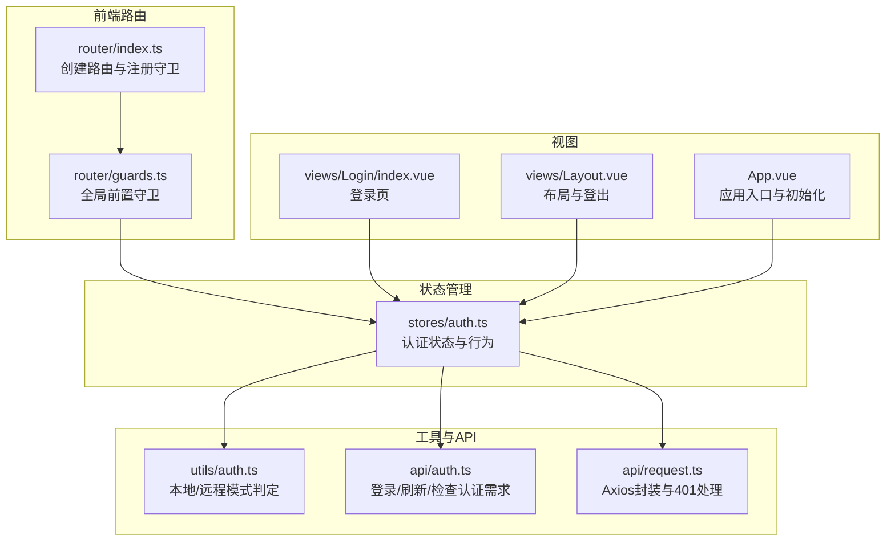
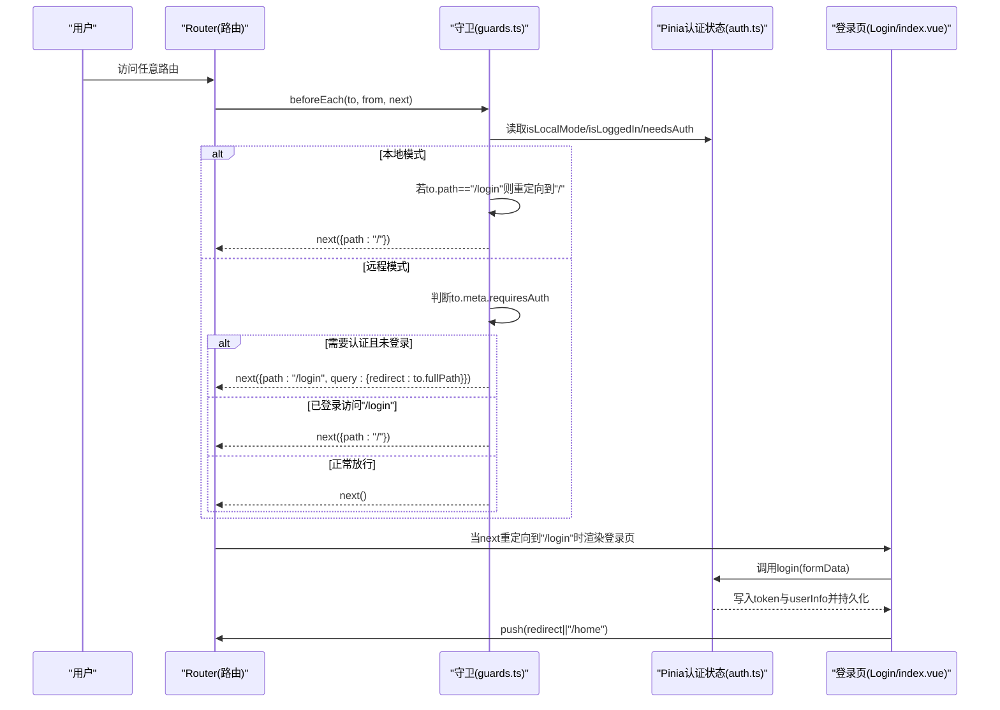
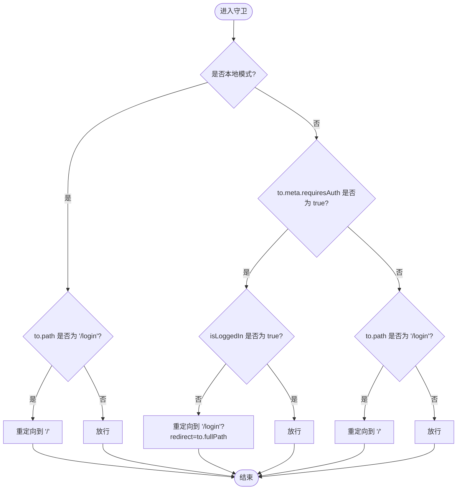
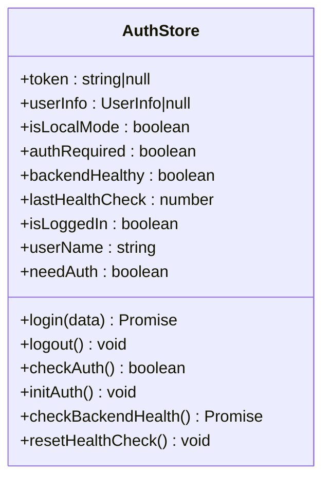
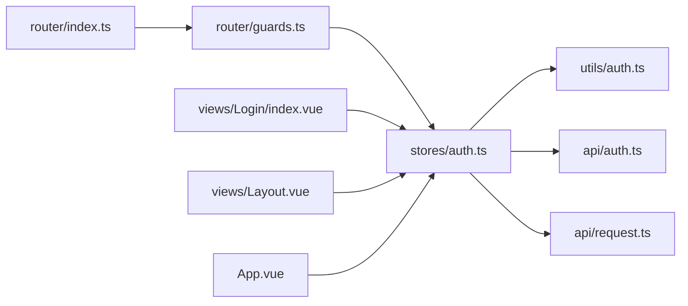

# 导航守卫

<cite>
**本文引用的文件**
- [guards.ts](file://src/frontEnd/src/router/guards.ts)
- [index.ts](file://src/frontEnd/src/router/index.ts)
- [auth.ts](file://src/frontEnd/src/stores/auth.ts)
- [auth.ts](file://src/frontEnd/src/utils/auth.ts)
- [auth.ts](file://src/frontEnd/src/api/auth.ts)
- [request.ts](file://src/frontEnd/src/api/request.ts)
- [index.vue](file://src/frontEnd/src/views/Login/index.vue)
- [App.vue](file://src/frontEnd/src/App.vue)
- [Layout.vue](file://src/frontEnd/src/views/Layout.vue)
</cite>

## 目录
1. [简介](#简介)
2. [项目结构](#项目结构)
3. [核心组件](#核心组件)
4. [架构总览](#架构总览)
5. [详细组件分析](#详细组件分析)
6. [依赖关系分析](#依赖关系分析)
7. [性能考量](#性能考量)
8. [故障排查指南](#故障排查指南)
9. [结论](#结论)

## 简介
本文件聚焦于sqlmapWebUI前端的导航守卫实现，系统性解析authenticationGuard（即全局前置守卫）的工作机制。重点包括：
- 如何通过Pinia状态管理检查用户认证状态
- 在未登录时重定向到登录页面的策略
- 全局前置守卫的注册与执行流程
- 守卫函数的异步处理与执行顺序
- 权限验证逻辑：基于路由元信息requiresAuth的访问控制
- 中断、重定向与放行的三种处理方式示例路径
- 执行顺序与潜在性能影响
- 避免无限重定向循环的策略
- 登录页面的特殊处理：已认证用户不应再次访问登录页

## 项目结构
导航守卫位于前端路由模块中，配合Pinia状态管理与后端API拦截器共同完成认证与权限控制。

图表来源
- [index.ts](file://src/frontEnd/src/router/index.ts#L1-L77)
- [guards.ts](file://src/frontEnd/src/router/guards.ts#L1-L47)
- [auth.ts](file://src/frontEnd/src/stores/auth.ts#L1-L175)
- [auth.ts](file://src/frontEnd/src/utils/auth.ts#L1-L45)
- [auth.ts](file://src/frontEnd/src/api/auth.ts#L1-L34)
- [request.ts](file://src/frontEnd/src/api/request.ts#L1-L231)
- [index.vue](file://src/frontEnd/src/views/Login/index.vue#L1-L94)
- [Layout.vue](file://src/frontEnd/src/views/Layout.vue#L1-L247)
- [App.vue](file://src/frontEnd/src/App.vue#L1-L33)

章节来源
- [index.ts](file://src/frontEnd/src/router/index.ts#L1-L77)
- [guards.ts](file://src/frontEnd/src/router/guards.ts#L1-L47)

## 核心组件
- 全局前置守卫：在路由切换前统一检查认证状态与目标路由权限要求，决定放行、重定向或中断。
- Pinia认证状态：集中管理token、用户信息、本地/远程模式、是否需要认证等。
- 登录页与布局：登录页负责认证成功后的重定向；布局提供登出入口并触发守卫逻辑。

章节来源
- [guards.ts](file://src/frontEnd/src/router/guards.ts#L1-L47)
- [auth.ts](file://src/frontEnd/src/stores/auth.ts#L1-L175)
- [index.vue](file://src/frontEnd/src/views/Login/index.vue#L1-L94)
- [Layout.vue](file://src/frontEnd/src/views/Layout.vue#L170-L190)

## 架构总览
导航守卫的整体工作流如下：

图表来源
- [guards.ts](file://src/frontEnd/src/router/guards.ts#L11-L46)
- [auth.ts](file://src/frontEnd/src/stores/auth.ts#L55-L81)
- [index.vue](file://src/frontEnd/src/views/Login/index.vue#L43-L54)

## 详细组件分析

### 全局前置守卫（beforeEach）实现与执行流程
- 注册位置：在路由创建后立即调用守卫注册函数，确保所有导航均受控。
- 执行时机：每次路由切换前触发，接收目标路由、来源路由与next回调。
- 本地/远程双模式：
  - 本地模式：直接放行；若访问“/login”，重定向到“/”。
  - 远程模式：依据路由元信息requiresAuth与Pinia状态isLoggedIn决定重定向或放行。
- 登录页特殊处理：已登录用户访问“/login”时重定向至“/”。

图表来源
- [guards.ts](file://src/frontEnd/src/router/guards.ts#L11-L46)

章节来源
- [guards.ts](file://src/frontEnd/src/router/guards.ts#L11-L46)
- [index.ts](file://src/frontEnd/src/router/index.ts#L55-L65)

### Pinia认证状态管理（useAuthStore）
- 状态与计算属性：
  - isLocalMode：基于本地访问判定工具函数确定。
  - authRequired：基于后端是否需要认证的接口返回。
  - isLoggedIn：本地模式恒为true；远程模式基于token是否存在。
  - needAuth：isLocalMode为false且authRequired为true时才需要认证。
- 行为：
  - login：远程模式调用后端登录接口，成功后写入token与用户信息并持久化。
  - logout：清空token与用户信息并移除持久化。
  - checkAuth：返回当前认证状态。
  - initAuth：初始化时检测访问模式与认证需求，并恢复持久化的token与用户信息。
  - checkBackendHealth：周期性检查后端健康状态，用于优化网络交互与错误提示。

图表来源
- [auth.ts](file://src/frontEnd/src/stores/auth.ts#L1-L175)

章节来源
- [auth.ts](file://src/frontEnd/src/stores/auth.ts#L1-L175)
- [auth.ts](file://src/frontEnd/src/utils/auth.ts#L1-L45)
- [auth.ts](file://src/frontEnd/src/api/auth.ts#L1-L34)
- [request.ts](file://src/frontEnd/src/api/request.ts#L1-L231)

### 登录页与重定向逻辑
- 登录页在提交表单后调用认证状态store的login方法，成功后读取路由查询参数redirect（若存在），否则默认跳转到“/home”。
- 守卫在远程模式下，当需要认证而未登录时，会将原始目标路由作为查询参数redirect传给登录页，从而实现“先登录再回到原页面”的体验。

章节来源
- [index.vue](file://src/frontEnd/src/views/Login/index.vue#L43-L54)
- [guards.ts](file://src/frontEnd/src/router/guards.ts#L33-L39)

### 布局中的登出与守卫联动
- 布局页提供登出按钮，点击后调用认证状态store的logout并重定向到“/login”，这会触发守卫逻辑，使后续访问被重定向到登录页。

章节来源
- [Layout.vue](file://src/frontEnd/src/views/Layout.vue#L181-L185)

### 401错误与后端拦截器的协同
- Axios请求拦截器在远程模式下自动附加Authorization头；响应拦截器对401错误进行处理：清除本地认证信息并提示用户重新登录。
- 这与守卫形成互补：守卫负责“导航前”的访问控制，拦截器负责“请求阶段”的认证校验与清理。

章节来源
- [request.ts](file://src/frontEnd/src/api/request.ts#L100-L115)
- [request.ts](file://src/frontEnd/src/api/request.ts#L160-L180)

## 依赖关系分析
- 路由注册依赖守卫：路由创建后立即注册守卫，保证全局生效。
- 守卫依赖Pinia状态：守卫通过useAuthStore读取isLocalMode、isLoggedIn、needAuth等状态。
- 认证状态依赖工具与API：isLocalMode依赖本地访问判定；login依赖后端登录接口；后端健康检查用于优化交互。
- 视图依赖状态：登录页与布局依赖认证状态进行渲染与交互。

图表来源
- [index.ts](file://src/frontEnd/src/router/index.ts#L1-L77)
- [guards.ts](file://src/frontEnd/src/router/guards.ts#L1-L47)
- [auth.ts](file://src/frontEnd/src/stores/auth.ts#L1-L175)
- [auth.ts](file://src/frontEnd/src/utils/auth.ts#L1-L45)
- [auth.ts](file://src/frontEnd/src/api/auth.ts#L1-L34)
- [request.ts](file://src/frontEnd/src/api/request.ts#L1-L231)
- [index.vue](file://src/frontEnd/src/views/Login/index.vue#L1-L94)
- [Layout.vue](file://src/frontEnd/src/views/Layout.vue#L1-L247)
- [App.vue](file://src/frontEnd/src/App.vue#L1-L33)

## 性能考量
- 守卫执行开销：守卫仅做轻量级判断（本地/远程模式、requiresAuth、isLoggedIn），无昂贵操作，对性能影响可忽略。
- 异步处理：守卫本身同步执行，但login方法为异步；登录成功后的重定向发生在登录页组件内，属于用户交互驱动，不影响守卫性能。
- 后端健康检查：认证状态store内置健康检查，避免频繁请求后端；守卫不直接发起健康检查，降低额外开销。
- 重定向链路：守卫只在必要时重定向，且重定向路径固定，避免复杂计算。

## 故障排查指南
- 无限重定向循环排查
  - 症状：浏览器不断在“/login”与“/”之间跳转。
  - 排查要点：
    - 确认isLocalMode与authRequired的初始值是否正确（App挂载时会调用initAuth恢复状态）。
    - 确认登录成功后是否正确写入token与userInfo并持久化。
    - 确认登录页在登录成功后是否使用redirect或默认路径进行push。
    - 确认路由元信息requiresAuth是否按预期设置。
  - 关联文件：
    - [App.vue](file://src/frontEnd/src/App.vue#L15-L17)
    - [auth.ts](file://src/frontEnd/src/stores/auth.ts#L92-L103)
    - [index.vue](file://src/frontEnd/src/views/Login/index.vue#L43-L54)
    - [guards.ts](file://src/frontEnd/src/router/guards.ts#L33-L44)

- 401错误导致的异常登出
  - 症状：已登录用户在访问某些接口时被重定向到登录页。
  - 排查要点：
    - Axios响应拦截器在远程模式下遇到401会清除本地认证信息并提示。
    - 确认后端返回的401是否符合预期（如token过期）。
  - 关联文件：
    - [request.ts](file://src/frontEnd/src/api/request.ts#L160-L180)

- 登录页仍被重定向到登录页
  - 症状：已登录用户访问“/login”仍被重定向。
  - 排查要点：
    - 守卫对“/login”与已登录状态有专门分支，应重定向到“/”。
  - 关联文件：
    - [guards.ts](file://src/frontEnd/src/router/guards.ts#L39-L44)

## 结论
sqlmapWebUI的导航守卫通过“本地/远程双模式”与Pinia状态管理实现了清晰、可维护的认证与权限控制：
- 守卫在路由切换前统一决策，逻辑简单明确，易于扩展。
- 登录页与守卫配合，实现“先登录再回到原页面”的良好用户体验。
- 后端拦截器与守卫相互补充，既保障导航安全，也保障请求安全。
- 通过合理的重定向策略与状态初始化，有效避免了无限重定向循环。
- 性能方面，守卫与状态检查均为轻量操作，整体开销可控。