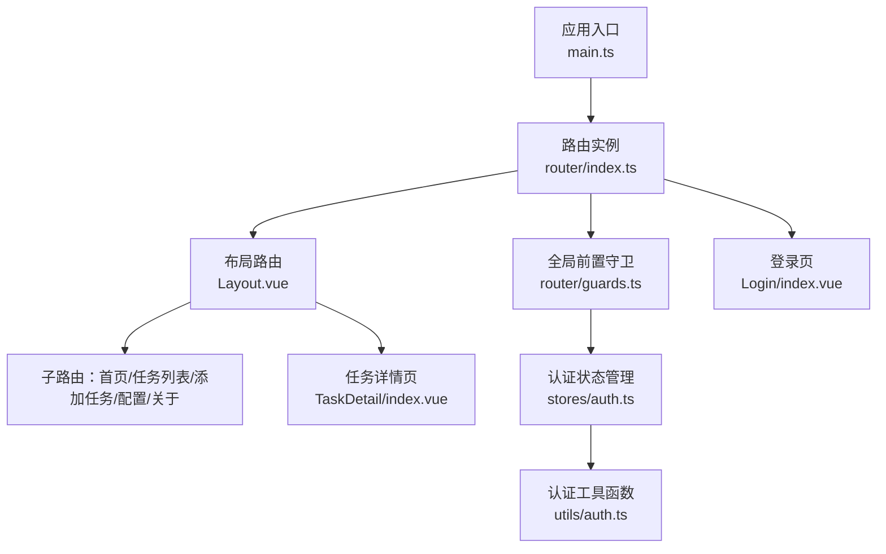
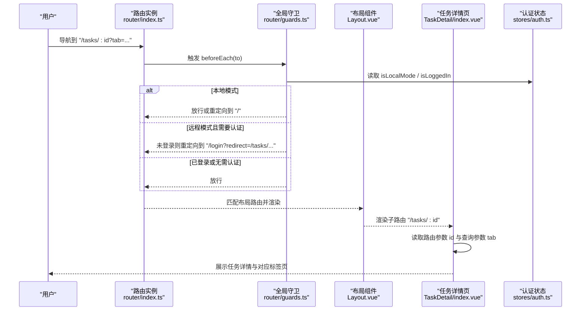
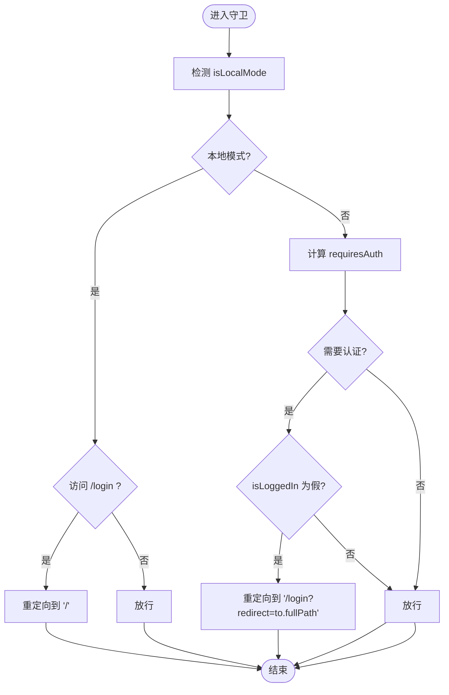
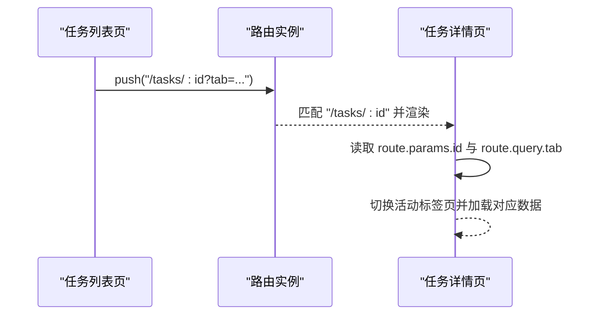
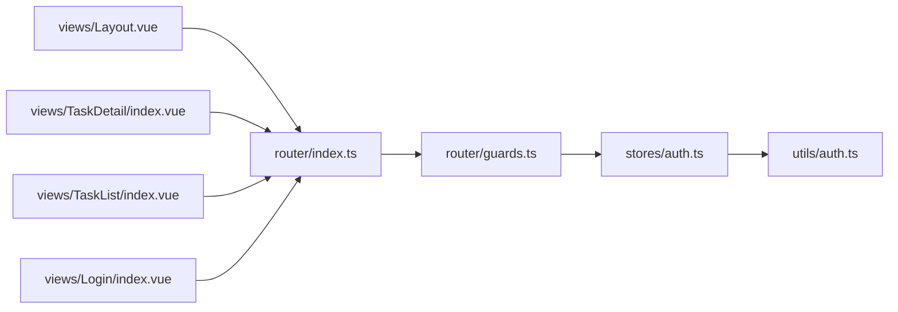

# 路由系统

<cite>
**本文引用的文件**
- [路由配置与入口](file://src/frontEnd/src/router/index.ts)
- [路由守卫](file://src/frontEnd/src/router/guards.ts)
- [应用入口](file://src/frontEnd/src/main.ts)
- [布局组件](file://src/frontEnd/src/views/Layout.vue)
- [登录页](file://src/frontEnd/src/views/Login/index.vue)
- [任务详情页](file://src/frontEnd/src/views/TaskDetail/index.vue)
- [任务列表页](file://src/frontEnd/src/views/TaskList/index.vue)
- [认证状态管理](file://src/frontEnd/src/stores/auth.ts)
- [认证工具函数](file://src/frontEnd/src/utils/auth.ts)
</cite>

## 目录
1. [简介](#简介)
2. [项目结构](#项目结构)
3. [核心组件](#核心组件)
4. [架构总览](#架构总览)
5. [详细组件分析](#详细组件分析)
6. [依赖分析](#依赖分析)
7. [性能考虑](#性能考虑)
8. [故障排查指南](#故障排查指南)
9. [结论](#结论)

## 简介
本文件系统性梳理 sqlmapWebUI 前端的路由体系，围绕 Vue Router 在该工程中的配置与应用展开，重点覆盖：
- 路由配置结构：根路由、布局路由与页面路由的嵌套关系
- 路由守卫：authenticationGuard 的实现逻辑与拦截策略
- 动态路由与参数传递：任务详情页的动态匹配与查询参数驱动的标签页切换
- 路由懒加载：通过动态 import 优化首屏加载
- 路由元信息：页面标题与权限要求的声明方式
- 路由流程图：用户导航过程中的路由解析与组件渲染流程
- 实际示例路径：路由配置、守卫实现与编程式导航的使用位置

## 项目结构
前端路由相关的核心文件分布如下：
- 路由配置与入口：src/frontEnd/src/router/index.ts
- 路由守卫：src/frontEnd/src/router/guards.ts
- 应用入口：src/frontEnd/src/main.ts
- 布局组件：src/frontEnd/src/views/Layout.vue
- 登录页：src/frontEnd/src/views/Login/index.vue
- 任务详情页：src/frontEnd/src/views/TaskDetail/index.vue
- 任务列表页：src/frontEnd/src/views/TaskList/index.vue
- 认证状态管理：src/frontEnd/src/stores/auth.ts
- 认证工具函数：src/frontEnd/src/utils/auth.ts

图表来源
- [应用入口](file://src/frontEnd/src/main.ts#L1-L16)
- [路由配置与入口](file://src/frontEnd/src/router/index.ts#L1-L77)
- [路由守卫](file://src/frontEnd/src/router/guards.ts#L1-L47)
- [布局组件](file://src/frontEnd/src/views/Layout.vue#L1-L248)
- [登录页](file://src/frontEnd/src/views/Login/index.vue#L1-L94)
- [任务详情页](file://src/frontEnd/src/views/TaskDetail/index.vue#L1-L301)
- [任务列表页](file://src/frontEnd/src/views/TaskList/index.vue#L1-L630)
- [认证状态管理](file://src/frontEnd/src/stores/auth.ts#L1-L175)
- [认证工具函数](file://src/frontEnd/src/utils/auth.ts#L1-L45)

章节来源
- [应用入口](file://src/frontEnd/src/main.ts#L1-L16)
- [路由配置与入口](file://src/frontEnd/src/router/index.ts#L1-L77)

## 核心组件
- 路由配置与入口：集中定义路由表、历史模式、懒加载组件与全局守卫注册。
- 路由守卫：基于 Pinia 认证状态与访问模式，统一拦截未授权访问与登录页重定向。
- 布局组件：承载导航栏、内容区与过渡动画，作为所有受保护页面的容器。
- 登录页：接收 redirect 查询参数，完成认证后回到原目标。
- 任务详情页：通过动态路由参数与查询参数控制标签页展示。
- 认证状态管理：封装本地/远程两种访问模式，提供登录、登出与健康检查能力。
- 认证工具函数：判定本地访问与是否需要认证。

章节来源
- [路由配置与入口](file://src/frontEnd/src/router/index.ts#L1-L77)
- [路由守卫](file://src/frontEnd/src/router/guards.ts#L1-L47)
- [布局组件](file://src/frontEnd/src/views/Layout.vue#L1-L248)
- [登录页](file://src/frontEnd/src/views/Login/index.vue#L1-L94)
- [任务详情页](file://src/frontEnd/src/views/TaskDetail/index.vue#L1-L301)
- [认证状态管理](file://src/frontEnd/src/stores/auth.ts#L1-L175)
- [认证工具函数](file://src/frontEnd/src/utils/auth.ts#L1-L45)

## 架构总览
路由系统采用“布局路由 + 子路由”的嵌套结构，受保护页面均位于布局路由之下；通过全局前置守卫实现统一鉴权；使用动态 import 实现按需加载；通过路由元信息声明页面标题与权限要求；通过编程式导航在页面间传递参数。

图表来源
- [路由配置与入口](file://src/frontEnd/src/router/index.ts#L1-L77)
- [路由守卫](file://src/frontEnd/src/router/guards.ts#L1-L47)
- [布局组件](file://src/frontEnd/src/views/Layout.vue#L1-L248)
- [任务详情页](file://src/frontEnd/src/views/TaskDetail/index.vue#L1-L301)
- [认证状态管理](file://src/frontEnd/src/stores/auth.ts#L1-L175)

## 详细组件分析

### 路由配置与嵌套关系
- 根路由与布局路由
  - 根路径 "/" 定义名为 "layout" 的布局路由，redirect 到 "/home"，children 中包含多个子路由。
  - 布局路由的 children 为受保护页面集合，统一通过 meta.requiresAuth 控制鉴权。
- 页面路由
  - "/home"、"/tasks"、"/tasks/:id"、"/config"、"/add-task"、"/about" 均为布局路由的子路由。
  - "/login" 为独立路由，meta.requiresAuth 设为 false，允许未登录访问。
  - 通配符路由 ":pathMatch(.*)*" 重定向到 "/home"，避免无效路径导致白屏。
- 路由懒加载
  - 所有页面组件均通过动态 import 延迟加载，提升首屏性能。
- 路由元信息
  - 每个路由通过 meta 字段声明 title（页面标题）与 requiresAuth（是否需要认证）。

章节来源
- [路由配置与入口](file://src/frontEnd/src/router/index.ts#L1-L77)

### 路由守卫与 authenticationGuard
- 本地访问模式
  - 当 isLocalMode 为真时，守卫直接放行；若访问 "/login"，则重定向到 "/"。
- 远程访问模式
  - 若 to.meta.requiresAuth !== false 且 isLoggedIn 为假，则重定向到 "/login" 并携带 redirect 参数。
  - 若访问 "/login" 且已登录，则重定向到 "/"。
  - 其他情况放行。
- 与认证状态的耦合
  - 守卫依赖 useAuthStore 的 isLocalMode 与 isLoggedIn，后者在本地模式下恒为真，在远程模式下依赖 token。

图表来源
- [路由守卫](file://src/frontEnd/src/router/guards.ts#L1-L47)
- [认证状态管理](file://src/frontEnd/src/stores/auth.ts#L1-L175)

章节来源
- [路由守卫](file://src/frontEnd/src/router/guards.ts#L1-L47)
- [认证状态管理](file://src/frontEnd/src/stores/auth.ts#L1-L175)
- [认证工具函数](file://src/frontEnd/src/utils/auth.ts#L1-L45)

### 动态路由与参数传递（任务详情页）
- 动态路由匹配
  - "/tasks/:id" 定义动态参数 id，任务详情页通过 useRoute 读取该参数进行数据加载。
- 查询参数驱动标签页
  - 任务详情页监听 route.query.tab，并将其绑定到活动标签页，实现从任务列表或其他页面跳转时直接定位到特定标签页。
- 编程式导航示例
  - 任务列表页在点击“查看任务日志/扫描结果/错误记录”等操作时，使用 router.push 或 router.replace 将路径与查询参数组合，实现精准跳转。
  - 登录页在认证成功后读取 route.query.redirect，若不存在则默认跳转到 "/home"。

图表来源
- [任务列表页](file://src/frontEnd/src/views/TaskList/index.vue#L1-L630)
- [任务详情页](file://src/frontEnd/src/views/TaskDetail/index.vue#L1-L301)
- [路由配置与入口](file://src/frontEnd/src/router/index.ts#L1-L77)

章节来源
- [任务列表页](file://src/frontEnd/src/views/TaskList/index.vue#L1-L630)
- [任务详情页](file://src/frontEnd/src/views/TaskDetail/index.vue#L1-L301)
- [登录页](file://src/frontEnd/src/views/Login/index.vue#L1-L94)

### 路由懒加载策略
- 路由表中所有页面组件均通过动态 import 延迟加载，避免首屏加载过多资源。
- 结合浏览器缓存与打包器的分包策略，进一步降低首次渲染时间。
- 布局组件内的 router-view 使用过渡动画，提升页面切换体验。

章节来源
- [路由配置与入口](file://src/frontEnd/src/router/index.ts#L1-L77)
- [布局组件](file://src/frontEnd/src/views/Layout.vue#L1-L248)

### 路由元信息（meta fields）
- title：用于标识页面标题，便于后续国际化或浏览器标签页显示。
- requiresAuth：用于全局守卫判断是否需要认证，从而决定拦截或放行。

章节来源
- [路由配置与入口](file://src/frontEnd/src/router/index.ts#L1-L77)

### 编程式导航与用户交互
- 布局组件提供编程式导航方法 navigateTo，统一处理路由跳转与键盘快捷键。
- 登录页在认证成功后根据 redirect 参数决定跳转目标。
- 任务列表页在多种场景下使用 router.push/router.replace 实现精准跳转与参数传递。

章节来源
- [布局组件](file://src/frontEnd/src/views/Layout.vue#L1-L248)
- [登录页](file://src/frontEnd/src/views/Login/index.vue#L1-L94)
- [任务列表页](file://src/frontEnd/src/views/TaskList/index.vue#L1-L630)

## 依赖分析
- 路由配置依赖：
  - 路由表依赖 Vue Router 的 createRouter/createWebHistory 与 RouteRecordRaw 类型。
  - 全局守卫依赖 Pinia 认证状态管理 useAuthStore。
- 认证状态管理依赖：
  - 本地/远程访问模式检测工具函数 isLocalAccess/isAuthRequired。
  - Token 与用户信息持久化工具。
- 页面组件依赖：
  - 任务详情页依赖 useRoute/useRouter 读取参数与执行导航。
  - 任务列表页依赖 router.push/router.replace 与路由查询参数。

图表来源
- [路由配置与入口](file://src/frontEnd/src/router/index.ts#L1-L77)
- [路由守卫](file://src/frontEnd/src/router/guards.ts#L1-L47)
- [认证状态管理](file://src/frontEnd/src/stores/auth.ts#L1-L175)
- [认证工具函数](file://src/frontEnd/src/utils/auth.ts#L1-L45)
- [布局组件](file://src/frontEnd/src/views/Layout.vue#L1-L248)
- [任务详情页](file://src/frontEnd/src/views/TaskDetail/index.vue#L1-L301)
- [任务列表页](file://src/frontEnd/src/views/TaskList/index.vue#L1-L630)
- [登录页](file://src/frontEnd/src/views/Login/index.vue#L1-L94)

章节来源
- [路由配置与入口](file://src/frontEnd/src/router/index.ts#L1-L77)
- [路由守卫](file://src/frontEnd/src/router/guards.ts#L1-L47)
- [认证状态管理](file://src/frontEnd/src/stores/auth.ts#L1-L175)
- [认证工具函数](file://src/frontEnd/src/utils/auth.ts#L1-L45)

## 性能考虑
- 路由懒加载：通过动态 import 将页面组件拆分为独立 chunk，仅在访问时加载，显著降低首屏体积。
- 布局过渡动画：router-view 内的过渡效果在页面切换时提供平滑体验，同时不会阻塞关键渲染。
- 本地模式优化：本地访问时守卫直接放行，避免不必要的鉴权检查与网络请求。
- 轮询与导航解耦：页面内轮询逻辑与路由导航相互独立，避免因导航频繁触发导致的重复请求。

[本节为通用建议，无需列出具体文件来源]

## 故障排查指南
- 无法访问受保护页面
  - 检查 isLocalMode 与 isLoggedIn 的状态来源，确认是否处于远程模式且未登录。
  - 查看守卫逻辑中 redirect 参数是否正确传入。
- 登录后未回到原页面
  - 确认登录页是否读取并使用了 route.query.redirect。
- 任务详情页标签页未正确显示
  - 检查路由查询参数 tab 是否随导航传递，以及任务详情页是否监听并应用该参数。
- 本地模式仍被拦截
  - 确认 isLocalAccess 判定逻辑与环境变量是否符合预期。

章节来源
- [路由守卫](file://src/frontEnd/src/router/guards.ts#L1-L47)
- [登录页](file://src/frontEnd/src/views/Login/index.vue#L1-L94)
- [任务详情页](file://src/frontEnd/src/views/TaskDetail/index.vue#L1-L301)
- [认证状态管理](file://src/frontEnd/src/stores/auth.ts#L1-L175)
- [认证工具函数](file://src/frontEnd/src/utils/auth.ts#L1-L45)

## 结论
sqlmapWebUI 的路由系统以 Vue Router 为核心，采用“布局路由 + 子路由”的清晰嵌套结构，结合全局前置守卫实现了本地/远程双模式下的统一鉴权；通过动态 import 与路由元信息提升了性能与可维护性；任务详情页利用动态路由参数与查询参数实现了灵活的导航与标签页切换。整体设计兼顾易用性与扩展性，适合在多页面、多权限场景下稳定运行。