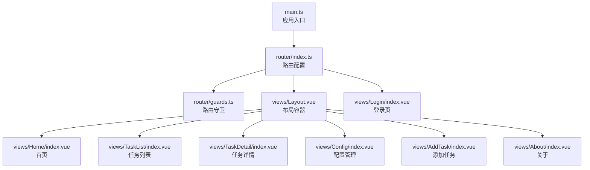
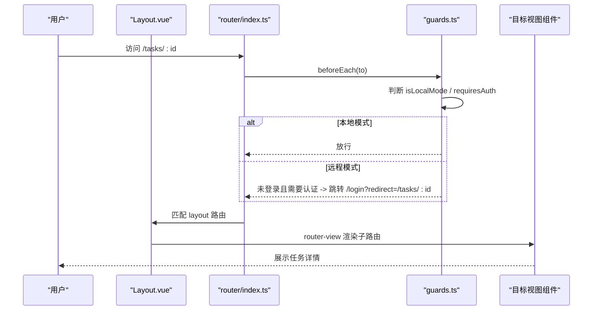
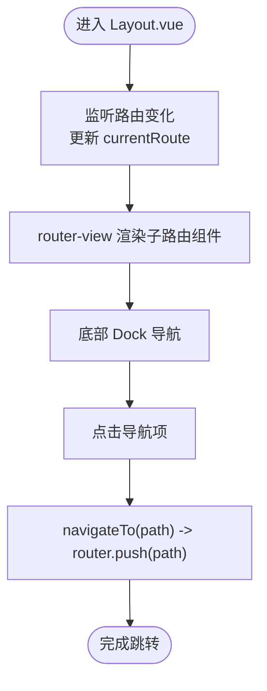
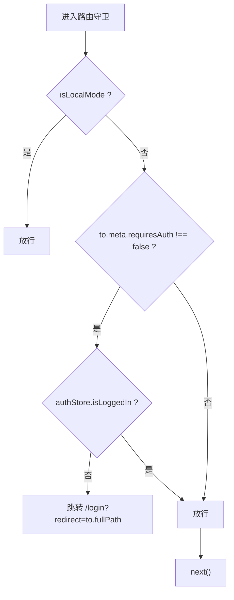
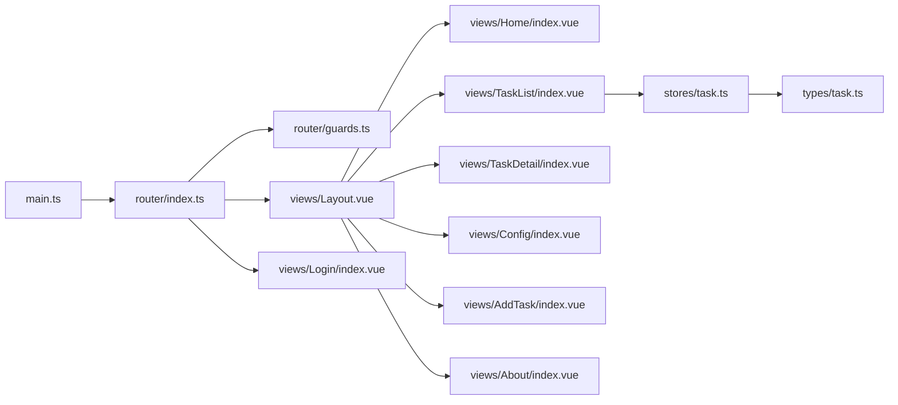

# 路由配置

<cite>
**本文档引用的文件**
- [router/index.ts](file://src/frontEnd/src/router/index.ts)
- [router/guards.ts](file://src/frontEnd/src/router/guards.ts)
- [views/Layout.vue](file://src/frontEnd/src/views/Layout.vue)
- [views/Home/index.vue](file://src/frontEnd/src/views/Home/index.vue)
- [views/TaskList/index.vue](file://src/frontEnd/src/views/TaskList/index.vue)
- [views/TaskDetail/index.vue](file://src/frontEnd/src/views/TaskDetail/index.vue)
- [views/Config/index.vue](file://src/frontEnd/src/views/Config/index.vue)
- [views/AddTask/index.vue](file://src/frontEnd/src/views/AddTask/index.vue)
- [views/About/index.vue](file://src/frontEnd/src/views/About/index.vue)
- [views/Login/index.vue](file://src/frontEnd/src/views/Login/index.vue)
- [main.ts](file://src/frontEnd/src/main.ts)
- [stores/task.ts](file://src/frontEnd/src/stores/task.ts)
- [types/task.ts](file://src/frontEnd/src/types/task.ts)
</cite>

## 目录
1. [简介](#简介)
2. [项目结构](#项目结构)
3. [核心组件](#核心组件)
4. [架构总览](#架构总览)
5. [详细组件分析](#详细组件分析)
6. [依赖关系分析](#依赖关系分析)
7. [性能考量](#性能考量)
8. [故障排查指南](#故障排查指南)
9. [结论](#结论)
10. [附录](#附录)

## 简介
本文件面向Vue Router在sqlmapWebUI中的路由配置与使用实践，围绕以下目标展开：
- 路由表结构设计：静态路由（首页、任务列表、配置页面等）与动态路由（任务详情页）的定义方式
- 嵌套路由与布局组件（Layout.vue）的应用：通过router-view实现页面结构复用
- 路由懒加载：使用动态import()分割代码块以优化加载性能
- 路由元信息（meta）：页面标题、权限级别、菜单显示属性等
- 编程式导航：命名路由与别名的使用策略，以及如何在组件中进行跳转
- 路由守卫：登录态校验与本地/远程双模式认证

## 项目结构
前端路由位于src/frontEnd/src/router目录，核心文件为index.ts与guards.ts；页面视图位于src/frontEnd/src/views下，布局组件为Layout.vue；应用入口在main.ts中注册路由与状态管理。

图表来源
- [main.ts](file://src/frontEnd/src/main.ts#L1-L16)
- [router/index.ts](file://src/frontEnd/src/router/index.ts#L1-L77)
- [router/guards.ts](file://src/frontEnd/src/router/guards.ts#L1-L47)
- [views/Layout.vue](file://src/frontEnd/src/views/Layout.vue#L1-L120)
- [views/Home/index.vue](file://src/frontEnd/src/views/Home/index.vue#L1-L60)
- [views/TaskList/index.vue](file://src/frontEnd/src/views/TaskList/index.vue#L1-L60)
- [views/TaskDetail/index.vue](file://src/frontEnd/src/views/TaskDetail/index.vue#L1-L60)
- [views/Config/index.vue](file://src/frontEnd/src/views/Config/index.vue#L1-L60)
- [views/AddTask/index.vue](file://src/frontEnd/src/views/AddTask/index.vue#L1-L60)
- [views/About/index.vue](file://src/frontEnd/src/views/About/index.vue#L1-L60)
- [views/Login/index.vue](file://src/frontEnd/src/views/Login/index.vue#L1-L60)

章节来源
- [main.ts](file://src/frontEnd/src/main.ts#L1-L16)
- [router/index.ts](file://src/frontEnd/src/router/index.ts#L1-L77)

## 核心组件
- 路由配置（router/index.ts）
  - 定义根布局路由（name为layout），children包含首页/home、任务列表/tasks、任务详情/tasks/:id、配置/config、添加任务/add-task、关于/about、登录/login等
  - 使用动态import()实现懒加载，提升首屏加载性能
  - 通过meta设置requiresAuth、title等元信息
  - 使用history模式，基于BASE_URL构建
- 路由守卫（router/guards.ts）
  - 全局前置守卫：根据isLocalMode与requiresAuth判断是否放行
  - 本地模式：直接放行，登录页重定向到首页
  - 远程模式：未登录访问受保护路由则跳转登录页并携带redirect参数
- 布局组件（views/Layout.vue）
  - 顶部状态栏、主内容区router-view、底部Dock导航
  - 通过router-view实现子路由渲染，配合过渡动画
  - 内置导航方法navigateTo，支持编程式跳转
- 视图组件
  - 首页、任务列表、任务详情、配置、添加任务、关于、登录等页面均通过懒加载导入

章节来源
- [router/index.ts](file://src/frontEnd/src/router/index.ts#L1-L77)
- [router/guards.ts](file://src/frontEnd/src/router/guards.ts#L1-L47)
- [views/Layout.vue](file://src/frontEnd/src/views/Layout.vue#L1-L120)
- [views/Home/index.vue](file://src/frontEnd/src/views/Home/index.vue#L1-L60)
- [views/TaskList/index.vue](file://src/frontEnd/src/views/TaskList/index.vue#L1-L60)
- [views/TaskDetail/index.vue](file://src/frontEnd/src/views/TaskDetail/index.vue#L1-L60)
- [views/Config/index.vue](file://src/frontEnd/src/views/Config/index.vue#L1-L60)
- [views/AddTask/index.vue](file://src/frontEnd/src/views/AddTask/index.vue#L1-L60)
- [views/About/index.vue](file://src/frontEnd/src/views/About/index.vue#L1-L60)
- [views/Login/index.vue](file://src/frontEnd/src/views/Login/index.vue#L1-L60)

## 架构总览
路由整体采用嵌套路由设计：根路由为layout，children承载业务页面；通过router-view在布局中渲染子路由组件；全局守卫负责鉴权与登录态处理。

图表来源
- [router/index.ts](file://src/frontEnd/src/router/index.ts#L1-L77)
- [router/guards.ts](file://src/frontEnd/src/router/guards.ts#L1-L47)
- [views/Layout.vue](file://src/frontEnd/src/views/Layout.vue#L1-L120)
- [views/TaskDetail/index.vue](file://src/frontEnd/src/views/TaskDetail/index.vue#L1-L60)

## 详细组件分析

### 路由表结构与配置项说明
- 根布局路由
  - path: "/"，name: "layout"
  - component: 动态import("@/views/Layout.vue")，实现懒加载
  - redirect: "/home"
  - children: 子路由集合
- 子路由（children）
  - 首页：/home，懒加载Home/index.vue，meta.title="首页"
  - 任务列表：/tasks，懒加载TaskList/index.vue，meta.title="任务列表"
  - 任务详情：/tasks/:id，懒加载TaskDetail/index.vue，meta.title="任务详情"
  - 配置管理：/config，懒加载Config/index.vue，meta.title="配置管理"
  - 添加任务：/add-task，懒加载AddTask/index.vue，meta.title="添加任务"
  - 关于：/about，懒加载About/index.vue，meta.title="关于"
  - 登录：/login，懒加载Login/index.vue，meta.title="登录"
- 通配路由
  - /:pathMatch(.*)*，redirect到/home
- 历史模式
  - createWebHistory(import.meta.env.BASE_URL)，基于BASE_URL构建

章节来源
- [router/index.ts](file://src/frontEnd/src/router/index.ts#L1-L77)

### 嵌套路由与布局组件（Layout.vue）
- 布局容器
  - 顶部状态栏：Logo、标题、主题切换、模式徽章、登出按钮
  - 主内容区：<router-view>用于渲染子路由组件
  - 底部Dock导航：包含首页、任务、添加任务、配置四个导航项
- 导航逻辑
  - isActiveRoute：当当前路由以"/tasks"开头时，任务列表项高亮
  - navigateTo：调用router.push进行编程式导航
  - 键盘快捷键：Alt+数字1~4跳转到对应页面
- 过渡动画
  - router-view外层包裹transition，实现页面切换动画

图表来源
- [views/Layout.vue](file://src/frontEnd/src/views/Layout.vue#L1-L120)

章节来源
- [views/Layout.vue](file://src/frontEnd/src/views/Layout.vue#L1-L120)

### 路由懒加载与性能优化
- 动态import()用于路由组件懒加载，避免一次性打包所有页面，降低首屏体积
- 在大型页面（如任务列表、任务详情、添加任务）中，结合组件内部的轮询与异步加载，进一步优化交互体验

章节来源
- [router/index.ts](file://src/frontEnd/src/router/index.ts#L1-L77)
- [views/TaskList/index.vue](file://src/frontEnd/src/views/TaskList/index.vue#L1-L120)
- [views/TaskDetail/index.vue](file://src/frontEnd/src/views/TaskDetail/index.vue#L1-L120)
- [views/AddTask/index.vue](file://src/frontEnd/src/views/AddTask/index.vue#L1-L120)

### 路由元信息（meta）使用
- requiresAuth：用于守卫判断是否需要登录
- title：用于页面标题设置（可在守卫或页面生命周期中读取）
- 菜单显示属性：通过Layout.vue的dockItems配置与isActiveRoute逻辑实现菜单高亮与导航

章节来源
- [router/index.ts](file://src/frontEnd/src/router/index.ts#L1-L77)
- [views/Layout.vue](file://src/frontEnd/src/views/Layout.vue#L1-L120)

### 编程式导航与命名/别名策略
- 命名路由
  - 使用name字段（如"layout"、"home"、"taskList"、"taskDetail"、"config"、"addTask"、"about"、"login"）
  - 在组件中可通过router.push({ name: "..." })进行命名导航
- 路径导航
  - 使用router.push("/tasks/:id")或router.push({ path: "/tasks/:id" })
- 查询参数与标签页
  - 任务详情页通过query.tab切换标签页，如router.push({ path: "/tasks/:id", query: { tab: "3" } })

章节来源
- [router/index.ts](file://src/frontEnd/src/router/index.ts#L1-L77)
- [views/TaskList/index.vue](file://src/frontEnd/src/views/TaskList/index.vue#L1-L120)
- [views/TaskDetail/index.vue](file://src/frontEnd/src/views/TaskDetail/index.vue#L1-L120)

### 路由守卫与认证流程
- 本地模式：直接放行，登录页重定向到首页
- 远程模式：
  - 需要认证且未登录：跳转到/login并携带redirect参数
  - 已登录访问/login：重定向到首页
  - 其他情况：放行

图表来源
- [router/guards.ts](file://src/frontEnd/src/router/guards.ts#L1-L47)
- [views/Login/index.vue](file://src/frontEnd/src/views/Login/index.vue#L1-L60)

章节来源
- [router/guards.ts](file://src/frontEnd/src/router/guards.ts#L1-L47)
- [views/Login/index.vue](file://src/frontEnd/src/views/Login/index.vue#L1-L60)

### 任务详情页动态路由与标签页
- 动态路由
  - path: "/tasks/:id"，name: "taskDetail"
  - 通过useRoute().params.id获取任务ID
- 标签页切换
  - 通过query.tab在组件挂载与watch中同步activeTab
  - 支持HTTP请求、扫描配置、扫描结果、日志、错误等标签页

章节来源
- [router/index.ts](file://src/frontEnd/src/router/index.ts#L1-L77)
- [views/TaskDetail/index.vue](file://src/frontEnd/src/views/TaskDetail/index.vue#L1-L120)
- [views/TaskList/index.vue](file://src/frontEnd/src/views/TaskList/index.vue#L1-L120)

### 任务列表与过滤、轮询
- URL过滤参数
  - status：按状态过滤
  - injectable：按注入状态过滤（injectable/not_injectable/unknown）
- 轮询策略
  - 基于配置store的autoRefreshInterval（分钟转毫秒）
  - 页面可见性变化时暂停/恢复轮询
  - 运行中任务存在时启动轮询，否则停止

章节来源
- [views/TaskList/index.vue](file://src/frontEnd/src/views/TaskList/index.vue#L1-L200)
- [stores/task.ts](file://src/frontEnd/src/stores/task.ts#L1-L120)
- [types/task.ts](file://src/frontEnd/src/types/task.ts#L1-L60)

## 依赖关系分析
- 应用入口main.ts注册Pinia与Router
- Layout.vue依赖导航与主题配置store，以及路由与路由守卫
- 任务详情页依赖useTaskDetail组合式函数与路由参数
- 任务列表页依赖任务store与轮询逻辑

图表来源
- [main.ts](file://src/frontEnd/src/main.ts#L1-L16)
- [router/index.ts](file://src/frontEnd/src/router/index.ts#L1-L77)
- [router/guards.ts](file://src/frontEnd/src/router/guards.ts#L1-L47)
- [views/Layout.vue](file://src/frontEnd/src/views/Layout.vue#L1-L120)
- [views/TaskList/index.vue](file://src/frontEnd/src/views/TaskList/index.vue#L1-L120)
- [stores/task.ts](file://src/frontEnd/src/stores/task.ts#L1-L120)
- [types/task.ts](file://src/frontEnd/src/types/task.ts#L1-L60)

章节来源
- [main.ts](file://src/frontEnd/src/main.ts#L1-L16)
- [router/index.ts](file://src/frontEnd/src/router/index.ts#L1-L77)
- [router/guards.ts](file://src/frontEnd/src/router/guards.ts#L1-L47)
- [views/Layout.vue](file://src/frontEnd/src/views/Layout.vue#L1-L120)
- [views/TaskList/index.vue](file://src/frontEnd/src/views/TaskList/index.vue#L1-L120)
- [stores/task.ts](file://src/frontEnd/src/stores/task.ts#L1-L120)
- [types/task.ts](file://src/frontEnd/src/types/task.ts#L1-L60)

## 性能考量
- 路由懒加载：通过动态import()拆分代码块，减少首屏资源体积
- 组件内部懒加载：如任务详情页的Tabs面板组件按需加载
- 轮询优化：基于页面可见性与运行中任务状态动态启停轮询，降低后台开销
- 过渡动画：轻量的router-view过渡，避免额外的复杂动画影响性能

## 故障排查指南
- 登录后仍被重定向到登录页
  - 检查守卫逻辑与isLocalMode状态，确认远程模式下isLoggedIn是否正确
  - 确认登录页router.push携带的redirect参数是否正确
- 任务详情页标签页不生效
  - 检查router.push时是否传入query.tab
  - 确认组件中onMounted与watch对route.query.tab的监听是否触发
- 任务列表轮询不工作
  - 检查config.store.autoRefreshInterval是否有效
  - 确认页面可见性变化事件是否触发轮询启停
- 首次进入页面白屏或加载缓慢
  - 检查路由懒加载是否正常，确认动态import()路径正确

章节来源
- [router/guards.ts](file://src/frontEnd/src/router/guards.ts#L1-L47)
- [views/Login/index.vue](file://src/frontEnd/src/views/Login/index.vue#L1-L60)
- [views/TaskDetail/index.vue](file://src/frontEnd/src/views/TaskDetail/index.vue#L1-L120)
- [views/TaskList/index.vue](file://src/frontEnd/src/views/TaskList/index.vue#L1-L200)

## 结论
sqlmapWebUI的路由体系以Layout为根布局，children承载主要业务页面，结合meta元信息与全局守卫实现了清晰的权限控制与页面标题管理；通过动态import()实现路由懒加载，配合任务列表的智能轮询与任务详情的标签页切换，提供了良好的用户体验与性能表现。命名路由与编程式导航在组件中广泛使用，便于维护与扩展。

## 附录
- 路由配置文件路径参考
  - [router/index.ts](file://src/frontEnd/src/router/index.ts#L1-L77)
  - [router/guards.ts](file://src/frontEnd/src/router/guards.ts#L1-L47)
- 布局与视图组件路径参考
  - [views/Layout.vue](file://src/frontEnd/src/views/Layout.vue#L1-L120)
  - [views/Home/index.vue](file://src/frontEnd/src/views/Home/index.vue#L1-L60)
  - [views/TaskList/index.vue](file://src/frontEnd/src/views/TaskList/index.vue#L1-L120)
  - [views/TaskDetail/index.vue](file://src/frontEnd/src/views/TaskDetail/index.vue#L1-L120)
  - [views/Config/index.vue](file://src/frontEnd/src/views/Config/index.vue#L1-L60)
  - [views/AddTask/index.vue](file://src/frontEnd/src/views/AddTask/index.vue#L1-L120)
  - [views/About/index.vue](file://src/frontEnd/src/views/About/index.vue#L1-L60)
  - [views/Login/index.vue](file://src/frontEnd/src/views/Login/index.vue#L1-L60)
- 应用入口与状态管理
  - [main.ts](file://src/frontEnd/src/main.ts#L1-L16)
  - [stores/task.ts](file://src/frontEnd/src/stores/task.ts#L1-L120)
  - [types/task.ts](file://src/frontEnd/src/types/task.ts#L1-L60)