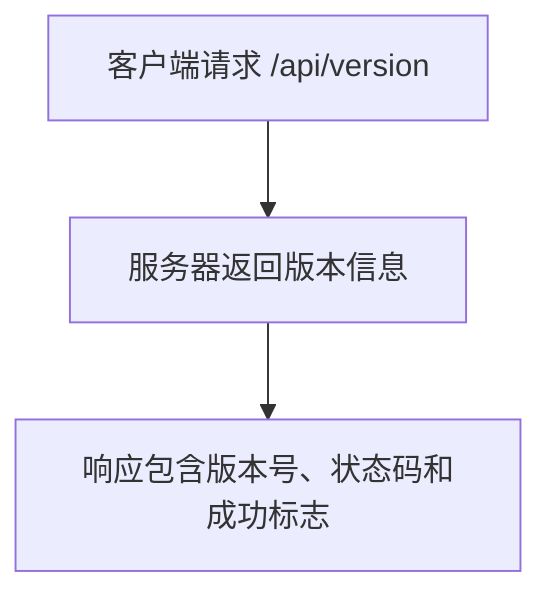
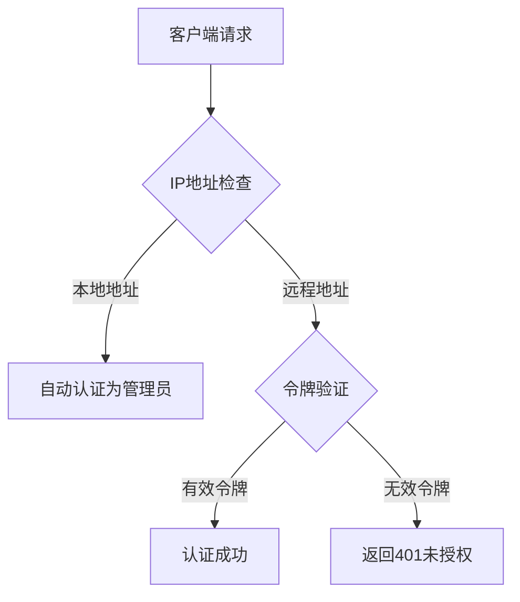
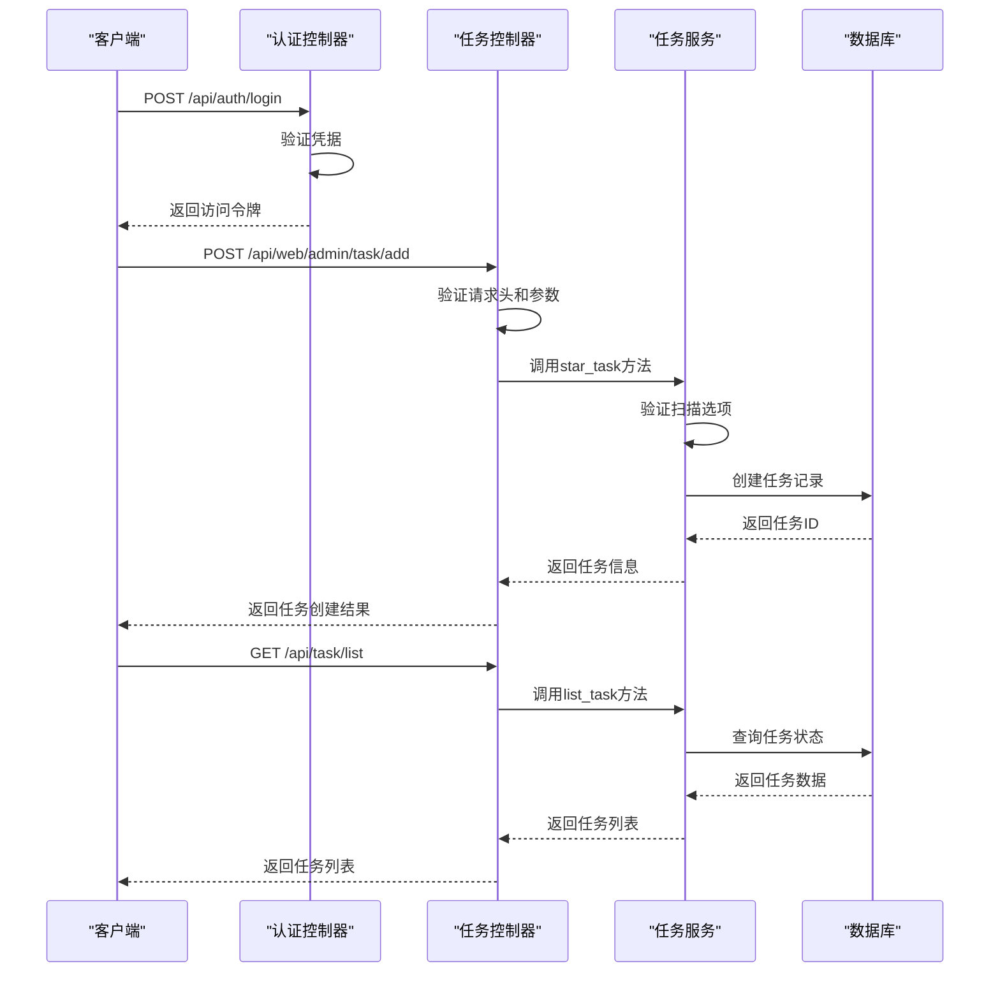

# API接口

<cite>
**本文档引用的文件**   
- [app.py](file://src/backEnd/app.py)
- [main.py](file://src/backEnd/main.py)
- [config.py](file://src/backEnd/config.py)
- [authController.py](file://src/backEnd/api/commonApi/authController.py)
- [webTaskController.py](file://src/backEnd/api/commonApi/webTaskController.py)
- [headerController.py](file://src/backEnd/api/commonApi/headerController.py)
- [configController.py](file://src/backEnd/api/commonApi/configController.py)
- [scanPreset.py](file://src/backEnd/api/commonApi/scanPreset.py)
- [BaseResponseMsg.py](file://src/backEnd/model/BaseResponseMsg.py)
- [TaskRequest.py](file://src/backEnd/model/requestModel/TaskRequest.py)
- [auth.py](file://src/backEnd/utils/auth.py)
- [taskService.py](file://src/backEnd/service/taskService.py)
- [headerRuleService.py](file://src/backEnd/service/headerRuleService.py)
</cite>

## 目录
1. [简介](#简介)
2. [API版本控制与错误处理](#api版本控制与错误处理)
3. [认证接口](#认证接口)
4. [任务管理接口](#任务管理接口)
5. [扫描配置接口](#扫描配置接口)
6. [请求头规则接口](#请求头规则接口)
7. [系统配置接口](#系统配置接口)
8. [API安全性](#api安全性)
9. [API调用序列图](#api调用序列图)

## 简介

sqlmapWebUI后端提供了一套RESTful API接口，用于管理和控制SQL注入检测任务。API基于FastAPI框架构建，通过`app.py`文件中的路由配置，将不同功能模块的API端点进行组织。系统提供了认证、任务管理、扫描配置、请求头规则和系统配置等核心功能。

API基础路径为`/api`，所有接口均通过此前缀访问。系统还提供了健康检查和版本信息接口，用于监控服务状态。API响应遵循统一的格式，由`BaseResponseMsg`类定义，包含状态码、成功标志、消息和数据四个主要字段。

**Section sources**
- [app.py](file://src/backEnd/app.py#L1-L80)
- [config.py](file://src/backEnd/config.py#L1-L8)

## API版本控制与错误处理

### 版本控制策略

系统采用简单的版本控制策略，通过`/api/version`端点提供当前系统版本信息。版本号在`config.py`文件中定义为常量`VERSION`，目前为"1.7.9"。客户端可以通过此接口获取当前运行的后端版本，便于进行兼容性检查。



### 错误处理规范

所有API接口遵循统一的错误处理规范，使用`BaseResponseMsg`类作为响应格式。标准错误码和消息格式如下：

- **200**: 成功 - 操作成功完成
- **400**: 错误请求 - 请求参数无效或缺少必要参数
- **401**: 未授权 - 认证失败或缺少有效令牌
- **404**: 未找到 - 请求的资源不存在
- **500**: 服务器内部错误 - 服务器处理请求时发生错误
- **503**: 服务不可用 - 服务暂时不可用（如数据库连接问题）

错误响应包含详细的错误消息，帮助客户端定位问题。例如，在创建任务时缺少必要参数，会返回400错误码和"options is required"的错误消息。

**Section sources**
- [app.py](file://src/backEnd/app.py#L49-L59)
- [BaseResponseMsg.py](file://src/backEnd/model/BaseResponseMsg.py#L1-L21)

## 认证接口

认证接口提供用户登录、令牌刷新和认证检查功能。当前系统主要针对本地单机模式设计，认证机制相对简单。

### 登录接口

- **HTTP方法**: POST
- **URL路径**: `/api/auth/login`
- **请求体结构**:
  ```json
  {
    "username": "string",
    "password": "string"
  }
  ```
- **响应格式**:
  ```json
  {
    "code": 200,
    "success": true,
    "message": "登录成功",
    "data": {
      "token": "string",
      "userInfo": {
        "username": "string",
        "email": "string",
        "role": "string"
      }
    }
  }
  ```
- **成功示例**:
  ```json
  {
    "code": 200,
    "success": true,
    "message": "登录成功",
    "data": {
      "token": "local_token_20231220132742",
      "userInfo": {
        "username": "admin",
        "email": "admin@local",
        "role": "admin"
      }
    }
  }
  ```
- **错误示例**:
  ```json
  {
    "code": 500,
    "success": false,
    "message": "登录失败: 数据库连接错误",
    "data": null
  }
  ```

### 令牌刷新接口

- **HTTP方法**: POST
- **URL路径**: `/api/auth/refresh`
- **请求体**: 无
- **响应格式**:
  ```json
  {
    "code": 200,
    "success": true,
    "message": "令牌刷新成功",
    "data": {
      "token": "string",
      "expires_in": 86400
    }
  }
  ```

### 认证检查接口

- **HTTP方法**: GET
- **URL路径**: `/api/auth/check-required`
- **请求参数**: 无
- **响应格式**:
  ```json
  {
    "code": 200,
    "success": true,
    "message": "检查成功",
    "data": {
      "required": false,
      "mode": "local",
      "version": "string"
    }
  }
  ```

**Section sources**
- [authController.py](file://src/backEnd/api/commonApi/authController.py#L1-L150)

## 任务管理接口

任务管理接口负责创建、查询、停止和删除扫描任务。这些接口是系统的核心功能，与Burp Suite插件端共享相同的业务逻辑。

### 添加扫描任务

- **HTTP方法**: POST
- **URL路径**: `/api/web/admin/task/add`
- **请求体结构** (`TaskAddRequest`):
  ```json
  {
    "scanUrl": "string",
    "host": "string",
    "headers": ["string"],
    "body": "string",
    "options": {}
  }
  ```
- **响应格式**:
  ```json
  {
    "code": 200,
    "success": true,
    "message": "success",
    "data": {
      "engineid": "string",
      "taskid": "string"
    }
  }
  ```
- **成功示例**:
  ```json
  {
    "code": 200,
    "success": true,
    "message": "success",
    "data": {
      "engineid": "1",
      "taskid": "a1b2c3d4e5f6g7h8"
    }
  }
  ```
- **错误示例** (缺少options参数):
  ```json
  {
    "code": 400,
    "success": false,
    "message": "options is required",
    "data": null
  }
  ```

### 查询任务列表

- **HTTP方法**: GET
- **URL路径**: `/api/task/list`
- **请求参数**: 无
- **响应格式**:
  ```json
  {
    "code": 200,
    "success": true,
    "message": "success",
    "data": {
      "tasks": [
        {
          "index": 1,
          "create_datetime": "string",
          "start_datetime": "string",
          "task_id": "string",
          "scanUrl": "string",
          "host": "string",
          "remote_addr": "string",
          "errors": 0,
          "logs": 10,
          "status": "string",
          "injected": false
        }
      ],
      "tasks_num": 1
    }
  }
  ```

### 停止扫描任务

- **HTTP方法**: POST
- **URL路径**: `/api/task/stop`
- **请求体结构** (`TaskStopRequest`):
  ```json
  {
    "taskid": "string"
  }
  ```
- **响应格式**:
  ```json
  {
    "code": 200,
    "success": true,
    "message": "task {taskid} was stopped",
    "data": null
  }
  ```

### 删除扫描任务

- **HTTP方法**: POST
- **URL路径**: `/api/task/delete`
- **请求体结构** (`TaskDeleteRequest`):
  ```json
  {
    "taskid": "string"
  }
  ```
- **响应格式**:
  ```json
  {
    "code": 200,
    "success": true,
    "message": "{taskid} Deleted task",
    "data": null
  }
  ```

**Section sources**
- [webTaskController.py](file://src/backEnd/api/commonApi/webTaskController.py#L1-L91)
- [taskService.py](file://src/backEnd/service/taskService.py#L1-L535)
- [TaskRequest.py](file://src/backEnd/model/requestModel/TaskRequest.py#L1-L57)

## 扫描配置接口

扫描配置接口提供对扫描预设配置的管理，包括创建、更新、删除和应用预设配置。

### 获取所有预设配置

- **HTTP方法**: GET
- **URL路径**: `/api/scan-preset/list`
- **请求参数**:
  - `include_inactive` (boolean): 是否包含未激活的配置
- **响应格式**:
  ```json
  {
    "code": 200,
    "success": true,
    "message": "获取成功",
    "data": {
      "presets": [
        {
          "id": 1,
          "name": "string",
          "type": "string",
          "options": {},
          "is_active": true,
          "created_at": "string",
          "updated_at": "string"
        }
      ],
      "total": 1,
      "default_preset": {}
    }
  }
  ```

### 创建预设配置

- **HTTP方法**: POST
- **URL路径**: `/api/scan-preset`
- **请求体结构** (`ScanPresetCreate`):
  ```json
  {
    "name": "string",
    "type": "string",
    "options": {},
    "is_active": true
  }
  ```
- **响应格式**:
  ```json
  {
    "code": 201,
    "success": true,
    "message": "创建成功",
    "data": {}
  }
  ```

### 更新预设配置

- **HTTP方法**: PUT
- **URL路径**: `/api/scan-preset/{preset_id}`
- **请求体结构** (`ScanPresetUpdate`):
  ```json
  {
    "name": "string",
    "options": {},
    "is_active": true
  }
  ```

### 应用预设配置

- **HTTP方法**: POST
- **URL路径**: `/api/scan-preset/{preset_id}/apply`
- **请求体**:
  ```json
  {
    "base_options": {}
  }
  ```
- **响应格式**:
  ```json
  {
    "code": 200,
    "success": true,
    "message": "应用成功",
    "data": {
      "options": {}
    }
  }
  ```

**Section sources**
- [scanPreset.py](file://src/backEnd/api/commonApi/scanPreset.py#L1-L325)

## 请求头规则接口

请求头规则接口提供对持久化请求头规则和会话性请求头的管理功能。

### 持久化请求头规则管理

持久化规则存储在数据库中，具有名称、优先级和作用域等属性。

- **创建规则**:
  - **HTTP方法**: POST
  - **URL路径**: `/api/commonApi/header/persistent-header-rules`
  - **请求体**: `PersistentHeaderRuleCreate`模型

- **获取规则列表**:
  - **HTTP方法**: GET
  - **URL路径**: `/api/commonApi/header/persistent-header-rules`
  - **请求参数**: `active_only` (boolean)

- **更新规则**:
  - **HTTP方法**: PUT
  - **URL路径**: `/api/commonApi/header/persistent-header-rules/{rule_id}`

- **删除规则**:
  - **HTTP方法**: DELETE
  - **URL路径**: `/api/commonApi/header/persistent-header-rules/{rule_id}`

### 会话性请求头管理

会话性请求头与客户端IP关联，临时生效。

- **设置会话请求头**:
  - **HTTP方法**: POST
  - **URL路径**: `/api/commonApi/header/session-headers`
  - **请求体**: `SessionHeaderBatchCreate`模型

- **获取会话请求头**:
  - **HTTP方法**: GET
  - **URL路径**: `/api/commonApi/header/session-headers`

- **清除会话请求头**:
  - **HTTP方法**: DELETE
  - **URL路径**: `/api/commonApi/header/session-headers`

### 批量操作接口

提供批量创建和解析请求头的功能。

- **批量解析请求头**:
  - **HTTP方法**: POST
  - **URL路径**: `/api/commonApi/header/headers/parse`

- **一体化批量创建**:
  - **HTTP方法**: POST
  - **URL路径**: `/api/commonApi/header/headers/batch-create`

**Section sources**
- [headerController.py](file://src/backEnd/api/commonApi/headerController.py#L1-L481)
- [headerRuleService.py](file://src/backEnd/service/headerRuleService.py#L1-L800)

## 系统配置接口

系统配置接口管理HTTP请求临时文件目录等系统级配置。

### 临时文件目录配置

- **获取配置**:
  - **HTTP方法**: GET
  - **URL路径**: `/api/config/temp-dir`
  - **响应格式**:
    ```json
    {
      "code": 200,
      "success": true,
      "message": "success",
      "data": {
        "currentTempDir": "string",
        "defaultTempDir": "string",
        "isCustom": false
      }
    }
    ```

- **设置配置**:
  - **HTTP方法**: POST
  - **URL路径**: `/api/config/temp-dir`
  - **请求体**:
    ```json
    {
      "tempDir": "string"
    }
    ```
  - **说明**: 如果`tempDir`为空，则恢复默认值

- **重置配置**:
  - **HTTP方法**: POST
  - **URL路径**: `/api/config/temp-dir/reset`

**Section sources**
- [configController.py](file://src/backEnd/api/commonApi/configController.py#L1-L173)

## API安全性

### 认证机制

系统采用基于IP的简单认证机制。在`utils/auth.py`中实现的`get_current_user`函数检查客户端IP地址，如果来自`127.0.0.1`或`localhost`，则自动认证为管理员用户。对于远程访问，需要提供有效的令牌。



### 输入验证

所有API接口使用Pydantic模型进行输入验证。例如，`TaskAddRequest`模型确保`scanUrl`、`host`、`headers`和`options`等必要字段存在且格式正确。`authController.py`中的`LoginRequest`模型验证用户名和密码的长度。

### 速率限制

当前代码中未实现显式的速率限制机制。系统主要设计用于本地单机模式，通过IP白名单和简单的认证机制来控制访问。

**Section sources**
- [auth.py](file://src/backEnd/utils/auth.py#L1-L23)

## API调用序列图



**Diagram sources **
- [authController.py](file://src/backEnd/api/commonApi/authController.py#L40-L70)
- [webTaskController.py](file://src/backEnd/api/commonApi/webTaskController.py#L19-L80)
- [taskService.py](file://src/backEnd/service/taskService.py#L58-L83)
- [Database.py](file://src/backEnd/model/Database.py)