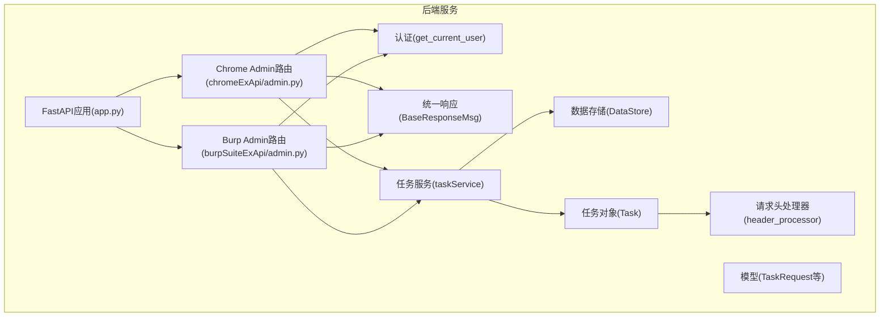
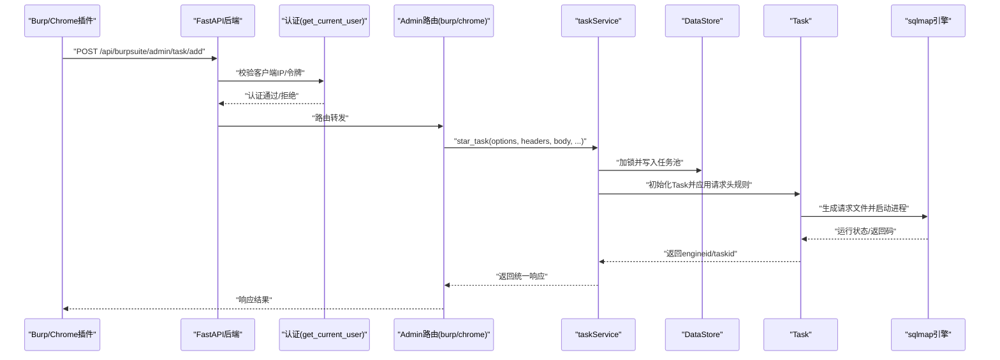
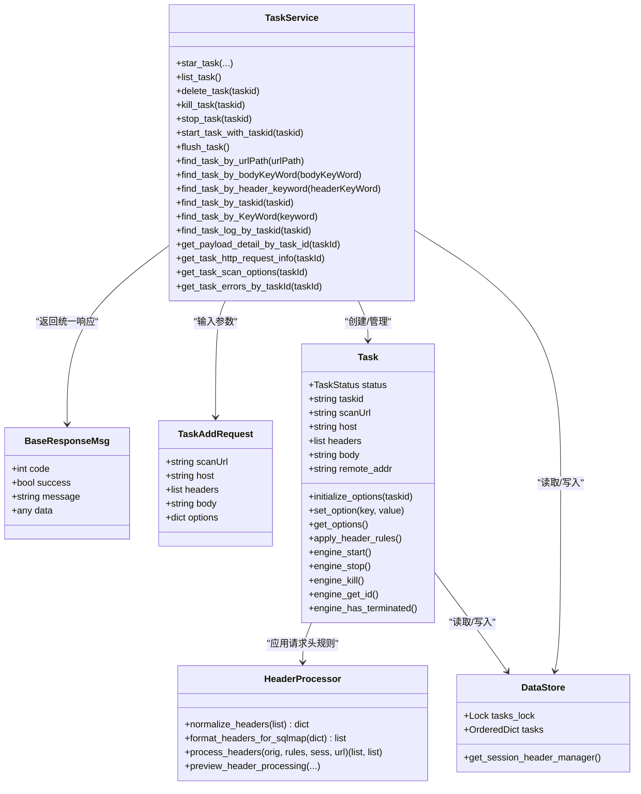
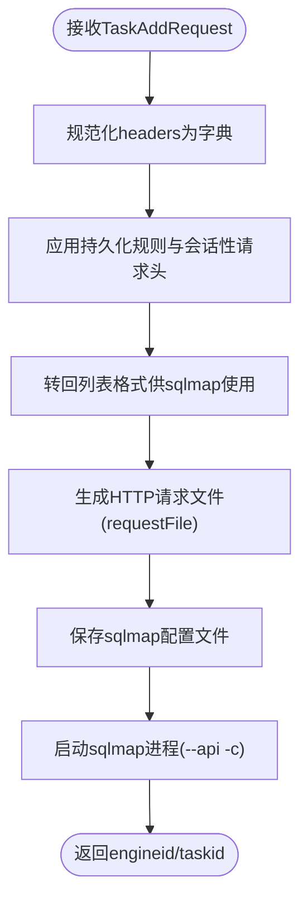

# Burp集成接口

<cite>
**本文引用的文件**
- [src/backEnd/app.py](file://src/backEnd/app.py)
- [src/backEnd/api/burpSuiteExApi/admin.py](file://src/backEnd/api/burpSuiteExApi/admin.py)
- [src/backEnd/api/chromeExApi/admin.py](file://src/backEnd/api/chromeExApi/admin.py)
- [src/backEnd/utils/auth.py](file://src/backEnd/utils/auth.py)
- [src/backEnd/model/BaseResponseMsg.py](file://src/backEnd/model/BaseResponseMsg.py)
- [src/backEnd/model/requestModel/TaskRequest.py](file://src/backEnd/model/requestModel/TaskRequest.py)
- [src/backEnd/service/taskService.py](file://src/backEnd/service/taskService.py)
- [src/backEnd/model/Task.py](file://src/backEnd/model/Task.py)
- [src/backEnd/model/DataStore.py](file://src/backEnd/model/DataStore.py)
- [src/backEnd/utils/header_processor.py](file://src/backEnd/utils/header_processor.py)
- [src/burpEx/legacy-api/src/main/java/com/sqlmapwebui/burp/ApiClient.java](file://src/burpEx/legacy-api/src/main/java/com/sqlmapwebui/burp/ApiClient.java)
- [src/burpEx/montoya-api/src/main/java/com/sqlmapwebui/burp/SqlmapApiClient.java](file://src/burpEx/montoya-api/src/main/java/com/sqlmapwebui/burp/SqlmapApiClient.java)
- [src/burpEx/README.md](file://src/burpEx/README.md)
</cite>

## 目录
1. [简介](#简介)
2. [项目结构](#项目结构)
3. [核心组件](#核心组件)
4. [架构总览](#架构总览)
5. [详细组件分析](#详细组件分析)
6. [依赖关系分析](#依赖关系分析)
7. [性能考量](#性能考量)
8. [故障排查指南](#故障排查指南)
9. [结论](#结论)
10. [附录](#附录)

## 简介
本文件面向Burp Suite与Chrome扩展插件的集成场景，聚焦后端Python服务的两个Admin API模块：burpSuiteExApi/admin.py与chromeExApi/admin.py。文档详细说明：
- 插件如何通过HTTP请求与后端通信，包括发送扫描任务、查询任务、停止/杀死任务等。
- 后端如何解析请求数据，校验参数，将请求转换为sqlmap可执行的格式。
- 与Web UI之间的交互流程及数据流转。
- 安全考虑，包括访问控制与请求验证，确保只有授权的Burp插件可以调用这些接口。

## 项目结构
后端采用FastAPI框架，统一挂载多个路由前缀，其中Burp与Chrome扩展的Admin API均通过/api前缀暴露。CORS中间件允许开发环境下的跨域访问。

图表来源
- [src/backEnd/app.py](file://src/backEnd/app.py#L1-L80)
- [src/backEnd/api/chromeExApi/admin.py](file://src/backEnd/api/chromeExApi/admin.py#L1-L145)
- [src/backEnd/api/burpSuiteExApi/admin.py](file://src/backEnd/api/burpSuiteExApi/admin.py#L1-L37)
- [src/backEnd/utils/auth.py](file://src/backEnd/utils/auth.py#L1-L23)
- [src/backEnd/model/BaseResponseMsg.py](file://src/backEnd/model/BaseResponseMsg.py#L1-L21)
- [src/backEnd/model/requestModel/TaskRequest.py](file://src/backEnd/model/requestModel/TaskRequest.py#L1-L57)
- [src/backEnd/service/taskService.py](file://src/backEnd/service/taskService.py#L1-L535)
- [src/backEnd/model/DataStore.py](file://src/backEnd/model/DataStore.py#L1-L38)
- [src/backEnd/model/Task.py](file://src/backEnd/model/Task.py#L1-L333)
- [src/backEnd/utils/header_processor.py](file://src/backEnd/utils/header_processor.py#L1-L292)

章节来源
- [src/backEnd/app.py](file://src/backEnd/app.py#L1-L80)

## 核心组件
- 路由与端点
  - Burp Admin路由前缀：/api/burpsuite/admin
  - Chrome Admin路由前缀：/api/chrome/admin
- 认证与授权
  - 依赖get_current_user中间件，对请求来源IP进行校验；本地回环地址放行，其他来源需携带特定令牌。
- 数据模型
  - TaskRequest：定义任务请求的字段与约束（如scanUrl、host、headers、body、options等）。
- 任务服务
  - taskService：封装任务生命周期管理、选项校验、数据库查询、日志与错误查询、请求信息导出等。
- 任务对象
  - Task：封装请求头规则应用、请求文件生成、sqlmap进程启动/停止/终止、状态管理等。
- 请求头处理
  - HeaderProcessor：将列表格式请求头转换为字典，应用持久化规则与会话性请求头，再转回列表格式供sqlmap使用。

章节来源
- [src/backEnd/api/burpSuiteExApi/admin.py](file://src/backEnd/api/burpSuiteExApi/admin.py#L1-L37)
- [src/backEnd/api/chromeExApi/admin.py](file://src/backEnd/api/chromeExApi/admin.py#L1-L145)
- [src/backEnd/utils/auth.py](file://src/backEnd/utils/auth.py#L1-L23)
- [src/backEnd/model/requestModel/TaskRequest.py](file://src/backEnd/model/requestModel/TaskRequest.py#L1-L57)
- [src/backEnd/service/taskService.py](file://src/backEnd/service/taskService.py#L1-L535)
- [src/backEnd/model/Task.py](file://src/backEnd/model/Task.py#L1-L333)
- [src/backEnd/utils/header_processor.py](file://src/backEnd/utils/header_processor.py#L1-L292)

## 架构总览
后端通过FastAPI统一暴露REST API，插件通过HTTP向后端提交任务或查询任务状态。后端在收到请求后，进行认证、参数校验、任务创建与调度，并将请求转换为sqlmap可执行的格式，最终由sqlmap引擎执行。

图表来源
- [src/backEnd/app.py](file://src/backEnd/app.py#L1-L80)
- [src/backEnd/api/burpSuiteExApi/admin.py](file://src/backEnd/api/burpSuiteExApi/admin.py#L1-L37)
- [src/backEnd/api/chromeExApi/admin.py](file://src/backEnd/api/chromeExApi/admin.py#L1-L145)
- [src/backEnd/utils/auth.py](file://src/backEnd/utils/auth.py#L1-L23)
- [src/backEnd/service/taskService.py](file://src/backEnd/service/taskService.py#L1-L535)
- [src/backEnd/model/Task.py](file://src/backEnd/model/Task.py#L1-L333)
- [src/backEnd/model/DataStore.py](file://src/backEnd/model/DataStore.py#L1-L38)

## 详细组件分析

### Burp Admin API（/api/burpsuite/admin）
- 路由与端点
  - POST /api/burpsuite/admin/task/add：接收TaskAddRequest，校验options必填，调用taskService.star_task创建任务。
- 认证与访问控制
  - 依赖get_current_user，若request.client为空或非本地回环IP且未提供有效令牌，将返回错误。
- 数据处理
  - 将TaskAddRequest转换为字典，提取scanUrl、host、headers、body、options等字段，传入star_task。
- 错误处理
  - 若缺少options或无法获取客户端IP，返回统一响应；异常时抛出HTTP 500。

章节来源
- [src/backEnd/api/burpSuiteExApi/admin.py](file://src/backEnd/api/burpSuiteExApi/admin.py#L1-L37)
- [src/backEnd/utils/auth.py](file://src/backEnd/utils/auth.py#L1-L23)
- [src/backEnd/model/BaseResponseMsg.py](file://src/backEnd/model/BaseResponseMsg.py#L1-L21)

### Chrome Admin API（/api/chrome/admin）
- 路由与端点
  - POST /api/chrome/admin/task/add：与Burp类似，但更丰富，包含删除、杀死、列表、启动、停止、刷新、按关键字搜索、按URL/Body/Header关键词检索、按任务ID获取日志、payload详情、HTTP请求信息、扫描选项、错误列表等。
- 认证与访问控制
  - 同样依赖get_current_user，本地回环放行，其他来源需令牌。
- 数据处理
  - 使用多种请求模型（TaskAddRequest、TaskDeleteRequest、TaskStopRequest、TaskFindByUrlPathRequest等），分别对应不同操作。
- 错误处理
  - 大多返回统一响应；部分端点捕获异常并返回错误消息。

章节来源
- [src/backEnd/api/chromeExApi/admin.py](file://src/backEnd/api/chromeExApi/admin.py#L1-L145)
- [src/backEnd/utils/auth.py](file://src/backEnd/utils/auth.py#L1-L23)
- [src/backEnd/model/BaseResponseMsg.py](file://src/backEnd/model/BaseResponseMsg.py#L1-L21)

### 认证与访问控制
- get_current_user
  - 若request.client为None，直接返回400。
  - 若客户端IP为127.0.0.1或localhost，视为管理员放行。
  - 否则要求携带特定令牌，否则返回401。
- 安全建议
  - 生产环境中应启用更严格的令牌机制（如Bearer Token），并在网关层限制来源IP。
  - 对外暴露的API应启用HTTPS与CORS白名单。

章节来源
- [src/backEnd/utils/auth.py](file://src/backEnd/utils/auth.py#L1-L23)

### 任务服务与任务对象
- 任务服务（taskService）
  - star_task：校验options合法性（排除不支持的键），生成任务ID，写入DataStore.tasks，设置任务状态为Runnable，返回engineid与taskid。
  - list_task/stop_task/kill_task/start_task_with_taskid/flush_task/find_*系列：提供任务生命周期与查询能力。
  - get_*系列：按任务ID获取日志、payload详情、HTTP请求信息、扫描选项、错误列表。
- 任务对象（Task）
  - initialize_options：初始化sqlmap选项，设置batch、disableColoring、eta等，注入api、taskid、database等必要参数。
  - apply_header_rules：动态加载HeaderRuleService与HeaderProcessor，应用持久化规则与会话性请求头，更新options.headers。
  - engine_start：生成HTTP请求文件（requestFile），保存配置文件，启动sqlmap进程。
  - engine_stop/kill/process/has_terminated：进程控制与状态查询。
- 数据存储（DataStore）
  - tasks_lock：线程安全的任务池；tasks：有序字典存储任务；session_header_manager：会话性请求头管理器单例。

章节来源
- [src/backEnd/service/taskService.py](file://src/backEnd/service/taskService.py#L1-L535)
- [src/backEnd/model/Task.py](file://src/backEnd/model/Task.py#L1-L333)
- [src/backEnd/model/DataStore.py](file://src/backEnd/model/DataStore.py#L1-L38)

### 请求头处理（HeaderProcessor）
- 规范化与格式化
  - 将列表格式请求头转换为字典，再转回列表格式，保证与sqlmap兼容。
- 规则应用
  - 持久化规则：按优先级排序，按作用域匹配，按条件匹配，按策略（替换/追加/前置/条件/UPSERT）应用。
  - 会话性请求头：过滤过期项，按优先级排序，总是应用（相当于UPSERT）。
- 预览与错误回退
  - 支持预览处理结果；处理失败时回退到原始请求头。

章节来源
- [src/backEnd/utils/header_processor.py](file://src/backEnd/utils/header_processor.py#L1-L292)

### 插件与后端交互（Burp侧）
- 插件端
  - 通过OkHttp客户端向后端发起HTTP请求，示例包括获取版本与提交任务。
  - 提交任务时，向 /api/burpsuite/admin/task/add 发送JSON负载。
- 交互流程
  - 插件先调用健康检查端点确认后端可用性，再提交任务。
  - 提交任务成功后，后端返回engineid与taskid，插件可据此在Web UI中查看任务状态与结果。

章节来源
- [src/burpEx/legacy-api/src/main/java/com/sqlmapwebui/burp/ApiClient.java](file://src/burpEx/legacy-api/src/main/java/com/sqlmapwebui/burp/ApiClient.java#L1-L71)
- [src/burpEx/montoya-api/src/main/java/com/sqlmapwebui/burp/SqlmapApiClient.java](file://src/burpEx/montoya-api/src/main/java/com/sqlmapwebui/burp/SqlmapApiClient.java#L1-L75)
- [src/burpEx/README.md](file://src/burpEx/README.md#L1-L42)

## 依赖关系分析

图表来源
- [src/backEnd/model/BaseResponseMsg.py](file://src/backEnd/model/BaseResponseMsg.py#L1-L21)
- [src/backEnd/model/requestModel/TaskRequest.py](file://src/backEnd/model/requestModel/TaskRequest.py#L1-L57)
- [src/backEnd/service/taskService.py](file://src/backEnd/service/taskService.py#L1-L535)
- [src/backEnd/model/Task.py](file://src/backEnd/model/Task.py#L1-L333)
- [src/backEnd/utils/header_processor.py](file://src/backEnd/utils/header_processor.py#L1-L292)
- [src/backEnd/model/DataStore.py](file://src/backEnd/model/DataStore.py#L1-L38)

## 性能考量
- 并发与锁
  - DataStore.tasks_lock保护任务池并发访问，避免竞态条件。
- I/O与进程
  - 任务启动时生成临时HTTP请求文件，启动sqlmap子进程；建议合理设置临时目录权限与清理策略。
- 查询与统计
  - list_task与find_*系列涉及数据库查询，建议在高并发场景下优化索引与连接池。
- CORS与网络
  - 开发环境下CORS允许localhost/127.0.0.1，生产环境应收紧来源与头部白名单。

[本节为通用指导，无需列出具体文件来源]

## 故障排查指南
- 认证失败
  - 症状：返回401或400。
  - 排查：确认插件是否使用正确的后端URL；本地回环IP可免令牌；其他来源需提供令牌。
- 缺少options
  - 症状：/burpsuite/admin/task/add返回“options is required”。
  - 排查：确保插件提交的JSON包含options字段且非空。
- 客户端IP不可用
  - 症状：request.client为None导致错误。
  - 排查：检查反向代理或网关配置，确保能正确透传客户端IP。
- 任务状态异常
  - 症状：stop/kill/start操作无效。
  - 排查：确认任务ID存在且当前状态允许该操作；查看任务日志与错误列表。
- 请求头规则未生效
  - 症状：sqlmap未携带预期请求头。
  - 排查：确认持久化规则与会话性请求头配置；检查HeaderProcessor处理日志。

章节来源
- [src/backEnd/api/burpSuiteExApi/admin.py](file://src/backEnd/api/burpSuiteExApi/admin.py#L1-L37)
- [src/backEnd/api/chromeExApi/admin.py](file://src/backEnd/api/chromeExApi/admin.py#L1-L145)
- [src/backEnd/utils/auth.py](file://src/backEnd/utils/auth.py#L1-L23)
- [src/backEnd/service/taskService.py](file://src/backEnd/service/taskService.py#L1-L535)
- [src/backEnd/utils/header_processor.py](file://src/backEnd/utils/header_processor.py#L1-L292)

## 结论
- Burp与Chrome扩展通过统一的Admin API与后端交互，实现从请求采集到sqlmap执行的完整链路。
- 后端在认证、参数校验、任务生命周期管理与请求头规则应用方面具备清晰职责边界。
- 安全方面，建议在生产环境强化令牌与来源控制，并在网关层实施更严格的CORS与WAF策略。
- 文档建议：为每个端点补充请求/响应示例与错误码说明，便于插件与前端对接。

[本节为总结性内容，无需列出具体文件来源]

## 附录

### API端点一览（/api前缀）
- Burp Admin
  - POST /api/burpsuite/admin/task/add：提交扫描任务（options必填）
- Chrome Admin
  - POST /api/chrome/admin/task/add：提交扫描任务（options必填）
  - DELETE /api/chrome/admin/task/delete：删除任务
  - PUT /api/chrome/admin/task/kill：杀死任务
  - GET /api/chrome/admin/task/list：列出任务
  - PUT /api/chrome/admin/task/startBlocked：启动被阻塞任务
  - PUT /api/chrome/admin/task/stop：停止任务
  - PATCH /api/chrome/admin/task/flush：清空任务池
  - POST /api/chrome/admin/task/findByUrlPath：按URL路径检索
  - POST /api/chrome/admin/task/findByBodyKeyWord：按Body关键词检索
  - POST /api/chrome/admin/task/findByHeaderKeyWord：按Header关键词检索
  - GET /api/chrome/admin/task/logs/getLogsByTaskId：按任务ID获取日志
  - GET /api/chrome/admin/task/getPayloadDetailByTaskId：按任务ID获取payload详情
  - GET /api/chrome/admin/task/getTaskHttpRequestInfoByTaskId：按任务ID获取HTTP请求信息
  - GET /api/chrome/admin/task/getTasksByKeyWord：按关键词获取任务
  - GET /api/chrome/admin/task/getTaskScanOptionsByTaskId：按任务ID获取扫描选项
  - GET /api/chrome/admin/task/getTaskErrorsByTaskId：按任务ID获取错误列表

章节来源
- [src/backEnd/api/burpSuiteExApi/admin.py](file://src/backEnd/api/burpSuiteExApi/admin.py#L1-L37)
- [src/backEnd/api/chromeExApi/admin.py](file://src/backEnd/api/chromeExApi/admin.py#L1-L145)

### 请求数据到sqlmap格式的转换流程

图表来源
- [src/backEnd/model/Task.py](file://src/backEnd/model/Task.py#L1-L333)
- [src/backEnd/utils/header_processor.py](file://src/backEnd/utils/header_processor.py#L1-L292)