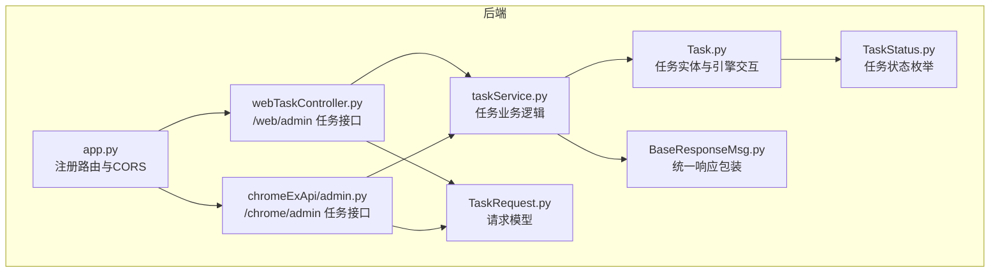
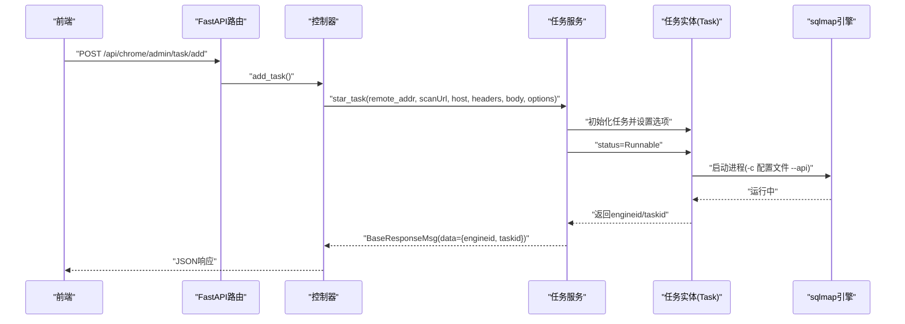
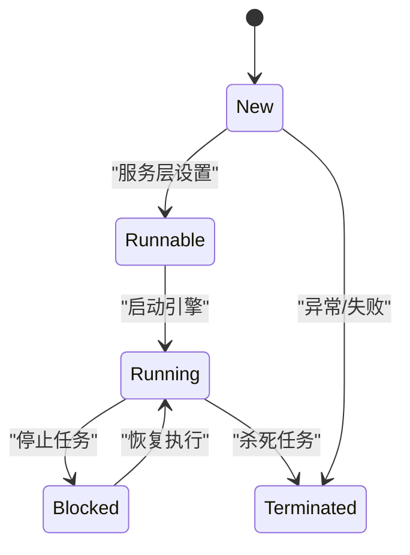
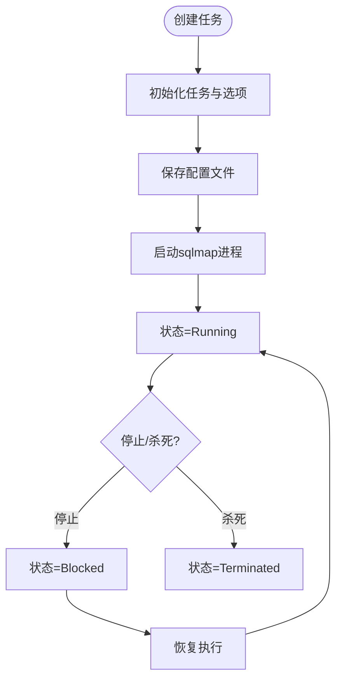
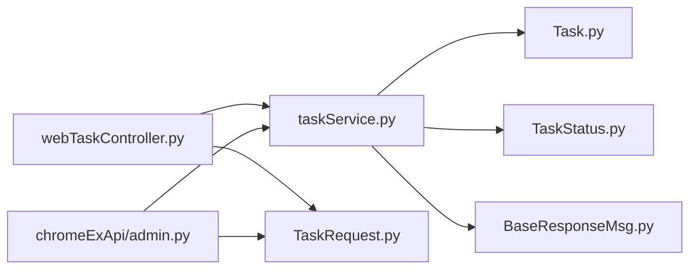

# 任务管理接口

<cite>
**本文引用的文件**
- [webTaskController.py](file://src/backEnd/api/commonApi/webTaskController.py)
- [admin.py](file://src/backEnd/api/chromeExApi/admin.py)
- [taskService.py](file://src/backEnd/service/taskService.py)
- [Task.py](file://src/backEnd/model/Task.py)
- [TaskStatus.py](file://src/backEnd/model/TaskStatus.py)
- [TaskRequest.py](file://src/backEnd/model/requestModel/TaskRequest.py)
- [BaseResponseMsg.py](file://src/backEnd/model/BaseResponseMsg.py)
- [app.py](file://src/backEnd/app.py)
- [task.ts](file://src/frontEnd/src/api/task.ts)
- [task.ts](file://src/frontEnd/src/types/task.ts)
- [README.md](file://src/backEnd/README.md)
</cite>

## 目录
1. [简介](#简介)
2. [项目结构](#项目结构)
3. [核心组件](#核心组件)
4. [架构总览](#架构总览)
5. [详细组件分析](#详细组件分析)
6. [依赖关系分析](#依赖关系分析)
7. [性能考虑](#性能考虑)
8. [故障排查指南](#故障排查指南)
9. [结论](#结论)
10. [附录](#附录)

## 简介
本文件面向“任务管理接口”的开发与使用，聚焦于后端控制器与服务层对任务生命周期的管理能力，覆盖以下端点：
- 创建扫描任务
- 获取任务列表
- 查询任务状态（通过任务ID）
- 停止任务
- 删除任务
- 清空任务池
- 获取任务日志
- 获取扫描配置
- 获取扫描结果（载荷）
- 获取HTTP请求信息
- 关键词检索任务

文档同时解释请求/响应数据结构（基于Pydantic模型）、任务状态机转换逻辑、任务队列与后台执行模型、错误处理策略（如无效任务ID），并给出完整的请求/响应示例说明。

## 项目结构
后端采用FastAPI框架，按功能模块组织：
- 控制器：负责HTTP路由与请求参数校验
- 服务层：封装业务逻辑与任务调度
- 模型：定义请求/响应数据结构与任务状态
- 第三方集成：调用sqlmap引擎以进程方式运行

图表来源
- [app.py](file://src/backEnd/app.py#L1-L80)
- [webTaskController.py](file://src/backEnd/api/commonApi/webTaskController.py#L1-L91)
- [admin.py](file://src/backEnd/api/chromeExApi/admin.py#L1-L145)
- [taskService.py](file://src/backEnd/service/taskService.py#L1-L535)
- [Task.py](file://src/backEnd/model/Task.py#L1-L333)
- [TaskStatus.py](file://src/backEnd/model/TaskStatus.py#L1-L9)
- [TaskRequest.py](file://src/backEnd/model/requestModel/TaskRequest.py#L1-L57)
- [BaseResponseMsg.py](file://src/backEnd/model/BaseResponseMsg.py#L1-L21)

章节来源
- [app.py](file://src/backEnd/app.py#L1-L80)
- [webTaskController.py](file://src/backEnd/api/commonApi/webTaskController.py#L1-L91)
- [admin.py](file://src/backEnd/api/chromeExApi/admin.py#L1-L145)

## 核心组件
- 控制器层
  - Web端控制器：提供/Web/admin前缀的任务接口，复用与Chrome扩展相同的业务逻辑，仅区分日志来源。
  - Chrome扩展控制器：提供/Web/admin前缀的任务接口，与Web端共享同一套服务层。
- 服务层
  - 任务服务：负责任务创建、列表查询、停止/杀死、清空、日志与结果查询等。
- 模型层
  - 请求模型：TaskAddRequest、TaskDeleteRequest、TaskStopRequest等。
  - 响应模型：BaseResponseMsg统一包装。
  - 任务状态：TaskStatus枚举。
  - 任务实体：Task封装了与sqlmap引擎交互、请求文件生成、状态管理等。
- 数据存储与并发
  - DataStore.tasks字典保存任务实例；使用tasks_lock保证并发安全。

章节来源
- [webTaskController.py](file://src/backEnd/api/commonApi/webTaskController.py#L1-L91)
- [admin.py](file://src/backEnd/api/chromeExApi/admin.py#L1-L145)
- [taskService.py](file://src/backEnd/service/taskService.py#L1-L535)
- [Task.py](file://src/backEnd/model/Task.py#L1-L333)
- [TaskStatus.py](file://src/backEnd/model/TaskStatus.py#L1-L9)
- [TaskRequest.py](file://src/backEnd/model/requestModel/TaskRequest.py#L1-L57)
- [BaseResponseMsg.py](file://src/backEnd/model/BaseResponseMsg.py#L1-L21)

## 架构总览
后端通过FastAPI注册多个路由组，其中web_task_router与chrome/admin_router分别挂载到/api前缀下，控制器将HTTP请求映射到服务层方法，服务层再委托任务实体与sqlmap引擎交互。

图表来源
- [app.py](file://src/backEnd/app.py#L36-L42)
- [admin.py](file://src/backEnd/api/chromeExApi/admin.py#L17-L41)
- [taskService.py](file://src/backEnd/service/taskService.py#L58-L88)
- [Task.py](file://src/backEnd/model/Task.py#L258-L333)

## 详细组件分析

### 1) 创建扫描任务
- 端点
  - Web端：POST /api/web/admin/task/add
  - Chrome扩展：POST /api/chrome/admin/task/add
- 请求体
  - TaskAddRequest：包含scanUrl、host、headers、body、options（必填）
- 处理流程
  - 控制器校验options存在性，记录来源IP与目标信息
  - 调用服务层star_task，内部验证options合法性，生成任务ID，初始化任务对象，设置状态为Runnable
  - 任务实体写入配置文件并通过sqlmap引擎以进程方式启动
- 响应
  - BaseResponseMsg：data包含engineid与taskid，success为true/false，code为HTTP状态码

请求示例（JSON）
- 必须包含options字段，且其值为字典
- headers为字符串数组，body为字符串
- options为键值对，可包含sqlmap支持的参数

响应示例（成功）
- code: 200
- success: true
- message: "success"
- data: { engineid: 数字, taskid: 字符串 }

章节来源
- [webTaskController.py](file://src/backEnd/api/commonApi/webTaskController.py#L19-L91)
- [admin.py](file://src/backEnd/api/chromeExApi/admin.py#L17-L41)
- [taskService.py](file://src/backEnd/service/taskService.py#L58-L88)
- [Task.py](file://src/backEnd/model/Task.py#L258-L333)
- [TaskRequest.py](file://src/backEnd/model/requestModel/TaskRequest.py#L31-L37)
- [BaseResponseMsg.py](file://src/backEnd/model/BaseResponseMsg.py#L5-L21)

### 2) 获取任务列表
- 端点
  - GET /api/chrome/admin/task/list
- 处理流程
  - 服务层遍历DataStore.tasks，统计每个任务的错误数、日志数、数据条数
  - 对于非Running/New/Runnable/Blocked状态的任务，根据引擎是否终止判断为Running或Terminated
  - 返回包含tasks与tasks_num的列表
- 响应
  - BaseResponseMsg：data包含tasks数组与tasks_num

章节来源
- [admin.py](file://src/backEnd/api/chromeExApi/admin.py#L56-L59)
- [taskService.py](file://src/backEnd/service/taskService.py#L102-L179)

### 3) 查询任务状态
- 端点
  - GET /api/chrome/admin/task/getTasksByKeyWord?keyword=...
  - GET /api/chrome/admin/task/getTaskScanOptionsByTaskId?taskId=...
  - GET /api/chrome/admin/task/getPayloadDetailByTaskId?taskId=...
  - GET /api/chrome/admin/task/getTaskErrorsByTaskId?taskId=...
  - GET /api/chrome/admin/task/getTaskHttpRequestInfoByTaskId?taskId=...
- 处理流程
  - 关键词搜索：按URL、Host、Header、Body关键词聚合去重后返回
  - 扫描配置：返回任务启用的非空选项
  - 载荷详情：返回注入payload明细
  - 错误列表：返回错误记录
  - HTTP请求信息：返回原始请求URL、Headers、Body
- 响应
  - BaseResponseMsg：data为对应结构

章节来源
- [admin.py](file://src/backEnd/api/chromeExApi/admin.py#L121-L145)
- [taskService.py](file://src/backEnd/service/taskService.py#L241-L531)

### 4) 停止任务
- 端点
  - PUT /api/chrome/admin/task/stop
- 参数
  - TaskStopRequest：taskid
- 处理流程
  - 若任务不存在，返回非运行状态提示
  - 若当前状态为Running，调用引擎stop并设置状态为Blocked
  - 若状态为New/Runnable，直接设置为Blocked
  - 若状态为Blocked/Terminated，返回相应提示
- 响应
  - BaseResponseMsg：msg包含操作结果

章节来源
- [admin.py](file://src/backEnd/api/chromeExApi/admin.py#L68-L71)
- [taskService.py](file://src/backEnd/service/taskService.py#L196-L216)

### 5) 删除任务
- 端点
  - DELETE /api/chrome/admin/task/delete
- 参数
  - TaskDeleteRequest：taskid
- 处理流程
  - 若任务不存在，返回非存在提示
  - 若任务处于Running，先调用引擎kill
  - 从DataStore.tasks移除任务
- 响应
  - BaseResponseMsg：msg包含删除结果

章节来源
- [admin.py](file://src/backEnd/api/chromeExApi/admin.py#L44-L47)
- [taskService.py](file://src/backEnd/service/taskService.py#L89-L101)

### 6) 清空任务池
- 端点
  - PATCH /api/chrome/admin/task/flush
- 处理流程
  - 遍历任务池，若任务处于Running则先kill，然后删除
- 响应
  - BaseResponseMsg：msg为清空结果

章节来源
- [admin.py](file://src/backEnd/api/chromeExApi/admin.py#L74-L77)
- [taskService.py](file://src/backEnd/service/taskService.py#L230-L239)

### 7) 任务状态机与转换逻辑
- 状态枚举
  - New、Runnable、Running、Blocked、Terminated
- 转换逻辑
  - 创建任务：New -> Runnable（服务层设置）
  - 启动引擎：Runnable -> Running（任务实体启动引擎）
  - 停止任务：Running -> Blocked（服务层stop）
  - 杀死任务：Running -> Terminated（服务层kill）
  - 列表展示：非Running/New/Runnable/Blocked状态的任务，依据引擎是否终止判断为Running或Terminated

图表来源
- [TaskStatus.py](file://src/backEnd/model/TaskStatus.py#L1-L9)
- [taskService.py](file://src/backEnd/service/taskService.py#L58-L88)
- [Task.py](file://src/backEnd/model/Task.py#L258-L333)

章节来源
- [TaskStatus.py](file://src/backEnd/model/TaskStatus.py#L1-L9)
- [taskService.py](file://src/backEnd/service/taskService.py#L58-L88)
- [Task.py](file://src/backEnd/model/Task.py#L258-L333)

### 8) 任务队列机制与后台执行模型
- 任务队列
  - DataStore.tasks字典作为任务池，使用tasks_lock保护并发
- 后台执行
  - 任务实体通过子进程方式启动sqlmap引擎，传入配置文件与--api开关
  - 任务状态与引擎进程句柄由Task维护
- 请求文件生成
  - 任务实体在启动前生成HTTP原始请求文件，供sqlmap读取

图表来源
- [taskService.py](file://src/backEnd/service/taskService.py#L58-L88)
- [Task.py](file://src/backEnd/model/Task.py#L258-L333)

章节来源
- [taskService.py](file://src/backEnd/service/taskService.py#L58-L88)
- [Task.py](file://src/backEnd/model/Task.py#L258-L333)

### 9) 错误处理策略
- 无效任务ID
  - 删除/停止/查询等操作若任务不存在，返回非存在提示
- 未提供options
  - 控制器与服务层均校验options，缺失时返回400
- 引擎异常
  - 任务创建失败时设置状态为Terminated并抛出HTTP异常
- 数据库未初始化
  - 列表查询与日志/错误查询在数据库未初始化时返回500

章节来源
- [webTaskController.py](file://src/backEnd/api/commonApi/webTaskController.py#L42-L91)
- [admin.py](file://src/backEnd/api/chromeExApi/admin.py#L17-L41)
- [taskService.py](file://src/backEnd/service/taskService.py#L23-L44)
- [taskService.py](file://src/backEnd/service/taskService.py#L102-L179)
- [taskService.py](file://src/backEnd/service/taskService.py#L396-L418)

## 依赖关系分析
- 控制器依赖服务层
- 服务层依赖任务实体与状态枚举
- 任务实体依赖sqlmap引擎与数据库配置
- 统一响应包装BaseResponseMsg贯穿各层

图表来源
- [webTaskController.py](file://src/backEnd/api/commonApi/webTaskController.py#L1-L91)
- [admin.py](file://src/backEnd/api/chromeExApi/admin.py#L1-L145)
- [taskService.py](file://src/backEnd/service/taskService.py#L1-L535)
- [Task.py](file://src/backEnd/model/Task.py#L1-L333)
- [TaskStatus.py](file://src/backEnd/model/TaskStatus.py#L1-L9)
- [BaseResponseMsg.py](file://src/backEnd/model/BaseResponseMsg.py#L1-L21)
- [TaskRequest.py](file://src/backEnd/model/requestModel/TaskRequest.py#L1-L57)

章节来源
- [webTaskController.py](file://src/backEnd/api/commonApi/webTaskController.py#L1-L91)
- [admin.py](file://src/backEnd/api/chromeExApi/admin.py#L1-L145)
- [taskService.py](file://src/backEnd/service/taskService.py#L1-L535)

## 性能考虑
- 并发安全：使用tasks_lock保护任务池，避免竞态
- I/O优化：日志与错误查询使用数据库游标逐条读取，建议在前端侧做分页或限流
- 进程管理：停止/杀死任务时需等待进程退出，避免僵尸进程
- 配置文件：每次启动任务都会生成临时配置文件，注意磁盘空间与清理策略

## 故障排查指南
- 无法获取客户端IP
  - 控制器会记录警告并返回400，请检查代理/网关配置
- 未提供options
  - 返回400并提示options is required
- 数据库未初始化
  - 列表查询与日志/错误查询返回500，请确认数据库连接
- 任务不存在
  - 删除/停止/查询等返回非存在提示
- 引擎启动失败
  - 服务层捕获异常并设置状态为Terminated，检查sqlmap路径与Python环境

章节来源
- [webTaskController.py](file://src/backEnd/api/commonApi/webTaskController.py#L42-L91)
- [admin.py](file://src/backEnd/api/chromeExApi/admin.py#L17-L41)
- [taskService.py](file://src/backEnd/service/taskService.py#L23-L44)
- [taskService.py](file://src/backEnd/service/taskService.py#L102-L179)

## 结论
该任务管理接口以清晰的职责分离实现了任务全生命周期管理：创建、执行、查询、停止、删除与清空。通过统一的响应模型与严格的状态机控制，结合sqlmap引擎的进程化执行，既满足Web端与Chrome扩展的差异化需求，又保证了系统的可维护性与可观测性。建议在生产环境中配合完善的日志与告警机制，确保任务执行的稳定性与可追踪性。

## 附录

### A. API端点一览（来自后端文档）
- 任务管理
  - GET /api/chrome/admin/task/list
  - POST /api/chrome/admin/task/add
  - PUT /api/chrome/admin/task/stop
  - DELETE /api/chrome/admin/task/delete
  - PATCH /api/chrome/admin/task/flush
  - GET /api/chrome/admin/task/logs/getLogsByTaskId
  - GET /api/chrome/admin/task/getTaskScanOptionsByTaskId
  - GET /api/chrome/admin/task/getPayloadDetailByTaskId
  - GET /api/chrome/admin/task/getTaskHttpRequestInfoByTaskId
  - GET /api/chrome/admin/task/getTasksByKeyWord

章节来源
- [README.md](file://src/backEnd/README.md#L133-L163)

### B. 请求/响应数据结构说明
- 请求模型（Pydantic）
  - TaskAddRequest：scanUrl、host、headers、body、options（必填）
  - TaskDeleteRequest：taskid
  - TaskStopRequest：taskid
  - TaskListRequest：无参数
  - TaskQueryRequest：taskid
  - TaskLogQueryRequest：taskId
- 响应模型
  - BaseResponseMsg：code、success、message、data

章节来源
- [TaskRequest.py](file://src/backEnd/model/requestModel/TaskRequest.py#L1-L57)
- [BaseResponseMsg.py](file://src/backEnd/model/BaseResponseMsg.py#L1-L21)

### C. 前端对接要点
- 前端API封装位于task.ts，提供任务列表、添加、删除、停止、查询等方法
- 类型定义位于task.ts，包含Task、TaskStatus、TaskOptions、PayloadDetail、LogEntry、ErrorEntry、HttpRequestInfo等

章节来源
- [task.ts](file://src/frontEnd/src/api/task.ts#L103-L224)
- [task.ts](file://src/frontEnd/src/types/task.ts#L1-L122)