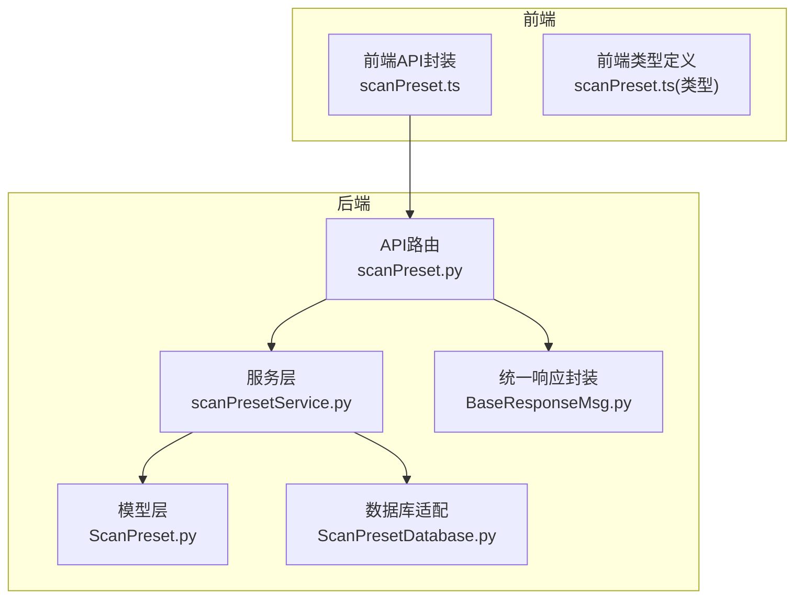
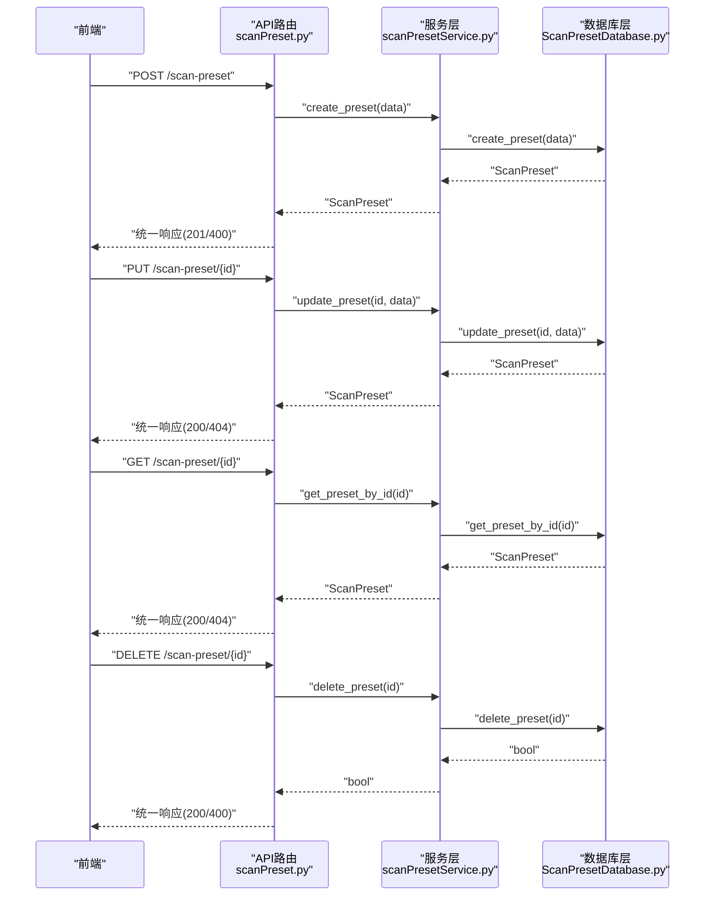
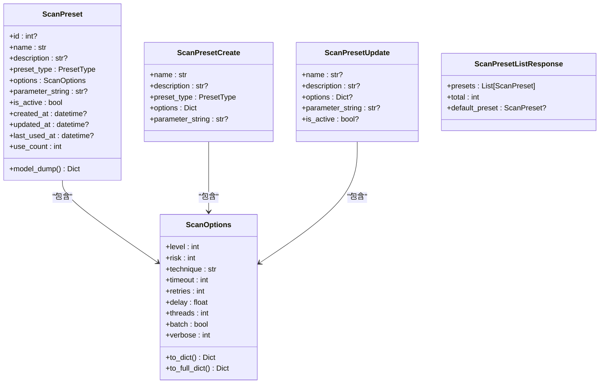
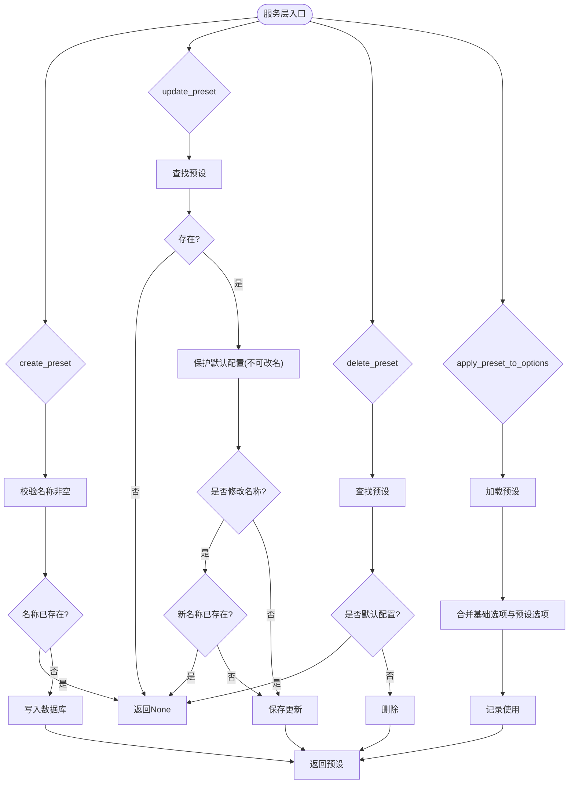
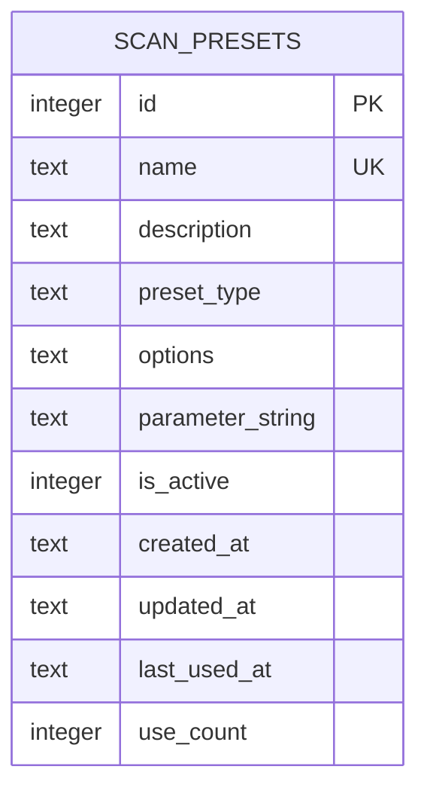
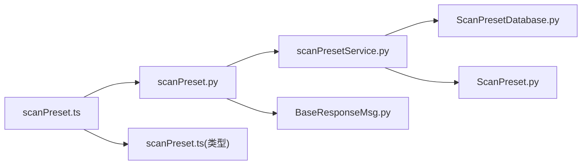

# 扫描配置接口

<cite>
**本文引用的文件**
- [scanPreset.py](file://src/backEnd/api/commonApi/scanPreset.py)
- [ScanPreset.py](file://src/backEnd/model/ScanPreset.py)
- [scanPresetService.py](file://src/backEnd/service/scanPresetService.py)
- [ScanPresetDatabase.py](file://src/backEnd/model/ScanPresetDatabase.py)
- [BaseResponseMsg.py](file://src/backEnd/model/BaseResponseMsg.py)
- [scanPreset.ts](file://src/frontEnd/src/api/scanPreset.ts)
- [scanPreset.ts（类型定义）](file://src/frontEnd/src/types/scanPreset.ts)
</cite>

## 目录
1. [简介](#简介)
2. [项目结构](#项目结构)
3. [核心组件](#核心组件)
4. [架构总览](#架构总览)
5. [详细组件分析](#详细组件分析)
6. [依赖关系分析](#依赖关系分析)
7. [性能考量](#性能考量)
8. [故障排查指南](#故障排查指南)
9. [结论](#结论)
10. [附录](#附录)

## 简介
本文件面向“扫描配置接口”的CRUD能力，聚焦后端FastAPI路由与服务层实现，覆盖默认配置、常用配置与历史配置的创建、读取、更新与删除，并说明配置合并与应用机制、验证规则与冲突处理策略。同时给出前后端对接的API定义与调用建议，帮助开发者快速集成与扩展。

## 项目结构
后端采用分层设计：
- API层：定义REST接口与请求/响应封装
- 服务层：编排业务逻辑与校验
- 模型层：数据模型与数据库适配
- 前端：类型定义与API封装



图表来源
- [scanPreset.py](file://src/backEnd/api/commonApi/scanPreset.py#L1-L325)
- [scanPresetService.py](file://src/backEnd/service/scanPresetService.py#L1-L182)
- [ScanPreset.py](file://src/backEnd/model/ScanPreset.py#L1-L231)
- [ScanPresetDatabase.py](file://src/backEnd/model/ScanPresetDatabase.py#L1-L514)
- [BaseResponseMsg.py](file://src/backEnd/model/BaseResponseMsg.py#L1-L21)
- [scanPreset.ts](file://src/frontEnd/src/api/scanPreset.ts#L1-L145)
- [scanPreset.ts（类型定义）](file://src/frontEnd/src/types/scanPreset.ts#L1-L199)

章节来源
- [scanPreset.py](file://src/backEnd/api/commonApi/scanPreset.py#L1-L325)
- [scanPresetService.py](file://src/backEnd/service/scanPresetService.py#L1-L182)
- [ScanPreset.py](file://src/backEnd/model/ScanPreset.py#L1-L231)
- [ScanPresetDatabase.py](file://src/backEnd/model/ScanPresetDatabase.py#L1-L514)
- [BaseResponseMsg.py](file://src/backEnd/model/BaseResponseMsg.py#L1-L21)
- [scanPreset.ts](file://src/frontEnd/src/api/scanPreset.ts#L1-L145)
- [scanPreset.ts（类型定义）](file://src/frontEnd/src/types/scanPreset.ts#L1-L199)

## 核心组件
- API路由层：提供完整的CRUD与应用接口，统一返回结构
- 服务层：负责业务校验、冲突处理、默认配置保护、历史记录维护
- 模型层：定义预设类型、扫描选项、创建/更新请求体与列表响应
- 数据库层：SQLite持久化，支持初始化默认预设、索引、历史清理
- 前端API封装：对后端接口进行类型化封装，便于在Vue中使用

章节来源
- [scanPreset.py](file://src/backEnd/api/commonApi/scanPreset.py#L23-L325)
- [scanPresetService.py](file://src/backEnd/service/scanPresetService.py#L36-L182)
- [ScanPreset.py](file://src/backEnd/model/ScanPreset.py#L12-L231)
- [ScanPresetDatabase.py](file://src/backEnd/model/ScanPresetDatabase.py#L54-L127)
- [BaseResponseMsg.py](file://src/backEnd/model/BaseResponseMsg.py#L1-L21)
- [scanPreset.ts](file://src/frontEnd/src/api/scanPreset.ts#L1-L145)

## 架构总览
后端以FastAPI Router为入口，经由服务层进行业务处理，最终落到数据库层持久化；前端通过类型化的API封装调用后端接口。



图表来源
- [scanPreset.py](file://src/backEnd/api/commonApi/scanPreset.py#L191-L268)
- [scanPresetService.py](file://src/backEnd/service/scanPresetService.py#L67-L119)
- [ScanPresetDatabase.py](file://src/backEnd/model/ScanPresetDatabase.py#L297-L365)

## 详细组件分析

### 1) 数据模型与配置项
- 预设类型：默认(default)、常用(preset)、历史(history)
- 扫描选项：涵盖检测、注入、技术、请求、优化、枚举、通用等多类sqlmap选项
- 选项压缩：仅序列化非默认值，减少存储空间
- 参数字符串：兼容BurpSuite命令行参数字符串，便于导入导出



图表来源
- [ScanPreset.py](file://src/backEnd/model/ScanPreset.py#L12-L231)

章节来源
- [ScanPreset.py](file://src/backEnd/model/ScanPreset.py#L12-L231)

### 2) API端点与CRUD流程
- 获取所有预设：支持是否包含未激活
- 获取配置选项：默认、常用、历史三类聚合
- 获取默认配置、更新默认配置
- 获取常用配置列表、获取历史配置列表
- 根据ID获取预设
- 创建预设、更新预设、删除预设
- 添加到历史、应用预设到选项并合并

```mermaid
flowchart TD
Start(["请求进入"]) --> Route{"路由匹配"}
Route --> |GET /list| ListAll["获取所有预设"]
Route --> |GET /config-options| GetOpts["获取配置选项"]
Route --> |GET /default| GetDefault["获取默认配置"]
Route --> |PUT /default| UpdateDefault["更新默认配置"]
Route --> |GET /presets| GetPresets["获取常用配置"]
Route --> |GET /history| GetHistory["获取历史配置"]
Route --> |GET /{id}| GetById["根据ID获取预设"]
Route --> |POST /| Create["创建预设"]
Route --> |PUT /{id}| Update["更新预设"]
Route --> |DELETE /{id}| Delete["删除预设"]
Route --> |POST /history| AddHistory["添加到历史"]
Route --> |POST /{id}/apply| Apply["应用预设到选项"]
ListAll --> Resp["统一响应"]
GetOpts --> Resp
GetDefault --> Resp
UpdateDefault --> Resp
GetPresets --> Resp
GetHistory --> Resp
GetById --> Resp
Create --> Resp
Update --> Resp
Delete --> Resp
AddHistory --> Resp
Apply --> Resp
```

图表来源
- [scanPreset.py](file://src/backEnd/api/commonApi/scanPreset.py#L23-L325)
- [BaseResponseMsg.py](file://src/backEnd/model/BaseResponseMsg.py#L1-L21)

章节来源
- [scanPreset.py](file://src/backEnd/api/commonApi/scanPreset.py#L23-L325)
- [BaseResponseMsg.py](file://src/backEnd/model/BaseResponseMsg.py#L1-L21)

### 3) 服务层业务逻辑与冲突处理
- 创建预设：校验名称非空且唯一
- 更新预设：禁止修改默认配置名称；若修改名称需保证唯一性
- 删除预设：禁止删除默认配置
- 应用预设：将预设选项与基础选项合并，记录使用次数与时间
- 历史记录：去重更新、上限清理（默认20条）



图表来源
- [scanPresetService.py](file://src/backEnd/service/scanPresetService.py#L67-L178)
- [ScanPresetDatabase.py](file://src/backEnd/model/ScanPresetDatabase.py#L297-L365)

章节来源
- [scanPresetService.py](file://src/backEnd/service/scanPresetService.py#L36-L178)
- [ScanPresetDatabase.py](file://src/backEnd/model/ScanPresetDatabase.py#L297-L408)

### 4) 数据库层与存储机制
- 初始化：创建表、索引、默认预设（默认、快速、深度、安全）
- 存储：options以JSON存储，parameter_string可选
- 查询：按类型、激活状态、使用计数排序
- 历史清理：保留最近使用的若干条历史记录



图表来源
- [ScanPresetDatabase.py](file://src/backEnd/model/ScanPresetDatabase.py#L56-L84)

章节来源
- [ScanPresetDatabase.py](file://src/backEnd/model/ScanPresetDatabase.py#L56-L127)
- [ScanPresetDatabase.py](file://src/backEnd/model/ScanPresetDatabase.py#L128-L178)
- [ScanPresetDatabase.py](file://src/backEnd/model/ScanPresetDatabase.py#L217-L296)
- [ScanPresetDatabase.py](file://src/backEnd/model/ScanPresetDatabase.py#L366-L408)

### 5) 前端对接与类型约束
- 前端API封装：对每个后端端点提供类型化函数
- 类型定义：与后端模型保持一致，含预设类型、扫描选项、创建/更新请求体、列表响应
- 默认选项：提供默认扫描选项常量，便于前端初始化

章节来源
- [scanPreset.ts](file://src/frontEnd/src/api/scanPreset.ts#L1-L145)
- [scanPreset.ts（类型定义）](file://src/frontEnd/src/types/scanPreset.ts#L1-L199)

## 依赖关系分析
- API依赖服务层，服务层依赖数据库层与模型层
- 统一响应封装被API层广泛使用
- 前端API封装依赖类型定义



图表来源
- [scanPreset.py](file://src/backEnd/api/commonApi/scanPreset.py#L1-L325)
- [scanPresetService.py](file://src/backEnd/service/scanPresetService.py#L1-L182)
- [ScanPreset.py](file://src/backEnd/model/ScanPreset.py#L1-L231)
- [ScanPresetDatabase.py](file://src/backEnd/model/ScanPresetDatabase.py#L1-L514)
- [BaseResponseMsg.py](file://src/backEnd/model/BaseResponseMsg.py#L1-L21)
- [scanPreset.ts](file://src/frontEnd/src/api/scanPreset.ts#L1-L145)
- [scanPreset.ts（类型定义）](file://src/frontEnd/src/types/scanPreset.ts#L1-L199)

## 性能考量
- 索引：按类型、激活状态、名称建立索引，提升查询效率
- 选项压缩：仅存储非默认值，降低JSON体积
- 合并策略：应用预设时先加载预设再合并，避免重复计算
- 历史清理：限制历史数量，防止表膨胀

章节来源
- [ScanPresetDatabase.py](file://src/backEnd/model/ScanPresetDatabase.py#L76-L84)
- [ScanPresetDatabase.py](file://src/backEnd/model/ScanPresetDatabase.py#L132-L147)
- [ScanPresetDatabase.py](file://src/backEnd/model/ScanPresetDatabase.py#L377-L408)
- [scanPresetService.py](file://src/backEnd/service/scanPresetService.py#L156-L178)

## 故障排查指南
- 404未找到：预设不存在或默认配置不存在
- 400错误：创建/更新失败（名称冲突、默认配置不可删除、默认配置名称不可更改）
- 500错误：数据库异常、序列化异常
- 建议排查步骤：
  - 检查名称唯一性与非空校验
  - 确认预设类型与默认配置保护规则
  - 核对options字段是否符合模型定义
  - 查看日志定位具体异常

章节来源
- [scanPreset.py](file://src/backEnd/api/commonApi/scanPreset.py#L71-L120)
- [scanPreset.py](file://src/backEnd/api/commonApi/scanPreset.py#L191-L268)
- [scanPresetService.py](file://src/backEnd/service/scanPresetService.py#L67-L119)
- [ScanPresetDatabase.py](file://src/backEnd/model/ScanPresetDatabase.py#L132-L178)

## 结论
该扫描配置接口以清晰的分层架构实现了默认、常用与历史配置的全生命周期管理，具备完善的校验与冲突处理策略，并通过统一响应封装与类型化前端对接，提升了开发体验与系统稳定性。建议在生产环境中结合索引与历史清理策略，持续优化查询与存储性能。

## 附录

### A. API端点一览（后端）
- GET /scan-preset/list：获取所有预设（可选包含未激活）
- GET /scan-preset/config-options：获取默认/常用/历史配置选项
- GET /scan-preset/default：获取默认配置
- PUT /scan-preset/default：更新默认配置
- GET /scan-preset/presets：获取常用配置列表
- GET /scan-preset/history：获取历史配置列表（limit）
- GET /scan-preset/{id}：根据ID获取预设
- POST /scan-preset：创建预设
- PUT /scan-preset/{id}：更新预设
- DELETE /scan-preset/{id}：删除预设
- POST /scan-preset/history：添加到历史（name+options）
- POST /scan-preset/{id}/apply：应用预设到选项（base_options）

章节来源
- [scanPreset.py](file://src/backEnd/api/commonApi/scanPreset.py#L23-L325)

### B. 前端调用示例（参考）
- 获取默认配置：调用 getDefaultPreset
- 更新默认配置：调用 updateDefaultPreset(options)
- 获取常用配置：调用 getPresetConfigs
- 获取历史配置：调用 getHistoryConfigs(limit)
- 获取单个预设：调用 getPresetById(id)
- 创建预设：调用 createPreset(createData)
- 更新预设：调用 updatePreset(id, updateData)
- 删除预设：调用 deletePreset(id)
- 添加到历史：调用 addToHistory(name, options)
- 应用预设：调用 applyPreset(id, baseOptions)

章节来源
- [scanPreset.ts](file://src/frontEnd/src/api/scanPreset.ts#L1-L145)

### C. 配置验证规则与冲突解决
- 名称唯一性：创建与更新均要求名称唯一
- 默认配置保护：默认配置不可删除；默认配置名称不可修改
- 选项合并：应用预设时，基础选项优先级高于预设选项（后写覆盖）
- 历史记录：同名历史记录去重更新，超过上限自动清理

章节来源
- [scanPresetService.py](file://src/backEnd/service/scanPresetService.py#L67-L119)
- [scanPresetService.py](file://src/backEnd/service/scanPresetService.py#L156-L178)
- [ScanPresetDatabase.py](file://src/backEnd/model/ScanPresetDatabase.py#L377-L408)