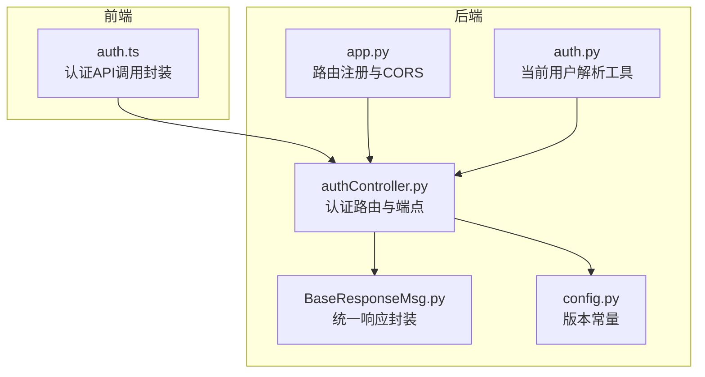
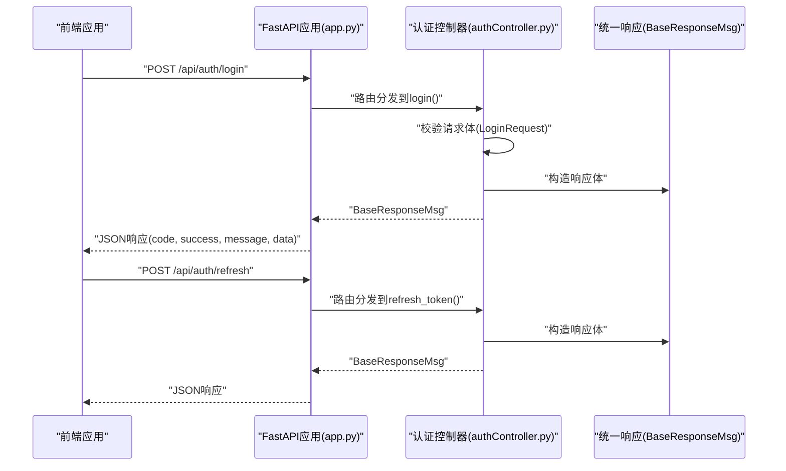
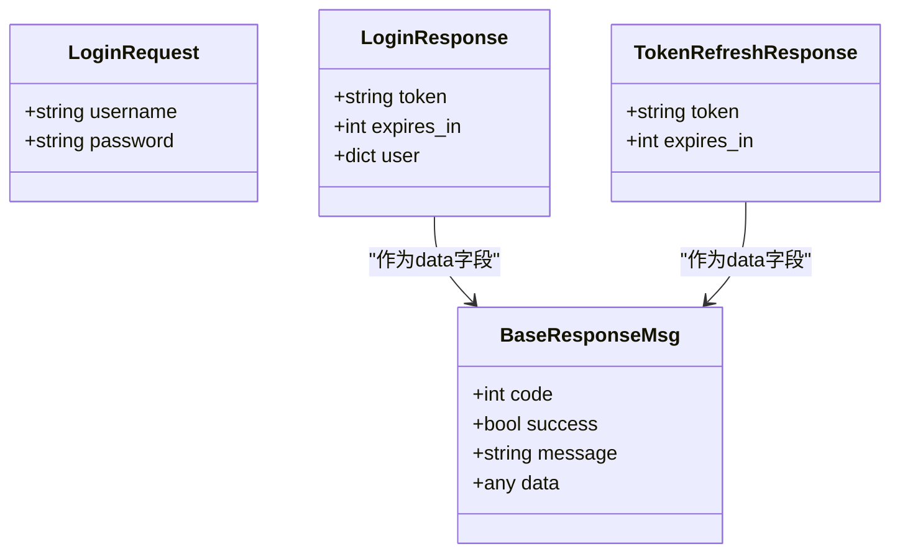
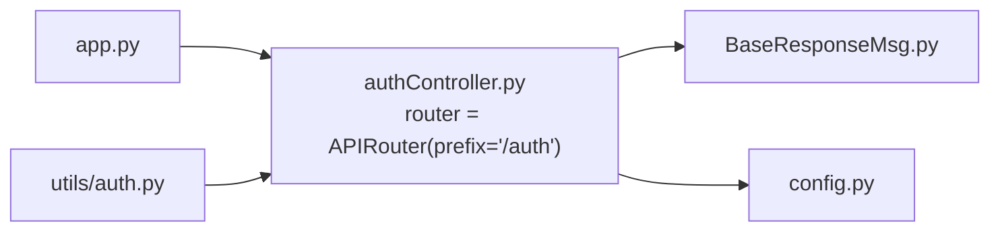

# 认证接口

<cite>
**本文引用的文件**
- [authController.py](file://src/backEnd/api/commonApi/authController.py)
- [auth.py](file://src/backEnd/utils/auth.py)
- [BaseResponseMsg.py](file://src/backEnd/model/BaseResponseMsg.py)
- [app.py](file://src/backEnd/app.py)
- [auth.ts](file://src/frontEnd/src/api/auth.ts)
- [config.py](file://src/backEnd/config.py)
- [INTEGRATION_TEST_GUIDE.md](file://src/backEnd/tests/INTEGRATION_TEST_GUIDE.md)
</cite>

## 目录
1. [简介](#简介)
2. [项目结构](#项目结构)
3. [核心组件](#核心组件)
4. [架构总览](#架构总览)
5. [详细组件分析](#详细组件分析)
6. [依赖关系分析](#依赖关系分析)
7. [性能与安全考量](#性能与安全考量)
8. [故障排查指南](#故障排查指南)
9. [结论](#结论)
10. [附录](#附录)

## 简介
本文件面向后端认证接口的使用者与维护者，聚焦于 src/backEnd/api/commonApi/authController.py 中实现的用户认证API。文档覆盖以下要点：
- 登录、令牌刷新、认证需求检查三个端点的HTTP方法、URL路径、请求参数与响应格式
- 使用 Pydantic 模型定义的数据结构（LoginRequest、LoginResponse、TokenRefreshResponse）
- JWT 令牌生成、验证与过期处理的实现现状与建议
- cURL 请求示例与预期响应（成功登录、无效凭证、令牌过期等）
- 密码哈希策略与安全传输要求（HTTPS）
- 会话管理机制与 CSRF 保护说明

## 项目结构
认证相关代码位于后端 Python 工程中，采用 FastAPI 构建 REST 接口，并统一以 BaseResponseMsg 包裹响应体。前端通过 src/frontEnd/src/api/auth.ts 调用后端认证接口。

图表来源
- [authController.py](file://src/backEnd/api/commonApi/authController.py#L1-L150)
- [auth.py](file://src/backEnd/utils/auth.py#L1-L23)
- [BaseResponseMsg.py](file://src/backEnd/model/BaseResponseMsg.py#L1-L21)
- [app.py](file://src/backEnd/app.py#L31-L43)
- [config.py](file://src/backEnd/config.py#L1-L8)

章节来源
- [authController.py](file://src/backEnd/api/commonApi/authController.py#L1-L150)
- [auth.ts](file://src/frontEnd/src/api/auth.ts#L1-L34)
- [app.py](file://src/backEnd/app.py#L31-L43)

## 核心组件
- 认证路由与端点
  - 路由前缀：/auth
  - 端点：
    - POST /auth/login
    - POST /auth/refresh
    - GET /auth/check-required
- 数据模型（Pydantic）
  - LoginRequest：用户名、密码
  - LoginResponse：令牌、过期时间、用户信息
  - TokenRefreshResponse：新令牌、过期时间
- 统一响应封装
  - BaseResponseMsg：统一返回结构（code、success、message、data）

章节来源
- [authController.py](file://src/backEnd/api/commonApi/authController.py#L14-L36)
- [BaseResponseMsg.py](file://src/backEnd/model/BaseResponseMsg.py#L1-L21)

## 架构总览
后端通过 FastAPI 注册认证路由，前端通过 axios 封装的请求函数调用相应端点。认证端点返回统一的响应结构，便于前后端一致处理。

图表来源
- [app.py](file://src/backEnd/app.py#L31-L43)
- [authController.py](file://src/backEnd/api/commonApi/authController.py#L40-L111)
- [BaseResponseMsg.py](file://src/backEnd/model/BaseResponseMsg.py#L1-L21)

## 详细组件分析

### 登录端点：POST /auth/login
- 功能概述
  - 接收用户名与密码，返回访问令牌及用户信息；当前为演示模式，接受任意凭据并返回模拟令牌。
- HTTP 方法与路径
  - 方法：POST
  - 路径：/auth/login
- 请求参数（Pydantic 模型 LoginRequest）
  - 字段
    - username: 字符串，长度范围 1..50
    - password: 字符串，长度范围 1..100
- 响应格式（Pydantic 模型 LoginResponse）
  - 字段
    - token: 字符串（当前为模拟令牌）
    - expires_in: 整数（秒）
    - user: 字典（包含 username、email、role 等）
- 统一响应结构（BaseResponseMsg）
  - 字段
    - code: 整数（HTTP 状态码）
    - success: 布尔
    - message: 字符串
    - data: 登录响应体
- 实现要点
  - 当前未执行真实用户认证与密码校验，仅返回模拟令牌。
  - 建议后续接入数据库与 bcrypt 密码哈希进行真实认证。
- 错误处理
  - 异常捕获并返回统一错误响应。

章节来源
- [authController.py](file://src/backEnd/api/commonApi/authController.py#L19-L30)
- [authController.py](file://src/backEnd/api/commonApi/authController.py#L40-L79)
- [BaseResponseMsg.py](file://src/backEnd/model/BaseResponseMsg.py#L1-L21)

### 令牌刷新端点：POST /auth/refresh
- 功能概述
  - 刷新访问令牌；当前为演示模式，直接返回新的模拟令牌。
- HTTP 方法与路径
  - 方法：POST
  - 路径：/auth/refresh
- 响应格式（Pydantic 模型 TokenRefreshResponse）
  - 字段
    - token: 新令牌（字符串）
    - expires_in: 过期时间（秒）
- 统一响应结构（BaseResponseMsg）
  - 字段
    - code: 整数（HTTP 状态码）
    - success: 布尔
    - message: 字符串
    - data: 刷新响应体
- 实现要点
  - 当前未实现 JWT 刷新逻辑，建议后续引入 JWT 并在刷新时签发新令牌。
- 错误处理
  - 异常捕获并返回统一错误响应。

章节来源
- [authController.py](file://src/backEnd/api/commonApi/authController.py#L32-L36)
- [authController.py](file://src/backEnd/api/commonApi/authController.py#L81-L111)
- [BaseResponseMsg.py](file://src/backEnd/model/BaseResponseMsg.py#L1-L21)

### 认证需求检查端点：GET /auth/check-required
- 功能概述
  - 检查当前访问是否需要认证；当前为本地单机模式，返回 required=False。
- HTTP 方法与路径
  - 方法：GET
  - 路径：/auth/check-required
- 响应数据
  - required: 布尔（本地模式下为 false）
  - mode: 字符串（当前为 local）
  - version: 字符串（来自 VERSION 常量）
- 实现要点
  - 当前固定返回本地模式且不需要认证，未来可依据配置动态判断。
- 错误处理
  - 异常捕获并返回统一错误响应。

章节来源
- [authController.py](file://src/backEnd/api/commonApi/authController.py#L114-L150)
- [config.py](file://src/backEnd/config.py#L1-L8)

### 前端调用封装
- 登录
  - 路径：/auth/login
  - 参数：LoginRequest
  - 返回：LoginResponse
- 刷新令牌
  - 路径：/auth/refresh
  - 返回：{ token: string }
- 版本查询
  - 路径：/version
  - 返回：{ version: string }
- 认证需求检查
  - 路径：/auth/check-required
  - 返回：{ required: boolean }

章节来源
- [auth.ts](file://src/frontEnd/src/api/auth.ts#L1-L34)

### 数据模型类图

图表来源
- [authController.py](file://src/backEnd/api/commonApi/authController.py#L19-L36)
- [BaseResponseMsg.py](file://src/backEnd/model/BaseResponseMsg.py#L1-L21)

## 依赖关系分析
- 路由注册
  - 在 app.py 中通过 include_router 将认证路由挂载到 /api 下，标签为 ["auth"]。
- 统一响应
  - 所有认证端点均返回 BaseResponseMsg，确保前后端一致的响应结构。
- 当前用户解析
  - utils/auth.py 提供 get_current_user，用于根据客户端 IP 或传入 token 决定是否放行或抛出 401。

图表来源
- [app.py](file://src/backEnd/app.py#L31-L43)
- [authController.py](file://src/backEnd/api/commonApi/authController.py#L14-L20)
- [BaseResponseMsg.py](file://src/backEnd/model/BaseResponseMsg.py#L1-L21)
- [config.py](file://src/backEnd/config.py#L1-L8)
- [auth.py](file://src/backEnd/utils/auth.py#L1-L23)

章节来源
- [app.py](file://src/backEnd/app.py#L31-L43)
- [auth.py](file://src/backEnd/utils/auth.py#L1-L23)

## 性能与安全考量

### JWT 令牌生成、验证与过期处理
- 现状
  - 当前返回的是模拟令牌，未使用 JWT。
- 建议实现
  - 使用标准 JWT 库签发访问令牌与刷新令牌，设置合理的过期时间（如 access_token 15 分钟，refresh_token 7 天）。
  - 刷新时签发新的 access_token，并可选择轮换 refresh_token。
  - 在中间件中解析 Authorization 头，验证签名与过期时间，失败时返回 401。
- 会话与 CSRF
  - 若采用 Cookie 存储令牌，需启用 SameSite 与 HttpOnly，并配合 CSRF Token 或同源策略防护。
  - 当前实现未涉及 Cookie 与 CSRF，若迁移到 Cookie 模式，务必加强安全配置。

章节来源
- [authController.py](file://src/backEnd/api/commonApi/authController.py#L40-L111)

### 密码哈希策略
- 现状
  - 后端未对登录密码进行哈希存储（当前演示模式接受任意凭据）。
- 建议
  - 使用 bcrypt 对密码进行加盐哈希存储，验证时使用 compare_hash_and_pass。
  - 避免明文存储或弱哈希（如 MD5）。

章节来源
- [authController.py](file://src/backEnd/api/commonApi/authController.py#L40-L79)

### 安全传输要求（HTTPS）
- 建议
  - 生产环境必须启用 HTTPS，防止令牌与凭据被窃听。
  - 可参考集成测试文档中的 HTTPS 安全头示例，强化传输层安全。

章节来源
- [INTEGRATION_TEST_GUIDE.md](file://src/backEnd/tests/INTEGRATION_TEST_GUIDE.md#L102-L122)

### 会话管理与 CSRF 保护
- 现状
  - 当前未实现基于 Cookie 的会话管理与 CSRF 保护。
- 建议
  - 若采用 Cookie 存储令牌，开启 SameSite=Lax|Strict、HttpOnly、Secure 属性。
  - 结合 CSRF Token 或同源策略，避免跨站请求伪造。
  - 对敏感操作增加二次确认或验证码。

## 故障排查指南
- 常见问题
  - 登录失败：检查请求体字段是否符合 LoginRequest 规范（长度限制）。
  - 500 错误：查看后端日志，定位异常堆栈。
  - 401 未授权：当前 utils/auth.py 对非本地 IP 且 token 不匹配时返回 401。
- 建议排查步骤
  - 使用 cURL 验证端点可用性与响应结构。
  - 检查 CORS 配置是否允许前端域名访问。
  - 确认 VERSION 常量与版本查询端点正常。

章节来源
- [auth.py](file://src/backEnd/utils/auth.py#L1-L23)
- [authController.py](file://src/backEnd/api/commonApi/authController.py#L40-L111)

## 结论
- 当前认证接口处于演示阶段，未接入真实用户数据库与 JWT 令牌体系。
- 建议尽快完成以下改进：
  - 引入用户数据库与 bcrypt 密码哈希
  - 实现 JWT 令牌签发、刷新与过期处理
  - 加强传输安全（HTTPS）与会话安全（Cookie、CSRF）
  - 完善错误处理与日志记录

## 附录

### API 定义与示例

- 登录：POST /auth/login
  - 请求体（Pydantic 模型 LoginRequest）
    - username: 字符串（1..50）
    - password: 字符串（1..100）
  - 成功响应（BaseResponseMsg）
    - data.token: 字符串（模拟令牌）
    - data.expires_in: 整数（秒）
    - data.user: 字典（包含 username、email、role）
  - 示例 cURL
    - curl -X POST http://localhost:8000/api/auth/login -H "Content-Type: application/json" -d '{"username":"admin","password":"123"}'

- 刷新令牌：POST /auth/refresh
  - 成功响应（BaseResponseMsg）
    - data.token: 新令牌（字符串）
    - data.expires_in: 过期时间（秒）
  - 示例 cURL
    - curl -X POST http://localhost:8000/api/auth/refresh

- 认证需求检查：GET /auth/check-required
  - 成功响应（BaseResponseMsg）
    - data.required: 布尔（本地模式为 false）
    - data.mode: 字符串（local）
    - data.version: 字符串（来自 VERSION）
  - 示例 cURL
    - curl http://localhost:8000/api/auth/check-required

- 版本查询：GET /version
  - 成功响应
    - data.version: 字符串（版本号）
  - 示例 cURL
    - curl http://localhost:8000/api/version

- 无效凭证/未授权
  - 当前 utils/auth.py 对非本地 IP 且 token 不匹配时返回 401。
  - 示例 cURL（模拟未授权）
    - curl -H "Authorization: Bearer invalid" http://localhost:8000/api/version

章节来源
- [authController.py](file://src/backEnd/api/commonApi/authController.py#L19-L36)
- [authController.py](file://src/backEnd/api/commonApi/authController.py#L40-L111)
- [auth.ts](file://src/frontEnd/src/api/auth.ts#L1-L34)
- [auth.py](file://src/backEnd/utils/auth.py#L1-L23)
- [config.py](file://src/backEnd/config.py#L1-L8)