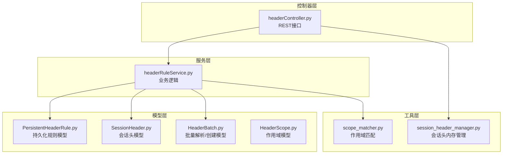
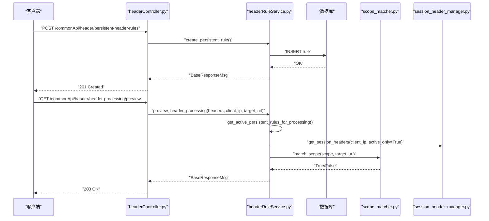
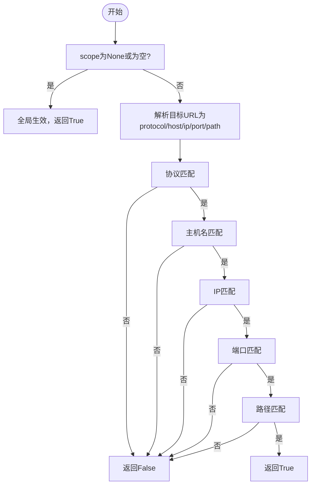
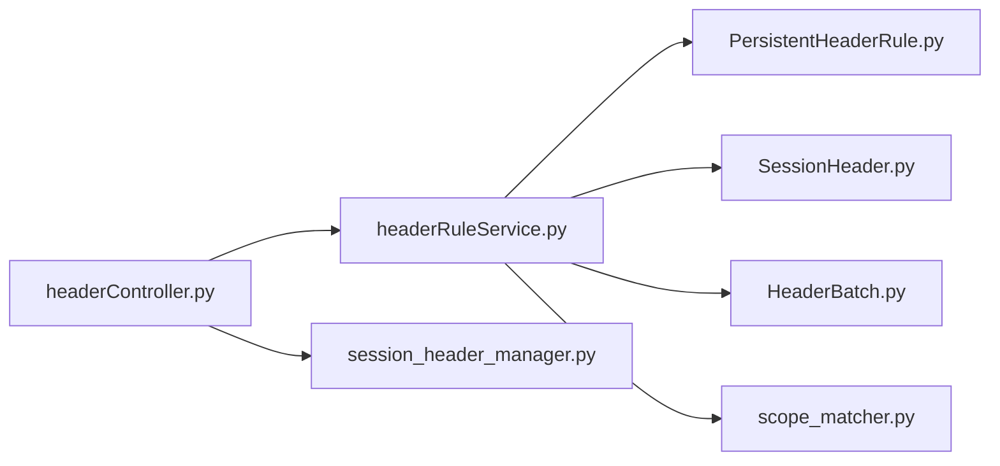

# 请求头规则接口

<cite>
**本文引用的文件**
- [headerController.py](file://src/backEnd/api/commonApi/headerController.py)
- [headerRuleService.py](file://src/backEnd/service/headerRuleService.py)
- [HeaderBatch.py](file://src/backEnd/model/HeaderBatch.py)
- [PersistentHeaderRule.py](file://src/backEnd/model/PersistentHeaderRule.py)
- [SessionHeader.py](file://src/backEnd/model/SessionHeader.py)
- [HeaderScope.py](file://src/backEnd/model/HeaderScope.py)
- [scope_matcher.py](file://src/backEnd/utils/scope_matcher.py)
- [session_header_manager.py](file://src/backEnd/utils/session_header_manager.py)
- [test_header_processor_scope.py](file://src/backEnd/tests/test_header_processor_scope.py)
- [HEADER_CONFIG_USER_GUIDE.md](file://doc/HEADER_CONFIG_USER_GUIDE.md)
</cite>

## 目录
1. [简介](#简介)
2. [项目结构](#项目结构)
3. [核心组件](#核心组件)
4. [架构总览](#架构总览)
5. [详细组件分析](#详细组件分析)
6. [依赖关系分析](#依赖关系分析)
7. [性能与并发特性](#性能与并发特性)
8. [故障排查指南](#故障排查指南)
9. [结论](#结论)
10. [附录](#附录)

## 简介
本文件面向后端开发者与运维人员，系统化梳理“请求头规则接口”的设计与实现，覆盖以下内容：
- 持久化请求头规则与会话级请求头的管理API（创建、查询、更新、删除、批量与预览）
- 数据模型与字段约束（HeaderBatch、PersistentHeaderRule、SessionHeader、HeaderScope）
- 作用域匹配逻辑（scope_matcher）如何决定规则是否应用于特定请求
- 规则优先级与冲突解决机制
- 实际示例：为不同域名配置自定义请求头
- 性能与并发特性、错误处理与排障建议

## 项目结构
后端采用“控制器-服务-模型-工具”分层组织：
- 控制器层：提供REST接口，路由前缀为/commonApi/header
- 服务层：封装业务逻辑，负责规则持久化、预览、批量处理
- 模型层：定义请求/响应数据结构与校验
- 工具层：作用域匹配、会话头内存管理、解析器等

图表来源
- [headerController.py](file://src/backEnd/api/commonApi/headerController.py#L1-L200)
- [headerRuleService.py](file://src/backEnd/service/headerRuleService.py#L1-L200)
- [HeaderBatch.py](file://src/backEnd/model/HeaderBatch.py#L1-L86)
- [PersistentHeaderRule.py](file://src/backEnd/model/PersistentHeaderRule.py#L1-L104)
- [SessionHeader.py](file://src/backEnd/model/SessionHeader.py#L1-L97)
- [HeaderScope.py](file://src/backEnd/model/HeaderScope.py#L1-L187)
- [scope_matcher.py](file://src/backEnd/utils/scope_matcher.py#L1-L140)
- [session_header_manager.py](file://src/backEnd/utils/session_header_manager.py#L1-L120)

章节来源
- [headerController.py](file://src/backEnd/api/commonApi/headerController.py#L1-L200)
- [headerRuleService.py](file://src/backEnd/service/headerRuleService.py#L1-L200)

## 核心组件
- 持久化请求头规则
  - 模型：PersistentHeaderRule、PersistentHeaderRuleCreate、PersistentHeaderRuleUpdate
  - 作用域：HeaderScope（协议、主机、IP、端口、路径、正则开关）
  - 服务：创建/查询/更新/删除、批量创建、预览处理
- 会话级请求头
  - 模型：SessionHeader、SessionHeaderCreate、SessionHeaderBatchCreate
  - 内存管理：SessionHeaderManager（线程安全、过期清理、持久化同步）
- 批量处理
  - HeaderBatch：解析原始文本、批量创建持久化规则或会话头
- 作用域匹配
  - ScopeMatcher：按协议/主机/IP/端口/路径进行AND逻辑匹配，支持关键字与正则

章节来源
- [PersistentHeaderRule.py](file://src/backEnd/model/PersistentHeaderRule.py#L1-L104)
- [SessionHeader.py](file://src/backEnd/model/SessionHeader.py#L1-L97)
- [HeaderScope.py](file://src/backEnd/model/HeaderScope.py#L1-L187)
- [HeaderBatch.py](file://src/backEnd/model/HeaderBatch.py#L1-L86)
- [scope_matcher.py](file://src/backEnd/utils/scope_matcher.py#L1-L140)
- [session_header_manager.py](file://src/backEnd/utils/session_header_manager.py#L1-L120)

## 架构总览
下图展示请求头规则接口的端到端调用链路与关键数据流。

图表来源
- [headerController.py](file://src/backEnd/api/commonApi/headerController.py#L355-L422)
- [headerRuleService.py](file://src/backEnd/service/headerRuleService.py#L584-L623)
- [scope_matcher.py](file://src/backEnd/utils/scope_matcher.py#L35-L141)
- [session_header_manager.py](file://src/backEnd/utils/session_header_manager.py#L151-L171)

## 详细组件分析

### 1) 持久化请求头规则管理API
- 创建规则
  - 方法：POST /commonApi/header/persistent-header-rules
  - 输入：PersistentHeaderRuleCreate（名称、头名、头值、替换策略、匹配条件、优先级、是否启用、作用域）
  - 输出：BaseResponseMsg（包含规则详情）
- 查询规则
  - GET /commonApi/header/persistent-header-rules?active_only=true
  - GET /commonApi/header/persistent-header-rules/{rule_id}
- 更新规则
  - PUT /commonApi/header/persistent-header-rules/{rule_id}
  - 输入：PersistentHeaderRuleUpdate（可选字段）
- 删除规则
  - DELETE /commonApi/header/persistent-header-rules/{rule_id}

数据模型要点
- ReplaceStrategy：REPLACE/APPEND/PREPEND/CONDITIONAL/UPSERT
- HeaderScope：protocol/host/ip/port/path/use_regex
- 优先级：0-100，数值越大优先级越高；服务层按优先级降序排序

章节来源
- [headerController.py](file://src/backEnd/api/commonApi/headerController.py#L68-L133)
- [headerRuleService.py](file://src/backEnd/service/headerRuleService.py#L74-L176)
- [PersistentHeaderRule.py](file://src/backEnd/model/PersistentHeaderRule.py#L1-L104)

### 2) 会话级请求头管理API
- 设置会话头
  - POST /commonApi/header/session-headers
  - 输入：SessionHeaderBatchCreate（headers列表）
  - 结果：部分成功返回206，全部成功返回200
- 获取会话头
  - GET /commonApi/header/session-headers
  - 输出：client_ip、headers列表、总数
- 更新会话头
  - PUT /commonApi/header/session-headers/{header_name}
  - 输入：SessionHeaderUpdateRequest（header_value、replace_strategy、priority、is_active、ttl、scope）
- 删除单个会话头
  - DELETE /commonApi/header/session-headers/{header_name}
- 清除会话头
  - DELETE /commonApi/header/session-headers

数据模型要点
- SessionHeaderCreate：header_name、header_value、replace_strategy、priority、is_active、ttl、scope
- SessionHeader：包含过期时间、来源IP、作用域
- 作用域：仅在预览/处理阶段参与匹配，不作为会话头持久化字段

章节来源
- [headerController.py](file://src/backEnd/api/commonApi/headerController.py#L135-L269)
- [SessionHeader.py](file://src/backEnd/model/SessionHeader.py#L1-L97)
- [session_header_manager.py](file://src/backEnd/utils/session_header_manager.py#L1-L120)

### 3) 批量与预览接口
- 批量解析
  - POST /commonApi/header/headers/parse
  - 输入：HeaderBatchParseRequest（raw_text、format_hint、default_priority、default_ttl）
  - 输出：ParseResult
- 批量创建持久化规则
  - POST /commonApi/header/persistent-header-rules/batch
  - 输入：ParsedHeaderBatchCreateRequest（headers、rule_config）
- 批量创建会话头
  - POST /commonApi/header/session-headers/batch
  - 输入：ParsedHeaderBatchCreateRequest、client_ip
- 一体化批量创建
  - POST /commonApi/header/headers/batch-create
  - 输入：HeaderBatchCreateRequest（raw_text、target_type、format_hint、rule_config/session_config）
- 预览请求头处理
  - POST /commonApi/header/header-processing/preview
  - 输入：HeaderPreviewRequest（headers、target_url）
  - 输出：预览结果（包含应用的规则/会话头、变更数量）

章节来源
- [headerController.py](file://src/backEnd/api/commonApi/headerController.py#L271-L481)
- [HeaderBatch.py](file://src/backEnd/model/HeaderBatch.py#L1-L86)
- [headerRuleService.py](file://src/backEnd/service/headerRuleService.py#L629-L800)

### 4) 作用域匹配逻辑（scope_matcher）
ScopeMatcher.match_scope(scope, target_url)决定规则是否应用于目标URL：
- scope为None或空：全局生效（返回True）
- 解析target_url为protocol/host/ip/port/path
- 各维度均需满足（AND逻辑）：
  - 协议：http/https或逗号分隔
  - 主机/IP：支持通配符*或正则（use_regex）
  - 端口：支持逗号分隔多个端口
  - 路径：支持通配符*
- 正则与URL解析使用缓存，提升性能

图表来源
- [scope_matcher.py](file://src/backEnd/utils/scope_matcher.py#L35-L141)

章节来源
- [scope_matcher.py](file://src/backEnd/utils/scope_matcher.py#L1-L141)
- [HeaderScope.py](file://src/backEnd/model/HeaderScope.py#L1-L187)

### 5) 规则优先级与冲突解决
- 优先级：0-100，数值越大优先级越高
- 服务层查询与处理时按优先级降序排序
- 冲突解决：
  - 同一头名的规则按优先级覆盖（高优先级覆盖低优先级）
  - ReplaceStrategy控制合并策略：
    - REPLACE：完全替换
    - APPEND/PREPEND：追加/前置
    - CONDITIONAL：条件性替换
    - UPSERT：存在则替换，不存在则新增
- 作用域：仅影响是否应用该规则，不影响优先级比较

章节来源
- [headerRuleService.py](file://src/backEnd/service/headerRuleService.py#L177-L260)
- [PersistentHeaderRule.py](file://src/backEnd/model/PersistentHeaderRule.py#L1-L104)
- [SessionHeader.py](file://src/backEnd/model/SessionHeader.py#L1-L97)

### 6) 实际示例：为不同域名配置自定义请求头
- 全局User-Agent
  - 创建持久化规则，不配置作用域，设置合理优先级
  - 结果：所有请求均附加该User-Agent
- 生产环境API认证
  - 创建持久化规则，配置作用域（协议=https、主机=api.production.com、路径=/v1/*）
  - 结果：仅对匹配URL添加Authorization头
- 临时测试Headers
  - 使用会话Header，批量添加多个临时头，设置TTL
  - 结果：在TTL内对所有请求生效

章节来源
- [HEADER_CONFIG_USER_GUIDE.md](file://doc/HEADER_CONFIG_USER_GUIDE.md#L1-L345)
- [test_header_processor_scope.py](file://src/backEnd/tests/test_header_processor_scope.py#L1-L341)

## 依赖关系分析
- 控制器依赖服务层完成业务处理
- 服务层依赖模型层进行数据校验与序列化
- 服务层依赖作用域匹配器进行规则筛选
- 会话头管理器负责内存存储与持久化同步
- 预览流程同时考虑持久化规则与会话头，并受作用域影响

图表来源
- [headerController.py](file://src/backEnd/api/commonApi/headerController.py#L1-L200)
- [headerRuleService.py](file://src/backEnd/service/headerRuleService.py#L1-L200)
- [scope_matcher.py](file://src/backEnd/utils/scope_matcher.py#L1-L140)
- [session_header_manager.py](file://src/backEnd/utils/session_header_manager.py#L1-L120)

章节来源
- [headerController.py](file://src/backEnd/api/commonApi/headerController.py#L1-L200)
- [headerRuleService.py](file://src/backEnd/service/headerRuleService.py#L1-L200)

## 性能与并发特性
- 作用域匹配
  - URL解析与正则编译使用缓存，限制缓存大小，避免内存膨胀
- 会话头管理
  - 使用线程锁保证并发安全
  - 过期清理定时执行，减少内存占用
- 数据库访问
  - 服务层在每次操作前检查连接有效性，失败时返回503
- 批量处理
  - 解析与验证分离，失败快速返回，降低整体耗时

章节来源
- [scope_matcher.py](file://src/backEnd/utils/scope_matcher.py#L143-L346)
- [session_header_manager.py](file://src/backEnd/utils/session_header_manager.py#L1-L120)
- [headerRuleService.py](file://src/backEnd/service/headerRuleService.py#L38-L73)

## 故障排查指南
- 规则创建失败
  - 检查必填字段与唯一性（名称重复）
  - 确认数据库连接可用
- 规则不生效
  - 检查是否启用
  - 检查作用域配置与目标URL是否匹配
  - 检查优先级是否被更高优先级覆盖
- 会话头不显示
  - 检查是否过期（TTL）
  - 检查是否正确设置client_ip
- 预览结果异常
  - 确认target_url是否提供
  - 检查作用域正则表达式是否合法

章节来源
- [headerRuleService.py](file://src/backEnd/service/headerRuleService.py#L74-L176)
- [test_header_processor_scope.py](file://src/backEnd/tests/test_header_processor_scope.py#L1-L341)

## 结论
本接口通过清晰的分层设计与严谨的数据模型，提供了灵活的请求头规则管理能力：
- 持久化规则适用于长期稳定的配置，支持作用域与优先级
- 会话头适用于临时测试，具备批量添加与过期管理
- 作用域匹配与预览功能帮助用户精准控制规则生效范围
- 服务层与工具层协同保障性能与可靠性

## 附录

### A. API清单与数据模型摘要
- 持久化规则
  - 创建：POST /commonApi/header/persistent-header-rules
  - 查询：GET /commonApi/header/persistent-header-rules
  - 查询单条：GET /commonApi/header/persistent-header-rules/{rule_id}
  - 更新：PUT /commonApi/header/persistent-header-rules/{rule_id}
  - 删除：DELETE /commonApi/header/persistent-header-rules/{rule_id}
- 会话头
  - 设置：POST /commonApi/header/session-headers
  - 查询：GET /commonApi/header/session-headers
  - 更新：PUT /commonApi/header/session-headers/{header_name}
  - 删除单个：DELETE /commonApi/header/session-headers/{header_name}
  - 清除：DELETE /commonApi/header/session-headers
- 批量与预览
  - 解析：POST /commonApi/header/headers/parse
  - 批量创建规则：POST /commonApi/header/persistent-header-rules/batch
  - 批量创建会话头：POST /commonApi/header/session-headers/batch
  - 一体化批量：POST /commonApi/header/headers/batch-create
  - 预览：POST /commonApi/header/header-processing/preview

章节来源
- [headerController.py](file://src/backEnd/api/commonApi/headerController.py#L68-L481)
- [PersistentHeaderRule.py](file://src/backEnd/model/PersistentHeaderRule.py#L68-L104)
- [SessionHeader.py](file://src/backEnd/model/SessionHeader.py#L63-L97)
- [HeaderBatch.py](file://src/backEnd/model/HeaderBatch.py#L22-L86)