# WebSocket 实时通知系统

<cite>
**本文档引用文件**   
- [websocket_manager.py](file://src/backEnd/utils/websocket_manager.py)
- [useWebSocket.ts](file://src/frontEnd/src/utils/useWebSocket.ts)
- [app.py](file://src/backEnd/app.py)
- [TaskList/index.vue](file://src/frontEnd/src/views/TaskList/index.vue)
- [task.ts](file://src/frontEnd/src/stores/task.ts)
- [FEATURE_UPDATES.md](file://doc/FEATURE_UPDATES.md)
</cite>

## 目录
1. [简介](#简介)
2. [系统架构](#系统架构)
3. [核心组件分析](#核心组件分析)
4. [后端 WebSocket 管理器](#后端-websocket-管理器)
5. [前端 WebSocket 客户端](#前端-websocket-客户端)
6. [消息通信协议](#消息通信协议)
7. [连接生命周期管理](#连接生命周期管理)
8. [定时刷新机制](#定时刷新机制)
9. [任务创建通知](#任务创建通知)
10. [前端集成与使用](#前端集成与使用)
11. [API 接口](#api-接口)
12. [配置与管理](#配置与管理)
13. [错误处理与重连](#错误处理与重连)
14. [性能与优化](#性能与优化)
15. [总结](#总结)

## 简介
WebSocket 实时通知系统是 sqlmapWebUI 项目中的核心功能模块，旨在为前后端提供实时通信能力。该系统通过 WebSocket 协议实现服务器主动推送消息给客户端，替代了传统的轮询机制，显著提升了系统的实时性和响应效率。

系统主要功能包括：
- **定时刷新通知**：后端定时向所有连接的客户端推送刷新通知，触发前端数据更新
- **任务创建通知**：当新任务创建时，立即通知所有客户端刷新数据
- **配置同步**：客户端可以请求更新刷新间隔，变更会广播给所有连接
- **心跳机制**：维持连接活跃，检测连接状态
- **自动重连**：网络中断后自动尝试重新连接

该系统在 v1.8.0 版本中引入，解决了传统轮询机制带来的性能开销和延迟问题，实现了真正的实时通信。

**Section sources**
- [FEATURE_UPDATES.md](file://doc/FEATURE_UPDATES.md#L140-L146)

## 系统架构
WebSocket 实时通知系统采用典型的客户端-服务器架构，前后端通过 WebSocket 协议建立持久化连接，实现双向通信。

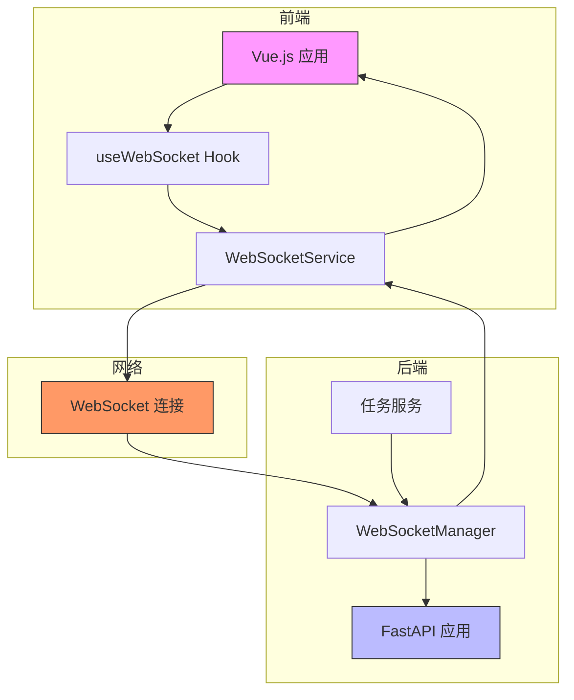

**Diagram sources **
- [useWebSocket.ts](file://src/frontEnd/src/utils/useWebSocket.ts)
- [websocket_manager.py](file://src/backEnd/utils/websocket_manager.py)
- [app.py](file://src/backEnd/app.py)

## 核心组件分析
WebSocket 实时通知系统由前后端多个核心组件协同工作，共同实现完整的实时通信功能。

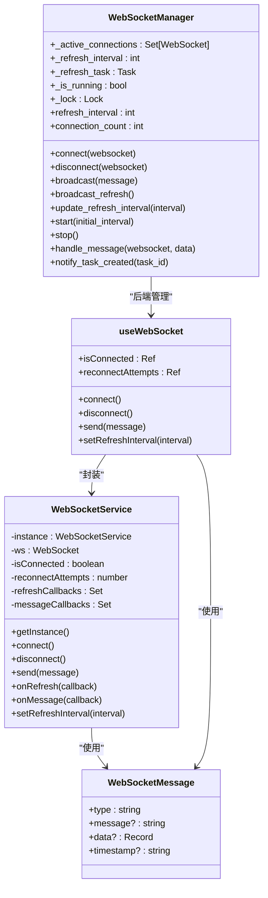

**Diagram sources **
- [websocket_manager.py](file://src/backEnd/utils/websocket_manager.py#L17-L271)
- [useWebSocket.ts](file://src/frontEnd/src/utils/useWebSocket.ts#L7-L434)
- [useWebSocket.ts](file://src/frontEnd/src/utils/useWebSocket.ts#L286-L434)

## 后端 WebSocket 管理器
后端 WebSocket 管理器是整个实时通知系统的核心，负责管理所有 WebSocket 连接、广播消息和定时任务。

### 主要功能
- **连接管理**：维护所有活跃的 WebSocket 连接集合
- **消息广播**：向所有连接的客户端广播消息
- **定时刷新**：启动定时任务，按指定间隔发送刷新通知
- **任务通知**：当新任务创建时，主动通知所有客户端
- **配置更新**：处理客户端的配置更新请求，并广播给所有连接

### 初始化与生命周期
WebSocket 管理器在应用启动时通过 FastAPI 的生命周期管理器自动启动。系统从配置文件读取初始刷新间隔，并启动定时刷新任务。

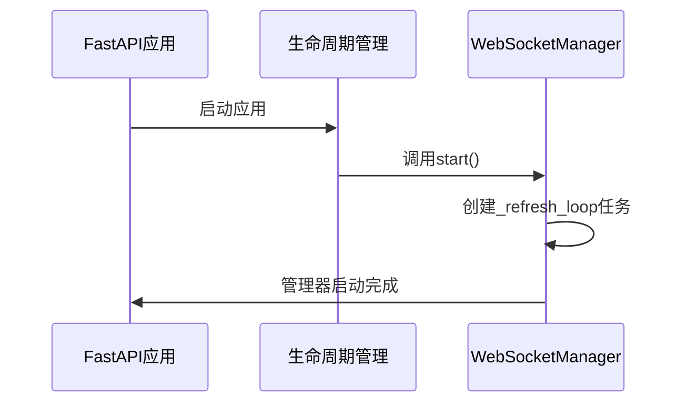

**Diagram sources **
- [app.py](file://src/backEnd/app.py#L28-L41)
- [websocket_manager.py](file://src/backEnd/utils/websocket_manager.py#L185-L198)

**Section sources**
- [app.py](file://src/backEnd/app.py#L32-L35)
- [websocket_manager.py](file://src/backEnd/utils/websocket_manager.py#L185-L198)

## 前端 WebSocket 客户端
前端 WebSocket 客户端提供了两种使用方式：Vue Composition API Hook 和全局单例服务，满足不同场景的需求。

### useWebSocket Hook
`useWebSocket` 是一个 Vue Composition API Hook，用于在组件中轻松集成 WebSocket 功能。它提供了连接状态、重连次数等响应式数据，以及连接、断开、发送消息等方法。

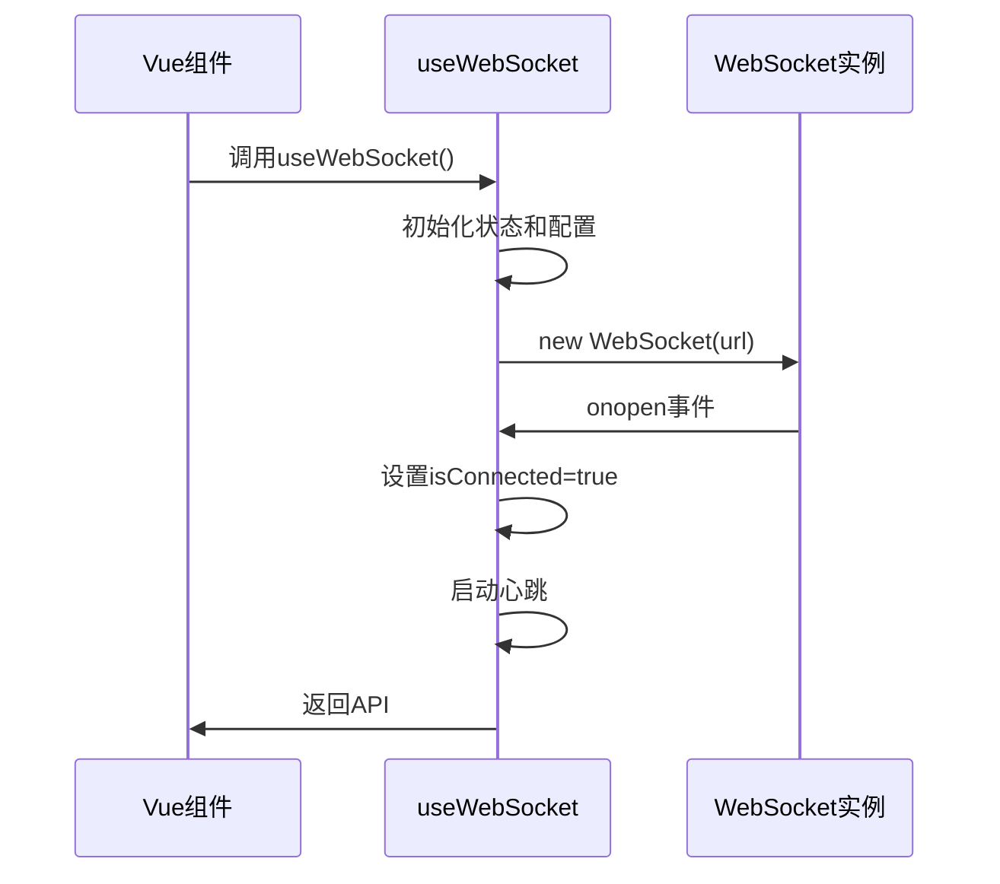

**Diagram sources **
- [useWebSocket.ts](file://src/frontEnd/src/utils/useWebSocket.ts#L57-L281)

### WebSocketService 单例
`WebSocketService` 是一个全局单例服务，适用于需要在多个组件间共享 WebSocket 连接的场景。它提供了事件订阅机制，允许组件订阅特定类型的消息。

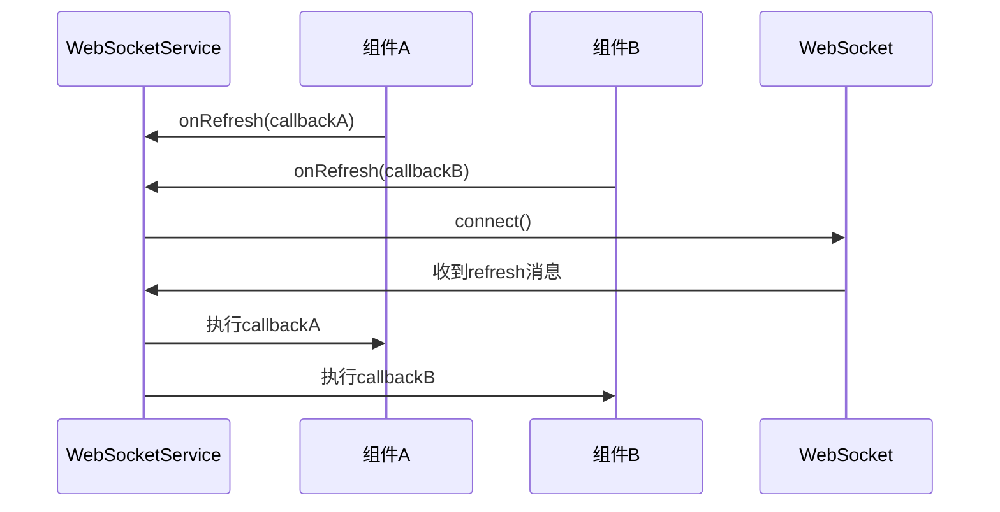

**Diagram sources **
- [useWebSocket.ts](file://src/frontEnd/src/utils/useWebSocket.ts#L286-L434)

**Section sources**
- [useWebSocket.ts](file://src/frontEnd/src/utils/useWebSocket.ts#L57-L434)

## 消息通信协议
WebSocket 系统定义了一套标准化的消息通信协议，确保前后端能够正确解析和处理消息。

### 消息格式
所有消息都遵循统一的 JSON 格式：

```json
{
  "type": "消息类型",
  "message": "消息内容",
  "data": { "附加数据" },
  "timestamp": "时间戳"
}
```

### 消息类型
系统支持多种消息类型，每种类型都有特定的用途：

| 消息类型 | 方向 | 描述 | 数据结构 |
|---------|------|------|---------|
| connected | 服务端→客户端 | 连接成功通知 | { refreshInterval: number } |
| refresh | 服务端→客户端 | 刷新通知 | { reason: string, taskId?: string } |
| ping | 客户端→服务端 | 心跳请求 | 无 |
| pong | 服务端→客户端 | 心跳响应 | { timestamp: string } |
| setRefreshInterval | 客户端→服务端 | 更新刷新间隔 | { interval: number } |
| configUpdate | 服务端→客户端 | 配置更新通知 | { refreshInterval: number } |

**Section sources**
- [useWebSocket.ts](file://src/frontEnd/src/utils/useWebSocket.ts#L9-L14)
- [websocket_manager.py](file://src/backEnd/utils/websocket_manager.py#L79-L86)
- [useWebSocket.ts](file://src/frontEnd/src/utils/useWebSocket.ts#L147-L165)

## 连接生命周期管理
WebSocket 系统实现了完整的连接生命周期管理，包括连接建立、保持、断开和重连。

### 连接建立
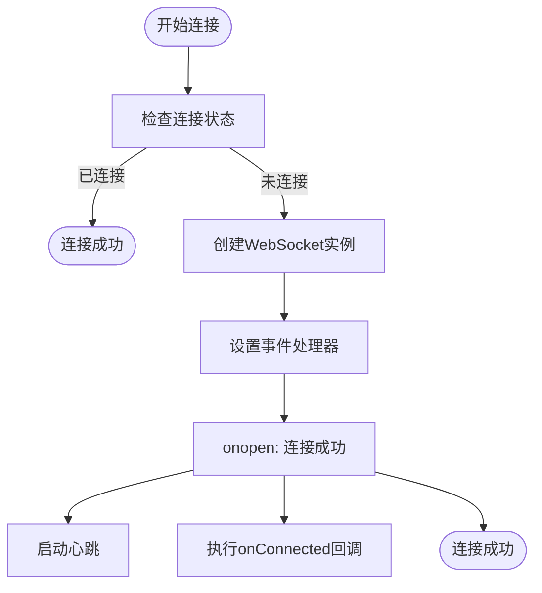

### 断开与重连
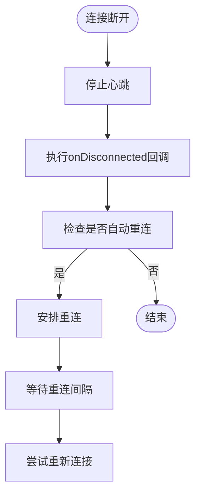

**Diagram sources **
- [useWebSocket.ts](file://src/frontEnd/src/utils/useWebSocket.ts#L83-L117)
- [useWebSocket.ts](file://src/frontEnd/src/utils/useWebSocket.ts#L104-L116)

**Section sources**
- [useWebSocket.ts](file://src/frontEnd/src/utils/useWebSocket.ts#L83-L137)

## 定时刷新机制
定时刷新机制是 WebSocket 系统的核心功能之一，它允许后端按固定间隔主动推送刷新通知给所有客户端。

### 工作流程
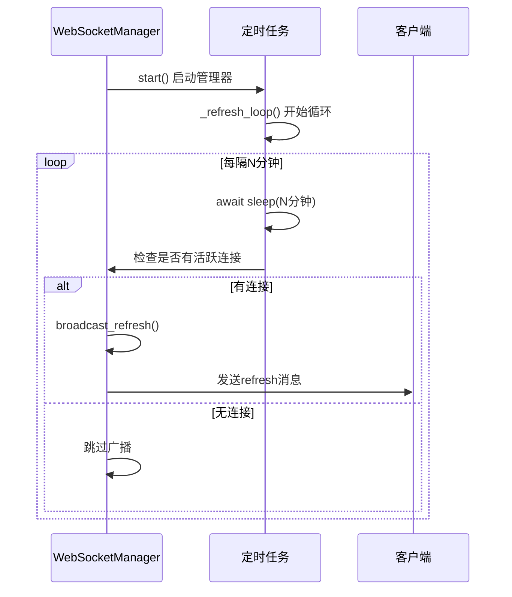

### 动态间隔调整
系统支持动态调整刷新间隔。当客户端请求更改间隔时，后端会更新配置并重启定时任务以应用新间隔。

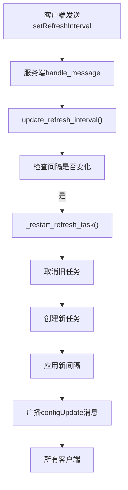

**Diagram sources **
- [websocket_manager.py](file://src/backEnd/utils/websocket_manager.py#L156-L184)
- [websocket_manager.py](file://src/backEnd/utils/websocket_manager.py#L149-L154)

**Section sources**
- [websocket_manager.py](file://src/backEnd/utils/websocket_manager.py#L131-L147)
- [websocket_manager.py](file://src/backEnd/utils/websocket_manager.py#L236-L247)

## 任务创建通知
当用户创建新任务时，系统会立即通过 WebSocket 通知所有连接的客户端，触发前端数据刷新。

### 通知流程
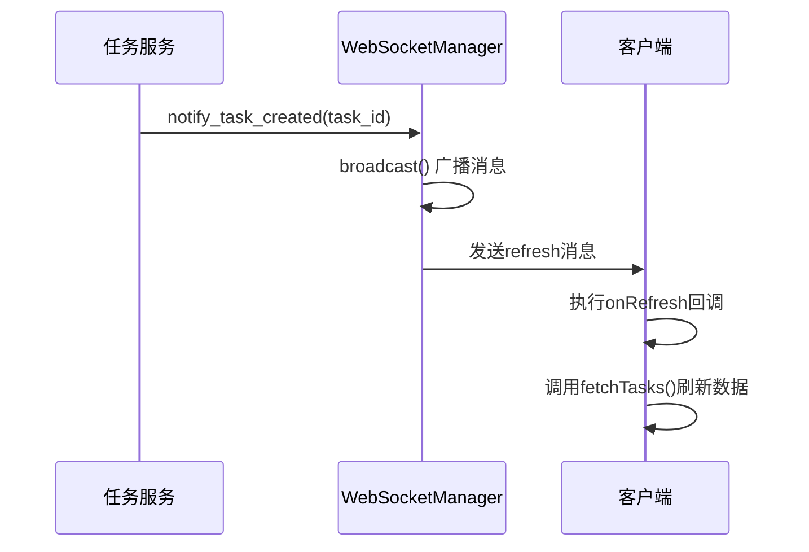

### 实现细节
后端在任务创建成功后调用 `ws_manager.notify_task_created()` 方法，该方法会广播一条类型为 "refresh" 的消息，其中包含任务创建的原因和任务ID。

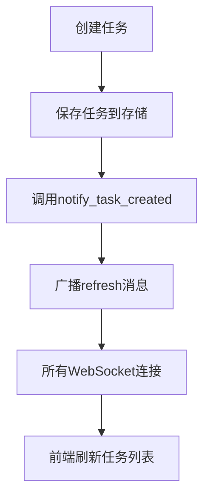

**Diagram sources **
- [websocket_manager.py](file://src/backEnd/utils/websocket_manager.py#L251-L268)

**Section sources**
- [websocket_manager.py](file://src/backEnd/utils/websocket_manager.py#L251-L268)

## 前端集成与使用
WebSocket 功能在前端多个组件中被集成使用，其中任务列表页面是最典型的使用场景。

### 任务列表页面集成
在任务列表页面中，WebSocket 通知被用来触发数据刷新，替代了传统的定时轮询。

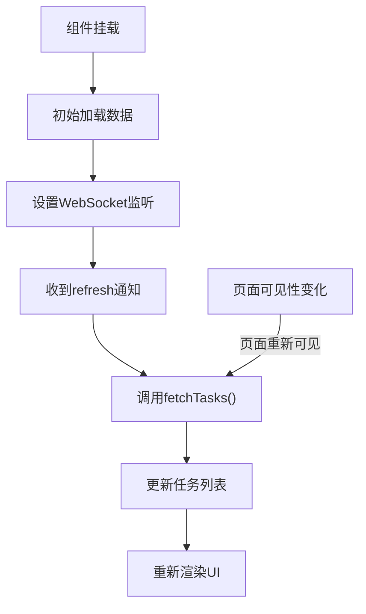

### 代码实现
```typescript
onMounted(() => {
  // 从URL参数读取过滤条件
  applyFiltersFromUrl()
  
  // 初始加载任务列表（后续刷新由 WebSocket 通知触发）
  fetchTasks()
  
  // 监听页面可见性，页面重新可见时刷新一次
  document.addEventListener('visibilitychange', handleVisibilityChange)
})
```

**Section sources**
- [TaskList/index.vue](file://src/frontEnd/src/views/TaskList/index.vue#L291-L299)

## API 接口
WebSocket 系统提供了 RESTful API 接口，用于查询状态和更新配置。

### 获取 WebSocket 状态
```http
GET /api/ws/status
```

**响应格式：**
```json
{
  "code": 200,
  "success": true,
  "message": "success",
  "data": {
    "connectionCount": 3,
    "refreshInterval": 5
  }
}
```

### 设置刷新间隔
```http
POST /api/ws/refresh-interval
Content-Type: application/json

{
  "interval": 10
}
```

**响应格式：**
```json
{
  "code": 200,
  "success": true,
  "message": "success",
  "data": {
    "refreshInterval": 10
  }
}
```

**Section sources**
- [app.py](file://src/backEnd/app.py#L126-L144)

## 配置与管理
WebSocket 系统提供了灵活的配置选项，允许根据运行环境进行调整。

### 配置项
| 配置项 | 默认值 | 描述 |
|-------|-------|------|
| 刷新间隔 | 5分钟 | 定时推送刷新通知的间隔 |
| 重连间隔 | 5秒 | 连接断开后重试的间隔 |
| 最大重连次数 | 10次 | 最多重连尝试次数 |
| 心跳间隔 | 30秒 | 心跳消息发送间隔 |
| 最大连接数 | 无限制 | 同时允许的最大连接数 |

### 环境适配
系统会根据运行环境自动调整 WebSocket URL：

```typescript
function getWebSocketUrl(): string {
  const protocol = window.location.protocol === 'https:' ? 'wss:' : 'ws:'
  const host = window.location.host
  
  // 开发环境使用后端端口
  if (import.meta.env.DEV) {
    return `ws://localhost:8775/ws`
  }
  
  return `${protocol}//${host}/ws`
}
```

**Section sources**
- [useWebSocket.ts](file://src/frontEnd/src/utils/useWebSocket.ts#L42-L52)

## 错误处理与重连
WebSocket 系统实现了完善的错误处理和自动重连机制，确保连接的稳定性和可靠性。

### 错误处理策略
- **连接错误**：捕获连接异常，记录错误日志
- **消息解析错误**：捕获 JSON 解析异常，防止崩溃
- **发送错误**：捕获消息发送异常，记录警告
- **连接断开**：处理 WebSocketDisconnect 异常

### 自动重连机制
系统实现了指数退避重连算法，避免在网络不稳定时频繁重试。

```mermaid
flowchart TD
Attempt["第N次重连尝试"] --> Delay["计算延迟时间"]
Delay --> |delay = min(interval * N, 60s)| Wait["等待delay时间"]
Wait --> Connect["尝试连接"]
Connect --> |成功| Success["连接成功"]
Connect --> |失败| CheckAttempts["检查重连次数"]
CheckAttempts --> |未达上限| Attempt
CheckAttempts --> |已达上限| Fail["重连失败"]
```

**Section sources**
- [useWebSocket.ts](file://src/frontEnd/src/utils/useWebSocket.ts#L217-L233)
- [useWebSocket.ts](file://src/frontEnd/src/utils/useWebSocket.ts#L373-L385)

## 性能与优化
WebSocket 系统在设计时充分考虑了性能和资源优化。

### 连接管理优化
- **线程安全**：使用 asyncio.Lock 保护连接集合的并发访问
- **连接清理**：定期清理已断开的连接，避免内存泄漏
- **批量发送**：在广播消息时复制连接集合，避免迭代时修改

### 资源优化
- **心跳机制**：保持连接活跃，避免被防火墙中断
- **智能轮询**：结合 WebSocket 和轮询，在无连接时降级为轮询
- **消息压缩**：未来可考虑实现消息压缩以减少带宽占用

### 性能监控
系统提供了状态查询接口，可用于监控 WebSocket 服务的健康状况。

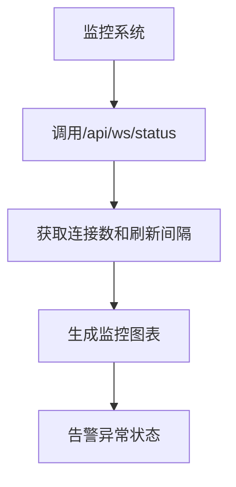

**Section sources**
- [websocket_manager.py](file://src/backEnd/utils/websocket_manager.py#L38-L38)
- [websocket_manager.py](file://src/backEnd/utils/websocket_manager.py#L100-L103)

## 总结
WebSocket 实时通知系统是 sqlmapWebUI 项目中的一项重要功能改进，它通过建立持久化的双向通信通道，实现了真正的实时数据同步。

### 主要优势
1. **实时性**：服务器可以立即推送更新，无需等待轮询周期
2. **高效性**：减少了不必要的 HTTP 请求，降低了网络开销
3. **用户体验**：用户操作后能立即看到结果，提升了交互体验
4. **可扩展性**：基于消息的架构易于扩展新的通知类型

### 未来改进方向
- **消息确认机制**：实现消息的可靠传递，确保重要通知不丢失
- **用户级通知**：支持向特定用户或用户组发送通知
- **离线消息**：存储离线期间的消息，用户上线后推送
- **性能监控**：增加更详细的性能指标和监控功能

该系统的成功实施显著提升了 sqlmapWebUI 的实时性和用户体验，为后续功能扩展奠定了坚实的基础。