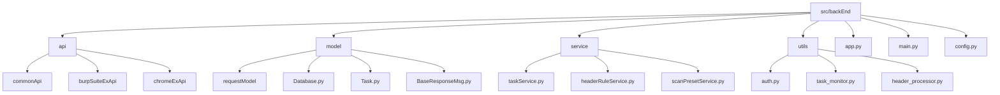
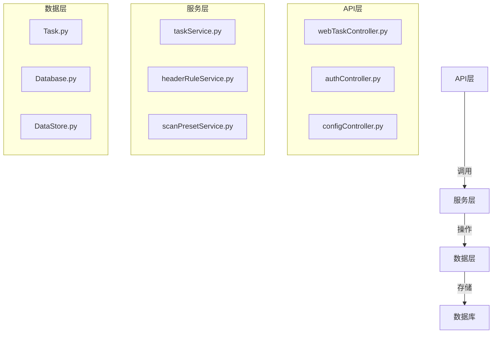
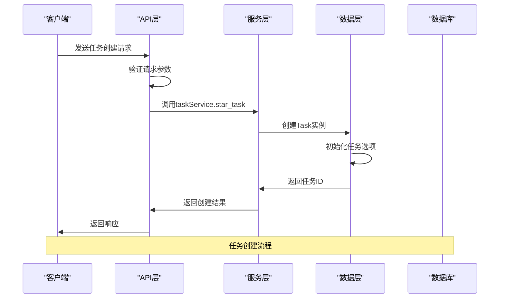

# 后端架构

<cite>
**本文档引用的文件**
- [app.py](file://src/backEnd/app.py)
- [main.py](file://src/backEnd/main.py)
- [config.py](file://src/backEnd/config.py)
- [uvicorn_config.json](file://src/backEnd/uvicorn_config.json)
- [webTaskController.py](file://src/backEnd/api/commonApi/webTaskController.py)
- [taskService.py](file://src/backEnd/service/taskService.py)
- [Task.py](file://src/backEnd/model/Task.py)
- [TaskRequest.py](file://src/backEnd/model/requestModel/TaskRequest.py)
- [DataStore.py](file://src/backEnd/model/DataStore.py)
- [auth.py](file://src/backEnd/utils/auth.py)
- [authController.py](file://src/backEnd/api/commonApi/authController.py)
- [BaseResponseMsg.py](file://src/backEnd/model/BaseResponseMsg.py)
- [task_monitor.py](file://src/backEnd/utils/task_monitor.py)
</cite>

## 目录
1. [项目结构](#项目结构)
2. [分层架构设计](#分层架构设计)
3. [FastAPI框架应用](#fastapi框架应用)
4. [依赖注入机制](#依赖注入机制)
5. [Pydantic模型验证](#pydantic模型验证)
6. [Uvicorn服务器配置](#uvicorn服务器配置)
7. [配置管理方案](#配置管理方案)
8. [后端模块交互](#后端模块交互)
9. [异步编程模式](#异步编程模式)

## 项目结构

项目后端采用清晰的分层架构，主要包含以下目录结构：



**图示来源**
- [app.py](file://src/backEnd/app.py#L1-L80)
- [main.py](file://src/backEnd/main.py#L1-L168)
- [taskService.py](file://src/backEnd/service/taskService.py#L1-L535)

## 分层架构设计

项目采用典型的三层架构设计，各层职责明确：



**图示来源**
- [webTaskController.py](file://src/backEnd/api/commonApi/webTaskController.py#L1-L91)
- [taskService.py](file://src/backEnd/service/taskService.py#L1-L535)
- [Task.py](file://src/backEnd/model/Task.py#L1-L333)

### API层

API层负责处理HTTP请求和响应，主要职责包括：
- 请求路由和分发
- 请求参数验证
- 响应数据序列化
- 错误处理和返回

API层通过FastAPI的`APIRouter`实现模块化路由管理，在`app.py`中统一注册：

```python
app.include_router(web_task_router, prefix="/api", tags=["web-task"])
app.include_router(auth_router, prefix="/api", tags=["auth"])
```

**本节来源**
- [app.py](file://src/backEnd/app.py#L36-L42)
- [webTaskController.py](file://src/backEnd/api/commonApi/webTaskController.py#L16-L17)

### 服务层

服务层包含核心业务逻辑，主要职责包括：
- 任务管理（创建、删除、停止等）
- 扫描参数验证
- 数据库操作
- 与其他服务的交互

`taskService.py`实现了任务服务的核心功能，包括任务创建、删除、查询等操作：

```python
class TaskService(object):
    async def star_task(self, remote_addr: str, scanUrl: str, host, headers: list, body: str, options: dict):
        # 任务创建逻辑
        pass
        
    async def delete_task(self, taskid):
        # 任务删除逻辑
        pass
```

**本节来源**
- [taskService.py](file://src/backEnd/service/taskService.py#L46-L534)

### 数据层

数据层负责数据的持久化和管理，主要组件包括：
- `Task`类：表示扫描任务的实体
- `Database`类：数据库操作封装
- `DataStore`类：全局数据存储

`DataStore`类作为全局数据存储中心，管理着任务、数据库连接等共享资源：

```python
class DataStore(object):
    current_db: Optional[Database] = None
    header_db: Optional[HeaderDatabase] = None
    scan_preset_db: Optional["ScanPresetDatabase"] = None
    tasks_lock = threading.Lock()
    tasks = OrderedDict()
```

**本节来源**
- [DataStore.py](file://src/backEnd/model/DataStore.py#L12-L38)
- [Task.py](file://src/backEnd/model/Task.py#L49-L333)

## FastAPI框架应用

FastAPI框架在项目中扮演着核心角色，提供了现代化的API开发体验。

### 应用初始化

在`app.py`中初始化FastAPI应用，并配置相关中间件：

```python
app = FastAPI()

# 配置CORS中间件
app.add_middleware(
    CORSMiddleware,
    allow_origin_regex=r"http://(localhost|127\.0\.0\.1):(517[3-6]|8775)",
    allow_credentials=True,
    allow_methods=["*"],
    allow_headers=["*"]
)
```

**本节来源**
- [app.py](file://src/backEnd/app.py#L20-L34)

### 路由管理

项目采用模块化路由管理，不同功能的API被组织在不同的路由器中：

```python
# 在app.py中注册各个路由器
app.include_router(web_task_router, prefix="/api", tags=["web-task"])
app.include_router(auth_router, prefix="/api", tags=["auth"])
app.include_router(config_router, prefix="/api", tags["config"])
```

每个API模块都有自己的路由器实例：

```python
# webTaskController.py
router = APIRouter(prefix="/web/admin")
```

**本节来源**
- [app.py](file://src/backEnd/app.py#L36-L42)
- [webTaskController.py](file://src/backEnd/api/commonApi/webTaskController.py#L16)

### 健康检查端点

项目提供了健康检查端点，用于监控服务状态：

```python
@app.get("/api/health")
def health_check():
    """健康检查端点"""
    current_time = time.time()
    uptime = int(current_time - START_TIME)
    
    return {
        "code": 200,
        "success": True,
        "message": "success",
        "data": {
            "status": "healthy",
            "timestamp": int(current_time * 1000),
            "version": VERSION,
            "uptime": uptime
        }
    }
```

**本节来源**
- [app.py](file://src/backEnd/app.py#L61-L79)

## 依赖注入机制

项目通过多种方式实现了依赖注入，确保组件之间的松耦合。

### 服务实例注入

服务层通过单例模式提供服务实例，避免重复创建：

```python
# taskService.py
taskService = TaskService()

# webTaskController.py
from service.taskService import taskService
```

### 请求依赖注入

使用FastAPI的依赖注入系统处理认证逻辑：

```python
@router.post('/task/add')
async def add_task_from_web(
    taskAddRequest: TaskAddRequest, 
    request: Request, 
    current_user: dict = Depends(get_current_user)
):
    # 使用注入的依赖
    pass
```

**本节来源**
- [taskService.py](file://src/backEnd/service/taskService.py#L534)
- [webTaskController.py](file://src/backEnd/api/commonApi/webTaskController.py#L23)
- [auth.py](file://src/backEnd/utils/auth.py#L5-L23)

## Pydantic模型验证

Pydantic模型在项目中用于请求验证和响应序列化。

### 请求模型

定义请求数据结构和验证规则：

```python
class TaskAddRequest(BaseModel):
    scanUrl: Annotated[str, Field(description="扫描地址...")]
    host: Annotated[str, Field(description="扫描域名...")]
    headers: Annotated[list, Field(description="请求头...")]
    body: Annotated[str, Field(description="请求体...")]
    options: Annotated[dict, Field(description="扫描参数...")]
```

### 响应模型

定义统一的响应格式：

```python
class BaseResponseMsg(JSONResponse):
    def __init__(self, data=None, msg="", success=False, code=status.HTTP_200_OK):
        super().__init__(
            content={
                "code": code,
                "success": success,
                "message": msg,
                "data": data,
            },
            status_code=status.HTTP_200_OK
        )
```

**本节来源**
- [TaskRequest.py](file://src/backEnd/model/requestModel/TaskRequest.py#L31-L36)
- [BaseResponseMsg.py](file://src/backEnd/model/BaseResponseMsg.py#L5-L21)

## Uvicorn服务器配置

Uvicorn作为ASGI服务器，提供了高性能的运行环境。

### 服务器启动

在`main.py`中配置并启动Uvicorn服务器：

```python
uvicorn.run(app=app, host="127.0.0.1", port=8775, reload=False, log_config='./uvicorn_config.json')
```

### 日志配置

通过JSON配置文件定制日志格式：

```json
{
    "version": 1,
    "disable_existing_loggers": false,
    "formatters": {
        "default": {
            "fmt": "[%(asctime)s] [%(levelname)s] [%(module)s] [%(filename)s] [Line: %(lineno)d] %(message)s",
            "datefmt": "%Y-%m-%d %H:%M:%S",
            "use_colors": true
        }
    },
    "handlers": {
        "default": {
            "formatter": "default",
            "class": "logging.StreamHandler",
            "stream": "ext://sys.stderr"
        }
    },
    "loggers": {
        "uvicorn": {
            "handlers": ["default"],
            "level": "INFO",
            "propagate": false
        }
    }
}
```

**本节来源**
- [main.py](file://src/backEnd/main.py#L161)
- [uvicorn_config.json](file://src/backEnd/uvicorn_config.json#L1-L45)

## 配置管理方案

项目采用多种方式管理配置信息。

### 版本配置

在`config.py`中定义版本信息：

```python
VERSION = "1.7.9"
```

### 任务限制配置

配置最大任务数及线程锁：

```python
MAX_TASKS_COUNT = 3
MAX_TASKS_COUNT_LOCK = threading.Lock()
```

### 环境配置

通过`pyproject.toml`管理项目依赖：

```toml
[project]
name = "sqlmapwebui"
version = "0.1.0"
requires-python = ">=3.13"
dependencies = []

[project.optional-dependencies]
thirdparty = [
    "fastapi[standard]",
    "apscheduler",
    "psutil",
]
```

**本节来源**
- [config.py](file://src/backEnd/config.py#L7-L8)
- [pyproject.toml](file://src/backEnd/pyproject.toml#L1-L17)

## 后端模块交互

各模块之间通过明确定义的接口进行交互。



**图示来源**
- [webTaskController.py](file://src/backEnd/api/commonApi/webTaskController.py#L19-L90)
- [taskService.py](file://src/backEnd/service/taskService.py#L58-L87)
- [Task.py](file://src/backEnd/model/Task.py#L49-L66)

## 异步编程模式

项目充分利用异步编程提高并发性能。

### 异步API端点

API端点使用`async/await`语法：

```python
@router.post('/task/add')
async def add_task_from_web(...):
    # 异步处理逻辑
    res = await taskService.star_task(...)
```

### 定时任务

使用APScheduler实现定时监控：

```python
scheduler = BackgroundScheduler()
scheduler.add_job(monitor, 'interval', seconds=3)
scheduler.start()
```

### 任务监控

`task_monitor.py`实现了任务调度逻辑：

```python
def monitor(max_tasks_count=None):
    with DataStore.tasks_lock:
        # 检查可运行任务
        for task in runnable_list:
            if running_task_cnt >= local_max_tasks_count:
                break
            # 启动任务
            task.engine_start()
            task.status = TaskStatus.Running
```

**本节来源**
- [webTaskController.py](file://src/backEnd/api/commonApi/webTaskController.py#L19)
- [main.py](file://src/backEnd/main.py#L156-L158)
- [task_monitor.py](file://src/backEnd/utils/task_monitor.py#L36-L94)