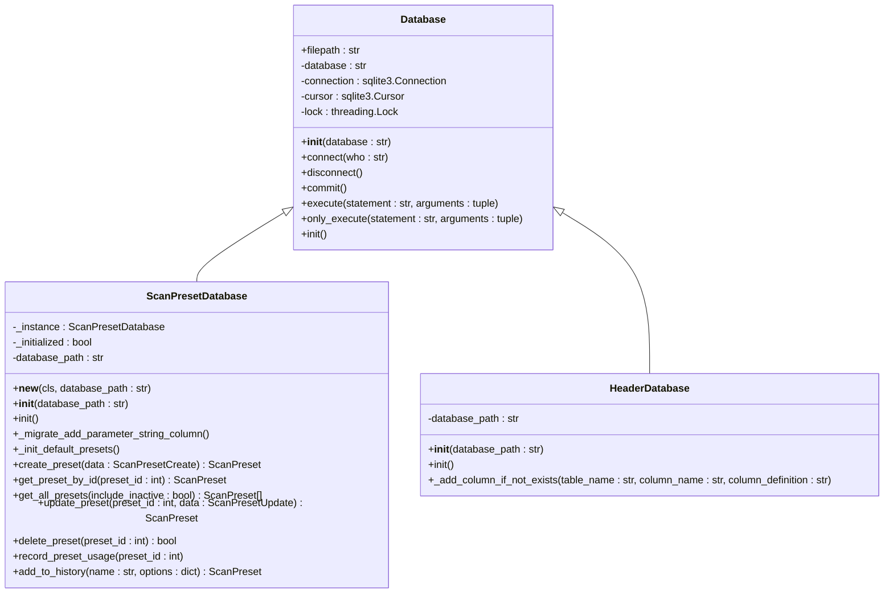

# 数据库设计

<cite>
**本文档引用的文件**   
- [Database.py](file://src/backEnd/model/Database.py)
- [DataStore.py](file://src/backEnd/model/DataStore.py)
- [ScanPresetDatabase.py](file://src/backEnd/model/ScanPresetDatabase.py)
- [HeaderDatabase.py](file://src/backEnd/model/HeaderDatabase.py)
- [ScanPreset.py](file://src/backEnd/model/ScanPreset.py)
- [Task.py](file://src/backEnd/model/Task.py)
- [main.py](file://src/backEnd/main.py)
</cite>

## 目录
1. [简介](#简介)
2. [数据库架构概述](#数据库架构概述)
3. [核心数据表设计](#核心数据表设计)
4. [数据库连接与事务管理](#数据库连接与事务管理)
5. [DataStore抽象层](#datastore抽象层)
6. [专用数据库类设计](#专用数据库类设计)
7. [实体关系图(ERD)](#实体关系图erd)
8. [数据库迁移与性能优化](#数据库迁移与性能优化)
9. [初始化与备份恢复](#初始化与备份恢复)

## 简介
sqlmapWebUI采用SQLite作为其数据持久化方案，为Web界面提供稳定可靠的配置存储和状态管理。系统设计了多层次的数据库架构，包括主IPC数据库、扫描配置预设数据库和请求头管理数据库，分别存储任务状态、用户配置和请求头规则。通过DataStore抽象层统一管理数据库连接，为上层服务提供一致的数据访问接口。本设计文档全面阐述了该系统的数据持久化方案，包括数据库架构、表结构设计、连接管理、抽象层实现和性能优化策略。

## 数据库架构概述
sqlmapWebUI的数据库架构采用多数据库分离的设计模式，将不同类型的数据存储在独立的SQLite数据库文件中，以提高数据管理的清晰度和性能。系统主要包含三个数据库：主IPC数据库（临时文件）、扫描配置预设数据库（scan_presets.db）和请求头管理数据库（headers.db）。这种分离设计使得配置数据可以持久化保存，而任务运行时的临时状态数据则在服务重启后自动清除。DataStore类作为全局数据存储中心，管理所有数据库连接实例，确保在整个应用生命周期内数据库连接的一致性和有效性。

**Section sources**
- [DataStore.py](file://src/backEnd/model/DataStore.py#L1-L38)
- [main.py](file://src/backEnd/main.py#L97-L154)

## 核心数据表设计
系统定义了多个核心数据表来支持不同的功能需求。主IPC数据库包含logs、data和errors三张表，分别用于存储任务日志、扫描结果和错误信息。扫描配置预设数据库包含scan_presets表，存储用户创建的各种扫描配置预设，包括快速扫描、深度扫描等。请求头管理数据库包含persistent_header_rules和session_headers两张表，分别存储持久化的请求头规则和会话性的请求头。所有表都设计了适当的主键、索引和约束，以确保数据完整性和查询性能。

```mermaid
erDiagram
SCAN_PRESETS {
int id PK
string name UK
string description
string preset_type
text options
text parameter_string
int is_active
string created_at
string updated_at
string last_used_at
int use_count
}
PERSISTENT_HEADER_RULES {
int id PK
string name UK
string header_name
string header_value
string replace_strategy
string match_condition
int priority
int is_active
string scope_config
string created_at
string updated_at
}
SESSION_HEADERS {
int id PK
string client_ip
string header_name
string header_value
string replace_strategy
int priority
int is_active
string scope_config
string expires_at
string created_at
string updated_at
string client_ip header_name UK
}
SCAN_PRESETS ||--o{ PERSISTENT_HEADER_RULES : "包含"
SCAN_PRESETS ||--o{ SESSION_HEADERS : "包含"
```

**Diagram sources **
- [ScanPresetDatabase.py](file://src/backEnd/model/ScanPresetDatabase.py#L57-L70)
- [HeaderDatabase.py](file://src/backEnd/model/HeaderDatabase.py#L29-L68)

**Section sources**
- [ScanPresetDatabase.py](file://src/backEnd/model/ScanPresetDatabase.py#L54-L84)
- [HeaderDatabase.py](file://src/backEnd/model/HeaderDatabase.py#L26-L75)

## 数据库连接与事务管理
Database类提供了数据库连接管理和事务处理的核心机制。系统使用sqlite3模块建立数据库连接，并设置了超时、隔离级别和线程安全等参数。通过threading.Lock实现线程安全的数据库操作，防止并发访问导致的数据竞争。execute方法内置了重试机制，当遇到"locked"异常时会自动休眠1秒后重试，确保在高并发场景下的稳定性。commit方法用于提交事务，确保数据的持久化。disconnect方法负责清理连接资源，避免资源泄漏。这种设计确保了数据库操作的原子性和一致性，为上层应用提供了可靠的持久化支持。

**Section sources**
- [Database.py](file://src/backEnd/model/Database.py#L1-L34)

## DataStore抽象层
DataStore类作为系统的数据存储抽象层，为上层服务提供了统一的数据访问接口。它采用模块级变量的方式管理全局状态，包括当前数据库连接、请求头数据库、扫描预设数据库和任务列表等。通过单例模式确保在整个应用中只有一个DataStore实例，避免了状态不一致的问题。DataStore还提供了会话性请求头管理器的单例获取方法，通过双重检查锁确保线程安全的单例创建。这种设计将数据库连接的管理与业务逻辑分离，提高了代码的可维护性和可测试性，同时也为未来的功能扩展提供了良好的基础。

**Section sources**
- [DataStore.py](file://src/backEnd/model/DataStore.py#L1-L38)

## 专用数据库类设计
系统设计了ScanPresetDatabase和HeaderDatabase两个专用数据库类，分别处理扫描配置预设和请求头管理的持久化需求。ScanPresetDatabase继承自Database类，实现了扫描配置的CRUD操作、默认配置初始化和历史记录管理。它采用单例模式确保全局唯一实例，并在初始化时自动创建数据库表和索引。HeaderDatabase同样继承自Database类，专门管理请求头规则，支持持久化规则和会话性请求头的存储。两个类都实现了表迁移机制，能够安全地添加新字段而不破坏现有数据。这种专用数据库类的设计使得数据访问逻辑更加清晰，降低了代码耦合度。



**Diagram sources **
- [ScanPresetDatabase.py](file://src/backEnd/model/ScanPresetDatabase.py#L25-L54)
- [HeaderDatabase.py](file://src/backEnd/model/HeaderDatabase.py#L11-L14)

**Section sources**
- [ScanPresetDatabase.py](file://src/backEnd/model/ScanPresetDatabase.py#L25-L54)
- [HeaderDatabase.py](file://src/backEnd/model/HeaderDatabase.py#L11-L14)

## 实体关系图(ERD)
以下实体关系图展示了sqlmapWebUI系统中主要数据实体之间的关系。scan_presets表存储用户的扫描配置预设，包括配置名称、描述、选项参数等。persistent_header_rules表存储持久化的请求头规则，可以被多个扫描配置引用。session_headers表存储会话性的请求头，与客户端IP地址关联。这些表通过外键和业务逻辑关联，形成了完整的配置管理体系。索引设计优化了基于名称、类型和活动状态的查询性能，确保系统在大量配置数据下的响应速度。

```mermaid
erDiagram
SCAN_PRESETS {
int id PK
string name UK
string description
string preset_type
text options
text parameter_string
int is_active
string created_at
string updated_at
string last_used_at
int use_count
}
PERSISTENT_HEADER_RULES {
int id PK
string name UK
string header_name
string header_value
string replace_strategy
string match_condition
int priority
int is_active
string scope_config
string created_at
string updated_at
}
SESSION_HEADERS {
int id PK
string client_ip
string header_name
string header_value
string replace_strategy
int priority
int is_active
string scope_config
string expires_at
string created_at
string updated_at
string client_ip header_name UK
}
LOGS {
int id PK
int taskid
string datetime
string level
text message
}
DATA {
int id PK
int taskid
int status
int content_type
text value
}
ERRORS {
int id PK
int taskid
text error
}
SCAN_PRESETS ||--o{ PERSISTENT_HEADER_RULES : "引用"
SCAN_PRESETS ||--o{ SESSION_HEADERS : "引用"
LOGS }o--|| TASK : "记录"
DATA }o--|| TASK : "存储"
ERRORS }o--|| TASK : "记录"
```

**Diagram sources **
- [ScanPresetDatabase.py](file://src/backEnd/model/ScanPresetDatabase.py#L57-L70)
- [HeaderDatabase.py](file://src/backEnd/model/HeaderDatabase.py#L29-L68)
- [Database.py](file://src/backEnd/model/Database.py#L73-L78)

## 数据库迁移与性能优化
系统实现了完善的数据库迁移策略和性能优化技巧。ScanPresetDatabase类包含_migrate_add_parameter_string_column方法，通过PRAGMA table_info检查表结构，安全地为现有表添加新字段，确保版本升级时的数据兼容性。HeaderDatabase类的_add_column_if_not_exists方法提供了通用的表结构迁移能力，可以在不破坏现有数据的情况下扩展表结构。性能优化方面，系统为常用查询字段创建了索引，如idx_scan_presets_type、idx_header_rules_active等，显著提升了查询效率。连接管理采用单例模式和连接池思想，避免了频繁创建和销毁连接的开销。查询优化通过预编译SQL语句和参数化查询，防止SQL注入并提高执行效率。

**Section sources**
- [ScanPresetDatabase.py](file://src/backEnd/model/ScanPresetDatabase.py#L86-L97)
- [HeaderDatabase.py](file://src/backEnd/model/HeaderDatabase.py#L103-L125)

## 初始化与备份恢复
系统在启动时通过main.py中的初始化流程完成数据库设置。DataStore.current_db、DataStore.header_db和DataStore.scan_preset_db分别初始化主数据库、请求头数据库和扫描预设数据库，并调用各自的init方法创建表结构和索引。扫描预设数据库还包含_init_default_presets方法，自动创建默认配置、快速扫描、深度扫描等预设，确保新用户开箱即用。备份恢复机制虽然未在代码中直接实现，但SQLite的单一文件特性使得备份非常简单，只需复制.db文件即可。恢复时替换数据库文件并重启服务即可完成。这种设计确保了系统在首次启动和数据恢复时的可靠性和易用性。

**Section sources**
- [main.py](file://src/backEnd/main.py#L138-L154)
- [ScanPresetDatabase.py](file://src/backEnd/model/ScanPresetDatabase.py#L99-L124)