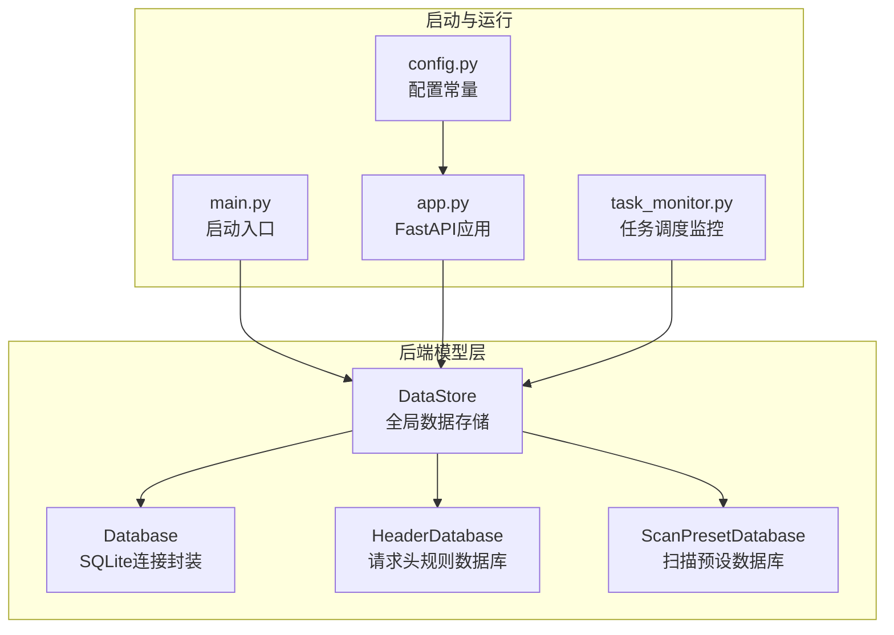
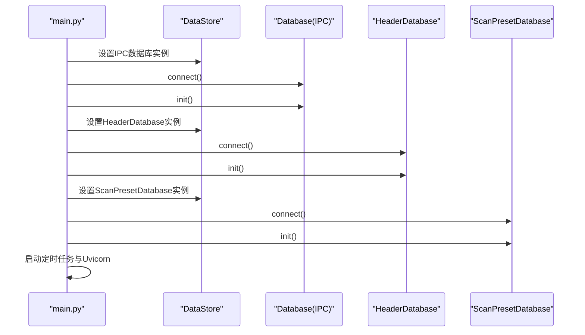
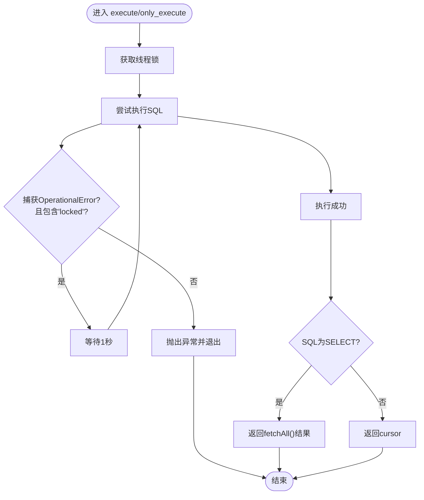
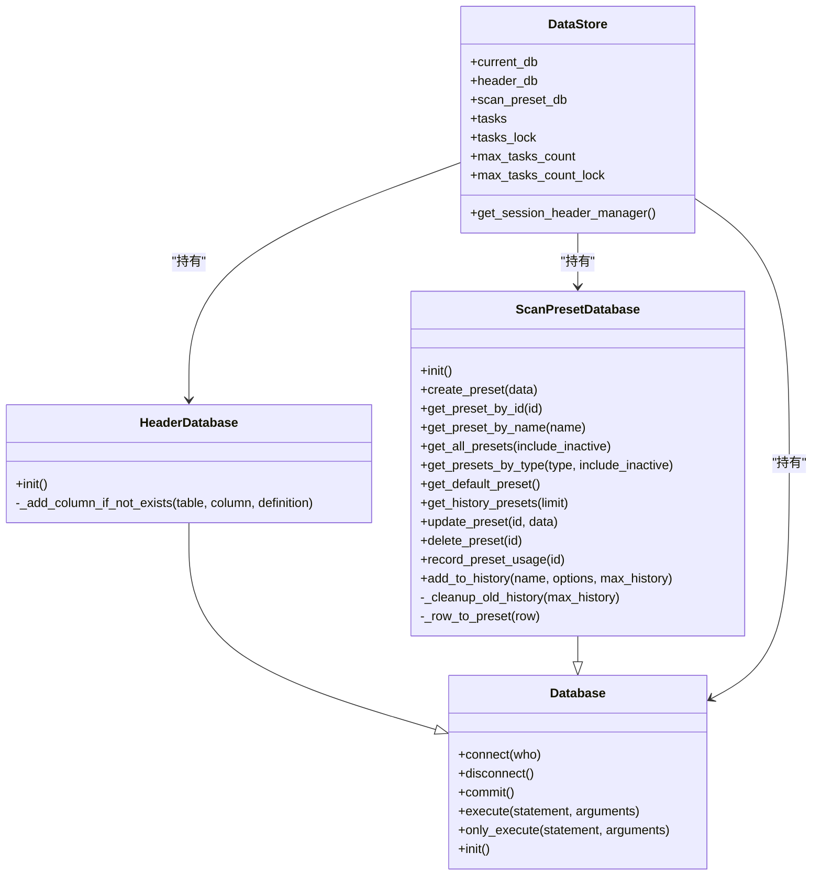

# 数据库连接管理

<cite>
**本文引用的文件**
- [src/backEnd/model/Database.py](file://src/backEnd/model/Database.py)
- [src/backEnd/model/DataStore.py](file://src/backEnd/model/DataStore.py)
- [src/backEnd/model/HeaderDatabase.py](file://src/backEnd/model/HeaderDatabase.py)
- [src/backEnd/model/ScanPresetDatabase.py](file://src/backEnd/model/ScanPresetDatabase.py)
- [src/backEnd/main.py](file://src/backEnd/main.py)
- [src/backEnd/config.py](file://src/backEnd/config.py)
- [src/backEnd/app.py](file://src/backEnd/app.py)
- [src/backEnd/utils/task_monitor.py](file://src/backEnd/utils/task_monitor.py)
</cite>

## 目录
1. [简介](#简介)
2. [项目结构](#项目结构)
3. [核心组件](#核心组件)
4. [架构总览](#架构总览)
5. [组件详解](#组件详解)
6. [依赖关系分析](#依赖关系分析)
7. [性能考量](#性能考量)
8. [故障排查指南](#故障排查指南)
9. [结论](#结论)

## 简介
本文件聚焦于sqlmapWebUI后端的数据库连接管理，系统性解析Database类的实现机制，覆盖SQLite数据库连接初始化、连接生命周期、线程安全与并发控制、异常处理与重试策略、事务支持与数据访问契约（DataStore抽象基类），并结合实际代码路径给出架构图与流程图，帮助读者快速理解与优化数据库层。

## 项目结构
后端数据库相关的核心代码集中在src/backEnd/model目录，配合启动入口src/backEnd/main.py完成IPC数据库、请求头规则数据库与扫描预设数据库的初始化；全局共享的数据存储在DataStore中，提供线程安全的任务队列与数据库实例持有。

图表来源
- [src/backEnd/model/Database.py](file://src/backEnd/model/Database.py#L1-L99)
- [src/backEnd/model/HeaderDatabase.py](file://src/backEnd/model/HeaderDatabase.py#L1-L126)
- [src/backEnd/model/ScanPresetDatabase.py](file://src/backEnd/model/ScanPresetDatabase.py#L1-L514)
- [src/backEnd/model/DataStore.py](file://src/backEnd/model/DataStore.py#L1-L38)
- [src/backEnd/main.py](file://src/backEnd/main.py#L1-L168)
- [src/backEnd/app.py](file://src/backEnd/app.py#L1-L80)
- [src/backEnd/config.py](file://src/backEnd/config.py#L1-L8)
- [src/backEnd/utils/task_monitor.py](file://src/backEnd/utils/task_monitor.py#L1-L94)

章节来源
- [src/backEnd/main.py](file://src/backEnd/main.py#L120-L161)
- [src/backEnd/model/DataStore.py](file://src/backEnd/model/DataStore.py#L1-L38)

## 核心组件
- Database：SQLite连接封装，提供连接、断开、执行、仅执行、初始化表结构等能力，并内置线程锁与轻量重试。
- HeaderDatabase：继承自Database，负责请求头规则与会话头的独立数据库。
- ScanPresetDatabase：继承自Database，提供扫描预设的CRUD与默认预设初始化，采用单例模式。
- DataStore：全局数据存储容器，持有当前IPC数据库、请求头数据库、扫描预设数据库实例，提供线程安全的锁与任务队列。

章节来源
- [src/backEnd/model/Database.py](file://src/backEnd/model/Database.py#L1-L99)
- [src/backEnd/model/HeaderDatabase.py](file://src/backEnd/model/HeaderDatabase.py#L1-L126)
- [src/backEnd/model/ScanPresetDatabase.py](file://src/backEnd/model/ScanPresetDatabase.py#L1-L514)
- [src/backEnd/model/DataStore.py](file://src/backEnd/model/DataStore.py#L1-L38)

## 架构总览
后端启动时，main.py生成临时IPC数据库文件路径，创建Database实例并建立连接，随后初始化三类表结构；HeaderDatabase与ScanPresetDatabase分别初始化其专属表与索引；DataStore作为全局持有者，贯穿任务调度与API路由。

图表来源
- [src/backEnd/main.py](file://src/backEnd/main.py#L131-L154)
- [src/backEnd/model/Database.py](file://src/backEnd/model/Database.py#L18-L24)
- [src/backEnd/model/HeaderDatabase.py](file://src/backEnd/model/HeaderDatabase.py#L26-L101)
- [src/backEnd/model/ScanPresetDatabase.py](file://src/backEnd/model/ScanPresetDatabase.py#L54-L84)

## 组件详解

### Database类：SQLite连接封装与执行策略
- 连接初始化
  - 通过sqlite3.connect建立连接，设置timeout、isolation_level、check_same_thread等参数，确保多线程与超时行为符合预期。
  - 在connect中创建cursor与线程锁，供后续执行使用。
- 执行封装
  - execute：加锁执行SQL，遇到“locked”错误进行短暂sleep重试，非锁定类错误立即抛出；若SQL为SELECT则返回全部结果。
  - only_execute：加锁执行SQL，遇到“locked”错误同样重试，返回cursor本身以便外部自行fetch。
  - commit：显式提交事务（SQLite默认自动提交，但显式commit保证一致性）。
- 生命周期管理
  - connect：建立连接与cursor，初始化锁。
  - disconnect：关闭cursor与connection。
  - init：创建日志、数据、错误与持久化请求头规则等表及索引。
- 线程安全
  - 使用threading.Lock保护execute/only_execute内部的执行与重试循环，避免并发写冲突。
- 异常与重试
  - 捕获sqlite3.OperationalError，当错误信息包含“locked”时进行sleep重试，否则立即抛出。
- 事务支持
  - 通过commit显式提交；SQLite默认自动提交，但显式提交可确保在复杂流程中保持一致性。

图表来源
- [src/backEnd/model/Database.py](file://src/backEnd/model/Database.py#L35-L71)

章节来源
- [src/backEnd/model/Database.py](file://src/backEnd/model/Database.py#L18-L71)
- [src/backEnd/model/Database.py](file://src/backEnd/model/Database.py#L72-L99)

### HeaderDatabase：请求头规则与会话头数据库
- 继承Database，独立数据库文件位于项目根目录下的headers.db。
- init：创建持久化请求头规则表与会话头表，支持索引优化；具备列迁移能力（新增列时自动ALTER TABLE）。
- 提供列存在性检查与条件添加，增强数据库演进兼容性。

章节来源
- [src/backEnd/model/HeaderDatabase.py](file://src/backEnd/model/HeaderDatabase.py#L1-L126)

### ScanPresetDatabase：扫描预设数据库
- 继承Database，采用单例模式（__new__ + 标记位），避免重复初始化。
- 默认数据库文件位于项目根目录下的scan_presets.db；connect在构造阶段即建立连接。
- init：创建scan_presets表、索引，并初始化默认预设（包含默认、快速、深度、安全四类）。
- 提供完整的CRUD与历史记录管理，包含使用计数与最近使用时间更新、历史记录清理等。

章节来源
- [src/backEnd/model/ScanPresetDatabase.py](file://src/backEnd/model/ScanPresetDatabase.py#L1-L514)

### DataStore：全局数据存储与线程安全
- 持有当前IPC数据库、请求头数据库、扫描预设数据库实例。
- 提供tasks与tasks_lock、max_tasks_count与max_tasks_count_lock等线程安全结构，用于任务调度与并发控制。
- 提供会话性请求头管理器的延迟初始化与线程安全获取。

章节来源
- [src/backEnd/model/DataStore.py](file://src/backEnd/model/DataStore.py#L1-L38)

### 启动与生命周期管理
- main.py在启动时：
  - 生成临时IPC数据库文件路径，创建Database实例并connect/init。
  - 初始化HeaderDatabase与ScanPresetDatabase，分别connect/init。
  - 启动后台任务调度器与Uvicorn服务。
- 连接关闭：Database未提供自动关闭钩子，需在进程退出或特定场景主动调用disconnect；当前启动流程未显式关闭，建议在优雅停机时补充。

章节来源
- [src/backEnd/main.py](file://src/backEnd/main.py#L131-L161)
- [src/backEnd/model/Database.py](file://src/backEnd/model/Database.py#L25-L31)

### 数据访问契约与统一接口
- Database提供execute/only_execute/commit/disconnect等基础能力，形成统一的SQLite访问契约。
- HeaderDatabase与ScanPresetDatabase在此基础上扩展各自领域表结构与业务方法，保持一致的线程安全与异常处理风格。
- DataStore作为全局持有者，为上层API与任务调度提供统一的数据访问入口。

章节来源
- [src/backEnd/model/Database.py](file://src/backEnd/model/Database.py#L18-L71)
- [src/backEnd/model/HeaderDatabase.py](file://src/backEnd/model/HeaderDatabase.py#L26-L101)
- [src/backEnd/model/ScanPresetDatabase.py](file://src/backEnd/model/ScanPresetDatabase.py#L54-L84)
- [src/backEnd/model/DataStore.py](file://src/backEnd/model/DataStore.py#L1-L38)

## 依赖关系分析

图表来源
- [src/backEnd/model/Database.py](file://src/backEnd/model/Database.py#L1-L99)
- [src/backEnd/model/HeaderDatabase.py](file://src/backEnd/model/HeaderDatabase.py#L1-L126)
- [src/backEnd/model/ScanPresetDatabase.py](file://src/backEnd/model/ScanPresetDatabase.py#L1-L514)
- [src/backEnd/model/DataStore.py](file://src/backEnd/model/DataStore.py#L1-L38)

## 性能考量
- 连接参数
  - timeout：在connect中设置，用于避免长时间阻塞；可根据负载适当调整。
  - isolation_level：设置为无显式隔离级别，SQLite默认自动提交；如需严格事务控制，可在上层业务中显式begin/commit。
  - check_same_thread：设为False，允许多线程共享同一连接；注意execute/only_execute已通过锁保护，避免竞态。
- 索引与查询
  - 初始化阶段创建了针对请求头规则与会话头的索引，有助于提升查询性能；建议在高频查询列上持续评估索引策略。
- 重试策略
  - “locked”错误的sleep重试可缓解写竞争，但频繁锁冲突可能反映并发过高或SQL执行时间过长，应结合业务优化SQL与并发度。
- 并发与任务调度
  - DataStore.tasks_lock与max_tasks_count_lock保障任务队列与并发上限的线程安全；task_monitor.py基于CPU使用率动态调整最大并发任务数，有助于平衡资源占用与吞吐。

章节来源
- [src/backEnd/model/Database.py](file://src/backEnd/model/Database.py#L18-L24)
- [src/backEnd/model/HeaderDatabase.py](file://src/backEnd/model/HeaderDatabase.py#L94-L101)
- [src/backEnd/utils/task_monitor.py](file://src/backEnd/utils/task_monitor.py#L1-L94)
- [src/backEnd/config.py](file://src/backEnd/config.py#L1-L8)

## 故障排查指南
- 连接无法建立或超时
  - 检查数据库文件路径与权限；确认connect参数（timeout、check_same_thread）是否合理。
  - 参考路径：[connect实现](file://src/backEnd/model/Database.py#L18-L24)
- 写入冲突与“locked”
  - 当捕获到包含“locked”的OperationalError时，执行会sleep重试；若频繁出现，考虑降低并发或优化SQL执行时间。
  - 参考路径：[execute/only_execute重试逻辑](file://src/backEnd/model/Database.py#L35-L71)
- 表结构变更与迁移
  - HeaderDatabase与ScanPresetDatabase均提供列存在性检查与ALTER TABLE迁移，确保数据库演进兼容性。
  - 参考路径：[HeaderDatabase迁移](file://src/backEnd/model/HeaderDatabase.py#L103-L126)、[ScanPresetDatabase迁移](file://src/backEnd/model/ScanPresetDatabase.py#L86-L98)
- 连接泄漏与资源回收
  - 当前未在退出时自动关闭连接，建议在优雅停机时调用disconnect，避免文件句柄与锁资源长期占用。
  - 参考路径：[disconnect实现](file://src/backEnd/model/Database.py#L25-L31)
- 事务一致性
  - 如业务需要强一致性，应在上层显式begin/commit；Database提供commit方法，便于在复杂流程中手动控制。
  - 参考路径：[commit实现](file://src/backEnd/model/Database.py#L32-L34)

章节来源
- [src/backEnd/model/Database.py](file://src/backEnd/model/Database.py#L18-L34)
- [src/backEnd/model/HeaderDatabase.py](file://src/backEnd/model/HeaderDatabase.py#L103-L126)
- [src/backEnd/model/ScanPresetDatabase.py](file://src/backEnd/model/ScanPresetDatabase.py#L86-L98)

## 结论
Database类以轻量封装实现了SQLite连接、执行与事务的基本能力，结合HeaderDatabase与ScanPresetDatabase满足不同领域的数据需求；DataStore提供全局持有与线程安全的并发控制。整体设计简洁清晰，适合中小型并发场景。建议在生产环境中：
- 明确事务边界并在上层显式commit；
- 评估锁冲突频率，必要时优化SQL与并发度；
- 在优雅停机时补充连接关闭逻辑；
- 持续评估索引与查询热点，定期优化数据库结构。