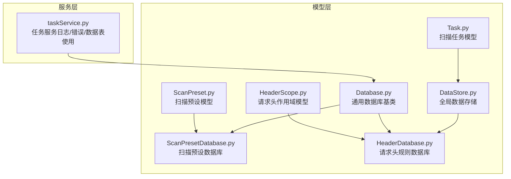
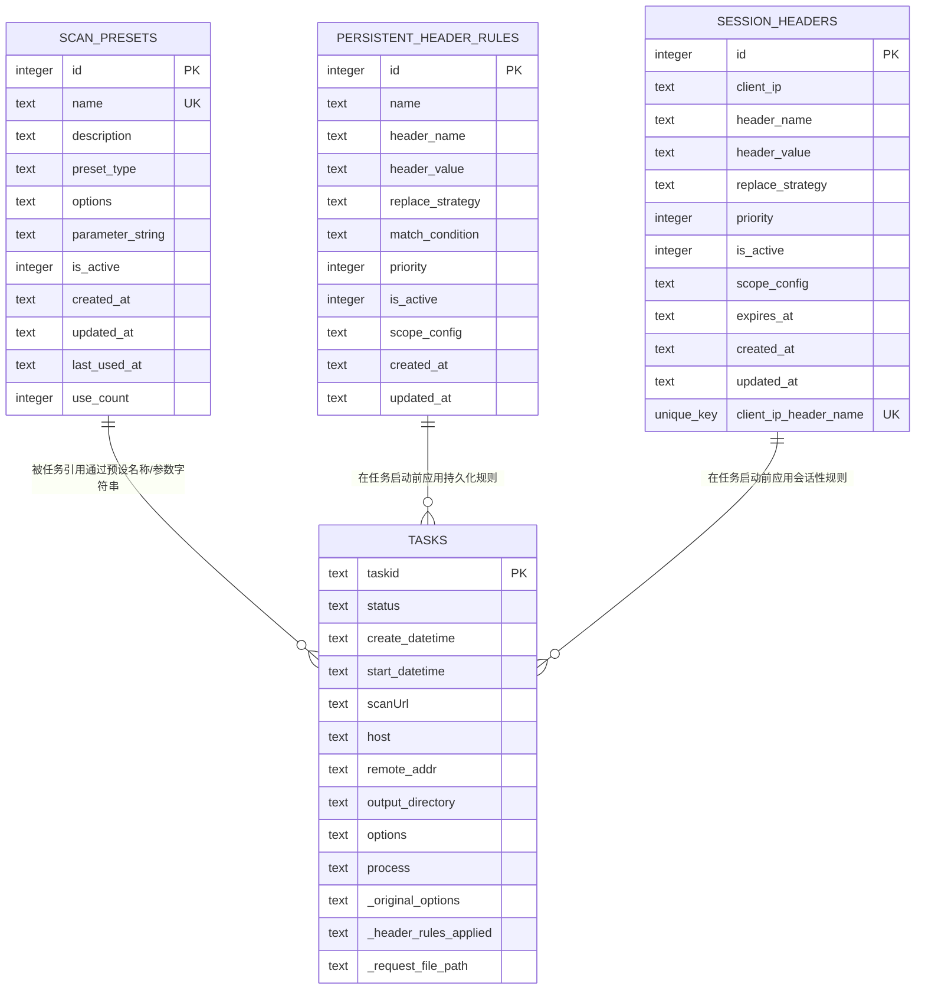
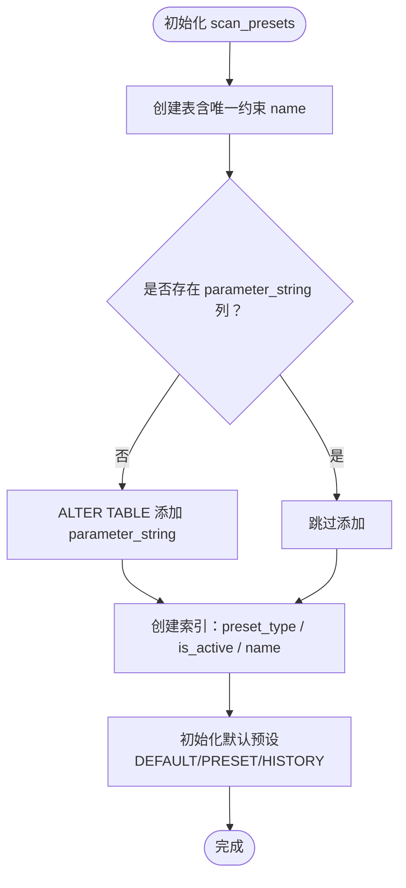
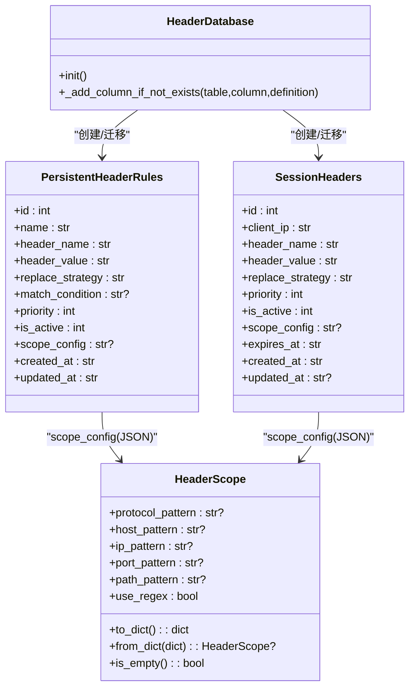
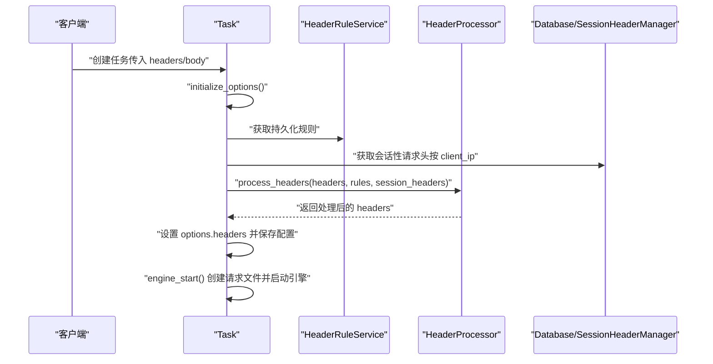
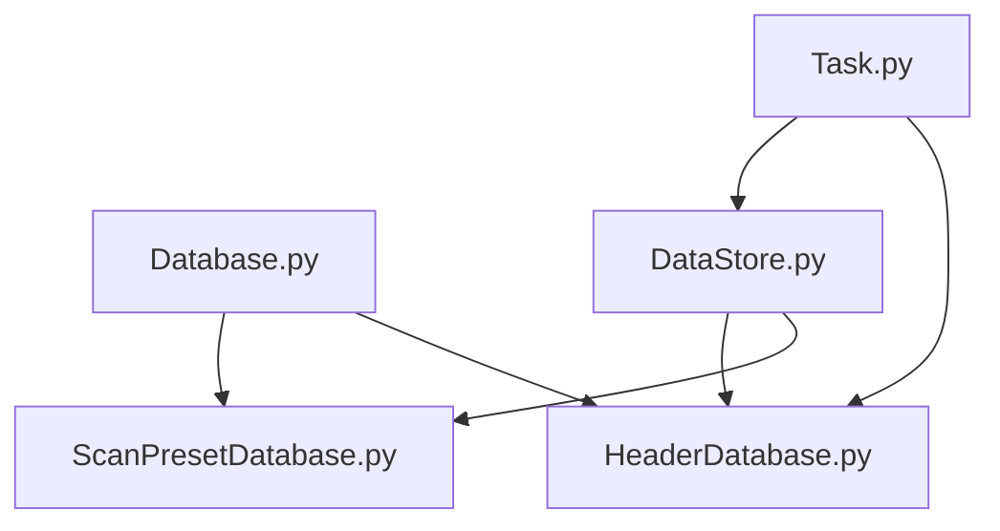

# 数据表结构设计

<cite>
**本文引用的文件**
- [ScanPresetDatabase.py](file://src/backEnd/model/ScanPresetDatabase.py)
- [HeaderDatabase.py](file://src/backEnd/model/HeaderDatabase.py)
- [ScanPreset.py](file://src/backEnd/model/ScanPreset.py)
- [HeaderScope.py](file://src/backEnd/model/HeaderScope.py)
- [Database.py](file://src/backEnd/model/Database.py)
- [Task.py](file://src/backEnd/model/Task.py)
- [DataStore.py](file://src/backEnd/model/DataStore.py)
- [taskService.py](file://src/backEnd/service/taskService.py)
</cite>

## 目录
1. [简介](#简介)
2. [项目结构](#项目结构)
3. [核心组件](#核心组件)
4. [架构总览](#架构总览)
5. [详细组件分析](#详细组件分析)
6. [依赖分析](#依赖分析)
7. [性能考量](#性能考量)
8. [故障排查指南](#故障排查指南)
9. [结论](#结论)
10. [附录](#附录)

## 简介
本文件面向 sqlmapWebUI 的数据库模式设计，聚焦于两个核心数据库：
- 扫描配置预设数据库：用于持久化“扫描预设”（默认、常用、历史）配置。
- 请求头规则数据库：用于持久化“持久化请求头规则”和“会话性请求头”。

文档将从模型类出发，逐条解析各表的字段类型、约束与索引，并给出 ER 图展示扫描配置、请求头规则、扫描任务等实体间的关系；同时说明主键生成策略、外键关联机制、数据完整性约束以及表结构演进与迁移方案。

## 项目结构
围绕数据库模式的关键文件分布如下：
- 模型层：ScanPreset、HeaderScope、Task、Database、ScanPresetDatabase、HeaderDatabase、DataStore
- 服务层：taskService（间接体现日志/错误/数据表的使用）

图表来源
- [ScanPreset.py](file://src/backEnd/model/ScanPreset.py#L1-L231)
- [HeaderScope.py](file://src/backEnd/model/HeaderScope.py#L1-L187)
- [Task.py](file://src/backEnd/model/Task.py#L1-L333)
- [Database.py](file://src/backEnd/model/Database.py#L1-L99)
- [ScanPresetDatabase.py](file://src/backEnd/model/ScanPresetDatabase.py#L1-L514)
- [HeaderDatabase.py](file://src/backEnd/model/HeaderDatabase.py#L1-L126)
- [DataStore.py](file://src/backEnd/model/DataStore.py#L1-L38)
- [taskService.py](file://src/backEnd/service/taskService.py#L111-L502)

章节来源
- [ScanPresetDatabase.py](file://src/backEnd/model/ScanPresetDatabase.py#L1-L120)
- [HeaderDatabase.py](file://src/backEnd/model/HeaderDatabase.py#L1-L126)
- [Database.py](file://src/backEnd/model/Database.py#L1-L99)
- [Task.py](file://src/backEnd/model/Task.py#L1-L120)
- [DataStore.py](file://src/backEnd/model/DataStore.py#L1-L38)
- [taskService.py](file://src/backEnd/service/taskService.py#L111-L160)

## 核心组件
- 扫描配置预设数据库（scan_presets 表）
  - 主键：id（自增整数）
  - 唯一性：name（唯一）
  - 非空：name、preset_type、options、created_at、updated_at
  - 可空：description、parameter_string、last_used_at
  - 默认值：preset_type 默认为 preset；options 默认为 {}；is_active 默认为 1；use_count 默认为 0
  - 索引：preset_type、is_active、name
  - 迁移：新增 parameter_string 列（若缺失）
- 请求头规则数据库（两表）
  - 持久化请求头规则表 persistent_header_rules
    - 主键：id（自增整数）
    - 唯一性：无
    - 非空：name、header_name、header_value、replace_strategy、created_at、updated_at
    - 可空：match_condition、scope_config
    - 默认值：replace_strategy 默认 REPLACE；priority 默认 0；is_active 默认 1
    - 索引：is_active、priority、header_name
    - 迁移：新增 scope_config 列（若缺失）
  - 会话性请求头表 session_headers
    - 主键：id（自增整数）
    - 唯一性：client_ip + header_name（联合唯一）
    - 非空：client_ip、header_name、header_value、expires_at、created_at
    - 可空：scope_config、updated_at
    - 默认值：replace_strategy 默认 REPLACE；priority 默认 0；is_active 默认 1
    - 索引：client_ip、expires_at
    - 迁移：新增 replace_strategy、is_active、updated_at、scope_config（若缺失）
- 通用数据库基类 Database
  - 提供 SQLite 连接、并发锁、重试机制、统一执行接口
  - 同时初始化日志/数据/错误三张表（用于任务运行期数据统计与展示）

章节来源
- [ScanPresetDatabase.py](file://src/backEnd/model/ScanPresetDatabase.py#L56-L120)
- [HeaderDatabase.py](file://src/backEnd/model/HeaderDatabase.py#L28-L101)
- [Database.py](file://src/backEnd/model/Database.py#L72-L99)

## 架构总览
下图展示扫描配置、请求头规则与扫描任务之间的关系与数据流向。

图表来源
- [ScanPresetDatabase.py](file://src/backEnd/model/ScanPresetDatabase.py#L56-L120)
- [HeaderDatabase.py](file://src/backEnd/model/HeaderDatabase.py#L28-L101)
- [Task.py](file://src/backEnd/model/Task.py#L109-L170)
- [taskService.py](file://src/backEnd/service/taskService.py#L111-L160)

## 详细组件分析

### 扫描配置预设数据库（scan_presets）
- 表结构要点
  - 主键：id（自增整数）
  - 唯一性：name（唯一）
  - 非空：name、preset_type、options、created_at、updated_at
  - 可空：description、parameter_string、last_used_at
  - 默认值：preset_type 默认 preset；options 默认 {}；is_active 默认 1；use_count 默认 0
  - 索引：preset_type、is_active、name
  - 迁移：新增 parameter_string 列（若缺失）
- 关键操作
  - 初始化默认预设：DEFAULT、PRESET、HISTORY 类型的预设
  - 历史预设清理：按 last_used_at 降序保留固定数量
  - 使用计数与时间戳：record_preset_usage 更新 use_count 与 last_used_at
- 字段映射（模型类到数据库列）
  - ScanPreset.name → name
  - ScanPreset.preset_type → preset_type
  - ScanPreset.options → options（JSON 文本）
  - ScanPreset.parameter_string → parameter_string
  - ScanPreset.is_active → is_active
  - ScanPreset.created_at、updated_at、last_used_at → created_at、updated_at、last_used_at
  - ScanPreset.use_count → use_count

图表来源
- [ScanPresetDatabase.py](file://src/backEnd/model/ScanPresetDatabase.py#L56-L120)
- [ScanPresetDatabase.py](file://src/backEnd/model/ScanPresetDatabase.py#L86-L101)
- [ScanPreset.py](file://src/backEnd/model/ScanPreset.py#L107-L137)

章节来源
- [ScanPresetDatabase.py](file://src/backEnd/model/ScanPresetDatabase.py#L56-L120)
- [ScanPresetDatabase.py](file://src/backEnd/model/ScanPresetDatabase.py#L128-L179)
- [ScanPresetDatabase.py](file://src/backEnd/model/ScanPresetDatabase.py#L217-L268)
- [ScanPresetDatabase.py](file://src/backEnd/model/ScanPresetDatabase.py#L366-L408)
- [ScanPreset.py](file://src/backEnd/model/ScanPreset.py#L107-L137)

### 请求头规则数据库（persistent_header_rules 与 session_headers）
- 持久化请求头规则表 persistent_header_rules
  - 主键：id（自增整数）
  - 非空：name、header_name、header_value、replace_strategy、created_at、updated_at
  - 可空：match_condition、scope_config
  - 默认值：replace_strategy 默认 REPLACE；priority 默认 0；is_active 默认 1
  - 索引：is_active、priority、header_name
  - 迁移：新增 scope_config 列（若缺失）
- 会话性请求头表 session_headers
  - 主键：id（自增整数）
  - 唯一性：client_ip + header_name（联合唯一）
  - 非空：client_ip、header_name、header_value、expires_at、created_at
  - 可空：scope_config、updated_at
  - 默认值：replace_strategy 默认 REPLACE；priority 默认 0；is_active 默认 1
  - 索引：client_ip、expires_at
  - 迁移：新增 replace_strategy、is_active、updated_at、scope_config（若缺失）
- 作用域配置（scope_config）
  - 采用 JSON 文本存储 HeaderScope 的序列化结果
  - HeaderScope 支持协议、主机、IP、端口、路径等多维匹配，支持正则开关
  - 当 scope 为空时，表示全局生效

图表来源
- [HeaderDatabase.py](file://src/backEnd/model/HeaderDatabase.py#L28-L101)
- [HeaderScope.py](file://src/backEnd/model/HeaderScope.py#L1-L187)

章节来源
- [HeaderDatabase.py](file://src/backEnd/model/HeaderDatabase.py#L28-L101)
- [HeaderScope.py](file://src/backEnd/model/HeaderScope.py#L1-L187)

### 扫描任务与数据库交互
- 任务生命周期
  - 任务创建：初始化 options、应用请求头规则（持久化与会话性）、生成请求文件
  - 引擎启动：写入配置文件并调用 sqlmap
  - 日志/错误/数据统计：通过 Database 基类维护的日志、数据、错误三表进行统计与查询
- 数据完整性与一致性
  - 任务表（TASKS）：由 Task 类维护，不直接对应 SQLite 表，但其运行期状态与日志/错误/数据表配合使用
  - 日志/错误/数据表：由 Database.init 创建，用于任务运行期的统计与展示

图表来源
- [Task.py](file://src/backEnd/model/Task.py#L109-L170)
- [taskService.py](file://src/backEnd/service/taskService.py#L111-L160)
- [Database.py](file://src/backEnd/model/Database.py#L72-L99)

章节来源
- [Task.py](file://src/backEnd/model/Task.py#L109-L170)
- [taskService.py](file://src/backEnd/service/taskService.py#L111-L160)
- [Database.py](file://src/backEnd/model/Database.py#L72-L99)

## 依赖分析
- 组件耦合
  - ScanPresetDatabase 依赖 Database 基类，负责 scan_presets 表的创建、迁移与 CRUD
  - HeaderDatabase 依赖 Database 基类，负责 persistent_header_rules 与 session_headers 表的创建、迁移与 CRUD
  - DataStore 提供 header_db 与 scan_preset_db 的全局实例，贯穿请求头与预设的读写
  - Task 在运行期通过 HeaderRuleService 与 HeaderProcessor 应用请求头规则，间接依赖 HeaderDatabase
- 外部依赖
  - SQLite（通过 sqlite3）
  - 第三方 sqlmap 引擎（通过子进程调用）

图表来源
- [Database.py](file://src/backEnd/model/Database.py#L1-L99)
- [ScanPresetDatabase.py](file://src/backEnd/model/ScanPresetDatabase.py#L1-L120)
- [HeaderDatabase.py](file://src/backEnd/model/HeaderDatabase.py#L1-L126)
- [DataStore.py](file://src/backEnd/model/DataStore.py#L1-L38)
- [Task.py](file://src/backEnd/model/Task.py#L109-L170)

章节来源
- [DataStore.py](file://src/backEnd/model/DataStore.py#L1-L38)
- [Task.py](file://src/backEnd/model/Task.py#L109-L170)

## 性能考量
- 索引设计
  - scan_presets：按 preset_type、is_active、name 建立索引，有利于按类型筛选与排序
  - persistent_header_rules：按 is_active、priority、header_name 建立索引，有利于快速筛选启用规则与按优先级排序
  - session_headers：按 client_ip、expires_at 建立索引，有利于按客户端检索与过期清理
- 并发与锁
  - Database 使用线程锁与重试机制，避免数据库锁定导致的失败
- 迁移与兼容
  - 通过 PRAGMA table_info 检查列是否存在，再决定是否 ALTER TABLE 添加列，保证向后兼容

章节来源
- [ScanPresetDatabase.py](file://src/backEnd/model/ScanPresetDatabase.py#L76-L80)
- [HeaderDatabase.py](file://src/backEnd/model/HeaderDatabase.py#L94-L101)
- [Database.py](file://src/backEnd/model/Database.py#L35-L71)

## 故障排查指南
- 数据库连接与锁定
  - 若出现 OperationalError: database is locked，Database 的 execute/only_execute 会自动重试，建议检查并发写入压力
- 唯一性冲突
  - scan_presets.name 唯一，若重复命名会导致插入失败；请先检查是否存在同名预设
  - session_headers.client_ip + header_name 联合唯一，若重复会触发更新或插入失败，请确认客户端与头部组合唯一
- 列迁移失败
  - HeaderDatabase 在初始化时会尝试添加列（如 scope_config、replace_strategy、is_active、updated_at），若失败会记录警告；请检查数据库权限与版本
- 任务日志/错误/数据统计
  - taskService 中对 logs/data/errors 表进行查询与统计，若查询不到数据，可能因任务尚未产生或数据库未初始化

章节来源
- [Database.py](file://src/backEnd/model/Database.py#L35-L71)
- [ScanPresetDatabase.py](file://src/backEnd/model/ScanPresetDatabase.py#L128-L179)
- [HeaderDatabase.py](file://src/backEnd/model/HeaderDatabase.py#L103-L126)
- [taskService.py](file://src/backEnd/service/taskService.py#L111-L160)

## 结论
本设计以 SQLite 为核心，结合 Pydantic 模型与数据库表结构，实现了扫描预设与请求头规则的持久化管理。通过合理的主键生成策略、唯一性约束与索引设计，兼顾了查询效率与数据一致性。迁移机制保障了表结构的向前兼容。任务运行期通过日志/错误/数据三表进行统计，便于监控与排障。

## 附录

### 表结构演进与迁移方案
- scan_presets
  - 新增列：parameter_string（若缺失则 ALTER TABLE 添加）
  - 初始化默认预设：DEFAULT、PRESET、HISTORY
- persistent_header_rules
  - 新增列：scope_config（若缺失则 ALTER TABLE 添加）
- session_headers
  - 新增列：scope_config、replace_strategy、is_active、updated_at（若缺失则 ALTER TABLE 添加）
  - 联合唯一：client_ip + header_name
- 通用表（Database.init）
  - logs、data、errors 三表用于任务运行期统计与展示

章节来源
- [ScanPresetDatabase.py](file://src/backEnd/model/ScanPresetDatabase.py#L86-L120)
- [HeaderDatabase.py](file://src/backEnd/model/HeaderDatabase.py#L45-L101)
- [Database.py](file://src/backEnd/model/Database.py#L72-L99)