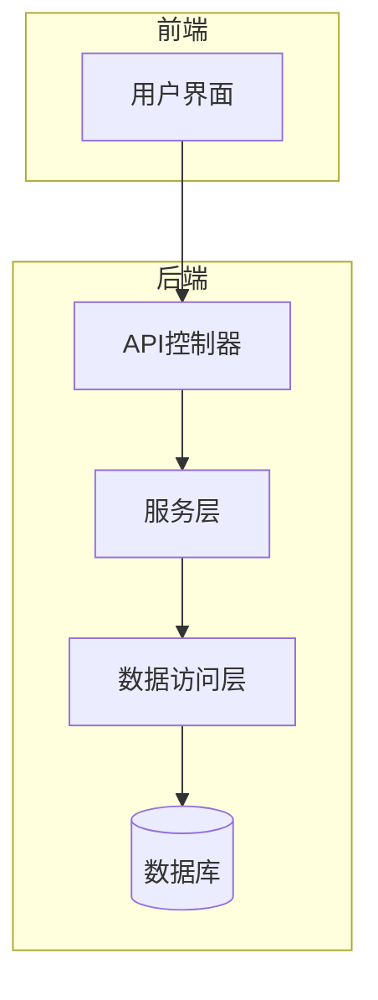
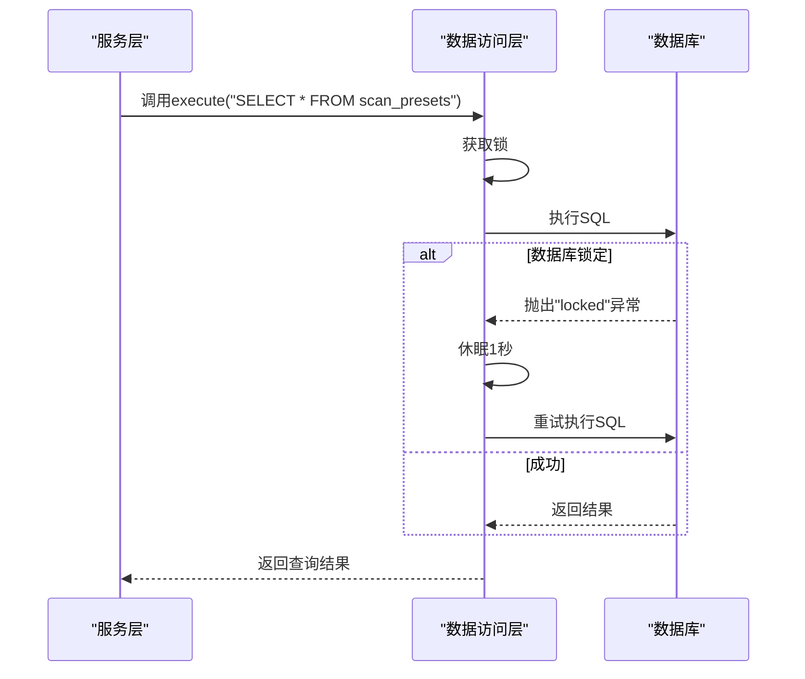
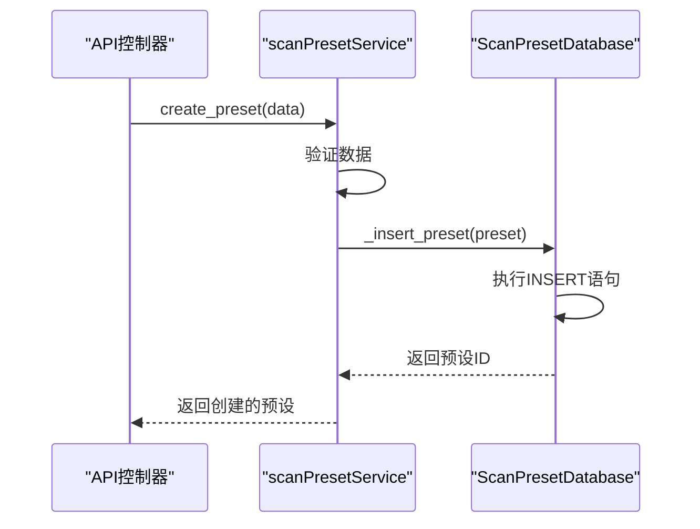

# 数据访问模式

<cite>
**本文档引用的文件**   
- [DataStore.py](file://src/backEnd/model/DataStore.py)
- [Database.py](file://src/backEnd/model/Database.py)
- [ScanPresetDatabase.py](file://src/backEnd/model/ScanPresetDatabase.py)
- [HeaderDatabase.py](file://src/backEnd/model/HeaderDatabase.py)
- [scanPresetService.py](file://src/backEnd/service/scanPresetService.py)
- [headerRuleService.py](file://src/backEnd/service/headerRuleService.py)
- [ScanPreset.py](file://src/backEnd/model/ScanPreset.py)
- [PersistentHeaderRule.py](file://src/backEnd/model/PersistentHeaderRule.py)
- [session_header_manager.py](file://src/backEnd/utils/session_header_manager.py)
- [scanPreset.py](file://src/backEnd/api/commonApi/scanPreset.py)
- [headerController.py](file://src/backEnd/api/commonApi/headerController.py)
- [main.py](file://src/backEnd/main.py)
</cite>

## 目录
1. [引言](#引言)
2. [数据访问架构概述](#数据访问架构概述)
3. [核心数据访问组件](#核心数据访问组件)
4. [数据访问层实现](#数据访问层实现)
5. [服务层与数据访问交互](#服务层与数据访问交互)
6. [查询优化与批量操作](#查询优化与批量操作)
7. [数据访问异常处理与日志](#数据访问异常处理与日志)
8. [最佳实践与常见陷阱](#最佳实践与常见陷阱)
9. [结论](#结论)

## 引言
sqlmapWebUI项目采用分层架构设计，其数据访问模式是系统稳定性和可维护性的核心。本项目通过抽象基类、具体实现、服务层和API控制器的协同工作，实现了对扫描配置预设和请求头规则的高效、安全的数据访问。数据访问层不仅封装了底层数据库操作，还提供了类型安全的接口，确保了数据的一致性和完整性。本文档将深入分析该数据访问架构，为开发者提供清晰的指导和最佳实践。

## 数据访问架构概述

sqlmapWebUI的数据访问架构遵循典型的分层设计模式，主要包括数据存储层、数据访问层、服务层和API控制器层。数据存储层由SQLite数据库文件构成，包括`scan_presets.db`和`headers.db`，分别用于持久化扫描配置预设和请求头规则。数据访问层通过`Database`基类和`ScanPresetDatabase`、`HeaderDatabase`等具体实现类，提供了对数据库的CRUD操作。服务层（如`scanPresetService`）封装了业务逻辑，并通过数据访问层与数据库交互。API控制器层则暴露RESTful接口，供前端调用。

**图示来源**
- [main.py](file://src/backEnd/main.py#L138-L154)
- [DataStore.py](file://src/backEnd/model/DataStore.py#L10-L27)
- [Database.py](file://src/backEnd/model/Database.py#L10-L99)

## 核心数据访问组件

### DataStore 全局数据存储
`DataStore`类是整个应用的全局数据存储中心，采用单例模式管理所有共享资源。它不仅存储了数据库连接实例（`current_db`, `header_db`, `scan_preset_db`），还管理了任务队列、用户会话等全局状态。通过`DataStore`，各个组件可以方便地获取数据库连接，避免了重复创建连接的开销。

**组件来源**
- [DataStore.py](file://src/backEnd/model/DataStore.py#L10-L38)

### Database 抽象基类
`Database`类是所有数据库访问的抽象基类，封装了与SQLite数据库交互的核心方法。它提供了`connect`、`disconnect`、`execute`和`only_execute`等方法，实现了线程安全的数据库操作。`execute`方法在执行SELECT语句时会返回查询结果，而`only_execute`方法则返回游标对象，为更复杂的查询提供了灵活性。

**组件来源**
- [Database.py](file://src/backEnd/model/Database.py#L10-L99)

### ScanPresetDatabase 扫描配置预设数据库
`ScanPresetDatabase`继承自`Database`，专门用于管理扫描配置预设。它实现了预设的CRUD操作，包括创建、读取、更新和删除。该类还负责数据库表的初始化和迁移，确保数据库结构的兼容性。通过`_init_default_presets`方法，系统在启动时会自动创建默认的扫描配置。

**组件来源**
- [ScanPresetDatabase.py](file://src/backEnd/model/ScanPresetDatabase.py#L25-L514)

### HeaderDatabase 请求头管理数据库
`HeaderDatabase`同样继承自`Database`，用于管理持久化请求头规则和会话性请求头。它提供了对`persistent_header_rules`和`session_headers`表的操作。该类还实现了表迁移功能，通过`_add_column_if_not_exists`方法，可以在不破坏现有数据的情况下添加新列。

**组件来源**
- [HeaderDatabase.py](file://src/backEnd/model/HeaderDatabase.py#L11-L126)

## 数据访问层实现

### CRUD操作契约
`Database`基类定义了数据访问的CRUD操作契约。`execute`方法是核心，它通过`sqlite3.connect`建立连接，并使用`cursor.execute`执行SQL语句。为了处理数据库锁定问题，`execute`方法内置了重试机制，当捕获到"locked"异常时，会休眠1秒后重试，直到成功或遇到其他错误。

**图示来源**
- [Database.py](file://src/backEnd/model/Database.py#L35-L49)

### 类型安全的数据访问接口
项目通过Pydantic模型实现了类型安全的数据访问。`ScanPreset`和`PersistentHeaderRule`等模型类定义了数据的结构和约束。在数据访问层，`_row_to_preset`等方法负责将数据库查询结果转换为模型对象，确保了数据的类型安全和完整性。

**组件来源**
- [ScanPreset.py](file://src/backEnd/model/ScanPreset.py#L107-L231)
- [PersistentHeaderRule.py](file://src/backEnd/model/PersistentHeaderRule.py#L19-L104)

## 服务层与数据访问交互

### scanPresetService 服务
`scanPresetService`是扫描配置预设的服务层，它通过`get_scan_preset_db()`获取`ScanPresetDatabase`实例，并调用其方法实现业务逻辑。服务层负责验证输入数据、处理业务规则，并将结果返回给API控制器。

**图示来源**
- [scanPresetService.py](file://src/backEnd/service/scanPresetService.py#L17-L182)
- [scanPreset.py](file://src/backEnd/api/commonApi/scanPreset.py#L191-L215)

### headerRuleService 服务
`headerRuleService`负责处理持久化请求头规则和会话性请求头的业务逻辑。它通过`DataStore.header_db`获取数据库连接，并调用`HeaderDatabase`的方法。服务层还集成了`SessionHeaderManager`，用于管理内存中的会话性请求头。

**组件来源**
- [headerRuleService.py](file://src/backEnd/service/headerRuleService.py#L32-L800)
- [headerController.py](file://src/backEnd/api/commonApi/headerController.py#L28-L481)

## 查询优化与批量操作

### 查询优化技术
项目通过创建数据库索引来优化查询性能。例如，在`ScanPresetDatabase`中，为`preset_type`、`is_active`和`name`字段创建了索引，显著提高了按类型、状态或名称查询预设的效率。

**组件来源**
- [ScanPresetDatabase.py](file://src/backEnd/model/ScanPresetDatabase.py#L76-L79)
- [HeaderDatabase.py](file://src/backEnd/model/HeaderDatabase.py#L94-L99)

### 批量操作支持
`headerRuleService`提供了批量操作接口，如`create_persistent_rules_batch`，允许用户一次性创建多个持久化请求头规则。这不仅提高了用户体验，也减少了数据库连接的开销。

**组件来源**
- [headerRuleService.py](file://src/backEnd/service/headerRuleService.py#L678-L800)
- [headerController.py](file://src/backEnd/api/commonApi/headerController.py#L441-L452)

## 数据访问异常处理与日志

### 异常处理模式
项目采用统一的异常处理模式。在数据访问层，`execute`方法会捕获`sqlite3.OperationalError`异常，并根据错误信息决定是否重试。在服务层，所有方法都使用try-except块捕获异常，并通过`BaseResponseMsg`返回详细的错误信息。

**组件来源**
- [Database.py](file://src/backEnd/model/Database.py#L43-L47)
- [headerRuleService.py](file://src/backEnd/service/headerRuleService.py#L168-L175)

### 日志记录机制
项目使用标准库的`logging`模块进行日志记录。`logger`实例在各个模块中被导入，并在关键操作点记录日志。日志信息包括操作类型、数据库路径、错误详情等，便于问题排查和系统监控。

**组件来源**
- [Database.py](file://src/backEnd/model/Database.py#L23)
- [ScanPresetDatabase.py](file://src/backEnd/model/ScanPresetDatabase.py#L84)
- [main.py](file://src/backEnd/main.py#L103-L105)

## 最佳实践与常见陷阱

### 最佳实践
- **使用单例模式管理数据库连接**：通过`DataStore`集中管理数据库连接，避免资源浪费。
- **实现表迁移**：通过`_add_column_if_not_exists`等方法，确保数据库结构的平滑升级。
- **类型安全**：使用Pydantic模型确保数据的类型安全和完整性。

### 常见陷阱规避
- **避免SQL注入**：始终使用参数化查询，避免字符串拼接。
- **处理数据库锁定**：在高并发场景下，合理使用重试机制。
- **内存泄漏**：及时关闭数据库连接和游标。

**组件来源**
- [ScanPresetDatabase.py](file://src/backEnd/model/ScanPresetDatabase.py#L86-L98)
- [Database.py](file://src/backEnd/model/Database.py#L35-L49)

## 结论
sqlmapWebUI的数据访问模式设计精良，通过分层架构、抽象基类、类型安全和统一异常处理，实现了高效、可靠的数据访问。开发者在遵循最佳实践的前提下，可以轻松地扩展和维护数据访问功能。未来可以考虑引入ORM框架，进一步简化数据库操作。