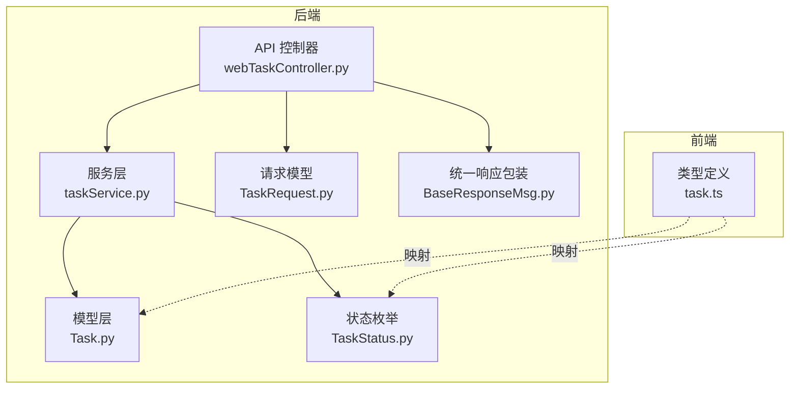
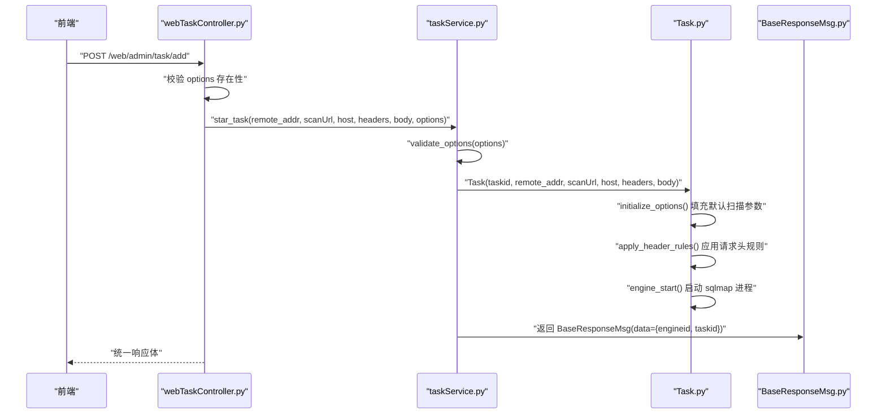
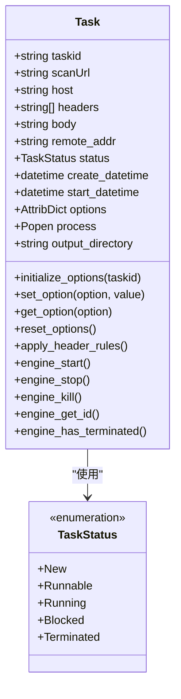
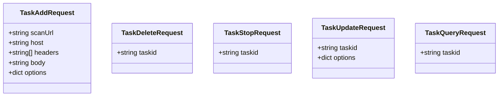
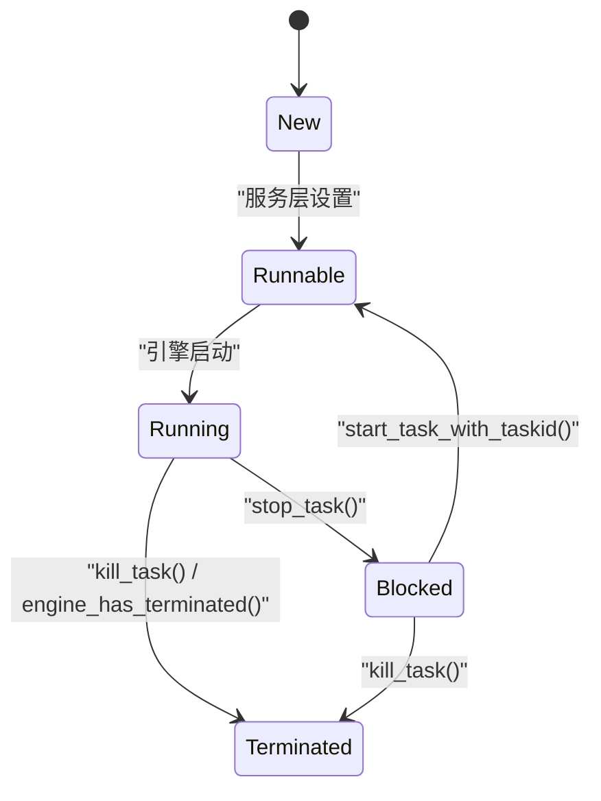
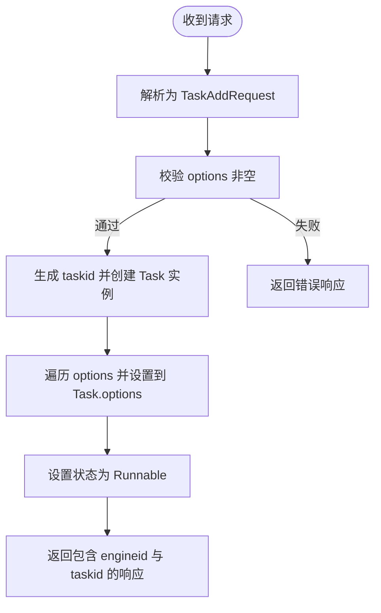
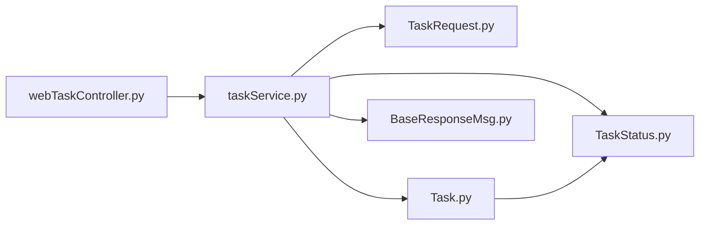

# 任务模型

<cite>
**本文引用的文件**
- [Task.py](file://src/backEnd/model/Task.py)
- [TaskStatus.py](file://src/backEnd/model/TaskStatus.py)
- [TaskRequest.py](file://src/backEnd/model/requestModel/TaskRequest.py)
- [taskService.py](file://src/backEnd/service/taskService.py)
- [webTaskController.py](file://src/backEnd/api/commonApi/webTaskController.py)
- [BaseResponseMsg.py](file://src/backEnd/model/BaseResponseMsg.py)
- [task.ts](file://src/frontEnd/src/types/task.ts)
</cite>

## 目录
1. [简介](#简介)
2. [项目结构](#项目结构)
3. [核心组件](#核心组件)
4. [架构总览](#架构总览)
5. [详细组件分析](#详细组件分析)
6. [依赖关系分析](#依赖关系分析)
7. [性能考量](#性能考量)
8. [故障排查指南](#故障排查指南)
9. [结论](#结论)
10. [附录](#附录)

## 简介
本文件系统性梳理任务模型设计与实现，围绕以下三个核心对象展开：
- Task：封装一次 sqlmap 扫描任务的完整状态与生命周期行为，包含任务ID、目标URL、请求头与请求体、扫描参数、执行状态与时间戳、进程管理、请求文件生成与持久化等。
- TaskRequest：API 输入模型，基于 Pydantic 定义任务创建请求的字段与校验规则，明确默认值与长度约束。
- TaskStatus：任务生命周期状态枚举，定义 New、Runnable、Running、Blocked、Terminated 等状态及状态转换逻辑。

同时，本文通过调用链路与序列图展示“从 HTTP 请求创建 TaskRequest 实例并转换为 Task 对象存储”的过程，并给出 JSON 序列化示例，帮助读者理解任务创建请求与任务状态响应的数据格式。

## 项目结构
任务模型相关代码主要分布在后端模型层、服务层与 API 控制器层，前端类型定义用于对齐数据结构与状态枚举。

图表来源
- [webTaskController.py](file://src/backEnd/api/commonApi/webTaskController.py#L1-L91)
- [taskService.py](file://src/backEnd/service/taskService.py#L1-L120)
- [Task.py](file://src/backEnd/model/Task.py#L1-L120)
- [TaskStatus.py](file://src/backEnd/model/TaskStatus.py#L1-L9)
- [TaskRequest.py](file://src/backEnd/model/requestModel/TaskRequest.py#L1-L57)
- [BaseResponseMsg.py](file://src/backEnd/model/BaseResponseMsg.py#L1-L21)
- [task.ts](file://src/frontEnd/src/types/task.ts#L1-L122)

章节来源
- [webTaskController.py](file://src/backEnd/api/commonApi/webTaskController.py#L1-L91)
- [taskService.py](file://src/backEnd/service/taskService.py#L1-L120)
- [Task.py](file://src/backEnd/model/Task.py#L1-L120)
- [TaskStatus.py](file://src/backEnd/model/TaskStatus.py#L1-L9)
- [TaskRequest.py](file://src/backEnd/model/requestModel/TaskRequest.py#L1-L57)
- [BaseResponseMsg.py](file://src/backEnd/model/BaseResponseMsg.py#L1-L21)
- [task.ts](file://src/frontEnd/src/types/task.ts#L1-L122)

## 核心组件
- Task：负责任务初始化、扫描参数默认值填充、请求头规则应用、HTTP 原始请求文件生成、sqlmap 引擎进程启动/停止/终止、状态与时间戳管理。
- TaskRequest：定义任务创建请求的字段与校验规则，如 scanUrl、host、headers、body、options 等，确保输入合法性。
- TaskStatus：定义任务生命周期状态，驱动服务层的状态转换与查询逻辑。

章节来源
- [Task.py](file://src/backEnd/model/Task.py#L49-L120)
- [TaskRequest.py](file://src/backEnd/model/requestModel/TaskRequest.py#L31-L37)
- [TaskStatus.py](file://src/backEnd/model/TaskStatus.py#L4-L9)

## 架构总览
下图展示了从 Web 端发起任务创建请求，经由控制器、服务层到模型层的完整调用链与数据流。

图表来源
- [webTaskController.py](file://src/backEnd/api/commonApi/webTaskController.py#L19-L91)
- [taskService.py](file://src/backEnd/service/taskService.py#L58-L88)
- [Task.py](file://src/backEnd/model/Task.py#L75-L120)
- [BaseResponseMsg.py](file://src/backEnd/model/BaseResponseMsg.py#L5-L21)

## 详细组件分析

### Task 模型
- 设计要点
  - 任务状态：初始为 New；启动后进入 Runnable；实际运行中状态由 Running 表示；阻塞与终止分别对应 Blocked 与 Terminated。
  - 时间戳：create_datetime 记录 New 状态开始时间；start_datetime 记录 Running 状态开始时间。
  - 扫描参数：initialize_options() 基于 sqlmap 的 optDict 与 _defaults 生成默认参数字典，并设置 api、taskid、database、batch、disableColoring、eta 等关键选项。
  - 请求头处理：apply_header_rules() 在引擎启动前应用持久化规则与会话头，更新 options.headers。
  - HTTP 请求文件：_build_raw_http_request() 与 _create_request_file() 生成临时请求文件，供 sqlmap 使用 -r 参数。
  - 进程管理：engine_start()/engine_stop()/engine_kill()/engine_get_id()/engine_has_terminated() 提供进程生命周期控制。
- 关键字段与行为
  - 字段：taskid、scanUrl、host、headers、body、remote_addr、status、create_datetime、start_datetime、options、process、output_directory、_original_options、_header_rules_applied、_request_file_path。
  - 方法：initialize_options()、set_option()、get_option()、reset_options()、apply_header_rules()、_build_raw_http_request()、_create_request_file()、engine_start()、engine_stop()、engine_kill()、engine_get_id()、engine_has_terminated()。

图表来源
- [Task.py](file://src/backEnd/model/Task.py#L49-L120)
- [TaskStatus.py](file://src/backEnd/model/TaskStatus.py#L4-L9)

章节来源
- [Task.py](file://src/backEnd/model/Task.py#L49-L120)
- [Task.py](file://src/backEnd/model/Task.py#L121-L228)
- [Task.py](file://src/backEnd/model/Task.py#L229-L333)

### TaskRequest 输入模型
- 设计要点
  - 使用 Pydantic BaseModel 定义 TaskAddRequest，字段包括 scanUrl、host、headers、body、options。
  - 字段注解与描述用于 API 文档与校验提示。
  - 其他请求模型如 TaskDeleteRequest、TaskStopRequest、TaskUpdateRequest、TaskQueryRequest 等用于不同操作场景。
- 校验规则与默认值
  - 通过 Field 的 min_length/max_length 等参数进行长度约束。
  - options 字段在控制器中被要求非空，以保证扫描参数有效。
- 与服务层交互
  - 控制器接收 TaskAddRequest 实例，调用 taskService.star_task()，并将各字段透传给 Task 构造函数。

图表来源
- [TaskRequest.py](file://src/backEnd/model/requestModel/TaskRequest.py#L1-L57)

章节来源
- [TaskRequest.py](file://src/backEnd/model/requestModel/TaskRequest.py#L1-L57)
- [webTaskController.py](file://src/backEnd/api/commonApi/webTaskController.py#L19-L91)

### TaskStatus 枚举与状态转换
- 状态定义
  - New：新建任务，尚未进入执行队列。
  - Runnable：已准备好执行，等待调度。
  - Running：正在执行中。
  - Blocked：暂停/阻塞状态。
  - Terminated：终止状态。
- 状态转换逻辑
  - 创建任务：Task.__init__() 初始化为 New；随后在服务层设置为 Runnable 并启动引擎。
  - 运行中：当进程仍在运行时，列表查询时映射为 Running；若已终止则映射为 Terminated。
  - 停止/阻塞：stop_task() 将 Running/New/Runnable 状态置为 Blocked；start_task_with_taskid() 将 Blocked 状态置为 Runnable。
  - 终止：kill_task() 将 Running 状态置为 Terminated；异常或启动失败时也会置为 Terminated。

图表来源
- [TaskStatus.py](file://src/backEnd/model/TaskStatus.py#L4-L9)
- [taskService.py](file://src/backEnd/service/taskService.py#L181-L216)
- [taskService.py](file://src/backEnd/service/taskService.py#L217-L229)
- [taskService.py](file://src/backEnd/service/taskService.py#L230-L240)

章节来源
- [TaskStatus.py](file://src/backEnd/model/TaskStatus.py#L4-L9)
- [taskService.py](file://src/backEnd/service/taskService.py#L181-L240)

### 从 HTTP 请求创建 TaskRequest 并转换为 Task 的流程
- 流程说明
  - 前端发送 JSON 请求至 /web/admin/task/add。
  - 控制器解析为 TaskAddRequest 实例，并进行 options 必填校验。
  - 控制器调用 taskService.star_task()，内部生成 taskid，创建 Task 实例，设置扫描参数，将状态置为 Runnable，最后返回包含 engineid 与 taskid 的统一响应。
- 关键路径
  - 控制器：webTaskController.add_task_from_web()
  - 服务层：taskService.star_task()
  - 模型层：Task.__init__()、initialize_options()、apply_header_rules()、engine_start()

图表来源
- [webTaskController.py](file://src/backEnd/api/commonApi/webTaskController.py#L19-L91)
- [taskService.py](file://src/backEnd/service/taskService.py#L58-L88)
- [Task.py](file://src/backEnd/model/Task.py#L75-L120)

章节来源
- [webTaskController.py](file://src/backEnd/api/commonApi/webTaskController.py#L19-L91)
- [taskService.py](file://src/backEnd/service/taskService.py#L58-L88)
- [Task.py](file://src/backEnd/model/Task.py#L75-L120)

### JSON 序列化示例
- 任务创建请求（TaskAddRequest）
  - 字段：scanUrl、host、headers、body、options
  - 示例结构（字段示意，不含具体值）：
    - {
        "scanUrl": "...",
        "host": "...",
        "headers": ["...", "..."],
        "body": "...",
        "options": { "...": "..." }
      }
- 任务状态响应（BaseResponseMsg）
  - 字段：code、success、message、data
  - data 中包含 engineid 与 taskid：
    - {
        "code": 200,
        "success": true,
        "message": "success",
        "data": {
          "engineid": 12345,
          "taskid": "..."
        }
      }

章节来源
- [TaskRequest.py](file://src/backEnd/model/requestModel/TaskRequest.py#L31-L37)
- [BaseResponseMsg.py](file://src/backEnd/model/BaseResponseMsg.py#L5-L21)
- [webTaskController.py](file://src/backEnd/api/commonApi/webTaskController.py#L42-L91)
- [taskService.py](file://src/backEnd/service/taskService.py#L78-L88)

## 依赖关系分析
- 组件耦合
  - webTaskController 依赖 TaskRequest 与 taskService。
  - taskService 依赖 Task、TaskStatus、TaskRequest、BaseResponseMsg。
  - Task 依赖 TaskStatus、Database、第三方 sqlmap 库。
- 外部依赖
  - 第三方 sqlmap 引擎通过子进程方式启动，使用 -r 参数读取临时 HTTP 请求文件。
- 潜在风险
  - 请求头规则应用可能失败，需确保异常不影响原始请求头。
  - 列表查询时对 Running/Terminated 的判定依赖 engine_has_terminated()，需保证进程状态正确更新。

图表来源
- [webTaskController.py](file://src/backEnd/api/commonApi/webTaskController.py#L1-L91)
- [taskService.py](file://src/backEnd/service/taskService.py#L1-L120)
- [TaskRequest.py](file://src/backEnd/model/requestModel/TaskRequest.py#L1-L57)
- [Task.py](file://src/backEnd/model/Task.py#L1-L120)
- [TaskStatus.py](file://src/backEnd/model/TaskStatus.py#L1-L9)
- [BaseResponseMsg.py](file://src/backEnd/model/BaseResponseMsg.py#L1-L21)

章节来源
- [webTaskController.py](file://src/backEnd/api/commonApi/webTaskController.py#L1-L91)
- [taskService.py](file://src/backEnd/service/taskService.py#L1-L120)
- [Task.py](file://src/backEnd/model/Task.py#L1-L120)

## 性能考量
- 参数默认值与批量模式
  - initialize_options() 设置 batch、disableColoring、eta 等，减少交互与输出开销，提升批处理效率。
- 请求头规则应用
  - apply_header_rules() 在引擎启动前一次性应用，避免重复处理，降低运行时开销。
- 进程生命周期
  - engine_start()/engine_stop()/engine_kill() 提供细粒度控制，避免僵尸进程与资源泄漏。
- 列表查询优化
  - 列表接口对 Running/Terminated 的判断仅依赖 engine_has_terminated()，避免复杂状态机计算。

[本节为通用建议，无需列出章节来源]

## 故障排查指南
- 无法启动扫描
  - 检查 options 是否为空或包含不支持的键；validate_options() 会返回错误响应。
  - 查看 BaseResponseMsg 的 code 与 message，定位问题。
- 进程未启动或异常退出
  - 检查 engine_start() 是否成功创建进程；查看 engine_has_terminated() 返回值。
  - 若异常，服务层会将状态置为 Terminated。
- 请求头规则应用失败
  - apply_header_rules() 中的异常会被记录但不会影响原始 headers；检查日志并确认规则是否正确。
- 列表状态显示异常
  - Running/Terminated 的映射依赖 engine_has_terminated()，若返回 None 或异常，需检查进程状态。

章节来源
- [taskService.py](file://src/backEnd/service/taskService.py#L23-L44)
- [taskService.py](file://src/backEnd/service/taskService.py#L58-L88)
- [Task.py](file://src/backEnd/model/Task.py#L121-L171)
- [taskService.py](file://src/backEnd/service/taskService.py#L146-L171)

## 结论
本文系统阐述了 Task、TaskRequest 与 TaskStatus 三者的职责边界与协作关系。Task 作为核心实体，承担参数默认值、请求头规则、请求文件生成与引擎进程管理；TaskRequest 保障输入合法性；TaskStatus 为服务层状态转换提供基础。通过统一的 BaseResponseMsg，前后端交互清晰、可追踪。建议在生产环境中持续关注引擎进程状态与日志，确保任务生命周期的稳定性与可观测性。

[本节为总结性内容，无需列出章节来源]

## 附录
- 前端类型映射参考
  - 前端 task.ts 中的 TaskStatus 与 Task 接口与后端 Task 字段保持一致，便于 UI 展示与交互。
- 常见字段对照
  - taskid、scanUrl、host、headers、body、options、status、create_time、start_time、engineid 等。

章节来源
- [task.ts](file://src/frontEnd/src/types/task.ts#L1-L122)
- [Task.py](file://src/backEnd/model/Task.py#L49-L120)
- [taskService.py](file://src/backEnd/service/taskService.py#L146-L171)