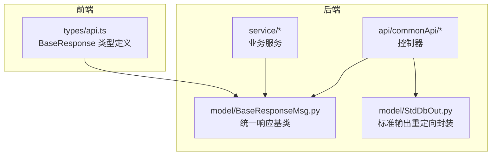
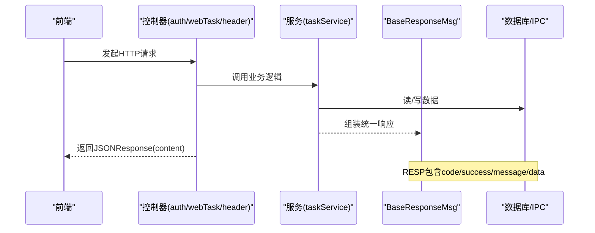
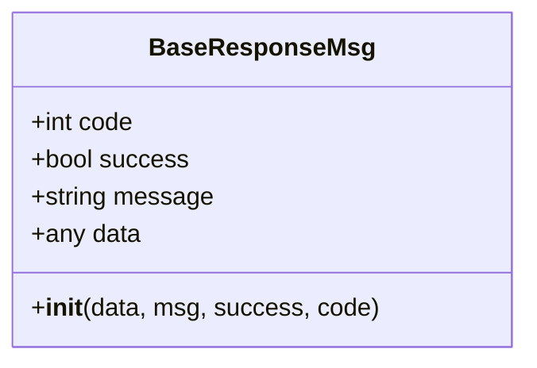
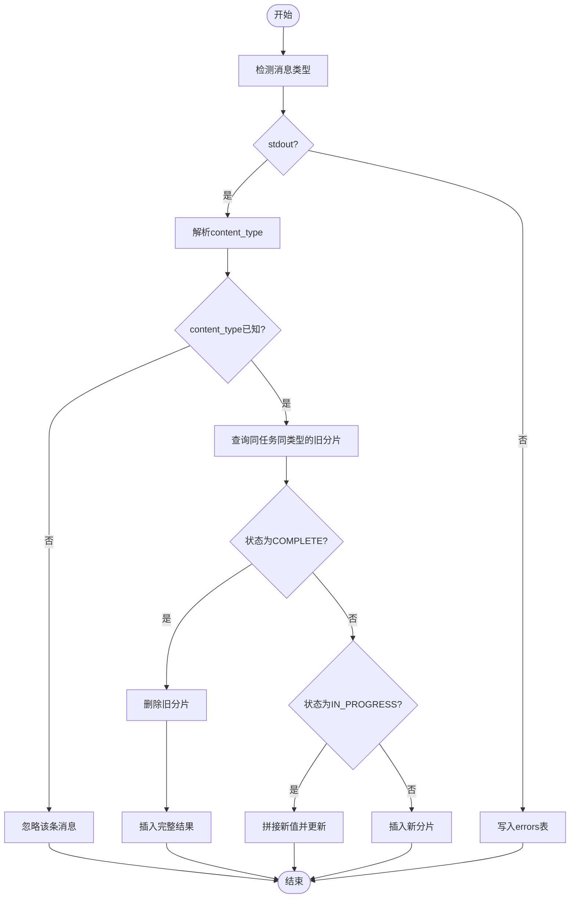
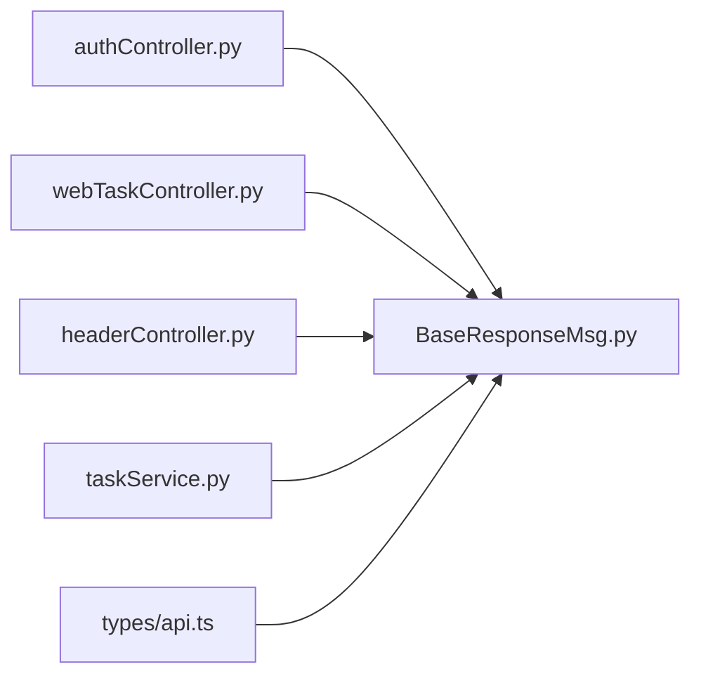

# 基础响应模型

<cite>
**本文引用的文件**
- [BaseResponseMsg.py](file://src/backEnd/model/BaseResponseMsg.py)
- [StdDbOut.py](file://src/backEnd/model/StdDbOut.py)
- [authController.py](file://src/backEnd/api/commonApi/authController.py)
- [webTaskController.py](file://src/backEnd/api/commonApi/webTaskController.py)
- [headerController.py](file://src/backEnd/api/commonApi/headerController.py)
- [taskService.py](file://src/backEnd/service/taskService.py)
- [api.ts](file://src/frontEnd/src/types/api.ts)
</cite>

## 目录
1. [简介](#简介)
2. [项目结构](#项目结构)
3. [核心组件](#核心组件)
4. [架构总览](#架构总览)
5. [详细组件分析](#详细组件分析)
6. [依赖关系分析](#依赖关系分析)
7. [性能考量](#性能考量)
8. [故障排查指南](#故障排查指南)
9. [结论](#结论)

## 简介
本文件聚焦于后端基础响应模型，系统性说明以下两点：
- BaseResponseMsg：作为所有API响应的统一基类，提供标准化的code、success、message、data四要素，确保前后端通信的一致性与可预期性。
- StdDbOut：在数据库操作结果输出中的特殊用途封装，将sqlmap引擎的标准输出/错误流重定向到IPC数据库，以任务维度聚合分片输出并写入最终结果，支撑实时日志/结果的持久化与查询。

同时，本文通过多个API端点的响应示例，展示BaseResponseMsg在不同场景下的具体应用与数据结构，并对code字段的约定规范、success字段的语义、message的本地化建议、以及data字段的泛型设计进行深入解读。

## 项目结构
基础响应模型位于后端模型层，被各API控制器与服务层广泛复用；前端TypeScript侧定义了与后端一致的响应结构类型，保证类型安全与契约一致性。

图表来源
- [BaseResponseMsg.py](file://src/backEnd/model/BaseResponseMsg.py#L1-L21)
- [StdDbOut.py](file://src/backEnd/model/StdDbOut.py#L1-L62)
- [authController.py](file://src/backEnd/api/commonApi/authController.py#L1-L150)
- [webTaskController.py](file://src/backEnd/api/commonApi/webTaskController.py#L1-L91)
- [headerController.py](file://src/backEnd/api/commonApi/headerController.py#L1-L481)
- [taskService.py](file://src/backEnd/service/taskService.py#L1-L200)
- [api.ts](file://src/frontEnd/src/types/api.ts#L1-L28)

章节来源
- [BaseResponseMsg.py](file://src/backEnd/model/BaseResponseMsg.py#L1-L21)
- [StdDbOut.py](file://src/backEnd/model/StdDbOut.py#L1-L62)
- [authController.py](file://src/backEnd/api/commonApi/authController.py#L1-L150)
- [webTaskController.py](file://src/backEnd/api/commonApi/webTaskController.py#L1-L91)
- [headerController.py](file://src/backEnd/api/commonApi/headerController.py#L1-L481)
- [taskService.py](file://src/backEnd/service/taskService.py#L1-L200)
- [api.ts](file://src/frontEnd/src/types/api.ts#L1-L28)

## 核心组件
- BaseResponseMsg：继承FastAPI的JSONResponse，构造统一响应体content，包含code、success、message、data四个字段；同时在实例上挂载同名属性，便于在业务代码中直接读取。
- StdDbOut：将标准输出/错误流重定向至IPC数据库，按任务ID与内容类型聚合分片输出，在完成时插入最终结果，并清理中间片段；同时支持错误记录。

章节来源
- [BaseResponseMsg.py](file://src/backEnd/model/BaseResponseMsg.py#L1-L21)
- [StdDbOut.py](file://src/backEnd/model/StdDbOut.py#L1-L62)

## 架构总览
BaseResponseMsg贯穿控制器与服务层，控制器负责参数校验与调用服务，服务层执行业务逻辑并返回BaseResponseMsg；前端通过统一的BaseResponse<T>类型消费响应，确保契约一致。

图表来源
- [authController.py](file://src/backEnd/api/commonApi/authController.py#L1-L150)
- [webTaskController.py](file://src/backEnd/api/commonApi/webTaskController.py#L1-L91)
- [headerController.py](file://src/backEnd/api/commonApi/headerController.py#L1-L481)
- [taskService.py](file://src/backEnd/service/taskService.py#L1-L200)
- [BaseResponseMsg.py](file://src/backEnd/model/BaseResponseMsg.py#L1-L21)

## 详细组件分析

### BaseResponseMsg 设计与实现
- 字段设计
  - code：业务状态码，用于快速判断请求是否成功及错误类别；建议遵循HTTP状态码风格或自定义业务码，便于前端统一处理。
  - success：布尔语义，明确指示本次操作是否成功；与code配合使用，避免仅靠code判断带来的歧义。
  - message：人类可读的消息文本，建议支持多语言；当前实现为字符串字段，前端可结合国际化框架进行本地化渲染。
  - data：泛型承载，承载具体业务数据；可为对象、数组或简单值，前端通过BaseResponse<T>进行类型约束。
- 实现要点
  - 继承JSONResponse，content固定为上述四要素，status_code通常设为200，错误由code与success体现。
  - 在构造函数中同时挂载实例属性，便于在业务代码中直接访问，减少重复取值。
- 与前端契约
  - 前端定义BaseResponse<T>，字段与后端保持一致，确保TS类型检查与序列化一致性。

图表来源
- [BaseResponseMsg.py](file://src/backEnd/model/BaseResponseMsg.py#L1-L21)
- [api.ts](file://src/frontEnd/src/types/api.ts#L1-L28)

章节来源
- [BaseResponseMsg.py](file://src/backEnd/model/BaseResponseMsg.py#L1-L21)
- [api.ts](file://src/frontEnd/src/types/api.ts#L1-L28)

### BaseResponseMsg 的典型应用场景与响应示例
- 登录接口（成功）
  - 场景：用户凭据有效，返回token与用户信息。
  - 关键点：success为true，code为200，message为“登录成功”，data包含token与用户信息。
  - 参考路径：[authController.py](file://src/backEnd/api/commonApi/authController.py#L40-L79)
- 登录接口（失败）
  - 场景：异常或参数错误导致失败。
  - 关键点：success为false，code为500，message为错误描述，data为null。
  - 参考路径：[authController.py](file://src/backEnd/api/commonApi/authController.py#L71-L79)
- 令牌刷新（成功）
  - 场景：返回新token与过期时间。
  - 关键点：success为true，code为200，message为“令牌刷新成功”。
  - 参考路径：[authController.py](file://src/backEnd/api/commonApi/authController.py#L81-L111)
- Web端添加扫描任务（参数缺失）
  - 场景：options为空，返回400。
  - 关键点：success为false，code为400，message为提示信息。
  - 参考路径：[webTaskController.py](file://src/backEnd/api/commonApi/webTaskController.py#L42-L54)
- 会话请求头设置（部分成功）
  - 场景：批量设置时部分失败，返回206。
  - 关键点：success为true，code为206，message描述部分成功情况。
  - 参考路径：[headerController.py](file://src/backEnd/api/commonApi/headerController.py#L154-L167)
- 任务列表（成功）
  - 场景：查询任务列表，返回任务数组与统计。
  - 关键点：success为true，code为200，data包含tasks与tasks_num。
  - 参考路径：[taskService.py](file://src/backEnd/service/taskService.py#L172-L176)

章节来源
- [authController.py](file://src/backEnd/api/commonApi/authController.py#L40-L111)
- [webTaskController.py](file://src/backEnd/api/commonApi/webTaskController.py#L42-L54)
- [headerController.py](file://src/backEnd/api/commonApi/headerController.py#L154-L167)
- [taskService.py](file://src/backEnd/service/taskService.py#L172-L176)

### StdDbOut 数据库输出封装
- 设计目的
  - 将sqlmap引擎的标准输出/错误流重定向到IPC数据库，按任务维度聚合分片输出，最终写入完整结果，便于前端实时拉取与展示。
- 工作机制
  - 重定向sys.stdout/sys.stderr到StdDbOut实例，拦截write调用。
  - 写入策略：
    - stdout：若content_type未知则忽略；否则查询同任务同类型的现有分片，若状态为IN_PROGRESS则拼接，否则插入新分片；当状态为COMPLETE时，先删除旧分片再插入完整结果，并清空kb.partRun。
    - stderr：直接插入errors表，记录错误信息。
  - flush/close/seek：空实现，满足文件接口兼容性。
- 适用场景
  - 长耗时任务的日志/结果增量输出与最终落盘，避免一次性大块输出导致的内存压力与网络阻塞。

图表来源
- [StdDbOut.py](file://src/backEnd/model/StdDbOut.py#L1-L62)

章节来源
- [StdDbOut.py](file://src/backEnd/model/StdDbOut.py#L1-L62)

## 依赖关系分析
- 控制器依赖BaseResponseMsg：所有控制器均通过返回BaseResponseMsg实例，确保响应结构一致。
- 服务层依赖BaseResponseMsg：服务层在参数校验、异常处理等环节返回BaseResponseMsg，向上游控制器透传。
- 前端依赖BaseResponse<T>：前端通过BaseResponse<T>消费后端响应，保证类型安全与契约一致。

图表来源
- [authController.py](file://src/backEnd/api/commonApi/authController.py#L1-L150)
- [webTaskController.py](file://src/backEnd/api/commonApi/webTaskController.py#L1-L91)
- [headerController.py](file://src/backEnd/api/commonApi/headerController.py#L1-L481)
- [taskService.py](file://src/backEnd/service/taskService.py#L1-L200)
- [BaseResponseMsg.py](file://src/backEnd/model/BaseResponseMsg.py#L1-L21)
- [api.ts](file://src/frontEnd/src/types/api.ts#L1-L28)

章节来源
- [authController.py](file://src/backEnd/api/commonApi/authController.py#L1-L150)
- [webTaskController.py](file://src/backEnd/api/commonApi/webTaskController.py#L1-L91)
- [headerController.py](file://src/backEnd/api/commonApi/headerController.py#L1-L481)
- [taskService.py](file://src/backEnd/service/taskService.py#L1-L200)
- [BaseResponseMsg.py](file://src/backEnd/model/BaseResponseMsg.py#L1-L21)
- [api.ts](file://src/frontEnd/src/types/api.ts#L1-L28)

## 性能考量
- BaseResponseMsg
  - 统一响应体结构，减少前端分支判断复杂度，提升交互体验。
  - code与success分离，便于前端快速判定错误与非错误分支，降低解析成本。
- StdDbOut
  - 分片聚合写入，避免一次性大块输出，降低内存峰值与网络抖动风险。
  - 完成态清理旧分片，防止IPC数据库膨胀。
  - 错误单独记录，便于快速定位问题。

[本节为通用性能讨论，无需列出具体文件来源]

## 故障排查指南
- code与success不一致
  - 现象：code为非0但success为true，或相反。
  - 排查：检查业务逻辑中对success与code的赋值是否与业务语义一致。
  - 参考路径：[taskService.py](file://src/backEnd/service/taskService.py#L23-L43)
- message未本地化
  - 现象：message为英文或固定文案，影响多语言环境。
  - 建议：在控制器或服务层引入本地化资源映射，按客户端语言返回对应message。
  - 参考路径：[authController.py](file://src/backEnd/api/commonApi/authController.py#L40-L79)
- data结构与前端类型不匹配
  - 现象：前端TS类型报错或运行时字段缺失。
  - 排查：确认BaseResponse<T>中的T与实际data结构一致，必要时扩展类型定义。
  - 参考路径：[api.ts](file://src/frontEnd/src/types/api.ts#L1-L28)
- StdDbOut未产生结果
  - 现象：前端无日志/结果。
  - 排查：确认content_type解析是否成功、任务ID是否正确、COMPLETE态是否触发清理与插入。
  - 参考路径：[StdDbOut.py](file://src/backEnd/model/StdDbOut.py#L25-L62)

章节来源
- [taskService.py](file://src/backEnd/service/taskService.py#L23-L43)
- [authController.py](file://src/backEnd/api/commonApi/authController.py#L40-L79)
- [api.ts](file://src/frontEnd/src/types/api.ts#L1-L28)
- [StdDbOut.py](file://src/backEnd/model/StdDbOut.py#L25-L62)

## 结论
- BaseResponseMsg提供了统一、可预期的响应契约，通过code、success、message、data四个字段覆盖绝大多数API场景，配合前端BaseResponse<T>实现强类型消费。
- StdDbOut为长耗时任务的日志/结果输出提供了高效的分片聚合与持久化能力，保障实时性与稳定性。
- 建议在后续迭代中完善message的本地化策略与code的业务码规范，进一步提升跨语言与跨系统的可维护性与一致性。