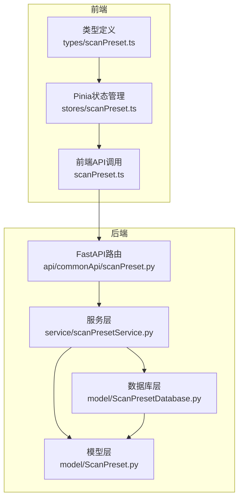
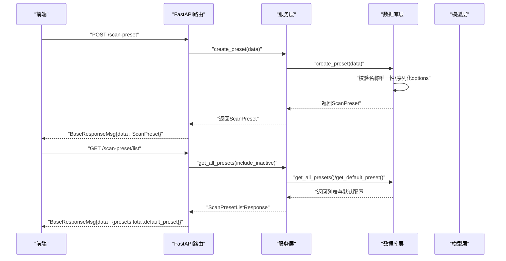
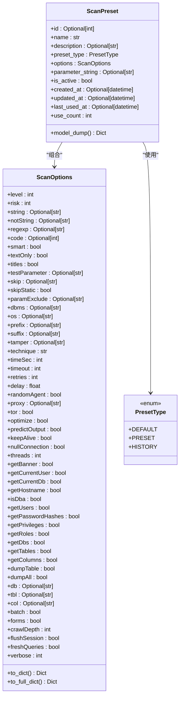
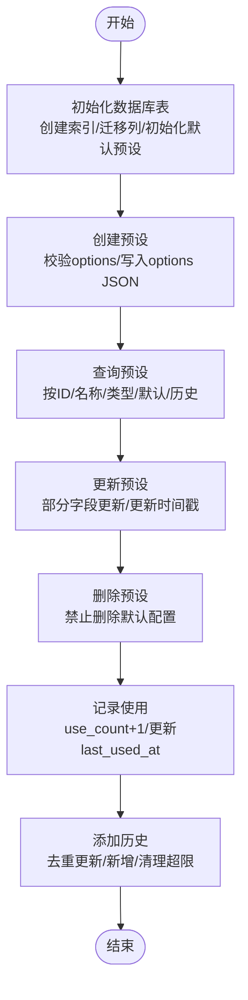
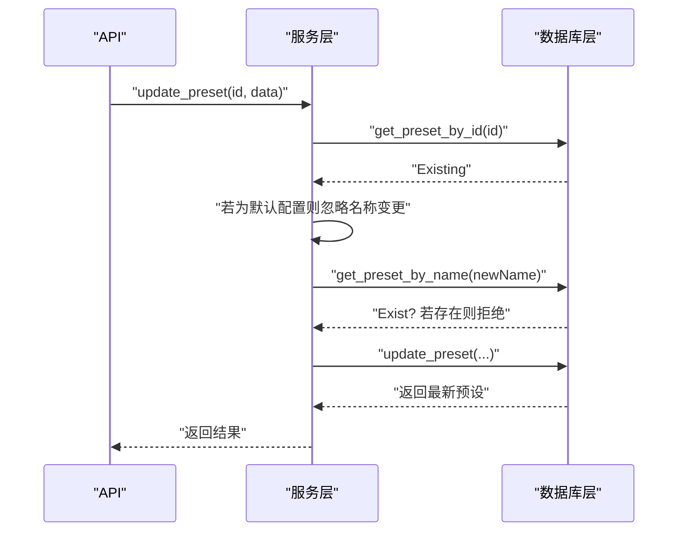
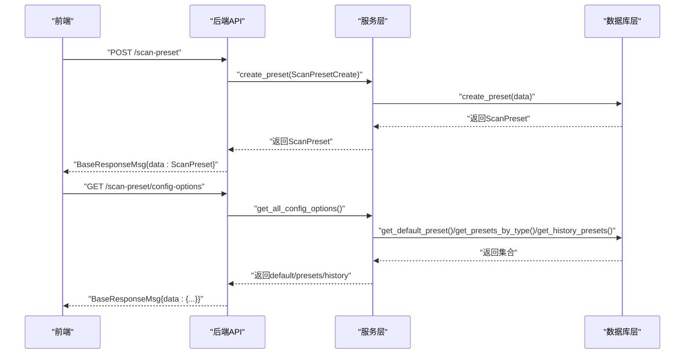
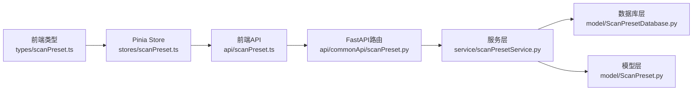

# 扫描配置模型

<cite>
**本文引用的文件**
- [ScanPreset.py](file://src/backEnd/model/ScanPreset.py)
- [ScanPresetDatabase.py](file://src/backEnd/model/ScanPresetDatabase.py)
- [scanPreset.py](file://src/backEnd/api/commonApi/scanPreset.py)
- [scanPresetService.py](file://src/backEnd/service/scanPresetService.py)
- [scanPreset.ts](file://src/frontEnd/src/types/scanPreset.ts)
- [scanPreset.ts（Pinia Store）](file://src/frontEnd/src/stores/scanPreset.ts)
- [scanPreset.ts（API）](file://src/frontEnd/src/api/scanPreset.ts)
</cite>

## 目录
1. [简介](#简介)
2. [项目结构](#项目结构)
3. [核心组件](#核心组件)
4. [架构总览](#架构总览)
5. [详细组件分析](#详细组件分析)
6. [依赖关系分析](#依赖关系分析)
7. [性能考量](#性能考量)
8. [故障排查指南](#故障排查指南)
9. [结论](#结论)
10. [附录](#附录)

## 简介
本文件围绕“扫描配置模型”展开，重点解析以下两个核心模块：
- ScanPreset：用于描述用户保存的常用扫描配置，包含配置名称、描述、类型、扫描选项、命令行参数字符串、启用状态及时间戳等属性，并提供序列化与默认预设构造能力。
- ScanPresetDatabase：作为内存+持久化的数据库层，负责扫描配置的CRUD操作、默认配置初始化、历史记录维护、使用计数与最近使用时间记录等。

同时，文档结合后端FastAPI接口与前端Pinia Store/Types，说明从用户界面输入创建ScanPreset实例并保存到数据库的完整流程；并通过接口响应示例展示配置列表与单个配置详情的JSON结构；最后总结模型验证规则（如配置名称唯一性约束、参数字符串格式校验等）。

## 项目结构
后端采用三层结构：模型层（Pydantic）+ 服务层（业务逻辑）+ API层（FastAPI路由），前端采用TypeScript类型定义与Pinia状态管理对接后端API。

图表来源
- [scanPreset.py](file://src/backEnd/api/commonApi/scanPreset.py#L1-L325)
- [scanPresetService.py](file://src/backEnd/service/scanPresetService.py#L1-L182)
- [ScanPreset.py](file://src/backEnd/model/ScanPreset.py#L1-L231)
- [ScanPresetDatabase.py](file://src/backEnd/model/ScanPresetDatabase.py#L1-L514)
- [scanPreset.ts（API）](file://src/frontEnd/src/api/scanPreset.ts#L1-L145)
- [scanPreset.ts（Pinia Store）](file://src/frontEnd/src/stores/scanPreset.ts#L1-L296)
- [scanPreset.ts](file://src/frontEnd/src/types/scanPreset.ts#L1-L199)

章节来源
- [scanPreset.py](file://src/backEnd/api/commonApi/scanPreset.py#L1-L325)
- [scanPresetService.py](file://src/backEnd/service/scanPresetService.py#L1-L182)
- [ScanPreset.py](file://src/backEnd/model/ScanPreset.py#L1-L231)
- [ScanPresetDatabase.py](file://src/backEnd/model/ScanPresetDatabase.py#L1-L514)
- [scanPreset.ts（API）](file://src/frontEnd/src/api/scanPreset.ts#L1-L145)
- [scanPreset.ts（Pinia Store）](file://src/frontEnd/src/stores/scanPreset.ts#L1-L296)
- [scanPreset.ts](file://src/frontEnd/src/types/scanPreset.ts#L1-L199)

## 核心组件
- ScanPreset模型：定义配置名称、描述、类型、扫描选项、命令行参数字符串、启用状态、时间戳、使用计数等字段，并提供序列化为JSON的能力（含日期格式化）。
- ScanOptions子模型：覆盖检测、注入、技术、请求、优化、枚举、通用等多类扫描参数，均带有Pydantic字段约束（范围、长度、类型等）。
- ScanPresetDatabase：负责SQLite表初始化、CRUD、默认配置初始化、历史记录维护、使用计数与最近使用时间记录、迁移兼容等。
- 服务层ScanPresetService：封装业务规则（名称唯一性、默认配置保护、历史记录上限清理、应用预设合并策略等）。
- FastAPI接口：提供列表、详情、创建、更新、删除、历史、应用预设等REST接口，统一返回BaseResponseMsg包装的数据。
- 前端类型与状态：定义与后端一致的类型，Pinia Store负责加载配置选项、应用预设、保存当前配置为新预设、历史记录维护等。

章节来源
- [ScanPreset.py](file://src/backEnd/model/ScanPreset.py#L1-L231)
- [ScanPresetDatabase.py](file://src/backEnd/model/ScanPresetDatabase.py#L1-L514)
- [scanPresetService.py](file://src/backEnd/service/scanPresetService.py#L1-L182)
- [scanPreset.py](file://src/backEnd/api/commonApi/scanPreset.py#L1-L325)
- [scanPreset.ts](file://src/frontEnd/src/types/scanPreset.ts#L1-L199)
- [scanPreset.ts（Pinia Store）](file://src/frontEnd/src/stores/scanPreset.ts#L1-L296)
- [scanPreset.ts（API）](file://src/frontEnd/src/api/scanPreset.ts#L1-L145)

## 架构总览
后端整体采用“模型-服务-数据库-API”的分层设计，前端通过API适配器与状态管理与后端交互。

图表来源
- [scanPreset.py](file://src/backEnd/api/commonApi/scanPreset.py#L1-L325)
- [scanPresetService.py](file://src/backEnd/service/scanPresetService.py#L1-L182)
- [ScanPresetDatabase.py](file://src/backEnd/model/ScanPresetDatabase.py#L1-L514)
- [ScanPreset.py](file://src/backEnd/model/ScanPreset.py#L1-L231)

## 详细组件分析

### ScanPreset模型设计
- 字段与用途
  - id/name/description：标识与描述信息
  - preset_type：默认/常用/历史三类
  - options：ScanOptions对象，承载所有扫描参数
  - parameter_string：与BurpSuite兼容的命令行参数字符串
  - is_active/created_at/updated_at/last_used_at/use_count：启用状态、时间戳、最近使用时间、使用计数
- 序列化
  - model_dump覆盖：将datetime字段转为ISO字符串，便于JSON传输
  - to_dict/to_full_dict：仅返回非默认值或完整字典，便于前后端差异传递
- 预定义配置
  - 提供默认配置、快速扫描、深度扫描、安全扫描等预设构造函数，便于初始化与演示

图表来源
- [ScanPreset.py](file://src/backEnd/model/ScanPreset.py#L1-L231)

章节来源
- [ScanPreset.py](file://src/backEnd/model/ScanPreset.py#L1-L231)

### ScanPresetDatabase持久化与CRUD
- 初始化
  - 创建scan_presets表，包含name唯一约束、preset_type默认值、options默认空字典、parameter_string列迁移、索引建立
  - 初始化默认预设（默认、快速、深度、安全）
- CRUD与业务方法
  - create_preset：校验options并写入数据库，返回自增ID并补全到ScanPreset
  - get_preset_by_id/name/type：按条件查询，转换为ScanPreset对象
  - get_all_presets/get_presets_by_type/get_default_preset/get_history_presets：聚合查询与排序
  - update_preset：支持部分字段更新，自动更新updated_at
  - delete_preset：禁止删除默认配置
  - record_preset_usage：使用计数+1并更新last_used_at
  - add_to_history：去重更新或新增历史记录，并清理超出上限的历史条目
- 数据库列与转换
  - options以JSON字符串存储，读取时反序列化为ScanOptions
  - parameter_string、is_active、时间戳、use_count均做类型安全转换

图表来源
- [ScanPresetDatabase.py](file://src/backEnd/model/ScanPresetDatabase.py#L1-L514)

章节来源
- [ScanPresetDatabase.py](file://src/backEnd/model/ScanPresetDatabase.py#L1-L514)

### 服务层业务规则
- 名称唯一性：创建/更新时检查同名冲突
- 默认配置保护：默认配置不可删除；名称不可变更；仅允许更新选项
- 历史记录上限：默认保留最近使用的若干条历史记录
- 应用预设：将预设选项与基础选项合并，记录使用

图表来源
- [scanPresetService.py](file://src/backEnd/service/scanPresetService.py#L1-L182)
- [ScanPresetDatabase.py](file://src/backEnd/model/ScanPresetDatabase.py#L1-L514)

章节来源
- [scanPresetService.py](file://src/backEnd/service/scanPresetService.py#L1-L182)

### 后端API与前端交互
- API接口
  - GET /scan-preset/list：返回presets、total、default_preset
  - GET /scan-preset/config-options：返回default、presets、history
  - GET /scan-preset/default、PUT /scan-preset/default：默认配置读取与更新
  - GET /scan-preset/presets、GET /scan-preset/history：常用与历史列表
  - GET /scan-preset/{id}：按ID获取
  - POST /scan-preset、PUT /scan-preset/{id}、DELETE /scan-preset/{id}：CRUD
  - POST /scan-preset/history：添加到历史
  - POST /scan-preset/{id}/apply：应用预设到基础选项
- 前端类型与状态
  - types/scanPreset.ts：定义PresetType、ScanOptions、ScanPreset、请求体、响应体、下拉选项等
  - stores/scanPreset.ts：加载配置选项、应用预设、保存当前配置为新预设、历史记录维护、计算有效选项
  - api/scanPreset.ts：封装HTTP请求，与后端接口一一对应

图表来源
- [scanPreset.py](file://src/backEnd/api/commonApi/scanPreset.py#L1-L325)
- [scanPresetService.py](file://src/backEnd/service/scanPresetService.py#L1-L182)
- [ScanPresetDatabase.py](file://src/backEnd/model/ScanPresetDatabase.py#L1-L514)
- [scanPreset.ts（API）](file://src/frontEnd/src/api/scanPreset.ts#L1-L145)
- [scanPreset.ts（Pinia Store）](file://src/frontEnd/src/stores/scanPreset.ts#L1-L296)
- [scanPreset.ts](file://src/frontEnd/src/types/scanPreset.ts#L1-L199)

章节来源
- [scanPreset.py](file://src/backEnd/api/commonApi/scanPreset.py#L1-L325)
- [scanPreset.ts（API）](file://src/frontEnd/src/api/scanPreset.ts#L1-L145)
- [scanPreset.ts（Pinia Store）](file://src/frontEnd/src/stores/scanPreset.ts#L1-L296)
- [scanPreset.ts](file://src/frontEnd/src/types/scanPreset.ts#L1-L199)

## 依赖关系分析
- 模块耦合
  - API层依赖服务层；服务层依赖数据库层与模型层；前端类型与状态依赖后端API。
- 关键依赖链
  - API -> Service -> Database -> Model
  - FrontEnd Types/Store -> FrontEnd API -> Backend API -> Service -> Database
- 循环依赖
  - 未发现循环依赖；各层职责清晰，接口边界明确。

图表来源
- [scanPreset.py](file://src/backEnd/api/commonApi/scanPreset.py#L1-L325)
- [scanPresetService.py](file://src/backEnd/service/scanPresetService.py#L1-L182)
- [ScanPresetDatabase.py](file://src/backEnd/model/ScanPresetDatabase.py#L1-L514)
- [ScanPreset.py](file://src/backEnd/model/ScanPreset.py#L1-L231)
- [scanPreset.ts（API）](file://src/frontEnd/src/api/scanPreset.ts#L1-L145)
- [scanPreset.ts（Pinia Store）](file://src/frontEnd/src/stores/scanPreset.ts#L1-L296)
- [scanPreset.ts](file://src/frontEnd/src/types/scanPreset.ts#L1-L199)

章节来源
- [scanPreset.py](file://src/backEnd/api/commonApi/scanPreset.py#L1-L325)
- [scanPresetService.py](file://src/backEnd/service/scanPresetService.py#L1-L182)
- [ScanPresetDatabase.py](file://src/backEnd/model/ScanPresetDatabase.py#L1-L514)
- [ScanPreset.py](file://src/backEnd/model/ScanPreset.py#L1-L231)
- [scanPreset.ts（API）](file://src/frontEnd/src/api/scanPreset.ts#L1-L145)
- [scanPreset.ts（Pinia Store）](file://src/frontEnd/src/stores/scanPreset.ts#L1-L296)
- [scanPreset.ts](file://src/frontEnd/src/types/scanPreset.ts#L1-L199)

## 性能考量
- 查询优化
  - 为preset_type、is_active、name建立索引，提升过滤与排序效率
- 序列化开销
  - options以JSON字符串存储，读取时反序列化；建议在高频场景避免重复序列化
- 历史记录清理
  - add_to_history后清理超限历史，避免表膨胀
- 并发与锁
  - 数据库层继承基类Database，内部持有连接与锁，注意并发访问时的异常日志与重试策略

[本节为通用指导，无需具体文件分析]

## 故障排查指南
- 创建失败（名称冲突）
  - 现象：返回400，提示配置名称可能已存在
  - 排查：确认同名预设是否已存在；更新时检查新名称是否被占用
- 删除失败（默认配置）
  - 现象：返回400，提示删除失败
  - 排查：默认配置不可删除；请先切换默认配置或修改其选项
- 应用预设失败
  - 现象：返回500
  - 排查：检查preset_id是否存在；确认后端日志错误栈
- 历史记录异常
  - 现象：历史过多或为空
  - 排查：确认历史上限参数；检查清理逻辑是否执行

章节来源
- [scanPreset.py](file://src/backEnd/api/commonApi/scanPreset.py#L1-L325)
- [scanPresetService.py](file://src/backEnd/service/scanPresetService.py#L1-L182)
- [ScanPresetDatabase.py](file://src/backEnd/model/ScanPresetDatabase.py#L1-L514)

## 结论
ScanPreset与ScanPresetDatabase共同构建了完整的扫描配置生命周期管理：从前端输入、模型校验、服务规则、数据库持久化到API暴露与前端状态管理。该设计具备良好的扩展性与可维护性，能够支撑默认配置、常用配置与历史配置的统一管理，并通过严格的验证与迁移机制保障数据一致性。

[本节为总结，无需具体文件分析]

## 附录

### JSON序列化示例
- 配置列表响应
  - 字段：presets（数组）、total（整数）、default_preset（对象或null）
  - 示例路径：[接口实现](file://src/backEnd/api/commonApi/scanPreset.py#L23-L44)
- 单个配置详情
  - 字段：id、name、description、preset_type、options、parameter_string、is_active、created_at、updated_at、last_used_at、use_count
  - 示例路径：[接口实现](file://src/backEnd/api/commonApi/scanPreset.py#L165-L189)
- 应用预设返回
  - 字段：options（合并后的字典）
  - 示例路径：[接口实现](file://src/backEnd/api/commonApi/scanPreset.py#L300-L325)

章节来源
- [scanPreset.py](file://src/backEnd/api/commonApi/scanPreset.py#L23-L44)
- [scanPreset.py](file://src/backEnd/api/commonApi/scanPreset.py#L165-L189)
- [scanPreset.py](file://src/backEnd/api/commonApi/scanPreset.py#L300-L325)

### 模型验证规则
- 配置名称唯一性
  - 创建/更新时检查同名冲突；默认配置名称不可变更
  - 示例路径：[服务层规则](file://src/backEnd/service/scanPresetService.py#L67-L105)
- 参数字符串格式
  - parameter_string为可选字符串；数据库层读取时进行类型安全处理
  - 示例路径：[数据库转换](file://src/backEnd/model/ScanPresetDatabase.py#L433-L501)
- 选项字段范围与类型
  - ScanOptions字段均带有min/max/范围/布尔/字符串等约束
  - 示例路径：[模型字段定义](file://src/backEnd/model/ScanPreset.py#L19-L105)

章节来源
- [scanPresetService.py](file://src/backEnd/service/scanPresetService.py#L67-L105)
- [ScanPresetDatabase.py](file://src/backEnd/model/ScanPresetDatabase.py#L433-L501)
- [ScanPreset.py](file://src/backEnd/model/ScanPreset.py#L19-L105)

### 从用户界面创建并保存ScanPreset的流程
- 前端步骤
  - 在Pinia Store中收集当前选项与描述，调用createPreset
  - 成功后重新加载配置选项（loadConfigOptions）
  - 示例路径：[Pinia Store](file://src/frontEnd/src/stores/scanPreset.ts#L172-L184)
- 后端步骤
  - API接收ScanPresetCreate，服务层校验名称唯一性并调用数据库创建
  - 数据库层序列化options为JSON并写入
  - 示例路径：[API](file://src/backEnd/api/commonApi/scanPreset.py#L191-L215)，[服务层](file://src/backEnd/service/scanPresetService.py#L67-L81)，[数据库](file://src/backEnd/model/ScanPresetDatabase.py#L156-L182)

章节来源
- [scanPreset.ts（Pinia Store）](file://src/frontEnd/src/stores/scanPreset.ts#L172-L184)
- [scanPreset.py](file://src/backEnd/api/commonApi/scanPreset.py#L191-L215)
- [scanPresetService.py](file://src/backEnd/service/scanPresetService.py#L67-L81)
- [ScanPresetDatabase.py](file://src/backEnd/model/ScanPresetDatabase.py#L156-L182)