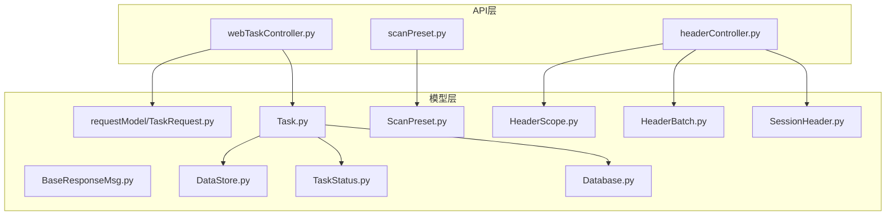
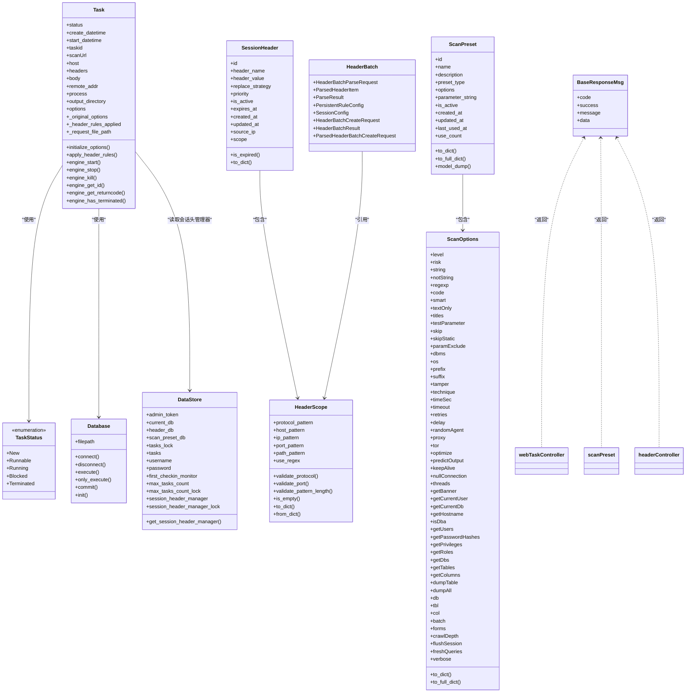
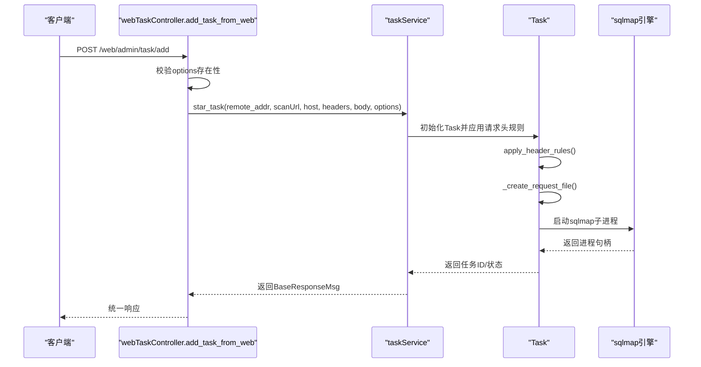
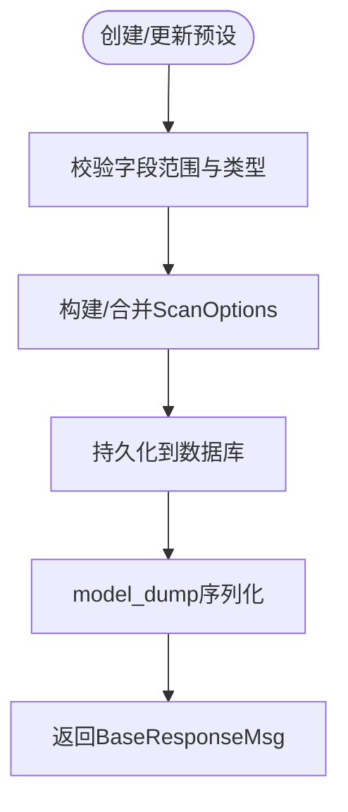
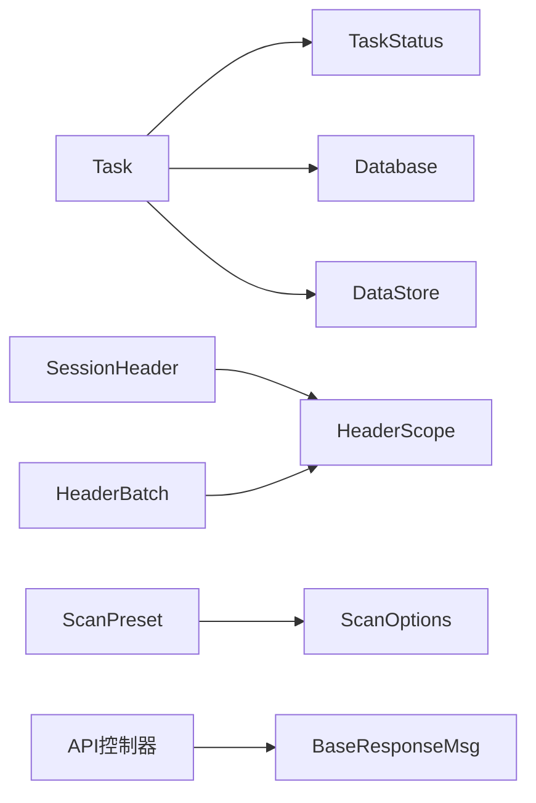

# 数据模型

<cite>
**本文引用的文件**
- [TaskRequest.py](file://src/backEnd/model/requestModel/TaskRequest.py)
- [Task.py](file://src/backEnd/model/Task.py)
- [ScanPreset.py](file://src/backEnd/model/ScanPreset.py)
- [HeaderScope.py](file://src/backEnd/model/HeaderScope.py)
- [BaseResponseMsg.py](file://src/backEnd/model/BaseResponseMsg.py)
- [DataStore.py](file://src/backEnd/model/DataStore.py)
- [TaskStatus.py](file://src/backEnd/model/TaskStatus.py)
- [Database.py](file://src/backEnd/model/Database.py)
- [HeaderBatch.py](file://src/backEnd/model/HeaderBatch.py)
- [SessionHeader.py](file://src/backEnd/model/SessionHeader.py)
- [webTaskController.py](file://src/backEnd/api/commonApi/webTaskController.py)
- [scanPreset.py](file://src/backEnd/api/commonApi/scanPreset.py)
- [headerController.py](file://src/backEnd/api/commonApi/headerController.py)
</cite>

## 目录
1. [简介](#简介)
2. [项目结构](#项目结构)
3. [核心组件](#核心组件)
4. [架构总览](#架构总览)
5. [详细组件分析](#详细组件分析)
6. [依赖分析](#依赖分析)
7. [性能考虑](#性能考虑)
8. [故障排查指南](#故障排查指南)
9. [结论](#结论)
10. [附录](#附录)

## 简介
本文件聚焦于sqlmapWebUI后端的Pydantic数据模型，系统梳理并解释各模型的字段定义、验证约束、序列化行为以及在API中的使用方式。重点覆盖以下核心模型：
- TaskRequest：Web端提交扫描任务的请求模型集合
- Task：扫描任务实体，负责请求头规则应用、请求文件生成与引擎启动
- ScanPreset：扫描配置预设，包含预设类型、选项、创建/更新/列表响应等
- HeaderScope：请求头作用域匹配模型，支持协议、主机、IP、端口、路径与正则/通配符
- BaseResponseMsg：统一API响应包装器，标准化返回结构

同时，通过UML类图展示模型间的继承、组合与关联关系；通过流程图说明关键验证规则与处理流程；并通过序列图展示典型API调用链路。

## 项目结构
后端模型主要位于src/backEnd/model目录，API控制器位于src/backEnd/api/commonApi目录，二者通过FastAPI路由与Pydantic模型进行数据契约绑定。

图表来源
- [TaskRequest.py](file://src/backEnd/model/requestModel/TaskRequest.py#L1-L57)
- [Task.py](file://src/backEnd/model/Task.py#L1-L333)
- [ScanPreset.py](file://src/backEnd/model/ScanPreset.py#L1-L231)
- [HeaderScope.py](file://src/backEnd/model/HeaderScope.py#L1-L187)
- [BaseResponseMsg.py](file://src/backEnd/model/BaseResponseMsg.py#L1-L21)
- [DataStore.py](file://src/backEnd/model/DataStore.py#L1-L38)
- [TaskStatus.py](file://src/backEnd/model/TaskStatus.py#L1-L9)
- [Database.py](file://src/backEnd/model/Database.py#L1-L99)
- [HeaderBatch.py](file://src/backEnd/model/HeaderBatch.py#L1-L86)
- [SessionHeader.py](file://src/backEnd/model/SessionHeader.py#L1-L97)
- [webTaskController.py](file://src/backEnd/api/commonApi/webTaskController.py#L1-L91)
- [scanPreset.py](file://src/backEnd/api/commonApi/scanPreset.py#L1-L325)
- [headerController.py](file://src/backEnd/api/commonApi/headerController.py#L1-L481)

章节来源
- [TaskRequest.py](file://src/backEnd/model/requestModel/TaskRequest.py#L1-L57)
- [Task.py](file://src/backEnd/model/Task.py#L1-L333)
- [ScanPreset.py](file://src/backEnd/model/ScanPreset.py#L1-L231)
- [HeaderScope.py](file://src/backEnd/model/HeaderScope.py#L1-L187)
- [BaseResponseMsg.py](file://src/backEnd/model/BaseResponseMsg.py#L1-L21)
- [DataStore.py](file://src/backEnd/model/DataStore.py#L1-L38)
- [TaskStatus.py](file://src/backEnd/model/TaskStatus.py#L1-L9)
- [Database.py](file://src/backEnd/model/Database.py#L1-L99)
- [HeaderBatch.py](file://src/backEnd/model/HeaderBatch.py#L1-L86)
- [SessionHeader.py](file://src/backEnd/model/SessionHeader.py#L1-L97)
- [webTaskController.py](file://src/backEnd/api/commonApi/webTaskController.py#L1-L91)
- [scanPreset.py](file://src/backEnd/api/commonApi/scanPreset.py#L1-L325)
- [headerController.py](file://src/backEnd/api/commonApi/headerController.py#L1-L481)

## 核心组件
本节对关键模型进行逐项说明，包括字段、类型、默认值、验证约束与用途。

- TaskRequest（任务请求模型族）
  - TaskAddRequest：用于Web端提交扫描任务，包含扫描URL、主机、请求头列表、请求体、扫描选项等字段，均带有描述信息，便于前端展示与校验。
  - TaskUpdateRequest/TaskDeleteRequest/TaskStopRequest/TaskQueryRequest/TaskListRequest/TaskFindByUrlPathRequest/TaskFindByBodyKeyWordRequest/TaskFindByHeaderKeyWordRequest/TaskLogQueryRequest：分别对应更新、删除、停止、查询、列表、按URL路径、按Body关键词、按Header关键词、按任务ID查询日志等场景。
  - 关键验证：TaskAddRequest的options为必填字典；TaskDeleteRequest/TaskStopRequest/TaskQueryRequest对taskid长度有严格约束；TaskLogQueryRequest对taskId长度有限制。
  - 用途：作为FastAPI路由的请求体模型，驱动任务服务层的业务处理。

- Task（扫描任务实体）
  - 字段：状态、创建/开始时间、任务ID、扫描URL、主机、请求头、请求体、远程地址、进程句柄、输出目录、选项、原始选项、请求文件路径、是否已应用请求头规则等。
  - 行为：初始化时生成默认选项（与sqlmap选项字典对齐）、应用请求头规则（持久化规则+会话头）、构建HTTP原始请求文件、启动sqlmap引擎（通过子进程）。
  - 关键验证：请求头规则应用过程包含异常捕获，失败时保持原请求头不变；请求文件生成包含Host头补全、空体处理等健壮性逻辑。
  - 用途：承载一次扫描任务的生命周期与引擎交互。

- ScanPreset（扫描配置预设）
  - ScanOptions：涵盖Detection、Injection、Techniques、Request、Optimization、Enumeration、General等类别，字段数量众多且带有范围约束（如level/risk/threads/timeSec/timeout/retries/delay/verbose等）。
  - ScanPreset：包含预设ID、名称、描述、类型（默认/常用/历史）、选项、命令行参数字符串、是否启用、时间戳、使用计数等。
  - ScanPresetCreate/ScanPresetUpdate：用于创建与更新的请求模型，支持可选字段。
  - ScanPresetListResponse：列表响应，包含预设列表、总数与默认预设。
  - 用途：统一管理扫描参数模板，支持默认、常用、历史三类预设，提供to_dict/to_full_dict与model_dump定制序列化。

- HeaderScope（请求头作用域）
  - 字段：protocol_pattern、host_pattern、ip_pattern、port_pattern、path_pattern、use_regex。
  - 验证：field_validator对协议与端口进行严格校验；对模式字符串长度进行限制；提供is_empty判断是否为空（等同全局生效）；to_dict/from_dict支持序列化与反序列化。
  - 用途：定义请求头规则适用的协议、主机、IP、端口、路径范围，支持通配符或正则。

- BaseResponseMsg（统一响应包装）
  - 字段：code、success、message、data，继承自FastAPI JSONResponse，构造时固定status_code为200，便于前端统一处理。
  - 用途：所有API控制器返回统一结构，简化前端消费与错误处理。

章节来源
- [TaskRequest.py](file://src/backEnd/model/requestModel/TaskRequest.py#L1-L57)
- [Task.py](file://src/backEnd/model/Task.py#L1-L333)
- [ScanPreset.py](file://src/backEnd/model/ScanPreset.py#L1-L231)
- [HeaderScope.py](file://src/backEnd/model/HeaderScope.py#L1-L187)
- [BaseResponseMsg.py](file://src/backEnd/model/BaseResponseMsg.py#L1-L21)

## 架构总览
下面的类图展示了核心模型之间的关系：Task组合了TaskStatus与Database；HeaderScope被SessionHeader与HeaderBatch等模型引用；ScanPreset包含ScanOptions；BaseResponseMsg被API控制器广泛使用。

图表来源
- [Task.py](file://src/backEnd/model/Task.py#L1-L333)
- [TaskStatus.py](file://src/backEnd/model/TaskStatus.py#L1-L9)
- [Database.py](file://src/backEnd/model/Database.py#L1-L99)
- [DataStore.py](file://src/backEnd/model/DataStore.py#L1-L38)
- [HeaderScope.py](file://src/backEnd/model/HeaderScope.py#L1-L187)
- [SessionHeader.py](file://src/backEnd/model/SessionHeader.py#L1-L97)
- [HeaderBatch.py](file://src/backEnd/model/HeaderBatch.py#L1-L86)
- [ScanPreset.py](file://src/backEnd/model/ScanPreset.py#L1-L231)
- [BaseResponseMsg.py](file://src/backEnd/model/BaseResponseMsg.py#L1-L21)
- [webTaskController.py](file://src/backEnd/api/commonApi/webTaskController.py#L1-L91)
- [scanPreset.py](file://src/backEnd/api/commonApi/scanPreset.py#L1-L325)
- [headerController.py](file://src/backEnd/api/commonApi/headerController.py#L1-L481)

## 详细组件分析

### TaskRequest模型族
- 设计要点
  - 采用Annotated与Field描述字段含义，便于API文档生成与前端展示。
  - 对任务ID长度进行严格约束（如16位），确保唯一性与一致性。
  - options字段作为字典，用于传递扫描参数，Web端控制器显式校验其存在性。
- 验证规则
  - 长度校验：taskid/min_length/max_length；taskId/min_length/max_length。
  - 类型校验：headers为列表；options为字典。
- 使用场景
  - Web端提交任务时，控制器将TaskAddRequest转为字典并调用任务服务层。

章节来源
- [TaskRequest.py](file://src/backEnd/model/requestModel/TaskRequest.py#L1-L57)
- [webTaskController.py](file://src/backEnd/api/commonApi/webTaskController.py#L1-L91)

### Task模型
- 设计要点
  - 初始化时生成默认选项并与sqlmap选项字典对齐，强制batch、disableColoring、eta等参数。
  - 在引擎启动前应用请求头规则，支持持久化规则与会话头合并。
  - 构建HTTP原始请求文件，自动补全Host头，处理空体与换行。
- 关键流程
  - apply_header_rules：动态导入服务与处理器，获取持久化规则与会话头，调用HeaderProcessor处理并写回options.headers。
  - engine_start：创建请求文件、保存配置、启动sqlmap子进程。
- 错误处理
  - 应用请求头规则失败时记录错误并保持原请求头不变。
  - 子进程启动失败时返回None或抛出异常，由上层控制器处理。

图表来源
- [webTaskController.py](file://src/backEnd/api/commonApi/webTaskController.py#L1-L91)
- [Task.py](file://src/backEnd/model/Task.py#L1-L333)
- [BaseResponseMsg.py](file://src/backEnd/model/BaseResponseMsg.py#L1-L21)

章节来源
- [Task.py](file://src/backEnd/model/Task.py#L1-L333)
- [webTaskController.py](file://src/backEnd/api/commonApi/webTaskController.py#L1-L91)

### ScanPreset模型族
- 设计要点
  - PresetType枚举区分默认、常用、历史三类预设。
  - ScanOptions字段覆盖sqlmap全部选项类别，大量字段带ge/le/min_length/max_length等约束。
  - 提供to_dict（仅非默认值）与to_full_dict（完整字典）两种序列化方式。
  - model_dump重写：将datetime字段转换为ISO字符串，便于JSON传输。
- 预定义预设
  - create_default_preset/create_quick_scan_preset/create_deep_scan_preset/create_safe_scan_preset：提供开箱即用的典型配置。
- API集成
  - scanPreset.py控制器通过BaseResponseMsg返回预设列表、默认预设、历史记录、创建/更新/删除结果等。

图表来源
- [ScanPreset.py](file://src/backEnd/model/ScanPreset.py#L1-L231)
- [scanPreset.py](file://src/backEnd/api/commonApi/scanPreset.py#L1-L325)
- [BaseResponseMsg.py](file://src/backEnd/model/BaseResponseMsg.py#L1-L21)

章节来源
- [ScanPreset.py](file://src/backEnd/model/ScanPreset.py#L1-L231)
- [scanPreset.py](file://src/backEnd/api/commonApi/scanPreset.py#L1-L325)

### HeaderScope模型
- 设计要点
  - 支持协议、主机、IP、端口、路径五维匹配，use_regex控制匹配策略。
  - field_validator对协议与端口进行严格校验：协议仅允许http/https或正则；端口支持逗号分隔与数值范围校验。
  - 模式字符串长度限制：path_pattern更长，其他字段较短。
- 逻辑语义
  - scope为空（null或全空）时表示全局生效；非空时所有非空字段需同时满足（AND逻辑）。
- 使用场景
  - 与SessionHeader、HeaderBatch等模型配合，决定请求头规则的应用范围。

章节来源
- [HeaderScope.py](file://src/backEnd/model/HeaderScope.py#L1-L187)

### BaseResponseMsg在统一API响应格式中的作用
- 结构
  - 固定包含code、success、message、data四个字段；status_code固定为200，便于前端统一处理。
- 使用
  - webTaskController、scanPreset、headerController等控制器均返回BaseResponseMsg，保证前后端契约一致。
- 建议
  - 前端可依据success与code进行分支处理；后端可通过不同code表达业务状态（如400/404/500）。

章节来源
- [BaseResponseMsg.py](file://src/backEnd/model/BaseResponseMsg.py#L1-L21)
- [webTaskController.py](file://src/backEnd/api/commonApi/webTaskController.py#L1-L91)
- [scanPreset.py](file://src/backEnd/api/commonApi/scanPreset.py#L1-L325)
- [headerController.py](file://src/backEnd/api/commonApi/headerController.py#L1-L481)

## 依赖分析
- 组件耦合
  - Task依赖TaskStatus、Database、DataStore（会话头管理器）、第三方sqlmap引擎；与HeaderScope无直接耦合，但通过HeaderRuleService间接协作。
  - ScanPreset包含ScanOptions，提供序列化定制；与API控制器强耦合。
  - HeaderScope被SessionHeader、HeaderBatch等模型引用，形成跨模块复用。
- 外部依赖
  - FastAPI JSONResponse、Python typing/enum/field_validator等。
- 循环依赖
  - 通过动态导入避免Task与HeaderRuleService/SessionHeaderManager之间的循环引用。

图表来源
- [Task.py](file://src/backEnd/model/Task.py#L1-L333)
- [TaskStatus.py](file://src/backEnd/model/TaskStatus.py#L1-L9)
- [Database.py](file://src/backEnd/model/Database.py#L1-L99)
- [DataStore.py](file://src/backEnd/model/DataStore.py#L1-L38)
- [SessionHeader.py](file://src/backEnd/model/SessionHeader.py#L1-L97)
- [HeaderScope.py](file://src/backEnd/model/HeaderScope.py#L1-L187)
- [HeaderBatch.py](file://src/backEnd/model/HeaderBatch.py#L1-L86)
- [ScanPreset.py](file://src/backEnd/model/ScanPreset.py#L1-L231)
- [BaseResponseMsg.py](file://src/backEnd/model/BaseResponseMsg.py#L1-L21)

章节来源
- [Task.py](file://src/backEnd/model/Task.py#L1-L333)
- [SessionHeader.py](file://src/backEnd/model/SessionHeader.py#L1-L97)
- [HeaderScope.py](file://src/backEnd/model/HeaderScope.py#L1-L187)
- [HeaderBatch.py](file://src/backEnd/model/HeaderBatch.py#L1-L86)
- [ScanPreset.py](file://src/backEnd/model/ScanPreset.py#L1-L231)
- [BaseResponseMsg.py](file://src/backEnd/model/BaseResponseMsg.py#L1-L21)

## 性能考虑
- 请求头规则应用
  - 通过持久化规则与会话头合并，减少重复计算；建议在高并发场景下缓存活跃规则与会话头，降低动态导入与数据库查询开销。
- 请求文件生成
  - 临时文件写入磁盘，建议限制文件大小与数量，定期清理过期文件。
- 数据库访问
  - Database封装了锁与重试机制，避免sqlite锁竞争；建议在高频写入场景下合并事务或批量写入。
- API响应
  - BaseResponseMsg固定200状态码，前端可统一处理；建议后端在错误时仍返回统一结构，便于前端统一处理。

## 故障排查指南
- Task启动失败
  - 检查options是否正确传入；确认请求头规则应用是否成功；查看引擎启动命令与工作目录。
- 请求头规则不生效
  - 确认HeaderScope匹配条件；检查持久化规则与会话头是否启用；核对HeaderProcessor处理逻辑。
- 预设序列化异常
  - 检查datetime字段序列化逻辑；确认use_enum_values配置；核对to_dict/to_full_dict使用场景。
- API响应不符合预期
  - 核对BaseResponseMsg的success/code/message/data字段；检查控制器返回逻辑。

章节来源
- [Task.py](file://src/backEnd/model/Task.py#L1-L333)
- [HeaderScope.py](file://src/backEnd/model/HeaderScope.py#L1-L187)
- [ScanPreset.py](file://src/backEnd/model/ScanPreset.py#L1-L231)
- [BaseResponseMsg.py](file://src/backEnd/model/BaseResponseMsg.py#L1-L21)

## 结论
本数据模型体系围绕“任务”“预设”“请求头作用域”三大核心展开，通过严格的字段验证、灵活的序列化策略与统一的响应包装，实现了清晰的API契约与稳健的业务流程。Task模型承担了请求头规则应用与引擎交互的关键职责；ScanPreset模型提供了可扩展的扫描参数模板；HeaderScope模型为请求头规则的精细化控制提供了基础。建议在生产环境中进一步完善缓存策略与监控指标，持续优化性能与可观测性。

## 附录
- JSON序列化示例（示意）
  - BaseResponseMsg
    - {
        "code": 200,
        "success": true,
        "message": "操作成功",
        "data": {}
      }
  - ScanPreset（含datetime字段）
    - {
        "id": 1,
        "name": "快速扫描",
        "description": "快速扫描 - 仅基础检测",
        "preset_type": "preset",
        "options": {
          "level": 1,
          "risk": 1,
          "technique": "B",
          "batch": true
        },
        "parameter_string": null,
        "is_active": true,
        "created_at": "2025-01-01T12:00:00",
        "updated_at": "2025-01-01T12:00:00",
        "last_used_at": null,
        "use_count": 0
      }
  - HeaderScope
    - {
        "protocol_pattern": "https",
        "host_pattern": "*.example.com",
        "ip_pattern": null,
        "port_pattern": "443",
        "path_pattern": "/api/*",
        "use_regex": false
      }
  - TaskRequest（TaskAddRequest）
    - {
        "scanUrl": "https://example.com/api/users",
        "host": "example.com",
        "headers": ["User-Agent: ...", "Authorization: ..."],
        "body": "{...}",
        "options": {
          "batch": true,
          "level": 1,
          "risk": 1
        }
      }