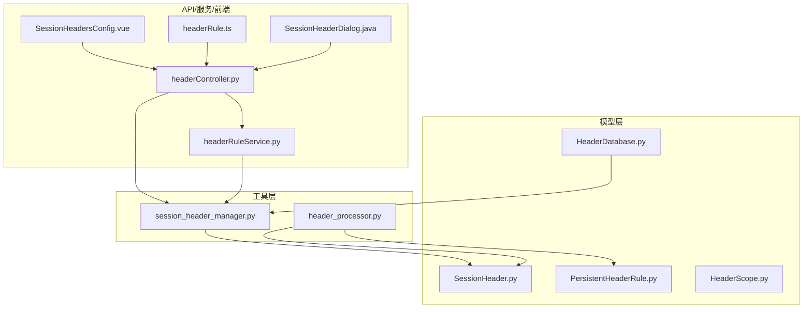
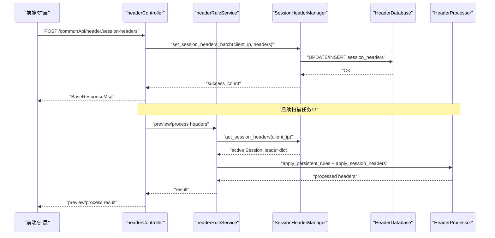
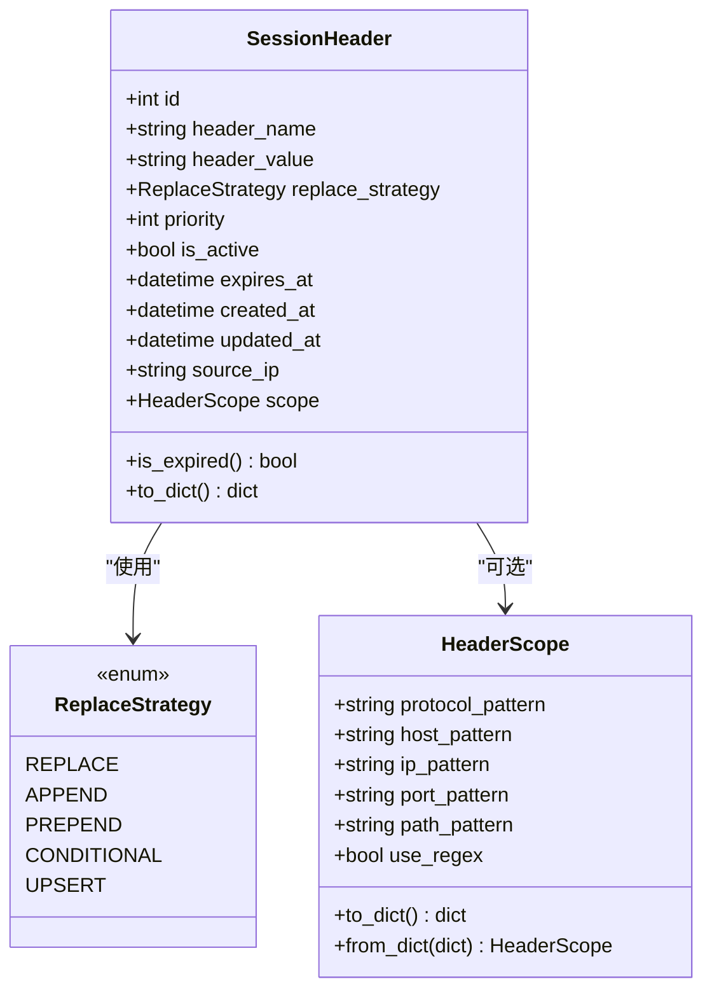
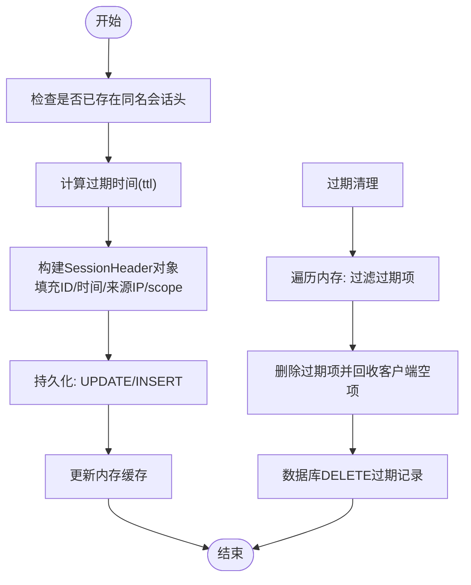
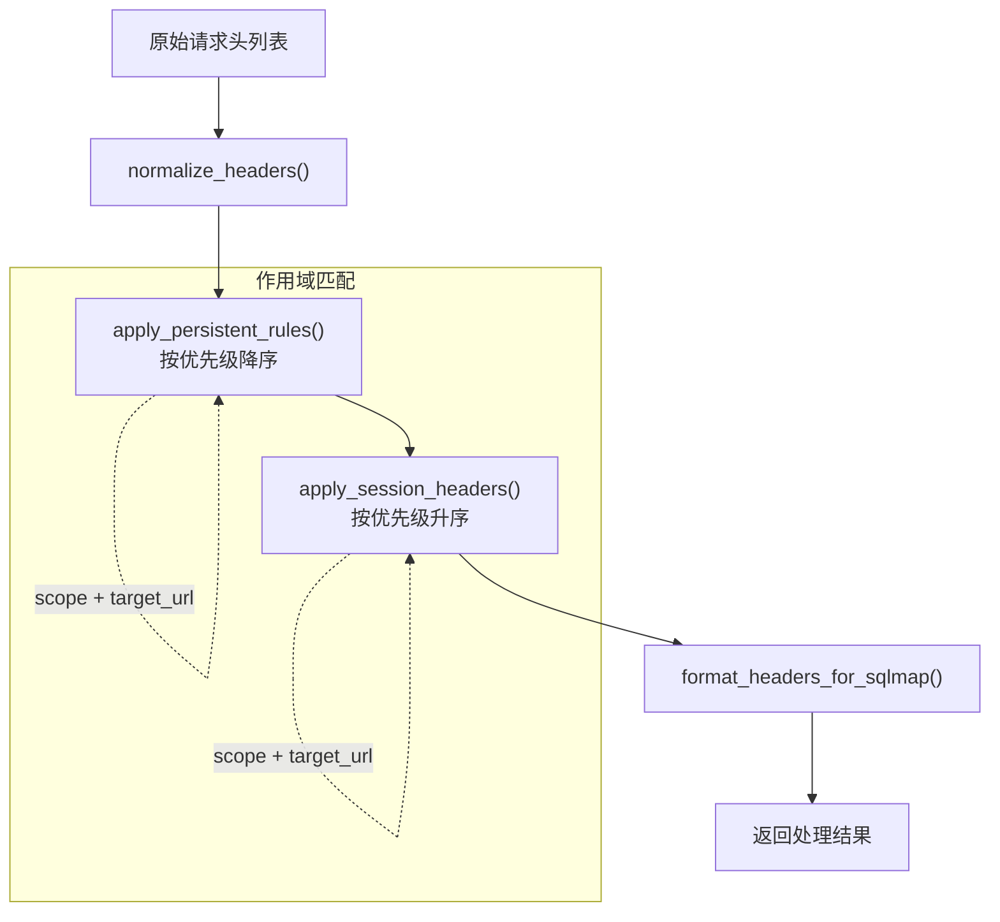
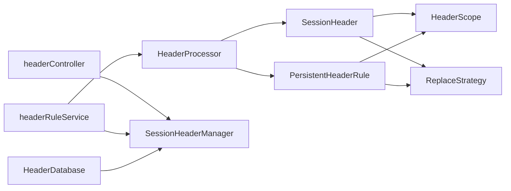

# 会话管理模型

<cite>
**本文引用的文件**
- [SessionHeader.py](file://src/backEnd/model/SessionHeader.py)
- [PersistentHeaderRule.py](file://src/backEnd/model/PersistentHeaderRule.py)
- [HeaderScope.py](file://src/backEnd/model/HeaderScope.py)
- [session_header_manager.py](file://src/backEnd/utils/session_header_manager.py)
- [header_processor.py](file://src/backEnd/utils/header_processor.py)
- [headerController.py](file://src/backEnd/api/commonApi/headerController.py)
- [HeaderDatabase.py](file://src/backEnd/model/HeaderDatabase.py)
- [headerRuleService.py](file://src/backEnd/service/headerRuleService.py)
- [SessionHeadersConfig.vue](file://src/frontEnd/src/views/Config/components/SessionHeadersConfig.vue)
- [headerRule.ts](file://src/frontEnd/src/api/headerRule.ts)
- [SessionHeaderDialog.java](file://src/burpEx/montoya-api/src/main/java/com/sqlmapwebui/burp/dialogs/SessionHeaderDialog.java)
</cite>

## 目录
1. [简介](#简介)
2. [项目结构](#项目结构)
3. [核心组件](#核心组件)
4. [架构总览](#架构总览)
5. [详细组件分析](#详细组件分析)
6. [依赖关系分析](#依赖关系分析)
7. [性能考量](#性能考量)
8. [故障排查指南](#故障排查指南)
9. [结论](#结论)
10. [附录](#附录)

## 简介
本文件系统性梳理“会话级请求头管理模型”，围绕 SessionHeader 类及其生命周期管理器 SessionHeaderManager 的设计与实现展开，重点说明以下内容：
- 会话级请求头与持久化规则的区别：前者具有临时性与会话生命周期特征；后者持久存储、跨任务复用。
- 会话头字段定义与存储机制：名称、值、替换策略、优先级、启用状态、过期时间、来源IP、作用域等。
- 生命周期管理：扫描任务期间动态添加、按优先级应用、自动过期清理、持久化同步。
- API 调用示例：设置、查询、更新、删除、批量创建、预览与统计。
- 在 Burp Suite 集成等实时分析场景中的应用价值：快速注入临时会话头，支持作用域匹配与优先级控制。

## 项目结构
围绕会话管理模型的关键文件分布如下：
- 模型层：SessionHeader、PersistentHeaderRule、HeaderScope、HeaderDatabase
- 工具层：SessionHeaderManager、HeaderProcessor
- API 层：headerController
- 服务层：headerRuleService
- 前端：SessionHeadersConfig.vue、headerRule.ts
- Burp 扩展：SessionHeaderDialog.java

图表来源
- [SessionHeader.py](file://src/backEnd/model/SessionHeader.py#L1-L97)
- [PersistentHeaderRule.py](file://src/backEnd/model/PersistentHeaderRule.py#L1-L104)
- [HeaderScope.py](file://src/backEnd/model/HeaderScope.py#L1-L187)
- [HeaderDatabase.py](file://src/backEnd/model/HeaderDatabase.py#L68-L100)
- [session_header_manager.py](file://src/backEnd/utils/session_header_manager.py#L1-L313)
- [header_processor.py](file://src/backEnd/utils/header_processor.py#L1-L292)
- [headerController.py](file://src/backEnd/api/commonApi/headerController.py#L1-L481)
- [headerRuleService.py](file://src/backEnd/service/headerRuleService.py#L849-L877)
- [SessionHeadersConfig.vue](file://src/frontEnd/src/views/Config/components/SessionHeadersConfig.vue#L1-L200)
- [headerRule.ts](file://src/frontEnd/src/api/headerRule.ts#L198-L234)
- [SessionHeaderDialog.java](file://src/burpEx/montoya-api/src/main/java/com/sqlmapwebui/burp/dialogs/SessionHeaderDialog.java#L310-L375)

章节来源
- [SessionHeader.py](file://src/backEnd/model/SessionHeader.py#L1-L97)
- [session_header_manager.py](file://src/backEnd/utils/session_header_manager.py#L1-L313)
- [header_processor.py](file://src/backEnd/utils/header_processor.py#L1-L292)
- [headerController.py](file://src/backEnd/api/commonApi/headerController.py#L1-L481)

## 核心组件
- SessionHeader：会话级请求头数据模型，包含名称、值、替换策略、优先级、启用状态、过期时间、来源IP、作用域等字段，并提供过期判断与序列化能力。
- SessionHeaderManager：内存中管理每个客户端的会话头集合，支持设置、批量设置、查询、删除、清空、过期清理、统计等操作，并与数据库保持同步。
- HeaderProcessor：统一处理请求头应用逻辑，先应用持久化规则，再应用会话性请求头，支持作用域匹配与优先级排序。
- headerController：对外暴露会话头管理的 REST API，包括设置、查询、更新、删除、批量创建、预览与统计。
- HeaderScope：作用域配置模型，支持协议、主机、IP、端口、路径等维度的匹配，支持通配符与正则。
- PersistentHeaderRule：持久化请求头规则模型，与会话头共享作用域与替换策略枚举，用于跨任务复用。

章节来源
- [SessionHeader.py](file://src/backEnd/model/SessionHeader.py#L1-L97)
- [session_header_manager.py](file://src/backEnd/utils/session_header_manager.py#L1-L313)
- [header_processor.py](file://src/backEnd/utils/header_processor.py#L1-L292)
- [headerController.py](file://src/backEnd/api/commonApi/headerController.py#L135-L352)
- [HeaderScope.py](file://src/backEnd/model/HeaderScope.py#L1-L187)
- [PersistentHeaderRule.py](file://src/backEnd/model/PersistentHeaderRule.py#L1-L104)

## 架构总览
会话头管理贯穿“模型-工具-服务-API-前端/Burp”的全链路，形成如下闭环：
- 前端/扩展提交会话头请求，经 API 层校验与路由，调用服务层与会话管理器；
- 会话管理器维护内存缓存与数据库同步，按优先级与作用域应用到请求头处理；
- HeaderProcessor 统一执行替换策略与作用域匹配，输出最终请求头；
- 统计接口提供运行态监控。

图表来源
- [headerController.py](file://src/backEnd/api/commonApi/headerController.py#L135-L210)
- [session_header_manager.py](file://src/backEnd/utils/session_header_manager.py#L141-L210)
- [header_processor.py](file://src/backEnd/utils/header_processor.py#L153-L211)
- [HeaderDatabase.py](file://src/backEnd/model/HeaderDatabase.py#L68-L100)

## 详细组件分析

### SessionHeader 类设计与字段定义
- 字段说明
  - header_name：请求头名称，长度限制与合法性校验由上层处理。
  - header_value：请求头值，支持较长字符串。
  - replace_strategy：替换策略枚举，支持 REPLACE、APPEND、PREPEND、CONDITIONAL、UPSERT。
  - priority：优先级（0-100），数值越大越靠后应用，便于覆盖低优先级会话头。
  - is_active：启用状态，配合前端/服务层控制是否参与应用。
  - expires_at：过期时间，到期后自动视为无效。
  - created_at/updated_at：创建与更新时间，用于审计与排序。
  - source_ip：来源IP，用于区分不同客户端的会话头集合。
  - scope：作用域配置，可选；为空时表示全局生效。
- 关键方法
  - is_expired()：基于当前时间与过期时间判断是否失效。
  - to_dict()：序列化为字典，便于 API 响应与持久化。
- 与持久化规则的关系
  - 两者共享相同的替换策略枚举与作用域模型，但 SessionHeader 仅在内存中短期存储，且带有过期时间。

图表来源
- [SessionHeader.py](file://src/backEnd/model/SessionHeader.py#L1-L97)
- [HeaderScope.py](file://src/backEnd/model/HeaderScope.py#L1-L187)

章节来源
- [SessionHeader.py](file://src/backEnd/model/SessionHeader.py#L1-L97)
- [HeaderScope.py](file://src/backEnd/model/HeaderScope.py#L1-L187)

### SessionHeaderManager 生命周期管理
- 存储结构
  - 内存：{client_ip: {header_name: SessionHeader}}，线程安全通过锁保护。
  - 数据库：session_headers 表，字段包含 client_ip、header_name、header_value、replace_strategy、priority、is_active、expires_at、created_at、updated_at、scope_config 等。
- 核心能力
  - set_session_header：计算过期时间、复用ID、合并 scope、持久化更新/插入、返回布尔结果。
  - set_session_headers_batch：批量设置，统计成功数量。
  - get_session_headers/get_all_session_headers：按是否仅活跃返回集合。
  - remove_session_header/clear_session_headers：删除单个或清空某客户端所有会话头，并同步数据库。
  - cleanup_expired_headers：清理内存与数据库中过期的会话头。
  - 统计接口：客户端数量、总数量、活跃数量。
- 并发与一致性
  - 使用锁保护内存结构，确保并发下的原子性。
  - 数据库采用 UPDATE/INSERT 双分支，保证幂等与ID一致性。

图表来源
- [session_header_manager.py](file://src/backEnd/utils/session_header_manager.py#L34-L130)
- [session_header_manager.py](file://src/backEnd/utils/session_header_manager.py#L241-L290)
- [HeaderDatabase.py](file://src/backEnd/model/HeaderDatabase.py#L68-L100)

章节来源
- [session_header_manager.py](file://src/backEnd/utils/session_header_manager.py#L1-L313)
- [HeaderDatabase.py](file://src/backEnd/model/HeaderDatabase.py#L68-L100)

### HeaderProcessor 应用顺序与策略
- 应用顺序
  - 先应用持久化规则（按优先级降序），再应用会话性请求头（按优先级升序，使高优先级会话头覆盖低优先级）。
- 作用域匹配
  - 若规则/会话头配置了 scope 且提供了 target_url，则进行匹配；否则跳过。
- 替换策略
  - 对持久化规则与会话头均支持 REPLACE、APPEND、PREPEND、CONDITIONAL、UPSERT。
- 预览与错误兜底
  - 提供预览接口，返回原始与处理后的请求头及应用描述。
  - 异常时返回原始请求头并记录错误。

图表来源
- [header_processor.py](file://src/backEnd/utils/header_processor.py#L153-L211)
- [header_processor.py](file://src/backEnd/utils/header_processor.py#L213-L258)

章节来源
- [header_processor.py](file://src/backEnd/utils/header_processor.py#L1-L292)

### API 调用示例（设置与清除流程）
- 设置会话头（批量）
  - 方法：POST /commonApi/header/session-headers
  - 请求体：headers 数组，元素包含 header_name、header_value、replace_strategy、priority、is_active、ttl、scope
  - 成功：返回 BaseResponseMsg，包含 client_ip、headers_count、total_headers
- 查询会话头
  - 方法：GET /commonApi/header/session-headers
  - 返回：client_ip、headers 列表（含 id、header_name、header_value、replace_strategy、priority、is_active、expires_at、created_at、updated_at、scope）
- 更新单个会话头
  - 方法：PUT /commonApi/header/session-headers/{header_name}
  - 支持更新 header_value、replace_strategy、priority、is_active、ttl、scope
- 删除单个/清空会话头
  - 方法：DELETE /commonApi/header/session-headers/{header_name} 或 DELETE /commonApi/header/session-headers
- 预览与统计
  - 预览：POST /commonApi/header/header-processing/preview
  - 统计：GET /commonApi/header/header-management/stats

章节来源
- [headerController.py](file://src/backEnd/api/commonApi/headerController.py#L135-L352)

### Burp Suite 集成与实时分析场景
- 扩展交互
  - Burp 扩展收集用户输入的会话头，构造 JSON 数组，调用后端 API 提交。
  - 提交成功后，后端将请求头写入会话管理器并持久化，随后在扫描任务中按优先级与作用域应用。
- 场景价值
  - 快速注入临时会话令牌、CSRF 令牌、Cookie 等，无需长期保存。
  - 结合作构匹配，仅在目标域名/路径范围内生效，降低误用风险。
  - TTL 控制生命周期，避免遗留敏感头影响其他任务。

章节来源
- [SessionHeaderDialog.java](file://src/burpEx/montoya-api/src/main/java/com/sqlmapwebui/burp/dialogs/SessionHeaderDialog.java#L310-L375)
- [headerController.py](file://src/backEnd/api/commonApi/headerController.py#L135-L210)

## 依赖关系分析
- 模型依赖
  - SessionHeader 依赖 HeaderScope 与 ReplaceStrategy；与 HeaderDatabase 的 scope_config 字段对应。
  - PersistentHeaderRule 与 SessionHeader 共享作用域与替换策略，但前者持久化存储。
- 工具依赖
  - HeaderProcessor 依赖 SessionHeaderManager 与持久化规则模型，负责应用顺序与策略。
- API 依赖
  - headerController 依赖 DataStore 获取 SessionHeaderManager 实例，提供 CRUD 与预览/统计。
- 服务依赖
  - headerRuleService 在业务层协调持久化规则与会话头的创建与预览。

图表来源
- [SessionHeader.py](file://src/backEnd/model/SessionHeader.py#L1-L97)
- [PersistentHeaderRule.py](file://src/backEnd/model/PersistentHeaderRule.py#L1-L104)
- [HeaderScope.py](file://src/backEnd/model/HeaderScope.py#L1-L187)
- [header_processor.py](file://src/backEnd/utils/header_processor.py#L1-L292)
- [headerController.py](file://src/backEnd/api/commonApi/headerController.py#L1-L481)
- [session_header_manager.py](file://src/backEnd/utils/session_header_manager.py#L1-L313)
- [HeaderDatabase.py](file://src/backEnd/model/HeaderDatabase.py#L68-L100)

章节来源
- [SessionHeader.py](file://src/backEnd/model/SessionHeader.py#L1-L97)
- [PersistentHeaderRule.py](file://src/backEnd/model/PersistentHeaderRule.py#L1-L104)
- [HeaderScope.py](file://src/backEnd/model/HeaderScope.py#L1-L187)
- [header_processor.py](file://src/backEnd/utils/header_processor.py#L1-L292)
- [headerController.py](file://src/backEnd/api/commonApi/headerController.py#L1-L481)
- [session_header_manager.py](file://src/backEnd/utils/session_header_manager.py#L1-L313)
- [HeaderDatabase.py](file://src/backEnd/model/HeaderDatabase.py#L68-L100)

## 性能考量
- 内存访问
  - 使用 defaultdict 与字典嵌套，O(1) 查找；批量设置时逐条持久化，建议前端/扩展侧控制批量大小。
- 锁竞争
  - set/remove/cleanup 等操作使用锁保护，建议在高频场景下减少频繁小批量操作，合并为批量接口。
- 数据库写入
  - UPDATE/INSERT 双分支保证幂等；索引 idx_session_headers_client_ip 与 idx_session_headers_expires 提升查询与清理效率。
- 应用顺序
  - 会话头按优先级升序应用，避免高优先级被低优先级覆盖；持久化规则按优先级降序，确保覆盖关系合理。

## 故障排查指南
- 常见问题
  - 设置失败：检查请求体字段完整性（如 header_name、header_value、ttl），确认客户端IP可用。
  - 查询不到会话头：确认 active_only 参数与过期状态；过期会自动过滤。
  - 作用域不生效：确认 target_url 与 HeaderScope 配置一致；scope 为空表示全局。
  - 预览无变化：确认原始请求头格式正确，且未被替换策略覆盖。
- 日志定位
  - 后端日志包含设置/删除/清理过程与异常堆栈，便于快速定位。
- 前端/扩展
  - 前端提供批量导入与预览；Burp 扩展提交后端响应需检查网络与后端状态。

章节来源
- [headerController.py](file://src/backEnd/api/commonApi/headerController.py#L135-L352)
- [session_header_manager.py](file://src/backEnd/utils/session_header_manager.py#L1-L313)
- [header_processor.py](file://src/backEnd/utils/header_processor.py#L213-L258)

## 结论
会话级请求头管理模型通过 SessionHeader 与 SessionHeaderManager 实现了“临时性、生命周期可控、可作用域匹配、可优先级覆盖”的能力，并与持久化规则协同工作，满足扫描任务期间的灵活注入需求。结合 API、服务层与前端/扩展的完整链路，既保证了易用性，也兼顾了性能与可观测性。

## 附录
- 会话头与持久化规则对比
  - 会话头：内存存储、带过期时间、按客户端隔离、适合临时注入。
  - 持久化规则：持久化存储、跨任务复用、优先级控制、适合长期策略。
- 作用域匹配要点
  - scope 为空表示全局；非空时需同时满足各维度匹配（AND 逻辑）。
- 替换策略说明
  - REPLACE：直接替换
  - APPEND/PREPEND：追加/前置
  - CONDITIONAL：条件性替换
  - UPSERT：存在则替换，不存在则新增