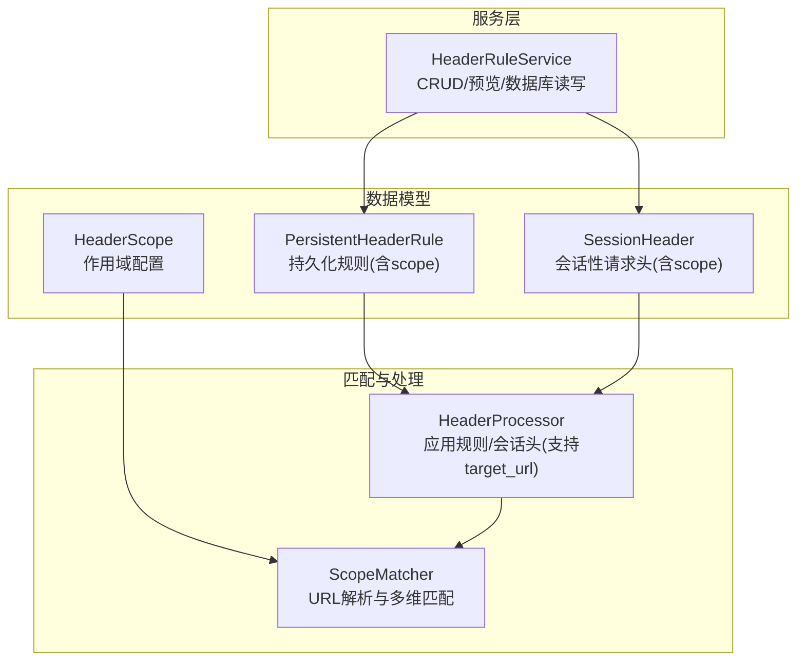
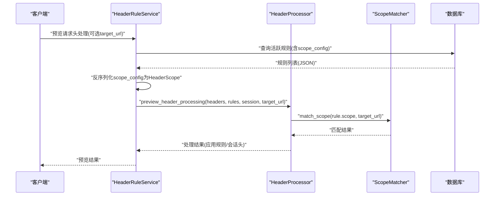
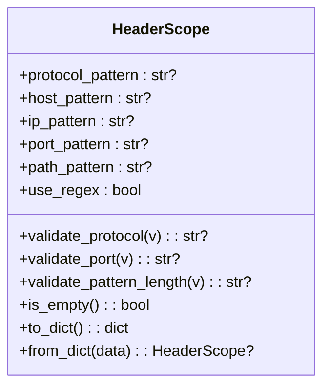
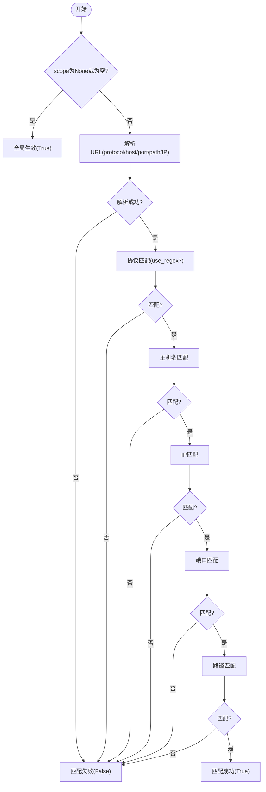
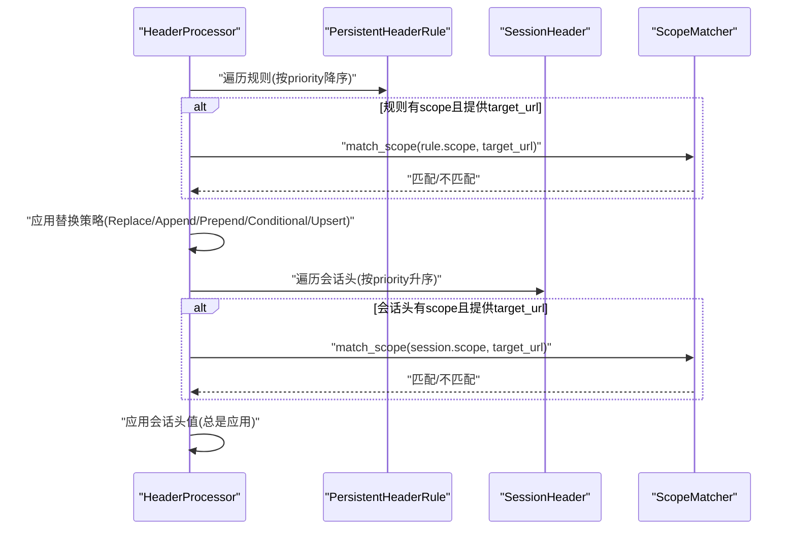
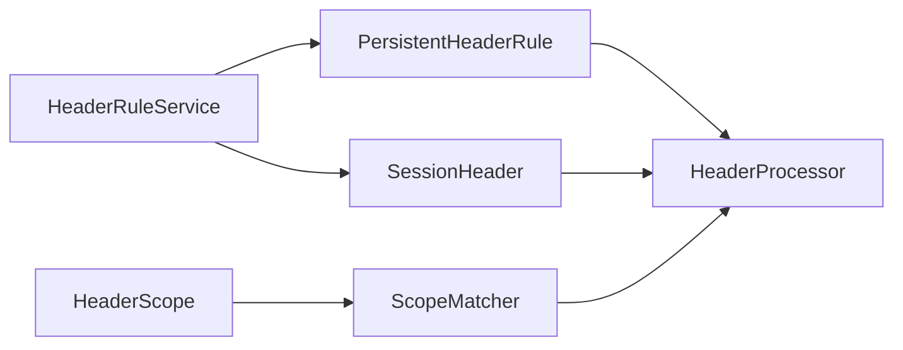

# 作用域配置模型

<cite>
**本文引用的文件**
- [HeaderScope.py](file://src/backEnd/model/HeaderScope.py)
- [scope_matcher.py](file://src/backEnd/utils/scope_matcher.py)
- [PersistentHeaderRule.py](file://src/backEnd/model/PersistentHeaderRule.py)
- [SessionHeader.py](file://src/backEnd/model/SessionHeader.py)
- [header_processor.py](file://src/backEnd/utils/header_processor.py)
- [headerRuleService.py](file://src/backEnd/service/headerRuleService.py)
- [test_scope_matcher.py](file://src/backEnd/tests/test_scope_matcher.py)
- [test_header_processor_scope.py](file://src/backEnd/tests/test_header_processor_scope.py)
- [SCOPE_FEATURE_SUMMARY.md](file://src/backEnd/doc/SCOPE_FEATURE_SUMMARY.md)
- [INTEGRATION_TEST_GUIDE.md](file://src/backEnd/tests/INTEGRATION_TEST_GUIDE.md)
</cite>

## 目录
1. [简介](#简介)
2. [项目结构](#项目结构)
3. [核心组件](#核心组件)
4. [架构总览](#架构总览)
5. [详细组件分析](#详细组件分析)
6. [依赖关系分析](#依赖关系分析)
7. [性能考量](#性能考量)
8. [故障排查指南](#故障排查指南)
9. [结论](#结论)
10. [附录](#附录)

## 简介
本文件系统化阐述作用域配置模型，围绕 HeaderScope 类的设计原理与匹配机制展开，解释其字段构成、正则表达式与通配符配置方式，并深入解析 scope_matcher.py 中实现的 URL 匹配算法。文档还提供典型配置示例、作用域与持久化规则的关联关系、多规则环境下的优先级处理逻辑，以及在复杂场景中的应用案例。

## 项目结构
作用域相关能力由以下模块协同实现：
- 数据模型层：HeaderScope（作用域配置）、PersistentHeaderRule（持久化规则，含 scope 字段）、SessionHeader（会话性请求头，含 scope 字段）
- 匹配器：ScopeMatcher（URL 解析与多维匹配）
- 处理器：HeaderProcessor（应用规则与会话头，支持 target_url 作用域匹配）
- 服务层：HeaderRuleService（规则 CRUD、预览、数据库读写，含 scope 的序列化/反序列化）
- 测试与文档：单元测试与集成测试文档，覆盖匹配逻辑、预览流程与数据库迁移

图表来源
- [HeaderScope.py](file://src/backEnd/model/HeaderScope.py#L1-L187)
- [scope_matcher.py](file://src/backEnd/utils/scope_matcher.py#L1-L346)
- [PersistentHeaderRule.py](file://src/backEnd/model/PersistentHeaderRule.py#L1-L104)
- [SessionHeader.py](file://src/backEnd/model/SessionHeader.py#L1-L97)
- [header_processor.py](file://src/backEnd/utils/header_processor.py#L1-L292)
- [headerRuleService.py](file://src/backEnd/service/headerRuleService.py#L1-L976)

章节来源
- [HeaderScope.py](file://src/backEnd/model/HeaderScope.py#L1-L187)
- [scope_matcher.py](file://src/backEnd/utils/scope_matcher.py#L1-L346)
- [PersistentHeaderRule.py](file://src/backEnd/model/PersistentHeaderRule.py#L1-L104)
- [SessionHeader.py](file://src/backEnd/model/SessionHeader.py#L1-L97)
- [header_processor.py](file://src/backEnd/utils/header_processor.py#L1-L292)
- [headerRuleService.py](file://src/backEnd/service/headerRuleService.py#L1-L976)

## 核心组件
- HeaderScope：定义作用域的字段与校验规则，支持协议、主机名、IP、端口、路径五维匹配，支持关键字与正则两种匹配模式。
- ScopeMatcher：实现 URL 解析与多维匹配，包含 URL 缓存与正则编译缓存，提供早期退出优化。
- PersistentHeaderRule：持久化规则模型，新增 scope 字段；支持 scope 的序列化/反序列化。
- SessionHeader：会话性请求头模型，新增 scope 字段；支持 scope 的序列化/反序列化。
- HeaderProcessor：应用持久化规则与会话性请求头，支持 target_url 作用域匹配；按优先级排序并应用替换策略。
- HeaderRuleService：规则 CRUD、预览、数据库读写；处理 scope 的序列化/反序列化与数据库迁移。

章节来源
- [HeaderScope.py](file://src/backEnd/model/HeaderScope.py#L1-L187)
- [scope_matcher.py](file://src/backEnd/utils/scope_matcher.py#L1-L346)
- [PersistentHeaderRule.py](file://src/backEnd/model/PersistentHeaderRule.py#L1-L104)
- [SessionHeader.py](file://src/backEnd/model/SessionHeader.py#L1-L97)
- [header_processor.py](file://src/backEnd/utils/header_processor.py#L1-L292)
- [headerRuleService.py](file://src/backEnd/service/headerRuleService.py#L1-L976)

## 架构总览
作用域匹配贯穿“模型—匹配—处理—服务—测试”链路，形成闭环：
- 模型层定义 HeaderScope 字段与校验；
- 匹配器对目标 URL 进行解析与多维匹配；
- 处理器在应用规则与会话头时结合 target_url 与作用域；
- 服务层负责规则生命周期管理与数据库交互；
- 测试覆盖匹配逻辑、预览流程与数据库迁移。

图表来源
- [headerRuleService.py](file://src/backEnd/service/headerRuleService.py#L584-L623)
- [header_processor.py](file://src/backEnd/utils/header_processor.py#L213-L292)
- [scope_matcher.py](file://src/backEnd/utils/scope_matcher.py#L35-L141)

## 详细组件分析

### HeaderScope 类设计与字段构成
- 字段与语义
  - protocol_pattern：协议匹配模式，支持 http/https 或逗号分隔多值；为空时表示不限制协议。
  - host_pattern：主机名匹配，支持通配符 *；可配合 use_regex 使用正则。
  - ip_pattern：IP 地址匹配，支持通配符 *；可配合 use_regex 使用正则。
  - port_pattern：端口匹配，支持逗号分隔多值；可包含通配符或正则。
  - path_pattern：路径匹配，支持通配符 *；可配合 use_regex 使用正则。
  - use_regex：是否使用正则表达式匹配，默认 False（使用关键字匹配）。
- 匹配逻辑
  - scope 为 None 或空配置时，表示全局生效（对所有扫描任务生效）。
  - 当 scope 存在时，仅当所有非空字段均匹配（AND 逻辑）才命中。
  - 空字段表示不限制该维度；若所有字段均为空，等同于全局生效。
  - 协议字段为空时，默认允许 http/https。
- 校验规则
  - 协议：若非正则模式，仅允许 http/https；若包含正则字符则跳过严格校验。
  - 端口：若包含正则字符则跳过严格校验；否则要求为 1-65535 的整数，支持逗号分隔多值。
  - 模式长度：host/ip/path_pattern 最大长度分别为 500/500/1000 字符。
  - is_empty：判断所有字段是否为空（忽略空白）。
  - to_dict/from_dict：序列化/反序列化，便于数据库存储与 API 传输。

图表来源
- [HeaderScope.py](file://src/backEnd/model/HeaderScope.py#L1-L187)

章节来源
- [HeaderScope.py](file://src/backEnd/model/HeaderScope.py#L1-L187)

### URL 匹配算法与 ScopeMatcher 实现
- 全局生效判定
  - scope 为 None 或 is_empty() 为真时，直接返回 True。
- URL 解析
  - 使用标准库解析 URL，提取 protocol/host/port/path。
  - 默认端口：http 为 80，https 为 443；若 URL 显式指定端口则使用显式值。
  - 尝试将主机名解析为 IP（失败时返回空字符串）。
  - 结果进行缓存，避免重复解析。
- 维度匹配
  - 依次检查 protocol/host/ip/port/path；任一维度不匹配即短路返回 False。
  - 支持两种匹配模式：
    - 关键字匹配（默认）：支持逗号分隔多值（OR 逻辑），支持通配符 * 转正则；不区分大小写精确匹配。
    - 正则匹配：对 pattern 进行编译缓存，限制缓存大小；捕获正则错误与异常并返回 False。
- 缓存与性能
  - URL 解析缓存与正则编译缓存，限制最大容量；达到阈值时清理一半。
  - clear_cache：清空两类缓存。

图表来源
- [scope_matcher.py](file://src/backEnd/utils/scope_matcher.py#L35-L141)
- [scope_matcher.py](file://src/backEnd/utils/scope_matcher.py#L143-L192)
- [scope_matcher.py](file://src/backEnd/utils/scope_matcher.py#L227-L339)

章节来源
- [scope_matcher.py](file://src/backEnd/utils/scope_matcher.py#L1-L346)

### 作用域与持久化规则的关联关系
- 数据模型扩展
  - PersistentHeaderRule 新增 scope 字段；支持 scope 的序列化/反序列化。
  - SessionHeader 新增 scope 字段；支持 scope 的序列化/反序列化。
- 数据库迁移
  - persistent_header_rules 表新增 scope_config 列（TEXT），支持动态迁移。
  - session_headers 表新增 scope_config 列（TEXT），支持动态迁移。
- 规则应用流程
  - HeaderProcessor.apply_persistent_rules：按优先级降序排序，逐条应用；若规则配置了 scope 且提供了 target_url，则通过 ScopeMatcher 判定是否应用。
  - HeaderProcessor.apply_session_headers：按优先级升序排序（优先级低的后执行以覆盖），逐条应用；同样支持作用域匹配。
- 服务层处理
  - HeaderRuleService.create/update：scope 字段序列化为 JSON 写入 scope_config。
  - HeaderRuleService.get_active_persistent_rules_for_processing：从数据库读取 scope_config 并反序列化为 HeaderScope。

图表来源
- [header_processor.py](file://src/backEnd/utils/header_processor.py#L90-L211)
- [PersistentHeaderRule.py](file://src/backEnd/model/PersistentHeaderRule.py#L1-L104)
- [SessionHeader.py](file://src/backEnd/model/SessionHeader.py#L1-L97)
- [scope_matcher.py](file://src/backEnd/utils/scope_matcher.py#L35-L141)

章节来源
- [PersistentHeaderRule.py](file://src/backEnd/model/PersistentHeaderRule.py#L1-L104)
- [SessionHeader.py](file://src/backEnd/model/SessionHeader.py#L1-L97)
- [header_processor.py](file://src/backEnd/utils/header_processor.py#L90-L211)
- [headerRuleService.py](file://src/backEnd/service/headerRuleService.py#L113-L139)
- [headerRuleService.py](file://src/backEnd/service/headerRuleService.py#L338-L426)
- [headerRuleService.py](file://src/backEnd/service/headerRuleService.py#L533-L579)

### 典型作用域配置示例
- 限定 HTTPS 协议
  - protocol_pattern: "https"
  - use_regex: false
- 限定特定域名
  - host_pattern: "*.example.com"
  - use_regex: false
- 限定特定端口
  - port_pattern: "443"
  - use_regex: false
- 限定特定 API 路径
  - path_pattern: "/v1/*"
  - use_regex: false
- 复合条件（AND 逻辑）
  - protocol_pattern: "https"
  - host_pattern: "api.production.com"
  - port_pattern: "443"
  - path_pattern: "/v1/*"
  - use_regex: false

章节来源
- [SCOPE_FEATURE_SUMMARY.md](file://src/backEnd/doc/SCOPE_FEATURE_SUMMARY.md#L104-L179)
- [test_scope_matcher.py](file://src/backEnd/tests/test_scope_matcher.py#L158-L196)

### 多规则环境下的优先级处理逻辑
- 持久化规则：按 priority 降序应用，优先级高的先执行。
- 会话性请求头：按 priority 升序应用，优先级低的后执行以覆盖高优先级。
- 作用域匹配：在应用前进行，未通过作用域匹配的规则/会话头会被跳过。
- 替换策略：Replace/Append/Prepend/Conditional/Upsert，均会写入最终请求头字典。

章节来源
- [header_processor.py](file://src/backEnd/utils/header_processor.py#L104-L151)
- [header_processor.py](file://src/backEnd/utils/header_processor.py#L177-L211)

### 复杂场景应用案例
- 全局规则（无 scope）对所有 URL 生效，即使未提供 target_url。
- 带作用域的规则仅在 target_url 通过匹配时应用。
- 预览功能支持 target_url，便于在不实际应用的情况下查看作用域匹配结果。
- 数据库迁移后，scope_config 列存储 JSON 字符串，服务层负责序列化/反序列化。

章节来源
- [test_header_processor_scope.py](file://src/backEnd/tests/test_header_processor_scope.py#L30-L159)
- [test_header_processor_scope.py](file://src/backEnd/tests/test_header_processor_scope.py#L160-L198)
- [test_header_processor_scope.py](file://src/backEnd/tests/test_header_processor_scope.py#L199-L317)
- [INTEGRATION_TEST_GUIDE.md](file://src/backEnd/tests/INTEGRATION_TEST_GUIDE.md#L1-L47)

## 依赖关系分析
- HeaderScope 作为 Pydantic 模型，提供字段校验与序列化能力。
- ScopeMatcher 依赖 HeaderScope 进行匹配，内部维护 URL 解析与正则编译缓存。
- HeaderProcessor 依赖 ScopeMatcher 进行作用域匹配，并调用替换策略。
- HeaderRuleService 依赖 PersistentHeaderRule/SessionHeader 的序列化/反序列化，负责数据库读写与迁移。
- 测试覆盖 ScopeMatcher 的多维匹配、边界情况与预览流程。

图表来源
- [HeaderScope.py](file://src/backEnd/model/HeaderScope.py#L1-L187)
- [scope_matcher.py](file://src/backEnd/utils/scope_matcher.py#L1-L346)
- [PersistentHeaderRule.py](file://src/backEnd/model/PersistentHeaderRule.py#L1-L104)
- [SessionHeader.py](file://src/backEnd/model/SessionHeader.py#L1-L97)
- [header_processor.py](file://src/backEnd/utils/header_processor.py#L1-L292)
- [headerRuleService.py](file://src/backEnd/service/headerRuleService.py#L1-L976)

章节来源
- [test_scope_matcher.py](file://src/backEnd/tests/test_scope_matcher.py#L1-L286)
- [test_header_processor_scope.py](file://src/backEnd/tests/test_header_processor_scope.py#L1-L317)

## 性能考量
- 缓存策略
  - URL 解析缓存：限制最大容量，达到阈值时清理一半，避免无限增长。
  - 正则编译缓存：限制最大容量，达到阈值时清理一半，减少重复编译开销。
- 早期退出
  - 匹配过程中任一维度不匹配立即返回，减少后续计算。
- 字符串处理
  - 通配符转正则采用 re.escape 与替换，避免正则注入风险。
- 端口默认值
  - 自动推断 http/https 默认端口，减少额外解析成本。

章节来源
- [scope_matcher.py](file://src/backEnd/utils/scope_matcher.py#L27-L34)
- [scope_matcher.py](file://src/backEnd/utils/scope_matcher.py#L143-L192)
- [scope_matcher.py](file://src/backEnd/utils/scope_matcher.py#L256-L339)

## 故障排查指南
- URL 解析失败
  - 现象：日志提示 URL 解析失败并视为匹配失败。
  - 排查：确认 URL 格式正确，必要时提供完整 scheme/host/port/path。
- 正则表达式错误
  - 现象：日志记录正则错误或异常，匹配返回 False。
  - 排查：检查 pattern 是否为有效正则；建议先用关键字匹配验证逻辑。
- DNS 解析失败
  - 现象：主机名无法解析为 IP，日志记录调试信息。
  - 排查：确认网络可达性；若需基于 IP 匹配，可直接配置 ip_pattern。
- 作用域不匹配
  - 现象：规则/会话头未应用。
  - 排查：确认 scope 的各维度配置与 target_url 是否一致；检查 use_regex 与通配符使用。
- 数据库迁移问题
  - 现象：scope_config 列缺失或反序列化失败。
  - 排查：确认数据库迁移完成；检查 scope_config 是否为合法 JSON；服务层会记录警告并回退为全局生效。

章节来源
- [scope_matcher.py](file://src/backEnd/utils/scope_matcher.py#L61-L66)
- [scope_matcher.py](file://src/backEnd/utils/scope_matcher.py#L287-L293)
- [scope_matcher.py](file://src/backEnd/utils/scope_matcher.py#L210-L215)
- [PersistentHeaderRule.py](file://src/backEnd/model/PersistentHeaderRule.py#L45-L58)
- [headerRuleService.py](file://src/backEnd/service/headerRuleService.py#L213-L227)

## 结论
HeaderScope 与 ScopeMatcher 构成了灵活而高效的多维作用域匹配体系，支持关键字与正则两种模式、通配符简化配置，并通过缓存与早期退出保障性能。结合 HeaderProcessor 的优先级与替换策略，以及 HeaderRuleService 的数据库迁移与序列化/反序列化，实现了从模型到运行时的完整闭环。测试覆盖全面，确保在复杂场景下的稳定性与可维护性。

## 附录
- 单元测试与集成测试参考
  - ScopeMatcher 匹配测试：覆盖协议/主机名/端口/路径、通配符与正则、默认端口、边界情况。
  - HeaderProcessor 作用域测试：覆盖全局规则、带作用域规则、会话头作用域、预览功能。
  - 集成测试指南：涵盖数据库迁移、API 参数支持与序列化/反序列化验证。

章节来源
- [test_scope_matcher.py](file://src/backEnd/tests/test_scope_matcher.py#L1-L286)
- [test_header_processor_scope.py](file://src/backEnd/tests/test_header_processor_scope.py#L1-L317)
- [INTEGRATION_TEST_GUIDE.md](file://src/backEnd/tests/INTEGRATION_TEST_GUIDE.md#L1-L47)