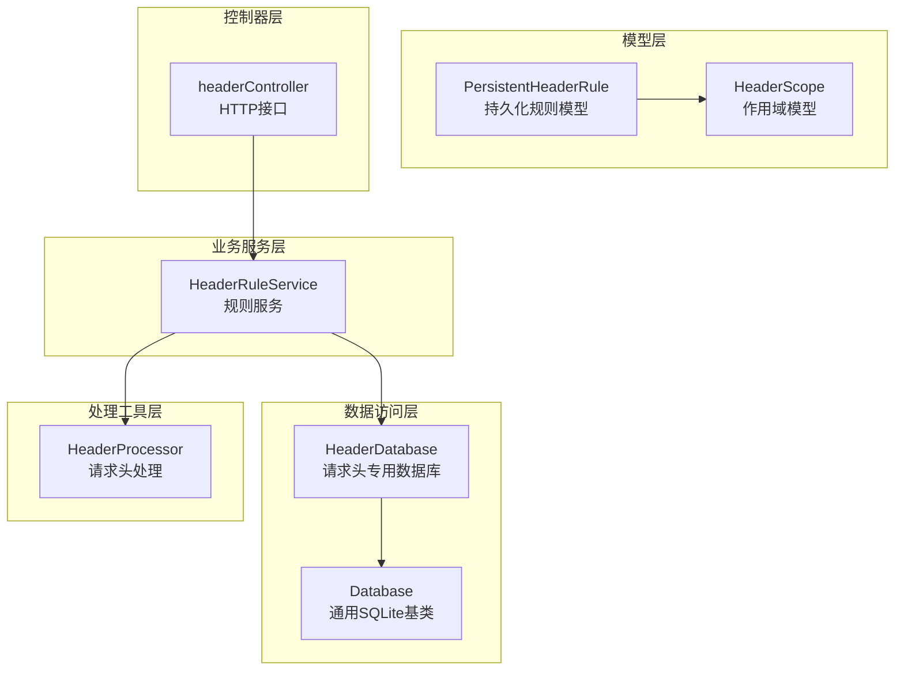
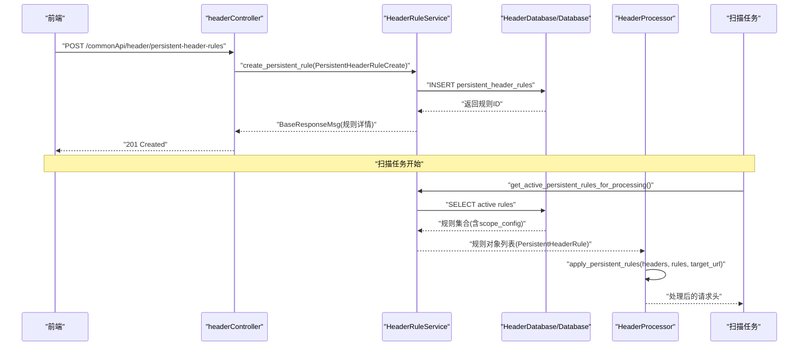
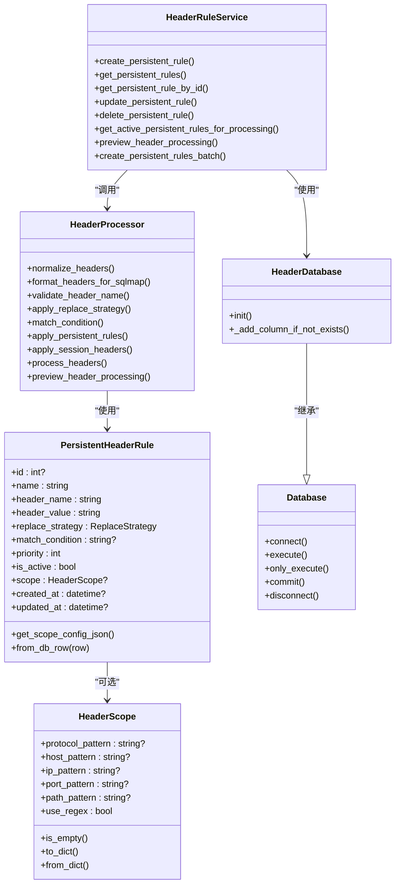

# 持久化规则模型

<cite>
**本文引用的文件**
- [PersistentHeaderRule.py](file://src/backEnd/model/PersistentHeaderRule.py)
- [HeaderDatabase.py](file://src/backEnd/model/HeaderDatabase.py)
- [HeaderScope.py](file://src/backEnd/model/HeaderScope.py)
- [headerRuleService.py](file://src/backEnd/service/headerRuleService.py)
- [headerController.py](file://src/backEnd/api/commonApi/headerController.py)
- [header_processor.py](file://src/backEnd/utils/header_processor.py)
- [Database.py](file://src/backEnd/model/Database.py)
</cite>

## 目录
1. [简介](#简介)
2. [项目结构](#项目结构)
3. [核心组件](#核心组件)
4. [架构总览](#架构总览)
5. [详细组件分析](#详细组件分析)
6. [依赖关系分析](#依赖关系分析)
7. [性能考量](#性能考量)
8. [故障排查指南](#故障排查指南)
9. [结论](#结论)
10. [附录](#附录)

## 简介
本文件围绕“持久化请求头规则”模型进行系统化文档化，重点解析 PersistentHeaderRule 类的设计与实现，涵盖字段定义、数据类型、唯一性约束、数据验证机制；阐述 HeaderDatabase 类如何管理持久化规则的 CRUD 与批量导入导出；解释规则与作用域模型 HeaderScope 的关联关系及在扫描任务中的应用方式；并提供 JSON Schema 定义与实际代码示例路径，帮助读者快速理解与使用。

## 项目结构
与“持久化请求头规则”直接相关的后端代码主要分布在以下模块：
- 数据模型层：PersistentHeaderRule、HeaderScope
- 数据访问层：HeaderDatabase、Database
- 业务服务层：headerRuleService
- 控制器层：headerController
- 处理工具层：header_processor

图表来源
- [PersistentHeaderRule.py](file://src/backEnd/model/PersistentHeaderRule.py#L1-L104)
- [HeaderScope.py](file://src/backEnd/model/HeaderScope.py#L1-L187)
- [HeaderDatabase.py](file://src/backEnd/model/HeaderDatabase.py#L1-L126)
- [Database.py](file://src/backEnd/model/Database.py#L1-L99)
- [headerRuleService.py](file://src/backEnd/service/headerRuleService.py#L1-L976)
- [headerController.py](file://src/backEnd/api/commonApi/headerController.py#L1-L481)
- [header_processor.py](file://src/backEnd/utils/header_processor.py#L1-L292)

章节来源
- [PersistentHeaderRule.py](file://src/backEnd/model/PersistentHeaderRule.py#L1-L104)
- [HeaderDatabase.py](file://src/backEnd/model/HeaderDatabase.py#L1-L126)
- [Database.py](file://src/backEnd/model/Database.py#L1-L99)
- [headerRuleService.py](file://src/backEnd/service/headerRuleService.py#L1-L976)
- [headerController.py](file://src/backEnd/api/commonApi/headerController.py#L1-L481)
- [header_processor.py](file://src/backEnd/utils/header_processor.py#L1-L292)

## 核心组件
- PersistentHeaderRule：定义持久化规则的数据结构、字段校验、序列化/反序列化（含作用域字段）。
- HeaderScope：定义作用域模型，支持协议、主机、IP、端口、路径等多维匹配，支持正则或关键字匹配。
- HeaderDatabase：负责持久化规则表的初始化、列迁移、索引创建与CRUD访问。
- HeaderRuleService：封装规则的创建、查询、更新、删除、预览、批量导入等业务逻辑。
- HeaderProcessor：在扫描任务中应用规则与会话头，支持作用域匹配与替换策略。
- headerController：FastAPI路由层，暴露REST接口，对接服务层。

章节来源
- [PersistentHeaderRule.py](file://src/backEnd/model/PersistentHeaderRule.py#L1-L104)
- [HeaderScope.py](file://src/backEnd/model/HeaderScope.py#L1-L187)
- [HeaderDatabase.py](file://src/backEnd/model/HeaderDatabase.py#L1-L126)
- [headerRuleService.py](file://src/backEnd/service/headerRuleService.py#L1-L976)
- [header_processor.py](file://src/backEnd/utils/header_processor.py#L1-L292)
- [headerController.py](file://src/backEnd/api/commonApi/headerController.py#L1-L481)

## 架构总览
持久化规则从“前端提交”到“扫描任务应用”的整体流程如下：

图表来源
- [headerController.py](file://src/backEnd/api/commonApi/headerController.py#L68-L133)
- [headerRuleService.py](file://src/backEnd/service/headerRuleService.py#L74-L176)
- [HeaderDatabase.py](file://src/backEnd/model/HeaderDatabase.py#L26-L102)
- [header_processor.py](file://src/backEnd/utils/header_processor.py#L90-L152)

## 详细组件分析

### PersistentHeaderRule 类设计与字段定义
- 字段与类型
  - id: 可选整数（主键，自增）
  - name: 必填字符串（1-100字符）
  - header_name: 必填字符串（1-200字符）
  - header_value: 必填字符串（1-1000字符）
  - replace_strategy: 枚举，支持 REPLACE/APPEND/PREPEND/CONDITIONAL/UPSERT
  - match_condition: 可选字符串（最大500字符），用于值匹配条件（正则）
  - priority: 整数（0-100），数值越高优先级越高
  - is_active: 布尔，是否启用
  - scope: 可选 HeaderScope 对象（作用域配置）
  - created_at/updated_at: 可选日期时间
- 关键方法
  - get_scope_config_json(): 将 scope 对象序列化为 JSON 字符串，便于数据库存储
  - from_db_row(row): 从数据库行构造对象，自动反序列化 scope_config 字段
- JSON 序列化
  - datetime 使用统一格式化输出
  - 响应模型 PersistentHeaderRuleResponse 中 scope 以字典形式返回

章节来源
- [PersistentHeaderRule.py](file://src/backEnd/model/PersistentHeaderRule.py#L1-L104)

### HeaderScope 作用域模型
- 字段
  - protocol_pattern: 协议匹配（http/https），可逗号分隔；为空表示不限制或默认 http/https
  - host_pattern: 主机名匹配，支持通配符
  - ip_pattern: IP 匹配，支持通配符
  - port_pattern: 端口匹配，支持逗号分隔或通配符
  - path_pattern: 路径匹配，支持通配符
  - use_regex: 是否使用正则表达式匹配
- 校验规则
  - 协议：若非正则，仅允许 http/https
  - 端口：若非正则，需在1-65535范围内；可能包含通配符
  - 模式长度：host/ip 最大500字符，path 最大1000字符
- 辅助方法
  - is_empty(): 判断作用域是否为空（所有字段为空），为空等同全局生效
  - to_dict()/from_dict(): 与字典互转，便于序列化/反序列化
- 作用域匹配
  - 作用域为可选；为空或未提供时，规则对所有扫描任务全局生效
  - 当 scope 存在时，各非空字段需同时匹配（AND 逻辑）
  - 若 scope 内部所有字段均为空，等同全局生效

章节来源
- [HeaderScope.py](file://src/backEnd/model/HeaderScope.py#L1-L187)

### HeaderDatabase 数据库层
- 初始化
  - 创建 persistent_header_rules 表，包含 name（唯一）、header_name、header_value、replace_strategy、match_condition、priority、is_active、scope_config、created_at、updated_at
  - 创建 session_headers 表，包含 client_ip、header_name、header_value、replace_strategy、priority、is_active、scope_config、expires_at、created_at、updated_at，并建立唯一索引 (client_ip, header_name)
  - 自动迁移：为已存在的表添加 scope_config 列，以及必要的历史字段（如 replace_strategy、is_active、updated_at）
- 索引
  - 为规则表创建索引：is_active、priority、header_name，提升查询性能
- 访问模式
  - 使用 Database 基类提供的线程安全执行方法，自动处理锁与超时

章节来源
- [HeaderDatabase.py](file://src/backEnd/model/HeaderDatabase.py#L1-L126)
- [Database.py](file://src/backEnd/model/Database.py#L1-L99)

### HeaderRuleService 业务服务层
- 数据验证
  - _validate_rule_data(): 校验 name、header_name、header_value 非空与格式
- CRUD
  - create_persistent_rule(): 唯一性约束（按 name 唯一），序列化 scope，插入数据库，返回响应
  - get_persistent_rules(): 支持 active_only 查询，解析 scope_config，返回列表与总数
  - get_persistent_rule_by_id(): 按 ID 查询，解析 scope_config
  - update_persistent_rule(): 支持逐字段更新，检查 name 唯一性冲突，更新 updated_at
  - delete_persistent_rule(): 按 ID 删除
- 处理与预览
  - get_active_persistent_rules_for_processing(): 读取活跃规则并使用 PersistentHeaderRule.from_db_row 构造对象（自动反序列化 scope）
  - preview_header_processing(): 预览处理结果，支持 target_url 作用域匹配
- 批量导入
  - parse_headers_batch(): 解析原始文本为请求头列表
  - create_persistent_rules_batch(): 批量创建持久化规则，自动去重命名，逐条校验并入库
- 错误处理
  - 统一返回 BaseResponseMsg，包含 success、msg、data、code

章节来源
- [headerRuleService.py](file://src/backEnd/service/headerRuleService.py#L1-L976)

### HeaderProcessor 扫描任务应用
- 核心流程
  - normalize_headers()/format_headers_for_sqlmap(): 请求头列表与字典互转
  - validate_header_name(): 校验请求头名称合法性
  - apply_replace_strategy(): 根据策略（REPLACE/APPEND/PREPEND/CONDITIONAL/UPSERT）合并值
  - match_condition(): 基于正则的值匹配
  - apply_persistent_rules(): 按优先级排序，结合 scope 与 match_condition 应用规则
  - apply_session_headers(): 应用会话性请求头（过滤过期、按优先级覆盖）
  - process_headers(): 完整处理流程，返回最终请求头列表与应用描述
  - preview_header_processing(): 预览不实际应用
- 与扫描任务集成
  - 在扫描任务开始前，从服务层获取活跃规则与会话头，传入 target_url 进行作用域匹配，得到最终请求头集合

章节来源
- [header_processor.py](file://src/backEnd/utils/header_processor.py#L1-L292)

### API 控制器层
- 暴露端点
  - POST /commonApi/header/persistent-header-rules：创建规则（支持 scope）
  - GET /commonApi/header/persistent-header-rules：获取规则列表（active_only）
  - GET /commonApi/header/persistent-header-rules/{rule_id}：按ID获取
  - PUT /commonApi/header/persistent-header-rules/{rule_id}：更新规则（支持 scope）
  - DELETE /commonApi/header/persistent-header-rules/{rule_id}：删除规则
  - POST /commonApi/header/header-processing/preview：预览处理（支持 target_url）
  - POST /commonApi/header/persistent-header-rules/batch：批量创建规则
  - GET /commonApi/header/header-management/stats：统计信息
- 参数与响应
  - 请求体使用 Pydantic 模型（PersistentHeaderRuleCreate/Update 等）
  - 响应统一 BaseResponseMsg

章节来源
- [headerController.py](file://src/backEnd/api/commonApi/headerController.py#L1-L481)

## 依赖关系分析
- 模型依赖
  - PersistentHeaderRule 依赖 HeaderScope（可选）
  - HeaderScope 依赖 Pydantic 校验器与字段长度限制
- 数据访问依赖
  - HeaderDatabase 继承 Database，复用 SQLite 基类的并发控制与执行方法
- 服务层依赖
  - HeaderRuleService 依赖 HeaderDatabase、Pydantic 模型、HeaderProcessor
- 控制器依赖
  - headerController 依赖 HeaderRuleService 与 Pydantic 模型
- 处理工具依赖
  - HeaderProcessor 依赖 PersistentHeaderRule、SessionHeader、ScopeMatcher

图表来源
- [PersistentHeaderRule.py](file://src/backEnd/model/PersistentHeaderRule.py#L1-L104)
- [HeaderScope.py](file://src/backEnd/model/HeaderScope.py#L1-L187)
- [HeaderDatabase.py](file://src/backEnd/model/HeaderDatabase.py#L1-L126)
- [Database.py](file://src/backEnd/model/Database.py#L1-L99)
- [headerRuleService.py](file://src/backEnd/service/headerRuleService.py#L1-L976)
- [header_processor.py](file://src/backEnd/utils/header_processor.py#L1-L292)

## 性能考量
- 数据库层面
  - 为规则表创建索引：is_active、priority、header_name，有助于活跃规则查询与排序
  - 使用线程安全的 Database 基类，自动处理锁与超时，降低并发写入冲突
- 业务层面
  - 规则按 priority 降序处理，优先级高的先应用，减少后续覆盖成本
  - 作用域匹配采用早期退出策略（任一维度不匹配立即返回），降低正则匹配开销
- 处理层面
  - 预览接口不实际应用规则，便于调试与确认影响范围

[本节为通用性能建议，无需列出具体文件来源]

## 故障排查指南
- 规则创建失败
  - 检查唯一性约束：name 是否重复
  - 校验 header_name 格式是否合法
  - 查看服务层日志与返回的 BaseResponseMsg
- 规则查询异常
  - 确认数据库连接可用
  - 检查 scope_config JSON 是否可解析，必要时清理损坏数据
- 规则更新冲突
  - 更新时检查 name 是否被其他规则占用
- 作用域不生效
  - 确认 target_url 是否传入，作用域匹配逻辑依赖该参数
  - 检查 HeaderScope 的字段是否为空（为空即全局生效）

章节来源
- [headerRuleService.py](file://src/backEnd/service/headerRuleService.py#L74-L176)
- [headerRuleService.py](file://src/backEnd/service/headerRuleService.py#L338-L480)
- [header_processor.py](file://src/backEnd/utils/header_processor.py#L90-L152)

## 结论
PersistentHeaderRule 通过 Pydantic 模型与 HeaderScope 的组合，实现了灵活、可验证、可序列化的持久化规则定义；HeaderDatabase 与 HeaderRuleService 提供完善的 CRUD 与批量导入能力；HeaderProcessor 将规则无缝集成到扫描任务中，支持作用域匹配与多种替换策略。整体架构清晰、职责分离明确，具备良好的扩展性与可维护性。

[本节为总结性内容，无需列出具体文件来源]

## 附录

### JSON Schema 定义（基于模型）
以下为持久化规则的 JSON Schema 定义，来源于 Pydantic 模型字段与校验规则：
- id: integer（可选）
- name: string（必填，长度1-100）
- header_name: string（必填，长度1-200）
- header_value: string（必填，长度1-1000）
- replace_strategy: string（枚举："REPLACE"/"APPEND"/"PREPEND"/"CONDITIONAL"/"UPSERT"）
- match_condition: string（可选，长度<=500）
- priority: integer（0-100）
- is_active: boolean
- scope: object（可选），包含：
  - protocol_pattern: string（可选，长度<=500）
  - host_pattern: string（可选，长度<=500）
  - ip_pattern: string（可选，长度<=500）
  - port_pattern: string（可选，长度<=500）
  - path_pattern: string（可选，长度<=1000）
  - use_regex: boolean
- created_at/updated_at: string（日期时间格式）

章节来源
- [PersistentHeaderRule.py](file://src/backEnd/model/PersistentHeaderRule.py#L1-L104)
- [HeaderScope.py](file://src/backEnd/model/HeaderScope.py#L1-L187)

### 规则唯一性约束与数据验证机制
- 唯一性约束
  - 数据库层：persistent_header_rules.name 唯一
  - 服务层：创建/更新时显式检查 name 是否冲突
- 数据验证
  - Pydantic 字段校验：长度、范围、必填
  - HeaderProcessor.validate_header_name：请求头名称合法性
  - HeaderScope 校验：协议、端口、模式长度与正则开关

章节来源
- [HeaderDatabase.py](file://src/backEnd/model/HeaderDatabase.py#L26-L50)
- [headerRuleService.py](file://src/backEnd/service/headerRuleService.py#L61-L73)
- [header_processor.py](file://src/backEnd/utils/header_processor.py#L49-L57)
- [HeaderScope.py](file://src/backEnd/model/HeaderScope.py#L59-L114)

### 实际代码示例（示例路径）
- 创建规则
  - 控制器入口：[POST /commonApi/header/persistent-header-rules](file://src/backEnd/api/commonApi/headerController.py#L68-L80)
  - 服务实现：[create_persistent_rule](file://src/backEnd/service/headerRuleService.py#L74-L176)
- 查询规则
  - 控制器入口：[GET /commonApi/header/persistent-header-rules](file://src/backEnd/api/commonApi/headerController.py#L82-L93)
  - 服务实现：[get_persistent_rules](file://src/backEnd/service/headerRuleService.py#L177-L261)
- 更新规则
  - 控制器入口：[PUT /commonApi/header/persistent-header-rules/{rule_id}](file://src/backEnd/api/commonApi/headerController.py#L108-L121)
  - 服务实现：[update_persistent_rule](file://src/backEnd/service/headerRuleService.py#L338-L480)
- 删除规则
  - 控制器入口：[DELETE /commonApi/header/persistent-header-rules/{rule_id}](file://src/backEnd/api/commonApi/headerController.py#L122-L133)
  - 服务实现：[delete_persistent_rule](file://src/backEnd/service/headerRuleService.py#L481-L531)
- 预览处理
  - 控制器入口：[POST /commonApi/header/header-processing/preview](file://src/backEnd/api/commonApi/headerController.py#L354-L383)
  - 服务实现：[preview_header_processing](file://src/backEnd/service/headerRuleService.py#L584-L624)
  - 处理实现：[process_headers](file://src/backEnd/utils/header_processor.py#L214-L258)
- 批量导入
  - 控制器入口：[POST /commonApi/header/persistent-header-rules/batch](file://src/backEnd/api/commonApi/headerController.py#L441-L452)
  - 服务实现：[create_persistent_rules_batch](file://src/backEnd/service/headerRuleService.py#L678-L800)

### 规则与作用域模型的关联关系
- HeaderScope 作为 PersistentHeaderRule 的可选字段，决定规则的应用范围
- 作用域为空时，规则对所有扫描任务全局生效
- 作用域存在时，规则仅在 target_url 匹配时应用
- HeaderProcessor 在应用规则时，结合 HeaderScope 与 match_condition 进行匹配与合并

章节来源
- [PersistentHeaderRule.py](file://src/backEnd/model/PersistentHeaderRule.py#L1-L104)
- [HeaderScope.py](file://src/backEnd/model/HeaderScope.py#L1-L187)
- [header_processor.py](file://src/backEnd/utils/header_processor.py#L90-L152)

### 在扫描任务中的应用方式
- 扫描开始前，服务层读取活跃规则并反序列化 scope
- 处理器按优先级应用规则，支持作用域匹配与替换策略
- 预览接口可用于调试，确认规则对请求头的影响

章节来源
- [headerRuleService.py](file://src/backEnd/service/headerRuleService.py#L533-L583)
- [header_processor.py](file://src/backEnd/utils/header_processor.py#L90-L152)