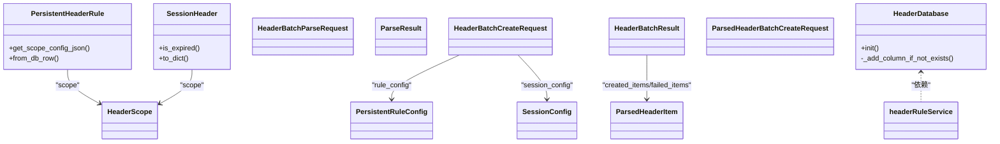

# 请求头规则模型

<cite>
**本文引用的文件**
- [HeaderScope.py](file://src/backEnd/model/HeaderScope.py)
- [PersistentHeaderRule.py](file://src/backEnd/model/PersistentHeaderRule.py)
- [SessionHeader.py](file://src/backEnd/model/SessionHeader.py)
- [HeaderBatch.py](file://src/backEnd/model/HeaderBatch.py)
- [HeaderDatabase.py](file://src/backEnd/model/HeaderDatabase.py)
- [headerRuleService.py](file://src/backEnd/service/headerRuleService.py)
- [headerController.py](file://src/backEnd/api/commonApi/headerController.py)
- [header_processor.py](file://src/backEnd/utils/header_processor.py)
- [scope_matcher.py](file://src/backEnd/utils/scope_matcher.py)
- [session_header_manager.py](file://src/backEnd/utils/session_header_manager.py)
</cite>

## 目录
1. [简介](#简介)
2. [项目结构](#项目结构)
3. [核心组件](#核心组件)
4. [架构总览](#架构总览)
5. [详细组件分析](#详细组件分析)
6. [依赖关系分析](#依赖关系分析)
7. [性能考量](#性能考量)
8. [故障排查指南](#故障排查指南)
9. [结论](#结论)
10. [附录](#附录)

## 简介
本文件系统化阐述请求头规则模型的设计与协作关系，围绕以下五个模型展开：
- HeaderScope：定义请求头作用域的匹配规则，支持协议、主机名、IP、端口、路径等维度，以及关键字与正则两种匹配模式。
- PersistentHeaderRule：持久化请求头注入规则，包含规则名称、请求头名称与值、替换策略、匹配条件、优先级、启用状态及可选作用域。
- SessionHeader：会话级临时请求头，具备过期时间、替换策略、优先级、来源IP、可选作用域等属性，用于短期注入。
- HeaderBatch：批量解析与创建请求头的模型，支持多种输入格式提示与默认配置，统一输出解析结果与批量创建结果。
- HeaderDatabase：独立的请求头管理数据库，维护持久化规则与会话头的表结构与迁移逻辑。

文档还通过UML类图展示模型间的关联关系，并提供JSON示例说明规则导入导出的数据格式。

## 项目结构
后端采用“模型-服务-工具-API”分层组织，核心模型位于model目录，服务层封装业务逻辑，工具层提供作用域匹配、请求头处理等能力，API层暴露REST接口。

图表来源
- [headerController.py](file://src/backEnd/api/commonApi/headerController.py#L1-L120)
- [headerRuleService.py](file://src/backEnd/service/headerRuleService.py#L1-L120)
- [header_processor.py](file://src/backEnd/utils/header_processor.py#L1-L120)
- [scope_matcher.py](file://src/backEnd/utils/scope_matcher.py#L1-L120)
- [session_header_manager.py](file://src/backEnd/utils/session_header_manager.py#L1-L120)
- [HeaderScope.py](file://src/backEnd/model/HeaderScope.py#L1-L60)
- [PersistentHeaderRule.py](file://src/backEnd/model/PersistentHeaderRule.py#L1-L60)
- [SessionHeader.py](file://src/backEnd/model/SessionHeader.py#L1-L60)
- [HeaderBatch.py](file://src/backEnd/model/HeaderBatch.py#L1-L60)
- [HeaderDatabase.py](file://src/backEnd/model/HeaderDatabase.py#L1-L60)

章节来源
- [headerController.py](file://src/backEnd/api/commonApi/headerController.py#L1-L120)
- [headerRuleService.py](file://src/backEnd/service/headerRuleService.py#L1-L120)

## 核心组件
- HeaderScope：定义作用域配置，支持多维度匹配与正则/关键字两种模式；提供空作用域判定与序列化/反序列化辅助方法。
- PersistentHeaderRule：持久化规则模型，包含规则元数据、替换策略、匹配条件、优先级、启用状态与可选作用域；提供scope序列化与数据库行反序列化。
- SessionHeader：会话级请求头模型，包含过期时间、替换策略、优先级、来源IP与可选作用域；提供过期检查与字典序列化。
- HeaderBatch：批量解析与创建模型，支持格式提示、默认优先级与TTL、目标类型（持久化/会话）、解析结果与批量创建结果。
- HeaderDatabase：独立数据库，维护持久化规则与会话头表，支持列迁移与索引优化。

章节来源
- [HeaderScope.py](file://src/backEnd/model/HeaderScope.py#L1-L187)
- [PersistentHeaderRule.py](file://src/backEnd/model/PersistentHeaderRule.py#L1-L104)
- [SessionHeader.py](file://src/backEnd/model/SessionHeader.py#L1-L97)
- [HeaderBatch.py](file://src/backEnd/model/HeaderBatch.py#L1-L86)
- [HeaderDatabase.py](file://src/backEnd/model/HeaderDatabase.py#L1-L126)

## 架构总览
整体流程：API接收请求，服务层调用工具层完成作用域匹配与请求头处理，最终持久化到数据库或内存管理器。

图表来源
- [headerController.py](file://src/backEnd/api/commonApi/headerController.py#L355-L383)
- [headerRuleService.py](file://src/backEnd/service/headerRuleService.py#L584-L623)
- [header_processor.py](file://src/backEnd/utils/header_processor.py#L214-L292)
- [scope_matcher.py](file://src/backEnd/utils/scope_matcher.py#L35-L141)
- [session_header_manager.py](file://src/backEnd/utils/session_header_manager.py#L151-L171)

## 详细组件分析

### HeaderScope：作用域匹配模型
- 设计要点
  - 多维度匹配：协议、主机名、IP、端口、路径；支持关键字匹配与正则表达式匹配。
  - 全局生效：scope为None或全部字段为空时，表示全局生效。
  - 验证与约束：协议仅允许http/https；端口支持逗号分隔与通配符；模式字符串长度限制。
  - 序列化：提供to_dict/from_dict，便于数据库存储与API传输。
- 关键方法
  - is_empty：判断是否为空作用域（全局生效）。
  - to_dict/from_dict：JSON序列化/反序列化辅助。
  - 字段校验：协议、端口、模式长度等。
- 匹配逻辑
  - 任一维度配置存在时才参与匹配；所有配置维度需同时满足（AND逻辑）。
  - 支持关键字与正则两种模式，正则模式下对模式进行编译缓存与超时保护。

图表来源
- [HeaderScope.py](file://src/backEnd/model/HeaderScope.py#L14-L187)

章节来源
- [HeaderScope.py](file://src/backEnd/model/HeaderScope.py#L14-L187)

### PersistentHeaderRule：持久化请求头规则
- 设计要点
  - 规则元数据：名称、请求头名称与值、替换策略、匹配条件、优先级、启用状态。
  - 作用域：可选，若提供则与HeaderScope一致。
  - 数据库交互：提供get_scope_config_json用于序列化scope；from_db_row用于从数据库行反序列化scope。
  - 模型变体：Create/Update/Response三类请求/响应模型，便于API层使用。
- 关键方法
  - get_scope_config_json：将scope转为JSON字符串存储。
  - from_db_row：从数据库行构造对象，处理scope_config反序列化。

图表来源
- [PersistentHeaderRule.py](file://src/backEnd/model/PersistentHeaderRule.py#L19-L104)
- [HeaderScope.py](file://src/backEnd/model/HeaderScope.py#L14-L187)

章节来源
- [PersistentHeaderRule.py](file://src/backEnd/model/PersistentHeaderRule.py#L19-L104)

### SessionHeader：会话级临时请求头
- 设计要点
  - 生命周期：带过期时间，过期即失效；提供is_expired检查。
  - 替换策略：与持久化规则一致，支持REPLACE/APPEND/PREPEND/CONDITIONAL/UPSERT。
  - 作用域：可选，支持关键字/正则匹配。
  - 序列化：to_dict输出包含scope（字典或None）。
- 关键方法
  - is_expired：检查是否过期。
  - to_dict：序列化为字典，包含时间戳与scope。

图表来源
- [SessionHeader.py](file://src/backEnd/model/SessionHeader.py#L19-L97)
- [HeaderScope.py](file://src/backEnd/model/HeaderScope.py#L14-L187)

章节来源
- [SessionHeader.py](file://src/backEnd/model/SessionHeader.py#L19-L97)

### HeaderBatch：批量操作模型
- 设计要点
  - 解析：支持自动识别、HTTP报文、键值对、JSON、cURL等格式提示，提供默认优先级与TTL。
  - 创建：目标类型可选择持久化规则或会话头；支持持久化/会话配置的默认值。
  - 结果：统一返回成功/失败计数、创建项与警告信息。
- 关键模型
  - HeaderBatchParseRequest：原始文本、格式提示、默认优先级、默认TTL。
  - ParsedHeaderItem：解析后的单项（名称、值、优先级、源行号）。
  - ParseResult：解析结果（成功标志、解析项、总数、错误与警告）。
  - HeaderBatchCreateRequest：批量创建请求（原始文本、目标类型、格式提示、规则/会话配置）。
  - HeaderBatchResult：批量操作结果（成功/失败计数、创建项、失败项、警告）。
  - ParsedHeaderBatchCreateRequest：基于解析结果的批量创建请求。

图表来源
- [HeaderBatch.py](file://src/backEnd/model/HeaderBatch.py#L1-L86)

章节来源
- [HeaderBatch.py](file://src/backEnd/model/HeaderBatch.py#L1-L86)

### HeaderDatabase：请求头管理数据库
- 设计要点
  - 独立数据库文件：默认在项目根目录创建headers.db。
  - 表结构：persistent_header_rules与session_headers，均支持scope_config列。
  - 迁移：自动检查并添加缺失列（如scope_config、replace_strategy、is_active、updated_at等）。
  - 索引：为活跃状态、优先级、名称、客户端IP、过期时间建立索引，提升查询性能。
- 关键方法
  - init：初始化表结构与索引。
  - _add_column_if_not_exists：按需添加列并记录日志。

图表来源
- [HeaderDatabase.py](file://src/backEnd/model/HeaderDatabase.py#L1-L126)

章节来源
- [HeaderDatabase.py](file://src/backEnd/model/HeaderDatabase.py#L1-L126)

## 依赖关系分析
- 模型间依赖
  - PersistentHeaderRule与SessionHeader均依赖HeaderScope作为作用域配置。
  - HeaderBatch依赖PersistentHeaderRule与SessionHeader作为创建目标。
- 服务层依赖
  - headerRuleService依赖HeaderDatabase、HeaderProcessor、ScopeMatcher、SessionHeaderManager。
- 工具层依赖
  - header_processor依赖ScopeMatcher进行作用域匹配。
  - session_header_manager负责内存与数据库的同步持久化。
- API层依赖
  - headerController提供规则与会话头的增删改查、批量解析与预览接口。

图表来源
- [PersistentHeaderRule.py](file://src/backEnd/model/PersistentHeaderRule.py#L19-L104)
- [SessionHeader.py](file://src/backEnd/model/SessionHeader.py#L19-L97)
- [HeaderScope.py](file://src/backEnd/model/HeaderScope.py#L14-L187)
- [HeaderBatch.py](file://src/backEnd/model/HeaderBatch.py#L1-L86)
- [headerRuleService.py](file://src/backEnd/service/headerRuleService.py#L1-L120)
- [header_processor.py](file://src/backEnd/utils/header_processor.py#L1-L120)
- [scope_matcher.py](file://src/backEnd/utils/scope_matcher.py#L1-L120)
- [session_header_manager.py](file://src/backEnd/utils/session_header_manager.py#L1-L120)
- [headerController.py](file://src/backEnd/api/commonApi/headerController.py#L1-L120)

章节来源
- [headerRuleService.py](file://src/backEnd/service/headerRuleService.py#L1-L120)
- [header_processor.py](file://src/backEnd/utils/header_processor.py#L1-L120)
- [scope_matcher.py](file://src/backEnd/utils/scope_matcher.py#L1-L120)
- [session_header_manager.py](file://src/backEnd/utils/session_header_manager.py#L1-L120)
- [headerController.py](file://src/backEnd/api/commonApi/headerController.py#L1-L120)

## 性能考量
- 作用域匹配缓存
  - ScopeMatcher对URL解析与正则编译进行缓存，限制缓存大小以平衡内存占用与命中率。
- 数据库索引
  - 为活跃状态、优先级、名称、客户端IP、过期时间建立索引，显著提升查询与清理效率。
- 内存管理
  - SessionHeaderManager使用锁保护并发访问，定期清理过期会话头，减少内存膨胀。
- 处理顺序
  - 持久化规则按优先级降序处理，会话头按优先级升序处理（后执行覆盖低优先级），保证最终一致性。

[本节为通用指导，无需具体文件分析]

## 故障排查指南
- 规则创建失败
  - 检查请求头名称合法性与值非空；确认规则名称唯一；查看数据库连接状态。
- 作用域不生效
  - 若未提供target_url，作用域匹配不会进行；若scope配置为None或空，表示全局生效。
- 会话头未应用
  - 确认会话头未过期；检查优先级与替换策略；核对作用域匹配结果。
- 批量解析失败
  - 查看ParseResult.errors与warnings；确认格式提示与默认优先级/TTL设置合理。
- 数据库迁移问题
  - 确认init()已执行；检查scope_config列是否存在；查看日志中的警告信息。

章节来源
- [headerRuleService.py](file://src/backEnd/service/headerRuleService.py#L74-L176)
- [header_processor.py](file://src/backEnd/utils/header_processor.py#L90-L151)
- [session_header_manager.py](file://src/backEnd/utils/session_header_manager.py#L241-L290)
- [HeaderDatabase.py](file://src/backEnd/model/HeaderDatabase.py#L94-L126)

## 结论
本设计通过HeaderScope统一定义作用域匹配规则，结合PersistentHeaderRule与SessionHeader分别实现持久化与会话级请求头注入，配合HeaderBatch与HeaderDatabase形成完整的批量导入导出与持久化方案。作用域匹配由ScopeMatcher提供高性能实现，HeaderProcessor负责规则与会话头的合并处理，API层提供预览与批量操作能力，整体架构清晰、可扩展性强。

[本节为总结，无需具体文件分析]

## 附录

### UML类图：模型关系总览

图表来源
- [HeaderScope.py](file://src/backEnd/model/HeaderScope.py#L14-L187)
- [PersistentHeaderRule.py](file://src/backEnd/model/PersistentHeaderRule.py#L19-L104)
- [SessionHeader.py](file://src/backEnd/model/SessionHeader.py#L19-L97)
- [HeaderBatch.py](file://src/backEnd/model/HeaderBatch.py#L1-L86)
- [HeaderDatabase.py](file://src/backEnd/model/HeaderDatabase.py#L1-L126)

### JSON示例：规则导入/导出数据格式
- 持久化规则创建请求（简要）
  - 字段：name、header_name、header_value、replace_strategy、match_condition、priority、is_active、scope（可选）
  - 示例路径：[PersistentHeaderRuleCreate](file://src/backEnd/model/PersistentHeaderRule.py#L68-L89)
- 持久化规则响应（简要）
  - 字段：id、name、header_name、header_value、replace_strategy、match_condition、priority、is_active、scope（字典或null）、created_at、updated_at
  - 示例路径：[PersistentHeaderRuleResponse](file://src/backEnd/model/PersistentHeaderRule.py#L92-L104)
- 会话性请求头创建请求（简要）
  - 字段：header_name、header_value、replace_strategy、priority、is_active、ttl、scope（可选）
  - 示例路径：[SessionHeaderCreate](file://src/backEnd/model/SessionHeader.py#L63-L72)
- 会话性请求头响应（简要）
  - 字段：id、header_name、header_value、replace_strategy、priority、is_active、expires_at、created_at、updated_at、scope（字典或null）
  - 示例路径：[SessionHeaderResponse](file://src/backEnd/model/SessionHeader.py#L79-L91)
- 批量解析请求（简要）
  - 字段：raw_text、format_hint、default_priority、default_ttl
  - 示例路径：[HeaderBatchParseRequest](file://src/backEnd/model/HeaderBatch.py#L22-L28)
- 批量创建请求（简要）
  - 字段：raw_text、target_type、format_hint、rule_config（可选）、session_config（可选）
  - 示例路径：[HeaderBatchCreateRequest](file://src/backEnd/model/HeaderBatch.py#L61-L68)
- 批量解析结果（简要）
  - 字段：success、parsed_headers（每项含header_name、header_value、priority、source_line）、total_count、errors、warnings
  - 示例路径：[ParseResult](file://src/backEnd/model/HeaderBatch.py#L38-L45)

章节来源
- [PersistentHeaderRule.py](file://src/backEnd/model/PersistentHeaderRule.py#L68-L104)
- [SessionHeader.py](file://src/backEnd/model/SessionHeader.py#L63-L91)
- [HeaderBatch.py](file://src/backEnd/model/HeaderBatch.py#L22-L68)