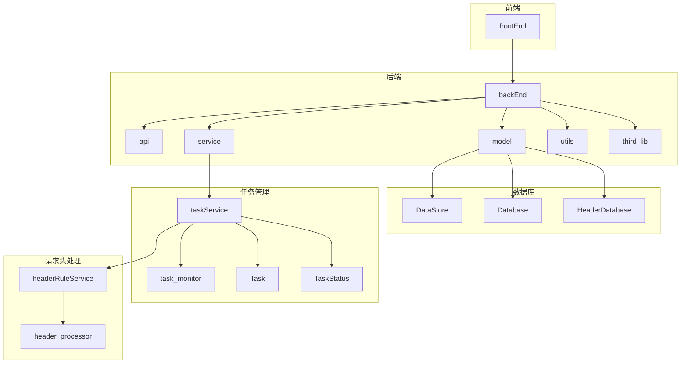
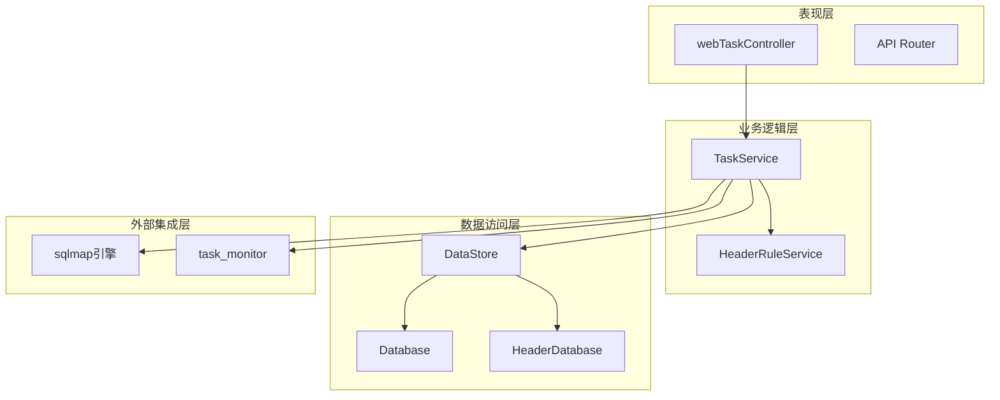
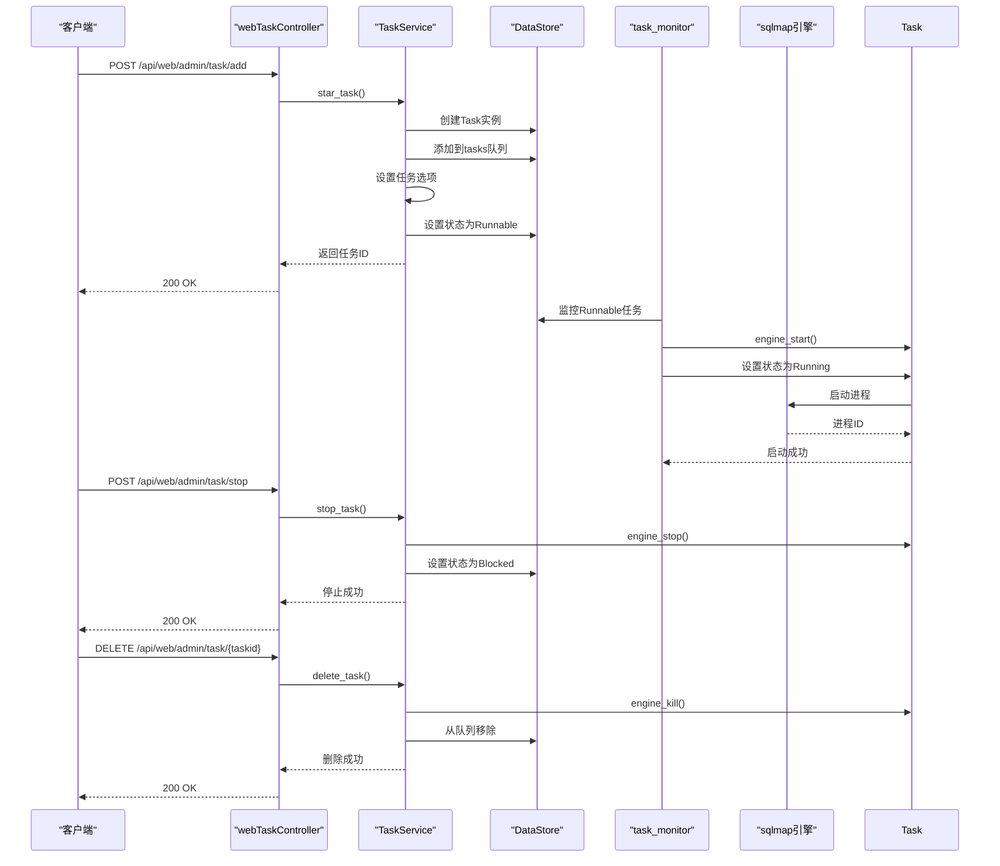
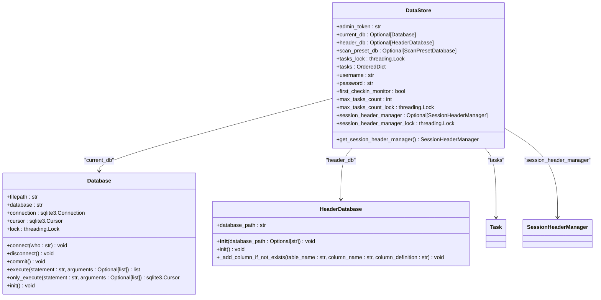
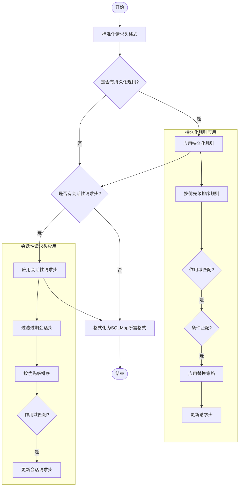
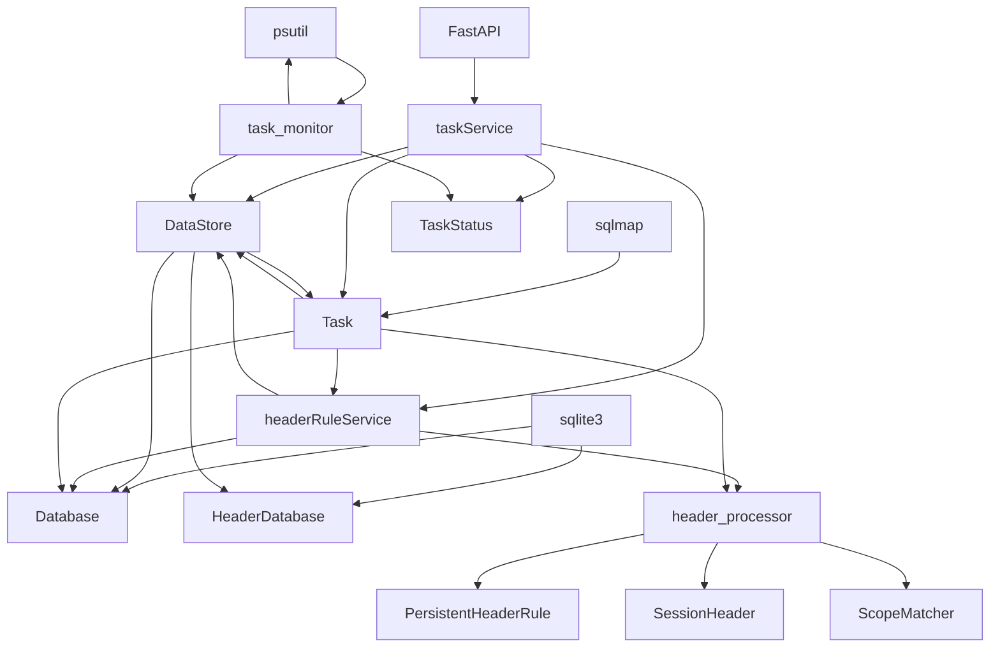

# 任务服务

<cite>
**本文档引用的文件**   
- [taskService.py](file://src/backEnd/service/taskService.py)
- [Task.py](file://src/backEnd/model/Task.py)
- [TaskStatus.py](file://src/backEnd/model/TaskStatus.py)
- [DataStore.py](file://src/backEnd/model/DataStore.py)
- [task_monitor.py](file://src/backEnd/utils/task_monitor.py)
- [Database.py](file://src/backEnd/model/Database.py)
- [HeaderDatabase.py](file://src/backEnd/model/HeaderDatabase.py)
- [headerRuleService.py](file://src/backEnd/service/headerRuleService.py)
- [header_processor.py](file://src/backEnd/utils/header_processor.py)
- [webTaskController.py](file://src/backEnd/api/commonApi/webTaskController.py)
</cite>

## 目录
1. [简介](#简介)
2. [项目结构](#项目结构)
3. [核心组件](#核心组件)
4. [架构概述](#架构概述)
5. [详细组件分析](#详细组件分析)
6. [依赖分析](#依赖分析)
7. [性能考虑](#性能考虑)
8. [故障排除指南](#故障排除指南)
9. [结论](#结论)

## 简介
任务服务是SQLMap Web UI系统的核心组件，负责管理SQL注入扫描任务的完整生命周期。该服务提供任务创建、启动、监控、暂停和终止等核心功能，通过与外部sqlmap引擎的交互实现自动化安全检测。服务采用模块化设计，通过DataStore实现数据持久化，利用task_monitor进行实时状态监控，并通过headerRuleService和header_processor实现请求头的动态处理。整个系统基于FastAPI构建，支持高并发任务处理，为安全测试人员提供稳定可靠的扫描平台。

## 项目结构
项目采用分层架构设计，主要分为前端、后端和第三方库三个部分。后端服务位于src/backEnd目录下，包含API接口、模型定义、业务服务和工具类。任务服务相关的核心文件集中在service、model和utils目录中，通过清晰的职责划分实现高内聚低耦合的设计。系统通过DataStore作为全局数据存储中心，协调各个组件之间的数据交互。



**图表来源**
- [taskService.py](file://src/backEnd/service/taskService.py)
- [Task.py](file://src/backEnd/model/Task.py)
- [DataStore.py](file://src/backEnd/model/DataStore.py)

**本节来源**
- [taskService.py](file://src/backEnd/service/taskService.py)
- [Task.py](file://src/backEnd/model/Task.py)
- [DataStore.py](file://src/backEnd/model/DataStore.py)

## 核心组件
任务服务的核心组件包括Task、TaskStatus、DataStore和task_monitor。Task类封装了扫描任务的所有属性和行为，包括任务ID、扫描URL、请求头、请求体和执行状态。TaskStatus枚举定义了任务的生命周期状态，从New到Terminated的完整状态转换。DataStore作为全局数据存储中心，管理任务队列、数据库连接和配置信息。task_monitor负责实时监控任务执行状态，根据系统资源动态调整并发任务数量。

**本节来源**
- [Task.py](file://src/backEnd/model/Task.py#L49-L333)
- [TaskStatus.py](file://src/backEnd/model/TaskStatus.py#L4-L9)
- [DataStore.py](file://src/backEnd/model/DataStore.py#L12-L38)
- [task_monitor.py](file://src/backEnd/utils/task_monitor.py#L36-L94)

## 架构概述
任务服务采用微服务架构设计，通过清晰的分层和模块化实现高可维护性和可扩展性。系统架构分为表现层、业务逻辑层、数据访问层和外部集成层。表现层由FastAPI路由处理HTTP请求，业务逻辑层由taskService实现核心功能，数据访问层通过Database和HeaderDatabase管理持久化数据，外部集成层与sqlmap引擎进行交互。各层之间通过定义良好的接口进行通信，确保系统的松耦合和高内聚。



**图表来源**
- [taskService.py](file://src/backEnd/service/taskService.py)
- [webTaskController.py](file://src/backEnd/api/commonApi/webTaskController.py)
- [DataStore.py](file://src/backEnd/model/DataStore.py)
- [task_monitor.py](file://src/backEnd/utils/task_monitor.py)

## 详细组件分析

### 任务服务分析
任务服务是系统的核心业务逻辑组件，负责管理扫描任务的完整生命周期。服务通过异步方法处理任务的创建、查询、启动、停止和删除操作，确保高并发场景下的性能和稳定性。

#### 任务状态转换
```mermaid
stateDiagram-v2
[*] --> New
New --> Runnable : star_task()
Runnable --> Running : task_monitor()
Running --> Blocked : stop_task()
Blocked --> Runnable : start_task_with_taskid()
Running --> Terminated : engine_kill()
Blocked --> Terminated : kill_task()
New --> Terminated : delete_task()
state New {
[*] --> New
New : 任务创建
New : create_datetime
}
state Runnable {
[*] --> Runnable
Runnable : 任务就绪
Runnable : status = Runnable
}
state Running {
[*] --> Running
Running : 任务执行
Running : start_datetime
Running : process
}
state Blocked {
[*] --> Blocked
Blocked : 任务暂停
Blocked : status = Blocked
}
state Terminated {
[*] --> Terminated
Terminated : 任务终止
Terminated : status = Terminated
}
```

**图表来源**
- [TaskStatus.py](file://src/backEnd/model/TaskStatus.py#L4-L9)
- [taskService.py](file://src/backEnd/service/taskService.py#L58-L239)

#### 任务生命周期管理


**图表来源**
- [webTaskController.py](file://src/backEnd/api/commonApi/webTaskController.py#L19-L91)
- [taskService.py](file://src/backEnd/service/taskService.py#L58-L239)
- [Task.py](file://src/backEnd/model/Task.py#L258-L317)

### 数据存储分析
DataStore组件作为全局数据存储中心，采用单例模式管理系统的共享状态。它通过线程锁确保多线程环境下的数据一致性，为任务队列、数据库连接和配置信息提供统一的访问接口。

#### 数据存储结构


**图表来源**
- [DataStore.py](file://src/backEnd/model/DataStore.py#L12-L38)
- [Database.py](file://src/backEnd/model/Database.py#L10-L80)
- [HeaderDatabase.py](file://src/backEnd/model/HeaderDatabase.py#L11-L126)

### 请求头处理分析
请求头处理系统由headerRuleService和header_processor组成，实现持久化规则和会话性请求头的动态应用。系统支持多种替换策略，包括替换、追加、前置和条件性替换，满足不同场景下的需求。

#### 请求头处理流程


**图表来源**
- [headerRuleService.py](file://src/backEnd/service/headerRuleService.py#L32-L800)
- [header_processor.py](file://src/backEnd/utils/header_processor.py#L12-L292)

## 依赖分析
任务服务系统具有清晰的依赖关系，各组件之间通过定义良好的接口进行通信。核心依赖包括FastAPI框架、sqlite3数据库、psutil系统监控库和第三方sqlmap引擎。系统采用松耦合设计，通过DataStore作为中介减少直接依赖，提高模块的可测试性和可维护性。



**图表来源**
- [taskService.py](file://src/backEnd/service/taskService.py)
- [DataStore.py](file://src/backEnd/model/DataStore.py)
- [headerRuleService.py](file://src/backEnd/service/headerRuleService.py)
- [Task.py](file://src/backEnd/model/Task.py)
- [task_monitor.py](file://src/backEnd/utils/task_monitor.py)

**本节来源**
- [taskService.py](file://src/backEnd/service/taskService.py)
- [DataStore.py](file://src/backEnd/model/DataStore.py)
- [headerRuleService.py](file://src/backEnd/service/headerRuleService.py)
- [Task.py](file://src/backEnd/model/Task.py)
- [task_monitor.py](file://src/backEnd/utils/task_monitor.py)

## 性能考虑
任务服务在设计时充分考虑了性能因素，通过多种机制确保系统在高负载下的稳定运行。系统采用异步处理模式，避免阻塞主线程；使用线程锁保护共享资源，防止数据竞争；通过task_monitor动态调整并发任务数量，根据CPU使用率和核心数优化资源利用率。此外，系统还实现了连接池和缓存机制，减少数据库访问开销，提高整体性能。

## 故障排除指南
当任务服务出现问题时，可以按照以下步骤进行排查：首先检查日志文件，查看是否有错误信息；然后验证数据库连接是否正常；接着确认sqlmap引擎是否可访问；最后检查系统资源是否充足。对于常见问题，如任务无法启动，应检查任务状态转换逻辑；对于性能问题，应分析并发控制策略；对于数据一致性问题，应审查线程锁的使用。

**本节来源**
- [taskService.py](file://src/backEnd/service/taskService.py)
- [Task.py](file://src/backEnd/model/Task.py)
- [DataStore.py](file://src/backEnd/model/DataStore.py)
- [task_monitor.py](file://src/backEnd/utils/task_monitor.py)

## 结论
任务服务作为SQLMap Web UI的核心组件，实现了完整的扫描任务生命周期管理。系统采用模块化设计，通过清晰的职责划分和松耦合架构，提供了高可维护性和可扩展性。服务支持高并发任务处理，通过动态资源管理和实时监控确保系统稳定性。未来可以进一步优化性能，增加更多监控指标，提升用户体验。