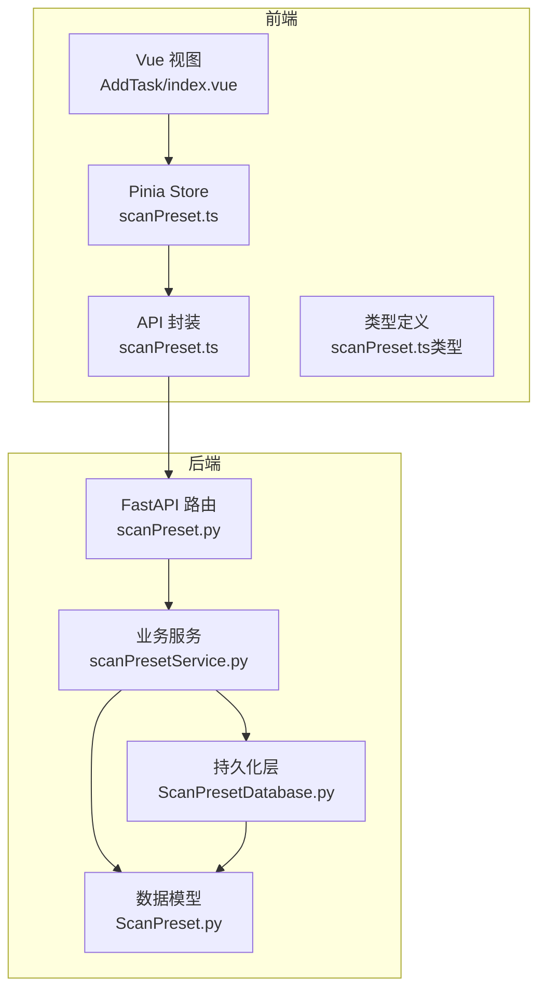
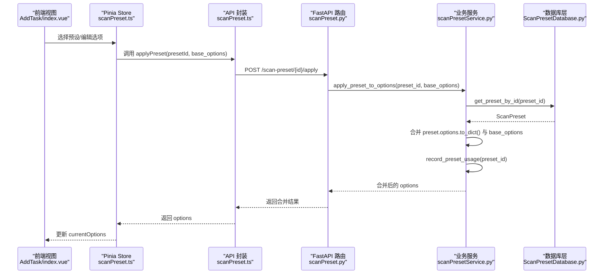
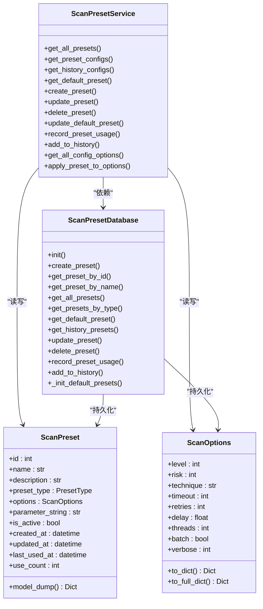
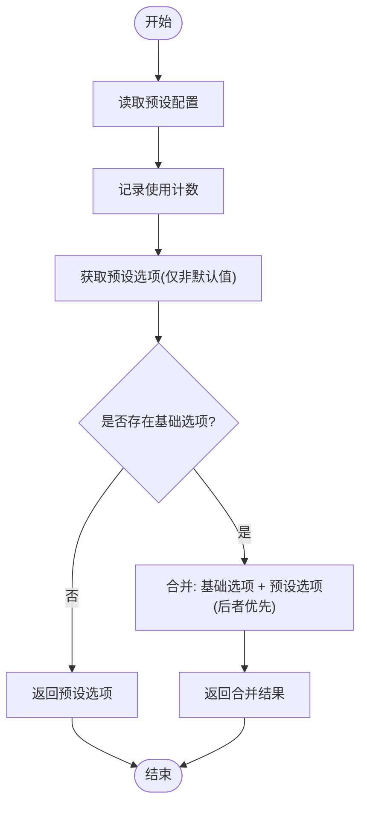
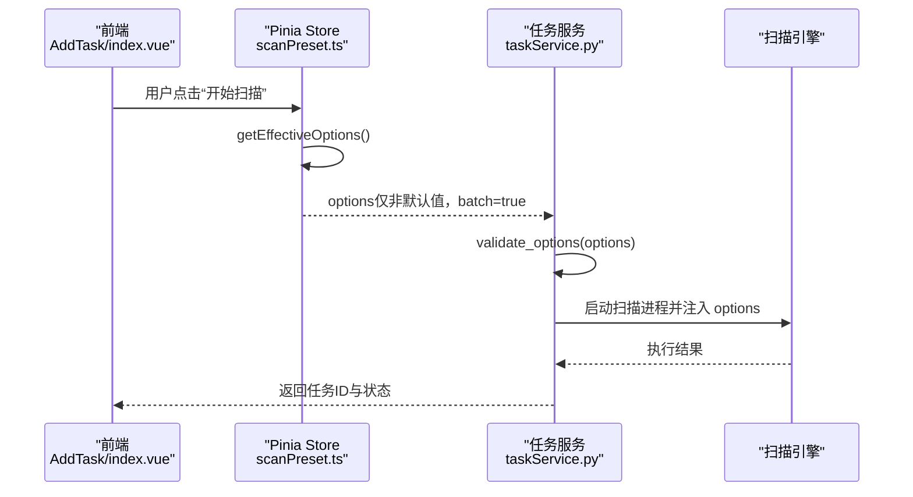
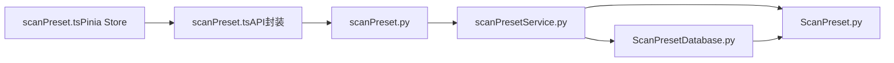

# 扫描配置服务

<cite>
**本文引用的文件**
- [ScanPreset.py](file://src/backEnd/model/ScanPreset.py)
- [ScanPresetDatabase.py](file://src/backEnd/model/ScanPresetDatabase.py)
- [scanPresetService.py](file://src/backEnd/service/scanPresetService.py)
- [scanPreset.py](file://src/backEnd/api/commonApi/scanPreset.py)
- [scanPreset.ts](file://src/frontEnd/src/stores/scanPreset.ts)
- [scanPreset.ts（类型定义）](file://src/frontEnd/src/types/scanPreset.ts)
- [scanPreset.ts（API封装）](file://src/frontEnd/src/api/scanPreset.ts)
- [index.vue（添加任务视图）](file://src/frontEnd/src/views/AddTask/index.vue)
- [taskService.py](file://src/backEnd/service/taskService.py)
</cite>

## 目录
1. [简介](#简介)
2. [项目结构](#项目结构)
3. [核心组件](#核心组件)
4. [架构总览](#架构总览)
5. [详细组件分析](#详细组件分析)
6. [依赖关系分析](#依赖关系分析)
7. [性能考量](#性能考量)
8. [故障排查指南](#故障排查指南)
9. [结论](#结论)
10. [附录](#附录)

## 简介
本文件面向“扫描配置服务”的设计与实现，围绕 scanPresetService 的业务逻辑展开，系统性阐述其如何管理扫描配置的全生命周期：默认配置、常用配置、历史配置的存储与检索；模型设计与字段约束；配置继承与合并策略；版本控制与导入导出能力；参数校验规则；以及与前端配置管理界面的交互协议与任务创建时的参数准备流程。

## 项目结构
扫描配置服务位于后端 Python 层，采用“模型-服务-数据库-API”分层设计，并通过前端 Pinia Store 与 Vue 组件协同完成配置的可视化与交互。

图表来源
- [scanPreset.py](file://src/backEnd/api/commonApi/scanPreset.py#L1-L325)
- [scanPresetService.py](file://src/backEnd/service/scanPresetService.py#L1-L182)
- [ScanPreset.py](file://src/backEnd/model/ScanPreset.py#L1-L231)
- [ScanPresetDatabase.py](file://src/backEnd/model/ScanPresetDatabase.py#L1-L514)
- [scanPreset.ts（API封装）](file://src/frontEnd/src/api/scanPreset.ts#L1-L58)
- [scanPreset.ts（类型定义）](file://src/frontEnd/src/types/scanPreset.ts#L1-L199)
- [scanPreset.ts（Pinia Store）](file://src/frontEnd/src/stores/scanPreset.ts#L1-L296)
- [index.vue（添加任务视图）](file://src/frontEnd/src/views/AddTask/index.vue#L1-L200)

章节来源
- [scanPreset.py](file://src/backEnd/api/commonApi/scanPreset.py#L1-L325)
- [scanPresetService.py](file://src/backEnd/service/scanPresetService.py#L1-L182)
- [ScanPreset.py](file://src/backEnd/model/ScanPreset.py#L1-L231)
- [ScanPresetDatabase.py](file://src/backEnd/model/ScanPresetDatabase.py#L1-L514)
- [scanPreset.ts（API封装）](file://src/frontEnd/src/api/scanPreset.ts#L1-L58)
- [scanPreset.ts（类型定义）](file://src/frontEnd/src/types/scanPreset.ts#L1-L199)
- [scanPreset.ts（Pinia Store）](file://src/frontEnd/src/stores/scanPreset.ts#L1-L296)
- [index.vue（添加任务视图）](file://src/frontEnd/src/views/AddTask/index.vue#L1-L200)

## 核心组件
- 数据模型层
  - ScanOptions：定义完整的扫描参数集合，覆盖检测、注入、技术、请求、优化、枚举、通用等类别，并提供 to_dict()/to_full_dict() 以支持“仅非默认值”与“完整字典”两种序列化形态。
  - ScanPreset：封装预设实体，包含名称、描述、类型、选项、参数字符串、启用状态、时间戳、使用计数等字段。
  - 预定义配置工厂：提供默认配置、快速扫描、深度扫描、安全扫描等预设。
- 数据库层
  - ScanPresetDatabase：负责 SQLite 表结构初始化、列迁移、增删改查、历史记录维护、默认配置初始化、使用计数与最近使用时间记录。
- 业务服务层
  - ScanPresetService：提供 CRUD、默认配置更新、历史记录添加、配置合并、统计汇总等业务方法。
- API 层
  - FastAPI 路由：提供列表、默认配置、常用配置、历史配置、创建/更新/删除、应用预设、添加历史等接口。
- 前端层
  - Pinia Store：集中管理默认配置、常用配置、历史配置、当前选项、选择的预设 ID、计算下拉选项等。
  - 类型定义：与后端模型保持一致的字段与约束。
  - 视图：在“添加任务”页面中，通过下拉选择预设并应用，最终生成提交给任务服务的有效选项。

章节来源
- [ScanPreset.py](file://src/backEnd/model/ScanPreset.py#L1-L231)
- [ScanPresetDatabase.py](file://src/backEnd/model/ScanPresetDatabase.py#L1-L514)
- [scanPresetService.py](file://src/backEnd/service/scanPresetService.py#L1-L182)
- [scanPreset.py](file://src/backEnd/api/commonApi/scanPreset.py#L1-L325)
- [scanPreset.ts（Pinia Store）](file://src/frontEnd/src/stores/scanPreset.ts#L1-L296)
- [scanPreset.ts（类型定义）](file://src/frontEnd/src/types/scanPreset.ts#L1-L199)
- [index.vue（添加任务视图）](file://src/frontEnd/src/views/AddTask/index.vue#L1-L200)

## 架构总览
后端采用“路由-服务-模型-数据库”的清晰分层，前端通过 API 封装与 Pinia Store 实现配置的加载、选择、应用与持久化。

图表来源
- [scanPreset.py](file://src/backEnd/api/commonApi/scanPreset.py#L300-L325)
- [scanPresetService.py](file://src/backEnd/service/scanPresetService.py#L156-L178)
- [ScanPresetDatabase.py](file://src/backEnd/model/ScanPresetDatabase.py#L183-L216)
- [scanPreset.ts（Pinia Store）](file://src/frontEnd/src/stores/scanPreset.ts#L121-L129)
- [index.vue（添加任务视图）](file://src/frontEnd/src/views/AddTask/index.vue#L1-L200)

## 详细组件分析

### 数据模型与配置继承
- ScanOptions 字段覆盖 sqlmap 的 optiondict.py，确保与引擎参数一致；提供 to_dict() 仅返回“与默认值不同的字段”，避免冗余传输与存储。
- ScanPreset 支持三种类型：default、preset、history；默认类型为 preset；包含 parameter_string 字段以兼容 BurpSuite 参数字符串。
- 预定义配置工厂：
  - 默认配置：id=0，系统内置，不可删除。
  - 快速扫描、深度扫描、安全扫描：提供不同 level/risk/technique/threads/delay 等典型组合，便于快速选择。

图表来源
- [ScanPreset.py](file://src/backEnd/model/ScanPreset.py#L1-L231)
- [scanPresetService.py](file://src/backEnd/service/scanPresetService.py#L1-L182)
- [ScanPresetDatabase.py](file://src/backEnd/model/ScanPresetDatabase.py#L1-L514)

章节来源
- [ScanPreset.py](file://src/backEnd/model/ScanPreset.py#L1-L231)
- [scanPresetService.py](file://src/backEnd/service/scanPresetService.py#L1-L182)
- [ScanPresetDatabase.py](file://src/backEnd/model/ScanPresetDatabase.py#L1-L514)

### 配置继承与合并策略
- 继承机制：默认配置作为系统基线，常用配置与历史配置作为派生配置。
- 合并策略：后端提供 apply_preset_to_options(preset_id, base_options)，其行为为：
  - 读取指定预设；
  - 记录使用计数；
  - 将 preset.options.to_dict() 与 base_options 合并，后者优先级更高；
  - 返回合并后的选项字典。
- 前端应用：Pinia Store 在 selectPreset 时调用 applyPreset，然后以 DEFAULT_SCAN_OPTIONS 为基础，再合并后端返回的 options，确保最终提交给任务服务的选项既包含默认值，又覆盖用户选择的预设。

图表来源
- [scanPresetService.py](file://src/backEnd/service/scanPresetService.py#L156-L178)
- [scanPreset.py](file://src/backEnd/api/commonApi/scanPreset.py#L300-L325)
- [scanPreset.ts（Pinia Store）](file://src/frontEnd/src/stores/scanPreset.ts#L121-L129)

章节来源
- [scanPresetService.py](file://src/backEnd/service/scanPresetService.py#L156-L178)
- [scanPreset.py](file://src/backEnd/api/commonApi/scanPreset.py#L300-L325)
- [scanPreset.ts（Pinia Store）](file://src/frontEnd/src/stores/scanPreset.ts#L121-L129)

### 存储与检索：默认/常用/历史
- 默认配置：首次初始化数据库时自动创建四条预设（默认、快速、深度、安全），且默认配置不可删除。
- 常用配置：preset_type='preset'，可增删改查。
- 历史配置：preset_type='history'，按最近使用时间排序，超过上限自动清理，支持去重更新。
- 数据库迁移：新增 parameter_string 列，保证向后兼容。
- 使用统计：每次应用预设都会增加 use_count 并更新 last_used_at。

章节来源
- [ScanPresetDatabase.py](file://src/backEnd/model/ScanPresetDatabase.py#L54-L127)
- [ScanPresetDatabase.py](file://src/backEnd/model/ScanPresetDatabase.py#L128-L205)
- [ScanPresetDatabase.py](file://src/backEnd/model/ScanPresetDatabase.py#L206-L408)
- [ScanPresetDatabase.py](file://src/backEnd/model/ScanPresetDatabase.py#L409-L501)

### 版本控制与导入导出
- 版本控制：通过 created_at/updated_at 字段记录变更时间；use_count/last_used_at 记录使用轨迹。
- 导入导出：前端提供导出为 JSON 的能力，包含 name、description、preset_type、options、parameter_string 等字段，便于跨环境迁移与备份。
- 参数字符串：parameter_string 字段用于与 BurpSuite 插件兼容，便于从命令行参数反向解析为 options。

章节来源
- [ScanPreset.py](file://src/backEnd/model/ScanPreset.py#L107-L137)
- [ScanPresetDatabase.py](file://src/backEnd/model/ScanPresetDatabase.py#L1-L514)
- [scanPreset.ts（Pinia Store）](file://src/frontEnd/src/stores/scanPreset.ts#L430-L481)

### 参数验证规则
- 名称唯一性：创建/更新时检查名称是否已存在。
- 默认配置保护：默认配置不可删除；名称不可更改。
- 选项有效性：数据库层在创建时对 options 进行构造校验；API 层对请求体进行解析与错误处理。
- 前端过滤：在“添加任务”页面中，当前选项仅保留与默认值不同的字段，确保提交给任务服务的 payload 最小化。

章节来源
- [scanPresetService.py](file://src/backEnd/service/scanPresetService.py#L67-L105)
- [ScanPresetDatabase.py](file://src/backEnd/model/ScanPresetDatabase.py#L156-L181)
- [scanPreset.py](file://src/backEnd/api/commonApi/scanPreset.py#L191-L215)
- [scanPreset.ts（Pinia Store）](file://src/frontEnd/src/stores/scanPreset.ts#L244-L262)

### 与前端配置管理界面的交互协议
- 下拉菜单选项：后端提供 /config-options，返回 default、presets、history 三部分；前端据此生成带分隔符的下拉选项。
- 应用预设：前端调用 /{id}/apply，传入 base_options（当前编辑的选项），后端返回合并后的 options。
- 保存当前为新预设：前端调用 /，传入当前 options 与 preset_type='preset'。
- 历史记录：前端调用 /history，传入 name 与 options，后端自动去重更新或新建历史记录。

章节来源
- [scanPreset.py](file://src/backEnd/api/commonApi/scanPreset.py#L46-L69)
- [scanPreset.py](file://src/backEnd/api/commonApi/scanPreset.py#L300-L325)
- [scanPreset.ts（Pinia Store）](file://src/frontEnd/src/stores/scanPreset.ts#L121-L129)
- [scanPreset.ts（Pinia Store）](file://src/frontEnd/src/stores/scanPreset.ts#L219-L226)
- [scanPreset.ts（Pinia Store）](file://src/frontEnd/src/stores/scanPreset.ts#L231-L241)

### 任务创建时的参数准备
- 前端在“添加任务”页面中，通过 Pinia Store 的 getEffectiveOptions() 生成最终提交参数：仅包含与默认值不同的字段，并强制 batch=true。
- 任务服务在启动扫描前会对 options 进行校验，剔除不支持的键，确保与引擎兼容。
- 任务服务接收 options 字典，逐项设置到任务对象，随后启动扫描引擎。

图表来源
- [scanPreset.ts（Pinia Store）](file://src/frontEnd/src/stores/scanPreset.ts#L244-L262)
- [taskService.py](file://src/backEnd/service/taskService.py#L23-L43)
- [taskService.py](file://src/backEnd/service/taskService.py#L58-L88)

章节来源
- [scanPreset.ts（Pinia Store）](file://src/frontEnd/src/stores/scanPreset.ts#L244-L262)
- [taskService.py](file://src/backEnd/service/taskService.py#L23-L43)
- [taskService.py](file://src/backEnd/service/taskService.py#L58-L88)

## 依赖关系分析
- 路由依赖服务：scanPreset.py 中的每个接口均委托给 scanPresetService。
- 服务依赖数据库与模型：scanPresetService 通过 get_scan_preset_db() 获取数据库实例，并读写 ScanPreset/ScanOptions。
- 数据库依赖模型：ScanPresetDatabase 将 ScanPreset/ScanOptions 序列化为 JSON 存储。
- 前端依赖后端 API：Pinia Store 通过 scanPreset.ts 发起请求，后端返回统一的 BaseResponseMsg 结构。

图表来源
- [scanPreset.py](file://src/backEnd/api/commonApi/scanPreset.py#L1-L325)
- [scanPresetService.py](file://src/backEnd/service/scanPresetService.py#L1-L182)
- [ScanPresetDatabase.py](file://src/backEnd/model/ScanPresetDatabase.py#L1-L514)
- [ScanPreset.py](file://src/backEnd/model/ScanPreset.py#L1-L231)
- [scanPreset.ts（Pinia Store）](file://src/frontEnd/src/stores/scanPreset.ts#L1-L296)
- [scanPreset.ts（API封装）](file://src/frontEnd/src/api/scanPreset.ts#L1-L58)

章节来源
- [scanPreset.py](file://src/backEnd/api/commonApi/scanPreset.py#L1-L325)
- [scanPresetService.py](file://src/backEnd/service/scanPresetService.py#L1-L182)
- [ScanPresetDatabase.py](file://src/backEnd/model/ScanPresetDatabase.py#L1-L514)
- [ScanPreset.py](file://src/backEnd/model/ScanPreset.py#L1-L231)
- [scanPreset.ts（Pinia Store）](file://src/frontEnd/src/stores/scanPreset.ts#L1-L296)
- [scanPreset.ts（API封装）](file://src/frontEnd/src/api/scanPreset.ts#L1-L58)

## 性能考量
- 数据库访问：所有查询均通过统一的数据库实例执行，避免重复连接；索引建立在 preset_type、is_active、name 上，提升检索效率。
- 序列化开销：to_dict() 仅返回非默认值，减少网络传输与存储体积；to_full_dict() 仅在需要完整快照时使用。
- 历史记录清理：限制最大历史数量，定期清理旧记录，避免表膨胀。
- 前端合并：仅在应用预设时进行一次字典合并，复杂度 O(n)；提交任务前再次过滤默认值，避免冗余参数。

[本节为通用建议，无需列出具体文件来源]

## 故障排查指南
- 默认配置缺失：初始化数据库时会尝试创建默认配置；若失败，检查日志输出并确认数据库路径与权限。
- 名称冲突：创建/更新时若名称已存在，服务会拒绝并记录警告；请更换名称后重试。
- 删除默认配置：默认配置不可删除；若出现异常删除行为，请检查业务逻辑与日志。
- 预设应用失败：前端调用 /{id}/apply 失败时，检查 preset_id 是否有效、base_options 是否为字典；后端会记录异常并返回 HTTP 500。
- 任务启动失败：任务服务在启动前会校验 options，若包含不支持的键，将返回 400 错误；请移除不支持的键后再试。

章节来源
- [ScanPresetDatabase.py](file://src/backEnd/model/ScanPresetDatabase.py#L99-L127)
- [scanPresetService.py](file://src/backEnd/service/scanPresetService.py#L67-L105)
- [scanPreset.py](file://src/backEnd/api/commonApi/scanPreset.py#L191-L215)
- [scanPreset.py](file://src/backEnd/api/commonApi/scanPreset.py#L300-L325)
- [taskService.py](file://src/backEnd/service/taskService.py#L23-L43)

## 结论
扫描配置服务通过清晰的分层设计与严格的参数校验，实现了默认/常用/历史配置的全生命周期管理。其继承与合并策略确保了“基线+派生”的灵活组合，配合前端直观的配置界面与最小化提交策略，为任务创建提供了稳定可靠的参数准备能力。版本控制、导入导出与历史清理进一步提升了系统的可维护性与可用性。

[本节为总结性内容，无需列出具体文件来源]

## 附录

### 关键接口一览
- GET /scan-preset/list：获取所有预设（可选包含未激活）
- GET /scan-preset/config-options：获取默认/常用/历史配置选项
- GET /scan-preset/default：获取默认配置
- PUT /scan-preset/default：更新默认配置
- GET /scan-preset/presets：获取常用配置列表
- GET /scan-preset/history：获取历史配置列表
- GET /scan-preset/{preset_id}：获取指定预设
- POST /scan-preset：创建新预设
- PUT /scan-preset/{preset_id}：更新预设
- DELETE /scan-preset/{preset_id}：删除预设
- POST /scan-preset/history：添加到历史记录
- POST /scan-preset/{preset_id}/apply：应用预设并返回合并后的选项

章节来源
- [scanPreset.py](file://src/backEnd/api/commonApi/scanPreset.py#L23-L325)