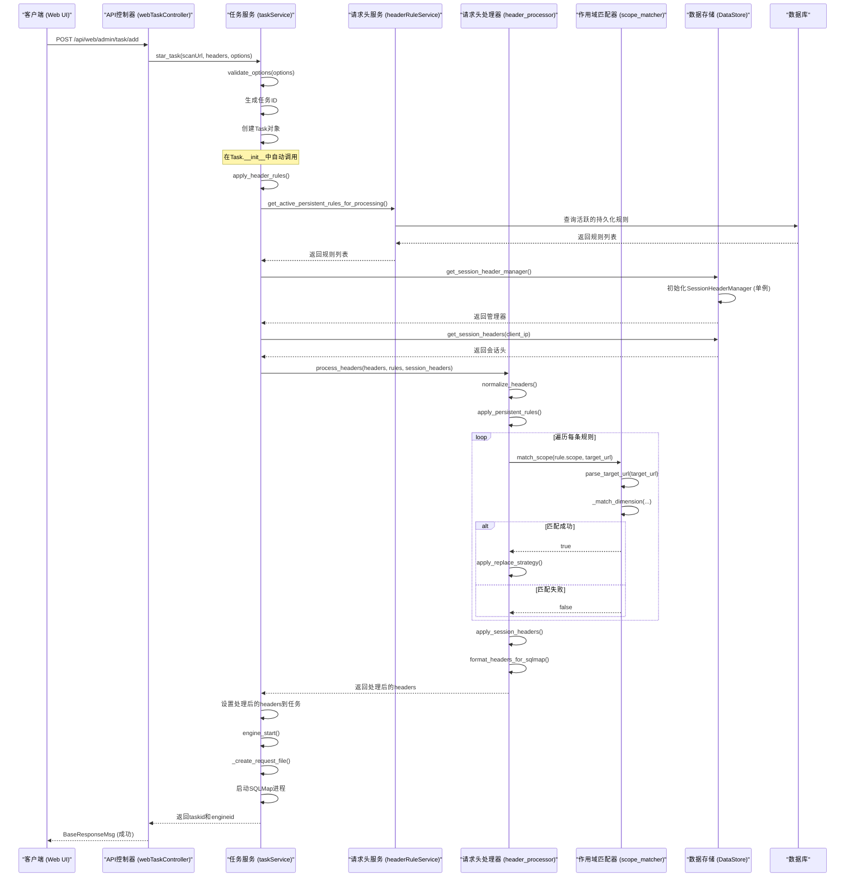

# 服务层

<cite>
**本文档引用的文件**
- [headerRuleService.py](file://src/backEnd/service/headerRuleService.py)
- [scanPresetService.py](file://src/backEnd/service/scanPresetService.py)
- [taskService.py](file://src/backEnd/service/taskService.py)
- [auth.py](file://src/backEnd/utils/auth.py)
- [header_processor.py](file://src/backEnd/utils/header_processor.py)
- [PersistentHeaderRule.py](file://src/backEnd/model/PersistentHeaderRule.py)
- [HeaderScope.py](file://src/backEnd/model/HeaderScope.py)
- [scope_matcher.py](file://src/backEnd/utils/scope_matcher.py)
- [Task.py](file://src/backEnd/model/Task.py)
- [ScanPreset.py](file://src/backEnd/model/ScanPreset.py)
- [webTaskController.py](file://src/backEnd/api/commonApi/webTaskController.py)
- [headerController.py](file://src/backEnd/api/commonApi/headerController.py)
- [scanPreset.py](file://src/backEnd/api/commonApi/scanPreset.py)
- [DataStore.py](file://src/backEnd/model/DataStore.py)
</cite>

## 目录
1. [引言](#引言)
2. [核心服务类设计与实现](#核心服务类设计与实现)
3. [服务层协调与业务流程](#服务层协调与业务流程)
4. [工具类在服务层中的作用](#工具类在服务层中的作用)
5. [服务调用时序图](#服务调用时序图)
6. [关键业务逻辑代码示例](#关键业务逻辑代码示例)
7. [结论](#结论)

## 引言
本服务层文档深入解析了sqlmapWebUI的业务逻辑实现，重点阐述了`headerRuleService`、`scanPresetService`和`taskService`三个核心服务类的设计与实现。文档详细说明了这些服务的公共方法、内部逻辑和异常处理机制，解释了服务层如何协调数据访问和业务规则执行，特别是在处理扫描任务创建、配置管理和请求头规则匹配时的流程。同时，文档描述了`auth.py`和`header_processor.py`等工具类在服务层中的辅助作用，并提供了从API控制器到服务层再到数据层的完整调用链时序图。

**Section sources**
- [headerRuleService.py](file://src/backEnd/service/headerRuleService.py#L1-L976)
- [scanPresetService.py](file://src/backEnd/service/scanPresetService.py#L1-L182)
- [taskService.py](file://src/backEnd/service/taskService.py#L1-L535)

## 核心服务类设计与实现

### headerRuleService（请求头规则服务）
`headerRuleService`是处理持久化请求头规则和会话性请求头的核心服务类。它负责管理请求头规则的全生命周期，包括创建、查询、更新和删除。

**公共方法与内部逻辑**：
- `create_persistent_rule`: 创建持久化请求头规则。该方法首先验证数据库连接，然后对输入数据进行严格校验（如规则名称不能为空、请求头名称格式有效等），检查规则名称是否已存在，最后将规则数据插入数据库。成功后返回包含新规则ID的响应。
- `get_persistent_rules`: 获取持久化请求头规则列表。根据`active_only`参数决定是否只查询活跃规则，并按优先级降序和创建时间降序排序。
- `update_persistent_rule`: 更新持久化请求头规则。在更新前会检查规则是否存在，并确保新名称不与其他规则冲突。更新时支持部分字段更新，并会自动更新`updated_at`时间戳。
- `delete_persistent_rule`: 删除持久化请求头规则。删除前会检查规则是否存在，并记录删除日志。
- `preview_header_processing`: 预览请求头处理结果。该方法结合持久化规则和会话性请求头，模拟应用规则后的效果，用于前端预览。

**异常处理机制**：
该服务类通过`try-except`块捕获所有潜在异常。对于数据库连接问题，返回503服务不可用状态；对于数据验证错误，返回400错误请求状态；对于其他内部错误，返回500服务器内部错误状态，并在日志中记录详细错误信息。

### scanPresetService（扫描配置预设服务）
`scanPresetService`提供扫描配置预设的业务逻辑，采用单例模式确保全局唯一实例。

**公共方法与内部逻辑**：
- `get_all_presets`: 获取所有预设配置，包括默认配置、常用配置和历史配置。
- `create_preset`: 创建新的预设配置。在创建前会验证名称不能为空，并检查名称是否已存在。
- `update_preset`: 更新预设配置。对于默认配置，只允许修改选项，不允许修改名称和类型。
- `delete_preset`: 删除预设配置。默认配置不允许删除。
- `apply_preset_to_options`: 将预设配置应用到基础选项上，实现配置继承逻辑。

**异常处理机制**：
该服务的异常处理主要通过返回`None`或`False`来表示操作失败，并在日志中记录警告信息。例如，当创建名称已存在的预设时，会返回`None`并记录警告日志。

### taskService（任务服务）
`taskService`负责管理扫描任务的生命周期，包括创建、启动、停止、删除和查询。

**公共方法与内部逻辑**：
- `star_task`: 创建并启动一个新的扫描任务。该方法首先验证扫描选项，然后生成唯一的任务ID，将任务信息存储在全局的`DataStore.tasks`有序字典中，并设置任务状态为`Runnable`。
- `list_task`: 列出所有任务。该方法会查询数据库，获取每个任务的错误、日志和数据条目数量，并根据任务状态动态计算当前状态。
- `kill_task`: 终止任务。如果任务正在运行，则先调用`engine_kill`方法杀死底层进程，然后从任务列表中移除。
- `stop_task`: 停止任务。将正在运行的任务状态改为`Blocked`，使其暂停。

**异常处理机制**：
该服务在关键操作（如数据库访问、进程操作）周围使用`try-except`块。对于数据库连接未初始化等严重错误，返回500内部服务器错误；对于非存在的任务ID，返回400或404状态码。

**Section sources**
- [headerRuleService.py](file://src/backEnd/service/headerRuleService.py#L32-L800)
- [scanPresetService.py](file://src/backEnd/service/scanPresetService.py#L17-L181)
- [taskService.py](file://src/backEnd/service/taskService.py#L46-L534)

## 服务层协调与业务流程

### 扫描任务创建流程
当用户通过Web界面提交扫描任务时，服务层的协调流程如下：
1.  **API接收**：`webTaskController.py`中的`add_task_from_web`接口接收到任务创建请求。
2.  **身份验证**：调用`auth.py`中的`get_current_user`函数进行身份验证。
3.  **业务逻辑处理**：调用`taskService`的`star_task`方法。
4.  **请求头规则应用**：在`Task`对象的`__init__`方法中，会自动调用`apply_header_rules`方法。
5.  **规则获取**：`apply_header_rules`方法通过`headerRuleService`的`get_active_persistent_rules_for_processing`获取所有活跃的持久化规则。
6.  **会话头获取**：从`DataStore`中获取`session_header_manager`，并根据客户端IP获取对应的会话性请求头。
7.  **规则应用**：调用`header_processor.py`中的`process_headers`方法，将规则和会话头应用到原始请求头上。
8.  **任务启动**：最终调用`engine_start`方法，启动SQLMap引擎。

### 配置管理流程
配置管理主要通过`scanPresetService`实现：
1.  **配置继承**：用户可以选择一个预设配置作为基础，然后在此基础上进行修改。`apply_preset_to_options`方法实现了配置继承逻辑，它会将预设的选项与基础选项合并，预设选项的值会覆盖基础选项。
2.  **历史记录**：每次用户使用一个配置进行扫描，`record_preset_usage`方法会被调用，增加该配置的使用次数。用户也可以手动将当前配置添加到历史记录中。

### 请求头规则匹配流程
请求头规则的匹配是服务层的核心功能，其流程如下：
1.  **作用域定义**：每条持久化规则都可以配置一个`HeaderScope`，定义其生效的范围，包括协议、主机名、IP、端口和路径。
2.  **作用域匹配**：当需要应用规则时，`ScopeMatcher`类会解析目标URL，并将其与规则的`HeaderScope`进行匹配。
3.  **多维度匹配**：匹配逻辑是AND逻辑，即规则中配置的所有非空维度都必须匹配。例如，如果规则配置了`host_pattern`为`*.example.com`且`path_pattern`为`/api/*`，则只有同时满足这两个条件的URL才会应用该规则。
4.  **通配符与正则**：`HeaderScope`支持通配符（`*`）和正则表达式两种匹配模式。通配符模式更简单，正则模式更灵活。

**Section sources**
- [taskService.py](file://src/backEnd/service/taskService.py#L58-L87)
- [Task.py](file://src/backEnd/model/Task.py#L109-L169)
- [header_processor.py](file://src/backEnd/utils/header_processor.py#L214-L257)
- [scope_matcher.py](file://src/backEnd/utils/scope_matcher.py#L35-L141)
- [scanPresetService.py](file://src/backEnd/service/scanPresetService.py#L156-L177)

## 工具类在服务层中的作用

### auth.py（身份验证工具）
`auth.py`中的`get_current_user`函数是服务层进行身份验证的关键工具。它被API控制器通过`Depends`依赖注入机制调用，为`headerRuleService`、`scanPresetService`和`taskService`等服务提供安全保护。该工具根据客户端IP和提供的token来判断用户身份，确保只有授权用户才能执行敏感操作。

### header_processor.py（请求头处理器）
`header_processor.py`是服务层处理请求头的核心工具类，其作用至关重要：
- **数据格式转换**：`normalize_headers`和`format_headers_for_sqlmap`方法在列表格式和字典格式之间转换请求头，便于在内存中高效处理。
- **规则应用引擎**：`apply_persistent_rules`和`apply_session_headers`方法是实际应用规则的引擎，它们根据优先级、替换策略和作用域来决定如何修改请求头。
- **替换策略实现**：`apply_replace_strategy`方法实现了多种替换策略，如完全替换（REPLACE）、追加（APPEND）、前置（PREPEND）等。
- **预览功能**：`preview_header_processing`方法为前端提供了强大的预览功能，让用户在应用规则前就能看到效果。

### scope_matcher.py（作用域匹配器）
`scope_matcher.py`中的`ScopeMatcher`类负责执行复杂的作用域匹配逻辑：
- **URL解析**：`parse_target_url`方法将目标URL解析为协议、主机、IP、端口和路径等组成部分。
- **多模式匹配**：`_match_keyword`方法支持通配符和逗号分隔的多个值（OR逻辑），`_match_regex`方法支持正则表达式匹配。
- **性能优化**：该类使用了缓存机制（`_regex_cache`和`_url_cache`）来避免重复的正则编译和URL解析，显著提升了性能。

**Section sources**
- [auth.py](file://src/backEnd/utils/auth.py#L5-L22)
- [header_processor.py](file://src/backEnd/utils/header_processor.py#L12-L291)
- [scope_matcher.py](file://src/backEnd/utils/scope_matcher.py#L19-L345)

## 服务调用时序图



**Diagram sources**
- [webTaskController.py](file://src/backEnd/api/commonApi/webTaskController.py#L19-L90)
- [taskService.py](file://src/backEnd/service/taskService.py#L58-L87)
- [Task.py](file://src/backEnd/model/Task.py#L109-L169)
- [headerRuleService.py](file://src/backEnd/service/headerRuleService.py#L533-L583)
- [header_processor.py](file://src/backEnd/utils/header_processor.py#L214-L257)
- [scope_matcher.py](file://src/backEnd/utils/scope_matcher.py#L35-L141)
- [DataStore.py](file://src/backEnd/model/DataStore.py#L25-L37)

## 关键业务逻辑代码示例

### 任务状态管理
任务状态管理是`taskService`的核心。任务状态在`TaskStatus`枚举中定义（New, Runnable, Running, Blocked, Terminated）。服务通过`engine_has_terminated()`方法检查底层进程是否结束，并动态计算任务的当前状态。例如，一个状态为`Running`的任务，如果其进程已终止，则其逻辑状态应为`Terminated`。

### 配置继承逻辑
`scanPresetService`中的`apply_preset_to_options`方法实现了配置继承：
```python
def apply_preset_to_options(self, preset_id: int, base_options: Dict[str, Any] = None) -> Dict[str, Any]:
    preset = self.get_preset_by_id(preset_id)
    if not preset:
        return base_options or {}
    
    # 获取预设选项
    preset_options = preset.options.to_dict()
    
    # 如果有基础选项，合并
    if base_options:
        result = {**base_options}
        result.update(preset_options)
        return result
    
    return preset_options
```
此逻辑确保了预设配置可以作为模板，用户可以在其基础上进行个性化调整。

### 作用域匹配算法
`ScopeMatcher`的作用域匹配算法是其核心：
```python
@classmethod
def match_scope(cls, scope: Optional[HeaderScope], target_url: str) -> bool:
    if scope is None or scope.is_empty():
        return True  # 全局生效
        
    url_parts = cls.parse_target_url(target_url)
    
    # 每个非空字段必须匹配 (AND逻辑)
    if scope.protocol_pattern and not cls._match_dimension(url_parts['protocol'], scope.protocol_pattern, scope.use_regex, "协议"):
        return False
    if scope.host_pattern and not cls._match_dimension(url_parts['host'], scope.host_pattern, scope.use_regex, "主机名"):
        return False
    # ... 其他维度同理
    return True
```
该算法确保了规则只在指定的、精确的范围内生效，避免了误匹配。

**Section sources**
- [taskService.py](file://src/backEnd/service/taskService.py#L149-L155)
- [scanPresetService.py](file://src/backEnd/service/scanPresetService.py#L156-L177)
- [scope_matcher.py](file://src/backEnd/utils/scope_matcher.py#L35-L141)

## 结论
sqlmapWebUI的服务层设计清晰、职责分明。`headerRuleService`、`scanPresetService`和`taskService`三个核心服务类各司其职，通过`DataStore`进行协调，并利用`auth.py`、`header_processor.py`和`scope_matcher.py`等工具类实现复杂业务逻辑。整个服务层通过完善的异常处理机制保证了系统的健壮性，并通过清晰的调用链路实现了从API请求到任务执行的完整流程。这种分层设计使得代码易于维护和扩展，为sqlmapWebUI提供了强大而灵活的后台支持。