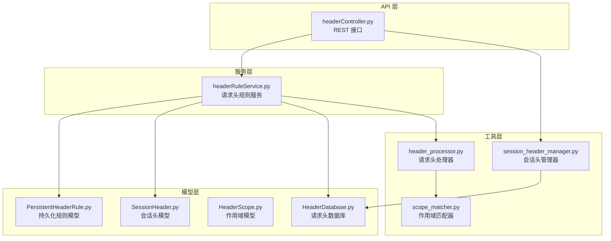
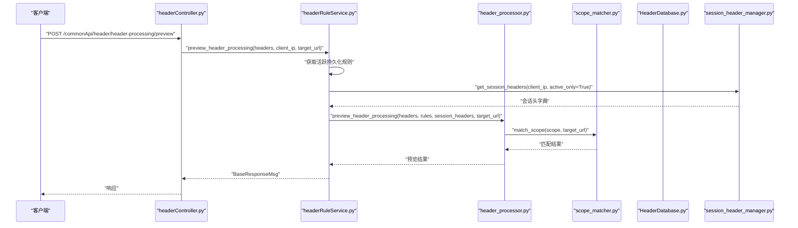
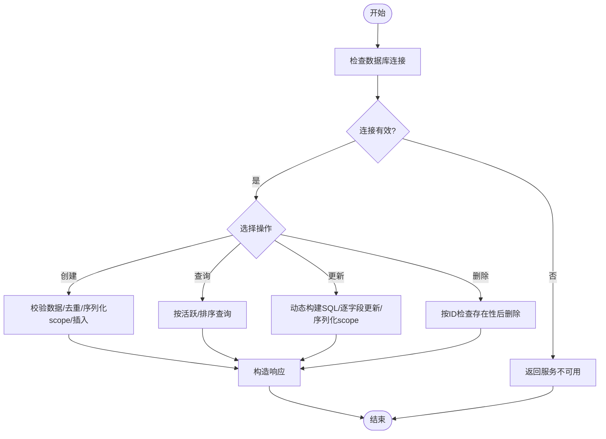
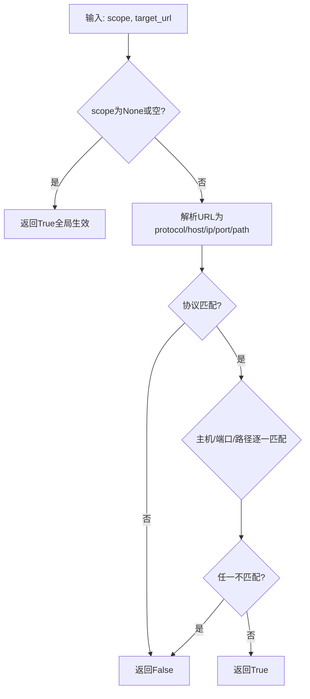
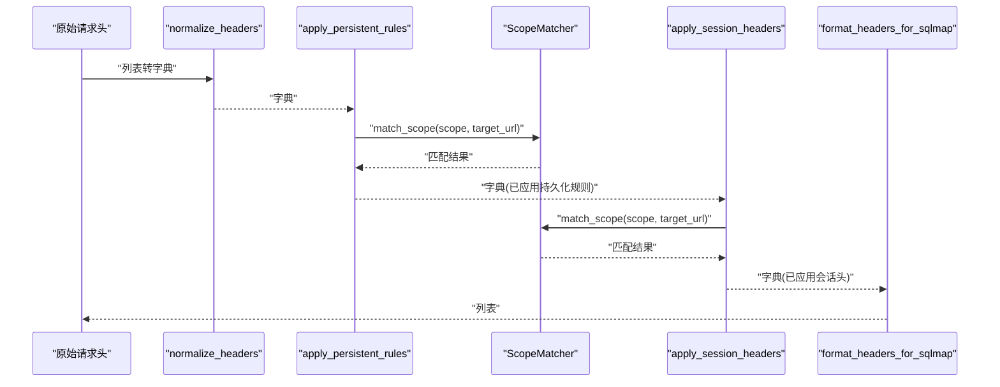
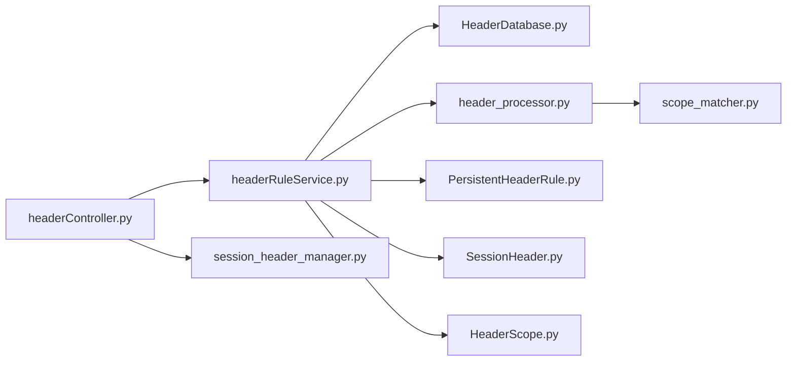

# 请求头规则服务

<cite>
**本文引用的文件**
- [headerRuleService.py](file://src/backEnd/service/headerRuleService.py)
- [HeaderScope.py](file://src/backEnd/model/HeaderScope.py)
- [HeaderDatabase.py](file://src/backEnd/model/HeaderDatabase.py)
- [scope_matcher.py](file://src/backEnd/utils/scope_matcher.py)
- [header_processor.py](file://src/backEnd/utils/header_processor.py)
- [PersistentHeaderRule.py](file://src/backEnd/model/PersistentHeaderRule.py)
- [SessionHeader.py](file://src/backEnd/model/SessionHeader.py)
- [headerController.py](file://src/backEnd/api/commonApi/headerController.py)
- [session_header_manager.py](file://src/backEnd/utils/session_header_manager.py)
- [test_header_processor_scope.py](file://src/backEnd/tests/test_header_processor_scope.py)
- [test_scope_matcher.py](file://src/backEnd/tests/test_scope_matcher.py)
</cite>

## 目录
1. [简介](#简介)
2. [项目结构](#项目结构)
3. [核心组件](#核心组件)
4. [架构总览](#架构总览)
5. [详细组件分析](#详细组件分析)
6. [依赖关系分析](#依赖关系分析)
7. [性能考量](#性能考量)
8. [故障排查指南](#故障排查指南)
9. [结论](#结论)
10. [附录](#附录)

## 简介
本文件面向“请求头规则服务”，系统性解析 headerRuleService.py 的实现机制，涵盖持久化请求头规则与会话级请求头的管理、创建/更新/删除/查询流程；详解 HeaderScope 与 HeaderDatabase 在规则存储中的角色；深入说明 scope_matcher 如何实现基于 URL 模式的规则匹配算法；阐述 header_processor 对 HTTP 请求头的处理流程（规则应用顺序、优先级与冲突策略）。文档还提供规则匹配的实现细节示例（正则表达式匹配、通配符处理、作用域继承机制），并说明该服务与任务服务、API 控制器及 Burp Suite 集成场景的交互方式。

## 项目结构
请求头规则服务位于后端模块 src/backEnd 下，采用分层设计：
- API 层：提供 REST 接口，路由位于 headerController.py
- 服务层：业务逻辑封装在 headerRuleService.py
- 工具层：作用域匹配与请求头处理分别由 scope_matcher.py 与 header_processor.py 实现
- 模型层：规则、会话头、作用域、数据库等模型定义在 model 目录
- 数据存储：HeaderDatabase 负责 SQLite 表结构与迁移

图表来源
- [headerController.py](file://src/backEnd/api/commonApi/headerController.py#L1-L120)
- [headerRuleService.py](file://src/backEnd/service/headerRuleService.py#L1-L120)
- [scope_matcher.py](file://src/backEnd/utils/scope_matcher.py#L1-L120)
- [header_processor.py](file://src/backEnd/utils/header_processor.py#L1-L120)
- [PersistentHeaderRule.py](file://src/backEnd/model/PersistentHeaderRule.py#L1-L60)
- [SessionHeader.py](file://src/backEnd/model/SessionHeader.py#L1-L60)
- [HeaderScope.py](file://src/backEnd/model/HeaderScope.py#L1-L60)
- [HeaderDatabase.py](file://src/backEnd/model/HeaderDatabase.py#L1-L60)
- [session_header_manager.py](file://src/backEnd/utils/session_header_manager.py#L1-L60)

章节来源
- [headerController.py](file://src/backEnd/api/commonApi/headerController.py#L1-L120)
- [headerRuleService.py](file://src/backEnd/service/headerRuleService.py#L1-L120)

## 核心组件
- HeaderRuleService：封装持久化规则与会话头的 CRUD、批量操作、预览与数据库连接检查
- HeaderScope：定义多维作用域（协议、主机、IP、端口、路径），支持通配符与正则
- HeaderDatabase：SQLite 表结构与迁移（持久化规则表、会话头表、索引）
- ScopeMatcher：基于 URL 的作用域匹配器，支持关键字与正则两种模式
- HeaderProcessor：请求头处理流水线，应用持久化规则与会话头，处理优先级与冲突
- SessionHeaderManager：内存中管理会话头，支持 TTL、过期清理、持久化同步

章节来源
- [headerRuleService.py](file://src/backEnd/service/headerRuleService.py#L1-L120)
- [HeaderScope.py](file://src/backEnd/model/HeaderScope.py#L1-L120)
- [HeaderDatabase.py](file://src/backEnd/model/HeaderDatabase.py#L1-L120)
- [scope_matcher.py](file://src/backEnd/utils/scope_matcher.py#L1-L120)
- [header_processor.py](file://src/backEnd/utils/header_processor.py#L1-L120)
- [session_header_manager.py](file://src/backEnd/utils/session_header_manager.py#L1-L120)

## 架构总览
请求头规则服务的调用链路如下：
- API 控制器接收请求，调用 HeaderRuleService
- HeaderRuleService 通过 HeaderDatabase 访问 SQLite 存储
- HeaderProcessor 将原始请求头转换为字典，按优先级应用持久化规则与会话头
- ScopeMatcher 基于 URL 维度（协议/主机/IP/端口/路径）进行匹配
- SessionHeaderManager 管理会话头生命周期（TTL、过期清理、持久化）

图表来源
- [headerController.py](file://src/backEnd/api/commonApi/headerController.py#L354-L383)
- [headerRuleService.py](file://src/backEnd/service/headerRuleService.py#L584-L623)
- [header_processor.py](file://src/backEnd/utils/header_processor.py#L259-L292)
- [scope_matcher.py](file://src/backEnd/utils/scope_matcher.py#L35-L142)
- [session_header_manager.py](file://src/backEnd/utils/session_header_manager.py#L151-L171)
- [HeaderDatabase.py](file://src/backEnd/model/HeaderDatabase.py#L1-L126)

## 详细组件分析

### HeaderRuleService：持久化规则与会话头管理
- 数据库连接检查与健康状态：提供连接可用性检测与错误日志
- 规则 CRUD：
  - 创建：校验名称唯一性、请求头名称合法性、序列化作用域配置后入库
  - 查询：支持按活跃状态筛选、按优先级与创建时间排序
  - 更新：动态构建 SQL，逐字段更新，支持作用域配置序列化
  - 删除：按 ID 检查存在性后删除
- 预览与批量：
  - 预览：聚合持久化规则与会话头，返回处理前后对比
  - 批量：解析原始文本、校验、生成规则名称、逐条入库
- 内部处理：获取活跃规则列表，供 header_processor 使用

图表来源
- [headerRuleService.py](file://src/backEnd/service/headerRuleService.py#L74-L531)

章节来源
- [headerRuleService.py](file://src/backEnd/service/headerRuleService.py#L1-L531)

### HeaderScope：作用域模型与序列化
- 字段：协议、主机、IP、端口、路径、use_regex
- 校验：协议仅允许 http/https 或正则；端口范围与逗号分隔；模式长度限制
- 空判定：所有字段为空时等同全局生效
- 序列化/反序列化：to_dict/from_dict 支持 JSON 存储与恢复

章节来源
- [HeaderScope.py](file://src/backEnd/model/HeaderScope.py#L1-L187)

### HeaderDatabase：SQLite 表结构与迁移
- 表：persistent_header_rules（持久化规则）、session_headers（会话头）
- 列：name 唯一、replace_strategy、priority、is_active、scope_config、expires_at、created_at/updated_at
- 索引：提升活跃规则与优先级查询性能
- 迁移：动态添加缺失列（兼容旧版本）

章节来源
- [HeaderDatabase.py](file://src/backEnd/model/HeaderDatabase.py#L1-L126)

### ScopeMatcher：URL 模式匹配算法
- 全局匹配：scope 为 None 或空配置时返回 True
- URL 解析：协议、主机、IP、端口、路径；默认端口处理；IP 解析失败返回空串
- 维度匹配：AND 逻辑；支持关键字与通配符、正则两种模式
- 缓存：正则与 URL 解析缓存，限制缓存大小，定期清理

图表来源
- [scope_matcher.py](file://src/backEnd/utils/scope_matcher.py#L35-L142)
- [scope_matcher.py](file://src/backEnd/utils/scope_matcher.py#L143-L215)
- [scope_matcher.py](file://src/backEnd/utils/scope_matcher.py#L227-L346)

章节来源
- [scope_matcher.py](file://src/backEnd/utils/scope_matcher.py#L1-L346)

### HeaderProcessor：请求头处理流水线
- 格式转换：原始列表转字典，再转回列表
- 名称校验：请求头名称合法性
- 条件匹配：match_condition 支持正则（忽略大小写）
- 策略应用：REPLACE/APPEND/PREPEND/CONDITIONAL/UPSERT
- 作用域匹配：对持久化规则与会话头均支持（需提供 target_url）
- 优先级：持久化规则按优先级降序；会话头按优先级升序（后执行覆盖低优先级）
- 冲突解决：同一请求头名按策略覆盖；不同作用域按 URL 匹配决定是否应用

图表来源
- [header_processor.py](file://src/backEnd/utils/header_processor.py#L12-L258)
- [scope_matcher.py](file://src/backEnd/utils/scope_matcher.py#L35-L142)

章节来源
- [header_processor.py](file://src/backEnd/utils/header_processor.py#L1-L292)

### SessionHeaderManager：会话头生命周期管理
- 内存存储：按 client_ip 维度组织，线程安全
- TTL 与过期：自动过期清理，支持主动清理
- 持久化：与 HeaderDatabase 同步（UPDATE/INSERT/DELETE）
- 统计：客户端数量、总数、活跃数

章节来源
- [session_header_manager.py](file://src/backEnd/utils/session_header_manager.py#L1-L313)

### API 控制器：与前端/外部系统的交互
- 规则管理：创建/查询/按 ID 查询/更新/删除
- 会话头管理：设置/获取/删除/批量设置/更新
- 预览：支持 target_url 作用域匹配
- 统计：持久化规则与会话头统计

章节来源
- [headerController.py](file://src/backEnd/api/commonApi/headerController.py#L1-L481)

## 依赖关系分析
- HeaderRuleService 依赖：
  - HeaderDatabase（持久化规则与会话头存储）
  - HeaderProcessor（规则应用与预览）
  - HeaderScope（作用域模型）
- HeaderProcessor 依赖：
  - ScopeMatcher（URL 匹配）
  - SessionHeader（会话头模型）
- SessionHeaderManager 依赖：
  - HeaderDatabase（持久化）
  - SessionHeader（模型）
- API 控制器依赖：
  - HeaderRuleService（业务）
  - SessionHeaderManager（会话头）

图表来源
- [headerController.py](file://src/backEnd/api/commonApi/headerController.py#L1-L120)
- [headerRuleService.py](file://src/backEnd/service/headerRuleService.py#L1-L120)
- [header_processor.py](file://src/backEnd/utils/header_processor.py#L1-L120)
- [scope_matcher.py](file://src/backEnd/utils/scope_matcher.py#L1-L120)
- [session_header_manager.py](file://src/backEnd/utils/session_header_manager.py#L1-L120)
- [PersistentHeaderRule.py](file://src/backEnd/model/PersistentHeaderRule.py#L1-L60)
- [SessionHeader.py](file://src/backEnd/model/SessionHeader.py#L1-L60)
- [HeaderScope.py](file://src/backEnd/model/HeaderScope.py#L1-L60)
- [HeaderDatabase.py](file://src/backEnd/model/HeaderDatabase.py#L1-L60)

## 性能考量
- 缓存优化：ScopeMatcher 对正则与 URL 解析做缓存，限制缓存大小并定期清理，降低重复匹配成本
- 数据库索引：为活跃状态、优先级、名称建立索引，加速规则查询
- 并发安全：SessionHeaderManager 使用锁保证多线程安全
- 预览与批量：预览不落地，批量解析与创建减少往返开销

[本节为通用指导，无需列出具体文件来源]

## 故障排查指南
- 数据库连接失败：检查 HeaderRuleService 的连接检查与错误日志
- 规则名称冲突：创建/更新时检查唯一约束
- 作用域匹配异常：确认 URL 是否可解析、正则是否合法
- 会话头过期：确认 TTL 设置与清理周期
- 预览结果不符：核对 target_url 与作用域配置

章节来源
- [headerRuleService.py](file://src/backEnd/service/headerRuleService.py#L44-L83)
- [scope_matcher.py](file://src/backEnd/utils/scope_matcher.py#L256-L346)
- [session_header_manager.py](file://src/backEnd/utils/session_header_manager.py#L241-L313)

## 结论
请求头规则服务通过清晰的分层设计与严谨的作用域匹配机制，实现了对持久化规则与会话头的高效管理。HeaderScope 提供灵活的 URL 匹配能力，HeaderProcessor 明确了规则应用顺序与优先级策略，ScopeMatcher 以缓存与健壮的 URL 解析保障性能与稳定性。配合 API 控制器与会话头管理器，整体方案具备良好的扩展性与可维护性。

[本节为总结性内容，无需列出具体文件来源]

## 附录

### 规则匹配实现细节示例（路径引用）
- 正则表达式匹配
  - 参考：[正则编译与匹配](file://src/backEnd/utils/scope_matcher.py#L256-L293)
  - 示例路径：[正则匹配测试](file://src/backEnd/tests/test_scope_matcher.py#L197-L229)
- 通配符处理
  - 参考：[通配符转正则与匹配](file://src/backEnd/utils/scope_matcher.py#L295-L339)
  - 示例路径：[通配符主机匹配测试](file://src/backEnd/tests/test_scope_matcher.py#L73-L91)
- 作用域继承机制
  - 参考：[作用域为空即全局生效](file://src/backEnd/utils/scope_matcher.py#L52-L60)
  - 示例路径：[空作用域匹配测试](file://src/backEnd/tests/test_scope_matcher.py#L20-L30)
- 规则应用顺序与优先级
  - 参考：[持久化规则按优先级降序](file://src/backEnd/utils/header_processor.py#L104-L110)
  - 参考：[会话头按优先级升序](file://src/backEnd/utils/header_processor.py#L177-L181)
- 冲突解决策略
  - 参考：[替换策略应用](file://src/backEnd/utils/header_processor.py#L59-L75)
  - 参考：[会话头总是应用（UPSERT 行为）](file://src/backEnd/utils/header_processor.py#L196-L206)

章节来源
- [scope_matcher.py](file://src/backEnd/utils/scope_matcher.py#L256-L339)
- [header_processor.py](file://src/backEnd/utils/header_processor.py#L59-L75)
- [header_processor.py](file://src/backEnd/utils/header_processor.py#L104-L110)
- [header_processor.py](file://src/backEnd/utils/header_processor.py#L177-L206)
- [test_scope_matcher.py](file://src/backEnd/tests/test_scope_matcher.py#L20-L30)
- [test_scope_matcher.py](file://src/backEnd/tests/test_scope_matcher.py#L73-L91)
- [test_scope_matcher.py](file://src/backEnd/tests/test_scope_matcher.py#L197-L229)

### 与 Burp Suite 集成场景说明
- 本仓库未直接包含 Burp Suite 集成代码，但服务层与 API 层可作为外部系统（如 Burp 插件）的后端支撑：
  - 通过 REST 接口进行规则与会话头管理
  - 预览接口可用于在注入前验证规则应用效果
  - 作用域匹配支持基于 URL 的精细控制，便于与 Burp 的目标范围联动

[本节为概念性说明，无需列出具体文件来源]