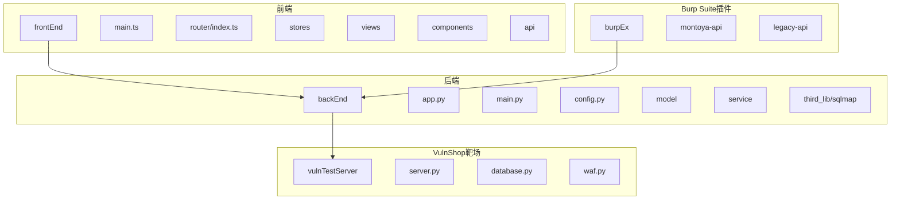
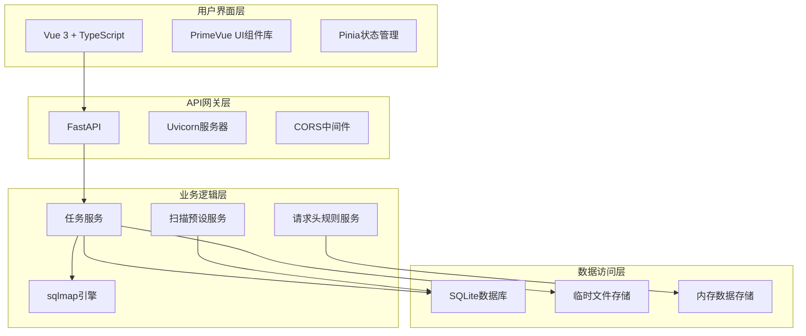
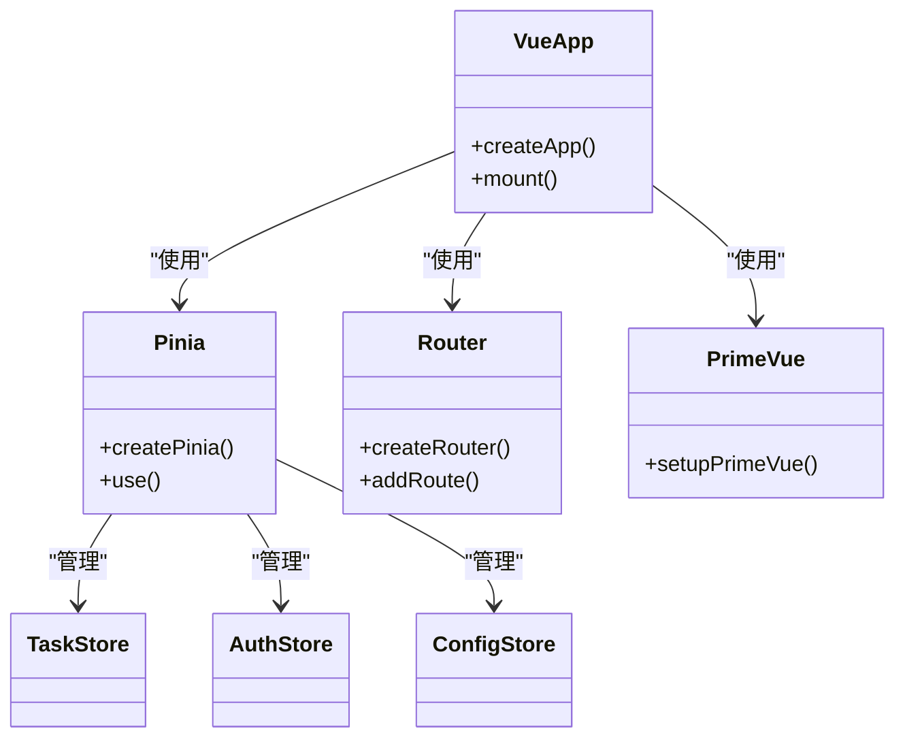
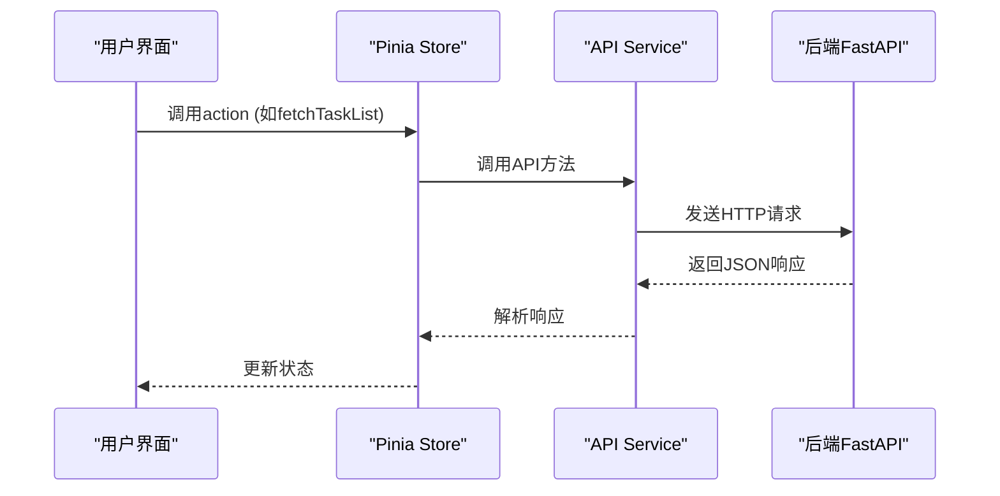
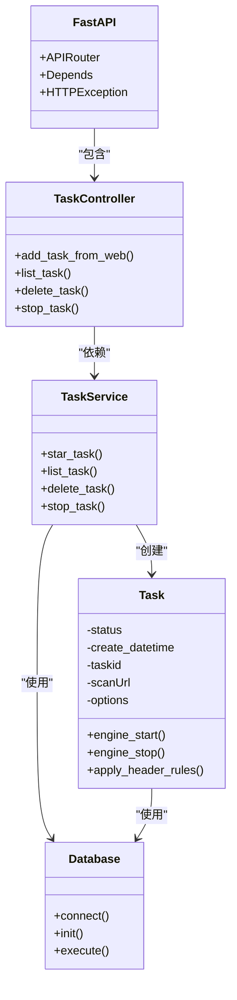
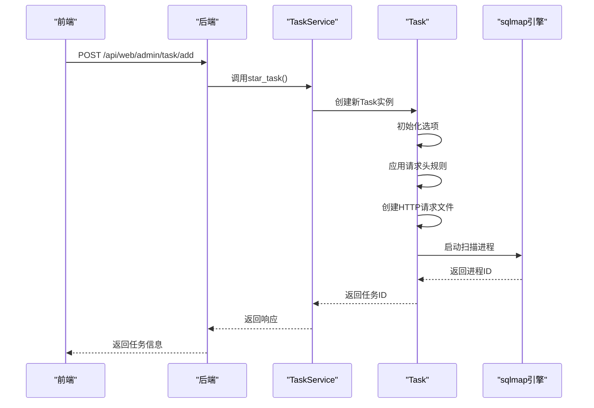
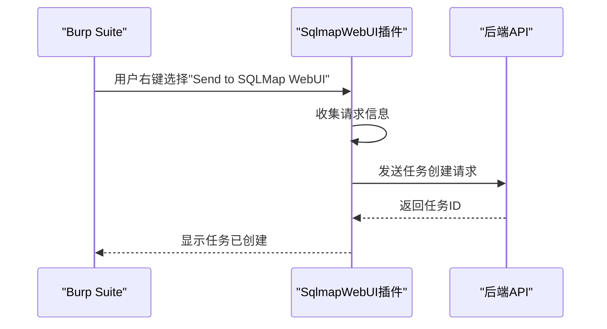
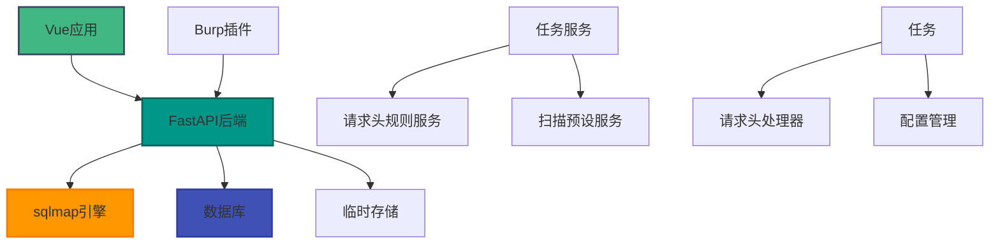

# 技术架构

<cite>
**本文档引用的文件**   
- [main.py](file://src/backEnd/main.py)
- [app.py](file://src/backEnd/app.py)
- [config.py](file://src/backEnd/config.py)
- [webTaskController.py](file://src/backEnd/api/commonApi/webTaskController.py)
- [Task.py](file://src/backEnd/model/Task.py)
- [taskService.py](file://src/backEnd/service/taskService.py)
- [SqlmapWebUIExtension.java](file://src/burpEx/montoya-api/src/main/java/com/sqlmapwebui/burp/SqlmapWebUIExtension.java)
- [SqlmapApiClient.java](file://src/burpEx/montoya-api/src/main/java/com/sqlmapwebui/burp/SqlmapApiClient.java)
- [main.ts](file://src/frontEnd/src/main.ts)
- [router/index.ts](file://src/frontEnd/src/router/index.ts)
- [task.ts](file://src/frontEnd/src/api/task.ts)
- [task.ts](file://src/frontEnd/src/stores/task.ts)
- [server.py](file://src/vulnTestServer/server.py)
</cite>

## 目录
1. [简介](#简介)
2. [项目结构](#项目结构)
3. [核心组件](#核心组件)
4. [架构概述](#架构概述)
5. [详细组件分析](#详细组件分析)
6. [依赖分析](#依赖分析)
7. [性能考虑](#性能考虑)
8. [故障排除指南](#故障排除指南)
9. [结论](#结论)

## 简介
sqlmapWebUI 是一个基于前后端分离架构的安全测试工具，旨在为安全研究人员提供一个直观、高效的SQL注入检测平台。该系统通过集成Burp Suite插件和VulnShop靶场，实现了从漏洞发现到验证的完整工作流。前端采用Vue 3 + TypeScript构建现代化用户界面，后端使用FastAPI提供高性能API服务，整体架构设计注重可扩展性和易用性。

## 项目结构
sqlmapWebUI项目采用模块化设计，清晰地分离了前端、后端、Burp Suite插件和VulnShop靶场四个主要部分。这种结构不仅便于开发和维护，还支持独立部署和测试。



**图源**
- [main.py](file://src/backEnd/main.py#L1-L168)
- [main.ts](file://src/frontEnd/src/main.ts#L1-L16)
- [SqlmapWebUIExtension.java](file://src/burpEx/montoya-api/src/main/java/com/sqlmapwebui/burp/SqlmapWebUIExtension.java#L1-L68)
- [server.py](file://src/vulnTestServer/server.py#L1-L685)

## 核心组件

sqlmapWebUI的核心组件包括前端Vue应用、后端FastAPI服务、Burp Suite插件和VulnShop靶场。这些组件通过明确定义的API接口进行通信，形成了一个完整的安全测试生态系统。

**节源**
- [main.py](file://src/backEnd/main.py#L1-L168)
- [main.ts](file://src/frontEnd/src/main.ts#L1-L16)
- [SqlmapWebUIExtension.java](file://src/burpEx/montoya-api/src/main/java/com/sqlmapwebui/burp/SqlmapWebUIExtension.java#L1-L68)
- [server.py](file://src/vulnTestServer/server.py#L1-L685)

## 架构概述

sqlmapWebUI采用前后端分离的微服务架构，各组件之间通过RESTful API进行通信。系统整体架构分为四个层次：用户界面层、API网关层、业务逻辑层和数据访问层。



**图源**
- [app.py](file://src/backEnd/app.py#L1-L80)
- [main.py](file://src/backEnd/main.py#L1-L168)
- [taskService.py](file://src/backEnd/service/taskService.py#L1-L535)
- [Task.py](file://src/backEnd/model/Task.py#L1-L333)

## 详细组件分析

### 前端架构分析
前端采用Vue 3 + TypeScript技术栈，利用Composition API提供更好的类型推断和代码组织能力。通过Pinia进行全局状态管理，实现了组件间的高效数据共享。

#### 前端依赖关系


**图源**
- [main.ts](file://src/frontEnd/src/main.ts#L1-L16)
- [router/index.ts](file://src/frontEnd/src/router/index.ts#L1-L77)
- [task.ts](file://src/frontEnd/src/stores/task.ts#L1-L390)

#### 前端API调用流程


**图源**
- [task.ts](file://src/frontEnd/src/stores/task.ts#L1-L390)
- [task.ts](file://src/frontEnd/src/api/task.ts#L1-L800)

### 后端架构分析
后端采用FastAPI框架，充分利用其异步特性和类型提示优势，提供了高性能的API服务。系统通过模块化设计将不同功能分离到独立的模块中。

#### 后端模块关系


**图源**
- [app.py](file://src/backEnd/app.py#L1-L80)
- [webTaskController.py](file://src/backEnd/api/commonApi/webTaskController.py#L1-L91)
- [taskService.py](file://src/backEnd/service/taskService.py#L1-L535)
- [Task.py](file://src/backEnd/model/Task.py#L1-L333)
- [Database.py](file://src/backEnd/model/Database.py)

#### 任务创建流程


**图源**
- [webTaskController.py](file://src/backEnd/api/commonApi/webTaskController.py#L1-L91)
- [taskService.py](file://src/backEnd/service/taskService.py#L1-L535)
- [Task.py](file://src/backEnd/model/Task.py#L1-L333)

### Burp Suite插件分析
Burp Suite插件作为桥梁，连接了安全测试人员的工作环境与sqlmapWebUI系统，实现了无缝的漏洞检测工作流。

#### 插件通信流程


**图源**
- [SqlmapWebUIExtension.java](file://src/burpEx/montoya-api/src/main/java/com/sqlmapwebui/burp/SqlmapWebUIExtension.java#L1-L68)
- [SqlmapApiClient.java](file://src/burpEx/montoya-api/src/main/java/com/sqlmapwebui/burp/SqlmapApiClient.java#L1-L209)

### VulnShop靶场集成
VulnShop靶场为sqlmapWebUI提供了真实的测试环境，包含了多种类型的SQL注入漏洞，用于验证扫描器的有效性。

#### 靶场漏洞类型
```mermaid
erDiagram
VULNERABILITY ||--o{ ENDPOINT : "has"
VULNERABILITY {
string type PK
string description
}
ENDPOINT {
string path PK
string method
string vulnerability_type FK
}
VULNERABILITY {
"基于错误的SQL注入"
"联合查询SQL注入"
"布尔盲注"
"时间盲注"
"堆叠查询注入"
"二次注入"
}
ENDPOINT {
"/api/user/login" "POST" "基于错误的SQL注入"
"/api/user/profile" "GET" "联合查询SQL注入"
"/api/products/search" "GET" "布尔盲注"
"/api/products/detail" "GET" "时间盲注"
"/api/orders/query" "GET" "堆叠查询注入"
"/api/user/register" "POST" "二次注入"
}
```

**图源**
- [server.py](file://src/vulnTestServer/server.py#L1-L685)

## 依赖分析

sqlmapWebUI系统的组件依赖关系复杂但清晰，各模块通过明确定义的接口进行交互，确保了系统的可维护性和可扩展性。



**图源**
- [app.py](file://src/backEnd/app.py#L1-L80)
- [main.py](file://src/backEnd/main.py#L1-L168)
- [taskService.py](file://src/backEnd/service/taskService.py#L1-L535)
- [Task.py](file://src/backEnd/model/Task.py#L1-L333)

## 性能考虑

sqlmapWebUI在性能方面进行了多项优化，确保系统在高负载下仍能稳定运行。

1. **异步处理**：后端采用FastAPI的异步特性，能够同时处理多个扫描任务，提高了系统吞吐量。
2. **连接池**：数据库连接采用连接池管理，减少了频繁创建和销毁连接的开销。
3. **缓存机制**：常用配置和预设扫描参数在内存中缓存，减少了数据库查询次数。
4. **资源限制**：通过配置文件限制最大并发任务数，防止系统资源耗尽。
5. **日志优化**：采用异步日志记录，避免日志写入阻塞主业务流程。

这些优化措施确保了sqlmapWebUI在处理大量扫描任务时仍能保持良好的响应性能。

## 故障排除指南

当遇到sqlmapWebUI系统问题时，可以按照以下步骤进行排查：

1. **检查服务状态**：确认后端FastAPI服务和前端Vue应用是否正常运行。
2. **查看日志文件**：检查后端日志，寻找错误信息和异常堆栈。
3. **验证网络连接**：确保前端、后端和Burp Suite插件之间的网络通信正常。
4. **检查配置文件**：确认配置文件中的参数设置正确，特别是数据库连接和临时文件路径。
5. **测试API端点**：使用curl或Postman直接测试关键API端点，验证其响应。
6. **监控资源使用**：检查CPU、内存和磁盘使用情况，确保系统资源充足。

通过系统化的排查流程，可以快速定位和解决大多数常见问题。

## 结论

sqlmapWebUI通过采用前后端分离架构，成功构建了一个功能强大且易于使用SQL注入检测平台。系统选择Vue 3 + TypeScript和FastAPI技术栈，不仅提供了现代化的开发体验，还确保了高性能和良好的可维护性。Burp Suite插件的集成使得安全测试人员能够无缝地将sqlmapWebUI融入现有工作流，而VulnShop靶场则为系统提供了真实的测试环境。整体架构设计合理，组件职责清晰，为未来的功能扩展和性能优化奠定了坚实基础。