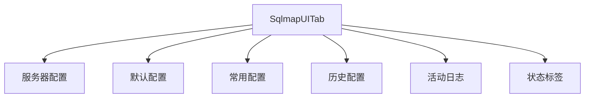
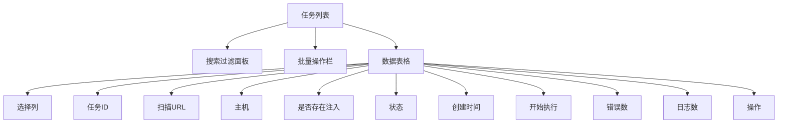
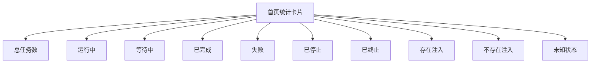
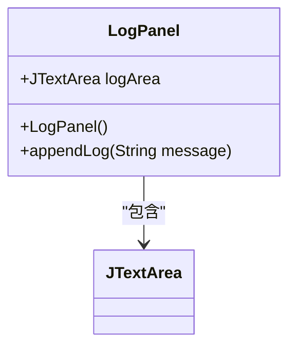
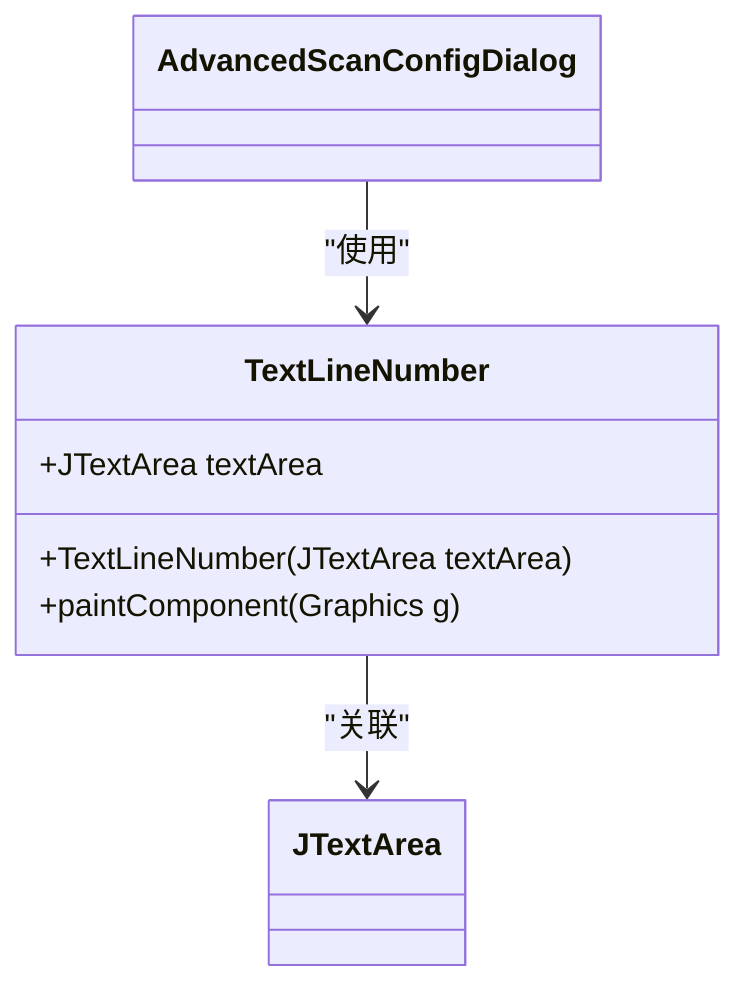
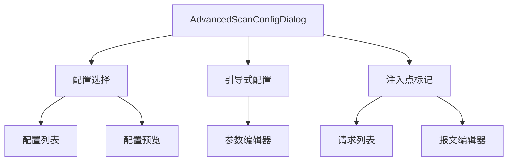

# UI界面

<cite>
**本文档引用的文件**  
- [SqlmapUITab.java](file://src/burpEx/montoya-api/src/main/java/com/sqlmapwebui/burp/SqlmapUITab.java)
- [AdvancedScanConfigDialog.java](file://src/burpEx/montoya-api/src/main/java/com/sqlmapwebui/burp/dialogs/AdvancedScanConfigDialog.java)
- [LogPanel.java](file://src/burpEx/montoya-api/src/main/java/com/sqlmapwebui/burp/panels/LogPanel.java)
- [TextLineNumber.java](file://src/burpEx/montoya-api/src/main/java/com/sqlmapwebui/burp/dialogs/TextLineNumber.java)
- [ServerConfigPanel.java](file://src/burpEx/montoya-api/src/main/java/com/sqlmapwebui/burp/panels/ServerConfigPanel.java)
- [DefaultConfigPanel.java](file://src/burpEx/montoya-api/src/main/java/com/sqlmapwebui/burp/panels/DefaultConfigPanel.java)
- [PresetConfigPanel.java](file://src/burpEx/montoya-api/src/main/java/com/sqlmapwebui/burp/panels/PresetConfigPanel.java)
- [HistoryConfigPanel.java](file://src/burpEx/montoya-api/src/main/java/com/sqlmapwebui/burp/panels/HistoryConfigPanel.java)
- [index.vue](file://src/frontEnd/src/views/Home/index.vue)
- [index.vue](file://src/frontEnd/src/views/TaskList/index.vue)
- [index.vue](file://src/frontEnd/src/views/TaskDetail/index.vue)
</cite>

## 目录
1. [简介](#简介)
2. [主界面布局](#主界面布局)
3. [任务列表](#任务列表)
4. [扫描进度条](#扫描进度条)
5. [日志显示区域](#日志显示区域)
6. [配置对话框](#配置对话框)
7. [界面操作指南](#界面操作指南)
8. [问题排查方案](#问题排查方案)

## 简介
SqlmapWebUI插件提供了一个完整的用户界面，用于管理和执行SQL注入安全测试。该界面集成在Burp Suite中，通过一个独立的标签页呈现，包含服务器配置、默认扫描配置、常用配置管理、历史配置管理和活动日志等多个功能模块。用户可以通过右键菜单将HTTP请求发送到SQLMap后端进行扫描，并通过Web前端界面查看详细的扫描结果和日志信息。

## 主界面布局

SqlmapUITab是插件的主界面，采用模块化设计，由多个功能面板组成。主界面顶部包含标题和状态指示，中间通过选项卡（JTabbedPane）组织不同的功能模块。

**图示来源**  
- [SqlmapUITab.java](file://src/burpEx/montoya-api/src/main/java/com/sqlmapwebui/burp/SqlmapUITab.java#L23-L185)

**主界面组件说明：**
- **标题区域**：显示"SQLMap WebUI Extension (Montoya API)"，右侧包含连接状态指示和"帮助/关于"按钮。
- **状态标签**：显示"● 未连接"或"● 已连接"，颜色分别为红色和绿色，直观反映与后端服务的连接状态。
- **功能选项卡**：
  - **服务器配置**：设置后端服务器的IP地址、端口和连接参数。
  - **默认配置**：管理默认的扫描参数，如Level、Risk、DBMS等。
  - **常用配置**：管理用户自定义的扫描配置，支持增删改查和高级搜索。
  - **历史配置**：显示最近的扫描配置记录，支持搜索和批量删除。
  - **活动日志**：实时显示系统操作和扫描日志。

**主界面源码引用**  
- [SqlmapUITab.java](file://src/burpEx/montoya-api/src/main/java/com/sqlmapwebui/burp/SqlmapUITab.java#L23-L185)

## 任务列表

任务列表在Web前端界面中展示，通过`TaskList/index.vue`组件实现。该列表以表格形式展示所有扫描任务，支持分页、排序、搜索和批量操作。

**图示来源**  
- [index.vue](file://src/frontEnd/src/views/TaskList/index.vue#L1-L1119)

**任务列表功能特点：**
- **搜索过滤**：支持按状态、注入状态等条件过滤任务，提供实时搜索功能。
- **批量操作**：当选择多个任务时，显示批量操作栏，支持停止、删除选中任务等操作。
- **数据表格**：
  - 支持分页显示，每页可显示10、20、50或100条记录。
  - 支持按任意列排序，点击列标题即可切换升序/降序。
  - 支持列宽调整和列冻结，确保关键信息始终可见。
- **交互功能**：
  - 点击任务ID可跳转到任务详情页。
  - 点击扫描URL可查看HTTP请求信息。
  - 点击"存在注入"标签可查看详细扫描结果。
  - 操作列提供查看、停止和删除任务的按钮。

**任务列表源码引用**  
- [index.vue](file://src/frontEnd/src/views/TaskList/index.vue#L1-L1119)

## 扫描进度条

扫描进度条功能通过任务状态的可视化展示来实现。在Web前端的首页（Home/index.vue）中，通过一组3D效果的统计卡片展示任务的进度和状态。

**图示来源**  
- [index.vue](file://src/frontEnd/src/views/Home/index.vue#L1-L742)

**扫描进度条特点：**
- **3D视觉效果**：每个统计卡片都有3D立体效果，鼠标悬停时会上升并产生阴影，增强交互感。
- **颜色编码**：不同状态使用不同的渐变色，如运行中为蓝色，失败为红色，成功为绿色。
- **动画效果**：运行中状态的图标有旋转动画，存在注入状态的图标有脉冲动画，直观反映任务状态。
- **交互功能**：点击任一统计卡片可跳转到任务列表页，并自动应用相应的过滤条件。

**扫描进度条源码引用**  
- [index.vue](file://src/frontEnd/src/views/Home/index.vue#L1-L742)

## 日志显示区域

日志显示区域由`LogPanel`类实现，位于主界面的"活动日志"选项卡中。该区域实时显示系统操作和扫描日志，支持日志清空功能。

**图示来源**  
- [LogPanel.java](file://src/burpEx/montoya-api/src/main/java/com/sqlmapwebui/burp/panels/LogPanel.java#L10-L54)

**日志显示区域功能：**
- **实时显示**：通过`appendLog`方法，使用`SwingUtilities.invokeLater`确保在事件调度线程中更新UI，实现日志的实时追加。
- **时间戳**：每条日志消息前自动添加当前时间戳，格式为"[HH:mm:ss]"。
- **自动滚动**：新日志添加后，文本区域会自动滚动到底部，确保最新日志始终可见。
- **样式设置**：
  - 使用等宽字体（Monospaced）确保日志对齐。
  - 背景色为深灰色（#1e1e1e），前景色为浅灰色（#c8c8c8），模拟终端效果。
  - 光标颜色为白色，便于在深色背景下查看。
- **控制按钮**：底部包含"清空日志"按钮，可一键清除所有日志内容。

**行号显示**：`TextLineNumber`组件为日志编辑器提供行号显示功能。它通过监听文档变化事件，在`paintComponent`方法中绘制行号。

**图示来源**  
- [TextLineNumber.java](file://src/burpEx/montoya-api/src/main/java/com/sqlmapwebui/burp/dialogs/TextLineNumber.java#L9-L43)

**日志显示区域源码引用**  
- [LogPanel.java](file://src/burpEx/montoya-api/src/main/java/com/sqlmapwebui/burp/panels/LogPanel.java#L10-L54)
- [TextLineNumber.java](file://src/burpEx/montoya-api/src/main/java/com/sqlmapwebui/burp/dialogs/TextLineNumber.java#L9-L43)

## 配置对话框

配置对话框主要指`AdvancedScanConfigDialog`，当用户在Burp Suite中右键选择"Send to SQLMap WebUI (选择配置)..."时弹出。该对话框整合了配置选择、引导式扫描配置和注入点标记三大功能。

**图示来源**  
- [AdvancedScanConfigDialog.java](file://src/burpEx/montoya-api/src/main/java/com/sqlmapwebui/burp/dialogs/AdvancedScanConfigDialog.java#L26-L800)

### 配置选择
- **配置来源**：支持使用默认配置、从常用配置中选择或使用最近历史配置。
- **配置预览**：右侧实时显示选中配置的命令行参数详情。
- **交互逻辑**：勾选"使用默认配置"时，配置列表禁用；取消勾选后可从列表中选择特定配置。

### 引导式配置
- **参数编辑器**：使用`GuidedParamEditor`组件，通过图形界面选择扫描参数，如Level、Risk、DBMS等。
- **命令行预览**：根据用户选择的参数，实时生成并显示对应的命令行字符串。
- **参数转换**：通过`ScanConfigParser`将命令行参数解析为`ScanConfig`对象。

### 注入点标记
- **使用条件**：仅当选择的纯文本报文数量不超过最大标记数量（默认5个）时显示此选项卡。
- **请求列表**：左侧表格显示所有待扫描的请求，支持按方法、URL等字段搜索。
- **报文编辑器**：右侧文本区域显示选中请求的原始报文，支持插入"*"标记注入点。
- **实时统计**：显示当前编辑器中的标记数量，超过1个时显示为绿色。
- **工具按钮**：
  - "插入标记 (*)"：在光标位置插入"*"。
  - "清除所有标记"：移除报文中的所有"*"。
- **可折叠说明**：顶部包含使用说明，可展开/收起，示例如"id=1*→只测试id参数"。

**配置对话框源码引用**  
- [AdvancedScanConfigDialog.java](file://src/burpEx/montoya-api/src/main/java/com/sqlmapwebui/burp/dialogs/AdvancedScanConfigDialog.java#L26-L800)

## 界面操作指南

### 查看扫描进度
1. 在Burp Suite的"Target"或"Proxy"等标签页中，右键点击HTTP请求。
2. 选择"Send to SQLMap WebUI"或"Send to SQLMap WebUI (选择配置)..."。
3. 转到Web前端界面，首页的统计卡片会实时更新任务状态。
4. 点击"运行中"卡片可查看所有正在扫描的任务。

### 过滤日志信息
1. 在主界面的"活动日志"选项卡中，使用"清空日志"按钮清除旧日志。
2. 在`AdvancedScanConfigDialog`的注入点标记选项卡中，使用搜索框过滤请求列表。
3. 在Web前端的任务详情页，使用高级搜索功能过滤日志和错误记录，支持正则表达式、大小写敏感和反选等选项。

### 导出扫描结果
1. 在Web前端的任务详情页，切换到"扫描结果"或"错误记录"标签页。
2. 点击"复制到剪贴板"按钮，将结果复制到系统剪贴板。
3. 在`PresetConfigPanel`中，使用"导出"按钮将常用配置导出为JSON文件。

## 问题排查方案

### 界面显示异常
- **症状**：主界面选项卡无法显示，或组件错位。
- **排查步骤**：
  1. 检查Java版本是否为8或11，不兼容的版本可能导致UI渲染异常。
  2. 检查Burp Suite的Java内存设置，增加内存分配（如-Xmx2g）。
  3. 清除Burp Suite的配置缓存，重启Burp Suite。
  4. 检查`sqlmap-webui-config.properties`文件是否有语法错误。

### 日志刷新延迟
- **症状**：日志消息不能实时显示，或出现卡顿。
- **排查步骤**：
  1. 检查后端服务是否响应缓慢，使用"测试连接"验证网络延迟。
  2. 减少同时扫描的任务数量，避免日志产生过快。
  3. 在`DefaultConfigPanel`中关闭"自动去重"功能，减少日志量。
  4. 检查系统资源使用情况，CPU或内存过高可能导致UI线程阻塞。

**问题排查方案源码引用**  
- [ServerConfigPanel.java](file://src/burpEx/montoya-api/src/main/java/com/sqlmapwebui/burp/panels/ServerConfigPanel.java#L51-L782)
- [DefaultConfigPanel.java](file://src/burpEx/montoya-api/src/main/java/com/sqlmapwebui/burp/panels/DefaultConfigPanel.java#L24-L885)