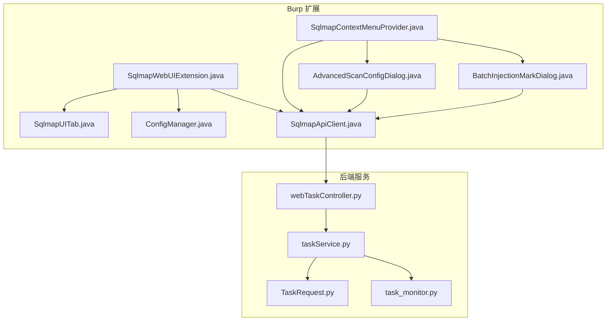
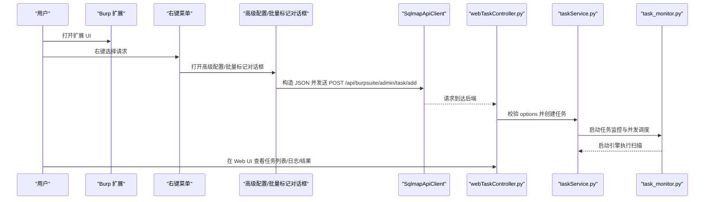
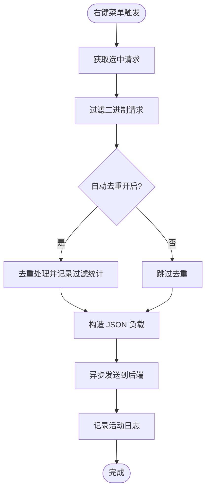
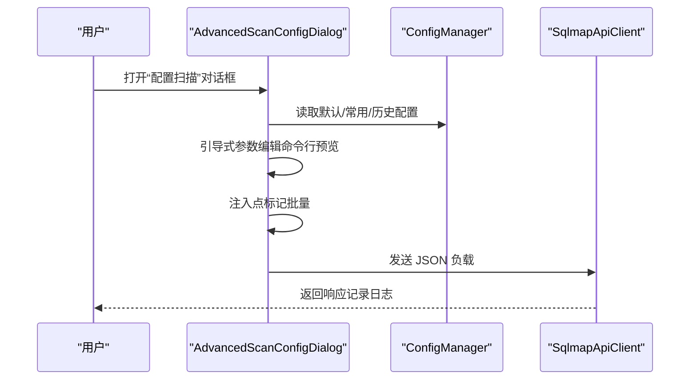
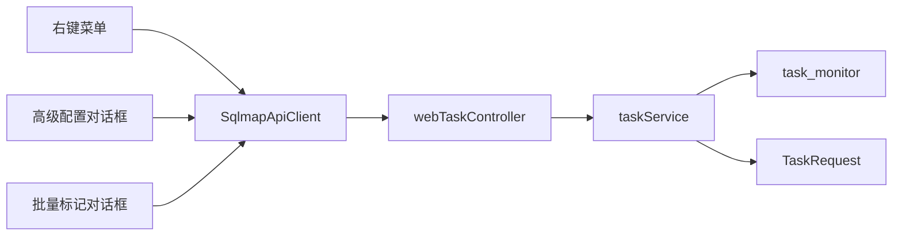

# 插件功能使用

<cite>
**本文引用的文件**
- [README.md](file://README.md)
- [doc/USAGE_GUIDE.md](file://doc/USAGE_GUIDE.md)
- [src/burpEx/montoya-api/src/main/java/com/sqlmapwebui/burp/SqlmapWebUIExtension.java](file://src/burpEx/montoya-api/src/main/java/com/sqlmapwebui/burp/SqlmapWebUIExtension.java)
- [src/burpEx/montoya-api/src/main/java/com/sqlmapwebui/burp/SqlmapContextMenuProvider.java](file://src/burpEx/montoya-api/src/main/java/com/sqlmapwebui/burp/SqlmapContextMenuProvider.java)
- [src/burpEx/montoya-api/src/main/java/com/sqlmapwebui/burp/SqlmapUITab.java](file://src/burpEx/montoya-api/src/main/java/com/sqlmapwebui/burp/SqlmapUITab.java)
- [src/burpEx/montoya-api/src/main/java/com/sqlmapwebui/burp/ConfigManager.java](file://src/burpEx/montoya-api/src/main/java/com/sqlmapwebui/burp/ConfigManager.java)
- [src/burpEx/montoya-api/src/main/java/com/sqlmapwebui/burp/SqlmapApiClient.java](file://src/burpEx/montoya-api/src/main/java/com/sqlmapwebui/burp/SqlmapApiClient.java)
- [src/burpEx/montoya-api/src/main/java/com/sqlmapwebui/burp/dialogs/AdvancedScanConfigDialog.java](file://src/burpEx/montoya-api/src/main/java/com/sqlmapwebui/burp/dialogs/AdvancedScanConfigDialog.java)
- [src/burpEx/montoya-api/src/main/java/com/sqlmapwebui/burp/dialogs/BatchInjectionMarkDialog.java](file://src/burpEx/montoya-api/src/main/java/com/sqlmapwebui/burp/dialogs/BatchInjectionMarkDialog.java)
- [src/backEnd/api/commonApi/webTaskController.py](file://src/backEnd/api/commonApi/webTaskController.py)
- [src/backEnd/service/taskService.py](file://src/backEnd/service/taskService.py)
- [src/backEnd/model/requestModel/TaskRequest.py](file://src/backEnd/model/requestModel/TaskRequest.py)
- [src/backEnd/utils/task_monitor.py](file://src/backEnd/utils/task_monitor.py)
</cite>

## 目录
1. [简介](#简介)
2. [项目结构](#项目结构)
3. [核心组件](#核心组件)
4. [架构总览](#架构总览)
5. [详细组件分析](#详细组件分析)
6. [依赖关系分析](#依赖关系分析)
7. [性能考虑](#性能考虑)
8. [故障排查指南](#故障排查指南)
9. [结论](#结论)
10. [附录](#附录)

## 简介
本文件面向 Burp Suite 扩展使用者，系统化介绍“SQLMap WebUI”插件的功能与使用方法，重点覆盖：
- 通过右键菜单将 HTTP 请求发送至 sqlmapWebUI 进行扫描，包括请求选择、参数标记与扫描配置传递
- 插件 UI 界面的组成与职责，如任务监控面板、日志显示窗口与扫描进度条
- 不同扫描模式的适用场景与配置方法
- 实际使用案例：从 Burp 拦截请求到 Web UI 查看结果的完整工作流
- 高级技巧：快捷键操作、批量处理与结果导出
- 常见问题与解决方案：请求发送失败、参数解析错误、扫描结果不同步等

## 项目结构
该项目由三部分组成：
- 后端服务（FastAPI + SQLMap 集成）
- 前端 Web 应用（Vue 3 + TypeScript）
- Burp Suite 扩展（Montoya API）

图表来源
- [src/burpEx/montoya-api/src/main/java/com/sqlmapwebui/burp/SqlmapWebUIExtension.java](file://src/burpEx/montoya-api/src/main/java/com/sqlmapwebui/burp/SqlmapWebUIExtension.java#L1-L68)
- [src/burpEx/montoya-api/src/main/java/com/sqlmapwebui/burp/SqlmapContextMenuProvider.java](file://src/burpEx/montoya-api/src/main/java/com/sqlmapwebui/burp/SqlmapContextMenuProvider.java#L1-L348)
- [src/burpEx/montoya-api/src/main/java/com/sqlmapwebui/burp/SqlmapUITab.java](file://src/burpEx/montoya-api/src/main/java/com/sqlmapwebui/burp/SqlmapUITab.java#L1-L186)
- [src/burpEx/montoya-api/src/main/java/com/sqlmapwebui/burp/ConfigManager.java](file://src/burpEx/montoya-api/src/main/java/com/sqlmapwebui/burp/ConfigManager.java#L1-L406)
- [src/burpEx/montoya-api/src/main/java/com/sqlmapwebui/burp/SqlmapApiClient.java](file://src/burpEx/montoya-api/src/main/java/com/sqlmapwebui/burp/SqlmapApiClient.java#L1-L209)
- [src/backEnd/api/commonApi/webTaskController.py](file://src/backEnd/api/commonApi/webTaskController.py#L1-L91)
- [src/backEnd/service/taskService.py](file://src/backEnd/service/taskService.py#L1-L535)
- [src/backEnd/model/requestModel/TaskRequest.py](file://src/backEnd/model/requestModel/TaskRequest.py#L1-L57)
- [src/backEnd/utils/task_monitor.py](file://src/backEnd/utils/task_monitor.py#L1-L94)

章节来源
- [README.md](file://README.md#L1-L321)

## 核心组件
- 扩展入口与 UI Tab
  - 扩展入口负责注册 UI Tab、右键菜单与日志输出；UI Tab 提供服务器配置、默认配置、常用配置、历史配置与活动日志五个标签页。
- 右键菜单与对话框
  - 右键菜单提供“发送到 SQLMap WebUI”“标记注入点并扫描”“高级配置发送”等能力；支持批量选择与二进制过滤。
- 配置管理
  - 默认配置、常用配置、历史配置三类扫描参数集合；支持自动去重、注入点标记数量限制、二进制报文警告等行为开关。
- API 客户端
  - 通过 OkHttp 向后端发送任务、会话 Header、持久化 Header 规则等请求。
- 后端任务处理
  - Web 控制器接收请求，调用任务服务创建任务并启动引擎；任务监控根据 CPU 与并发策略调度执行。

章节来源
- [src/burpEx/montoya-api/src/main/java/com/sqlmapwebui/burp/SqlmapWebUIExtension.java](file://src/burpEx/montoya-api/src/main/java/com/sqlmapwebui/burp/SqlmapWebUIExtension.java#L1-L68)
- [src/burpEx/montoya-api/src/main/java/com/sqlmapwebui/burp/SqlmapUITab.java](file://src/burpEx/montoya-api/src/main/java/com/sqlmapwebui/burp/SqlmapUITab.java#L1-L186)
- [src/burpEx/montoya-api/src/main/java/com/sqlmapwebui/burp/SqlmapContextMenuProvider.java](file://src/burpEx/montoya-api/src/main/java/com/sqlmapwebui/burp/SqlmapContextMenuProvider.java#L1-L348)
- [src/burpEx/montoya-api/src/main/java/com/sqlmapwebui/burp/ConfigManager.java](file://src/burpEx/montoya-api/src/main/java/com/sqlmapwebui/burp/ConfigManager.java#L1-L406)
- [src/burpEx/montoya-api/src/main/java/com/sqlmapwebui/burp/SqlmapApiClient.java](file://src/burpEx/montoya-api/src/main/java/com/sqlmapwebui/burp/SqlmapApiClient.java#L1-L209)
- [src/backEnd/api/commonApi/webTaskController.py](file://src/backEnd/api/commonApi/webTaskController.py#L1-L91)
- [src/backEnd/service/taskService.py](file://src/backEnd/service/taskService.py#L1-L535)
- [src/backEnd/utils/task_monitor.py](file://src/backEnd/utils/task_monitor.py#L1-L94)

## 架构总览
从 Burp 右键菜单到 Web UI 结果的端到端流程如下：

图表来源
- [src/burpEx/montoya-api/src/main/java/com/sqlmapwebui/burp/SqlmapContextMenuProvider.java](file://src/burpEx/montoya-api/src/main/java/com/sqlmapwebui/burp/SqlmapContextMenuProvider.java#L1-L348)
- [src/burpEx/montoya-api/src/main/java/com/sqlmapwebui/burp/dialogs/AdvancedScanConfigDialog.java](file://src/burpEx/montoya-api/src/main/java/com/sqlmapwebui/burp/dialogs/AdvancedScanConfigDialog.java#L1-L800)
- [src/burpEx/montoya-api/src/main/java/com/sqlmapwebui/burp/dialogs/BatchInjectionMarkDialog.java](file://src/burpEx/montoya-api/src/main/java/com/sqlmapwebui/burp/dialogs/BatchInjectionMarkDialog.java#L1-L654)
- [src/burpEx/montoya-api/src/main/java/com/sqlmapwebui/burp/SqlmapApiClient.java](file://src/burpEx/montoya-api/src/main/java/com/sqlmapwebui/burp/SqlmapApiClient.java#L1-L209)
- [src/backEnd/api/commonApi/webTaskController.py](file://src/backEnd/api/commonApi/webTaskController.py#L1-L91)
- [src/backEnd/service/taskService.py](file://src/backEnd/service/taskService.py#L1-L535)
- [src/backEnd/utils/task_monitor.py](file://src/backEnd/utils/task_monitor.py#L1-L94)

## 详细组件分析

### 右键菜单与请求发送
- 功能概览
  - “发送到 SQLMap WebUI”：使用默认配置发送
  - “标记注入点并扫描 (*)”：批量标记注入点后发送
  - “发送到 SQLMap WebUI（配置扫描）...”：打开高级配置对话框，支持选择/编辑配置与注入点标记
  - 单条请求时额外提供“提交会话Header”“提交Header规则”
- 过滤与统计
  - 自动过滤二进制请求，仅发送纯文本请求
  - 支持自动去重（可配置）
  - 统计最终发送数量与被过滤数量
- 配置传递
  - 将请求的 URL、Host、Headers、Body 与 options（扫描参数）打包为 JSON，POST 到后端接口

图表来源
- [src/burpEx/montoya-api/src/main/java/com/sqlmapwebui/burp/SqlmapContextMenuProvider.java](file://src/burpEx/montoya-api/src/main/java/com/sqlmapwebui/burp/SqlmapContextMenuProvider.java#L1-L348)

章节来源
- [src/burpEx/montoya-api/src/main/java/com/sqlmapwebui/burp/SqlmapContextMenuProvider.java](file://src/burpEx/montoya-api/src/main/java/com/sqlmapwebui/burp/SqlmapContextMenuProvider.java#L1-L348)

### 高级配置与注入点标记
- 配置选择
  - 支持默认配置、常用配置、历史配置三类；可预览配置详情
- 引导式参数编辑
  - 可视化参数编辑，实时预览生成的命令行参数
- 注入点标记
  - 在请求中使用“*”标记注入点；支持批量标记（受数量限制）
  - 支持搜索过滤、插入标记、清除标记、标记数统计

图表来源
- [src/burpEx/montoya-api/src/main/java/com/sqlmapwebui/burp/dialogs/AdvancedScanConfigDialog.java](file://src/burpEx/montoya-api/src/main/java/com/sqlmapwebui/burp/dialogs/AdvancedScanConfigDialog.java#L1-L800)
- [src/burpEx/montoya-api/src/main/java/com/sqlmapwebui/burp/ConfigManager.java](file://src/burpEx/montoya-api/src/main/java/com/sqlmapwebui/burp/ConfigManager.java#L1-L406)
- [src/burpEx/montoya-api/src/main/java/com/sqlmapwebui/burp/SqlmapApiClient.java](file://src/burpEx/montoya-api/src/main/java/com/sqlmapwebui/burp/SqlmapApiClient.java#L1-L209)

章节来源
- [src/burpEx/montoya-api/src/main/java/com/sqlmapwebui/burp/dialogs/AdvancedScanConfigDialog.java](file://src/burpEx/montoya-api/src/main/java/com/sqlmapwebui/burp/dialogs/AdvancedScanConfigDialog.java#L1-L800)
- [src/burpEx/montoya-api/src/main/java/com/sqlmapwebui/burp/dialogs/BatchInjectionMarkDialog.java](file://src/burpEx/montoya-api/src/main/java/com/sqlmapwebui/burp/dialogs/BatchInjectionMarkDialog.java#L1-L654)

### 批量处理与结果导出
- 批量停止/删除：在任务列表中多选后批量操作
- 批量导入：支持批量导入 HTTP 请求创建扫描任务
- 结果导出：在 Web UI 中查看任务详情、日志与结果，结合后端接口可导出相关数据

章节来源
- [doc/USAGE_GUIDE.md](file://doc/USAGE_GUIDE.md#L1-L575)

### 插件 UI 组件功能
- 服务器配置：设置后端 URL、测试连接、查看连接状态
- 默认配置：设置全局默认扫描参数
- 常用配置：保存常用配置组合，支持 CRUD
- 历史配置：查看历史扫描使用过的配置
- 活动日志：记录发送历史与后端响应

章节来源
- [src/burpEx/montoya-api/src/main/java/com/sqlmapwebui/burp/SqlmapUITab.java](file://src/burpEx/montoya-api/src/main/java/com/sqlmapwebui/burp/SqlmapUITab.java#L1-L186)
- [src/burpEx/montoya-api/src/main/java/com/sqlmapwebui/burp/ConfigManager.java](file://src/burpEx/montoya-api/src/main/java/com/sqlmapwebui/burp/ConfigManager.java#L1-L406)

### 扫描模式与配置方法
- 默认配置：适用于大多数扫描任务
- 常用配置：保存特定场景的参数组合
- 历史配置：复用之前扫描的配置
- 引导式编辑器：可视化参数配置，实时预览命令行参数

章节来源
- [doc/USAGE_GUIDE.md](file://doc/USAGE_GUIDE.md#L1-L575)
- [src/burpEx/montoya-api/src/main/java/com/sqlmapwebui/burp/ConfigManager.java](file://src/burpEx/montoya-api/src/main/java/com/sqlmapwebui/burp/ConfigManager.java#L1-L406)

### 从 Burp 到 Web UI 的完整工作流
- 在 Burp 中拦截或查看请求
- 右键选择“发送到 SQLMap WebUI”或“发送到 SQLMap WebUI（配置扫描）...”
- 在对话框中选择/编辑配置与注入点标记
- 在 Web UI 中查看任务列表、日志与结果

章节来源
- [doc/USAGE_GUIDE.md](file://doc/USAGE_GUIDE.md#L1-L575)
- [src/burpEx/montoya-api/src/main/java/com/sqlmapwebui/burp/SqlmapContextMenuProvider.java](file://src/burpEx/montoya-api/src/main/java/com/sqlmapwebui/burp/SqlmapContextMenuProvider.java#L1-L348)

## 依赖关系分析
- 扩展层依赖
  - 扩展入口依赖 UI Tab、配置管理器与 API 客户端
  - 右键菜单依赖配置管理器、API 客户端与对话框
- 后端依赖
  - Web 控制器依赖任务服务
  - 任务服务依赖数据存储、任务状态与监控器
- 外部依赖
  - OkHttp 用于 HTTP 通信
  - SQLMap 引擎用于扫描执行

图表来源
- [src/burpEx/montoya-api/src/main/java/com/sqlmapwebui/burp/SqlmapContextMenuProvider.java](file://src/burpEx/montoya-api/src/main/java/com/sqlmapwebui/burp/SqlmapContextMenuProvider.java#L1-L348)
- [src/burpEx/montoya-api/src/main/java/com/sqlmapwebui/burp/dialogs/AdvancedScanConfigDialog.java](file://src/burpEx/montoya-api/src/main/java/com/sqlmapwebui/burp/dialogs/AdvancedScanConfigDialog.java#L1-L800)
- [src/burpEx/montoya-api/src/main/java/com/sqlmapwebui/burp/dialogs/BatchInjectionMarkDialog.java](file://src/burpEx/montoya-api/src/main/java/com/sqlmapwebui/burp/dialogs/BatchInjectionMarkDialog.java#L1-L654)
- [src/burpEx/montoya-api/src/main/java/com/sqlmapwebui/burp/SqlmapApiClient.java](file://src/burpEx/montoya-api/src/main/java/com/sqlmapwebui/burp/SqlmapApiClient.java#L1-L209)
- [src/backEnd/api/commonApi/webTaskController.py](file://src/backEnd/api/commonApi/webTaskController.py#L1-L91)
- [src/backEnd/service/taskService.py](file://src/backEnd/service/taskService.py#L1-L535)
- [src/backEnd/model/requestModel/TaskRequest.py](file://src/backEnd/model/requestModel/TaskRequest.py#L1-L57)
- [src/backEnd/utils/task_monitor.py](file://src/backEnd/utils/task_monitor.py#L1-L94)

## 性能考虑
- 并发与调度
  - 任务监控根据 CPU 核心数与 CPU 占用率动态计算最大并发任务数，避免资源争用
- 扫描参数
  - 通过“Level”“Risk”“Technique”等参数控制扫描强度与速度
- 批量处理
  - 自动去重减少重复任务，提升整体效率

章节来源
- [src/backEnd/utils/task_monitor.py](file://src/backEnd/utils/task_monitor.py#L1-L94)
- [src/backEnd/service/taskService.py](file://src/backEnd/service/taskService.py#L1-L535)

## 故障排查指南
- 后端服务启动失败
  - 检查 Python 版本与依赖安装
- 前端无法连接后端
  - 检查跨域配置与后端监听端口
- VulnShop 靶场无法访问
  - 确认端口未被占用，使用 127.0.0.1
- Burp 插件无法发送请求
  - 检查后端服务器地址配置，使用“测试连接”验证
- 扫描任务一直 Pending
  - 检查 SQLMap 集成与后端日志
- 请求头规则不生效
  - 检查规则是否启用与作用域匹配
- 会话 Header 过期
  - 会话 Header 有 TTL 限制，过期后需重新添加

章节来源
- [doc/USAGE_GUIDE.md](file://doc/USAGE_GUIDE.md#L1-L575)

## 结论
本插件为 Burp Suite 用户提供了高效、可视化的 SQL 注入扫描入口，支持默认配置、常用配置与历史配置的灵活切换，以及注入点标记与批量处理等高级功能。通过清晰的 UI 与完善的日志记录，用户可从拦截请求到查看结果形成闭环工作流。

## 附录
- 快捷键与操作建议
  - 使用“发送到 SQLMap WebUI（配置扫描）...”进行参数定制
  - 使用“标记注入点并扫描 (*)”精确控制参数范围
  - 在 UI 中启用自动去重与合理的历史记录数量限制
- 结果导出
  - 在 Web UI 中查看任务详情、日志与结果，结合后端接口导出所需数据

章节来源
- [doc/USAGE_GUIDE.md](file://doc/USAGE_GUIDE.md#L1-L575)