# 核心功能

<cite>
**本文档引用的文件**
- [BurpExtender.java](file://src/burpEx/legacy-api/src/main/java/com/sqlmapwebui/burp/BurpExtender.java)
- [SqlmapWebUIExtension.java](file://src/burpEx/montoya-api/src/main/java/com/sqlmapwebui/burp/SqlmapWebUIExtension.java)
- [RequestDeduplicator.java](file://src/burpEx/legacy-api/src/main/java/com/sqlmapwebui/burp/RequestDeduplicator.java)
- [RequestDeduplicator.java](file://src/burpEx/montoya-api/src/main/java/com/sqlmapwebui/burp/RequestDeduplicator.java)
- [ApiClient.java](file://src/burpEx/legacy-api/src/main/java/com/sqlmapwebui/burp/ApiClient.java)
- [SqlmapApiClient.java](file://src/burpEx/montoya-api/src/main/java/com/sqlmapwebui/burp/SqlmapApiClient.java)
- [ConfigManager.java](file://src/burpEx/legacy-api/src/main/java/com/sqlmapwebui/burp/ConfigManager.java)
- [ConfigManager.java](file://src/burpEx/montoya-api/src/main/java/com/sqlmapwebui/burp/ConfigManager.java)
- [ScanConfig.java](file://src/burpEx/legacy-api/src/main/java/com/sqlmapwebui/burp/ScanConfig.java)
- [ScanConfig.java](file://src/burpEx/montoya-api/src/main/java/com/sqlmapwebui/burp/ScanConfig.java)
- [app.py](file://src/backEnd/app.py)
- [README.md](file://src/backEnd/README.md)
</cite>

## 目录
1. [集成机制概述](#集成机制概述)
2. [右键菜单功能实现原理](#右键菜单功能实现原理)
3. [请求去重机制](#请求去重机制)
4. [API版本差异与兼容性](#api版本差异与兼容性)
5. [后端API交互示例](#后端api交互示例)
6. [请求发送失败处理](#请求发送失败处理)
7. [性能优化建议](#性能优化建议)

## 集成机制概述

Burp Suite插件与sqlmapWebUI的集成机制基于Java扩展开发，通过HTTP API与后端Python服务进行通信。插件分为两个版本：Legacy API（传统API）和Montoya API（新API），分别支持不同版本的Burp Suite。核心功能包括扫描任务提交、配置管理、请求头规则处理等。后端服务基于FastAPI框架构建，提供RESTful API接口，处理来自Burp Suite插件的请求，并与SQLMap引擎进行交互。

**Section sources**
- [BurpExtender.java](file://src/burpEx/legacy-api/src/main/java/com/sqlmapwebui/burp/BurpExtender.java#L1-L390)
- [SqlmapWebUIExtension.java](file://src/burpEx/montoya-api/src/main/java/com/sqlmapwebui/burp/SqlmapWebUIExtension.java#L1-L68)
- [app.py](file://src/backEnd/app.py#L1-L80)

## 右键菜单功能实现原理

右键菜单功能的实现基于Burp Suite的扩展API，通过`IContextMenuFactory`（Legacy API）或`ContextMenuItemsProvider`（Montoya API）接口注册上下文菜单项。当用户在Burp Suite中右键点击HTTP请求时，插件会根据当前上下文创建相应的菜单项。

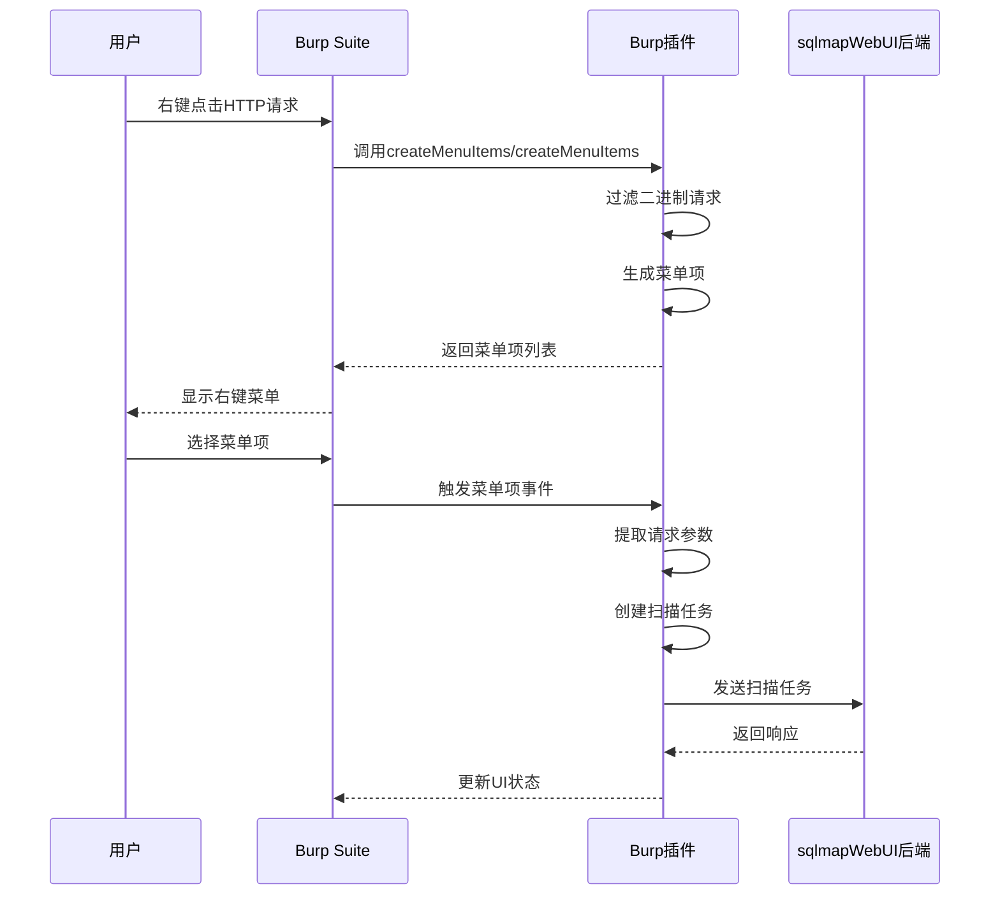

**Diagram sources**
- [BurpExtender.java](file://src/burpEx/legacy-api/src/main/java/com/sqlmapwebui/burp/BurpExtender.java#L144-L239)
- [SqlmapContextMenuProvider.java](file://src/burpEx/montoya-api/src/main/java/com/sqlmapwebui/burp/SqlmapContextMenuProvider.java#L103-L203)

### HTTP请求捕获

HTTP请求捕获通过Burp Suite的`IContextMenuInvocation`接口实现。插件获取用户选中的HTTP请求，包括请求行、请求头和请求体。对于二进制内容的请求，插件会进行过滤，只处理纯文本请求。

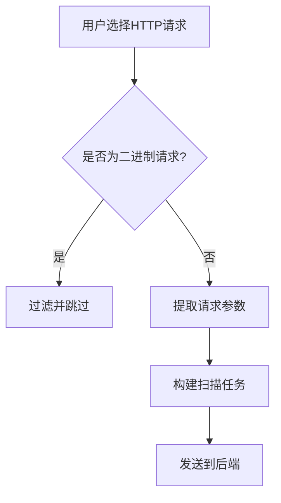

**Diagram sources**
- [BurpExtender.java](file://src/burpEx/legacy-api/src/main/java/com/sqlmapwebui/burp/BurpExtender.java#L159-L165)
- [SqlmapContextMenuProvider.java](file://src/burpEx/montoya-api/src/main/java/com/sqlmapwebui/burp/SqlmapContextMenuProvider.java#L113-L129)

### 参数提取

参数提取过程包括解析HTTP请求的各个部分：
- **URL参数**：从请求URL中提取查询参数
- **请求头**：获取所有HTTP头信息
- **请求体**：提取POST请求的body内容
- **扫描配置**：根据用户选择的配置提取相应的扫描参数

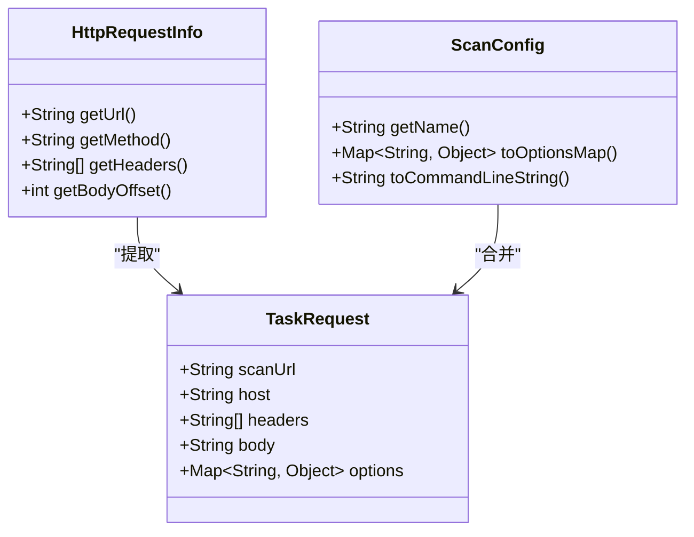

**Diagram sources**
- [BurpExtender.java](file://src/burpEx/legacy-api/src/main/java/com/sqlmapwebui/burp/BurpExtender.java#L316-L335)
- [SqlmapContextMenuProvider.java](file://src/burpEx/montoya-api/src/main/java/com/sqlmapwebui/burp/SqlmapContextMenuProvider.java#L263-L317)

### 扫描任务创建流程

扫描任务创建流程包括以下步骤：
1. 用户通过右键菜单选择扫描选项
2. 插件捕获选中的HTTP请求
3. 提取请求参数和扫描配置
4. 构建JSON格式的任务请求
5. 通过HTTP POST请求发送到后端API
6. 处理后端响应并更新UI

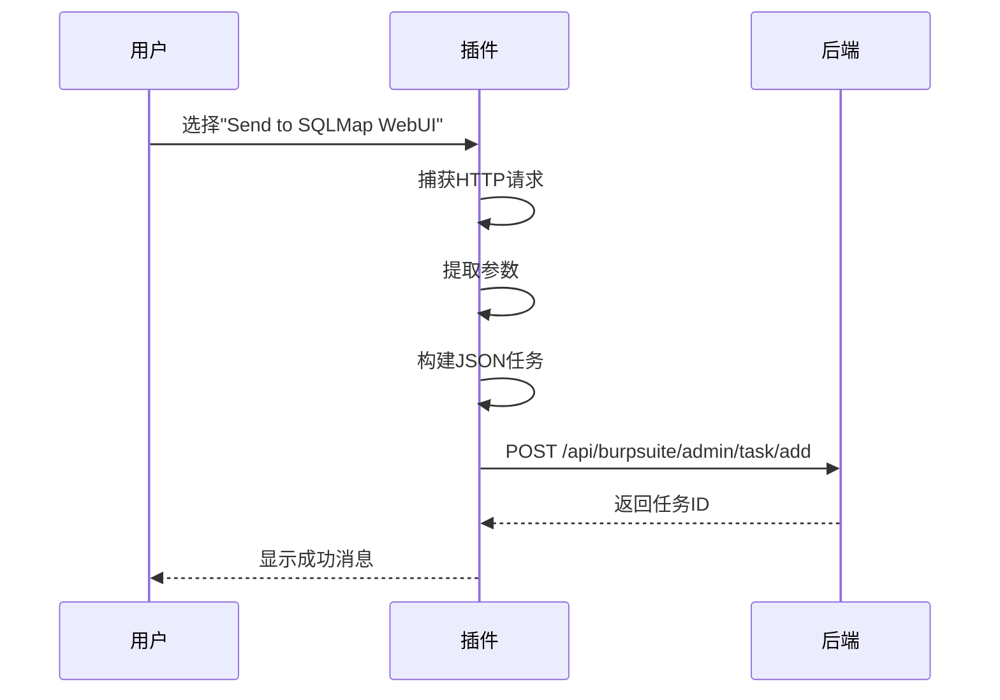

**Diagram sources**
- [BurpExtender.java](file://src/burpEx/legacy-api/src/main/java/com/sqlmapwebui/burp/BurpExtender.java#L361-L374)
- [SqlmapApiClient.java](file://src/burpEx/montoya-api/src/main/java/com/sqlmapwebui/burp/SqlmapApiClient.java#L63-L78)

## 请求去重机制

请求去重机制通过`RequestDeduplicator`类实现，旨在避免对相同请求重复发起扫描任务，提高扫描效率并减少资源浪费。

### 去重判断标准

请求去重基于以下七个维度进行判断，只有当所有维度都相同时才认为是重复请求：
- 协议 (http/https)
- 请求方法 (GET/POST等)
- 主机
- 端口
- Path
- URL参数 (Query Parameters)
- Body参数

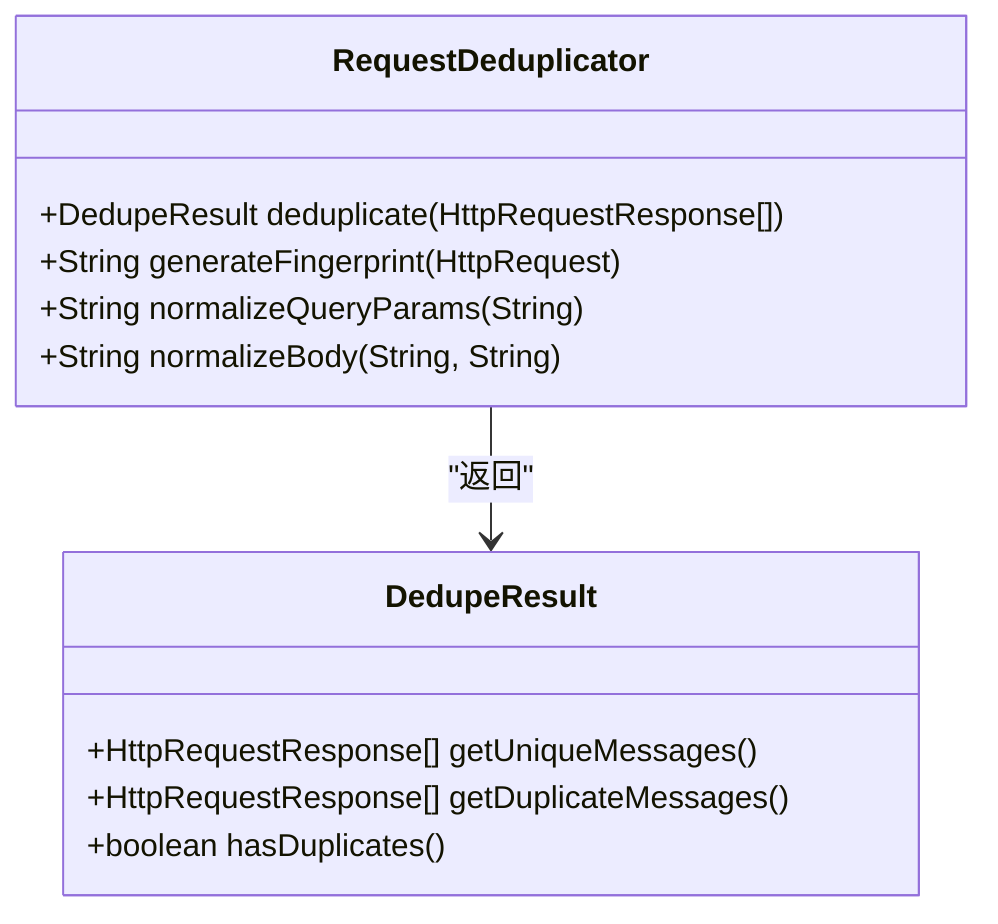

**Diagram sources**
- [RequestDeduplicator.java](file://src/burpEx/legacy-api/src/main/java/com/sqlmapwebui/burp/RequestDeduplicator.java#L32-L273)
- [RequestDeduplicator.java](file://src/burpEx/montoya-api/src/main/java/com/sqlmapwebui/burp/RequestDeduplicator.java#L31-L252)

### 去重实现原理

去重实现原理基于请求指纹生成算法。每个HTTP请求都会生成一个唯一的指纹，通过比较指纹来判断请求是否重复。

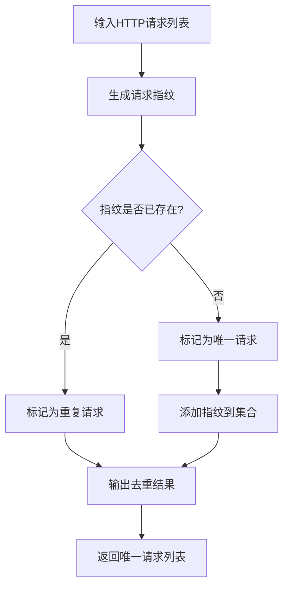

**Diagram sources**
- [RequestDeduplicator.java](file://src/burpEx/legacy-api/src/main/java/com/sqlmapwebui/burp/RequestDeduplicator.java#L90-L107)
- [RequestDeduplicator.java](file://src/burpEx/montoya-api/src/main/java/com/sqlmapwebui/burp/RequestDeduplicator.java#L77-L94)

### 指纹生成算法

指纹生成算法是去重机制的核心，通过以下步骤生成请求的唯一标识：

1. **协议**：获取请求的协议（http/https）
2. **方法**：获取请求方法（GET/POST等）
3. **主机**：获取主机名
4. **端口**：获取端口号（处理默认端口）
5. **路径**：获取URL路径
6. **查询参数**：规范化查询参数（排序，忽略顺序）
7. **请求体**：规范化请求体内容

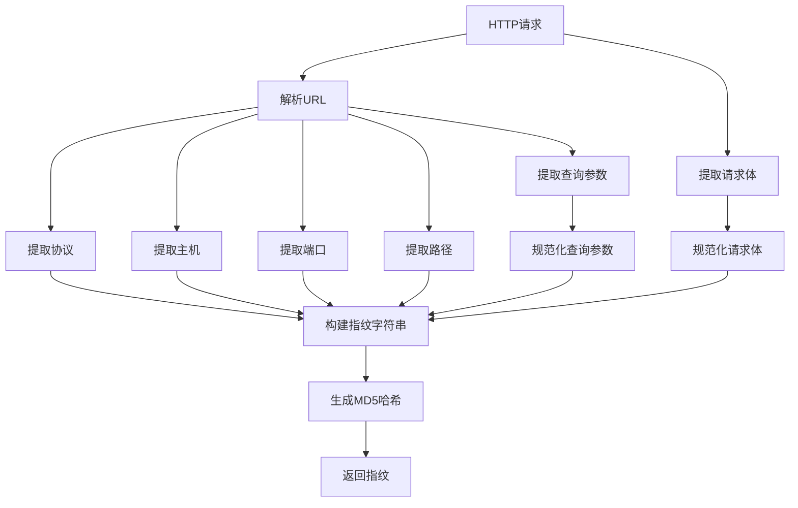

**Diagram sources**
- [RequestDeduplicator.java](file://src/burpEx/legacy-api/src/main/java/com/sqlmapwebui/burp/RequestDeduplicator.java#L114-L169)
- [RequestDeduplicator.java](file://src/burpEx/montoya-api/src/main/java/com/sqlmapwebui/burp/RequestDeduplicator.java#L101-L151)

## API版本差异与兼容性

Burp Suite插件提供了两个API版本：Legacy API和Montoya API，以支持不同版本的Burp Suite并实现功能兼容。

### Legacy API与Montoya API对比

| 特性 | Legacy API | Montoya API |
|------|------------|------------|
| **支持的Burp版本** | 旧版本 | 新版本 |
| **Java版本要求** | Java 11 | Java 17 |
| **扩展接口** | IContextMenuFactory | ContextMenuItemsProvider |
| **配置存储** | ExtensionSettings | PersistedObject |
| **日志输出** | PrintWriter | MontoyaApi.logging() |
| **主要类** | BurpExtender | SqlmapWebUIExtension |

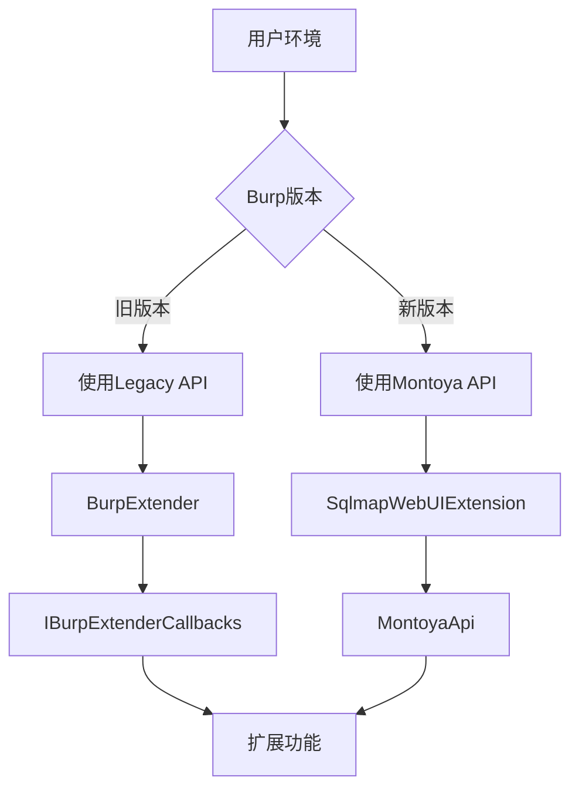

**Diagram sources**
- [BurpExtender.java](file://src/burpEx/legacy-api/src/main/java/com/sqlmapwebui/burp/BurpExtender.java#L30-L120)
- [SqlmapWebUIExtension.java](file://src/burpEx/montoya-api/src/main/java/com/sqlmapwebui/burp/SqlmapWebUIExtension.java#L29-L58)

### 兼容性处理策略

为了确保两个API版本的功能一致性，项目采用了以下兼容性处理策略：

1. **统一核心逻辑**：将核心功能（如请求去重、参数提取）实现为独立的工具类，供两个API版本共享。
2. **接口适配**：为不同API版本提供适配层，将底层API调用转换为统一的接口。
3. **配置同步**：确保两个版本的配置管理器（ConfigManager）具有相同的配置项和行为。

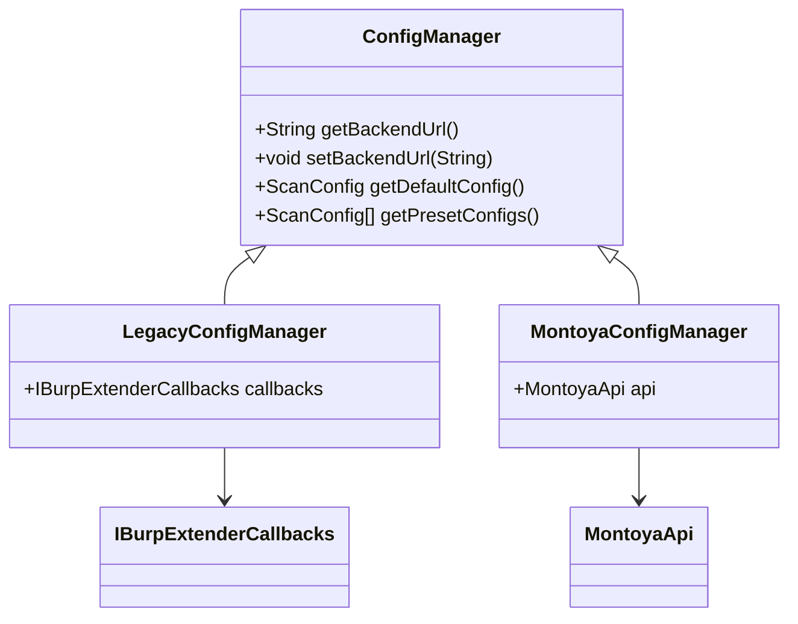

**Diagram sources**
- [ConfigManager.java](file://src/burpEx/legacy-api/src/main/java/com/sqlmapwebui/burp/ConfigManager.java#L16-L402)
- [ConfigManager.java](file://src/burpEx/montoya-api/src/main/java/com/sqlmapwebui/burp/ConfigManager.java#L17-L406)

## 后端API交互示例

通过`ApiClient`和`SqlmapApiClient`类与后端API进行交互，实现各种功能。

### ApiClient类结构

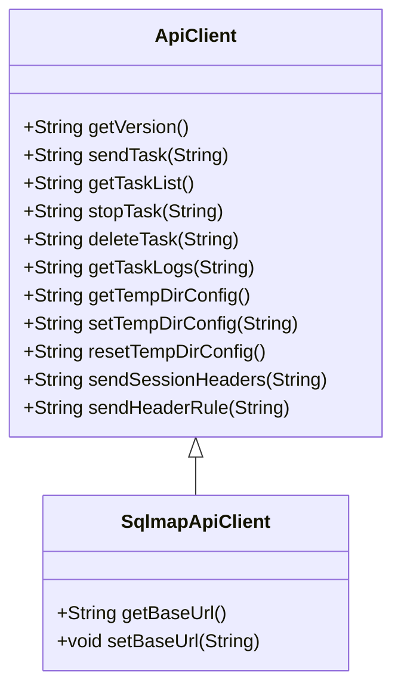

**Diagram sources**
- [ApiClient.java](file://src/burpEx/legacy-api/src/main/java/com/sqlmapwebui/burp/ApiClient.java#L15-L252)
- [SqlmapApiClient.java](file://src/burpEx/montoya-api/src/main/java/com/sqlmapwebui/burp/SqlmapApiClient.java#L15-L209)

### 代码示例：与后端API交互

以下是通过ApiClient与后端API交互的代码示例：

```java
// 创建API客户端
SqlmapApiClient apiClient = new SqlmapApiClient("http://localhost:5000");

// 获取后端版本信息
try {
    String version = apiClient.getVersion();
    System.out.println("后端版本: " + version);
} catch (IOException e) {
    System.err.println("获取版本信息失败: " + e.getMessage());
}

// 发送扫描任务
String jsonPayload = "{\"scanUrl\":\"http://example.com\",\"host\":\"example.com\",\"headers\":[\"GET / HTTP/1.1\"],\"body\":\"\",\"options\":{}}";
try {
    String response = apiClient.sendTask(jsonPayload);
    System.out.println("任务创建成功: " + response);
} catch (IOException e) {
    System.err.println("发送任务失败: " + e.getMessage());
}

// 提交会话Header
String headerPayload = "{\"headers\":[{\"name\":\"X-Custom-Header\",\"value\":\"custom-value\"}],\"scope\":{\"protocol\":\"http\",\"host\":\"*.example.com\"}}";
try {
    String response = apiClient.sendSessionHeaders(headerPayload);
    System.out.println("会话Header提交成功: " + response);
} catch (IOException e) {
    System.err.println("提交会话Header失败: " + e.getMessage());
}
```

**Section sources**
- [SqlmapApiClient.java](file://src/burpEx/montoya-api/src/main/java/com/sqlmapwebui/burp/SqlmapApiClient.java#L36-L78)
- [ApiClient.java](file://src/burpEx/legacy-api/src/main/java/com/sqlmapwebui/burp/ApiClient.java#L62-L79)

## 请求发送失败处理

请求发送失败可能由多种原因引起，需要针对性地进行处理。

### 常见失败原因

| 原因 | 描述 | 解决方案 |
|------|------|----------|
| 网络连接问题 | 无法连接到后端服务 | 检查网络连接，确认后端服务是否运行 |
| 认证失败 | API认证失败 | 检查认证密钥，重新配置认证信息 |
| 请求格式错误 | JSON格式不正确 | 验证JSON结构，确保所有必需字段存在 |
| 后端服务异常 | 服务内部错误 | 检查后端日志，重启服务 |
| 超时 | 请求超时 | 增加超时时间，优化网络环境 |

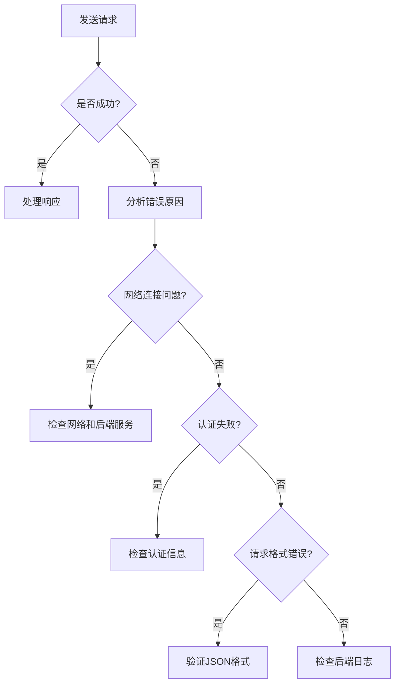

**Diagram sources**
- [ApiClient.java](file://src/burpEx/legacy-api/src/main/java/com/sqlmapwebui/burp/ApiClient.java#L71-L75)
- [SqlmapApiClient.java](file://src/burpEx/montoya-api/src/main/java/com/sqlmapwebui/burp/SqlmapApiClient.java#L71-L74)

### 错误处理机制

插件实现了完善的错误处理机制，包括：

1. **异常捕获**：使用try-catch块捕获网络请求异常
2. **错误日志**：将错误信息记录到插件日志中
3. **用户提示**：通过UI向用户显示错误信息
4. **重试机制**：对某些可恢复的错误进行重试

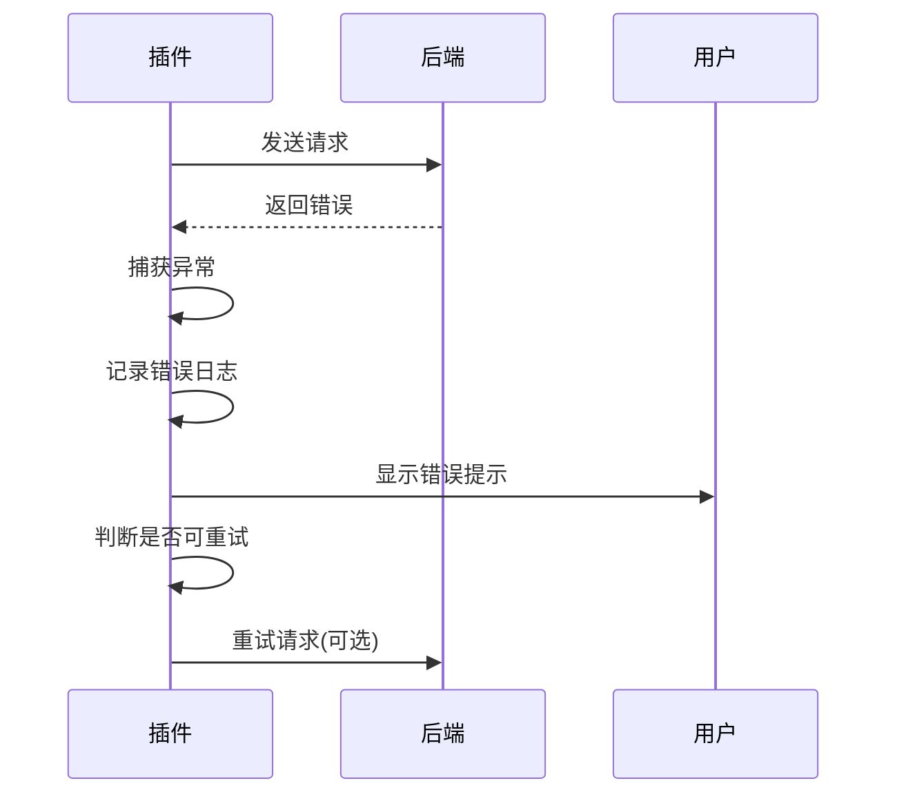

**Diagram sources**
- [BurpExtender.java](file://src/burpEx/legacy-api/src/main/java/com/sqlmapwebui/burp/BurpExtender.java#L376-L380)
- [SqlmapContextMenuProvider.java](file://src/burpEx/montoya-api/src/main/java/com/sqlmapwebui/burp/SqlmapContextMenuProvider.java#L334-L339)

## 性能优化建议

为了提高插件的性能和用户体验，建议采取以下优化措施。

### 批量处理请求的最佳实践

批量处理请求时，应遵循以下最佳实践：

1. **合理设置批量大小**：避免一次性处理过多请求，建议批量大小控制在10-20个请求之间
2. **启用请求去重**：确保开启自动去重功能，避免重复扫描
3. **异步处理**：使用多线程异步处理请求，提高处理效率
4. **资源监控**：监控系统资源使用情况，避免资源耗尽

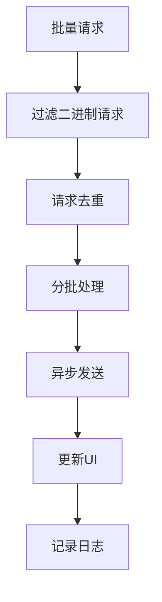

**Diagram sources**
- [BurpExtender.java](file://src/burpEx/legacy-api/src/main/java/com/sqlmapwebui/burp/BurpExtender.java#L278-L297)
- [SqlmapContextMenuProvider.java](file://src/burpEx/montoya-api/src/main/java/com/sqlmapwebui/burp/SqlmapContextMenuProvider.java#L222-L242)

### 其他性能优化建议

| 优化建议 | 说明 |
|---------|------|
| **缓存配置** | 将常用配置缓存在内存中，减少磁盘I/O |
| **连接池** | 使用HTTP连接池，复用TCP连接 |
| **压缩传输** | 对大体积请求启用GZIP压缩 |
| **异步UI更新** | 使用SwingUtilities.invokeLater()更新UI，避免阻塞主线程 |
| **资源清理** | 及时释放不再使用的资源，防止内存泄漏 |

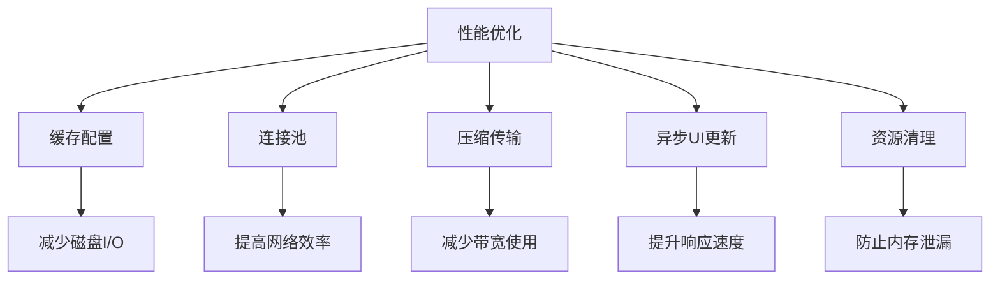

**Diagram sources**
- [ConfigManager.java](file://src/burpEx/legacy-api/src/main/java/com/sqlmapwebui/burp/ConfigManager.java#L55-L58)
- [ApiClient.java](file://src/burpEx/legacy-api/src/main/java/com/sqlmapwebui/burp/ApiClient.java#L27-L31)