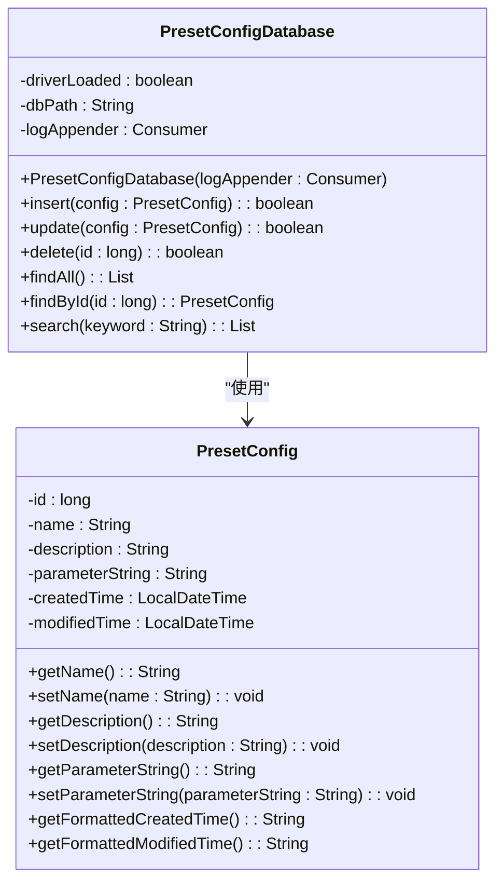
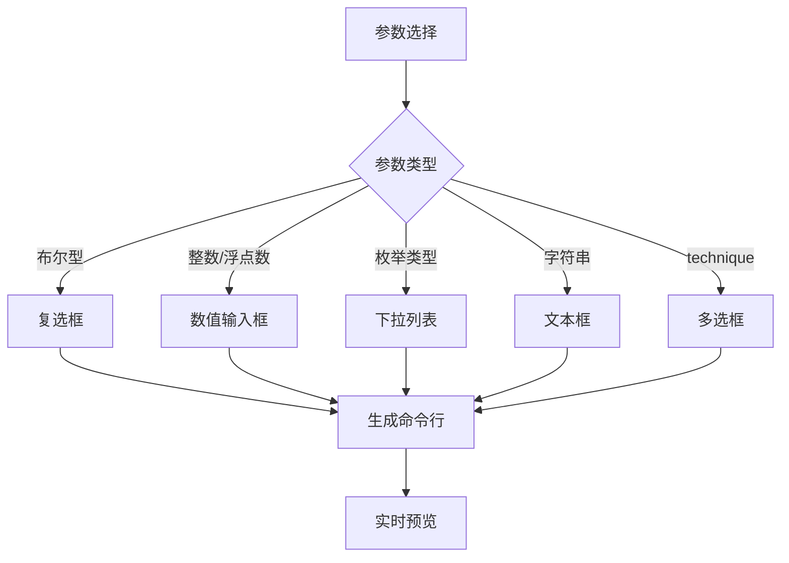
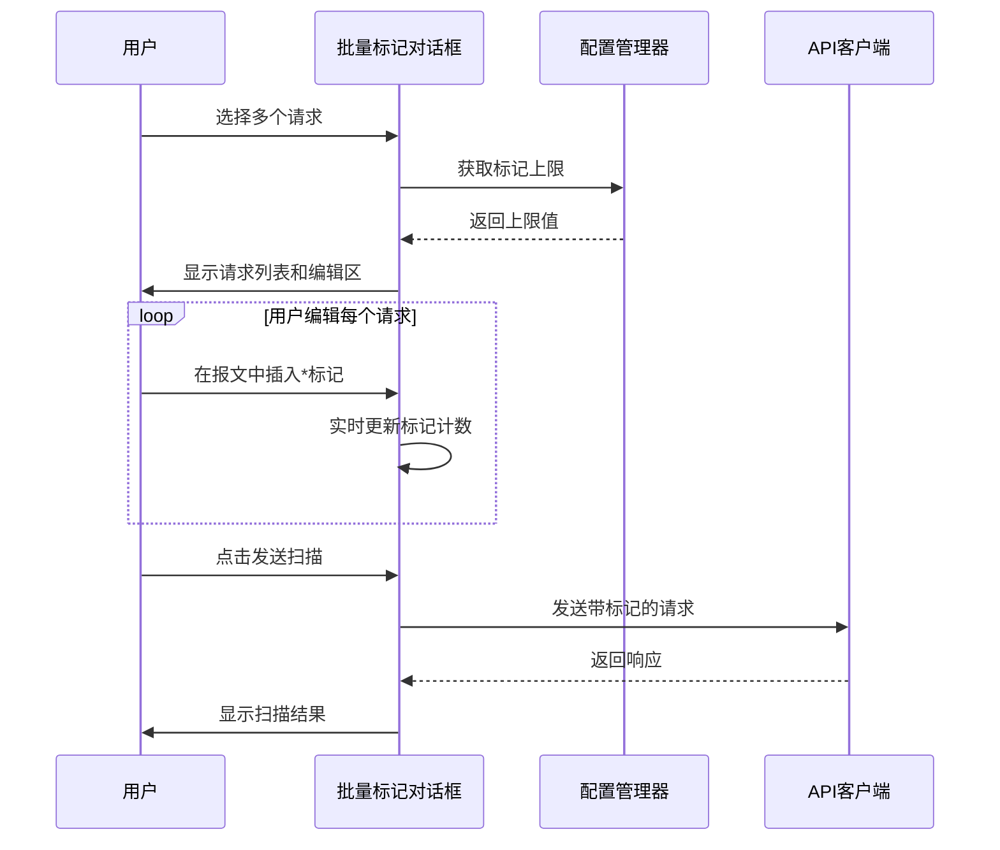
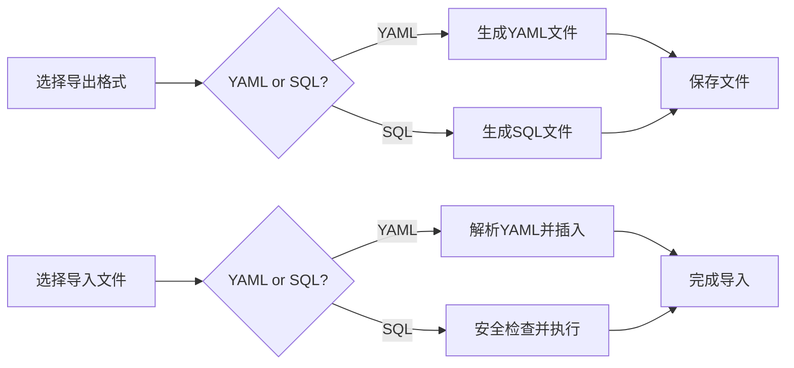

# 高级特性

<cite>
**本文档引用文件**   
- [BatchInjectionMarkDialog.java](file://src/burpEx/montoya-api/src/main/java/com/sqlmapwebui/burp/dialogs/BatchInjectionMarkDialog.java)
- [GuidedParamEditor.java](file://src/burpEx/montoya-api/src/main/java/com/sqlmapwebui/burp/panels/GuidedParamEditor.java)
- [GuidedParamEditorDialog.java](file://src/burpEx/montoya-api/src/main/java/com/sqlmapwebui/burp/panels/GuidedParamEditorDialog.java)
- [PresetConfigDatabase.java](file://src/burpEx/montoya-api/src/main/java/com/sqlmapwebui/burp/PresetConfigDatabase.java)
- [ScanPresetDatabase.py](file://src/backEnd/model/ScanPresetDatabase.py)
- [scanPresetService.py](file://src/backEnd/service/scanPresetService.py)
- [scanPreset.py](file://src/backEnd/api/commonApi/scanPreset.py)
- [ScanPreset.py](file://src/backEnd/model/ScanPreset.py)
- [GuidedParamEditor.vue](file://src/frontEnd/src/components/GuidedParamEditor.vue)
- [GuidedParamEditorDialog.vue](file://src/frontEnd/src/components/GuidedParamEditorDialog.vue)
- [paramDefinitions.ts](file://src/frontEnd/src/utils/paramDefinitions.ts)
- [ConfigImportExportHelper.java](file://src/burpEx/montoya-api/src/main/java/com/sqlmapwebui/burp/panels/ConfigImportExportHelper.java)
</cite>

## 目录
1. [扫描配置管理机制](#扫描配置管理机制)
2. [PresetConfigDatabase持久化机制](#presetconfigdatabase持久化机制)
3. [引导式参数编辑器](#引导式参数编辑器)
4. [批量注入标记功能](#批量注入标记功能)
5. [高级技巧与解决方案](#高级技巧与解决方案)

## 扫描配置管理机制

本系统实现了完整的扫描配置管理机制，支持默认配置、常用配置和历史配置的存储与调用。配置管理分为三个层级：默认配置、常用配置和历史配置，分别对应不同的使用场景和存储策略。

默认配置是系统初始化时创建的基础配置，包含快速扫描、深度扫描和安全扫描等预设方案。常用配置由用户创建和管理，用于保存特定场景下的扫描参数。历史配置则自动记录用户最近使用的扫描配置，便于快速复用。

配置的调用通过API接口实现，前端组件通过HTTP请求获取配置列表，并在用户界面中展示。当用户选择某个配置时，系统会将其参数应用到当前扫描任务中。配置的创建、更新和删除操作都会触发相应的服务方法，确保数据的一致性和完整性。

**Section sources**
- [ScanPreset.py](file://src/backEnd/model/ScanPreset.py#L11-L231)
- [scanPresetService.py](file://src/backEnd/service/scanPresetService.py#L17-L182)
- [scanPreset.py](file://src/backEnd/api/commonApi/scanPreset.py#L1-L325)

## PresetConfigDatabase持久化机制

PresetConfigDatabase是Java端用于管理用户预设扫描参数的核心组件，采用SQLite数据库实现持久化存储。该类负责创建和管理`preset_configs`表，存储配置的名称、描述、参数字符串以及创建和修改时间等信息。

数据库初始化时会创建必要的表结构，并确保SQLite JDBC驱动正确加载。每个配置项通过唯一的ID进行标识，支持增删改查等基本操作。在插入新配置时，系统会检查名称的唯一性，防止重复。更新操作则会验证配置名称是否被其他配置占用。

**Diagram sources **
- [PresetConfigDatabase.java](file://src/burpEx/montoya-api/src/main/java/com/sqlmapwebui/burp/PresetConfigDatabase.java#L1-L462)
- [PresetConfig.java](file://src/burpEx/montoya-api/src/main/java/com/sqlmapwebui/burp/PresetConfig.java)

**Section sources**
- [PresetConfigDatabase.java](file://src/burpEx/montoya-api/src/main/java/com/sqlmapwebui/burp/PresetConfigDatabase.java#L1-L462)

## 引导式参数编辑器

引导式参数编辑器（GuidedParamEditor）是一种可视化参数配置工具，帮助用户通过图形界面设置复杂的扫描参数。该组件支持参数搜索、分类筛选和实时命令行预览等功能，大大降低了使用门槛。

编辑器采用双栏布局，左侧为参数选择区，右侧为参数设置区。用户可以通过搜索框或下拉菜单快速定位所需参数。选中参数后，右侧会显示相应的输入控件，如文本框、下拉列表或复选框。对于特殊参数如`technique`，系统提供多选框进行便捷操作。

**Diagram sources **
- [GuidedParamEditor.java](file://src/burpEx/montoya-api/src/main/java/com/sqlmapwebui/burp/panels/GuidedParamEditor.java#L1-L800)
- [GuidedParamEditor.vue](file://src/frontEnd/src/components/GuidedParamEditor.vue#L1-L706)

**Section sources**
- [GuidedParamEditor.java](file://src/burpEx/montoya-api/src/main/java/com/sqlmapwebui/burp/panels/GuidedParamEditor.java#L1-L800)
- [GuidedParamEditor.vue](file://src/frontEnd/src/components/GuidedParamEditor.vue#L1-L706)
- [paramDefinitions.ts](file://src/frontEnd/src/utils/paramDefinitions.ts#L1-L132)

## 批量注入标记功能

批量注入标记功能（BatchInjectionMarkDialog）允许用户对多个HTTP请求同时进行注入点标记。该功能通过双栏布局实现，左侧显示请求列表，右侧提供报文编辑区。用户可以在编辑区使用`*`符号标记需要测试的注入点。

系统支持对选中的多个请求进行批量处理，但为避免界面复杂度过高，设置了默认的标记数量上限（可在配置中调整）。超过上限的请求会显示"超限"提示，但仍可查看和编辑。编辑过程中，系统会实时统计每个请求的标记数量，并在表格中显示。

**Diagram sources **
- [BatchInjectionMarkDialog.java](file://src/burpEx/montoya-api/src/main/java/com/sqlmapwebui/burp/dialogs/BatchInjectionMarkDialog.java#L1-L654)

**Section sources**
- [BatchInjectionMarkDialog.java](file://src/burpEx/montoya-api/src/main/java/com/sqlmapwebui/burp/dialogs/BatchInjectionMarkDialog.java#L1-L654)

## 高级技巧与解决方案

### 配置导入导出

系统支持YAML和SQL格式的配置导入导出，便于用户在不同环境间迁移配置。导出时，系统会生成包含所有配置的YAML或SQL文件，其中SQL文件包含建表语句和INSERT语句。导入时，系统会对SQL文件进行安全检查，仅允许执行CREATE TABLE和INSERT操作，防止恶意SQL注入。

### 快捷键操作

引导式参数编辑器支持多种快捷键操作，提升用户体验。ESC键可用于关闭对话框，Enter键可确认输入。在参数列表中，用户可通过键盘上下键选择参数，双击即可快速添加。编辑区支持标准的文本编辑快捷键，如Ctrl+C/V/X等。

### 自动化扫描工作流

通过组合使用历史配置和常用配置，用户可以构建高效的自动化扫描工作流。建议的工作流包括：首先使用快速扫描配置进行初步检测，然后根据结果选择深度扫描或安全扫描配置进行详细分析。每次扫描后，系统会自动将配置添加到历史记录，便于后续复用。

### 常见问题解决方案

针对配置同步失败问题，建议检查数据库文件权限和路径是否正确。预设丢失问题通常由数据库文件损坏引起，可通过重新导入备份的YAML或SQL文件恢复。若遇到参数不生效的情况，请确认参数格式是否正确，并检查是否有冲突的参数设置。

**Section sources**
- [ConfigImportExportHelper.java](file://src/burpEx/montoya-api/src/main/java/com/sqlmapwebui/burp/panels/ConfigImportExportHelper.java#L1-L393)
- [GuidedParamEditorDialog.java](file://src/burpEx/montoya-api/src/main/java/com/sqlmapwebui/burp/panels/GuidedParamEditorDialog.java#L1-L354)
- [GuidedParamEditorDialog.vue](file://src/frontEnd/src/components/GuidedParamEditorDialog.vue#L1-L190)