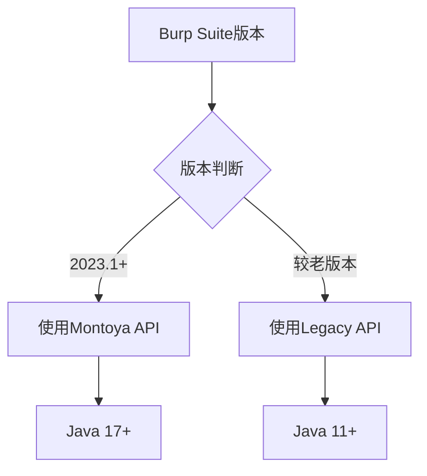
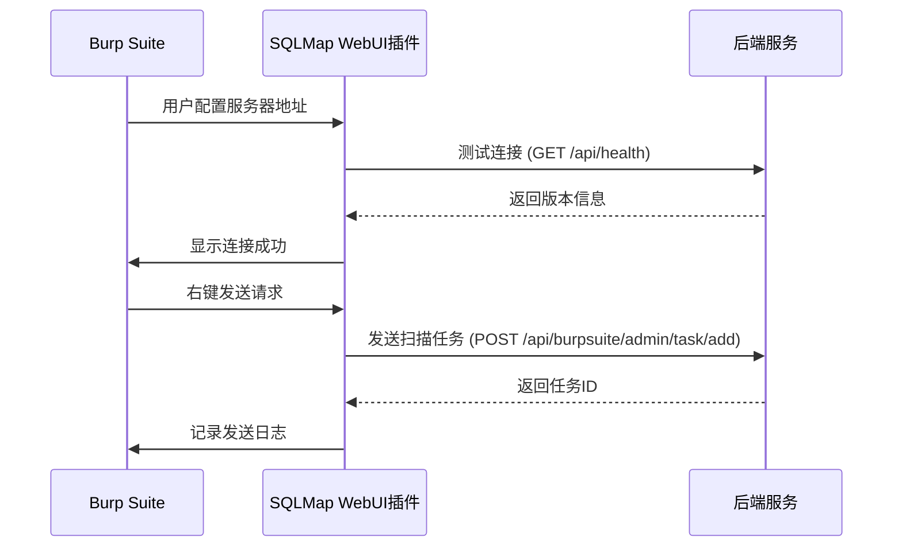

# 插件安装与配置

<cite>
**本文档引用文件**   
- [pom.xml](file://src/burpEx/legacy-api/pom.xml)
- [pom.xml](file://src/burpEx/montoya-api/pom.xml)
- [BurpExtender.java](file://src/burpEx/legacy-api/src/main/java/com/sqlmapwebui/burp/BurpExtender.java)
- [SqlmapWebUIExtension.java](file://src/burpEx/montoya-api/src/main/java/com/sqlmapwebui/burp/SqlmapWebUIExtension.java)
- [ConfigManager.java](file://src/burpEx/legacy-api/src/main/java/com/sqlmapwebui/burp/ConfigManager.java)
- [ConfigManager.java](file://src/burpEx/montoya-api/src/main/java/com/sqlmapwebui/burp/ConfigManager.java)
- [SqlmapApiClient.java](file://src/burpEx/legacy-api/src/main/java/com/sqlmapwebui/burp/SqlmapApiClient.java)
- [SqlmapApiClient.java](file://src/burpEx/montoya-api/src/main/java/com/sqlmapwebui/burp/SqlmapApiClient.java)
- [ServerConfigPanel.java](file://src/burpEx/legacy-api/src/main/java/com/sqlmapwebui/burp/panels/ServerConfigPanel.java)
- [ServerConfigPanel.java](file://src/burpEx/montoya-api/src/main/java/com/sqlmapwebui/burp/panels/ServerConfigPanel.java)
- [README.md](file://src/burpEx/README.md)
- [README.md](file://README.md)
- [config.py](file://src/backEnd/config.py)
</cite>

## 目录
1. [简介](#简介)
2. [安装方式](#安装方式)
3. [API版本兼容性](#api版本兼容性)
4. [配置步骤](#配置步骤)
5. [Maven构建环境](#maven构建环境)
6. [常见问题排查](#常见问题排查)
7. [配置文件示例](#配置文件示例)
8. [验证安装](#验证安装)

## 简介
SQLMap WebUI Burp Suite扩展插件允许用户将HTTP请求直接发送到SQLMap WebUI后端进行SQL注入检测。该插件提供两种版本：Legacy API和Montoya API，以适应不同版本的Burp Suite。插件支持通过BApp Store安装或手动加载JAR文件，并提供完整的配置管理功能，包括后端服务地址设置、认证配置和网络代理设置。

**Section sources**
- [README.md](file://README.md#L1-L321)

## 安装方式

### 通过BApp Store安装
1. 打开Burp Suite
2. 进入 **Extender** → **BApp Store** 标签页
3. 在搜索框中输入 "SQLMap WebUI"
4. 找到对应的插件并点击 **Install** 按钮
5. 等待安装完成，插件将自动加载

### 手动加载JAR文件
1. 打开Burp Suite
2. 进入 **Extender** → **Extensions** 标签页
3. 点击 **Add** 按钮
4. 选择对应版本的JAR文件：
   - Montoya API版本：`src/burpEx/montoya-api/target/sqlmap-webui-burp-montoya-*.jar`
   - Legacy API版本：`src/burpEx/legacy-api/target/sqlmap-webui-burp-legacy-*-jar-with-dependencies.jar`
5. 点击 **Next** 完成安装

**Section sources**
- [README.md](file://src/burpEx/README.md#L85-L92)
- [README.md](file://README.md#L227-L233)

## API版本兼容性

### Legacy API版本
- **适用Burp Suite版本**：较老版本
- **Java要求**：Java 11+
- **项目路径**：`src/burpEx/legacy-api`
- **Maven打包命令**：
```bash
cd src/burpEx/legacy-api
mvn clean package -DskipTests
```
生成文件：`target/sqlmap-webui-burp-legacy-*-jar-with-dependencies.jar`

### Montoya API版本
- **适用Burp Suite版本**：2023.1+
- **Java要求**：Java 17+
- **项目路径**：`src/burpEx/montoya-api`
- **Maven打包命令**：
```bash
cd src/burpEx/montoya-api
mvn clean package -DskipTests
```
生成文件：`target/sqlmap-webui-burp-montoya-*.jar`



**Diagram sources**
- [pom.xml](file://src/burpEx/legacy-api/pom.xml#L1-L126)
- [pom.xml](file://src/burpEx/montoya-api/pom.xml#L1-L134)
- [README.md](file://src/burpEx/README.md#L58-L64)

**Section sources**
- [pom.xml](file://src/burpEx/legacy-api/pom.xml#L1-L126)
- [pom.xml](file://src/burpEx/montoya-api/pom.xml#L1-L134)
- [README.md](file://src/burpEx/README.md#L58-L64)

## 配置步骤

### 后端服务地址设置
1. 进入插件的「服务器配置」标签页
2. 在「服务器地址」字段输入后端服务IP或域名
3. 在「服务器端口」字段输入端口号（默认：5000）
4. 点击「测试连接」验证连接状态
5. 点击「保存设置」保存配置

### 认证配置
插件通过后端API进行通信，认证由后端服务处理。确保后端服务已正确配置认证机制。

### 网络代理设置
插件使用OkHttp作为HTTP客户端，自动继承Burp Suite的网络代理设置。如需特殊代理配置，请在Burp Suite的**User Options** → **Connections**中设置。

### 配置持久化
- 勾选「启用本地配置文件持久化」选项
- 配置将保存到Burp Suite运行目录下的`sqlmap-webui-config.properties`文件
- 下次启动Burp Suite时自动加载已保存的配置

**Section sources**
- [ServerConfigPanel.java](file://src/burpEx/legacy-api/src/main/java/com/sqlmapwebui/burp/panels/ServerConfigPanel.java#L1-L783)
- [ServerConfigPanel.java](file://src/burpEx/montoya-api/src/main/java/com/sqlmapwebui/burp/panels/ServerConfigPanel.java#L1-L783)

## Maven构建环境

### Java版本要求
- **Legacy API版本**：Java 11+
- **Montoya API版本**：Java 17+

### 编译命令
```bash
# 进入对应版本目录
cd src/burpEx/[legacy-api|montoya-api]

# 清理并编译项目
mvn clean compile

# 打包项目（包含所有依赖）
mvn package -DskipTests
```

### 打包流程
1. **Legacy API版本**：使用Maven Assembly Plugin创建包含所有依赖的fat JAR
   - 配置文件：`pom.xml`中的`maven-assembly-plugin`
   - 生成文件：`*-jar-with-dependencies.jar`

2. **Montoya API版本**：使用Maven Shade Plugin创建重定位依赖的fat JAR
   - 配置文件：`pom.xml`中的`maven-shade-plugin`
   - 生成文件：常规JAR文件

**Section sources**
- [pom.xml](file://src/burpEx/legacy-api/pom.xml#L78-L115)
- [pom.xml](file://src/burpEx/montoya-api/pom.xml#L79-L123)

## 常见问题排查

### 类加载失败
**症状**：插件加载时出现ClassNotFoundException或NoClassDefFoundError
**解决方案**：
1. 确认Java版本符合要求（Legacy API：Java 11+，Montoya API：Java 17+）
2. 检查JAR文件是否完整，重新构建项目
3. 确认Maven依赖已正确打包到JAR文件中

### API版本不兼容
**症状**：插件无法加载或功能异常
**解决方案**：
1. 确认Burp Suite版本与插件版本匹配
2. 2023.1+版本使用Montoya API插件
3. 较老版本使用Legacy API插件
4. 检查`pom.xml`中的API依赖版本

### 网络连接超时
**症状**：测试连接失败，提示连接超时
**解决方案**：
1. 确认后端服务已启动
2. 检查服务器IP和端口是否正确
3. 验证防火墙设置是否阻止连接
4. 确认网络代理配置正确

### 配置不保存
**症状**：重启Burp Suite后配置丢失
**解决方案**：
1. 确认已勾选「启用本地配置文件持久化」
2. 检查Burp Suite运行目录是否有写入权限
3. 验证`sqlmap-webui-config.properties`文件是否存在

**Section sources**
- [README.md](file://src/burpEx/README.md#L213-L225)
- [ServerConfigPanel.java](file://src/burpEx/legacy-api/src/main/java/com/sqlmapwebui/burp/panels/ServerConfigPanel.java#L684-L744)
- [ServerConfigPanel.java](file://src/burpEx/montoya-api/src/main/java/com/sqlmapwebui/burp/panels/ServerConfigPanel.java#L684-L744)

## 配置文件示例

### 本地配置文件 (sqlmap-webui-config.properties)
```properties
# SQLMap WebUI Burp Extension Configuration
server.ip=localhost
server.port=5000
max.history=20
persist.config=true
```

### Maven依赖配置 (pom.xml)
```xml
<!-- Legacy API依赖 -->
<dependency>
    <groupId>net.portswigger.burp.extender</groupId>
    <artifactId>burp-extender-api</artifactId>
    <version>2.3</version>
    <scope>provided</scope>
</dependency>

<!-- Montoya API依赖 -->
<dependency>
    <groupId>net.portswigger.burp.extensions</groupId>
    <artifactId>montoya-api</artifactId>
    <version>2023.12.1</version>
    <scope>provided</scope>
</dependency>
```

**Section sources**
- [ServerConfigPanel.java](file://src/burpEx/legacy-api/src/main/java/com/sqlmapwebui/burp/panels/ServerConfigPanel.java#L430-L449)
- [pom.xml](file://src/burpEx/legacy-api/pom.xml#L21-L76)
- [pom.xml](file://src/burpEx/montoya-api/pom.xml#L22-L77)

## 验证安装

### 连接测试
1. 在「服务器配置」标签页填写正确的服务器地址和端口
2. 点击「测试连接」按钮
3. 成功时显示：
   - 连接成功提示
   - 后端版本信息
   - 服务器地址信息
4. 失败时显示错误详情，包括：
   - 服务器地址
   - 错误信息
   - 检查建议（服务状态、IP端口、防火墙）

### 功能验证
1. 在Proxy/Repeater/Target等位置选中HTTP请求
2. 右键选择 "Send to SQLMap WebUI"
3. 在Web前端查看是否收到扫描任务
4. 检查插件日志是否显示发送成功信息

### 版本验证
通过`config.py`文件确认后端版本：
```python
VERSION = "1.7.9"
```



**Diagram sources**
- [SqlmapApiClient.java](file://src/burpEx/montoya-api/src/main/java/com/sqlmapwebui/burp/SqlmapApiClient.java#L36-L58)
- [config.py](file://src/backEnd/config.py#L7-L8)

**Section sources**
- [ServerConfigPanel.java](file://src/burpEx/legacy-api/src/main/java/com/sqlmapwebui/burp/panels/ServerConfigPanel.java#L684-L744)
- [ServerConfigPanel.java](file://src/burpEx/montoya-api/src/main/java/com/sqlmapwebui/burp/panels/ServerConfigPanel.java#L684-L744)
- [config.py](file://src/backEnd/config.py#L7-L8)