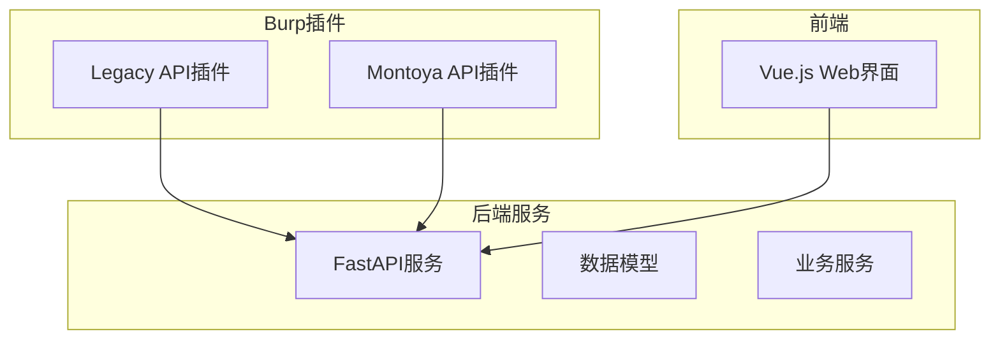
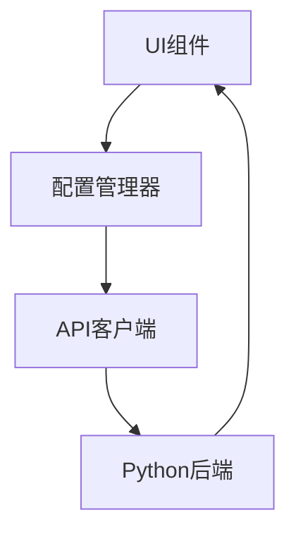
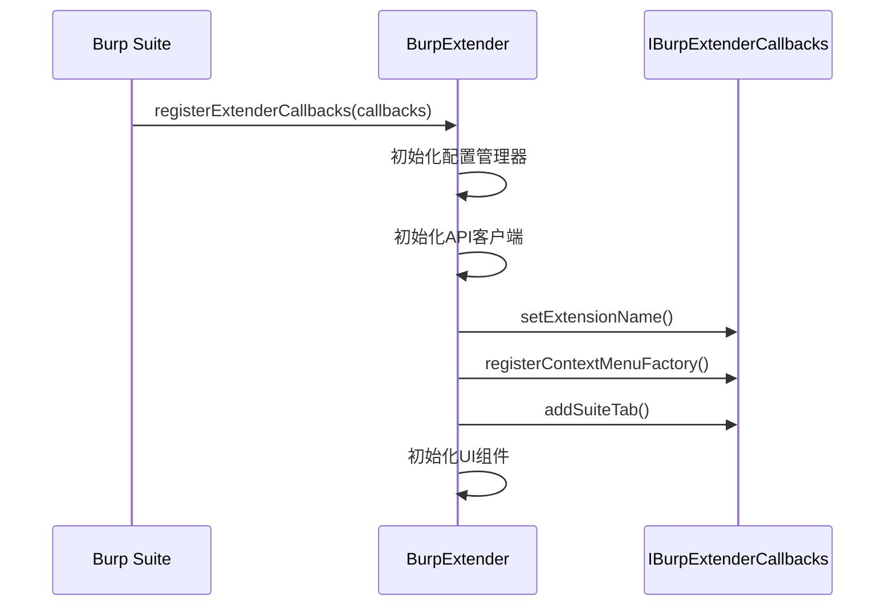
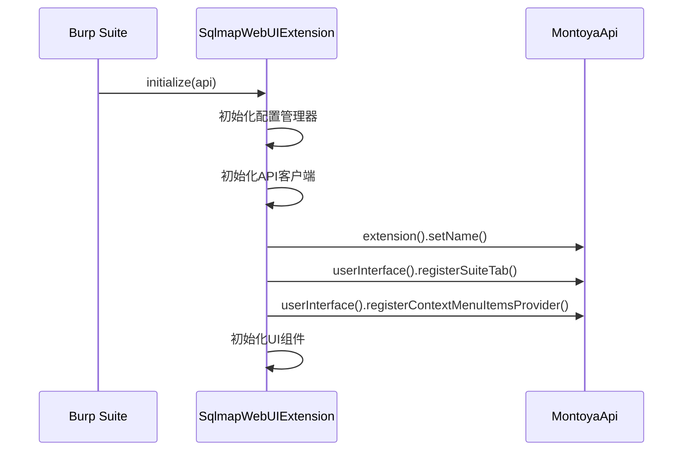
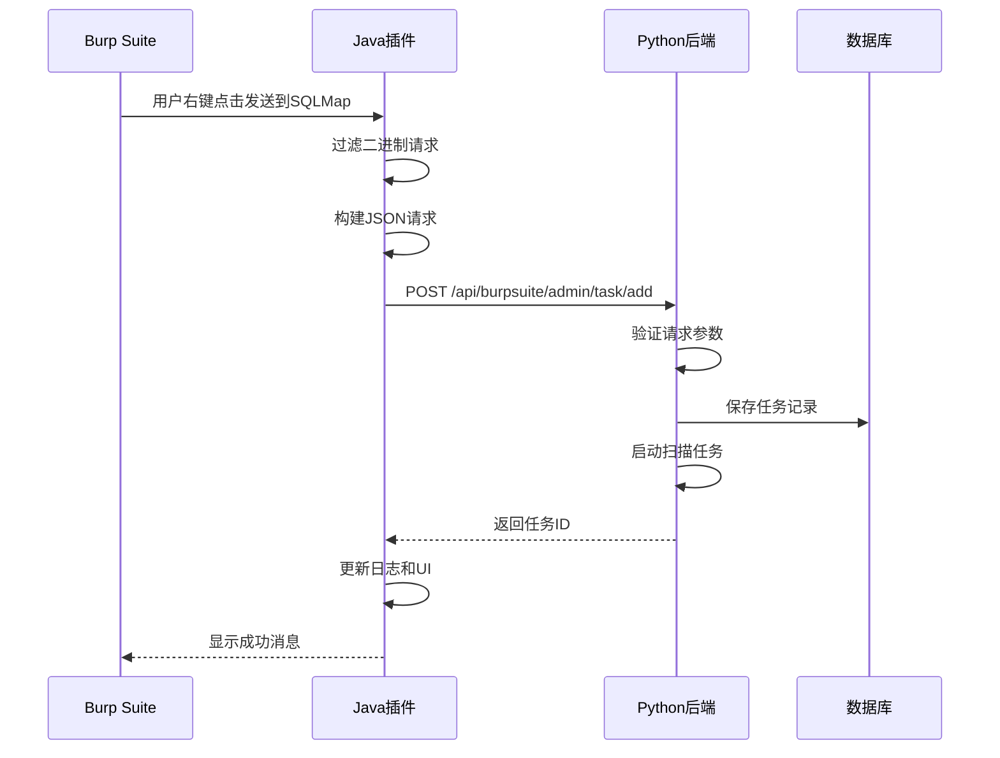
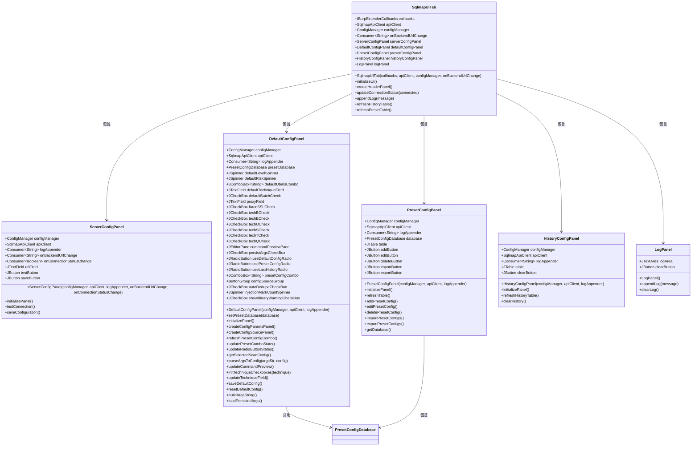
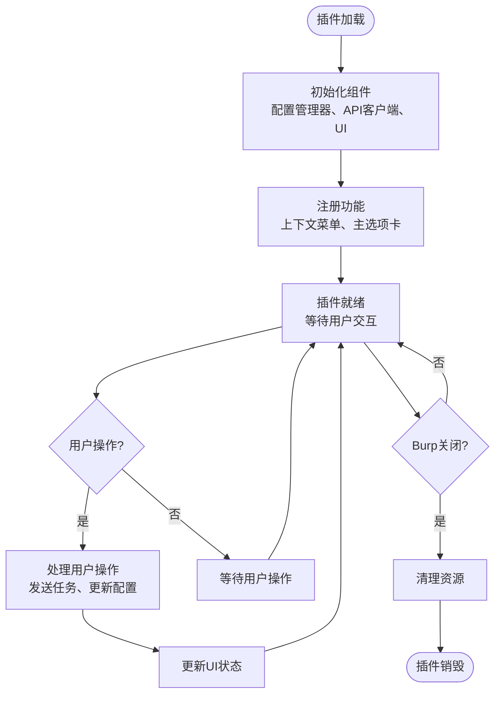
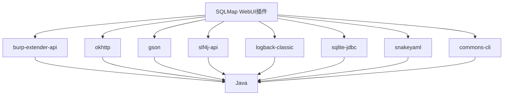

# 插件架构

<cite>
**本文档引用文件**   
- [BurpExtender.java](file://src/burpEx/legacy-api/src/main/java/com/sqlmapwebui/burp/BurpExtender.java)
- [SqlmapWebUIExtension.java](file://src/burpEx/montoya-api/src/main/java/com/sqlmapwebui/burp/SqlmapWebUIExtension.java)
- [DefaultConfigPanel.java](file://src/burpEx/legacy-api/src/main/java/com/sqlmapwebui/burp/panels/DefaultConfigPanel.java)
- [DefaultConfigPanel.java](file://src/burpEx/montoya-api/src/main/java/com/sqlmapwebui/burp/panels/DefaultConfigPanel.java)
- [ApiClient.java](file://src/burpEx/legacy-api/src/main/java/com/sqlmapwebui/burp/ApiClient.java)
- [SqlmapApiClient.java](file://src/burpEx/legacy-api/src/main/java/com/sqlmapwebui/burp/SqlmapApiClient.java)
- [SqlmapApiClient.java](file://src/burpEx/montoya-api/src/main/java/com/sqlmapwebui/burp/SqlmapApiClient.java)
- [ConfigManager.java](file://src/burpEx/legacy-api/src/main/java/com/sqlmapwebui/burp/ConfigManager.java)
- [ConfigManager.java](file://src/burpEx/montoya-api/src/main/java/com/sqlmapwebui/burp/ConfigManager.java)
- [pom.xml](file://src/burpEx/legacy-api/pom.xml)
- [pom.xml](file://src/burpEx/montoya-api/pom.xml)
- [app.py](file://src/backEnd/app.py)
- [admin.py](file://src/backEnd/api/burpSuiteExApi/admin.py)
- [webTaskController.py](file://src/backEnd/api/commonApi/webTaskController.py)
</cite>

## 目录
1. [引言](#引言)
2. [项目结构](#项目结构)
3. [核心组件](#核心组件)
4. [架构概述](#架构概述)
5. [详细组件分析](#详细组件分析)
6. [依赖分析](#依赖分析)
7. [性能考虑](#性能考虑)
8. [故障排除指南](#故障排除指南)
9. [结论](#结论)
10. [附录](#附录)

## 引言
sqlmapWebUI项目提供了一个Burp Suite扩展插件，允许安全测试人员将HTTP请求直接从Burp Suite发送到sqlmapWebUI后端进行SQL注入检测。该插件实现了两个版本：基于Burp Legacy API的版本和基于现代Montoya API的版本。插件通过HTTP API与Python后端通信，实现了扫描任务提交、配置管理、会话Header和Header规则提交等功能。插件提供了丰富的UI组件，包括配置面板、日志显示和对话框交互，为用户提供了一个完整的集成工作流。

## 项目结构
该项目包含两个主要的Burp Suite扩展实现，分别位于`src/burpEx/legacy-api`和`src/burpEx/montoya-api`目录下。每个实现都包含完整的Java源代码、Maven构建配置和编译输出。后端服务位于`src/backEnd`目录，使用FastAPI框架构建，提供RESTful API供插件调用。前端位于`src/frontEnd`目录，使用Vue.js构建。两个插件版本共享大部分业务逻辑代码，但根据API版本的不同，在扩展初始化、UI注册和持久化存储方面有细微差异。

**图源**
- [BurpExtender.java](file://src/burpEx/legacy-api/src/main/java/com/sqlmapwebui/burp/BurpExtender.java)
- [SqlmapWebUIExtension.java](file://src/burpEx/montoya-api/src/main/java/com/sqlmapwebui/burp/SqlmapWebUIExtension.java)
- [app.py](file://src/backEnd/app.py)

## 核心组件
插件的核心组件包括扩展入口点、配置管理器、API客户端、UI组件和通信机制。扩展入口点负责初始化插件、注册UI和上下文菜单。配置管理器负责管理后端URL、默认扫描配置、常用配置和历史配置，并将其持久化存储。API客户端封装了与Python后端的HTTP通信。UI组件提供了服务器配置、默认配置、常用配置管理、历史配置管理和活动日志等面板。这些组件协同工作，为用户提供了一个无缝的集成体验。

**组件源**
- [BurpExtender.java](file://src/burpEx/legacy-api/src/main/java/com/sqlmapwebui/burp/BurpExtender.java)
- [SqlmapWebUIExtension.java](file://src/burpEx/montoya-api/src/main/java/com/sqlmapwebui/burp/SqlmapWebUIExtension.java)
- [ConfigManager.java](file://src/burpEx/legacy-api/src/main/java/com/sqlmapwebui/burp/ConfigManager.java)
- [ConfigManager.java](file://src/burpEx/montoya-api/src/main/java/com/sqlmapwebui/burp/ConfigManager.java)
- [SqlmapApiClient.java](file://src/burpEx/legacy-api/src/main/java/com/sqlmapwebui/burp/SqlmapApiClient.java)
- [SqlmapApiClient.java](file://src/burpEx/montoya-api/src/main/java/com/sqlmapwebui/burp/SqlmapApiClient.java)

## 架构概述
插件采用分层架构设计，分为表示层、业务逻辑层和数据访问层。表示层由Swing UI组件构成，包括主选项卡、配置面板和对话框。业务逻辑层由配置管理器和API客户端构成，处理配置管理、请求构建和HTTP通信。数据访问层由API客户端实现，通过HTTP API与Python后端交互。插件与后端通过JSON格式的HTTP请求进行通信，实现了松耦合的设计。两个API版本的插件在高层架构上保持一致，但在与Burp Suite的集成方式上有所不同。

**图源**
- [SqlmapUITab.java](file://src/burpEx/legacy-api/src/main/java/com/sqlmapwebui/burp/SqlmapUITab.java)
- [SqlmapUITab.java](file://src/burpEx/montoya-api/src/main/java/com/sqlmapwebui/burp/SqlmapUITab.java)
- [ConfigManager.java](file://src/burpEx/legacy-api/src/main/java/com/sqlmapwebui/burp/ConfigManager.java)
- [ConfigManager.java](file://src/burpEx/montoya-api/src/main/java/com/sqlmapwebui/burp/ConfigManager.java)
- [SqlmapApiClient.java](file://src/burpEx/legacy-api/src/main/java/com/sqlmapwebui/burp/SqlmapApiClient.java)
- [SqlmapApiClient.java](file://src/burpEx/montoya-api/src/main/java/com/sqlmapwebui/burp/SqlmapApiClient.java)

## 详细组件分析

### Legacy API与Montoya API架构差异
Burp Suite的Legacy API和Montoya API在插件架构上有显著差异。Legacy API使用`IBurpExtender`接口和`IBurpExtenderCallbacks`进行初始化和回调，而Montoya API使用`BurpExtension`接口和`MontoyaApi`对象。在UI注册方面，Legacy API通过`callbacks.addSuiteTab()`方法添加选项卡，而Montoya API通过`api.userInterface().registerSuiteTab()`方法注册。在持久化存储方面，Legacy API使用`callbacks.saveExtensionSetting()`，而Montoya API使用`api.persistence().extensionData()`。这些差异要求插件为两个API版本提供不同的实现。

#### Legacy API初始化流程

**图源**
- [BurpExtender.java](file://src/burpEx/legacy-api/src/main/java/com/sqlmapwebui/burp/BurpExtender.java)

#### Montoya API初始化流程

**图源**
- [SqlmapWebUIExtension.java](file://src/burpEx/montoya-api/src/main/java/com/sqlmapwebui/burp/SqlmapWebUIExtension.java)

### Java插件与Python后端通信机制
Java插件通过HTTP API与Python后端通信，使用JSON格式交换数据。插件使用OkHttp库发送HTTP请求，后端使用FastAPI框架接收和处理请求。通信机制包括请求发送、配置同步和状态更新。当用户从Burp Suite发送请求到插件时，插件构建一个包含扫描目标、请求头、请求体和扫描选项的JSON有效载荷，并通过POST请求发送到`/api/burpsuite/admin/task/add`端点。后端处理请求并返回任务ID，插件将结果更新到UI。

#### 插件与后端通信时序图

**图源**
- [BurpExtender.java](file://src/burpEx/legacy-api/src/main/java/com/sqlmapwebui/burp/BurpExtender.java)
- [admin.py](file://src/backEnd/api/burpSuiteExApi/admin.py)

### 插件UI组件设计
插件的UI组件设计采用模块化方法，每个功能都有独立的面板。主UI由`SqlmapUITab`类实现，包含一个选项卡面板，每个选项卡对应一个功能模块。服务器配置面板允许用户设置后端URL和测试连接。默认配置面板允许用户设置默认扫描参数，包括Level、Risk、DBMS、注入技术等。常用配置面板允许用户保存和管理常用的扫描配置。历史配置面板显示最近使用的扫描配置。活动日志面板显示插件操作的日志消息。

#### UI组件类图

**图源**
- [SqlmapUITab.java](file://src/burpEx/legacy-api/src/main/java/com/sqlmapwebui/burp/SqlmapUITab.java)
- [SqlmapUITab.java](file://src/burpEx/montoya-api/src/main/java/com/sqlmapwebui/burp/SqlmapUITab.java)
- [ServerConfigPanel.java](file://src/burpEx/legacy-api/src/main/java/com/sqlmapwebui/burp/panels/ServerConfigPanel.java)
- [ServerConfigPanel.java](file://src/burpEx/montoya-api/src/main/java/com/sqlmapwebui/burp/panels/ServerConfigPanel.java)
- [DefaultConfigPanel.java](file://src/burpEx/legacy-api/src/main/java/com/sqlmapwebui/burp/panels/DefaultConfigPanel.java)
- [DefaultConfigPanel.java](file://src/burpEx/montoya-api/src/main/java/com/sqlmapwebui/burp/panels/DefaultConfigPanel.java)
- [PresetConfigPanel.java](file://src/burpEx/legacy-api/src/main/java/com/sqlmapwebui/burp/panels/PresetConfigPanel.java)
- [PresetConfigPanel.java](file://src/burpEx/montoya-api/src/main/java/com/sqlmapwebui/burp/panels/PresetConfigPanel.java)
- [HistoryConfigPanel.java](file://src/burpEx/legacy-api/src/main/java/com/sqlmapwebui/burp/panels/HistoryConfigPanel.java)
- [HistoryConfigPanel.java](file://src/burpEx/montoya-api/src/main/java/com/sqlmapwebui/burp/panels/HistoryConfigPanel.java)
- [LogPanel.java](file://src/burpEx/legacy-api/src/main/java/com/sqlmapwebui/burp/panels/LogPanel.java)
- [LogPanel.java](file://src/burpEx/montoya-api/src/main/java/com/sqlmapwebui/burp/panels/LogPanel.java)

### 插件生命周期管理
插件的生命周期从加载、初始化到销毁。当Burp Suite加载插件时，会调用扩展入口点的`registerExtenderCallbacks`（Legacy API）或`initialize`（Montoya API）方法。在此方法中，插件初始化配置管理器、API客户端和UI组件。插件注册上下文菜单和主选项卡。当用户与插件交互时，插件处理事件并更新状态。当Burp Suite关闭时，插件的资源被自动清理。配置管理器负责将用户配置持久化存储，确保重启后配置不丢失。

#### 插件生命周期流程图

**图源**
- [BurpExtender.java](file://src/burpEx/legacy-api/src/main/java/com/sqlmapwebui/burp/BurpExtender.java)
- [SqlmapWebUIExtension.java](file://src/burpEx/montoya-api/src/main/java/com/sqlmapwebui/burp/SqlmapWebUIExtension.java)

## 依赖分析
插件依赖于多个第三方库来实现其功能。主要依赖包括Burp Suite的API库、OkHttp用于HTTP通信、Gson用于JSON处理、SLF4J和Logback用于日志记录、SQLite JDBC用于本地数据库存储，以及SnakeYAML用于YAML导入导出。Maven构建系统管理这些依赖，并将它们打包到最终的JAR文件中。Legacy API版本使用Maven Assembly Plugin创建包含依赖的JAR，而Montoya API版本使用Maven Shade Plugin，后者提供了更好的依赖重定位功能。

**图源**
- [pom.xml](file://src/burpEx/legacy-api/pom.xml)
- [pom.xml](file://src/burpEx/montoya-api/pom.xml)

## 性能考虑
插件在设计时考虑了性能因素。在批量操作中，插件会自动过滤二进制内容的请求，只发送纯文本请求，这减少了不必要的网络传输和后端处理。插件还实现了请求去重功能，当用户选择多个相似请求时，可以自动过滤重复的请求。API客户端配置了合理的超时值（连接10秒，读写30秒），以平衡响应速度和用户体验。配置管理器将用户配置持久化存储在Burp Suite的扩展设置中，避免了频繁的文件I/O操作。

## 故障排除指南
当插件无法正常工作时，可以按照以下步骤进行故障排除：首先检查后端服务是否正在运行，并且可以通过浏览器访问。然后检查插件中的后端URL配置是否正确。在插件的活动日志面板中查看详细的错误消息。如果问题仍然存在，可以检查Burp Suite的扩展日志（stdout和stderr）以获取更详细的错误信息。对于通信问题，确保防火墙没有阻止插件与后端之间的连接。对于配置问题，可以尝试重置插件配置或重新安装插件。

**组件源**
- [BurpExtender.java](file://src/burpEx/legacy-api/src/main/java/com/sqlmapwebui/burp/BurpExtender.java)
- [SqlmapWebUIExtension.java](file://src/burpEx/montoya-api/src/main/java/com/sqlmapwebui/burp/SqlmapWebUIExtension.java)
- [SqlmapUITab.java](file://src/burpEx/legacy-api/src/main/java/com/sqlmapwebui/burp/SqlmapUITab.java)
- [SqlmapUITab.java](file://src/burpEx/montoya-api/src/main/java/com/sqlmapwebui/burp/SqlmapUITab.java)

## 结论
sqlmapWebUI的Burp Suite扩展插件提供了一个功能丰富且用户友好的集成解决方案，允许安全测试人员无缝地将Burp Suite与sqlmapWebUI后端结合使用。通过实现Legacy API和Montoya API两个版本，插件确保了与不同版本Burp Suite的兼容性。插件的模块化设计、清晰的架构和良好的错误处理使其成为一个可靠的工具。Java插件与Python后端通过HTTP API进行通信，实现了松耦合和可扩展性。丰富的UI组件和完整的生命周期管理为用户提供了完整的使用体验。

## 附录
本项目展示了如何为Burp Suite开发高质量的扩展插件。通过遵循最佳实践，如模块化设计、错误处理和用户友好的UI，开发者可以创建出既强大又易于使用的安全工具。插件的双API版本实现展示了如何在保持功能一致性的同时适应不同的API环境。这种架构也为未来的功能扩展提供了坚实的基础。