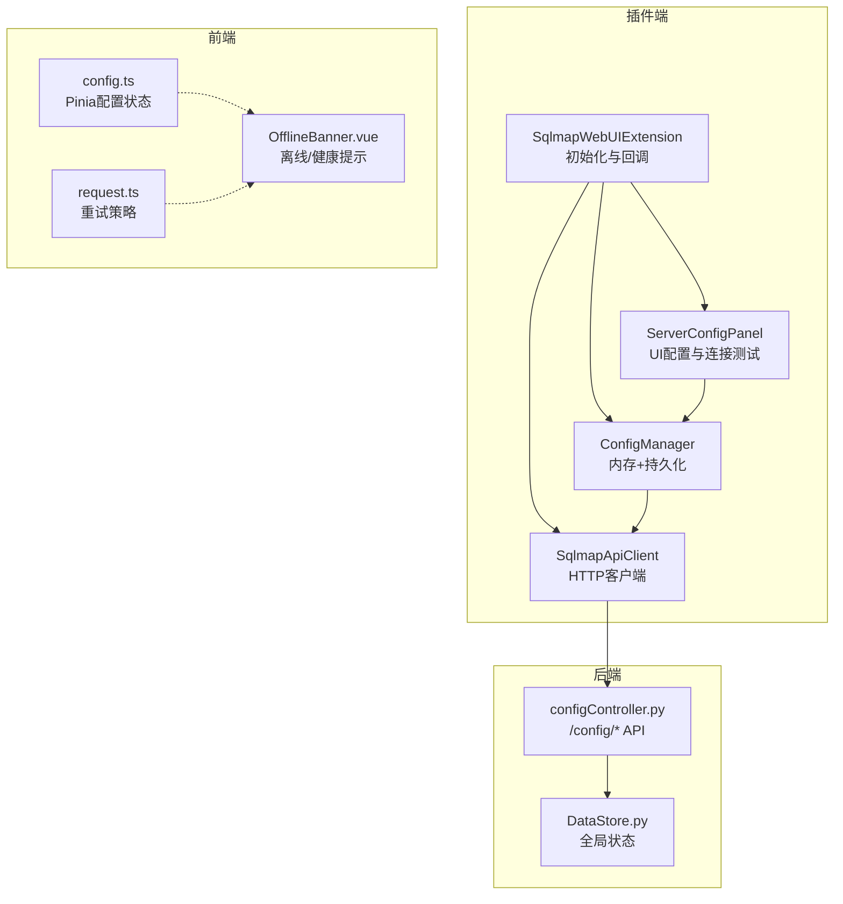
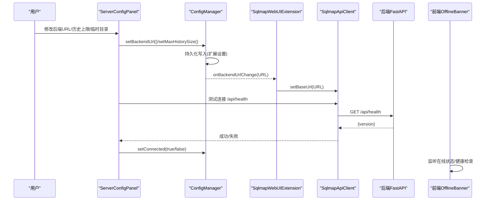
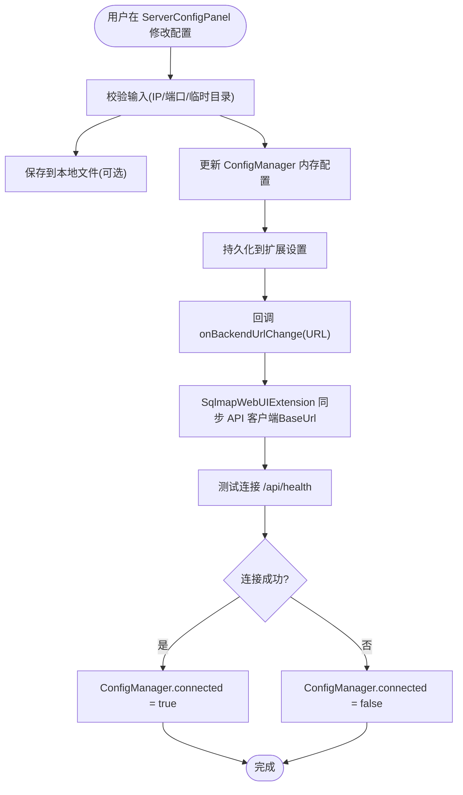
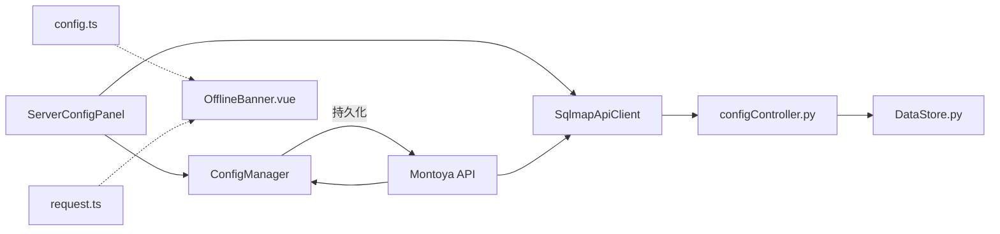

# 同步策略

<cite>
**本文引用的文件**
- [ConfigManager.java](file://src/burpEx/montoya-api/src/main/java/com/sqlmapwebui/burp/ConfigManager.java)
- [SqlmapApiClient.java](file://src/burpEx/montoya-api/src/main/java/com/sqlmapwebui/burp/SqlmapApiClient.java)
- [ServerConfigPanel.java](file://src/burpEx/montoya-api/src/main/java/com/sqlmapwebui/burp/panels/ServerConfigPanel.java)
- [SqlmapWebUIExtension.java](file://src/burpEx/montoya-api/src/main/java/com/sqlmapwebui/burp/SqlmapWebUIExtension.java)
- [configController.py](file://src/backEnd/api/commonApi/configController.py)
- [config.ts](file://src/frontEnd/src/stores/config.ts)
- [OfflineBanner.vue](file://src/frontEnd/src/components/OfflineBanner.vue)
- [request.ts](file://src/frontEnd/src/api/request.ts)
- [ScanConfig.java](file://src/burpEx/montoya-api/src/main/java/com/sqlmapwebui/burp/ScanConfig.java)
- [DataStore.py](file://src/backEnd/model/DataStore.py)
</cite>

## 目录
1. [简介](#简介)
2. [项目结构](#项目结构)
3. [核心组件](#核心组件)
4. [架构总览](#架构总览)
5. [详细组件分析](#详细组件分析)
6. [依赖关系分析](#依赖关系分析)
7. [性能考量](#性能考量)
8. [故障排查指南](#故障排查指南)
9. [结论](#结论)

## 简介
本文系统阐述 Burp 插件与 Web UI 之间的配置同步策略，重点覆盖以下方面：
- 用户在 Burp 插件中修改后端 URL 或扫描配置时，ConfigManager 如何通过持久化接口实时保存，并驱动与 Web UI 的同步过程。
- SqlmapApiClient 组件如何基于 HTTP REST API 实现双向通信，确保插件端发起的任务能正确传递配置参数至后端服务。
- 连接状态管理（connected 标志位）在同步过程中的作用，以及网络异常时的重试机制与错误提示策略。
- 配置变更事件的传播路径：从 UI 操作到内存更新、持久化存储再到远程同步的完整链条。
- 配置冲突解决策略：当本地修改与远程默认值不一致时的用户提示与选择机制。

## 项目结构
围绕“同步策略”的关键模块分布如下：
- 插件端（Java/Montoya API）：ConfigManager 负责配置内存与持久化；SqlmapApiClient 负责与后端通信；ServerConfigPanel 负责 UI 输入与连接测试；SqlmapWebUIExtension 负责生命周期初始化与回调。
- 后端（Python/FastAPI）：configController 提供配置相关 API，负责临时目录等配置的读取与写入。
- 前端（Vue/Pinia）：config.ts 管理前端配置；OfflineBanner.vue 展示离线与后端健康状态；request.ts 提供网络层重试策略。

图表来源
- [SqlmapWebUIExtension.java](file://src/burpEx/montoya-api/src/main/java/com/sqlmapwebui/burp/SqlmapWebUIExtension.java#L29-L67)
- [ConfigManager.java](file://src/burpEx/montoya-api/src/main/java/com/sqlmapwebui/burp/ConfigManager.java#L56-L120)
- [SqlmapApiClient.java](file://src/burpEx/montoya-api/src/main/java/com/sqlmapwebui/burp/SqlmapApiClient.java#L23-L47)
- [ServerConfigPanel.java](file://src/burpEx/montoya-api/src/main/java/com/sqlmapwebui/burp/panels/ServerConfigPanel.java#L684-L745)
- [configController.py](file://src/backEnd/api/commonApi/configController.py#L34-L64)
- [config.ts](file://src/frontEnd/src/stores/config.ts#L9-L30)
- [OfflineBanner.vue](file://src/frontEnd/src/components/OfflineBanner.vue#L1-L52)
- [request.ts](file://src/frontEnd/src/api/request.ts#L57-L97)

章节来源
- [SqlmapWebUIExtension.java](file://src/burpEx/montoya-api/src/main/java/com/sqlmapwebui/burp/SqlmapWebUIExtension.java#L29-L67)
- [ConfigManager.java](file://src/burpEx/montoya-api/src/main/java/com/sqlmapwebui/burp/ConfigManager.java#L56-L120)
- [SqlmapApiClient.java](file://src/burpEx/montoya-api/src/main/java/com/sqlmapwebui/burp/SqlmapApiClient.java#L23-L47)
- [ServerConfigPanel.java](file://src/burpEx/montoya-api/src/main/java/com/sqlmapwebui/burp/panels/ServerConfigPanel.java#L684-L745)
- [configController.py](file://src/backEnd/api/commonApi/configController.py#L34-L64)
- [config.ts](file://src/frontEnd/src/stores/config.ts#L9-L30)
- [OfflineBanner.vue](file://src/frontEnd/src/components/OfflineBanner.vue#L1-L52)
- [request.ts](file://src/frontEnd/src/api/request.ts#L57-L97)

## 核心组件
- ConfigManager：负责默认/常用/历史配置的内存管理与持久化（Montoya API 的 extensionData）。它维护后端 URL、历史记录上限、自动去重、注入点标记数量、二进制报文警告等配置，并提供 setBackendUrl、setMaxHistorySize 等 setter 方法，这些 setter 在内部调用持久化接口以保证变更即时落盘。
- SqlmapApiClient：封装 OkHttp 客户端，提供 /api/health、/api/config/temp-dir 等后端接口调用，用于版本探测、临时目录配置读取/设置/重置。
- ServerConfigPanel：提供 UI 表单，负责校验 IP/端口、测试连接、保存配置（含本地文件持久化）、临时目录配置的加载/保存/重置。
- SqlmapWebUIExtension：插件入口，初始化 ConfigManager、SqlmapApiClient、UI Tab，并注册右键菜单；同时提供 onBackendUrlChange 回调，将 URL 变更同步到 API 客户端。
- configController.py：后端 FastAPI 控制器，提供 /config/temp-dir 的 GET/POST/POST reset 接口，负责读取/设置/重置临时目录配置。
- config.ts：前端 Pinia store，管理主题、语言、自动刷新间隔等前端配置，具备 load/save 能力。
- OfflineBanner.vue：前端离线/后端健康提示组件，结合 authStore 的健康检查逻辑，展示网络状态与后端可用性。
- request.ts：前端网络层重试策略，定义最大重试次数、初始延迟、指数退避与可重试状态码，仅对幂等 GET 请求生效。

章节来源
- [ConfigManager.java](file://src/burpEx/montoya-api/src/main/java/com/sqlmapwebui/burp/ConfigManager.java#L161-L170)
- [SqlmapApiClient.java](file://src/burpEx/montoya-api/src/main/java/com/sqlmapwebui/burp/SqlmapApiClient.java#L33-L58)
- [ServerConfigPanel.java](file://src/burpEx/montoya-api/src/main/java/com/sqlmapwebui/burp/panels/ServerConfigPanel.java#L684-L745)
- [SqlmapWebUIExtension.java](file://src/burpEx/montoya-api/src/main/java/com/sqlmapwebui/burp/SqlmapWebUIExtension.java#L60-L67)
- [configController.py](file://src/backEnd/api/commonApi/configController.py#L34-L64)
- [config.ts](file://src/frontEnd/src/stores/config.ts#L9-L30)
- [OfflineBanner.vue](file://src/frontEnd/src/components/OfflineBanner.vue#L1-L52)
- [request.ts](file://src/frontEnd/src/api/request.ts#L57-L97)

## 架构总览
下面的时序图展示了“用户在插件中修改配置并触发同步”的典型流程，包括 UI 输入、内存更新、持久化、连接状态变更与后端同步。

图表来源
- [ServerConfigPanel.java](file://src/burpEx/montoya-api/src/main/java/com/sqlmapwebui/burp/panels/ServerConfigPanel.java#L684-L745)
- [ConfigManager.java](file://src/burpEx/montoya-api/src/main/java/com/sqlmapwebui/burp/ConfigManager.java#L161-L170)
- [SqlmapWebUIExtension.java](file://src/burpEx/montoya-api/src/main/java/com/sqlmapwebui/burp/SqlmapWebUIExtension.java#L60-L67)
- [SqlmapApiClient.java](file://src/burpEx/montoya-api/src/main/java/com/sqlmapwebui/burp/SqlmapApiClient.java#L33-L58)
- [OfflineBanner.vue](file://src/frontEnd/src/components/OfflineBanner.vue#L1-L52)

## 详细组件分析

### ConfigManager：配置持久化与内存管理
- 关键职责
  - 维护后端 URL、历史记录上限、自动去重、注入点标记数量、二进制报文警告等配置。
  - 提供 setter 方法，内部调用持久化接口（Montoya API 的 extensionData）以确保变更即时落盘。
  - 提供连接状态 connected 字段，用于控制 UI 右键菜单可用性与后续通信行为。
- 持久化策略
  - setBackendUrl()：更新后端 URL 并持久化，同时重置 connected 标志，防止在 URL 未就绪时发起请求。
  - setMaxHistorySize()：更新历史上限并裁剪历史记录，随后持久化。
  - setAutoDedupe()/setMaxInjectionMarkCount()/setShowBinaryWarning()：分别持久化对应布尔/数值配置。
  - 默认配置、常用配置、历史配置均通过 JSON 序列化持久化，确保跨重启保留。
- 冲突与一致性
  - 由于 ConfigManager 仅负责插件端配置，不直接管理后端任务与记录，因此与后端的“配置冲突”主要体现在临时目录等“运行期配置”。该类配置由后端控制器统一管理，插件端通过 API 读取/设置。

章节来源
- [ConfigManager.java](file://src/burpEx/montoya-api/src/main/java/com/sqlmapwebui/burp/ConfigManager.java#L161-L170)
- [ConfigManager.java](file://src/burpEx/montoya-api/src/main/java/com/sqlmapwebui/burp/ConfigManager.java#L178-L183)
- [ConfigManager.java](file://src/burpEx/montoya-api/src/main/java/com/sqlmapwebui/burp/ConfigManager.java#L191-L194)
- [ConfigManager.java](file://src/burpEx/montoya-api/src/main/java/com/sqlmapwebui/burp/ConfigManager.java#L202-L205)
- [ConfigManager.java](file://src/burpEx/montoya-api/src/main/java/com/sqlmapwebui/burp/ConfigManager.java#L214-L226)

### SqlmapApiClient：REST API 双向通信
- 关键职责
  - 通过 OkHttp 客户端封装后端 API，包括：
    - /api/health：版本探测（用于连接测试）。
    - /api/config/temp-dir：GET 当前临时目录配置；POST 设置临时目录；POST /reset 重置为默认。
- 错误处理
  - 对非 2xx 响应抛出异常，便于上层 UI 显示错误信息。
- 与插件端的协作
  - ServerConfigPanel 在测试连接时调用 getVersion()，成功后将 connected 置为 true，并通知 UI 更新。
  - 临时目录配置的加载/保存/重置均通过该客户端完成。

章节来源
- [SqlmapApiClient.java](file://src/burpEx/montoya-api/src/main/java/com/sqlmapwebui/burp/SqlmapApiClient.java#L33-L58)
- [SqlmapApiClient.java](file://src/burpEx/montoya-api/src/main/java/com/sqlmapwebui/burp/SqlmapApiClient.java#L81-L125)
- [SqlmapApiClient.java](file://src/burpEx/montoya-api/src/main/java/com/sqlmapwebui/burp/SqlmapApiClient.java#L149-L171)
- [SqlmapApiClient.java](file://src/burpEx/montoya-api/src/main/java/com/sqlmapwebui/burp/SqlmapApiClient.java#L172-L193)

### ServerConfigPanel：UI 输入、连接测试与本地持久化
- 关键职责
  - 校验 IP/端口格式，测试连接（调用 SqlmapApiClient.getVersion()），成功后更新 ConfigManager.connected 并弹窗提示。
  - 保存服务器配置：setBackendUrl()、setMaxHistorySize()，并可选择将配置写入本地 properties 文件（便于二次启动自动加载）。
  - 临时目录配置：支持加载当前后端配置、保存到后端、重置为默认，并在 UI 上反馈状态。
- 与 ConfigManager 的交互
  - 保存服务器配置时，调用 ConfigManager 的 setter 并触发持久化；同时回调 onBackendUrlChange，使 SqlmapWebUIExtension 将新 URL 同步到 API 客户端。
- 与 SqlmapApiClient 的交互
  - 测试连接与临时目录配置均通过 API 客户端完成，失败时弹窗提示并重置 connected。

章节来源
- [ServerConfigPanel.java](file://src/burpEx/montoya-api/src/main/java/com/sqlmapwebui/burp/panels/ServerConfigPanel.java#L283-L341)
- [ServerConfigPanel.java](file://src/burpEx/montoya-api/src/main/java/com/sqlmapwebui/burp/panels/ServerConfigPanel.java#L340-L371)
- [ServerConfigPanel.java](file://src/burpEx/montoya-api/src/main/java/com/sqlmapwebui/burp/panels/ServerConfigPanel.java#L372-L405)
- [ServerConfigPanel.java](file://src/burpEx/montoya-api/src/main/java/com/sqlmapwebui/burp/panels/ServerConfigPanel.java#L407-L451)
- [ServerConfigPanel.java](file://src/burpEx/montoya-api/src/main/java/com/sqlmapwebui/burp/panels/ServerConfigPanel.java#L452-L460)
- [ServerConfigPanel.java](file://src/burpEx/montoya-api/src/main/java/com/sqlmapwebui/burp/panels/ServerConfigPanel.java#L534-L782)
- [ServerConfigPanel.java](file://src/burpEx/montoya-api/src/main/java/com/sqlmapwebui/burp/panels/ServerConfigPanel.java#L684-L745)

### SqlmapWebUIExtension：初始化与 URL 变更回调
- 关键职责
  - 初始化 ConfigManager、SqlmapApiClient、UI Tab，并注册右键菜单。
  - 提供 onBackendUrlChange 回调，将新 URL 同步到 SqlmapApiClient，确保后续 API 调用指向正确的后端地址。

章节来源
- [SqlmapWebUIExtension.java](file://src/burpEx/montoya-api/src/main/java/com/sqlmapwebui/burp/SqlmapWebUIExtension.java#L29-L67)

### 后端 configController：临时目录配置的读取/设置/重置
- 关键职责
  - GET /config/temp-dir：返回当前临时目录、默认目录与是否自定义。
  - POST /config/temp-dir：设置临时目录（为空则恢复默认），并校验目录存在性与可写性。
  - POST /config/temp-dir/reset：重置为默认目录。
- 与插件端的协作
  - 插件端通过 SqlmapApiClient 调用上述接口，实现临时目录配置的双向同步。

章节来源
- [configController.py](file://src/backEnd/api/commonApi/configController.py#L34-L64)
- [configController.py](file://src/backEnd/api/commonApi/configController.py#L67-L138)
- [configController.py](file://src/backEnd/api/commonApi/configController.py#L140-L173)

### 前端配置与离线/健康提示
- config.ts：管理主题、语言、自动刷新间隔等前端配置，具备 load/save 能力，与后端无直接耦合。
- OfflineBanner.vue：监听浏览器在线状态与后端健康状态，必要时触发健康检查。
- request.ts：定义网络层重试策略（最大重试次数、初始延迟、指数退避、可重试状态码），仅对幂等 GET 请求生效，提升弱网环境下的健壮性。

章节来源
- [config.ts](file://src/frontEnd/src/stores/config.ts#L9-L30)
- [OfflineBanner.vue](file://src/frontEnd/src/components/OfflineBanner.vue#L1-L52)
- [request.ts](file://src/frontEnd/src/api/request.ts#L57-L97)

### 配置变更事件传播路径（从 UI 到持久化与远程同步）

图表来源
- [ServerConfigPanel.java](file://src/burpEx/montoya-api/src/main/java/com/sqlmapwebui/burp/panels/ServerConfigPanel.java#L684-L745)
- [ConfigManager.java](file://src/burpEx/montoya-api/src/main/java/com/sqlmapwebui/burp/ConfigManager.java#L161-L170)
- [SqlmapWebUIExtension.java](file://src/burpEx/montoya-api/src/main/java/com/sqlmapwebui/burp/SqlmapWebUIExtension.java#L60-L67)
- [SqlmapApiClient.java](file://src/burpEx/montoya-api/src/main/java/com/sqlmapwebui/burp/SqlmapApiClient.java#L33-L58)

### 配置冲突解决策略
- 本地与远程默认值不一致
  - 临时目录配置：插件端通过 /config/temp-dir 接口读取当前值，若与本地期望不一致，UI 会显示“自定义/默认”状态；用户可通过“加载当前配置”获取后端真实值，再决定“保存设置”或“恢复默认”，从而消除歧义。
  - 扫描配置（默认/常用/历史）：插件端仅管理本地配置集合，不直接写入后端数据库；后端通过数据库管理预设配置。若出现“本地修改与远程默认值不一致”，建议采用“以后端为准”的策略：在插件端加载后端最新配置（如通过导入/同步机制），或在 UI 中提供“重置为默认”按钮，让用户明确选择。
- 用户提示与选择
  - ServerConfigPanel 在加载/保存/重置临时目录时，均提供弹窗提示与状态图标，明确告知用户当前目录状态（自定义/默认）与操作结果。
  - 对于扫描配置的冲突，可在 UI 中增加“从后端同步默认配置”按钮，并在弹窗中列出差异项，允许用户选择“覆盖本地”、“保留本地”或“合并”。

章节来源
- [ServerConfigPanel.java](file://src/burpEx/montoya-api/src/main/java/com/sqlmapwebui/burp/panels/ServerConfigPanel.java#L534-L782)
- [configController.py](file://src/backEnd/api/commonApi/configController.py#L34-L64)

## 依赖关系分析
- 插件端依赖
  - ConfigManager 依赖 Montoya API 的 extensionData 进行持久化。
  - SqlmapApiClient 依赖 OkHttp 客户端与后端 REST API。
  - ServerConfigPanel 依赖 ConfigManager 与 SqlmapApiClient，负责 UI 与网络交互。
  - SqlmapWebUIExtension 作为装配者，协调各组件生命周期与回调。
- 后端依赖
  - configController.py 依赖 FastAPI 与 Pydantic 模型，负责配置读取/设置/重置。
  - DataStore.py 提供全局状态（如会话头管理器单例），与配置同步无直接耦合。
- 前端依赖
  - OfflineBanner.vue 依赖 authStore 的健康检查；request.ts 为网络层提供重试策略。

图表来源
- [ConfigManager.java](file://src/burpEx/montoya-api/src/main/java/com/sqlmapwebui/burp/ConfigManager.java#L56-L120)
- [ServerConfigPanel.java](file://src/burpEx/montoya-api/src/main/java/com/sqlmapwebui/burp/panels/ServerConfigPanel.java#L684-L745)
- [SqlmapWebUIExtension.java](file://src/burpEx/montoya-api/src/main/java/com/sqlmapwebui/burp/SqlmapWebUIExtension.java#L29-L67)
- [SqlmapApiClient.java](file://src/burpEx/montoya-api/src/main/java/com/sqlmapwebui/burp/SqlmapApiClient.java#L33-L58)
- [configController.py](file://src/backEnd/api/commonApi/configController.py#L34-L64)
- [DataStore.py](file://src/backEnd/model/DataStore.py#L11-L38)
- [config.ts](file://src/frontEnd/src/stores/config.ts#L9-L30)
- [OfflineBanner.vue](file://src/frontEnd/src/components/OfflineBanner.vue#L1-L52)
- [request.ts](file://src/frontEnd/src/api/request.ts#L57-L97)

## 性能考量
- OkHttp 超时配置：SqlmapApiClient 对 connect/read/write 均设置了超时，避免长时间阻塞 UI。
- 前端重试策略：request.ts 的指数退避与最大重试次数，有助于在网络抖动时提升成功率；仅对幂等 GET 生效，降低副作用风险。
- 历史记录裁剪：ConfigManager 在 setMaxHistorySize() 中按上限裁剪历史，减少 JSON 序列化与存储压力。
- 连接状态短路：connected=false 时，UI 右键菜单不可用，避免无效请求导致资源浪费。

章节来源
- [SqlmapApiClient.java](file://src/burpEx/montoya-api/src/main/java/com/sqlmapwebui/burp/SqlmapApiClient.java#L23-L31)
- [request.ts](file://src/frontEnd/src/api/request.ts#L57-L97)
- [ConfigManager.java](file://src/burpEx/montoya-api/src/main/java/com/sqlmapwebui/burp/ConfigManager.java#L178-L183)

## 故障排查指南
- 连接失败
  - 现象：测试连接弹窗提示失败，connected 保持 false。
  - 排查：确认后端服务已启动、IP/端口正确、防火墙放行；检查 /api/health 是否可达。
  - 处理：修复网络/服务问题后重新测试连接。
- 临时目录配置失败
  - 现象：加载/保存/重置临时目录失败，UI 显示错误状态。
  - 排查：确认后端服务器上目标目录存在且可写；若为空则表示恢复默认。
  - 处理：修正目录权限或路径后重试。
- 前端离线/后端不可用
  - 现象：OfflineBanner 显示离线或后端不可用提示。
  - 排查：检查浏览器在线状态与后端健康检查；网络恢复后自动重试健康检查。
  - 处理：等待网络恢复或手动触发健康检查。

章节来源
- [ServerConfigPanel.java](file://src/burpEx/montoya-api/src/main/java/com/sqlmapwebui/burp/panels/ServerConfigPanel.java#L684-L745)
- [OfflineBanner.vue](file://src/frontEnd/src/components/OfflineBanner.vue#L1-L52)

## 结论
- 本系统通过 ConfigManager 的内存+持久化设计，确保插件端配置在每次修改后即时落盘；通过 connected 标志位与 UI 协作，避免在 URL 未就绪时发起请求。
- SqlmapApiClient 以 OkHttp 为基础，封装后端 REST API，实现版本探测与临时目录配置的双向同步。
- 前端 OfflineBanner 与 request.ts 提供离线与重试保障，增强弱网场景下的用户体验。
- 配置冲突主要集中在临时目录等运行期配置，建议采用“以后端为准”的策略并通过 UI 明确提示与选择，确保一致性与可控性。