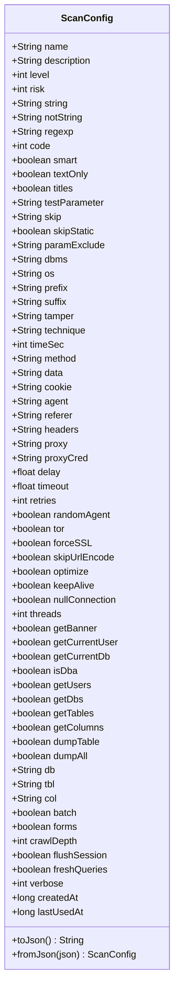

# 存储机制

<cite>
**本文档引用的文件**
- [ConfigManager.java](file://src/burpEx/legacy-api/src/main/java/com/sqlmapwebui/burp/ConfigManager.java)
- [PresetConfigDatabase.java](file://src/burpEx/legacy-api/src/main/java/com/sqlmapwebui/burp/PresetConfigDatabase.java)
- [ScanConfig.java](file://src/burpEx/legacy-api/src/main/java/com/sqlmapwebui/burp/ScanConfig.java)
- [PresetConfig.java](file://src/burpEx/legacy-api/src/main/java/com/sqlmapwebui/burp/PresetConfig.java)
- [ScanPresetDatabase.py](file://src/backEnd/model/ScanPresetDatabase.py)
</cite>

## 目录
1. [引言](#引言)
2. [SQLite数据库持久化存储](#sqlite数据库持久化存储)
3. [Burp Extension Settings API轻量级存储](#burp-extension-settings-api轻量级存储)
4. [两种存储方式的对比与适用场景](#两种存储方式的对比与适用场景)
5. [配置数据迁移与备份建议](#配置数据迁移与备份建议)

## 引言
本项目实现了两种互补的配置持久化存储机制，以满足不同场景下的需求。对于结构化的常用配置，采用SQLite数据库进行批量管理；对于轻量级的插件设置，则利用Burp Suite提供的Extension Settings API进行键值对存储。这两种机制共同构成了插件配置管理的核心，确保了用户配置的安全、可靠和高效访问。

## SQLite数据库持久化存储

### 数据库文件路径确定
`PresetConfigDatabase`类负责管理常用配置的SQLite数据库。数据库文件路径通过`System.getProperty("user.dir")`获取Burp Suite的运行目录，并在此目录下创建名为`sqlmap-webui-presets.db`的数据库文件。这种设计确保了数据库文件与Burp Suite用户目录的关联性，便于用户管理和备份。

### 表结构设计
数据库包含一个名为`preset_configs`的表，其字段定义如下：
- `id`: 主键，自增整数
- `name`: 配置名称，文本类型，非空
- `description`: 配置描述，文本类型
- `parameter_string`: 扫描参数字符串，文本类型，非空
- `created_time`: 创建时间，文本类型，非空
- `modified_time`: 修改时间，文本类型，非空

该表结构设计简洁明了，能够有效存储常用配置的核心信息。

### JDBC驱动显式加载策略
由于Burp Suite环境中的SPI机制可能无法自动发现SQLite JDBC驱动，`PresetConfigDatabase`类采用了显式加载策略。通过`synchronized`方法`loadDriver()`，使用`Class.forName("org.sqlite.JDBC")`显式加载驱动类，并通过静态变量`driverLoaded`确保驱动只加载一次。这种策略有效解决了在Burp Suite插件环境中JDBC驱动加载失败的问题。

### 数据库连接管理与事务处理
数据库连接通过`getConnection()`方法获取，使用`DriverManager.getConnection()`创建连接。所有数据库操作都封装在try-with-resources语句中，确保资源的自动释放。事务处理由JDBC驱动自动管理，每个操作（如插入、更新、删除）都是一个独立的事务。

### 异常恢复
在数据库操作中，捕获`SQLException`并记录详细的错误日志，同时提供用户友好的错误信息。例如，在初始化数据库时，如果创建表失败，会记录错误日志，但不会中断程序执行，确保插件的稳定性。

**Section sources**
- [PresetConfigDatabase.java](file://src/burpEx/legacy-api/src/main/java/com/sqlmapwebui/burp/PresetConfigDatabase.java#L1-L462)
- [PresetConfig.java](file://src/burpEx/legacy-api/src/main/java/com/sqlmapwebui/burp/PresetConfig.java#L1-L110)

## Burp Extension Settings API轻量级存储

### 存储机制概述
`ConfigManager`类利用Burp Suite的Extension Settings API来存储轻量级配置。这些配置包括后端URL、历史记录数量限制、自动去重开关等。API提供了`saveExtensionSetting`和`loadExtensionSetting`方法，用于保存和加载键值对。

### 轻量级配置项
- `backendUrl`: 后端服务URL
- `maxHistorySize`: 历史记录最大数量
- `autoDedupe`: 自动去重开关
- `maxInjectionMarkCount`: 注入点标记数量限制
- `showBinaryWarning`: 二进制报文警告开关

### JSON序列化格式在ScanConfig对象持久化中的应用
`ScanConfig`类实现了JSON序列化，用于将复杂的配置对象持久化到Extension Settings中。通过`toJson()`和`fromJson()`方法，使用Gson库将`ScanConfig`对象转换为JSON字符串进行存储，以及从JSON字符串反序列化为对象。这使得复杂的配置结构能够以字符串形式存储在键值对系统中。

**Diagram sources**
- [ScanConfig.java](file://src/burpEx/legacy-api/src/main/java/com/sqlmapwebui/burp/ScanConfig.java#L1-L679)

**Section sources**
- [ConfigManager.java](file://src/burpEx/legacy-api/src/main/java/com/sqlmapwebui/burp/ConfigManager.java#L1-L402)
- [ScanConfig.java](file://src/burpEx/legacy-api/src/main/java/com/sqlmapwebui/burp/ScanConfig.java#L1-L679)

## 两种存储方式的对比与适用场景

### 对比分析
| 特性 | SQLite数据库 | Extension Settings API |
| :--- | :--- | :--- |
| **数据结构** | 结构化数据，支持复杂查询 | 简单键值对 |
| **存储容量** | 大容量，适合批量管理 | 小容量，适合轻量级配置 |
| **查询能力** | 支持SQL查询，如搜索、排序 | 仅支持按键查找 |
| **性能** | 读写性能较高，适合频繁操作 | 性能较低，适合不频繁的配置读取 |
| **适用场景** | 常用配置、历史配置的批量管理 | 后端URL、开关等简单设置 |

### 适用场景
- **SQLite数据库**：适用于需要批量管理、复杂查询和大量数据存储的场景，如常用扫描配置的存储和管理。
- **Extension Settings API**：适用于存储简单的键值对配置，如插件的全局设置、用户偏好等。

## 配置数据迁移和备份的实用建议
1. **定期备份**：建议用户定期备份`sqlmap-webui-presets.db`文件，以防数据丢失。
2. **数据迁移**：在更换设备或重新安装Burp Suite时，可以将备份的数据库文件复制到新的用户目录下，实现配置的迁移。
3. **版本兼容性**：在升级插件版本时，注意数据库表结构的变更，必要时进行数据迁移。
4. **异常处理**：在数据库操作中，应捕获并处理异常，确保插件的稳定性，避免因数据库问题导致插件崩溃。

**Section sources**
- [PresetConfigDatabase.java](file://src/burpEx/legacy-api/src/main/java/com/sqlmapwebui/burp/PresetConfigDatabase.java#L1-L462)
- [ConfigManager.java](file://src/burpEx/legacy-api/src/main/java/com/sqlmapwebui/burp/ConfigManager.java#L1-L402)