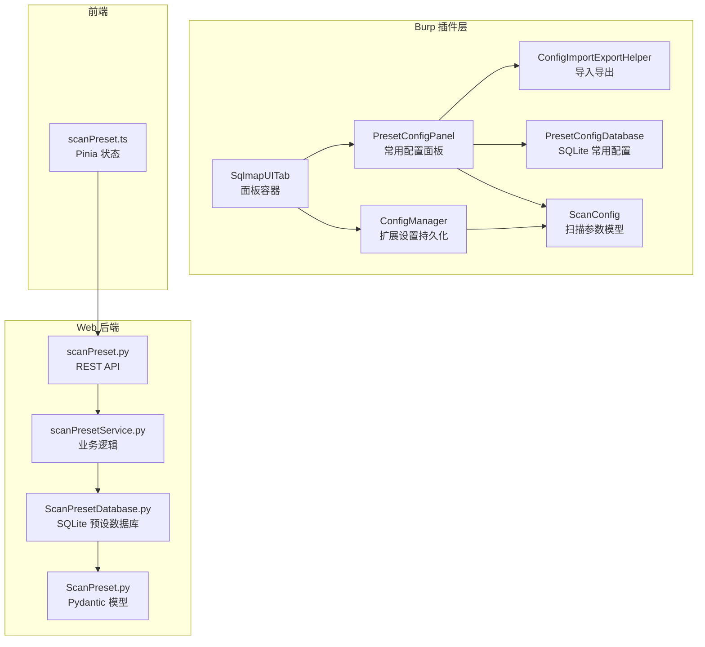
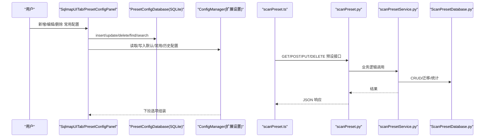
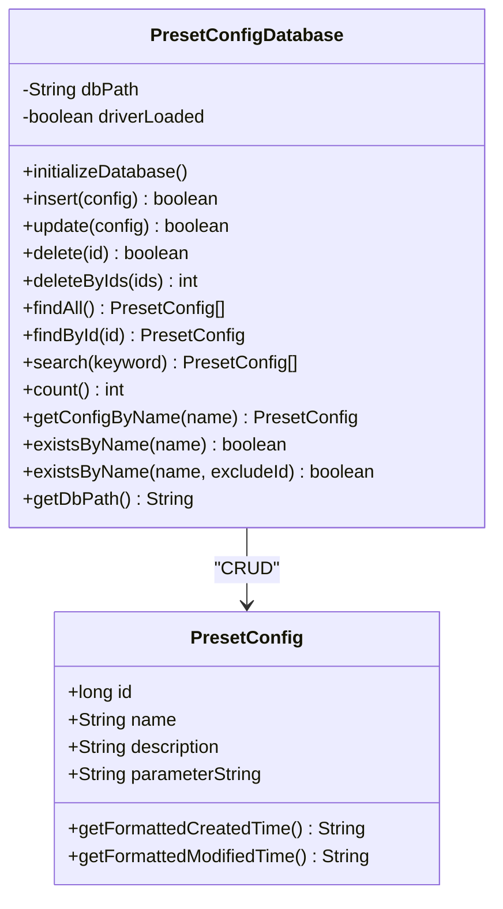
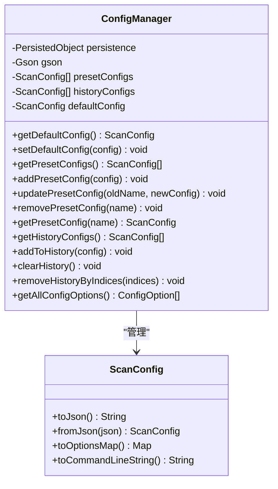
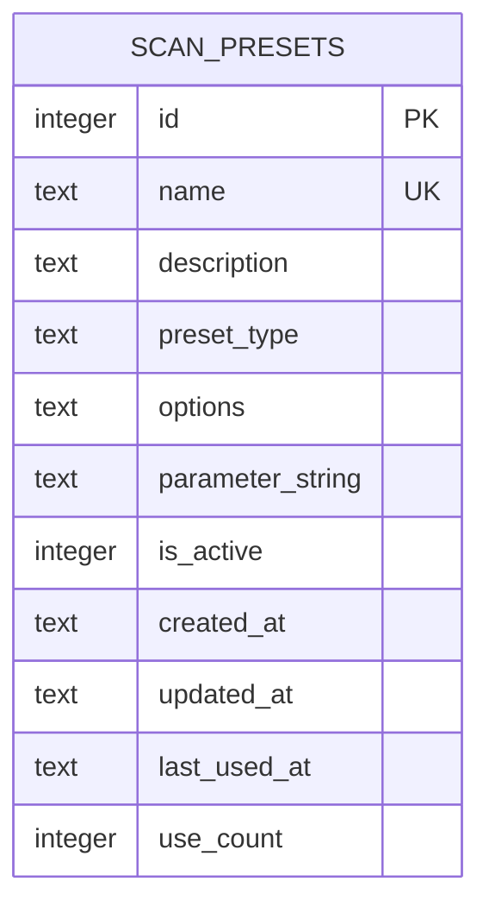
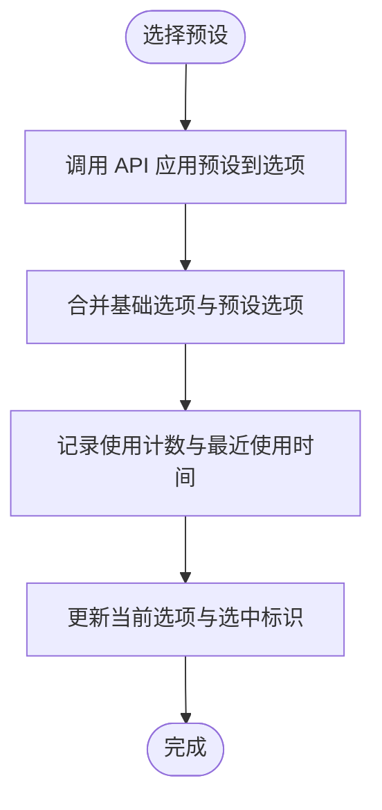
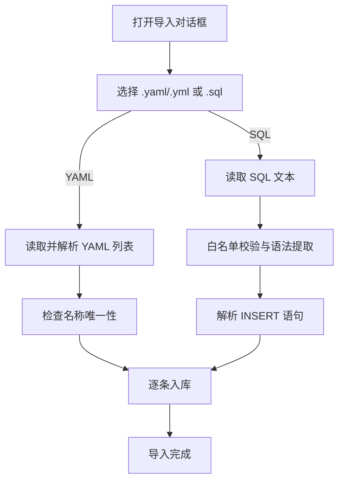
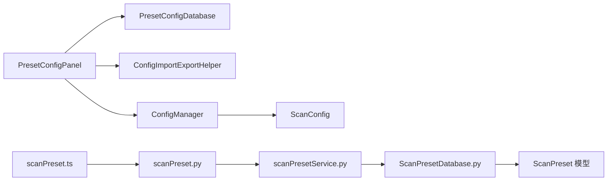

# 插件配置管理

<cite>
**本文引用的文件**
- [PresetConfigDatabase.java](file://src/burpEx/montoya-api/src/main/java/com/sqlmapwebui/burp/PresetConfigDatabase.java)
- [PresetConfig.java](file://src/burpEx/montoya-api/src/main/java/com/sqlmapwebui/burp/PresetConfig.java)
- [ConfigManager.java](file://src/burpEx/montoya-api/src/main/java/com/sqlmapwebui/burp/ConfigManager.java)
- [ScanConfig.java](file://src/burpEx/montoya-api/src/main/java/com/sqlmapwebui/burp/ScanConfig.java)
- [PresetConfigPanel.java](file://src/burpEx/montoya-api/src/main/java/com/sqlmapwebui/burp/panels/PresetConfigPanel.java)
- [ConfigImportExportHelper.java](file://src/burpEx/montoya-api/src/main/java/com/sqlmapwebui/burp/panels/ConfigImportExportHelper.java)
- [SqlmapUITab.java](file://src/burpEx/montoya-api/src/main/java/com/sqlmapwebui/burp/SqlmapUITab.java)
- [ScanPreset.py](file://src/backEnd/model/ScanPreset.py)
- [ScanPresetDatabase.py](file://src/backEnd/model/ScanPresetDatabase.py)
- [scanPreset.py](file://src/backEnd/api/commonApi/scanPreset.py)
- [scanPresetService.py](file://src/backEnd/service/scanPresetService.py)
- [scanPreset.ts](file://src/frontEnd/src/stores/scanPreset.ts)
</cite>

## 目录
1. [简介](#简介)
2. [项目结构](#项目结构)
3. [核心组件](#核心组件)
4. [架构总览](#架构总览)
5. [详细组件分析](#详细组件分析)
6. [依赖关系分析](#依赖关系分析)
7. [性能考量](#性能考量)
8. [故障排查指南](#故障排查指南)
9. [结论](#结论)
10. [附录](#附录)

## 简介
本文件面向 Burp Suite 扩展与 Web UI 的“扫描预设配置”管理，系统性阐述配置体系的设计与实现，覆盖以下主题：
- 配置类型：默认配置、常用配置、历史配置
- 配置生命周期：创建、编辑、导入导出、持久化存储
- 配置同步机制：Burp 插件与 Web UI 的一致性保障
- PresetConfigDatabase 类的实现原理：序列化格式、存储策略、迁移与安全导入
- 最佳实践：模板创建、团队共享、版本控制
- 异常恢复与数据迁移指南

## 项目结构
该配置体系横跨三部分：
- Burp 插件层（Montoya API）：负责本地 SQLite 存储、UI 面板、导入导出、与后端通信
- Web 后端（FastAPI + Python）：提供 REST API、数据库模型与服务层
- 前端（Vue + Pinia）：提供配置选择、应用、保存与历史记录展示

图表来源
- [SqlmapUITab.java](file://src/burpEx/montoya-api/src/main/java/com/sqlmapwebui/burp/SqlmapUITab.java#L1-L186)
- [PresetConfigPanel.java](file://src/burpEx/montoya-api/src/main/java/com/sqlmapwebui/burp/panels/PresetConfigPanel.java#L1-L650)
- [ConfigImportExportHelper.java](file://src/burpEx/montoya-api/src/main/java/com/sqlmapwebui/burp/panels/ConfigImportExportHelper.java#L1-L393)
- [PresetConfigDatabase.java](file://src/burpEx/montoya-api/src/main/java/com/sqlmapwebui/burp/PresetConfigDatabase.java#L1-L462)
- [ConfigManager.java](file://src/burpEx/montoya-api/src/main/java/com/sqlmapwebui/burp/ConfigManager.java#L1-L406)
- [ScanConfig.java](file://src/burpEx/montoya-api/src/main/java/com/sqlmapwebui/burp/ScanConfig.java#L1-L679)
- [scanPreset.py](file://src/backEnd/api/commonApi/scanPreset.py#L1-L325)
- [scanPresetService.py](file://src/backEnd/service/scanPresetService.py#L1-L182)
- [ScanPreset.py](file://src/backEnd/model/ScanPreset.py#L1-L231)
- [ScanPresetDatabase.py](file://src/backEnd/model/ScanPresetDatabase.py#L1-L514)
- [scanPreset.ts](file://src/frontEnd/src/stores/scanPreset.ts#L1-L296)

章节来源
- [SqlmapUITab.java](file://src/burpEx/montoya-api/src/main/java/com/sqlmapwebui/burp/SqlmapUITab.java#L1-L186)
- [PresetConfigPanel.java](file://src/burpEx/montoya-api/src/main/java/com/sqlmapwebui/burp/panels/PresetConfigPanel.java#L1-L650)
- [ConfigImportExportHelper.java](file://src/burpEx/montoya-api/src/main/java/com/sqlmapwebui/burp/panels/ConfigImportExportHelper.java#L1-L393)
- [PresetConfigDatabase.java](file://src/burpEx/montoya-api/src/main/java/com/sqlmapwebui/burp/PresetConfigDatabase.java#L1-L462)
- [ConfigManager.java](file://src/burpEx/montoya-api/src/main/java/com/sqlmapwebui/burp/ConfigManager.java#L1-L406)
- [ScanConfig.java](file://src/burpEx/montoya-api/src/main/java/com/sqlmapwebui/burp/ScanConfig.java#L1-L679)
- [scanPreset.py](file://src/backEnd/api/commonApi/scanPreset.py#L1-L325)
- [scanPresetService.py](file://src/backEnd/service/scanPresetService.py#L1-L182)
- [ScanPreset.py](file://src/backEnd/model/ScanPreset.py#L1-L231)
- [ScanPresetDatabase.py](file://src/backEnd/model/ScanPresetDatabase.py#L1-L514)
- [scanPreset.ts](file://src/frontEnd/src/stores/scanPreset.ts#L1-L296)

## 核心组件
- PresetConfigDatabase（Burp 插件）：以 SQLite 存储常用配置，提供增删改查、搜索、导入导出、唯一性约束与安全导入校验
- PresetConfig（Burp 插件）：常用配置的数据模型，包含名称、描述、参数字符串及时间戳
- ConfigManager（Burp 插件）：管理默认配置、常用配置、历史配置，使用扩展设置持久化；提供 UI 下拉选项组装
- ScanConfig（Burp 插件）：扫描参数模型，支持 JSON 序列化、命令行参数字符串生成与解析
- ScanPreset/ScanPresetDatabase（后端）：Pydantic 模型与 SQLite 数据库，管理默认、常用、历史三类预设，支持迁移、索引与使用统计
- scanPreset API/Service（后端）：提供 REST 接口与业务逻辑，支持应用预设到选项、历史记录维护、默认配置更新
- scanPreset Store（前端）：Pinia 状态管理，提供下拉选项、应用预设、保存当前配置为预设、历史记录维护

章节来源
- [PresetConfigDatabase.java](file://src/burpEx/montoya-api/src/main/java/com/sqlmapwebui/burp/PresetConfigDatabase.java#L1-L462)
- [PresetConfig.java](file://src/burpEx/montoya-api/src/main/java/com/sqlmapwebui/burp/PresetConfig.java#L1-L110)
- [ConfigManager.java](file://src/burpEx/montoya-api/src/main/java/com/sqlmapwebui/burp/ConfigManager.java#L1-L406)
- [ScanConfig.java](file://src/burpEx/montoya-api/src/main/java/com/sqlmapwebui/burp/ScanConfig.java#L1-L679)
- [ScanPreset.py](file://src/backEnd/model/ScanPreset.py#L1-L231)
- [ScanPresetDatabase.py](file://src/backEnd/model/ScanPresetDatabase.py#L1-L514)
- [scanPreset.py](file://src/backEnd/api/commonApi/scanPreset.py#L1-L325)
- [scanPresetService.py](file://src/backEnd/service/scanPresetService.py#L1-L182)
- [scanPreset.ts](file://src/frontEnd/src/stores/scanPreset.ts#L1-L296)

## 架构总览
配置体系围绕“三类配置”展开：默认配置、常用配置、历史配置。Burp 插件与 Web UI 通过各自的持久化与 API 互通，保证配置一致性。

图表来源
- [SqlmapUITab.java](file://src/burpEx/montoya-api/src/main/java/com/sqlmapwebui/burp/SqlmapUITab.java#L1-L186)
- [PresetConfigPanel.java](file://src/burpEx/montoya-api/src/main/java/com/sqlmapwebui/burp/panels/PresetConfigPanel.java#L1-L650)
- [PresetConfigDatabase.java](file://src/burpEx/montoya-api/src/main/java/com/sqlmapwebui/burp/PresetConfigDatabase.java#L1-L462)
- [ConfigManager.java](file://src/burpEx/montoya-api/src/main/java/com/sqlmapwebui/burp/ConfigManager.java#L1-L406)
- [scanPreset.ts](file://src/frontEnd/src/stores/scanPreset.ts#L1-L296)
- [scanPreset.py](file://src/backEnd/api/commonApi/scanPreset.py#L1-L325)
- [scanPresetService.py](file://src/backEnd/service/scanPresetService.py#L1-L182)
- [ScanPresetDatabase.py](file://src/backEnd/model/ScanPresetDatabase.py#L1-L514)

## 详细组件分析

### PresetConfigDatabase（常用配置本地数据库）
- 存储介质：SQLite，文件位于 Burp Suite 运行目录，表名固定
- 主要能力：
  - 初始化表结构（含唯一性约束、索引）
  - 增删改查、按名称/ID 查询、搜索（名称/描述/参数字符串）
  - 批量删除、统计总数、获取最新记录
  - 导入导出：YAML/SQL，SQL 导入具备白名单与解析校验
- 关键约束：
  - 名称唯一（支持排除自身）
  - 自动记录创建/修改时间
- 安全导入：
  - SQL 仅允许 CREATE TABLE 与 INSERT
  - 解析 INSERT 语句提取字段，转义特殊字符
  - YAML 导入时检查名称唯一性

图表来源
- [PresetConfigDatabase.java](file://src/burpEx/montoya-api/src/main/java/com/sqlmapwebui/burp/PresetConfigDatabase.java#L1-L462)
- [PresetConfig.java](file://src/burpEx/montoya-api/src/main/java/com/sqlmapwebui/burp/PresetConfig.java#L1-L110)

章节来源
- [PresetConfigDatabase.java](file://src/burpEx/montoya-api/src/main/java/com/sqlmapwebui/burp/PresetConfigDatabase.java#L1-L462)
- [PresetConfig.java](file://src/burpEx/montoya-api/src/main/java/com/sqlmapwebui/burp/PresetConfig.java#L1-L110)

### ConfigManager（扩展设置持久化与配置类型管理）
- 配置类型：
  - 默认配置：单个，作为全局默认
  - 常用配置：列表，支持去重与覆盖
  - 历史配置：列表，按最近使用排序，支持上限裁剪
- 持久化位置：Burp 扩展设置（key-value），使用 JSON 序列化常用/历史配置
- 关键能力：
  - 加载/保存默认配置
  - 增删改常用配置，自动去重
  - 历史记录入队、裁剪、清空、按索引删除
  - 组装下拉选项（默认/常用/历史）

图表来源
- [ConfigManager.java](file://src/burpEx/montoya-api/src/main/java/com/sqlmapwebui/burp/ConfigManager.java#L1-L406)
- [ScanConfig.java](file://src/burpEx/montoya-api/src/main/java/com/sqlmapwebui/burp/ScanConfig.java#L1-L679)

章节来源
- [ConfigManager.java](file://src/burpEx/montoya-api/src/main/java/com/sqlmapwebui/burp/ConfigManager.java#L1-L406)
- [ScanConfig.java](file://src/burpEx/montoya-api/src/main/java/com/sqlmapwebui/burp/ScanConfig.java#L1-L679)

### Web 后端：ScanPreset 与 ScanPresetDatabase
- 模型：
  - ScanPreset：包含 id、name、description、preset_type、options、parameter_string、状态字段与时间戳
  - ScanOptions：与 sqlmap optiondict.py 字段对齐，支持非默认值压缩序列化
- 数据库：
  - 表结构含唯一约束（name）、默认类型（preset）、索引（类型/激活/名称）
  - 迁移：自动添加 parameter_string 列
  - 默认预设初始化：默认、快速扫描、深度扫描、安全扫描
- 服务：
  - CRUD、默认配置更新、历史记录维护、使用计数与最近使用时间
  - 应用预设到选项：合并策略（基础选项优先，预设覆盖）

图表来源
- [ScanPresetDatabase.py](file://src/backEnd/model/ScanPresetDatabase.py#L1-L514)
- [ScanPreset.py](file://src/backEnd/model/ScanPreset.py#L1-L231)

章节来源
- [ScanPreset.py](file://src/backEnd/model/ScanPreset.py#L1-L231)
- [ScanPresetDatabase.py](file://src/backEnd/model/ScanPresetDatabase.py#L1-L514)
- [scanPresetService.py](file://src/backEnd/service/scanPresetService.py#L1-L182)
- [scanPreset.py](file://src/backEnd/api/commonApi/scanPreset.py#L1-L325)

### 前端：scanPreset Store
- 功能：
  - 加载默认/常用/历史配置，组装下拉选项
  - 应用预设到当前选项，计算有效选项（非默认值）
  - 保存当前配置为新预设、添加到历史记录
  - 更新默认配置并回填当前选项

图表来源
- [scanPreset.ts](file://src/frontEnd/src/stores/scanPreset.ts#L1-L296)
- [scanPreset.py](file://src/backEnd/api/commonApi/scanPreset.py#L1-L325)
- [scanPresetService.py](file://src/backEnd/service/scanPresetService.py#L1-L182)

章节来源
- [scanPreset.ts](file://src/frontEnd/src/stores/scanPreset.ts#L1-L296)
- [scanPreset.py](file://src/backEnd/api/commonApi/scanPreset.py#L1-L325)
- [scanPresetService.py](file://src/backEnd/service/scanPresetService.py#L1-L182)

### 导入导出流程（Burp 插件）
- 支持格式：YAML、SQL
- YAML 导入：逐条解析 name/description/parameters，检查唯一性后入库
- SQL 导入：白名单校验（仅允许 CREATE TABLE/INSERT），解析 INSERT 提取字段，转义后入库
- 导出：YAML 输出字段包含名称、描述、参数、时间；SQL 输出建表与多条 INSERT

图表来源
- [ConfigImportExportHelper.java](file://src/burpEx/montoya-api/src/main/java/com/sqlmapwebui/burp/panels/ConfigImportExportHelper.java#L1-L393)
- [PresetConfigDatabase.java](file://src/burpEx/montoya-api/src/main/java/com/sqlmapwebui/burp/PresetConfigDatabase.java#L1-L462)

章节来源
- [ConfigImportExportHelper.java](file://src/burpEx/montoya-api/src/main/java/com/sqlmapwebui/burp/panels/ConfigImportExportHelper.java#L1-L393)
- [PresetConfigDatabase.java](file://src/burpEx/montoya-api/src/main/java/com/sqlmapwebui/burp/PresetConfigDatabase.java#L1-L462)

## 依赖关系分析
- UI 层依赖：
  - SqlmapUITab 组织多个面板，PresetConfigPanel 依赖 PresetConfigDatabase 与 ConfigImportExportHelper
  - ConfigManager 与 ScanConfig 为插件侧配置核心
- 后端依赖：
  - scanPreset.py 依赖 scanPresetService.py，后者依赖 ScanPresetDatabase.py 与 ScanPreset 模型
- 前后端交互：
  - 前端通过 scanPreset.ts 调用 scanPreset.py，后端返回 JSON，前端更新状态与 UI

图表来源
- [PresetConfigPanel.java](file://src/burpEx/montoya-api/src/main/java/com/sqlmapwebui/burp/panels/PresetConfigPanel.java#L1-L650)
- [PresetConfigDatabase.java](file://src/burpEx/montoya-api/src/main/java/com/sqlmapwebui/burp/PresetConfigDatabase.java#L1-L462)
- [ConfigImportExportHelper.java](file://src/burpEx/montoya-api/src/main/java/com/sqlmapwebui/burp/panels/ConfigImportExportHelper.java#L1-L393)
- [ConfigManager.java](file://src/burpEx/montoya-api/src/main/java/com/sqlmapwebui/burp/ConfigManager.java#L1-L406)
- [ScanConfig.java](file://src/burpEx/montoya-api/src/main/java/com/sqlmapwebui/burp/ScanConfig.java#L1-L679)
- [scanPreset.ts](file://src/frontEnd/src/stores/scanPreset.ts#L1-L296)
- [scanPreset.py](file://src/backEnd/api/commonApi/scanPreset.py#L1-L325)
- [scanPresetService.py](file://src/backEnd/service/scanPresetService.py#L1-L182)
- [ScanPresetDatabase.py](file://src/backEnd/model/ScanPresetDatabase.py#L1-L514)
- [ScanPreset.py](file://src/backEnd/model/ScanPreset.py#L1-L231)

章节来源
- [SqlmapUITab.java](file://src/burpEx/montoya-api/src/main/java/com/sqlmapwebui/burp/SqlmapUITab.java#L1-L186)
- [scanPreset.ts](file://src/frontEnd/src/stores/scanPreset.ts#L1-L296)
- [scanPreset.py](file://src/backEnd/api/commonApi/scanPreset.py#L1-L325)
- [scanPresetService.py](file://src/backEnd/service/scanPresetService.py#L1-L182)
- [ScanPresetDatabase.py](file://src/backEnd/model/ScanPresetDatabase.py#L1-L514)

## 性能考量
- SQLite 本地存储：
  - 建议控制常用配置数量，避免过多行导致查询变慢
  - 使用索引（类型/激活/名称）提升检索效率
- JSON 序列化：
  - ConfigManager 使用 Gson 序列化常用/历史配置，注意配置体量较大时的序列化开销
- 历史记录裁剪：
  - ConfigManager 的历史记录上限裁剪避免无限增长
- 前端应用预设：
  - 合并选项时建议仅传非默认值，减少网络传输与后端处理成本

[本节为通用指导，无需特定文件引用]

## 故障排查指南
- SQLite 驱动加载失败：
  - 现象：日志提示驱动加载失败
  - 处理：确认插件 JAR 包含 sqlite-jdbc 依赖
- 名称冲突：
  - 现象：新增/更新失败，提示名称已存在
  - 处理：更换名称或删除同名配置
- SQL 导入安全拒绝：
  - 现象：导入 SQL 报错，提示不允许的操作类型
  - 处理：仅使用白名单内的 CREATE TABLE/INSERT，修正 SQL
- 默认配置保护：
  - 现象：尝试删除默认预设被拒绝
  - 处理：默认预设不可删除，可通过更新选项进行调整
- 历史记录溢出：
  - 现象：历史记录超过上限未及时清理
  - 处理：调整历史记录上限或手动清理

章节来源
- [PresetConfigDatabase.java](file://src/burpEx/montoya-api/src/main/java/com/sqlmapwebui/burp/PresetConfigDatabase.java#L1-L462)
- [ConfigImportExportHelper.java](file://src/burpEx/montoya-api/src/main/java/com/sqlmapwebui/burp/panels/ConfigImportExportHelper.java#L1-L393)
- [scanPresetService.py](file://src/backEnd/service/scanPresetService.py#L1-L182)

## 结论
该配置管理体系通过“三类配置”的清晰划分与前后端协同，实现了从 Burp 插件到 Web UI 的统一配置管理。PresetConfigDatabase 与 ScanPresetDatabase 分别承担本地与后端的持久化职责，ConfigManager 与 scanPresetService 提供一致的配置生命周期管理。导入导出的安全校验与历史记录的上限裁剪，进一步提升了系统的可靠性与可维护性。

[本节为总结，无需特定文件引用]

## 附录

### 配置类型与使用场景
- 默认配置：全局默认扫描参数，适合首次启动或重置场景
- 常用配置：团队/个人常用扫描策略，便于快速复用
- 历史配置：最近使用过的扫描参数快照，支持快速回溯

章节来源
- [ConfigManager.java](file://src/burpEx/montoya-api/src/main/java/com/sqlmapwebui/burp/ConfigManager.java#L1-L406)
- [ScanPreset.py](file://src/backEnd/model/ScanPreset.py#L1-L231)

### 配置同步机制
- Burp 插件与 Web UI 通过各自持久化与 API 互通：
  - 插件侧：扩展设置（默认/常用/历史）与本地 SQLite（常用配置）
  - Web 侧：REST API 与 SQLite 数据库存储
- 前端通过 scanPreset.ts 与后端交互，应用预设时记录使用统计

章节来源
- [ConfigManager.java](file://src/burpEx/montoya-api/src/main/java/com/sqlmapwebui/burp/ConfigManager.java#L1-L406)
- [scanPreset.ts](file://src/frontEnd/src/stores/scanPreset.ts#L1-L296)
- [scanPreset.py](file://src/backEnd/api/commonApi/scanPreset.py#L1-L325)
- [scanPresetService.py](file://src/backEnd/service/scanPresetService.py#L1-L182)

### PresetConfigDatabase 实现要点
- 表结构与迁移：自动添加 parameter_string 列，建立索引
- 唯一性约束：名称唯一，支持排除自身
- 安全导入：SQL 白名单与解析校验，YAML 导入检查唯一性
- 日志与可观测性：统一日志输出，便于排障

章节来源
- [PresetConfigDatabase.java](file://src/burpEx/montoya-api/src/main/java/com/sqlmapwebui/burp/PresetConfigDatabase.java#L1-L462)
- [ConfigImportExportHelper.java](file://src/burpEx/montoya-api/src/main/java/com/sqlmapwebui/burp/panels/ConfigImportExportHelper.java#L1-L393)

### 最佳实践
- 模板创建：将常用参数组合为 YAML 模板，导入到常用配置库
- 团队协作：通过 SQL 导出/导入在团队成员间共享常用配置
- 版本控制：定期导出 YAML/SQL，纳入版本管理，便于审计与回滚
- 规范命名：为配置起明确含义的名称，避免歧义
- 历史记录管理：定期清理不再使用的历史配置，保持列表整洁

章节来源
- [ConfigImportExportHelper.java](file://src/burpEx/montoya-api/src/main/java/com/sqlmapwebui/burp/panels/ConfigImportExportHelper.java#L1-L393)
- [scanPreset.ts](file://src/frontEnd/src/stores/scanPreset.ts#L1-L296)

### 异常恢复与数据迁移
- 异常恢复：
  - SQLite 文件损坏：备份原文件，重建表结构并重新导入
  - 默认配置丢失：后端初始化默认预设，或通过 API 重新创建
- 数据迁移：
  - 从旧版本迁移：ScanPresetDatabase 自动迁移添加 parameter_string 列
  - 跨平台迁移：导出 YAML/SQL，导入到目标环境

章节来源
- [ScanPresetDatabase.py](file://src/backEnd/model/ScanPresetDatabase.py#L1-L514)
- [PresetConfigDatabase.java](file://src/burpEx/montoya-api/src/main/java/com/sqlmapwebui/burp/PresetConfigDatabase.java#L1-L462)