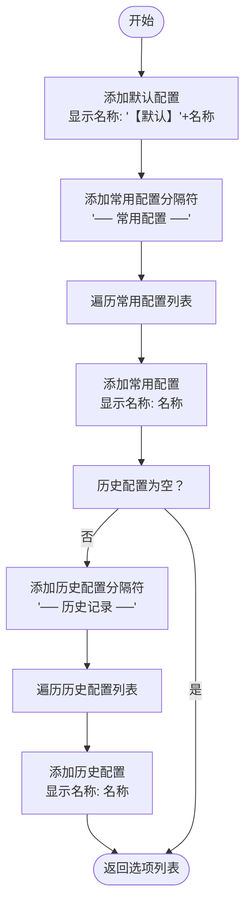
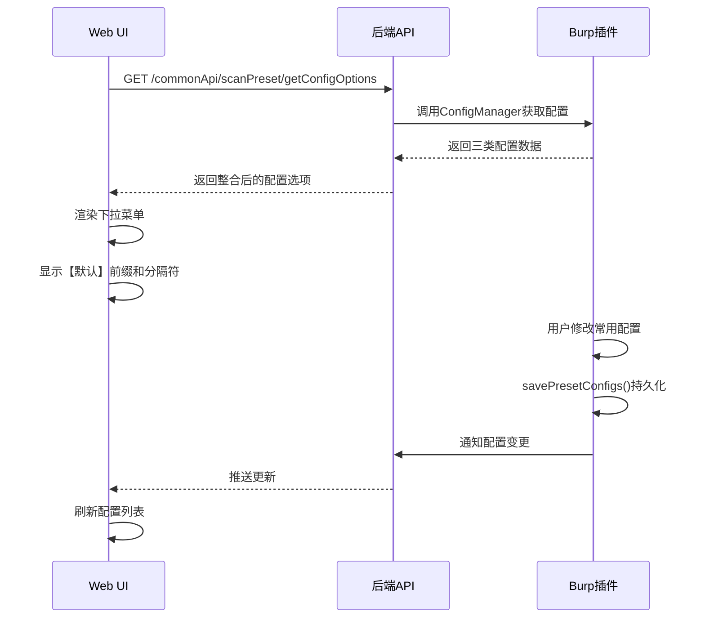

# 配置类型

<cite>
**本文档引用文件**   
- [ConfigManager.java](file://src/burpEx/legacy-api/src/main/java/com/sqlmapwebui/burp/ConfigManager.java)
- [ScanConfig.java](file://src/burpEx/legacy-api/src/main/java/com/sqlmapwebui/burp/ScanConfig.java)
- [PresetConfigDatabase.java](file://src/burpEx/legacy-api/src/main/java/com/sqlmapwebui/burp/PresetConfigDatabase.java)
- [scanPreset.ts](file://src/frontEnd/src/stores/scanPreset.ts)
- [scanPreset.py](file://src/backEnd/api/commonApi/scanPreset.py)
- [configController.py](file://src/backEnd/api/commonApi/configController.py)
</cite>

## 目录
1. [引言](#引言)
2. [默认配置](#默认配置)
3. [常用配置](#常用配置)
4. [历史配置](#历史配置)
5. [配置类型优先级与使用场景](#配置类型优先级与使用场景)
6. [配置选项整合机制](#配置选项整合机制)
7. [Web UI与Burp插件间的一致性调用](#web-ui与burp插件间的一致性调用)

## 引言
本文档深入讲解Burp Suite插件中的三种核心配置类型：默认配置、常用配置和历史配置。详细说明默认配置作为新任务基础模板的作用机制，包括其初始化逻辑和全局影响范围。阐述常用配置的创建、编辑、删除流程，以及如何通过名称唯一性保证进行配置更新。解释历史配置的自动生成策略，包括时间戳标记、使用频率追踪和自动过期机制。分析三种配置类型的优先级关系和使用场景，提供在Web UI与Burp插件间一致调用这些配置的最佳实践。结合代码示例说明ConfigManager中getAllConfigOptions()方法如何整合三类配置形成统一选择列表，并处理分隔符与显示名称的生成逻辑。

**本文档引用文件**   
- [ConfigManager.java](file://src/burpEx/legacy-api/src/main/java/com/sqlmapwebui/burp/ConfigManager.java#L1-L402)
- [ScanConfig.java](file://src/burpEx/legacy-api/src/main/java/com/sqlmapwebui/burp/ScanConfig.java#L1-L679)

## 默认配置
默认配置是所有新扫描任务的基础模板，作为系统初始化时的基准配置。当用户创建新任务时，若未选择其他配置，系统将自动使用默认配置。默认配置通过`ConfigManager.getDefaultConfig()`方法获取，其初始化逻辑在`ConfigManager`类的构造函数中完成。

默认配置的全局影响范围体现在多个层面：首先，它作为所有新任务的起点，确保了扫描行为的一致性；其次，在配置管理界面中，它被标记为“【默认】”并始终位于配置选择列表的首位；最后，当用户修改默认配置时，这些更改会立即保存到Burp Suite的扩展设置中，确保下次启动时仍保持最新状态。

默认配置的持久化通过Burp的`saveExtensionSetting`和`loadExtensionSetting`机制实现，存储键名为`KEY_DEFAULT_CONFIG`。系统在启动时自动加载默认配置，若不存在则创建一个包含推荐参数的默认实例。这种机制确保了配置的可靠性和持久性。

**本文档引用文件**   
- [ConfigManager.java](file://src/burpEx/legacy-api/src/main/java/com/sqlmapwebui/burp/ConfigManager.java#L224-L233)
- [ScanConfig.java](file://src/burpEx/legacy-api/src/main/java/com/sqlmapwebui/burp/ScanConfig.java#L95-L116)

## 常用配置
常用配置是用户手动创建和管理的预设配置集合，存储在SQLite数据库中，支持增删改查操作。常用配置的创建流程通过`PresetConfigDatabase.insert()`方法实现，该方法首先检查同名配置是否存在，若存在则返回失败，从而保证了配置名称的唯一性。

常用配置的编辑流程通过`PresetConfigDatabase.update()`方法实现，该方法在更新前会检查新名称是否已被其他配置使用（排除自身ID），确保名称唯一性。删除操作通过`delete()`和`deleteByIds()`方法实现，支持单个或批量删除。

常用配置的管理界面提供了搜索过滤功能，支持关键字、正则表达式、大小写敏感和反选等高级搜索选项。所有常用配置按ID降序排列，确保最新创建的配置显示在列表顶部。常用配置的持久化由SQLite数据库保证，配置数据包括名称、描述、参数字符串以及创建和修改时间戳。

**本文档引用文件**   
- [PresetConfigDatabase.java](file://src/burpEx/legacy-api/src/main/java/com/sqlmapwebui/burp/PresetConfigDatabase.java#L89-L224)
- [PresetConfig.java](file://src/burpEx/legacy-api/src/main/java/com/sqlmapwebui/burp/PresetConfig.java#L1-L110)
- [scanPreset.py](file://src/backEnd/api/commonApi/scanPreset.py#L200-L267)

## 历史配置
历史配置是系统自动生成的配置记录，每次用户执行扫描任务后，当前配置会被自动添加到历史记录中。历史配置的生成策略包括：创建时复制当前配置、更新最后使用时间戳、以及在名称后附加时间戳标记（格式为"MM-dd HH:mm"）。

历史配置的使用频率追踪通过`lastUsedAt`字段实现，该字段在每次使用配置时更新为当前时间。自动过期机制通过`trimHistory()`方法实现，该方法在历史记录数量超过`maxHistorySize`（默认20条，范围3-32条）时，从列表末尾删除多余的记录。

历史配置的存储键名为`KEY_HISTORY_CONFIGS`，以JSON格式保存在Burp扩展设置中。用户可以通过历史配置面板进行搜索、过滤和多选删除操作。历史配置在配置选择列表中以"── 历史记录 ──"分隔符与其他配置类型区分，确保用户能清晰识别。

**本文档引用文件**   
- [ConfigManager.java](file://src/burpEx/legacy-api/src/main/java/com/sqlmapwebui/burp/ConfigManager.java#L276-L333)
- [HistoryConfigPanel.java](file://src/burpEx/legacy-api/src/main/java/com/sqlmapwebui/burp/panels/HistoryConfigPanel.java#L1-L320)

## 配置类型优先级与使用场景
三种配置类型具有明确的优先级关系：默认配置作为基础模板，常用配置作为用户自定义预设，历史配置作为临时记录。在使用场景上，默认配置适用于新用户或需要标准扫描参数的场景；常用配置适用于需要重复使用的特定扫描策略；历史配置适用于快速回溯最近使用的配置。

在配置选择界面中，优先级通过列表顺序体现：默认配置位于首位，其次是常用配置，最后是历史配置。用户可以通过复选框快速切换是否使用默认配置，当勾选"使用默认配置"时，系统将忽略其他配置选择。

最佳实践建议：将最常用的扫描参数保存为常用配置，避免频繁调整；定期清理历史配置以保持列表简洁；根据项目需求调整默认配置，提高工作效率。

**本文档引用文件**   
- [AdvancedScanConfigDialog.java](file://src/burpEx/legacy-api/src/main/java/com/sqlmapwebui/burp/dialogs/AdvancedScanConfigDialog.java#L207-L267)
- [DefaultConfigPanel.java](file://src/burpEx/legacy-api/src/main/java/com/sqlmapwebui/burp/panels/DefaultConfigPanel.java#L71-L151)

## 配置选项整合机制
`ConfigManager.getAllConfigOptions()`方法负责整合三类配置形成统一的选择列表。该方法返回`List<ConfigOption>`，其中`ConfigOption`是包含显示名称、配置对象和类型枚举的包装类。

整合逻辑如下：首先添加默认配置，显示名称为"【默认】"+配置名称；然后添加"── 常用配置 ──"分隔符；接着遍历所有常用配置；如果存在历史配置，则添加"── 历史记录 ──"分隔符并遍历所有历史配置。

分隔符的生成通过`ConfigOption.createSeparator()`静态方法实现，创建类型为`SEPARATOR`且配置对象为null的特殊选项。显示名称的生成逻辑在前端和后端保持一致：默认配置添加"【默认】"前缀，分隔符使用全角破折号包围的中文标签。

**图表来源**  
- [ConfigManager.java](file://src/burpEx/legacy-api/src/main/java/com/sqlmapwebui/burp/ConfigManager.java#L344-L367)

**本文档引用文件**   
- [ConfigManager.java](file://src/burpEx/legacy-api/src/main/java/com/sqlmapwebui/burp/ConfigManager.java#L344-L367)
- [ConfigOption.java](file://src/burpEx/legacy-api/src/main/java/com/sqlmapwebui/burp/ConfigManager.java#L376-L399)

## Web UI与Burp插件间的一致性调用
Web UI与Burp插件通过统一的API接口实现配置的一致性调用。前端通过`scanPresetApi.getConfigOptions()`调用后端`/commonApi/scanPreset/getConfigOptions`接口获取所有配置选项，该接口返回包含默认、常用和历史配置的完整数据结构。

后端`scanPreset.py`中的`get_config_options`路由处理该请求，从数据库和配置管理器中收集三类配置并返回。前端`scanPreset.ts`中的`presetOptions`计算属性将这些数据转换为下拉菜单所需的选项格式，确保分隔符和显示名称与Burp插件保持一致。

双向同步机制确保了配置变更的实时性：当用户在Burp插件中修改配置时，`savePresetConfigs()`和`saveHistoryConfigs()`方法会立即持久化更改；前端通过定期轮询或WebSocket接收更新通知，保持UI同步。

**图表来源**  
- [scanPreset.ts](file://src/frontEnd/src/stores/scanPreset.ts#L88-L95)
- [scanPreset.py](file://src/backEnd/api/commonApi/scanPreset.py#L100-L150)

**本文档引用文件**   
- [scanPreset.ts](file://src/frontEnd/src/stores/scanPreset.ts#L88-L95)
- [scanPreset.py](file://src/backEnd/api/commonApi/scanPreset.py#L100-L150)
- [configController.py](file://src/backEnd/api/commonApi/configController.py#L34-L64)