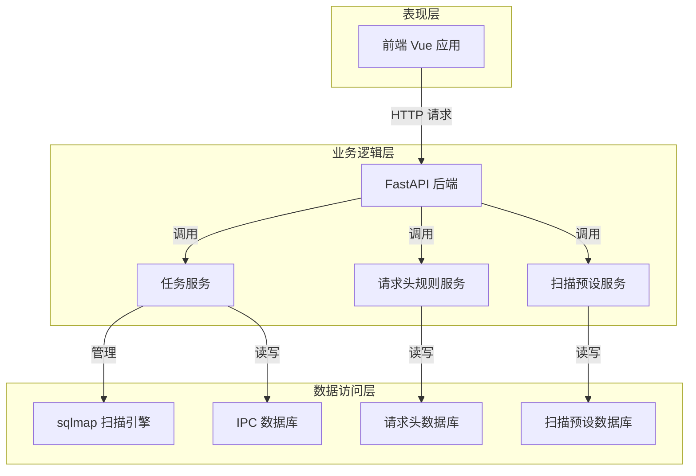
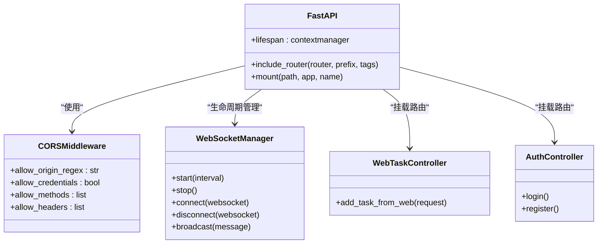
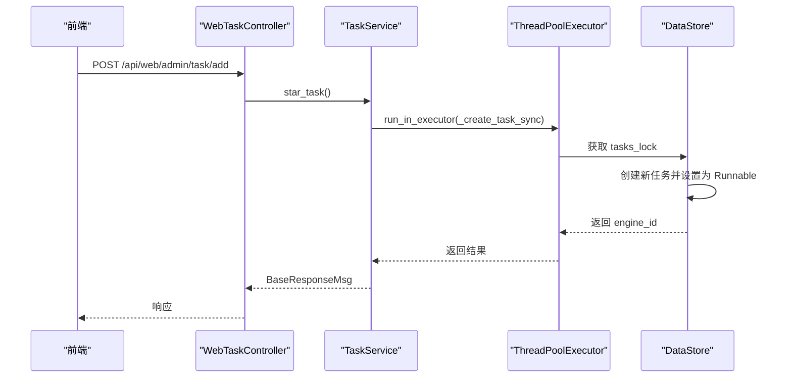
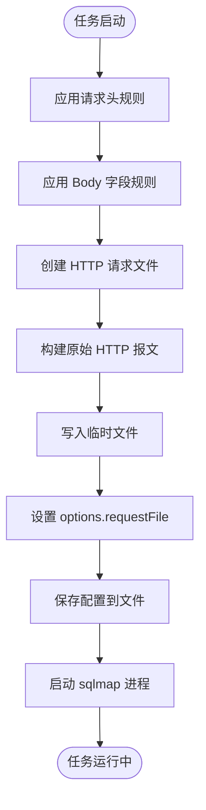
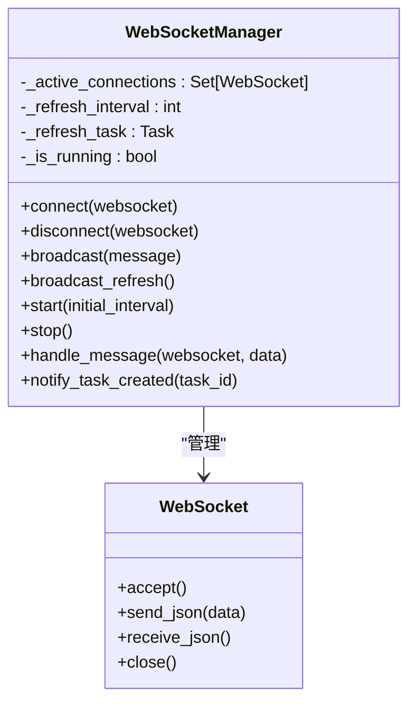
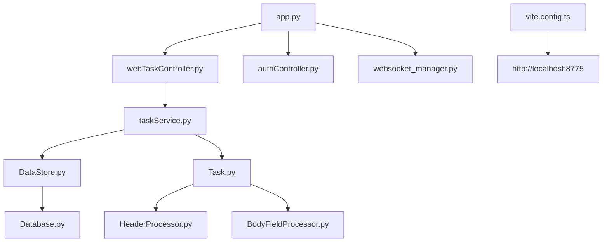

# VulnShop 靶场架构重构

<cite>
**本文档引用文件**   
- [app.py](file://src/backEnd/app.py)
- [main.py](file://src/backEnd/main.py)
- [config.py](file://src/backEnd/config.py)
- [websocket_manager.py](file://src/backEnd/utils/websocket_manager.py)
- [task_monitor.py](file://src/backEnd/utils/task_monitor.py)
- [DataStore.py](file://src/backEnd/model/DataStore.py)
- [webTaskController.py](file://src/backEnd/api/commonApi/webTaskController.py)
- [taskService.py](file://src/backEnd/service/taskService.py)
- [Task.py](file://src/backEnd/model/Task.py)
- [server.py](file://src/vulnTestServer/server.py)
- [main.ts](file://src/frontEnd/src/main.ts)
- [index.ts](file://src/frontEnd/src/router/index.ts)
- [vite.config.ts](file://src/frontEnd/vite.config.ts)
- [package.json](file://src/frontEnd/package.json)
</cite>

## 目录
1. [项目结构](#项目结构)
2. [核心组件](#核心组件)
3. [架构概览](#架构概览)
4. [详细组件分析](#详细组件分析)
5. [依赖分析](#依赖分析)
6. [性能考量](#性能考量)
7. [故障排除指南](#故障排除指南)
8. [结论](#结论)

## 项目结构

该项目是一个基于 Python 的 SQL 注入测试靶场系统，采用前后端分离的架构。后端使用 FastAPI 框架，前端使用 Vue 3 框架，集成了 sqlmap 作为核心扫描引擎。

```mermaid
graph TD
subgraph "前端 (Frontend)"
FE[Vue 3]
Router[Vue Router]
Pinia[Pinia 状态管理]
PrimeVue[PrimeVue UI 组件]
end
subgraph "后端 (Backend)"
BE[FastAPI]
SQLMap[sqlmap 核心引擎]
DB[SQLite IPC 数据库]
WS[WebSocket 管理器]
end
subgraph "测试靶场 (VulnTestServer)"
VTS[Python HTTPServer]
WAF[简单 WAF]
DB[SQLite 数据库]
end
FE < --> |HTTP/WebSocket| BE
BE < --> |API 调用| SQLMap
BE < --> |数据存储| DB
BE < --> |实时通信| WS
FE < --> |测试| VTS
```

**图示来源**
- [app.py](file://src/backEnd/app.py)
- [main.py](file://src/backEnd/main.py)
- [server.py](file://src/vulnTestServer/server.py)
- [main.ts](file://src/frontEnd/src/main.ts)

**本节来源**
- [app.py](file://src/backEnd/app.py)
- [main.py](file://src/backEnd/main.py)
- [server.py](file://src/vulnTestServer/server.py)
- [main.ts](file://src/frontEnd/src/main.ts)

## 核心组件

系统的核心组件包括后端 API 服务、sqlmap 扫描引擎、WebSocket 实时通信、任务管理服务以及前端用户界面。后端通过 FastAPI 暴露 RESTful API，前端通过 Vue 3 构建 SPA 应用，两者通过 API 和 WebSocket 进行交互。任务管理服务负责协调扫描任务的生命周期，而 WebSocket 管理器则负责向客户端推送实时状态更新。

**本节来源**
- [app.py](file://src/backEnd/app.py)
- [main.py](file://src/backEnd/main.py)
- [websocket_manager.py](file://src/backEnd/utils/websocket_manager.py)
- [taskService.py](file://src/backEnd/service/taskService.py)
- [main.ts](file://src/frontEnd/src/main.ts)

## 架构概览

系统采用典型的三层架构：表现层（前端）、业务逻辑层（后端 API）和数据访问层（sqlmap 引擎和数据库）。前端负责用户交互，后端负责业务逻辑处理和 API 暴露，sqlmap 引擎负责执行实际的 SQL 注入扫描。系统通过一个全局的 `DataStore` 类来管理共享状态，包括任务列表、数据库连接和配置信息。



**图示来源**
- [app.py](file://src/backEnd/app.py)
- [taskService.py](file://src/backEnd/service/taskService.py)
- [DataStore.py](file://src/backEnd/model/DataStore.py)

## 详细组件分析

### 后端应用入口分析

`app.py` 是 FastAPI 应用的入口文件，负责定义路由、中间件和生命周期事件。它通过 `lifespan` 上下文管理器在应用启动时初始化 WebSocket 管理器，并在关闭时停止它。该文件还定义了多个 API 路由，分别挂载到不同的控制器上，实现了模块化的 API 设计。



**图示来源**
- [app.py](file://src/backEnd/app.py)
- [websocket_manager.py](file://src/backEnd/utils/websocket_manager.py)
- [webTaskController.py](file://src/backEnd/api/commonApi/webTaskController.py)

**本节来源**
- [app.py](file://src/backEnd/app.py)

### 任务管理服务分析

`taskService.py` 是系统的核心业务逻辑组件，负责管理所有扫描任务的生命周期。它采用异步编程模型，使用 `ThreadPoolExecutor` 来处理与全局 `DataStore` 的同步锁操作，避免阻塞事件循环。服务提供了创建、删除、查询、终止和停止任务等方法，所有操作都通过线程池在线程中安全地执行。



**图示来源**
- [webTaskController.py](file://src/backEnd/api/commonApi/webTaskController.py)
- [taskService.py](file://src/backEnd/service/taskService.py)
- [DataStore.py](file://src/backEnd/model/DataStore.py)

**本节来源**
- [taskService.py](file://src/backEnd/service/taskService.py)
- [webTaskController.py](file://src/backEnd/api/commonApi/webTaskController.py)

### 任务模型分析

`Task.py` 定义了扫描任务的核心数据模型。每个任务实例封装了扫描所需的所有信息，包括目标 URL、请求头、请求体、扫描选项以及任务状态。关键特性是在 `engine_start` 方法中，任务会先应用请求头规则和 Body 字段规则，然后将原始 HTTP 请求保存为临时文件，并通过 `-r` 参数传递给 sqlmap 引擎。



**图示来源**
- [Task.py](file://src/backEnd/model/Task.py)

**本节来源**
- [Task.py](file://src/backEnd/model/Task.py)

### WebSocket 实时通信分析

`websocket_manager.py` 实现了一个 WebSocket 连接管理器，用于在后端和前端之间建立实时通信通道。管理器维护一个活跃连接的集合，并支持广播消息。它还实现了定时刷新功能，可以定期向所有客户端推送刷新通知，确保前端 UI 与后端状态保持同步。



**图示来源**
- [websocket_manager.py](file://src/backEnd/utils/websocket_manager.py)
- [app.py](file://src/backEnd/app.py)

**本节来源**
- [websocket_manager.py](file://src/backEnd/utils/websocket_manager.py)

## 依赖分析

系统的依赖关系清晰，各组件职责分明。后端应用 (`app.py`) 依赖于各个 API 控制器和 WebSocket 管理器。API 控制器依赖于服务层 (`taskService.py`)，服务层又依赖于数据模型 (`DataStore.py`, `Task.py`) 和全局状态。前端通过 Vite 配置代理到后端服务，实现了开发环境下的无缝集成。



**图示来源**
- [app.py](file://src/backEnd/app.py)
- [webTaskController.py](file://src/backEnd/api/commonApi/webTaskController.py)
- [taskService.py](file://src/backEnd/service/taskService.py)
- [DataStore.py](file://src/backEnd/model/DataStore.py)
- [Task.py](file://src/backEnd/model/Task.py)
- [vite.config.ts](file://src/frontEnd/vite.config.ts)

**本节来源**
- [app.py](file://src/backEnd/app.py)
- [webTaskController.py](file://src/backEnd/api/commonApi/webTaskController.py)
- [taskService.py](file://src/backEnd/service/taskService.py)
- [vite.config.ts](file://src/frontEnd/vite.config.ts)

## 性能考量

系统在性能方面做了多项优化。首先，使用 `ThreadPoolExecutor` 处理同步的锁操作，避免了在异步事件循环中阻塞。其次，`task_monitor.py` 服务会根据系统 CPU 使用率动态调整最大并发任务数，防止系统过载。此外，前端构建配置中启用了 gzip 压缩和代码分割，优化了加载性能。

**本节来源**
- [taskService.py](file://src/backEnd/service/taskService.py)
- [task_monitor.py](file://src/backEnd/utils/task_monitor.py)
- [vite.config.ts](file://src/frontEnd/vite.config.ts)

## 故障排除指南

常见问题及解决方案：
1.  **WebSocket 连接失败**：检查后端服务是否正常运行，确保 `ws_manager` 已正确启动。
2.  **任务创建失败**：检查 `options` 参数是否包含 sqlmap 不支持的选项，查看后端日志获取详细错误信息。
3.  **前端无法访问后端 API**：确认 Vite 代理配置正确，后端服务运行在预期的端口（8775）。
4.  **sqlmap 进程未启动**：检查 `Task.py` 中的路径逻辑，确保能正确找到 `sqlmap.py` 文件。

**本节来源**
- [app.py](file://src/backEnd/app.py)
- [websocket_manager.py](file://src/backEnd/utils/websocket_manager.py)
- [taskService.py](file://src/backEnd/service/taskService.py)
- [Task.py](file://src/backEnd/model/Task.py)
- [vite.config.ts](file://src/frontEnd/vite.config.ts)

## 结论

VulnShop 靶场系统架构清晰，采用了现代的前后端分离设计。通过 FastAPI 和 Vue 3 的结合，实现了高效、可维护的代码结构。系统通过精心设计的异步任务管理和实时通信机制，提供了良好的用户体验。整体架构具备良好的扩展性和稳定性，适合作为 SQL 注入测试的教学和研究平台。