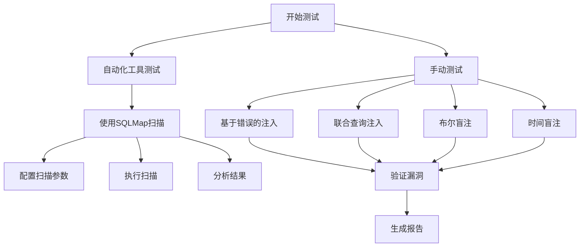
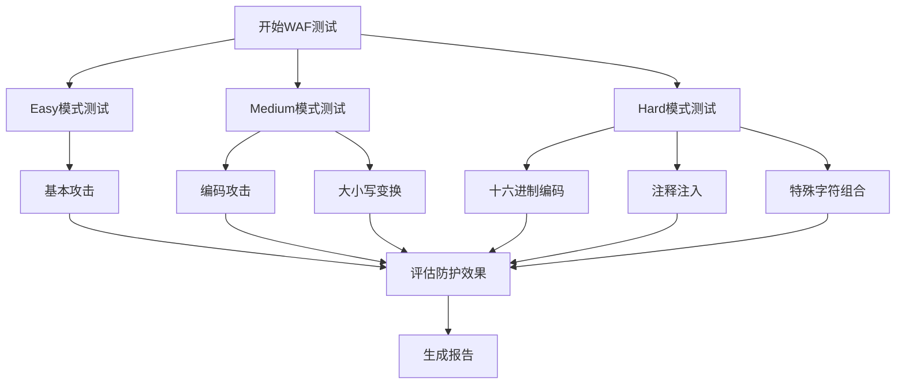
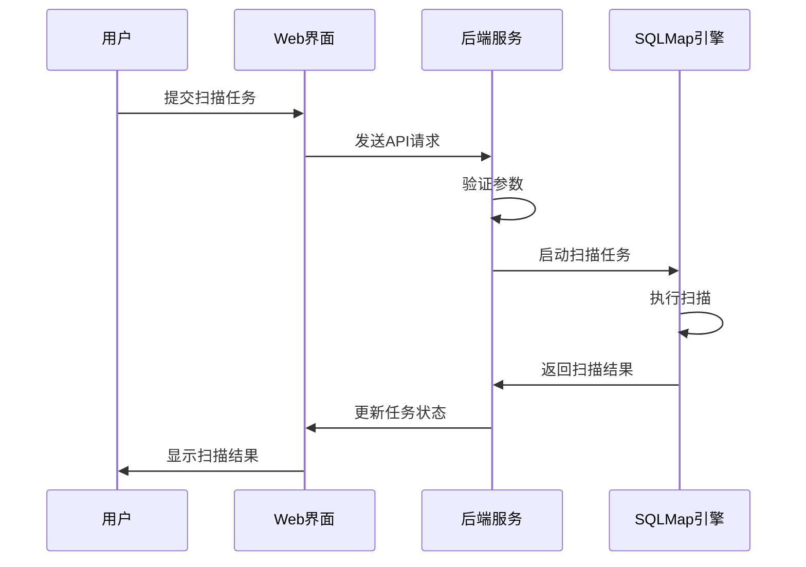
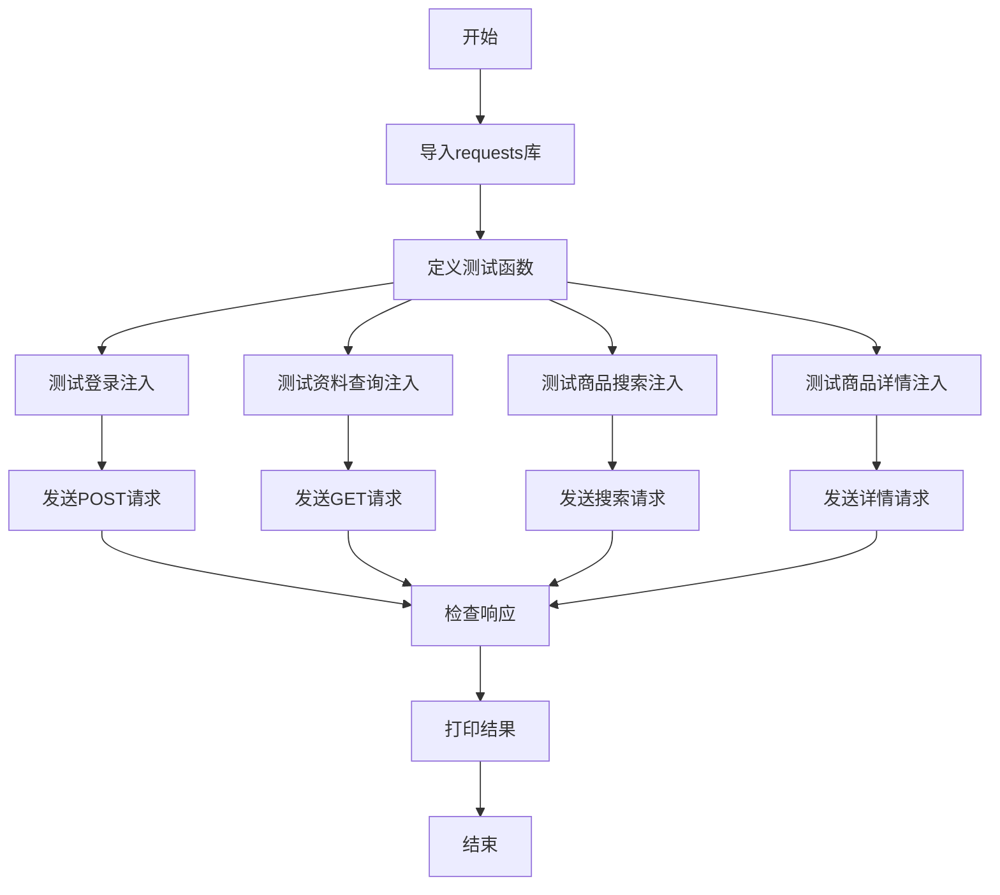

# 测试方法

<cite>
**本文档引用文件**   
- [README.md](file://README.md)
- [test_sqli.py](file://src/vulnTestServer/test_sqli.py)
- [waf.py](file://src/vulnTestServer/waf.py)
- [config.py](file://src/vulnTestServer/config.py)
- [sqlmap.py](file://src/backEnd/third_lib/sqlmap/sqlmap.py)
- [webTaskController.py](file://src/backEnd/api/commonApi/webTaskController.py)
- [taskService.py](file://src/backEnd/service/taskService.py)
- [Task.py](file://src/backEnd/model/Task.py)
- [header_processor.py](file://src/backEnd/utils/header_processor.py)
- [headerRuleService.py](file://src/backEnd/service/headerRuleService.py)
</cite>

## 目录
1. [引言](#引言)
2. [功能测试](#功能测试)
3. [安全测试](#安全测试)
4. [性能测试](#性能测试)
5. [SQL注入漏洞验证方法](#sql注入漏洞验证方法)
6. [WAF防护效果测试策略](#waf防护效果测试策略)
7. [测试用例设计](#测试用例设计)
8. [SQLMap工具使用方法](#sqlmap工具使用方法)
9. [测试结果评估](#测试结果评估)
10. [安全注意事项](#安全注意事项)
11. [测试代码示例](#测试代码示例)

## 引言
VulnShop是一个内置的SQL注入测试靶场，旨在为安全研究人员提供一个现代化的SQL注入测试平台。该靶场包含8种不同类型的SQL注入漏洞，包括基于错误的注入、联合查询注入、布尔盲注、时间盲注、堆叠查询注入和二次注入等。本指南将详细介绍如何对VulnShop靶场进行全面的系统测试，涵盖功能测试、安全测试和性能测试三个方面。

**本文档引用文件**   
- [README.md](file://README.md#L76-L94)

## 功能测试
功能测试主要验证VulnShop靶场的各项功能是否正常工作，包括用户登录、商品搜索、订单查询等核心业务流程。测试应覆盖所有公开的API端点，确保每个接口都能正确处理请求并返回预期的响应。

**本文档引用文件**   
- [README.md](file://README.md#L79-L86)

## 安全测试
安全测试的重点是验证各种SQL注入漏洞的可利用性。测试应包括手动测试和自动化工具测试两种方法。手动测试通过构造特定的SQL注入payload来验证漏洞的存在，而自动化工具测试则使用SQLMap等专业工具进行扫描。

**本文档引用文件**   
- [test_sqli.py](file://src/vulnTestServer/test_sqli.py#L10-L270)
- [waf.py](file://src/vulnTestServer/waf.py#L14-L121)

## 性能测试
性能测试主要评估VulnShop靶场在高并发情况下的响应能力和稳定性。测试应模拟多个用户同时进行SQL注入攻击，观察系统的响应时间、资源占用情况和错误率。性能测试还应包括对WAF防护机制的性能影响评估。

**本文档引用文件**   
- [config.py](file://src/vulnTestServer/config.py#L23-L24)
- [waf.py](file://src/vulnTestServer/waf.py#L14-L121)

## SQL注入漏洞验证方法
SQL注入漏洞的验证方法包括手动测试和自动化工具测试。手动测试通过构造特定的SQL注入payload来验证漏洞的存在，例如在登录表单中输入`admin'--`来绕过身份验证。自动化工具测试则使用SQLMap等专业工具进行扫描，通过配置不同的扫描参数来检测各种类型的SQL注入漏洞。

**本文档引用文件**   
- [test_sqli.py](file://src/vulnTestServer/test_sqli.py#L10-L270)
- [sqlmap.py](file://src/backEnd/third_lib/sqlmap/sqlmap.py#L1-L638)

## WAF防护效果测试策略
WAF防护效果的测试策略包括绕过尝试和防护强度评估。测试应从易到难逐步进行，首先验证WAF是否能有效拦截基本的SQL注入攻击，然后尝试使用编码、大小写变换等技术绕过WAF防护。防护强度评估应包括对不同难度级别（Easy/Medium/Hard）的测试，以全面评估WAF的防护能力。

**本文档引用文件**   
- [waf.py](file://src/vulnTestServer/waf.py#L14-L121)
- [config.py](file://src/vulnTestServer/config.py#L20-L22)

## 测试用例设计
测试用例设计应确保覆盖所有漏洞类型和边界情况。每个SQL注入漏洞类型都应有对应的测试用例，包括正常情况、异常情况和边界情况。测试用例应详细记录测试步骤、预期结果和实际结果，以便于后续的分析和改进。

**本文档引用文件**   
- [test_sqli.py](file://src/vulnTestServer/test_sqli.py#L10-L270)
- [INTEGRATION_TEST_GUIDE.md](file://src/backEnd/tests/INTEGRATION_TEST_GUIDE.md#L76-L306)

## SQLMap工具使用方法
SQLMap工具的使用方法包括配置扫描参数、执行扫描和分析结果。通过VulnShop的Web界面或API接口提交扫描任务，SQLMap将自动检测和利用SQL注入漏洞。用户可以通过实时日志查看扫描进度，并在扫描完成后查看详细的注入点和Payload信息。

**本文档引用文件**   
- [webTaskController.py](file://src/backEnd/api/commonApi/webTaskController.py#L19-L91)
- [taskService.py](file://src/backEnd/service/taskService.py#L58-L535)
- [Task.py](file://src/backEnd/model/Task.py#L49-L333)

## 测试结果评估
测试结果的评估应基于预定义的指标和成功标准。对于功能测试，成功标准是所有API端点都能正确处理请求并返回预期的响应。对于安全测试，成功标准是能够成功利用所有类型的SQL注入漏洞。对于性能测试，成功标准是在高并发情况下系统仍能保持稳定的响应时间和较低的错误率。

**本文档引用文件**   
- [test_sqli.py](file://src/vulnTestServer/test_sqli.py#L210-L266)
- [taskService.py](file://src/backEnd/service/taskService.py#L102-L176)

## 安全注意事项
测试过程中的安全注意事项包括防止对生产环境造成影响。VulnShop靶场仅绑定本地地址，禁止暴露到公网。测试应在隔离的环境中进行，避免对其他系统造成意外影响。测试人员应遵守相关法律法规，仅在获得明确授权的系统上进行测试。

**本文档引用文件**   
- [README.md](file://README.md#L246-L254)
- [config.py](file://src/vulnTestServer/config.py#L12-L13)

## 测试代码示例
以下是一个使用Python编写的测试代码示例，用于验证VulnShop靶场中的SQL注入漏洞。该示例展示了如何使用requests库发送HTTP请求，并通过分析响应来判断SQL注入是否成功。

**本文档引用文件**   
- [test_sqli.py](file://src/vulnTestServer/test_sqli.py#L1-L270)
- [header_processor.py](file://src/backEnd/utils/header_processor.py#L12-L292)