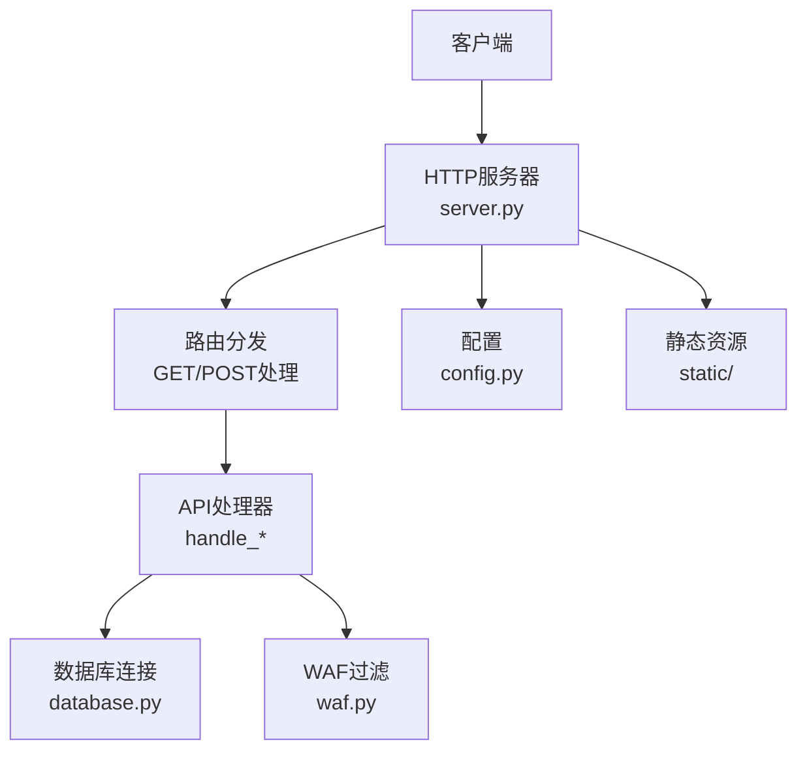
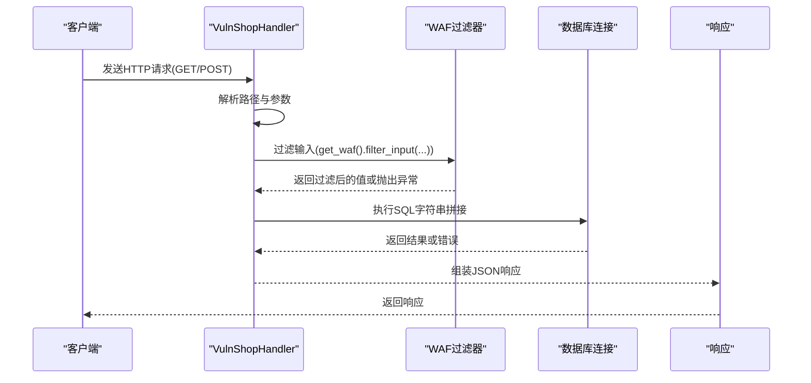
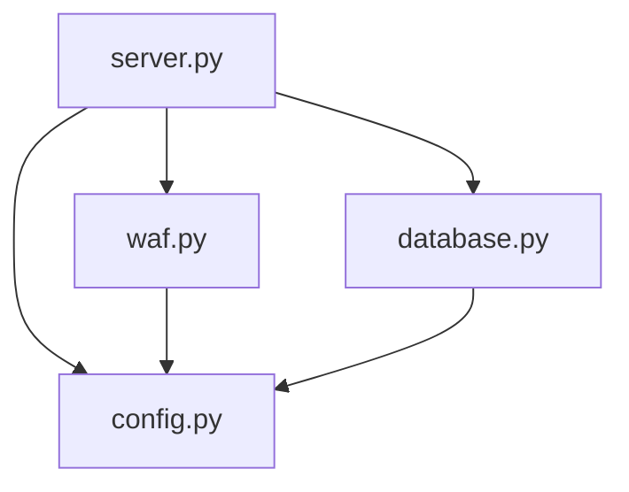

# 字符型注入

<cite>
**本文引用的文件**
- [server.py](file://src/vulnTestServer/server.py)
- [database.py](file://src/vulnTestServer/database.py)
- [waf.py](file://src/vulnTestServer/waf.py)
- [config.py](file://src/vulnTestServer/config.py)
- [test_sqli.py](file://src/vulnTestServer/test_sqli.py)
</cite>

## 目录
1. [简介](#简介)
2. [项目结构](#项目结构)
3. [核心组件](#核心组件)
4. [架构总览](#架构总览)
5. [详细组件分析](#详细组件分析)
6. [依赖关系分析](#依赖关系分析)
7. [性能考量](#性能考量)
8. [故障排查指南](#故障排查指南)
9. [结论](#结论)
10. [附录](#附录)

## 简介
本文件聚焦于VulnShop靶场中“字符型SQL注入”的实现与利用，重点分析server.py中处理字符串参数（如用户名、搜索关键词、订单号等）的接口，展示当用户输入未被正确转义时如何破坏SQL语句结构。文档通过具体代码路径与调用流程，解释单引号闭合、注释符利用等攻击技巧，并给出典型载荷与对应HTTP请求示例。同时对比字符型注入与数字型注入的区别，讨论WAF模块对常见特征的检测规则，最后总结修复建议与修复方案。

## 项目结构
VulnShop靶场位于src/vulnTestServer目录，核心文件包括：
- server.py：HTTP请求处理器与各API端点实现，包含多处字符串拼接导致的注入点
- database.py：数据库初始化、表结构与测试数据，提供基础环境
- waf.py：WAF模拟模块，按难度级别实施过滤与拦截
- config.py：全局配置，含难度、WAF规则、日志等
- test_sqli.py：自动化测试脚本，覆盖多种注入类型与载荷

图表来源
- [server.py](file://src/vulnTestServer/server.py#L151-L218)
- [database.py](file://src/vulnTestServer/database.py#L15-L21)
- [waf.py](file://src/vulnTestServer/waf.py#L14-L121)
- [config.py](file://src/vulnTestServer/config.py#L9-L58)

章节来源
- [server.py](file://src/vulnTestServer/server.py#L151-L218)
- [config.py](file://src/vulnTestServer/config.py#L9-L58)

## 核心组件
- HTTP请求处理器VulnShopHandler：统一处理GET/POST请求，完成路由分发与错误响应
- API处理器：针对不同端点实现业务逻辑，其中多处直接将用户输入拼接到SQL字符串
- 数据库层：提供SQLite连接与初始化，包含users、products、orders、secrets等表
- WAF模块：按难度级别对输入进行关键字检测、URL解码、长度限制等
- 配置模块：控制主机、端口、调试、难度、WAF规则与日志

章节来源
- [server.py](file://src/vulnTestServer/server.py#L37-L120)
- [database.py](file://src/vulnTestServer/database.py#L23-L176)
- [waf.py](file://src/vulnTestServer/waf.py#L14-L121)
- [config.py](file://src/vulnTestServer/config.py#L9-L58)

## 架构总览
下图展示了从客户端到数据库的关键交互路径，突出注入点所在位置与WAF过滤流程。

图表来源
- [server.py](file://src/vulnTestServer/server.py#L240-L328)
- [waf.py](file://src/vulnTestServer/waf.py#L91-L121)
- [database.py](file://src/vulnTestServer/database.py#L15-L21)

## 详细组件分析

### 处理器与路由
- GET/POST入口：do_GET/do_POST根据路径分发到对应handle_*方法
- CORS预检：do_OPTIONS支持跨域
- 错误处理：捕获WAFBlockedException与通用异常，按DEBUG输出SQL错误信息

章节来源
- [server.py](file://src/vulnTestServer/server.py#L151-L218)
- [server.py](file://src/vulnTestServer/server.py#L189-L194)

### 登录接口（基于错误的字符型注入）
- 端点：POST /api/user/login
- 注入点：用户名参数直接拼接到SQL字符串，形成字符型注入
- 利用方式：通过单引号闭合与注释符截断，使WHERE条件恒真或触发错误回显
- 典型载荷示例（路径引用而非代码片段）：
  - 单引号闭合+注释：参考路径[file://src/vulnTestServer/test_sqli.py#L24-L31]
  - 触发错误回显：参考路径[file://src/vulnTestServer/test_sqli.py#L38-L49]
- 对应SQL拼接位置：参考路径[file://src/vulnTestServer/server.py#L255-L263]

章节来源
- [server.py](file://src/vulnTestServer/server.py#L240-L283)
- [test_sqli.py](file://src/vulnTestServer/test_sqli.py#L10-L51)

### 用户资料接口（联合查询的字符型注入）
- 端点：GET /api/user/profile
- 注入点：用户ID参数在WHERE子句中直接拼接，属于字符型注入场景
- 利用方式：UNION注入读取users表字段；也可使用OR条件使查询返回多行
- 典型载荷示例（路径引用而非代码片段）：
  - UNION注入：参考路径[file://src/vulnTestServer/test_sqli.py#L64-L88]
  - OR注入：参考路径[file://src/vulnTestServer/test_sqli.py#L77-L87]
- 对应SQL拼接位置：参考路径[file://src/vulnTestServer/server.py#L297-L305]

章节来源
- [server.py](file://src/vulnTestServer/server.py#L284-L328)
- [test_sqli.py](file://src/vulnTestServer/test_sqli.py#L53-L89)

### 商品搜索接口（布尔盲注的字符型注入）
- 端点：GET /api/products/search
- 注入点：关键词参数拼接在LIKE子句中，且存在闭合逻辑
- 利用方式：通过布尔条件真假改变查询结果数量，实现信息外泄
- 典型载荷示例（路径引用而非代码片段）：
  - 闭合法AND 1=1：参考路径[file://src/vulnTestServer/test_sqli.py#L104-L119]
- 对应SQL拼接位置：参考路径[file://src/vulnTestServer/server.py#L343-L348]

章节来源
- [server.py](file://src/vulnTestServer/server.py#L329-L388)
- [test_sqli.py](file://src/vulnTestServer/test_sqli.py#L91-L123)

### 商品详情接口（时间盲注的字符型注入）
- 端点：GET /api/products/detail
- 注入点：商品ID参数直接拼接
- 利用方式：通过CASE WHEN构造延迟，结合响应时间判断注入成功
- 典型载荷示例（路径引用而非代码片段）：
  - CASE WHEN延迟：参考路径[file://src/vulnTestServer/test_sqli.py#L138-L156]
- 对应SQL拼接位置：参考路径[file://src/vulnTestServer/server.py#L403-L413]

章节来源
- [server.py](file://src/vulnTestServer/server.py#L389-L444)
- [test_sqli.py](file://src/vulnTestServer/test_sqli.py#L125-L158)

### 订单查询接口（堆叠查询的字符型注入）
- 端点：GET /api/orders/query
- 注入点：订单号参数在字符串拼接中，若包含分号则触发executescript执行多条SQL
- 利用方式：通过分号分隔插入、更新等语句，实现堆叠查询
- 典型载荷示例（路径引用而非代码片段）：
  - 堆叠查询：参考路径[file://src/vulnTestServer/test_sqli.py#L171-L179]
- 对应SQL拼接位置：参考路径[file://src/vulnTestServer/server.py#L459-L475]

章节来源
- [server.py](file://src/vulnTestServer/server.py#L445-L505)
- [test_sqli.py](file://src/vulnTestServer/test_sqli.py#L160-L182)

### 注册接口（二次注入的字符型注入）
- 端点：POST /api/user/register
- 注入点：用户名入库后在后续查询中再次被直接拼接，形成二次注入
- 利用方式：注册时提交恶意用户名，待后续查询触发
- 典型载荷示例（路径引用而非代码片段）：
  - 二次注入：参考路径[file://src/vulnTestServer/test_sqli.py#L190-L208]
- 对应SQL拼接位置：参考路径[file://src/vulnTestServer/server.py#L536-L550]

章节来源
- [server.py](file://src/vulnTestServer/server.py#L506-L561)
- [test_sqli.py](file://src/vulnTestServer/test_sqli.py#L184-L208)

### WAF模块与检测规则
- 过滤器类WAFFilter：按难度级别检查输入
- easy模式：无防护
- medium模式：关键字过滤（如UNION、SELECT等），允许大小写与编码绕过
- hard模式：严格过滤，包含注释符、十六进制编码、OR模式、长度限制等
- 关键检测点：
  - URL解码（最多3次）防止双重编码绕过
  - 注释符检测（如/* ... */）
  - OR模式检测（如' OR '1'='1）
  - 十六进制编码检测（0x...）
  - 最大长度限制

章节来源
- [waf.py](file://src/vulnTestServer/waf.py#L14-L121)
- [config.py](file://src/vulnTestServer/config.py#L36-L50)

### 字符型注入与数字型注入的区别
- 字符型注入
  - 输入为字符串，需用单引号闭合
  - 常见利用：单引号闭合、注释符截断、UNION注入、布尔/时间盲注
  - 代表端点：/api/user/login、/api/user/profile、/api/products/search、/api/products/detail、/api/orders/query、/api/user/register
- 数字型注入
  - 输入为数值，通常不需要引号闭合
  - 利用方式：算术运算、CASE WHEN、位运算等
  - 在本项目中，用户资料接口的ID参数虽为数字，但服务端仍将其作为字符串拼接，因此同样表现为字符型注入

章节来源
- [server.py](file://src/vulnTestServer/server.py#L284-L328)
- [server.py](file://src/vulnTestServer/server.py#L389-L444)

### 攻击技巧与载荷示例（路径引用）
- 单引号闭合+注释符
  - 登录接口：参考路径[file://src/vulnTestServer/test_sqli.py#L24-L31]
  - 用户资料：参考路径[file://src/vulnTestServer/test_sqli.py#L77-L87]
- UNION注入
  - 用户资料：参考路径[file://src/vulnTestServer/test_sqli.py#L64-L88]
- 布尔盲注
  - 商品搜索：参考路径[file://src/vulnTestServer/test_sqli.py#L104-L119]
- 时间盲注
  - 商品详情：参考路径[file://src/vulnTestServer/test_sqli.py#L138-L156]
- 堆叠查询
  - 订单查询：参考路径[file://src/vulnTestServer/test_sqli.py#L171-L179]
- 二次注入
  - 注册后触发：参考路径[file://src/vulnTestServer/test_sqli.py#L190-L208]

章节来源
- [test_sqli.py](file://src/vulnTestServer/test_sqli.py#L10-L208)

### HTTP请求示例（路径引用）
- 登录接口（POST /api/user/login）
  - 请求体：包含username与password字段
  - 示例：参考路径[file://src/vulnTestServer/test_sqli.py#L16-L31]
- 用户资料（GET /api/user/profile）
  - 查询参数：id
  - 示例：参考路径[file://src/vulnTestServer/test_sqli.py#L60-L88]
- 商品搜索（GET /api/products/search）
  - 查询参数：keyword、category
  - 示例：参考路径[file://src/vulnTestServer/test_sqli.py#L97-L119]
- 商品详情（GET /api/products/detail）
  - 查询参数：id
  - 示例：参考路径[file://src/vulnTestServer/test_sqli.py#L131-L156]
- 订单查询（GET /api/orders/query）
  - 查询参数：order_no或user_id
  - 示例：参考路径[file://src/vulnTestServer/test_sqli.py#L166-L179]
- 注册接口（POST /api/user/register）
  - 请求体：username、password、email
  - 示例：参考路径[file://src/vulnTestServer/test_sqli.py#L190-L208]

章节来源
- [test_sqli.py](file://src/vulnTestServer/test_sqli.py#L10-L208)

## 依赖关系分析
- server.py依赖：
  - config.py：主机、端口、难度、版本、日志等
  - database.py：数据库连接与初始化
  - waf.py：WAF过滤器与异常
- waf.py依赖：
  - config.py：难度与规则
  - urllib.parse：URL解码
  - re：正则匹配
- database.py依赖：
  - config.py：DB_PATH
  - hashlib：MD5哈希（演示用途）

图表来源
- [server.py](file://src/vulnTestServer/server.py#L32-L35)
- [waf.py](file://src/vulnTestServer/waf.py#L9-L12)
- [database.py](file://src/vulnTestServer/database.py#L9-L13)
- [config.py](file://src/vulnTestServer/config.py#L9-L18)

章节来源
- [server.py](file://src/vulnTestServer/server.py#L32-L35)
- [waf.py](file://src/vulnTestServer/waf.py#L9-L12)
- [database.py](file://src/vulnTestServer/database.py#L9-L13)
- [config.py](file://src/vulnTestServer/config.py#L9-L18)

## 性能考量
- 字符型注入本身不直接影响性能，但以下因素会影响系统表现：
  - 时间盲注：通过CASE WHEN构造延迟，增加响应时间
  - 布尔盲注：通过条件分支影响查询计划
  - 堆叠查询：一次请求执行多条SQL，可能阻塞数据库
- 建议：
  - 在生产环境禁用DEBUG模式，避免SQL错误回显
  - 对高并发接口启用连接池与超时控制
  - 使用参数化查询替代字符串拼接

[本节为通用指导，不涉及具体文件分析]

## 故障排查指南
- WAF拦截
  - 现象：返回403并提示WAF拦截原因
  - 排查：检查WAF规则与难度设置，确认是否命中关键字、注释符或长度限制
  - 参考：路径[file://src/vulnTestServer/waf.py#L91-L121]
- SQL错误回显
  - 现象：基于错误的注入会返回详细SQL错误信息
  - 排查：关闭DEBUG或修复注入点，避免错误信息泄露
  - 参考：路径[file://src/vulnTestServer/server.py#L278-L282]
- 注入点定位
  - 使用自动化测试脚本验证各端点
  - 参考：路径[file://src/vulnTestServer/test_sqli.py#L10-L208]
- 数据库问题
  - 确认数据库初始化与表结构
  - 参考：路径[file://src/vulnTestServer/database.py#L23-L176]

章节来源
- [waf.py](file://src/vulnTestServer/waf.py#L91-L121)
- [server.py](file://src/vulnTestServer/server.py#L278-L282)
- [test_sqli.py](file://src/vulnTestServer/test_sqli.py#L10-L208)
- [database.py](file://src/vulnTestServer/database.py#L23-L176)

## 结论
VulnShop靶场通过server.py中的多处字符串拼接实现了多种类型的SQL注入场景，字符型注入尤为典型：用户名、搜索关键词、订单号等参数均可被注入。WAF模块提供了不同难度级别的检测规则，但在easy模式下几乎无效。修复建议集中在参数化查询与严格的输入校验，彻底消除注入风险。

[本节为总结性内容，不涉及具体文件分析]

## 附录

### 修复方案（预编译语句与输入校验）
- 预编译语句（推荐）
  - 使用占位符绑定参数，避免字符串拼接
  - 参考路径[file://src/vulnTestServer/database.py#L109-L113]（注册时的安全写法）
- 输入校验与清洗
  - 限制参数长度与字符集
  - 对特殊字符进行白名单过滤
- WAF与日志
  - 在生产环境启用hard模式规则
  - 完善日志记录与告警机制

章节来源
- [database.py](file://src/vulnTestServer/database.py#L109-L113)
- [waf.py](file://src/vulnTestServer/waf.py#L14-L121)
- [config.py](file://src/vulnTestServer/config.py#L36-L50)