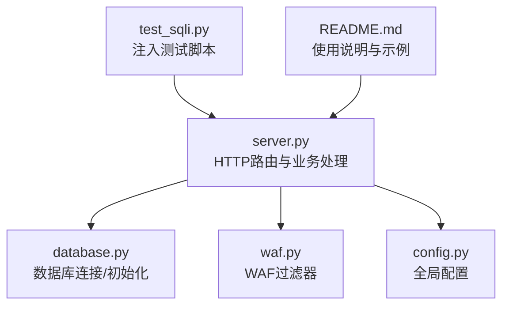
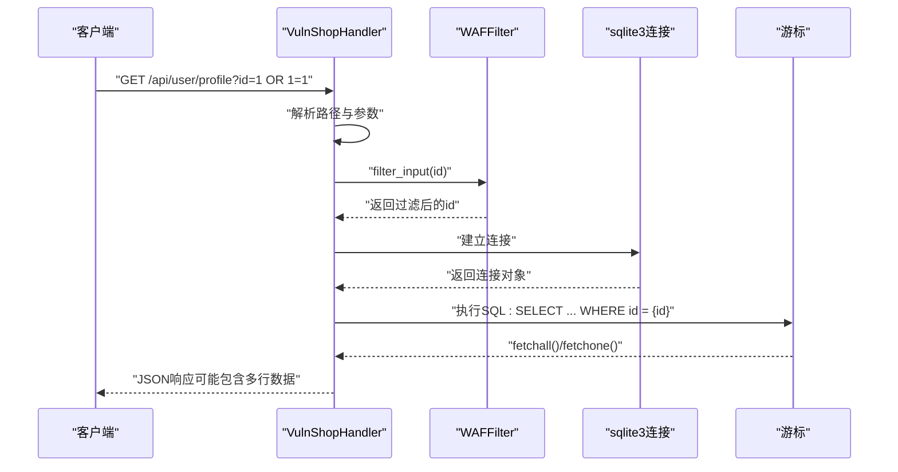
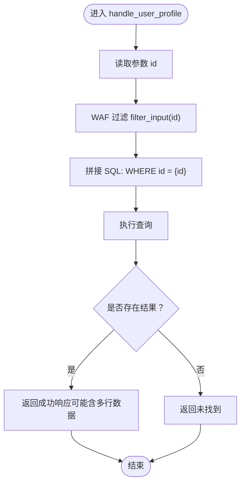
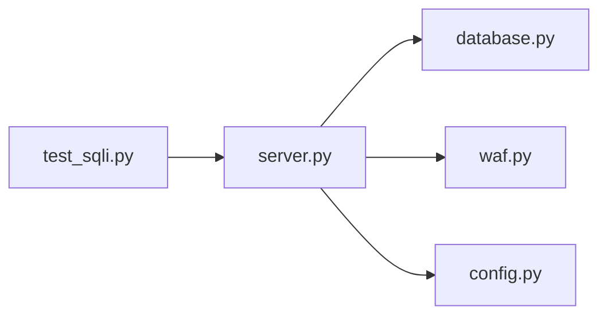

# 数字型注入

<cite>
**本文引用的文件**
- [server.py](file://src/vulnTestServer/server.py)
- [test_sqli.py](file://src/vulnTestServer/test_sqli.py)
- [database.py](file://src/vulnTestServer/database.py)
- [config.py](file://src/vulnTestServer/config.py)
- [waf.py](file://src/vulnTestServer/waf.py)
- [README.md](file://src/vulnTestServer/README.md)
</cite>

## 目录
1. [引言](#引言)
2. [项目结构](#项目结构)
3. [核心组件](#核心组件)
4. [架构总览](#架构总览)
5. [详细组件分析](#详细组件分析)
6. [依赖关系分析](#依赖关系分析)
7. [性能考量](#性能考量)
8. [故障排查指南](#故障排查指南)
9. [结论](#结论)
10. [附录](#附录)

## 引言
本文件聚焦于 VulnShop 靶场中的“数字型 SQL 注入”漏洞，结合 server.py 的路由处理函数与 test_sqli.py 的测试用例，系统解析当用户输入直接拼接到 SQL 查询中的整数参数时产生的安全风险。我们将：
- 展示漏洞代码片段所在位置与调用链
- 解释如何通过在 ID 参数中注入 SQL 语句（如 OR 1=1）操纵查询逻辑
- 提供利用该漏洞的 HTTP 请求示例及预期响应特征
- 归纳漏洞检测特征与自动化扫描器的识别模式
- 对比防御手段（参数化查询）与其他注入类型的利用难度，并强调其作为入门级漏洞的教学价值

## 项目结构
VulnShop 靶场采用最小化后端实现，核心由以下模块构成：
- server.py：HTTP 服务器与路由处理，包含多处存在 SQL 注入的处理函数
- database.py：数据库初始化、连接与测试数据填充
- waf.py：难度可控的 WAF 模拟，影响输入过滤强度
- config.py：全局配置（主机、端口、调试、难度、日志等）
- test_sqli.py：针对各注入类型的自动化测试脚本
- README.md：功能特性、接口说明与示例

图表来源
- [server.py](file://src/vulnTestServer/server.py#L151-L218)
- [database.py](file://src/vulnTestServer/database.py#L15-L21)
- [waf.py](file://src/vulnTestServer/waf.py#L14-L121)
- [config.py](file://src/vulnTestServer/config.py#L9-L58)
- [test_sqli.py](file://src/vulnTestServer/test_sqli.py#L1-L270)
- [README.md](file://src/vulnTestServer/README.md#L1-L254)

章节来源
- [server.py](file://src/vulnTestServer/server.py#L151-L218)
- [test_sqli.py](file://src/vulnTestServer/test_sqli.py#L53-L89)
- [README.md](file://src/vulnTestServer/README.md#L31-L41)

## 核心组件
- 路由与处理函数：server.py 中的 do_GET/do_POST 以及各 API 处理函数负责接收参数、构造 SQL 并执行
- 数据库层：database.py 提供连接与初始化，包含 users、products、orders、secrets 等表
- WAF 过滤：waf.py 根据难度对输入进行关键字检查与拦截
- 配置中心：config.py 控制主机、端口、调试、日志与难度等级
- 自动化测试：test_sqli.py 针对各注入点编写 HTTP 请求与断言

章节来源
- [server.py](file://src/vulnTestServer/server.py#L151-L218)
- [database.py](file://src/vulnTestServer/database.py#L23-L176)
- [waf.py](file://src/vulnTestServer/waf.py#L14-L121)
- [config.py](file://src/vulnTestServer/config.py#L9-L58)
- [test_sqli.py](file://src/vulnTestServer/test_sqli.py#L53-L89)

## 架构总览
下图展示了数字型注入在 GET /api/user/profile 接口中的调用流程与关键节点。

图表来源
- [server.py](file://src/vulnTestServer/server.py#L151-L218)
- [server.py](file://src/vulnTestServer/server.py#L284-L328)
- [waf.py](file://src/vulnTestServer/waf.py#L91-L121)
- [database.py](file://src/vulnTestServer/database.py#L15-L21)

## 详细组件分析

### 数字型注入：GET /api/user/profile
- 漏洞位置与触发条件
  - 参数 id 来源于请求查询参数，经 WAF 过滤后直接拼接到 SQL 字句中
  - 当 id 为整数且未做类型校验或参数化时，注入成立
- 关键代码片段路径
  - 参数解析与路由分发：[server.py](file://src/vulnTestServer/server.py#L151-L188)
  - 用户资料查询处理函数：[server.py](file://src/vulnTestServer/server.py#L284-L328)
  - WAF 输入过滤：[waf.py](file://src/vulnTestServer/waf.py#L91-L121)
  - 数据库连接与初始化：[database.py](file://src/vulnTestServer/database.py#L15-L21)
- 利用方式与示例
  - 在 id 参数中注入布尔表达式（如 OR 1=1），使 WHERE 条件恒真，从而返回多条记录
  - 测试脚本中包含类似 payload 的 GET 请求示例：[test_sqli.py](file://src/vulnTestServer/test_sqli.py#L76-L88)
- 预期响应特征
  - 返回 JSON 包含 data 字段为数组且长度大于 1，表示注入成功
  - 若 DEBUG 开启，服务器可能在错误响应中携带 SQL 错误信息（用于教学）

图表来源
- [server.py](file://src/vulnTestServer/server.py#L284-L328)
- [waf.py](file://src/vulnTestServer/waf.py#L91-L121)

章节来源
- [server.py](file://src/vulnTestServer/server.py#L284-L328)
- [test_sqli.py](file://src/vulnTestServer/test_sqli.py#L76-L88)

### 与其它注入类型的对比与教学价值
- 与错误注入（POST /api/user/login）相比
  - 数字型注入无需复杂报错提取，直接通过布尔条件改变查询结果集合数量即可判定
  - 错误注入需借助数据库错误回显或错误转换技巧，对初学者门槛更高
- 与联合查询注入（GET /api/user/profile）相比
  - 数字型注入无需构造列数匹配与目标列选择，只需让 WHERE 条件恒真即可返回多行
  - 联合注入需要精确构造 SELECT 子句，对列数与数据类型有严格要求
- 与布尔/时间盲注相比
  - 数字型注入属于“明文注入”，响应差异明显，最易验证
  - 盲注依赖响应差异或时间延迟，需要更多推理与等待

章节来源
- [server.py](file://src/vulnTestServer/server.py#L221-L239)
- [test_sqli.py](file://src/vulnTestServer/test_sqli.py#L91-L158)
- [README.md](file://src/vulnTestServer/README.md#L31-L41)

## 依赖关系分析
- server.py 依赖
  - database.py：获取连接、初始化表结构与测试数据
  - waf.py：对输入进行过滤，可能抛出拦截异常
  - config.py：读取主机、端口、调试、日志与难度配置
- test_sqli.py 依赖
  - requests：发起 HTTP 请求
  - BASE_URL：默认指向 127.0.0.1:9527

图表来源
- [server.py](file://src/vulnTestServer/server.py#L32-L35)
- [database.py](file://src/vulnTestServer/database.py#L15-L21)
- [waf.py](file://src/vulnTestServer/waf.py#L108-L121)
- [config.py](file://src/vulnTestServer/config.py#L9-L58)
- [test_sqli.py](file://src/vulnTestServer/test_sqli.py#L1-L10)

章节来源
- [server.py](file://src/vulnTestServer/server.py#L32-L35)
- [test_sqli.py](file://src/vulnTestServer/test_sqli.py#L1-L10)

## 性能考量
- 数字型注入本身不引入额外计算开销；但若配合 UNION 或盲注，可能增加数据库负载
- 在高并发场景下，注入测试应避免长时间阻塞或大量无效请求
- 建议在测试环境中合理设置超时与频率限制，避免对真实业务造成影响

## 故障排查指南
- 常见问题与定位
  - 404/403：路径或权限错误，确认请求路径与难度设置
  - 500：SQL 执行异常，检查参数拼接与 SQL 结构
  - 无响应或慢响应：可能触发时间盲注或堆叠查询，需检查 payload
- 调试与日志
  - DEBUG 开启时，服务器会在错误响应中附加 SQL 错误信息，便于定位
  - LOG_REQUESTS 开启时，访问日志会记录请求详情
- 难度与绕过
  - easy：无防护，直接注入
  - medium：关键字过滤，可尝试大小写、编码等绕过
  - hard：严格过滤，需更高级的绕过技术

章节来源
- [server.py](file://src/vulnTestServer/server.py#L54-L66)
- [server.py](file://src/vulnTestServer/server.py#L78-L91)
- [waf.py](file://src/vulnTestServer/waf.py#L14-L121)
- [config.py](file://src/vulnTestServer/config.py#L12-L24)

## 结论
数字型 SQL 注入在 VulnShop 中通过 GET /api/user/profile 接口得以直观演示：当整数参数未经过类型校验或参数化处理时，攻击者可通过布尔表达式（如 OR 1=1）操控 WHERE 条件，导致查询返回多行数据，从而验证注入成功。该漏洞作为入门级教学案例，具备以下优势：
- 易理解：无需复杂报错提取或列数匹配
- 易验证：响应差异明显，自动化脚本可快速判定
- 易防御：参数化查询即可彻底消除风险

防御建议
- 对所有用户输入进行参数化查询，避免字符串拼接
- 对整数参数进行显式类型转换与范围校验
- 在生产环境启用严格的 WAF 与输入过滤策略，并定期评估有效性

## 附录

### HTTP 请求示例与预期响应
- 示例一：GET /api/user/profile?id=1 OR 1=1
  - 说明：使 WHERE 条件恒真，返回多行用户数据
  - 预期：响应中 data 为数组且长度大于 1
  - 参考测试脚本：[test_sqli.py](file://src/vulnTestServer/test_sqli.py#L76-L88)
- 示例二：GET /api/user/profile?id=1
  - 说明：正常查询单个用户
  - 预期：响应中 data 为单个用户对象
  - 参考测试脚本：[test_sqli.py](file://src/vulnTestServer/test_sqli.py#L60-L69)

章节来源
- [test_sqli.py](file://src/vulnTestServer/test_sqli.py#L60-L88)

### 漏洞检测特征与自动化扫描器识别模式
- 检测特征
  - 响应差异：注入导致返回数据量变化（如从 1 行变为多行）
  - 布尔闭合：常见 payload 如 OR 1=1、AND 1=1 等
  - 盲注变体：布尔盲注通过响应状态或时间差异判断
- 自动化扫描器常用模式
  - 对整数参数构造布尔 payload（如 OR 1=1、AND 1=2）
  - 比较注入前后响应差异（数量、字段、时间）
  - 结合 WAF 绕过策略（编码、大小写、注释等）

章节来源
- [test_sqli.py](file://src/vulnTestServer/test_sqli.py#L76-L158)
- [waf.py](file://src/vulnTestServer/waf.py#L14-L121)

### 防御措施：参数化查询实现要点
- 对整数参数进行显式转换与校验
- 使用占位符与参数绑定的方式执行 SQL
- 在数据库层启用严格的输入过滤与长度限制
- 在生产环境启用 WAF 并定期更新规则

章节来源
- [server.py](file://src/vulnTestServer/server.py#L284-L328)
- [waf.py](file://src/vulnTestServer/waf.py#L14-L121)
- [config.py](file://src/vulnTestServer/config.py#L20-L58)