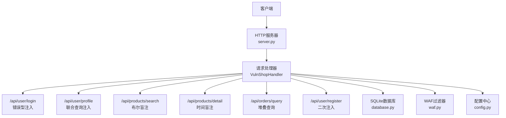
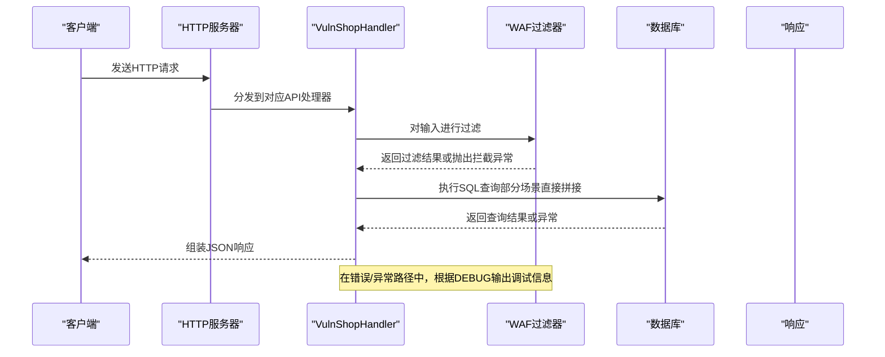
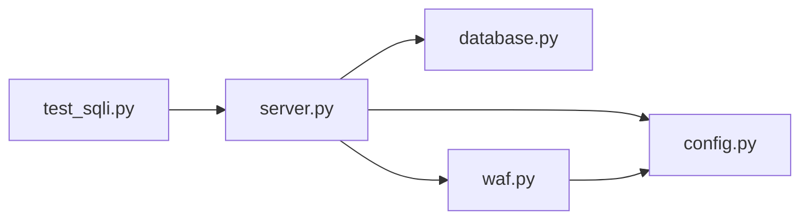

# 漏洞类型

<cite>
**本文引用的文件**
- [server.py](file://src/vulnTestServer/server.py)
- [database.py](file://src/vulnTestServer/database.py)
- [waf.py](file://src/vulnTestServer/waf.py)
- [config.py](file://src/vulnTestServer/config.py)
- [test_sqli.py](file://src/vulnTestServer/test_sqli.py)
</cite>

## 目录
1. [引言](#引言)
2. [项目结构](#项目结构)
3. [核心组件](#核心组件)
4. [架构总览](#架构总览)
5. [详细组件分析](#详细组件分析)
6. [依赖关系分析](#依赖关系分析)
7. [性能考量](#性能考量)
8. [故障排查指南](#故障排查指南)
9. [结论](#结论)
10. [附录](#附录)

## 引言
本文件系统性分析 VulnShop 靶场中实现的多种 SQL 注入漏洞类型，覆盖数字型注入、字符型注入、布尔盲注、时间盲注、堆叠查询以及二次注入。通过对各接口的代码实现进行逐项剖析，解释不安全的查询构造方式与输入验证缺失，总结每种漏洞的检测特征与利用方式，并对比其危害程度与利用难度。同时说明 WAF 模块如何针对不同类型的注入进行检测与拦截，给出典型 HTTP 请求示例与预期响应，最后讨论该教学环境的设计目标与实际安全意义。

## 项目结构
VulnShop 靶场采用 Python 内置 HTTP 服务器作为入口，路由到多个 API 处理器，每个处理器对应一种注入场景；数据库初始化与测试数据插入在独立模块中；WAF 模块提供按难度分级的输入过滤；测试脚本提供自动化验证流程。

图表来源
- [server.py](file://src/vulnTestServer/server.py#L151-L218)
- [database.py](file://src/vulnTestServer/database.py#L15-L21)
- [waf.py](file://src/vulnTestServer/waf.py#L14-L121)
- [config.py](file://src/vulnTestServer/config.py#L9-L58)

章节来源
- [server.py](file://src/vulnTestServer/server.py#L151-L218)
- [config.py](file://src/vulnTestServer/config.py#L9-L58)

## 核心组件
- HTTP 服务器与路由分发：统一处理 GET/POST 请求，按路径分派至对应处理器，内置 CORS 支持与静态资源服务。
- API 处理器：分别实现错误型、联合查询、布尔盲注、时间盲注、堆叠查询、二次注入等场景。
- 数据库模块：负责数据库连接、初始化、测试数据填充与重置。
- WAF 模块：按难度级别对输入进行关键字匹配、URL 解码、长度限制等检查，必要时抛出拦截异常。
- 配置模块：定义主机端口、调试开关、数据库路径、难度等级、WAF 规则与日志路径等。
- 自动化测试脚本：提供各注入点的验证流程与断言逻辑。

章节来源
- [server.py](file://src/vulnTestServer/server.py#L151-L218)
- [database.py](file://src/vulnTestServer/database.py#L15-L21)
- [waf.py](file://src/vulnTestServer/waf.py#L14-L121)
- [config.py](file://src/vulnTestServer/config.py#L9-L58)
- [test_sqli.py](file://src/vulnTestServer/test_sqli.py#L1-L270)

## 架构总览
下图展示了请求从客户端到各 API 的调用链路，以及关键的安全控制点（WAF 过滤与异常处理）。

图表来源
- [server.py](file://src/vulnTestServer/server.py#L188-L218)
- [waf.py](file://src/vulnTestServer/waf.py#L91-L121)

章节来源
- [server.py](file://src/vulnTestServer/server.py#L188-L218)
- [waf.py](file://src/vulnTestServer/waf.py#L91-L121)

## 详细组件分析

### 错误型注入（基于错误的SQL注入）- /api/user/login
- 漏洞位置与实现要点
  - 输入来源：POST /api/user/login 的 username 字段。
  - 不安全构造：将用户输入直接拼接到 SQL 字符串中，未使用参数化查询。
  - 错误回显：数据库层抛出异常时，服务端在调试模式下会将 SQL 错误信息返回给客户端，便于演示错误注入。
- 利用方式与检测特征
  - 利用方式：通过闭合引号与注释符，使 SQL 逻辑改变，触发数据库错误或返回额外信息。
  - 检测特征：响应体中出现数据库错误文本或调试字段（当 DEBUG 开启时）。
- 危害与难度
  - 危害：可直接获取错误信息，辅助进一步注入；若错误信息中包含敏感数据，风险更高。
  - 利用难度：低，适合初学者理解注入原理。
- HTTP 请求示例
  - POST /api/user/login
  - Body: {"username":"admin'--","password":"任意"}
  - 预期响应：当成功闭合条件时，返回登录成功；否则返回错误或数据库错误信息（DEBUG 下）。
- WAF 防护
  - easy：无防护。
  - medium：可尝试绕过（大小写、编码等），但关键字过滤仍有效。
  - hard：严格匹配注释、关键字与编码，拦截概率高。

章节来源
- [server.py](file://src/vulnTestServer/server.py#L240-L283)
- [test_sqli.py](file://src/vulnTestServer/test_sqli.py#L10-L51)
- [waf.py](file://src/vulnTestServer/waf.py#L21-L90)
- [config.py](file://src/vulnTestServer/config.py#L26-L34)

### 联合查询注入（Union-based SQLi）- /api/user/profile
- 漏洞位置与实现要点
  - 输入来源：GET /api/user/profile 的 id 参数。
  - 不安全构造：将用户输入直接拼接到 SQL 查询中，形成可注入的整数型参数。
  - 联合查询：通过 UNION 关键字拼接额外列，读取 users 表数据。
- 利用方式与检测特征
  - 利用方式：构造 id 的 UNION 查询，使查询结果包含敏感列。
  - 检测特征：响应中返回多条用户记录或额外列数据。
- 危害与难度
  - 危害：可批量读取用户数据，权限提升或信息泄露。
  - 利用难度：中等，需正确闭合与列数匹配。
- HTTP 请求示例
  - GET /api/user/profile?id=1 UNION SELECT 1,2,3,4,5,6 FROM users--
  - 预期响应：返回多条用户记录或包含敏感字段的数据。
- WAF 防护
  - easy：无防护。
  - medium：关键字过滤较弱，可尝试绕过。
  - hard：严格过滤 UNION、SELECT 等关键字及编码形式，拦截概率高。

章节来源
- [server.py](file://src/vulnTestServer/server.py#L284-L328)
- [test_sqli.py](file://src/vulnTestServer/test_sqli.py#L53-L89)
- [waf.py](file://src/vulnTestServer/waf.py#L21-L90)
- [config.py](file://src/vulnTestServer/config.py#L26-L34)

### 布尔盲注（Boolean-based Blind SQLi）- /api/products/search
- 漏洞位置与实现要点
  - 输入来源：GET /api/products/search 的 keyword 与 category 参数。
  - 不安全构造：将 keyword 拼接到 LIKE 条件中；category 可选拼接。
  - 盲注特征：服务端仅返回“找到/未找到”的数量，不直接回显数据。
- 利用方式与检测特征
  - 利用方式：通过构造布尔表达式（如 AND 1=1/1=2），观察 count 是否变化，逐位爆破。
  - 检测特征：相同关键词在不同布尔条件下返回不同的 count。
- 危害与难度
  - 危害：可逐步推断数据库内容，但速度较慢。
  - 利用难度：中等偏上，需要自动化工具与耐心。
- HTTP 请求示例
  - GET /api/products/search?keyword=iPhone%' AND 1=1 AND '%'='
  - GET /api/products/search?keyword=iPhone%' AND 1=2 AND '%'='
  - 预期响应：count 在真/假条件下不同。
- WAF 防护
  - easy：无防护。
  - medium：可尝试大小写/编码绕过。
  - hard：严格关键字与注释检测，拦截概率高。

章节来源
- [server.py](file://src/vulnTestServer/server.py#L329-L388)
- [test_sqli.py](file://src/vulnTestServer/test_sqli.py#L91-L123)
- [waf.py](file://src/vulnTestServer/waf.py#L21-L90)
- [config.py](file://src/vulnTestServer/config.py#L26-L34)

### 时间盲注（Time-based Blind SQLi）- /api/products/detail
- 漏洞位置与实现要点
  - 输入来源：GET /api/products/detail 的 id 参数。
  - 不安全构造：将 id 直接拼接到 WHERE 条件中。
  - 时间延迟：通过 CASE WHEN 或随机大对象触发延迟，结合响应时间判断注入成功与否。
- 利用方式与检测特征
  - 利用方式：构造 CASE WHEN 使数据库执行耗时操作，比较正常与注入时的响应时间差异。
  - 检测特征：注入时响应时间明显增加。
- 危害与难度
  - 危害：可稳定探测数据库状态，但效率较低。
  - 利用难度：中等，需要统计与自动化。
- HTTP 请求示例
  - GET /api/products/detail?id=1 AND 1=(SELECT CASE WHEN (1=1) THEN 1 ELSE 1 END)
  - 预期响应：响应时间显著增加（或返回正常响应，视实现而定）。
- WAF 防护
  - easy：无防护。
  - medium：可尝试编码与注释绕过。
  - hard：严格关键字与注释检测，拦截概率高。

章节来源
- [server.py](file://src/vulnTestServer/server.py#L389-L444)
- [test_sqli.py](file://src/vulnTestServer/test_sqli.py#L125-L158)
- [waf.py](file://src/vulnTestServer/waf.py#L21-L90)
- [config.py](file://src/vulnTestServer/config.py#L26-L34)

### 堆叠查询注入（Stacked Queries SQLi）- /api/orders/query
- 漏洞位置与实现要点
  - 输入来源：GET /api/orders/query 的 order_no 或 user_id 参数。
  - 不安全构造：当参数中包含分号时，使用 executescript 支持多条 SQL 语句执行。
  - 危害：可执行任意 SQL（如插入、更新、删除），影响业务数据与完整性。
- 利用方式与检测特征
  - 利用方式：在 order_no 中注入分号与附加 SQL，触发多语句执行。
  - 检测特征：响应显示“Query executed”，且数据库中产生副作用。
- 危害与难度
  - 危害：最高，可直接篡改/删除数据。
  - 利用难度：中等，需构造合法的附加语句。
- HTTP 请求示例
  - GET /api/orders/query?order_no=ORD20231201001'; SELECT * FROM users;--
  - 预期响应：success=true，data=[]，但数据库中可能已执行附加语句。
- WAF 防护
  - easy：无防护。
  - medium：可尝试编码绕过。
  - hard：严格关键字与注释检测，拦截概率高。

章节来源
- [server.py](file://src/vulnTestServer/server.py#L445-L505)
- [test_sqli.py](file://src/vulnTestServer/test_sqli.py#L160-L181)
- [waf.py](file://src/vulnTestServer/waf.py#L21-L90)
- [config.py](file://src/vulnTestServer/config.py#L26-L34)

### 二次注入（Second-order SQLi）- /api/user/register
- 漏洞位置与实现要点
  - 注册阶段：将用户名安全地存储到 pending_users 表（使用参数化）。
  - 审核阶段：从 pending_users 读取用户名后，再次直接拼接到 SQL 中执行，形成二次注入。
- 利用方式与检测特征
  - 利用方式：注册时提交包含注入的用户名，待审核通过后在后续查询中触发。
  - 检测特征：注册成功后，后续查询中出现异常或数据泄露。
- 危害与难度
  - 危害：隐蔽性强，难以第一时间发现；可导致长期数据污染。
  - 利用难度：较高，需等待审核流程。
- HTTP 请求示例
  - POST /api/user/register
  - Body: {"username":"test' OR '1'='1","password":"test123","email":"test@test.com"}
  - 预期响应：注册成功，但后续审核流程中可能触发注入。
- WAF 防护
  - easy：无防护。
  - medium：可尝试绕过。
  - hard：严格关键字与注释检测，拦截概率高。

章节来源
- [server.py](file://src/vulnTestServer/server.py#L506-L561)
- [test_sqli.py](file://src/vulnTestServer/test_sqli.py#L184-L208)
- [waf.py](file://src/vulnTestServer/waf.py#L21-L90)
- [config.py](file://src/vulnTestServer/config.py#L26-L34)

## 依赖关系分析
- 组件耦合
  - server.py 依赖 database.py 提供数据库连接与初始化；依赖 waf.py 进行输入过滤；依赖 config.py 获取运行参数。
  - waf.py 依赖 config.py 的难度与规则配置。
  - test_sqli.py 依赖 server.py 提供的接口进行自动化验证。
- 外部依赖
  - Python 标准库（http.server、sqlite3、urllib.parse、re 等）。
- 循环依赖
  - 未发现循环导入；模块职责清晰，分层明确。

图表来源
- [server.py](file://src/vulnTestServer/server.py#L32-L35)
- [waf.py](file://src/vulnTestServer/waf.py#L14-L20)
- [config.py](file://src/vulnTestServer/config.py#L9-L24)
- [test_sqli.py](file://src/vulnTestServer/test_sqli.py#L1-L10)

章节来源
- [server.py](file://src/vulnTestServer/server.py#L32-L35)
- [waf.py](file://src/vulnTestServer/waf.py#L14-L20)
- [config.py](file://src/vulnTestServer/config.py#L9-L24)
- [test_sqli.py](file://src/vulnTestServer/test_sqli.py#L1-L10)

## 性能考量
- 布尔盲注与时间盲注
  - 由于仅返回 count 或响应时间，整体性能开销较小；但自动化爆破会增加网络往返次数。
- 时间盲注
  - 使用 CASE WHEN 或大对象触发延迟，响应时间显著增加，需注意超时与并发控制。
- 堆叠查询
  - 多语句执行可能带来数据库锁与事务问题，建议在测试环境中谨慎使用。
- WAF 过滤
  - URL 解码与正则匹配会增加 CPU 开销；在 high/medium 难度下建议优化规则以减少误报与漏报。

## 故障排查指南
- 常见错误与定位
  - 404 Not Found：路径不存在或静态资源路径错误。
  - 403 Forbidden：WAF 拦截，检查关键字与编码策略。
  - 500 Internal Server Error：数据库异常或 SQL 语法错误，查看 DEBUG 输出。
- 调试建议
  - 开启 DEBUG 并查看响应中的 debug 字段，获取 SQL 错误信息。
  - 使用 test_sqli.py 自动化脚本快速验证各注入点。
- 日志与审计
  - 启用 LOG_REQUESTS 并检查 access.log，定位异常请求与拦截原因。

章节来源
- [server.py](file://src/vulnTestServer/server.py#L54-L91)
- [config.py](file://src/vulnTestServer/config.py#L51-L58)
- [test_sqli.py](file://src/vulnTestServer/test_sqli.py#L210-L267)

## 结论
VulnShop 靶场通过精心设计的多场景 SQL 注入接口，覆盖了从入门到进阶的各类注入类型。其代码实现刻意保留了不安全的查询构造与输入验证缺失，配合 WAF 模块的难度分级，既满足教学演示需求，又具备一定的实战演练价值。建议在本地隔离环境中使用，严格遵守教学目的与安全边界，避免用于非法用途。

## 附录
- 教学目的与安全意义
  - 教学目的：帮助学习者直观理解 SQL 注入原理、利用方式与检测特征，掌握常见绕过技巧与防护思路。
  - 实际意义：通过模拟真实攻击面，提升开发与运维人员的安全意识与应急处置能力。
- 最佳实践
  - 始终使用参数化查询或 ORM。
  - 对输入进行白名单校验与长度限制。
  - 启用最小权限原则与数据库审计。
  - 部署 WAF 并定期更新规则，结合日志与告警机制。