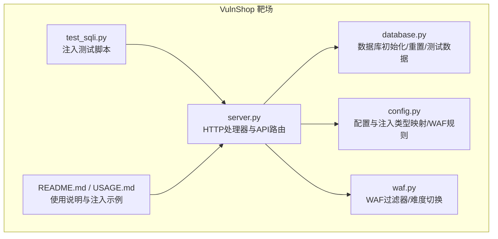
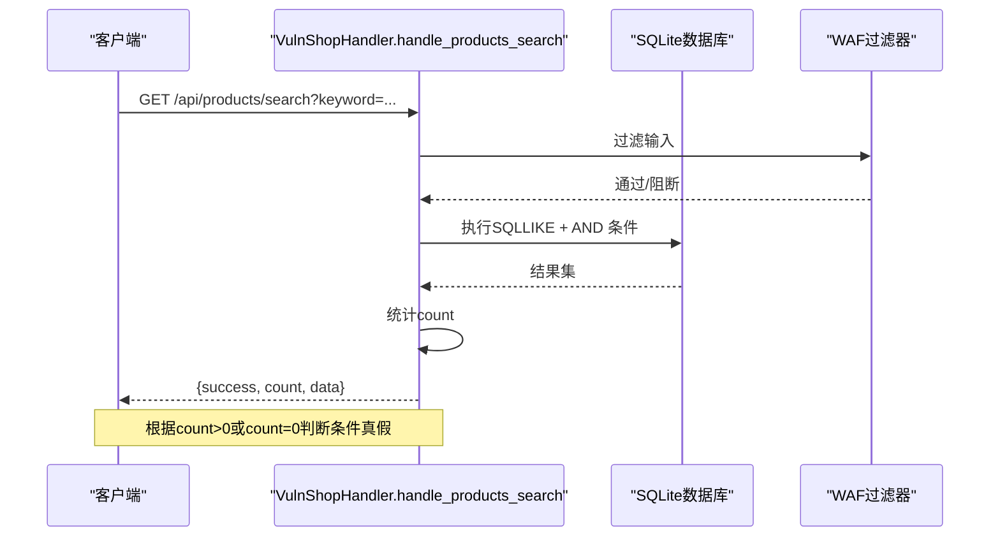
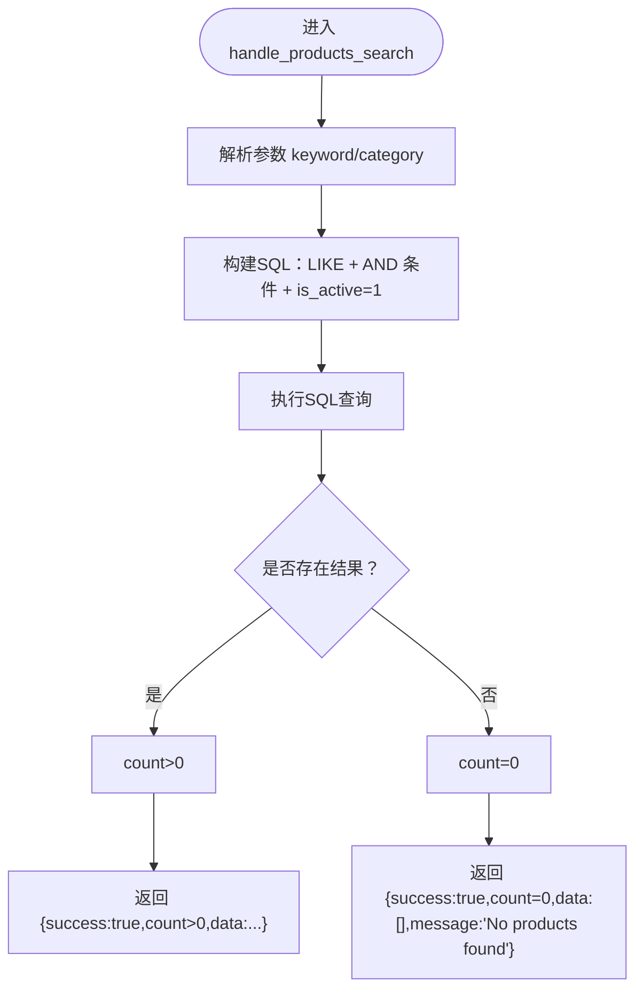
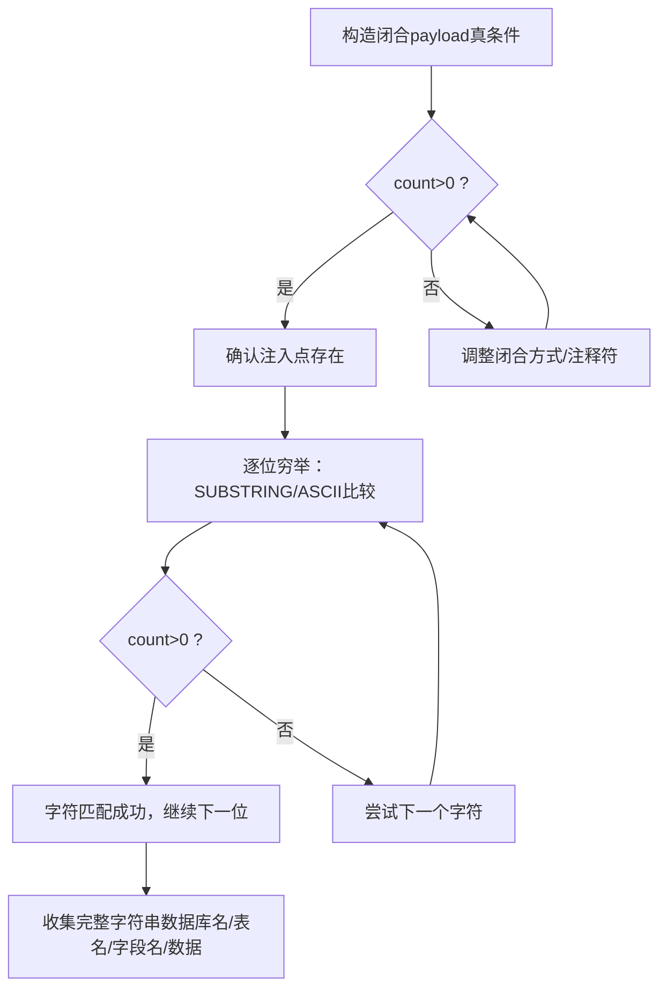
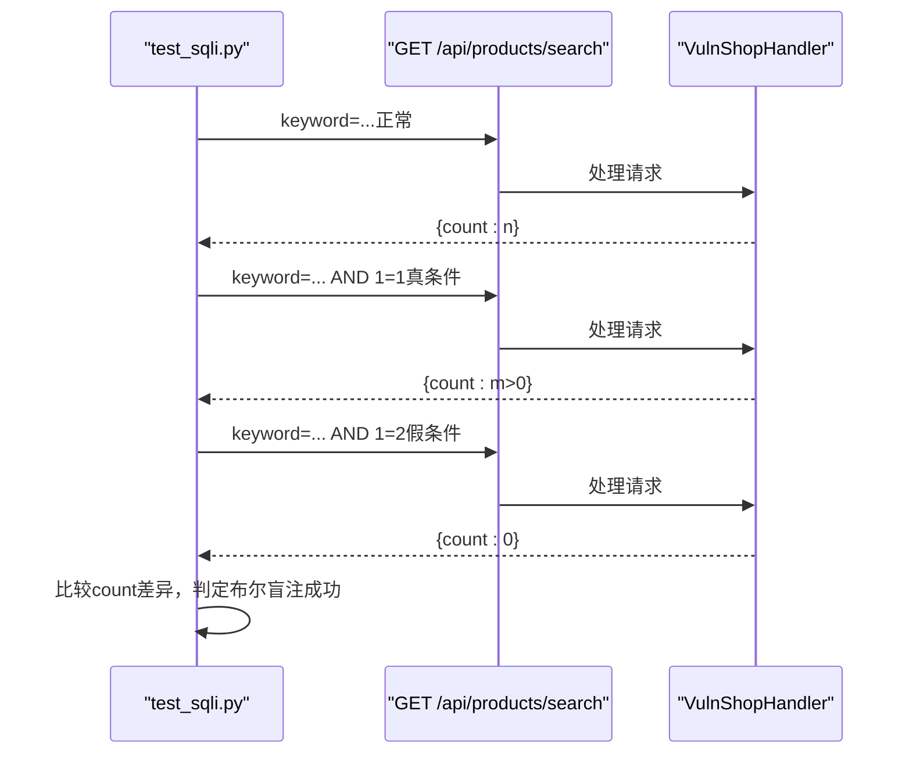
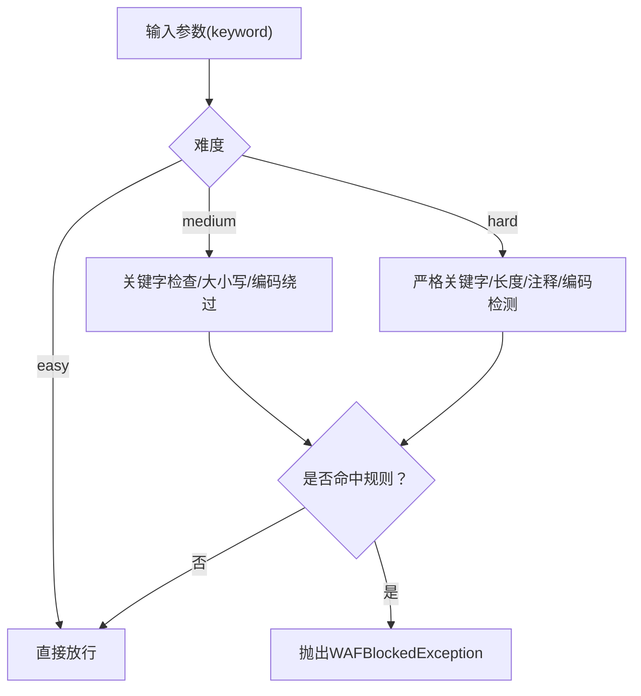
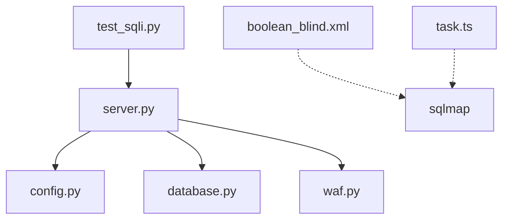

# 布尔盲注

<cite>
**本文引用的文件**
- [server.py](file://src/vulnTestServer/server.py)
- [test_sqli.py](file://src/vulnTestServer/test_sqli.py)
- [database.py](file://src/vulnTestServer/database.py)
- [config.py](file://src/vulnTestServer/config.py)
- [waf.py](file://src/vulnTestServer/waf.py)
- [README.md](file://src/vulnTestServer/README.md)
- [USAGE.md](file://src/vulnTestServer/doc/USAGE.md)
- [boolean_blind.xml](file://src/backEnd/third_lib/sqlmap/data/xml/payloads/boolean_blind.xml)
</cite>

## 目录
1. [简介](#简介)
2. [项目结构](#项目结构)
3. [核心组件](#核心组件)
4. [架构总览](#架构总览)
5. [详细组件分析](#详细组件分析)
6. [依赖关系分析](#依赖关系分析)
7. [性能考量](#性能考量)
8. [故障排查指南](#故障排查指南)
9. [结论](#结论)
10. [附录](#附录)

## 简介
本文件聚焦于 VulnShop 靶场中的“布尔盲注”实现与利用链路，结合 server.py 的条件响应逻辑，解释攻击者如何通过 TRUE/FALSE 条件判断逐位推断数据库信息。我们将：
- 解析布尔盲注的探测方法与利用流程；
- 展示如何使用类似 “?keyword=... AND SUBSTRING((SELECT password FROM users WHERE id=1),1,1)='a'” 的 payload 验证字符正确性；
- 基于页面响应的“有/无结果”差异判断结果；
- 给出完整的利用链示例：数据库名、表名、字段名与数据内容的提取过程；
- 解释 test_sqli.py 中针对布尔盲注的测试用例实现；
- 讨论布尔盲注的检测难度、自动化工具（如 sqlmap）的实现原理，以及如何通过响应模式识别进行防御。

## 项目结构
VulnShop 的漏洞测试服务位于 src/vulnTestServer，核心文件包括：
- server.py：HTTP 服务器与各 API 处理器，其中布尔盲注位于 /api/products/search；
- database.py：数据库初始化、测试数据与重置；
- config.py：全局配置（主机、端口、难度、注入类型映射、WAF 规则）；
- waf.py：WAF 过滤器与难度切换；
- test_sqli.py：对各注入类型的验证脚本；
- README.md 与 USAGE.md：使用说明与注入测试指南。

图表来源
- [server.py](file://src/vulnTestServer/server.py#L151-L218)
- [database.py](file://src/vulnTestServer/database.py#L23-L175)
- [config.py](file://src/vulnTestServer/config.py#L9-L58)
- [waf.py](file://src/vulnTestServer/waf.py#L14-L121)
- [test_sqli.py](file://src/vulnTestServer/test_sqli.py#L1-L270)
- [README.md](file://src/vulnTestServer/README.md#L1-L254)
- [USAGE.md](file://src/vulnTestServer/doc/USAGE.md#L1-L412)

章节来源
- [server.py](file://src/vulnTestServer/server.py#L151-L218)
- [README.md](file://src/vulnTestServer/README.md#L1-L254)

## 核心组件
- 布尔盲注接口：GET /api/products/search
  - 关键点：关键词参数直接拼接到 LIKE 查询中，且最终仅返回“是否有结果”，不返回详细数据，满足盲注特征。
- 响应差异判定：
  - 有结果：count > 0；
  - 无结果：count = 0；
  - 该差异是布尔盲注判断条件真假的依据。
- WAF 难度：
  - easy：无防护，直接注入；
  - medium：关键字过滤，允许大小写/编码绕过；
  - hard：严格过滤，禁止常见绕过技术。

章节来源
- [server.py](file://src/vulnTestServer/server.py#L329-L388)
- [config.py](file://src/vulnTestServer/config.py#L9-L58)
- [waf.py](file://src/vulnTestServer/waf.py#L14-L121)

## 架构总览
布尔盲注在 VulnShop 中的调用链如下：
- 客户端发起 GET /api/products/search?keyword=...；
- 服务器解析参数，构建 SQL 查询（包含用户可控的 keyword）；
- 执行查询，若存在匹配记录则 count>0，否则 count=0；
- 客户端据此判断条件真假，继续逐位穷举。

图表来源
- [server.py](file://src/vulnTestServer/server.py#L329-L388)
- [waf.py](file://src/vulnTestServer/waf.py#L14-L121)

## 详细组件分析

### 组件A：布尔盲注接口与条件响应逻辑
- 接口：GET /api/products/search
- 输入：keyword、category（可选）
- SQL 构建：将 keyword 直接拼接到 LIKE 子句；若提供 category，追加 category=...；最后固定 is_active=1；
- 响应：仅返回 success、count、data；无错误回显，满足盲注特征；
- 判定依据：count>0 表示条件为真，count=0 表示条件为假。

图表来源
- [server.py](file://src/vulnTestServer/server.py#L329-L388)

章节来源
- [server.py](file://src/vulnTestServer/server.py#L329-L388)

### 组件B：布尔盲注探测与利用流程
- 探测思路：
  - 先构造闭合 payload，使服务器返回“有结果”（条件为真），再构造“假条件”（条件为假）返回“无结果”，从而确认注入点存在；
  - 通过闭合引号与注释符保证语法正确；
- 逐位穷举：
  - 使用 SUBSTRING/ASCII 等函数对目标字符进行比较；
  - 通过 count 差异判断比较结果，逐步定位每个字符；
- 利用链示例（数据库名/表名/字段名/数据）：
  - 通过布尔盲注探测数据库版本、表名、列名；
  - 使用 UNION 或其他技术提取数据（本接口主要验证布尔盲注，数据提取可结合其他接口）。

图表来源
- [USAGE.md](file://src/vulnTestServer/doc/USAGE.md#L175-L230)
- [README.md](file://src/vulnTestServer/README.md#L113-L118)

章节来源
- [USAGE.md](file://src/vulnTestServer/doc/USAGE.md#L175-L230)
- [README.md](file://src/vulnTestServer/README.md#L113-L118)

### 组件C：test_sqli.py 中的布尔盲注测试用例
- 目标：验证 /api/products/search 的布尔盲注能力；
- 步骤：
  - 正常搜索，记录 count；
  - 闭合 payload（AND 1=1），期望 count>0；
  - 闭合 payload（AND 1=2），期望 count=0；
  - 若真条件返回有结果、假条件返回无结果，则判定布尔盲注成功。

图表来源
- [test_sqli.py](file://src/vulnTestServer/test_sqli.py#L91-L123)

章节来源
- [test_sqli.py](file://src/vulnTestServer/test_sqli.py#L91-L123)

### 组件D：WAF 与难度对布尔盲注的影响
- easy：无防护，可直接注入；
- medium：关键字过滤，允许大小写/编码绕过；
- hard：严格过滤，禁止常见绕过技术，需高级绕过手段；
- WAF 过滤器会根据难度与规则检查输入，必要时抛出拦截异常。

图表来源
- [waf.py](file://src/vulnTestServer/waf.py#L14-L121)
- [config.py](file://src/vulnTestServer/config.py#L9-L58)

章节来源
- [waf.py](file://src/vulnTestServer/waf.py#L14-L121)
- [config.py](file://src/vulnTestServer/config.py#L9-L58)

### 组件E：数据库结构与可利用对象
- users 表：包含用户名、密码等敏感信息；
- products 表：商品信息；
- orders 表：订单信息；
- secrets 表：隐藏 Flag；
- 利用链中可从 users.password 提取管理员密码，或从 secrets.flag 提取 Flag。

章节来源
- [database.py](file://src/vulnTestServer/database.py#L23-L175)

## 依赖关系分析
- server.py 依赖：
  - config.py（主机、端口、难度、注入类型映射、日志）；
  - database.py（数据库连接、初始化、重置）；
  - waf.py（WAF 过滤器与难度切换）；
- test_sqli.py 依赖：
  - requests 库；
  - server.py 的 API 接口；
- sqlmap 相关：
  - boolean_blind.xml 定义了布尔盲注的 payload 模板与比较向量；
  - WebUI 中 task.ts 提供了布尔盲注的 payload 示例与响应对比字段。

图表来源
- [server.py](file://src/vulnTestServer/server.py#L1-L120)
- [config.py](file://src/vulnTestServer/config.py#L9-L58)
- [database.py](file://src/vulnTestServer/database.py#L1-L60)
- [waf.py](file://src/vulnTestServer/waf.py#L14-L121)
- [test_sqli.py](file://src/vulnTestServer/test_sqli.py#L1-L60)
- [boolean_blind.xml](file://src/backEnd/third_lib/sqlmap/data/xml/payloads/boolean_blind.xml#L257-L1018)
- [USAGE.md](file://src/vulnTestServer/doc/USAGE.md#L277-L331)

章节来源
- [server.py](file://src/vulnTestServer/server.py#L1-L120)
- [test_sqli.py](file://src/vulnTestServer/test_sqli.py#L1-L60)

## 性能考量
- 布尔盲注的效率取决于字符穷举速度与网络往返时间；
- 在高延迟或 WAF 严格模式下，穷举耗时显著增加；
- 优化建议：
  - 使用二分法缩小字符范围；
  - 并发请求减少等待；
  - 选择合适字符集（数字/字母）优先；
  - 避免不必要的请求，合并条件判断。

## 故障排查指南
- 无法区分真假条件：
  - 确认 payload 闭合正确（引号/注释符）；
  - 检查是否被 WAF 拦截；
  - 在 easy 模式下验证接口是否正常返回 count 差异。
- WAF 拦截：
  - 切换到 easy 模式或使用大小写/编码绕过；
  - 在 medium/hard 模式下使用更复杂的绕过技术。
- 响应异常：
  - 检查请求参数是否被正确解析；
  - 确保请求头与 Content-Type 符合预期。

章节来源
- [waf.py](file://src/vulnTestServer/waf.py#L14-L121)
- [USAGE.md](file://src/vulnTestServer/doc/USAGE.md#L334-L388)

## 结论
VulnShop 的布尔盲注实现通过 /api/products/search 的“有/无结果”响应差异，为攻击者提供了清晰的 TRUE/FALSE 判断依据。配合 test_sqli.py 的自动化验证，可以快速确认注入点的存在。在实际利用中，建议采用闭合 payload 确认真假条件，再结合 SUBSTRING/ASCII 等技术进行逐位穷举，最终完成数据库名、表名、字段名与数据内容的提取。同时，WAF 的难度设置直接影响注入成功率，需根据场景选择合适的绕过策略。

## 附录
- 布尔盲注 payload 模板与比较向量参考：
  - [boolean_blind.xml](file://src/backEnd/third_lib/sqlmap/data/xml/payloads/boolean_blind.xml#L257-L1018)
- WebUI 中布尔盲注 payload 示例与响应对比字段：
  - [task.ts](file://src/frontEnd/src/api/task.ts#L919-L961)
- 使用说明与注入示例：
  - [USAGE.md](file://src/vulnTestServer/doc/USAGE.md#L175-L230)
  - [README.md](file://src/vulnTestServer/README.md#L113-L118)