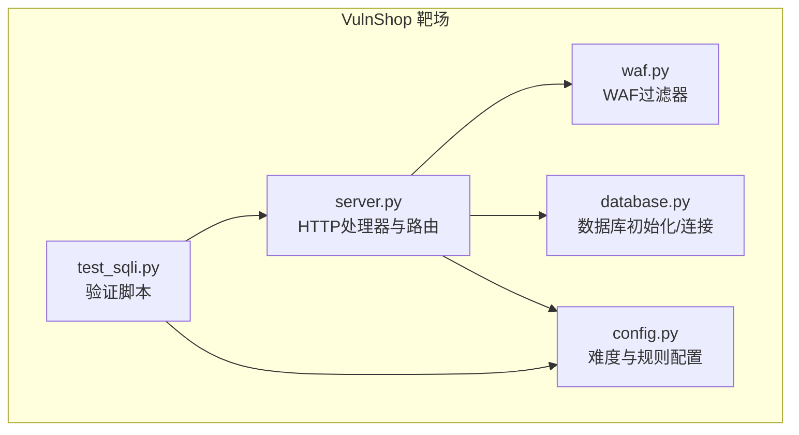
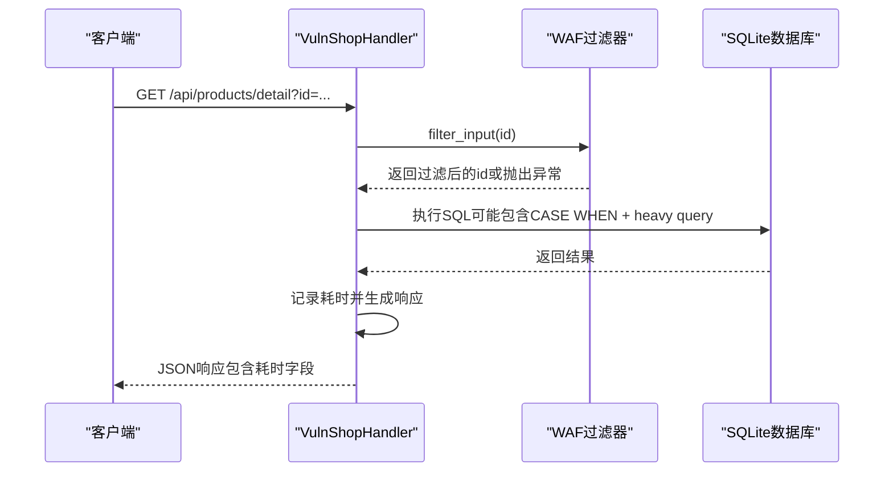
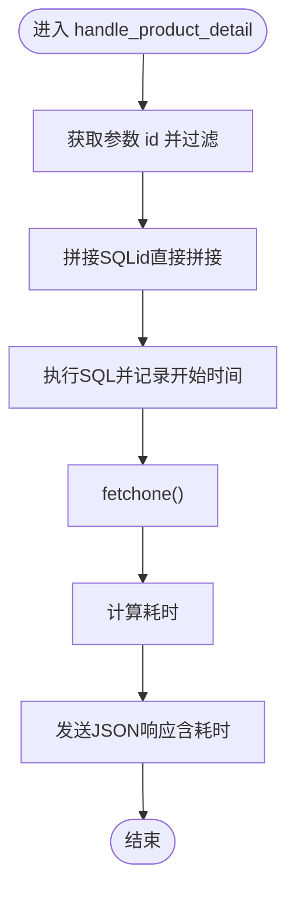
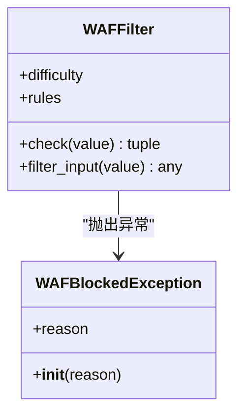
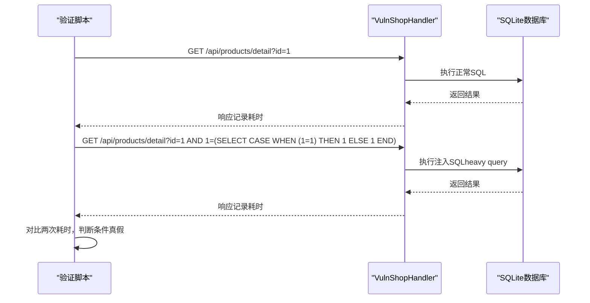
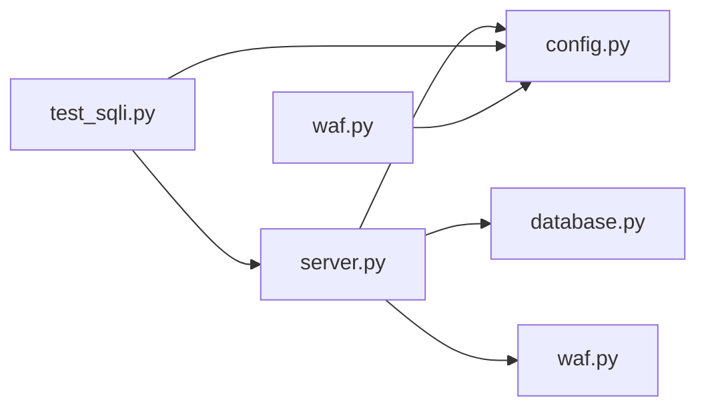

# 时间盲注

<cite>
**本文引用的文件**
- [server.py](file://src/vulnTestServer/server.py)
- [waf.py](file://src/vulnTestServer/waf.py)
- [database.py](file://src/vulnTestServer/database.py)
- [config.py](file://src/vulnTestServer/config.py)
- [test_sqli.py](file://src/vulnTestServer/test_sqli.py)
- [time_blind.xml](file://src/backEnd/third_lib/sqlmap/data/xml/payloads/time_blind.xml)
- [stacked_queries.xml](file://src/backEnd/third_lib/sqlmap/data/xml/payloads/stacked_queries.xml)
</cite>

## 目录
1. [引言](#引言)
2. [项目结构](#项目结构)
3. [核心组件](#核心组件)
4. [架构总览](#架构总览)
5. [详细组件分析](#详细组件分析)
6. [依赖关系分析](#依赖关系分析)
7. [性能考量](#性能考量)
8. [故障排查指南](#故障排查指南)
9. [结论](#结论)
10. [附录](#附录)

## 引言
本文件围绕 VulnShop 靶场中的“时间盲注”能力进行系统化解析，重点说明以下方面：
- 在 server.py 中如何通过延时响应（如使用 CASE WHEN 构造的 heavy query）来暴露时间盲注面；
- 攻击者如何利用数据库的延时函数（如 CASE WHEN + heavy query）构造 payload，并通过页面响应时间差异判断条件真假；
- 完整利用链示例：从探测注入点到基于时间延迟的信息提取；
- 在 waf.py 中对时间盲注的检测与限制策略（如关键字过滤、长度限制、URL 解码检测等）；
- 时间盲注的隐蔽性、检测挑战，以及在高延迟网络环境下的利用策略与防御建议。

## 项目结构
VulnShop 的时间盲注相关代码集中在 src/vulnTestServer 目录，核心文件如下：
- server.py：HTTP 服务端，包含各 API 处理器，其中 /api/products/detail 对应时间盲注；
- waf.py：模拟 WAF 的输入过滤器，控制不同难度下的检测强度；
- database.py：数据库初始化与连接，提供测试数据；
- config.py：全局配置，含难度等级、WAF 规则、注入类型映射；
- test_sqli.py：验证脚本，包含时间盲注的探测与利用示例；
- 第三方 SQLMap payload：用于理解通用时间盲注 payload 的构造思路。

图表来源
- [server.py](file://src/vulnTestServer/server.py#L151-L218)
- [waf.py](file://src/vulnTestServer/waf.py#L14-L121)
- [database.py](file://src/vulnTestServer/database.py#L15-L21)
- [config.py](file://src/vulnTestServer/config.py#L12-L58)
- [test_sqli.py](file://src/vulnTestServer/test_sqli.py#L1-L270)

章节来源
- [server.py](file://src/vulnTestServer/server.py#L151-L218)
- [config.py](file://src/vulnTestServer/config.py#L12-L58)

## 核心组件
- HTTP 请求处理器与路由：负责接收请求、调用对应 API 处理器、记录日志、返回 JSON 响应。
- 时间盲注处理器：在 /api/products/detail 中，对用户输入的 id 参数进行直接拼接，构造可执行的 SQL；通过测量数据库执行耗时来反映注入条件真假。
- WAF 过滤器：在不同难度下对输入进行关键字、编码、长度等检查，必要时抛出拦截异常。
- 数据库层：提供 SQLite 连接与初始化，插入测试数据，便于注入演示。
- 验证脚本：自动化发起请求，对比正常与注入场景下的响应时间，辅助判断是否存在时间盲注。

章节来源
- [server.py](file://src/vulnTestServer/server.py#L37-L119)
- [server.py](file://src/vulnTestServer/server.py#L389-L444)
- [waf.py](file://src/vulnTestServer/waf.py#L14-L121)
- [database.py](file://src/vulnTestServer/database.py#L15-L21)
- [test_sqli.py](file://src/vulnTestServer/test_sqli.py#L125-L158)

## 架构总览
时间盲注在 VulnShop 中的端到端流程如下：
- 客户端向 /api/products/detail 发起请求，携带 id 参数；
- 服务器处理器获取参数并调用 WAF 过滤器；
- 处理器拼接 SQL 并执行，同时记录开始时间；
- 数据库执行 SQL（若注入 payload 导致 heavy query，则产生明显延迟）；
- 计算耗时并返回 JSON 响应，客户端据此判断条件真假。

图表来源
- [server.py](file://src/vulnTestServer/server.py#L389-L444)
- [waf.py](file://src/vulnTestServer/waf.py#L91-L108)
- [test_sqli.py](file://src/vulnTestServer/test_sqli.py#L125-L158)

## 详细组件分析

### 时间盲注处理器（/api/products/detail）
- 输入处理：从查询参数获取 id，经 WAF 过滤后直接拼接到 SQL；
- 执行逻辑：记录开始时间，执行 SQL，计算耗时；
- 响应输出：返回商品详情，并在调试模式下附加耗时字段；
- 关键点：该接口明确标注为“时间盲注”，且在测试脚本中通过 CASE WHEN 构造 heavy query 来验证延迟。

图表来源
- [server.py](file://src/vulnTestServer/server.py#L389-L444)

章节来源
- [server.py](file://src/vulnTestServer/server.py#L389-L444)

### WAF 过滤器与时间盲注检测
- 难度等级：
  - easy：无防护，允许所有注入尝试；
  - medium：对关键字进行大小写不敏感检查，允许大小写与编码绕过；
  - hard：严格过滤，包含对 sleep/benchmark/waitfor/delay 等关键字的检测，以及注释、十六进制、长度限制等；
- URL 解码检测：最多进行三次解码，防止双重编码绕过；
- 关键字列表：hard 模式下包含 sleep、benchmark、waitfor、delay、0x、char(、concat(、group_concat( 等；
- 行为：当检测到阻断条件时，抛出 WAFBlockedException，上层捕获后返回 403。

图表来源
- [waf.py](file://src/vulnTestServer/waf.py#L14-L121)

章节来源
- [waf.py](file://src/vulnTestServer/waf.py#L14-L121)
- [config.py](file://src/vulnTestServer/config.py#L36-L50)

### 验证脚本与时间盲注利用链
- 正常查询：记录响应时间 baseline；
- 注入测试：构造 CASE WHEN + heavy query 的 payload，观察响应时间显著增加；
- 利用链要点：
  - 先探测注入点（确认 SQL 可被拼接执行）；
  - 再通过时间差异判断布尔条件真假；
  - 最终结合位图法或二分法提取目标数据（如用户名、密码等）。

图表来源
- [test_sqli.py](file://src/vulnTestServer/test_sqli.py#L125-L158)
- [server.py](file://src/vulnTestServer/server.py#L389-L444)

章节来源
- [test_sqli.py](file://src/vulnTestServer/test_sqli.py#L125-L158)

### 通用时间盲注 payload 参考（来自 SQLMap）
- MySQL：SLEEP、ELT、BENCHMARK 等；
- PostgreSQL：PG_SLEEP、GENERATE_SERIES 等；
- SQLite：RANDOMBLOB、LIKE + HEX + RANDOMBLOB 等；
- 以上 payload 体现了“通过 heavy query 造成延迟”的通用思路，与 VulnShop 中 CASE WHEN + heavy query 的设计一致。

章节来源
- [time_blind.xml](file://src/backEnd/third_lib/sqlmap/data/xml/payloads/time_blind.xml#L1-L200)
- [time_blind.xml](file://src/backEnd/third_lib/sqlmap/data/xml/payloads/time_blind.xml#L1013-L1072)
- [stacked_queries.xml](file://src/backEnd/third_lib/sqlmap/data/xml/payloads/stacked_queries.xml#L547-L565)

## 依赖关系分析
- server.py 依赖：
  - config.py：主机、端口、难度、注入类型映射、日志开关；
  - database.py：数据库连接与初始化；
  - waf.py：WAF 实例与异常类型；
- waf.py 依赖：
  - config.py：难度与规则；
- test_sqli.py 依赖：
  - server.py（通过 HTTP 接口验证）；
  - config.py（难度与规则影响 WAF 行为）。

图表来源
- [server.py](file://src/vulnTestServer/server.py#L32-L35)
- [waf.py](file://src/vulnTestServer/waf.py#L108-L121)
- [config.py](file://src/vulnTestServer/config.py#L12-L58)
- [test_sqli.py](file://src/vulnTestServer/test_sqli.py#L1-L20)

章节来源
- [server.py](file://src/vulnTestServer/server.py#L32-L35)
- [waf.py](file://src/vulnTestServer/waf.py#L108-L121)
- [config.py](file://src/vulnTestServer/config.py#L12-L58)
- [test_sqli.py](file://src/vulnTestServer/test_sqli.py#L1-L20)

## 性能考量
- 延迟测量：
  - 服务器在执行 SQL 前后记录时间戳，计算耗时并返回；
  - 客户端通过比较正常与注入场景的耗时差异判断条件真假；
- heavy query 设计：
  - SQLite 不支持 SLEEP，但可通过 CASE WHEN + heavy query（如 RANDOMBLOB、LIKE + HEX + RANDOMBLOB）达到相同效果；
  - heavy query 的复杂度越高，延迟越明显，但也会带来更高的资源消耗；
- 网络与环境因素：
  - 高延迟网络会放大时间差，需多次采样取中位数或均值；
  - 服务器负载与并发也可能影响测量稳定性。

章节来源
- [server.py](file://src/vulnTestServer/server.py#L409-L414)
- [test_sqli.py](file://src/vulnTestServer/test_sqli.py#L125-L158)
- [time_blind.xml](file://src/backEnd/third_lib/sqlmap/data/xml/payloads/time_blind.xml#L1013-L1072)

## 故障排查指南
- 注入点未触发：
  - 确认请求路径与参数正确；
  - 检查 WAF 难度设置，high 模式可能拦截 payload；
  - 在 DEBUG 模式下观察服务器打印的 SQL 与响应体中的 debug 字段。
- 响应时间无明显差异：
  - 提升 heavy query 的复杂度或增大延迟参数；
  - 在高延迟网络环境下增加采样次数，避免误判；
  - 确保 payload 闭合正确，避免语法错误导致提前短路。
- WAF 拦截：
  - 切换到 easy 模式快速验证；
  - medium 模式下尝试大小写变形、编码绕过；
  - hard 模式下需更复杂的绕过技巧（参考 SQLMap payload）。

章节来源
- [server.py](file://src/vulnTestServer/server.py#L54-L66)
- [server.py](file://src/vulnTestServer/server.py#L188-L194)
- [waf.py](file://src/vulnTestServer/waf.py#L21-L90)
- [config.py](file://src/vulnTestServer/config.py#L20-L24)

## 结论
- VulnShop 的时间盲注实现通过在 /api/products/detail 中直接拼接用户输入并执行 heavy query，配合响应时间差异实现条件真假判定；
- WAF 在不同难度下对关键字、编码与长度进行检测，high 模式下对 sleep/benchmark 等关键字尤为敏感；
- 利用链从探测到提取可按“探测注入点—构造布尔条件—统计时间差异—位图/二分提取”的步骤推进；
- 在高延迟网络与复杂环境中，需提高采样次数与 payload 复杂度，同时结合 WAF 难度策略选择合适的绕过手段。

## 附录
- 时间盲注 payload 参考（来自 SQLMap）：
  - MySQL：SLEEP、ELT、BENCHMARK；
  - PostgreSQL：PG_SLEEP、GENERATE_SERIES；
  - SQLite：RANDOMBLOB、LIKE + HEX + RANDOMBLOB；
- 在 VulnShop 中，推荐使用 CASE WHEN + heavy query 的形式，以适配 SQLite 的特性。

章节来源
- [time_blind.xml](file://src/backEnd/third_lib/sqlmap/data/xml/payloads/time_blind.xml#L1-L200)
- [time_blind.xml](file://src/backEnd/third_lib/sqlmap/data/xml/payloads/time_blind.xml#L1013-L1072)
- [stacked_queries.xml](file://src/backEnd/third_lib/sqlmap/data/xml/payloads/stacked_queries.xml#L547-L565)