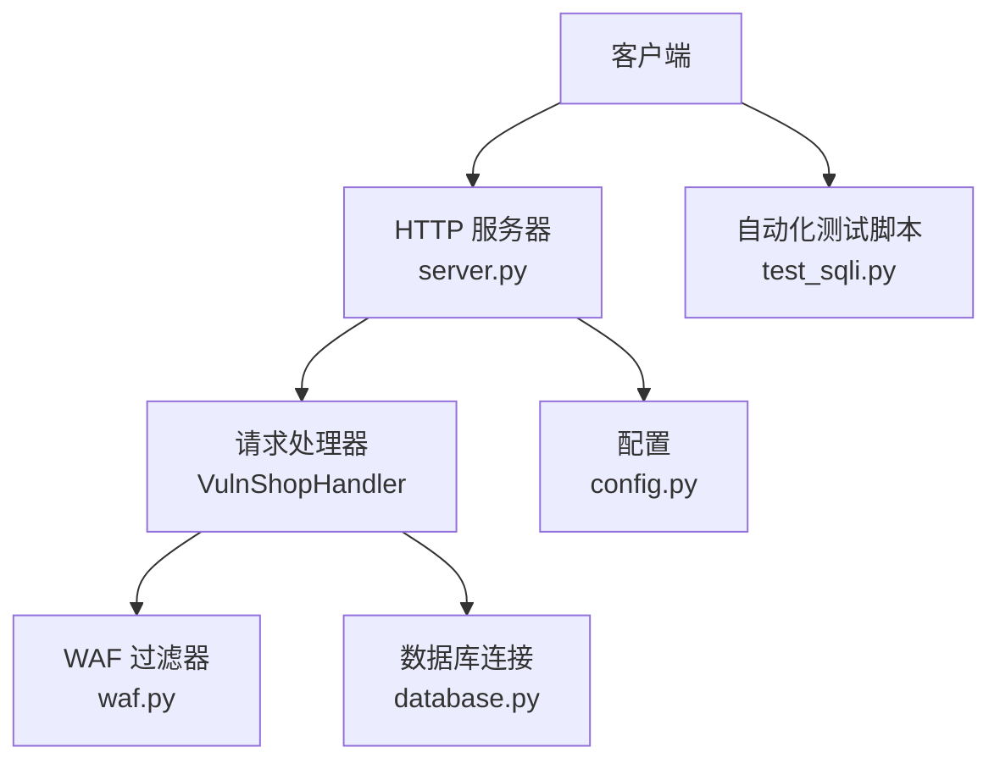
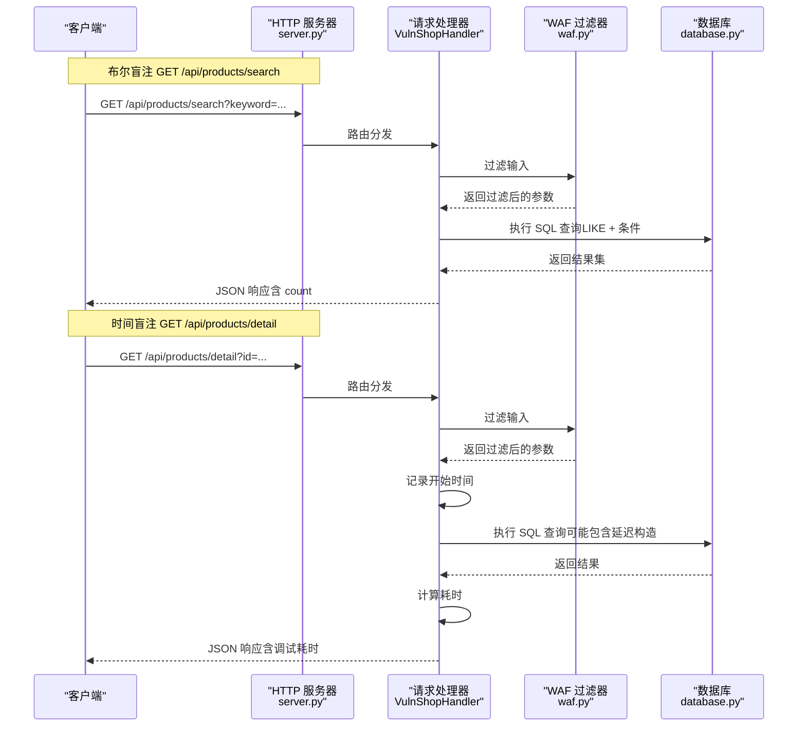
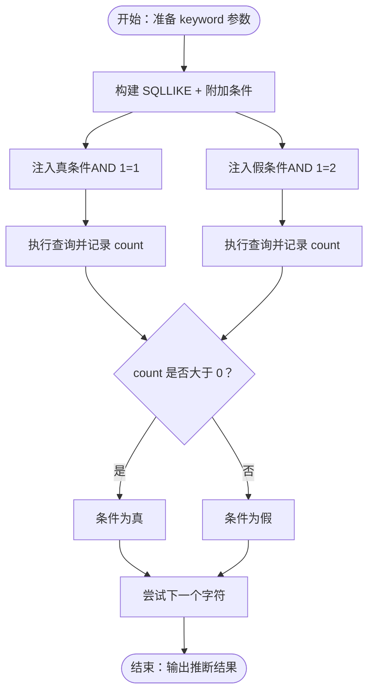
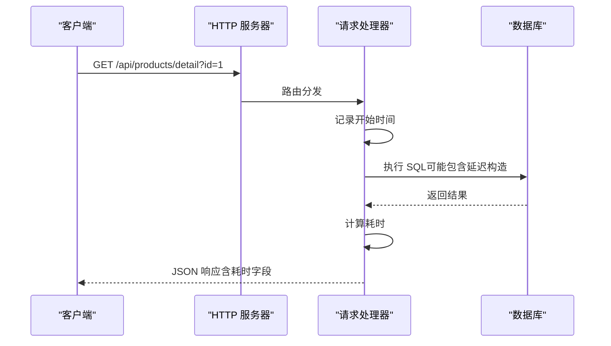
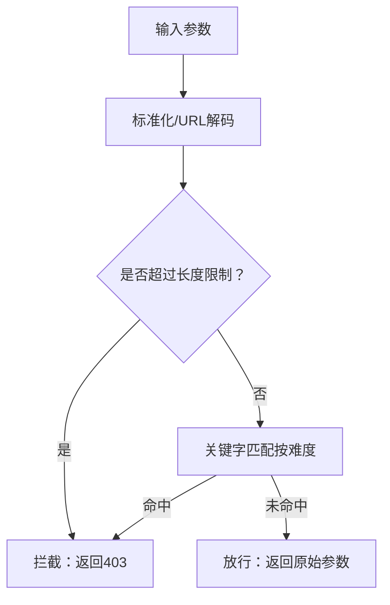
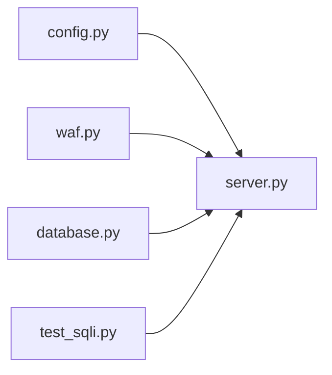

# 盲注

<cite>
**本文引用的文件**
- [server.py](file://src/vulnTestServer/server.py)
- [waf.py](file://src/vulnTestServer/waf.py)
- [config.py](file://src/vulnTestServer/config.py)
- [database.py](file://src/vulnTestServer/database.py)
- [test_sqli.py](file://src/vulnTestServer/test_sqli.py)
- [README.md](file://src/vulnTestServer/README.md)
</cite>

## 目录
1. [简介](#简介)
2. [项目结构](#项目结构)
3. [核心组件](#核心组件)
4. [架构总览](#架构总览)
5. [详细组件分析](#详细组件分析)
6. [依赖关系分析](#依赖关系分析)
7. [性能考量](#性能考量)
8. [故障排查指南](#故障排查指南)
9. [结论](#结论)
10. [附录](#附录)

## 简介
本文件围绕 VulnShop 靶场中的布尔盲注与时间盲注两类高级 SQL 注入技术进行深入解析。通过对 server.py 中的条件响应逻辑、布尔盲注的“有/无结果”差异、时间盲注的“响应时间差异”进行代码级分析，并结合 waf.py 的检测与拦截机制，帮助读者理解攻击者在无直接数据回显场景下的推理与利用路径。同时，提供两种盲注的完整利用链示例，讨论自动化工具的实现原理与检测难度，并强调其在现代 Web 应用安全中的重要性。

## 项目结构
VulnShop 靶场采用最小化后端实现，核心由以下模块构成：
- HTTP 服务器与路由：server.py
- WAF 模拟与难度控制：waf.py、config.py
- 数据库初始化与测试数据：database.py
- 自动化测试脚本：test_sqli.py
- 文档与使用说明：README.md

图表来源
- [server.py](file://src/vulnTestServer/server.py#L151-L218)
- [waf.py](file://src/vulnTestServer/waf.py#L14-L121)
- [config.py](file://src/vulnTestServer/config.py#L9-L58)
- [database.py](file://src/vulnTestServer/database.py#L15-L21)

章节来源
- [README.md](file://src/vulnTestServer/README.md#L1-L120)
- [server.py](file://src/vulnTestServer/server.py#L151-L218)

## 核心组件
- HTTP 请求处理器：负责路由分发、参数解析、调用业务处理函数、统一响应与错误处理。
- WAF 过滤器：根据难度级别对输入进行关键字匹配、URL 解码、长度限制等检查；在 hard 模式下对多种 SQL 关键词与编码形式进行严格拦截。
- 数据库层：提供 SQLite 连接与初始化，包含用户、商品、订单、秘密旗标等测试表。
- 自动化测试脚本：提供布尔盲注与时间盲注的验证流程，包括正常请求、注入请求与结果判定。

章节来源
- [server.py](file://src/vulnTestServer/server.py#L151-L218)
- [waf.py](file://src/vulnTestServer/waf.py#L14-L121)
- [database.py](file://src/vulnTestServer/database.py#L23-L176)
- [test_sqli.py](file://src/vulnTestServer/test_sqli.py#L91-L158)

## 架构总览
下图展示了布尔盲注与时间盲注两条关键路径在服务端的执行流程与数据流。

图表来源
- [server.py](file://src/vulnTestServer/server.py#L329-L444)
- [waf.py](file://src/vulnTestServer/waf.py#L91-L121)
- [database.py](file://src/vulnTestServer/database.py#L15-L21)

## 详细组件分析

### 布尔盲注（Boolean-based Blind SQLi）
- 注入点与实现
  - 接口：GET /api/products/search
  - 实现要点：关键词参数直接拼接到 LIKE 条件中，最终 SQL 中还附加了固定筛选条件与 is_active 过滤，形成闭合与布尔条件的组合空间。
  - 响应特征：仅返回“是否有结果”与“结果数量”，不返回具体字段内容，符合盲注典型特征。
- 攻击思路
  - 通过构造布尔表达式使查询真假不同，从而导致 count 差异，以此逐字节推断数据库信息。
  - 示例利用链（基于代码注释与测试脚本）：
    1) 闭合原 SQL 并注入布尔条件，例如在 keyword 中加入闭合与 AND 条件，使整体查询真假不同。
    2) 对比正常请求与注入请求的 count，若注入为真则 count 更大，为假则 count 为 0。
    3) 逐步穷举字符集，定位目标字段（如管理员密码首字母）。
- 代码级证据
  - 路由与处理函数：[handle_products_search](file://src/vulnTestServer/server.py#L329-L388)
  - 注释中的测试 payload 与响应行为说明：[handle_products_search](file://src/vulnTestServer/server.py#L329-L388)
  - 自动化测试脚本中对布尔盲注的验证流程：[test_boolean_blind_sqli](file://src/vulnTestServer/test_sqli.py#L91-L123)

图表来源
- [server.py](file://src/vulnTestServer/server.py#L329-L388)
- [test_sqli.py](file://src/vulnTestServer/test_sqli.py#L91-L123)

章节来源
- [server.py](file://src/vulnTestServer/server.py#L329-L388)
- [test_sqli.py](file://src/vulnTestServer/test_sqli.py#L91-L123)

### 时间盲注（Time-based Blind SQLi）
- 注入点与实现
  - 接口：GET /api/products/detail
  - 实现要点：商品 ID 直接拼接至 WHERE 条件；服务端在执行前后记录时间，将耗时作为“响应时间差异”的依据。
  - 响应特征：返回 JSON，其中在调试模式下会包含耗时字段，便于自动化脚本对比。
- 攻击思路
  - 在 SQL 中构造条件分支，使满足条件时触发延迟（如随机大对象生成），不满足时不延迟，从而通过响应时间差异判断布尔真假。
  - 示例利用链（基于代码注释与测试脚本）：
    1) 在 id 参数中注入 CASE WHEN 构造的延迟逻辑。
    2) 对比正常请求与注入请求的响应时间，若注入为真则耗时显著增加。
    3) 逐步穷举字符集，定位目标字段。
- 代码级证据
  - 路由与处理函数：[handle_product_detail](file://src/vulnTestServer/server.py#L389-L444)
  - 注释中的测试 payload 与响应时间记录：[handle_product_detail](file://src/vulnTestServer/server.py#L389-L444)
  - 自动化测试脚本中对时间盲注的验证流程：[test_time_based_sqli](file://src/vulnTestServer/test_sqli.py#L125-L158)

图表来源
- [server.py](file://src/vulnTestServer/server.py#L389-L444)
- [test_sqli.py](file://src/vulnTestServer/test_sqli.py#L125-L158)

章节来源
- [server.py](file://src/vulnTestServer/server.py#L389-L444)
- [test_sqli.py](file://src/vulnTestServer/test_sqli.py#L125-L158)

### WAF 检测与拦截逻辑
- 难度等级
  - easy：无防护，所有注入类型均可直接使用。
  - medium：对常见 SQL 关键字进行过滤，允许大小写、编码等简单绕过。
  - hard：严格过滤，包含多种 SQL 关键词与编码形式，且限制参数长度。
- 关键检测点
  - 输入标准化与 URL 解码：对输入进行多次 URL 解码，防止双重编码绕过。
  - 关键字匹配：在不同难度下匹配 union、select、drop、注释、hex 编码、OR/AND/XOR 等模式。
  - 长度限制：hard 模式下对参数长度进行限制。
- 异常拦截
  - 当检测到违规输入时，抛出拦截异常，上层捕获后返回 403 并提示 WAF 阻断原因。
- 代码级证据
  - WAF 类与规则：[WAFFilter](file://src/vulnTestServer/waf.py#L14-L121)
  - 难度与规则配置：[config.py](file://src/vulnTestServer/config.py#L36-L49)
  - 服务器端捕获并返回阻断信息：[server.py](file://src/vulnTestServer/server.py#L188-L194)

图表来源
- [waf.py](file://src/vulnTestServer/waf.py#L21-L89)
- [config.py](file://src/vulnTestServer/config.py#L36-L49)

章节来源
- [waf.py](file://src/vulnTestServer/waf.py#L14-L121)
- [config.py](file://src/vulnTestServer/config.py#L36-L49)
- [server.py](file://src/vulnTestServer/server.py#L188-L194)

### 自动化工具实现原理与检测难度
- 自动化工具（如 sqlmap）通常采用以下策略：
  - 字符集穷举：对目标字段逐字节爆破，结合布尔/时间差异判断。
  - 二分法优化：通过比较 count 或耗时快速缩小范围。
  - 绕过技术：大小写变形、编码绕过、注释与空格替换、函数变换等。
  - 多次重试与超时阈值：在高延迟或网络抖动环境下稳定判断。
- 检测难度
  - easy：几乎无阻拦，自动化工具可直接跑通。
  - medium：需要基础绕过技巧，工具需具备关键字替换与编码能力。
  - hard：WAF 严格拦截，需要高级绕过与抗检测策略，自动化成功率降低。
- 代码级体现
  - server.py 的布尔盲注与时间盲注响应差异，为自动化工具提供了稳定的判定依据。
  - waf.py 的严格规则与异常抛出，增加了自动化工具的检测难度。

章节来源
- [server.py](file://src/vulnTestServer/server.py#L329-L444)
- [waf.py](file://src/vulnTestServer/waf.py#L14-L121)
- [test_sqli.py](file://src/vulnTestServer/test_sqli.py#L91-L158)

## 依赖关系分析
- server.py 依赖 waf.py 提供的过滤器实例，对 GET/POST 参数进行过滤；同时依赖 database.py 获取数据库连接。
- config.py 提供全局配置（主机、端口、难度、WAF 规则、日志等），影响 server.py 与 waf.py 的行为。
- test_sqli.py 通过 HTTP 请求调用 server.py 暴露的接口，验证各类注入点的可用性与响应差异。

图表来源
- [server.py](file://src/vulnTestServer/server.py#L32-L35)
- [config.py](file://src/vulnTestServer/config.py#L9-L58)
- [waf.py](file://src/vulnTestServer/waf.py#L108-L121)
- [database.py](file://src/vulnTestServer/database.py#L15-L21)
- [test_sqli.py](file://src/vulnTestServer/test_sqli.py#L1-L20)

章节来源
- [server.py](file://src/vulnTestServer/server.py#L32-L35)
- [config.py](file://src/vulnTestServer/config.py#L9-L58)
- [waf.py](file://src/vulnTestServer/waf.py#L108-L121)
- [database.py](file://src/vulnTestServer/database.py#L15-L21)
- [test_sqli.py](file://src/vulnTestServer/test_sqli.py#L1-L20)

## 性能考量
- 布尔盲注
  - 由于仅依赖 count 差异，性能主要受数据库查询与网络往返影响；可通过批量请求与并发减少总耗时。
- 时间盲注
  - 延迟构造（如随机大对象）会显著增加响应时间，自动化脚本需设置合理的超时阈值与重试策略。
- WAF 影响
  - hard 模式下频繁触发拦截可能导致请求失败或超时，自动化工具需具备重试与绕过能力。
- 代码级体现
  - 时间盲注中明确记录开始/结束时间并返回耗时字段，便于自动化脚本进行对比：[handle_product_detail](file://src/vulnTestServer/server.py#L409-L414)

章节来源
- [server.py](file://src/vulnTestServer/server.py#L409-L414)

## 故障排查指南
- 布尔盲注无法区分
  - 检查是否正确闭合原 SQL；确认注入条件真假后 count 是否出现差异。
  - 参考自动化脚本的对比逻辑：[test_boolean_blind_sqli](file://src/vulnTestServer/test_sqli.py#L104-L119)
- 时间盲注耗时不稳定
  - 确认注入是否触发了延迟构造；适当提高超时阈值并多次重试。
  - 参考自动化脚本的时间测量与对比：[test_time_based_sqli](file://src/vulnTestServer/test_sqli.py#L131-L158)
- WAF 拦截
  - 切换难度或调整 payload 绕过策略；关注拦截原因并修正输入。
  - 参考 server.py 对拦截异常的处理与返回：[server.py](file://src/vulnTestServer/server.py#L188-L194)
- 数据库问题
  - 确认数据库初始化完成；必要时重置数据库。
  - 参考数据库初始化与重置逻辑：[database.py](file://src/vulnTestServer/database.py#L23-L176)

章节来源
- [test_sqli.py](file://src/vulnTestServer/test_sqli.py#L91-L158)
- [server.py](file://src/vulnTestServer/server.py#L188-L194)
- [database.py](file://src/vulnTestServer/database.py#L23-L176)

## 结论
VulnShop 靶场通过 server.py 中的布尔盲注与时间盲注实现，清晰展示了在无直接数据回显场景下的推理与利用路径。配合 waf.py 的多难度检测机制，既可用于教学演示，也可作为自动化工具的测试平台。理解这两种盲注的技术细节与自动化实现原理，有助于提升 Web 应用安全防护意识与检测能力。

## 附录
- 使用说明与更多示例可参考项目 README。
- 数据库结构与测试数据初始化见 database.py。

章节来源
- [README.md](file://src/vulnTestServer/README.md#L93-L143)
- [database.py](file://src/vulnTestServer/database.py#L23-L176)