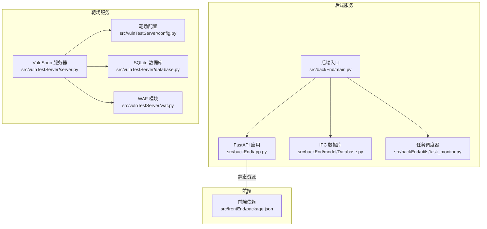
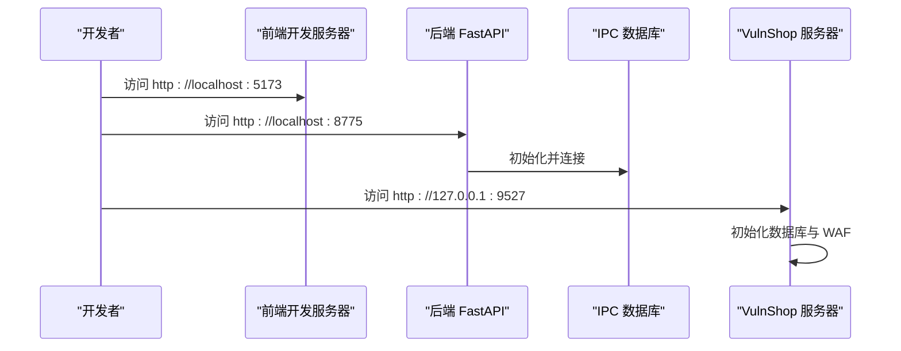
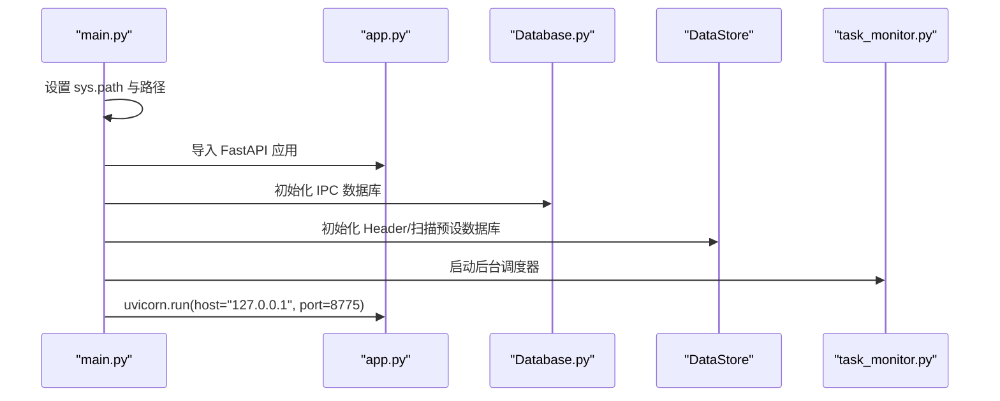
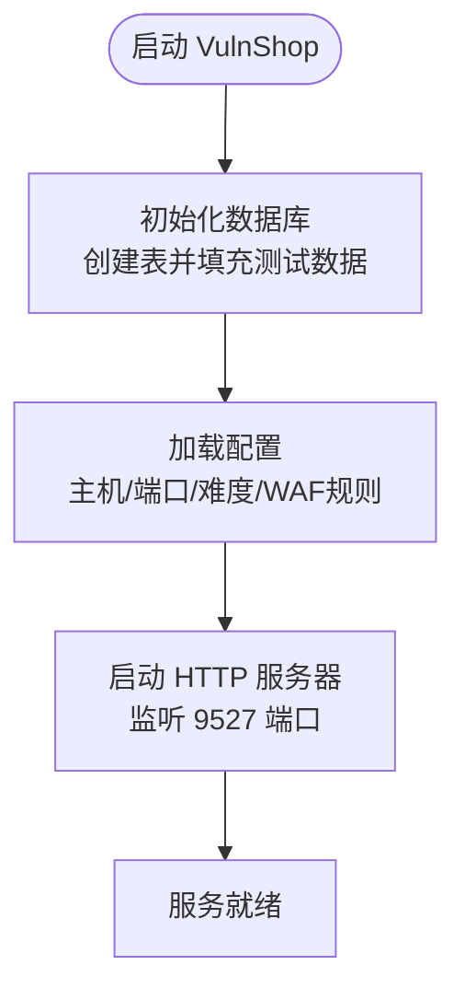
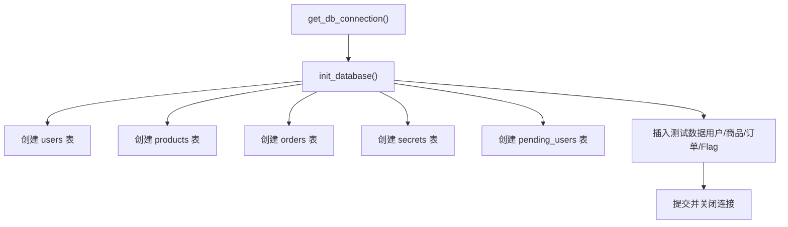
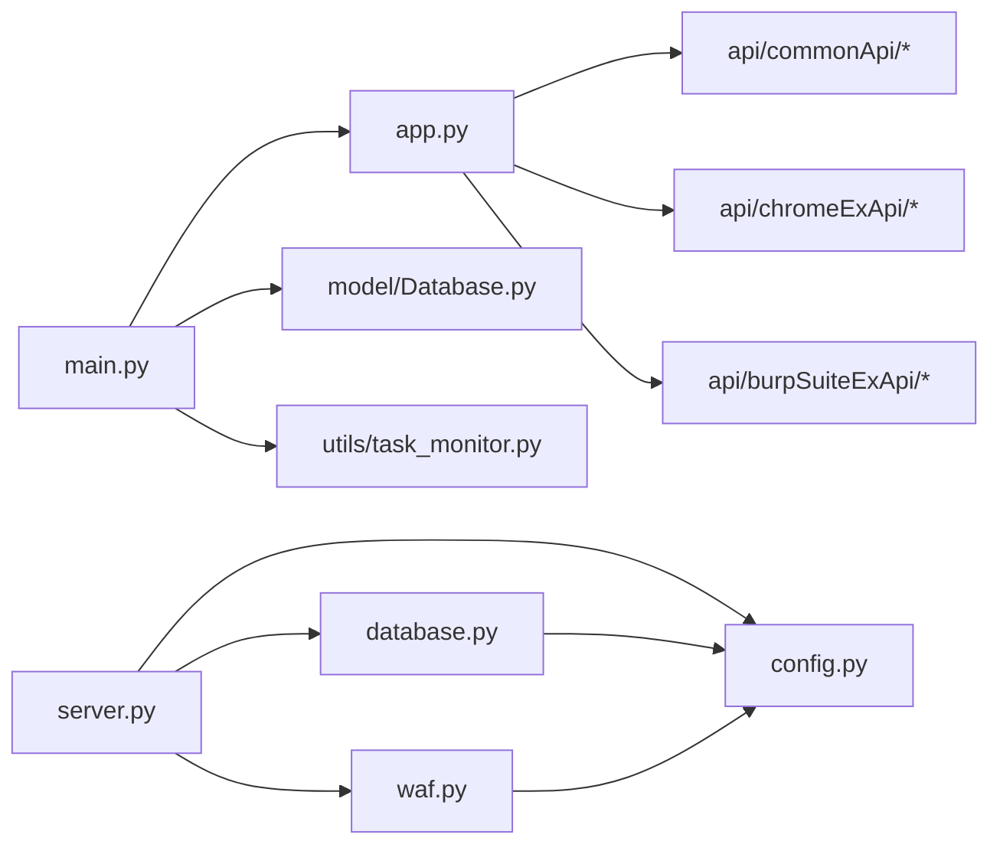

# 环境搭建

<cite>
**本文引用的文件**
- [README.md](file://README.md)
- [src/backEnd/main.py](file://src/backEnd/main.py)
- [src/backEnd/app.py](file://src/backEnd/app.py)
- [src/backEnd/config.py](file://src/backEnd/config.py)
- [src/backEnd/pyproject.toml](file://src/backEnd/pyproject.toml)
- [src/backEnd/.env.example](file://src/backEnd/.env.example)
- [src/backEnd/model/Database.py](file://src/backEnd/model/Database.py)
- [src/backEnd/utils/task_monitor.py](file://src/backEnd/utils/task_monitor.py)
- [src/vulnTestServer/server.py](file://src/vulnTestServer/server.py)
- [src/vulnTestServer/config.py](file://src/vulnTestServer/config.py)
- [src/vulnTestServer/database.py](file://src/vulnTestServer/database.py)
- [src/vulnTestServer/waf.py](file://src/vulnTestServer/waf.py)
- [src/frontEnd/package.json](file://src/frontEnd/package.json)
</cite>

## 目录
1. [简介](#简介)
2. [项目结构](#项目结构)
3. [核心组件](#核心组件)
4. [架构总览](#架构总览)
5. [详细组件分析](#详细组件分析)
6. [依赖关系分析](#依赖关系分析)
7. [性能考虑](#性能考虑)
8. [故障排查指南](#故障排查指南)
9. [结论](#结论)
10. [附录](#附录)

## 简介
本指南面向希望在本地快速搭建并运行 VulnShop 靶场与后端 Web 应用的用户。文档覆盖：
- 基于 Flask 的 Web 应用部署流程（后端 FastAPI 与靶场 HTTP 服务器）
- 配置文件参数说明（数据库、WAF、难度、端口等）
- SQLite 初始化流程（表结构与测试数据）
- 依赖安装步骤与版本要求
- 服务启动命令与端口配置
- 常见问题排查（端口冲突、数据库连接失败等）
- Docker 部署选项与传统方式对比
- 通过代码示例展示配置加载与应用初始化过程

## 项目结构
该项目采用前后端分离架构：
- 后端：基于 FastAPI 的 API 服务，默认监听 8775 端口，提供任务管理、请求头规则、扫描预设等能力，并内嵌 VulnShop 靶场的 HTTP 服务器。
- 靶场：独立的 VulnShop HTTP 服务器，监听 9527 端口，提供多种 SQL 注入场景与 WAF 防护。
- 前端：Vue 3 + Vite，开发时默认监听 5173 端口；生产构建产物由后端静态挂载。

图表来源
- [src/backEnd/main.py](file://src/backEnd/main.py#L118-L168)
- [src/backEnd/app.py](file://src/backEnd/app.py#L1-L80)
- [src/backEnd/model/Database.py](file://src/backEnd/model/Database.py#L1-L99)
- [src/backEnd/utils/task_monitor.py](file://src/backEnd/utils/task_monitor.py#L1-L94)
- [src/vulnTestServer/server.py](file://src/vulnTestServer/server.py#L633-L685)
- [src/vulnTestServer/config.py](file://src/vulnTestServer/config.py#L1-L58)
- [src/vulnTestServer/database.py](file://src/vulnTestServer/database.py#L1-L193)
- [src/vulnTestServer/waf.py](file://src/vulnTestServer/waf.py#L1-L121)
- [src/frontEnd/package.json](file://src/frontEnd/package.json#L1-L50)

章节来源
- [README.md](file://README.md#L116-L175)

## 核心组件
- 后端 FastAPI 应用：负责 API 路由、静态资源挂载、CORS 配置、版本与健康检查端点。
- IPC 数据库：后端内部通信与任务日志存储，使用 SQLite。
- 任务调度器：基于 APScheduler 的后台任务监控与并发控制。
- VulnShop HTTP 服务器：提供电商场景与多种注入点，内置 WAF 与难度等级。
- SQLite 初始化：创建用户、商品、订单、秘密信息等表并填充测试数据。
- 靶场配置：主机、端口、难度、注入类型映射、WAF 规则、日志开关等。

章节来源
- [src/backEnd/app.py](file://src/backEnd/app.py#L1-L80)
- [src/backEnd/main.py](file://src/backEnd/main.py#L118-L168)
- [src/backEnd/model/Database.py](file://src/backEnd/model/Database.py#L1-L99)
- [src/backEnd/utils/task_monitor.py](file://src/backEnd/utils/task_monitor.py#L1-L94)
- [src/vulnTestServer/server.py](file://src/vulnTestServer/server.py#L633-L685)
- [src/vulnTestServer/config.py](file://src/vulnTestServer/config.py#L1-L58)
- [src/vulnTestServer/database.py](file://src/vulnTestServer/database.py#L1-L193)

## 架构总览
后端通过 uvicorn 启动 FastAPI 应用，同时初始化 IPC 数据库与 Header/扫描预设数据库。前端静态资源挂载在 /static，根路径返回 index.html。VulnShop 作为独立 HTTP 服务器运行在 9527 端口，提供注入练习与 WAF 防护。

图表来源
- [src/backEnd/app.py](file://src/backEnd/app.py#L22-L48)
- [src/backEnd/main.py](file://src/backEnd/main.py#L118-L168)
- [src/vulnTestServer/server.py](file://src/vulnTestServer/server.py#L633-L685)

## 详细组件分析

### 后端应用初始化与配置加载
- 入口文件负责设置 sys.path、引入第三方库路径、初始化日志、设置路径、生成管理员令牌、初始化 IPC 与 Header 数据库、启动调度器，并通过 uvicorn 在 8775 端口启动应用。
- FastAPI 应用挂载静态资源目录，启用 CORS，包含多个 API 路由组，并提供版本与健康检查端点。
- 版本常量来自配置模块。

图表来源
- [src/backEnd/main.py](file://src/backEnd/main.py#L118-L168)
- [src/backEnd/app.py](file://src/backEnd/app.py#L1-L80)
- [src/backEnd/model/Database.py](file://src/backEnd/model/Database.py#L1-L99)
- [src/backEnd/utils/task_monitor.py](file://src/backEnd/utils/task_monitor.py#L1-L94)

章节来源
- [src/backEnd/main.py](file://src/backEnd/main.py#L118-L168)
- [src/backEnd/app.py](file://src/backEnd/app.py#L1-L80)
- [src/backEnd/config.py](file://src/backEnd/config.py#L1-L8)

### VulnShop 靶场配置与启动
- 靶场配置文件定义了主机、端口、调试模式、数据库路径、难度等级、注入类型映射、WAF 规则、日志开关与版本信息。
- 服务器启动时会初始化数据库（创建表并插入测试数据），随后启动 HTTP 服务器监听 9527 端口。
- WAF 模块根据难度对输入进行关键字检查与长度限制，必要时抛出拦截异常。

图表来源
- [src/vulnTestServer/server.py](file://src/vulnTestServer/server.py#L633-L685)
- [src/vulnTestServer/config.py](file://src/vulnTestServer/config.py#L1-L58)
- [src/vulnTestServer/database.py](file://src/vulnTestServer/database.py#L1-L193)
- [src/vulnTestServer/waf.py](file://src/vulnTestServer/waf.py#L1-L121)

章节来源
- [src/vulnTestServer/config.py](file://src/vulnTestServer/config.py#L1-L58)
- [src/vulnTestServer/server.py](file://src/vulnTestServer/server.py#L633-L685)
- [src/vulnTestServer/waf.py](file://src/vulnTestServer/waf.py#L1-L121)

### SQLite 数据库初始化与测试数据
- 数据库初始化流程包括：确保数据目录存在、连接 SQLite、按需创建用户、商品、订单、秘密信息、二次注入暂存表；插入测试用户、商品、订单与 Flag；提交事务并关闭连接。
- 提供重置数据库的辅助方法，便于重新初始化。

图表来源
- [src/vulnTestServer/database.py](file://src/vulnTestServer/database.py#L1-L193)

章节来源
- [src/vulnTestServer/database.py](file://src/vulnTestServer/database.py#L1-L193)

### 配置文件参数说明
- 后端 FastAPI 应用配置要点（来自 .env.example）：
  - 运行环境、调试模式、主机、端口
  - 安全相关：密钥、API 令牌
  - 数据库路径（SQLite）
  - SQLMap API 地址与输出目录
  - 日志级别与文件路径
  - CORS 允许来源
- 靶场配置要点（来自 config.py）：
  - 服务器：主机、端口、调试
  - 数据库：SQLite 路径
  - 难度：easy/medium/hard
  - 注入类型映射：各接口对应的注入类型
  - WAF 规则：不同难度下的关键字列表、是否允许绕过、最大长度等
  - 日志：开关与日志文件路径
  - 版本与应用名

章节来源
- [src/backEnd/.env.example](file://src/backEnd/.env.example#L1-L71)
- [src/vulnTestServer/config.py](file://src/vulnTestServer/config.py#L1-L58)

### 依赖安装与版本要求
- 后端依赖（uv 同步）：
  - fastapi[standard]、apscheduler、psutil
  - Python 3.13+
- 前端依赖（pnpm 安装）：
  - Vue 3、TypeScript、PrimeVue、Pinia、Vite 等
- 靶场依赖（Flask）：
  - 若未安装，需手动安装 Flask

章节来源
- [src/backEnd/pyproject.toml](file://src/backEnd/pyproject.toml#L1-L17)
- [src/frontEnd/package.json](file://src/frontEnd/package.json#L1-L50)
- [README.md](file://README.md#L125-L166)

### 服务启动命令与端口配置
- 后端 API 服务：使用 uv 启动，监听 8775 端口（127.0.0.1）。
- VulnShop 靶场：直接运行 server.py，监听 9527 端口（127.0.0.1）。
- 前端开发服务器：默认 5173 端口。

章节来源
- [src/backEnd/main.py](file://src/backEnd/main.py#L161-L168)
- [src/backEnd/app.py](file://src/backEnd/app.py#L22-L48)
- [src/vulnTestServer/server.py](file://src/vulnTestServer/server.py#L633-L685)
- [README.md](file://README.md#L167-L174)

## 依赖关系分析
- 后端：
  - main.py 依赖 app.py、model/Database.py、utils/task_monitor.py
  - app.py 依赖路由模块与配置常量
  - Database.py 依赖 SQLite 与日志模块
  - task_monitor.py 依赖 DataStore 与 psutil
- 靶场：
  - server.py 依赖 config.py、database.py、waf.py
  - database.py 依赖 SQLite 与配置
  - waf.py 依赖 config.py

图表来源
- [src/backEnd/main.py](file://src/backEnd/main.py#L118-L168)
- [src/backEnd/app.py](file://src/backEnd/app.py#L1-L80)
- [src/backEnd/model/Database.py](file://src/backEnd/model/Database.py#L1-L99)
- [src/backEnd/utils/task_monitor.py](file://src/backEnd/utils/task_monitor.py#L1-L94)
- [src/vulnTestServer/server.py](file://src/vulnTestServer/server.py#L1-L200)
- [src/vulnTestServer/config.py](file://src/vulnTestServer/config.py#L1-L58)
- [src/vulnTestServer/database.py](file://src/vulnTestServer/database.py#L1-L193)
- [src/vulnTestServer/waf.py](file://src/vulnTestServer/waf.py#L1-L121)

## 性能考虑
- 后端任务并发控制：通过调度器与锁机制避免数据库竞争，SELECT 查询返回全量结果，注意大数据量时的内存占用。
- 靶场 WAF：不同难度下对输入进行不同程度的检查，硬难度会增加额外正则匹配与长度限制，可能影响请求处理耗时。
- 前端静态资源：后端挂载静态目录，建议生产构建后统一由 Nginx/Apache 提供，减少 Python 侧负担。

[本节为通用指导，不涉及具体文件分析]

## 故障排查指南
- 端口冲突
  - 后端 API 默认 8775，靶场默认 9527。若冲突，请修改对应配置文件中的端口并重启服务。
  - 前端开发服务器默认 5173，如冲突可在 Vite 配置中调整。
- 数据库连接失败
  - 确认 SQLite 数据库文件路径存在且可写；如权限不足，修改目录权限或更换路径。
  - 靶场数据库初始化失败时，尝试重置数据库（仅限本地调用）。
- WAF 拦截
  - 调整难度等级或绕过策略（仅在测试环境中使用）。
- 跨域问题
  - 后端已启用 CORS，若仍出现跨域错误，检查前端请求的 Origin 是否在允许范围内。
- 依赖缺失
  - 后端使用 uv 安装依赖；前端使用 pnpm；靶场如未安装 Flask，需手动安装。

章节来源
- [src/backEnd/.env.example](file://src/backEnd/.env.example#L22-L27)
- [src/vulnTestServer/config.py](file://src/vulnTestServer/config.py#L12-L14)
- [src/backEnd/app.py](file://src/backEnd/app.py#L22-L34)
- [src/vulnTestServer/server.py](file://src/vulnTestServer/server.py#L619-L631)
- [README.md](file://README.md#L125-L166)

## 结论
通过本指南，您可以在本地快速搭建并运行 VulnShop 靶场与后端 Web 应用。建议：
- 先启动后端 API 服务，再启动 VulnShop 靶场，最后启动前端开发服务器。
- 根据测试需求调整难度与注入类型映射。
- 如需生产部署，建议使用容器化方案并结合反向代理统一对外暴露。

[本节为总结性内容，不涉及具体文件分析]

## 附录

### A. 后端启动与配置加载示例路径
- 后端入口与启动：[src/backEnd/main.py](file://src/backEnd/main.py#L118-L168)
- FastAPI 应用与静态资源挂载：[src/backEnd/app.py](file://src/backEnd/app.py#L22-L48)
- 版本常量来源：[src/backEnd/config.py](file://src/backEnd/config.py#L1-L8)
- IPC 数据库初始化：[src/backEnd/model/Database.py](file://src/backEnd/model/Database.py#L72-L99)
- 任务调度器监控逻辑：[src/backEnd/utils/task_monitor.py](file://src/backEnd/utils/task_monitor.py#L36-L94)

### B. 靶场启动与配置示例路径
- 靶场配置参数：[src/vulnTestServer/config.py](file://src/vulnTestServer/config.py#L1-L58)
- 服务器启动与数据库初始化：[src/vulnTestServer/server.py](file://src/vulnTestServer/server.py#L633-L685)
- WAF 拦截与难度切换：[src/vulnTestServer/waf.py](file://src/vulnTestServer/waf.py#L108-L121)
- SQLite 初始化与测试数据：[src/vulnTestServer/database.py](file://src/vulnTestServer/database.py#L23-L176)

### C. 依赖与版本要求
- 后端依赖与 Python 版本：[src/backEnd/pyproject.toml](file://src/backEnd/pyproject.toml#L1-L17)
- 前端依赖：[src/frontEnd/package.json](file://src/frontEnd/package.json#L1-L50)
- README 中的安装与启动步骤：[README.md](file://README.md#L125-L174)