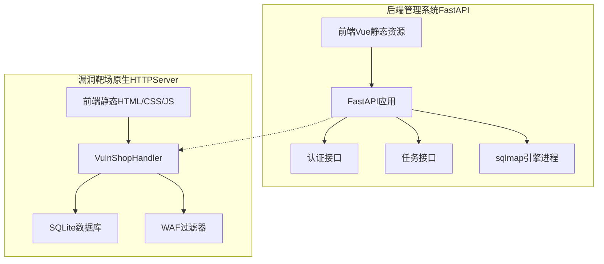
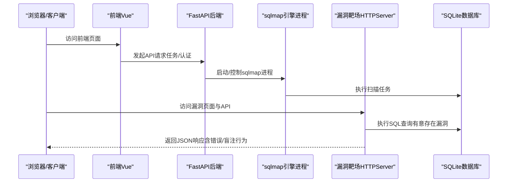
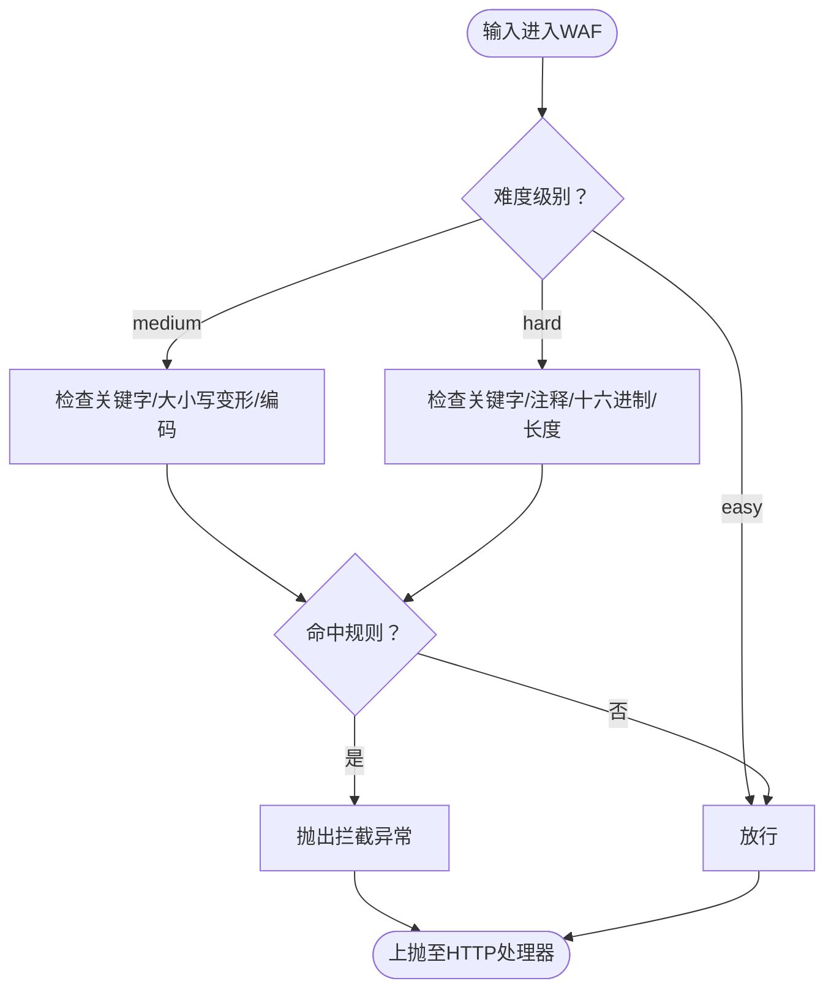
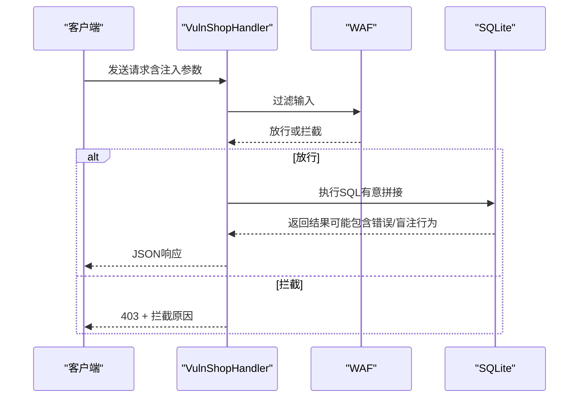
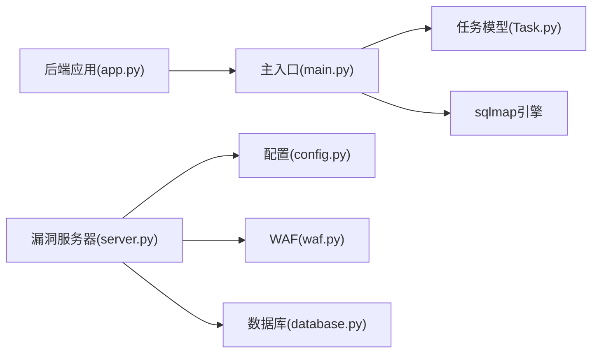

# 靶场架构

<cite>
**本文引用的文件**
- [src/vulnTestServer/server.py](file://src/vulnTestServer/server.py)
- [src/vulnTestServer/waf.py](file://src/vulnTestServer/waf.py)
- [src/vulnTestServer/database.py](file://src/vulnTestServer/database.py)
- [src/vulnTestServer/config.py](file://src/vulnTestServer/config.py)
- [src/vulnTestServer/test_sqli.py](file://src/vulnTestServer/test_sqli.py)
- [src/backEnd/app.py](file://src/backEnd/app.py)
- [src/backEnd/main.py](file://src/backEnd/main.py)
- [src/backEnd/api/commonApi/webTaskController.py](file://src/backEnd/api/commonApi/webTaskController.py)
- [src/backEnd/api/commonApi/authController.py](file://src/backEnd/api/commonApi/authController.py)
- [src/backEnd/model/Task.py](file://src/backEnd/model/Task.py)
- [src/backEnd/config.py](file://src/backEnd/config.py)
</cite>

## 目录
1. [引言](#引言)
2. [项目结构](#项目结构)
3. [核心组件](#核心组件)
4. [架构总览](#架构总览)
5. [详细组件分析](#详细组件分析)
6. [依赖关系分析](#依赖关系分析)
7. [性能考虑](#性能考虑)
8. [故障排查指南](#故障排查指南)
9. [结论](#结论)
10. [附录](#附录)

## 引言
本文件面向“VulnShop漏洞测试环境”的架构文档，聚焦于基于Flask/FastAPI的后端与基于原生HTTPServer的漏洞靶场的协同设计。文档围绕以下目标展开：
- 描述Flask/FastAPI后端的路由定义、请求处理与模板渲染机制；
- 解释多种SQL注入漏洞的实现方式（数字型、字符型、布尔盲注、时间盲注、堆叠查询、二次注入）；
- 阐述WAF（Web应用防火墙）模块的设计，包括检测规则、拦截逻辑与难度级别配置；
- 分析数据库设计，说明如何通过SQLite模拟真实应用场景；
- 讨论测试用例的设计思路，确保覆盖各种SQL注入技术；
- 提供系统架构图，展示各组件之间的关系；
- 以“代码片段路径”形式给出关键实现细节，便于读者定位源码。

## 项目结构
该仓库包含两个主要子系统：
- 后端管理系统（FastAPI）：提供Web界面、任务管理、认证与扫描预设等功能，集成sqlmap引擎作为扫描能力。
- 漏洞靶场（原生HTTPServer）：提供易用的Web页面与REST API，内置多种SQL注入场景与WAF难度控制。

图表来源
- [src/backEnd/app.py](file://src/backEnd/app.py#L1-L80)
- [src/backEnd/main.py](file://src/backEnd/main.py#L1-L168)
- [src/vulnTestServer/server.py](file://src/vulnTestServer/server.py#L1-L685)
- [src/vulnTestServer/database.py](file://src/vulnTestServer/database.py#L1-L193)
- [src/vulnTestServer/waf.py](file://src/vulnTestServer/waf.py#L1-L121)

章节来源
- [src/backEnd/app.py](file://src/backEnd/app.py#L1-L80)
- [src/backEnd/main.py](file://src/backEnd/main.py#L1-L168)
- [src/vulnTestServer/server.py](file://src/vulnTestServer/server.py#L1-L685)
- [src/vulnTestServer/config.py](file://src/vulnTestServer/config.py#L1-L58)

## 核心组件
- FastAPI后端应用：负责路由挂载、CORS配置、静态资源映射、版本与健康检查端点。
- 漏洞靶场HTTP处理器：统一处理GET/POST请求，按路径分发到对应API处理器；内置WAF过滤与错误响应。
- WAF过滤器：根据难度级别（easy/medium/hard）执行关键字匹配、URL解码检测、长度限制等策略。
- SQLite数据库：初始化用户、商品、订单、秘密信息等表，提供测试数据与Flag。
- 测试脚本：自动化验证各类SQL注入场景，辅助教学与验证。

章节来源
- [src/backEnd/app.py](file://src/backEnd/app.py#L1-L80)
- [src/vulnTestServer/server.py](file://src/vulnTestServer/server.py#L1-L685)
- [src/vulnTestServer/waf.py](file://src/vulnTestServer/waf.py#L1-L121)
- [src/vulnTestServer/database.py](file://src/vulnTestServer/database.py#L1-L193)
- [src/vulnTestServer/test_sqli.py](file://src/vulnTestServer/test_sqli.py#L1-L270)

## 架构总览
后端管理系统通过FastAPI提供Web界面与API，内部通过进程方式调用sqlmap引擎；漏洞靶场以原生HTTPServer提供独立的Web页面与REST API，内置多种SQL注入场景与WAF难度控制。两者共享部分工具与配置，便于统一管理。

图表来源
- [src/backEnd/main.py](file://src/backEnd/main.py#L1-L168)
- [src/backEnd/app.py](file://src/backEnd/app.py#L1-L80)
- [src/vulnTestServer/server.py](file://src/vulnTestServer/server.py#L1-L685)
- [src/vulnTestServer/database.py](file://src/vulnTestServer/database.py#L1-L193)

## 详细组件分析

### FastAPI后端应用与路由
- 应用初始化：挂载静态资源目录，启用CORS，注册多个API路由器（Chrome/Burp/通用接口）。
- 根路径与健康检查：返回静态首页与系统健康信息。
- 版本端点：返回后端版本信息，便于前端监控。

章节来源
- [src/backEnd/app.py](file://src/backEnd/app.py#L1-L80)

### 漏洞靶场HTTP处理器与路由分发
- 请求处理流程：统一解析路径与参数，按路径分发到具体API处理器。
- 静态资源：支持/index.html与/static/*路径，防止目录穿越。
- 错误处理：捕获WAF拦截与通用异常，按DEBUG输出SQL错误信息。
- API端点：
  - GET /api/info：返回可用端点与注入类型说明
  - POST /api/user/login：基于错误的SQL注入
  - GET /api/user/profile：联合查询SQL注入
  - GET /api/products/search：布尔盲注
  - GET /api/products/detail：时间盲注
  - GET /api/orders/query：堆叠查询
  - POST /api/user/register：二次注入
  - GET/POST /api/config：难度与调试开关
  - POST /api/database/reset：本地重置数据库

章节来源
- [src/vulnTestServer/server.py](file://src/vulnTestServer/server.py#L1-L685)

### WAF模块设计与难度级别
- 过滤器类：WAFFilter根据DIFFICULTY选择规则集，执行关键字匹配、URL解码检测、长度限制等。
- 拦截逻辑：当检测到违规输入时抛出WAFBlockedException，由HTTP处理器捕获并返回403。
- 难度配置：
  - easy：无防护
  - medium：过滤常见关键字，允许大小写/编码绕过
  - hard：严格过滤，包含注释、十六进制、OR/AND等模式，限制长度

图表来源
- [src/vulnTestServer/waf.py](file://src/vulnTestServer/waf.py#L1-L121)
- [src/vulnTestServer/config.py](file://src/vulnTestServer/config.py#L1-L58)

章节来源
- [src/vulnTestServer/waf.py](file://src/vulnTestServer/waf.py#L1-L121)
- [src/vulnTestServer/config.py](file://src/vulnTestServer/config.py#L1-L58)

### 数据库设计与初始化
- 表结构：
  - users：用户基本信息与余额、管理员标识
  - products：商品信息与库存
  - orders：订单关联用户与商品
  - secrets：Flag与提示信息
  - pending_users：二次注入演示的暂存表
- 初始化流程：创建表、插入测试数据、写入Flag。
- 密码哈希：使用MD5（仅为演示目的，不建议生产使用）。
- 重置数据库：删除DB文件并重新初始化。

章节来源
- [src/vulnTestServer/database.py](file://src/vulnTestServer/database.py#L1-L193)

### SQL注入场景实现与测试用例
- 基于错误的注入（POST /api/user/login）：直接拼接用户名与密码哈希，数据库错误信息用于演示。
- 联合查询注入（GET /api/user/profile）：用户ID直接拼接，支持UNION/ OR注入。
- 布尔盲注（GET /api/products/search）：关键词与分类拼接，仅返回数量差异。
- 时间盲注（GET /api/products/detail）：通过CASE WHEN构造延迟，返回时间差。
- 堆叠查询（GET /api/orders/query）：检测SQL中分号，使用executescript执行多条语句。
- 二次注入（POST /api/user/register）：先安全入库（参数化），再在后续查询中直接拼接存储的用户名。

图表来源
- [src/vulnTestServer/server.py](file://src/vulnTestServer/server.py#L1-L685)
- [src/vulnTestServer/waf.py](file://src/vulnTestServer/waf.py#L1-L121)

章节来源
- [src/vulnTestServer/server.py](file://src/vulnTestServer/server.py#L1-L685)
- [src/vulnTestServer/test_sqli.py](file://src/vulnTestServer/test_sqli.py#L1-L270)

### 后端管理系统与sqlmap集成
- 进程启动：后端通过main.py启动sqlmap引擎，传入配置文件与IPC数据库路径。
- 任务模型：Task封装请求头处理、原始HTTP请求文件生成、引擎启动/停止与进程管理。
- Web任务接口：提供从Web端提交扫描任务的接口，复用相同业务逻辑。

章节来源
- [src/backEnd/main.py](file://src/backEnd/main.py#L1-L168)
- [src/backEnd/model/Task.py](file://src/backEnd/model/Task.py#L1-L333)
- [src/backEnd/api/commonApi/webTaskController.py](file://src/backEnd/api/commonApi/webTaskController.py#L1-L91)

## 依赖关系分析
- 后端管理系统依赖：
  - FastAPI应用与路由注册
  - sqlmap引擎进程（通过subprocess启动）
  - 任务模型与请求头处理服务
- 漏洞靶场依赖：
  - 配置模块（主机、端口、难度、规则）
  - WAF过滤器（按难度执行规则）
  - SQLite数据库（初始化与重置）

图表来源
- [src/backEnd/app.py](file://src/backEnd/app.py#L1-L80)
- [src/backEnd/main.py](file://src/backEnd/main.py#L1-L168)
- [src/backEnd/model/Task.py](file://src/backEnd/model/Task.py#L1-L333)
- [src/vulnTestServer/server.py](file://src/vulnTestServer/server.py#L1-L685)
- [src/vulnTestServer/config.py](file://src/vulnTestServer/config.py#L1-L58)
- [src/vulnTestServer/waf.py](file://src/vulnTestServer/waf.py#L1-L121)
- [src/vulnTestServer/database.py](file://src/vulnTestServer/database.py#L1-L193)

章节来源
- [src/backEnd/app.py](file://src/backEnd/app.py#L1-L80)
- [src/backEnd/main.py](file://src/backEnd/main.py#L1-L168)
- [src/backEnd/model/Task.py](file://src/backEnd/model/Task.py#L1-L333)
- [src/vulnTestServer/server.py](file://src/vulnTestServer/server.py#L1-L685)
- [src/vulnTestServer/config.py](file://src/vulnTestServer/config.py#L1-L58)
- [src/vulnTestServer/waf.py](file://src/vulnTestServer/waf.py#L1-L121)
- [src/vulnTestServer/database.py](file://src/vulnTestServer/database.py#L1-L193)

## 性能考虑
- 漏洞靶场采用原生HTTPServer，单线程处理请求，适合教学演示与本地测试。
- WAF在easy难度下几乎无开销；medium/hard难度增加字符串处理与正则匹配成本。
- SQLite在本地测试场景性能良好，但在高并发或大数据量下建议迁移至更健壮的数据库。
- sqlmap引擎为外部进程，启动与扫描耗时较长，建议在后台调度与缓存策略上优化。

## 故障排查指南
- 健康检查端点：后端提供健康检查与版本信息，便于前端监控服务状态。
- 错误响应：HTTP处理器在DEBUG模式下返回SQL错误信息，便于定位注入点。
- WAF拦截：若出现403且提示关键字或编码检测，需调整payload或降低难度。
- 数据库重置：仅允许本地访问重置数据库，避免误操作影响测试环境。

章节来源
- [src/backEnd/app.py](file://src/backEnd/app.py#L61-L80)
- [src/vulnTestServer/server.py](file://src/vulnTestServer/server.py#L1-L685)
- [src/vulnTestServer/waf.py](file://src/vulnTestServer/waf.py#L1-L121)

## 结论
VulnShop通过“后端管理系统+漏洞靶场”的双轨架构，既满足了教学演示的易用性，又提供了丰富的SQL注入实践场景。WAF模块与难度级别设计使学习者能够循序渐进地掌握绕过技巧与防护手段。SQLite数据库简化了部署与维护，测试脚本保证了各注入点的有效性验证。建议在生产环境中替换WAF与数据库实现，并加强安全边界与并发处理能力。

## 附录
- 关键实现路径参考：
  - FastAPI应用与路由：[src/backEnd/app.py](file://src/backEnd/app.py#L1-L80)
  - 后端主入口与sqlmap集成：[src/backEnd/main.py](file://src/backEnd/main.py#L1-L168)
  - 漏洞服务器与API处理器：[src/vulnTestServer/server.py](file://src/vulnTestServer/server.py#L1-L685)
  - WAF过滤器与难度控制：[src/vulnTestServer/waf.py](file://src/vulnTestServer/waf.py#L1-L121)
  - 数据库初始化与重置：[src/vulnTestServer/database.py](file://src/vulnTestServer/database.py#L1-L193)
  - 配置与难度规则：[src/vulnTestServer/config.py](file://src/vulnTestServer/config.py#L1-L58)
  - 自动化测试脚本：[src/vulnTestServer/test_sqli.py](file://src/vulnTestServer/test_sqli.py#L1-L270)
  - Web任务接口与认证接口：[src/backEnd/api/commonApi/webTaskController.py](file://src/backEnd/api/commonApi/webTaskController.py#L1-L91), [src/backEnd/api/commonApi/authController.py](file://src/backEnd/api/commonApi/authController.py#L1-L150)