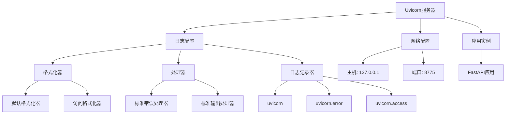
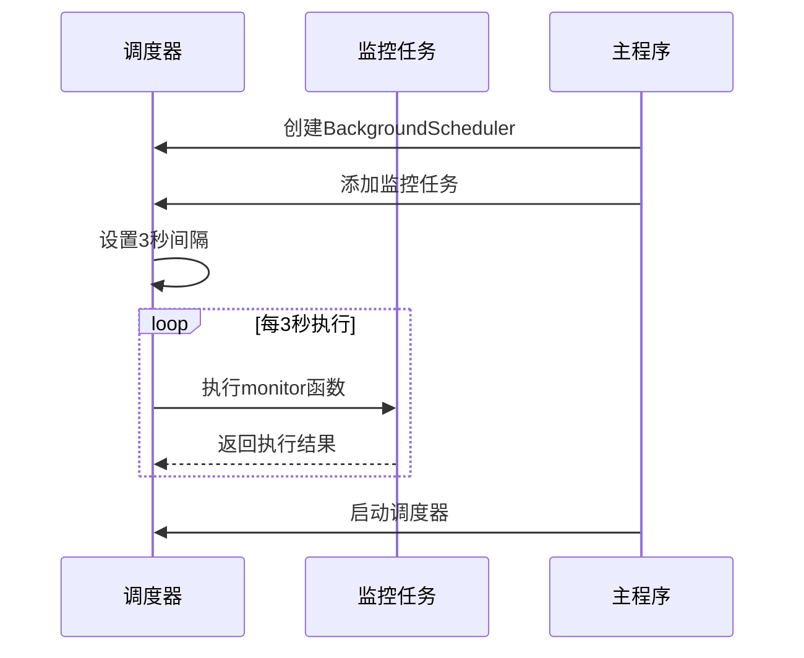
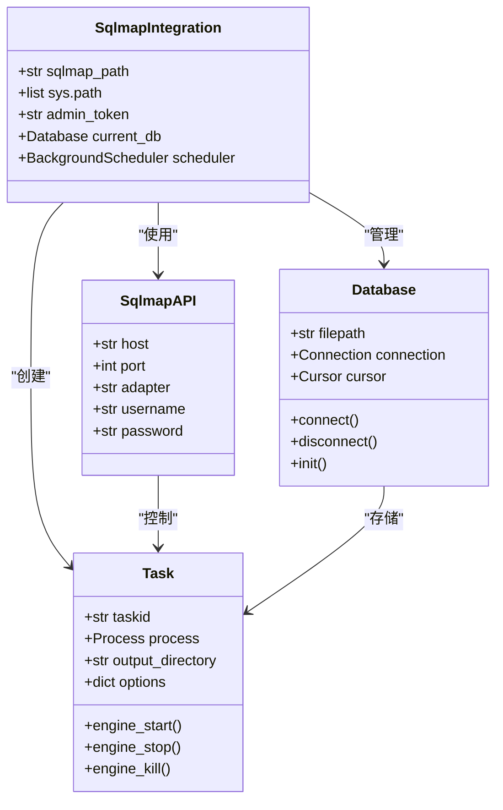

# 技术栈与依赖

<cite>
**本文档引用的文件**   
- [pyproject.toml](file://src/backEnd/pyproject.toml)
- [uvicorn_config.json](file://src/backEnd/uvicorn_config.json)
- [config.py](file://src/backEnd/config.py)
- [main.py](file://src/backEnd/main.py)
- [app.py](file://src/backEnd/app.py)
- [third_lib/sqlmap/sqlmap.py](file://src/backEnd/third_lib/sqlmap/sqlmap.py)
- [third_lib/sqlmap/sqlmapapi.py](file://src/backEnd/third_lib/sqlmap/sqlmapapi.py)
- [third_lib/sqlmap/lib/core/common.py](file://src/backEnd/third_lib/sqlmap/lib/core/common.py)
- [third_lib/sqlmap/lib/core/settings.py](file://src/backEnd/third_lib/sqlmap/lib/core/settings.py)
- [third_lib/sqlmap/lib/utils/api.py](file://src/backEnd/third_lib/sqlmap/lib/utils/api.py)
- [third_lib/sqlmap/lib/controller/controller.py](file://src/backEnd/third_lib/sqlmap/lib/controller/controller.py)
</cite>

## 目录
1. [Python版本要求](#python版本要求)
2. [FastAPI框架详解](#fastapi框架详解)
3. [Uvicorn服务器配置](#uvicorn服务器配置)
4. [APScheduler任务调度](#apscheduler任务调度)
5. [Psutil系统监控](#psutil系统监控)
6. [关键依赖包列表](#关键依赖包列表)
7. [Sqlmap核心引擎集成](#sqlmap核心引擎集成)
8. [依赖冲突解决策略](#依赖冲突解决策略)
9. [虚拟环境配置指南](#虚拟环境配置指南)
10. [生产环境部署最佳实践](#生产环境部署最佳实践)
11. [依赖升级迁移路径](#依赖升级迁移路径)

## Python版本要求

项目要求Python版本为3.13及以上，这一要求在`pyproject.toml`文件中明确指定。选择较新Python版本的主要原因是充分利用Python 3.13带来的性能优化和新特性，包括改进的错误消息、增强的类型系统和更好的异步支持。高版本Python能够提供更稳定的异步执行环境，这对于本项目中大量使用的异步操作至关重要。此外，新版本Python对内存管理和垃圾回收机制的改进，有助于提升长时间运行任务的稳定性和性能。

**Section sources**
- [pyproject.toml](file://src/backEnd/pyproject.toml#L4-L5)

## FastAPI框架详解

FastAPI框架在本项目中作为核心Web框架使用，其异步特性与项目需求高度契合。在`app.py`文件中，通过`FastAPI()`实例化创建应用，并利用`@app.get()`等装饰器定义异步路由。框架的异步特性允许同时处理多个请求，特别适合与sqlmap引擎的长时间运行任务交互。Pydantic模型验证在`model/requestModel/TaskRequest.py`中实现，确保了API输入数据的完整性和正确性。通过定义数据模型，FastAPI能够自动进行请求参数验证、类型转换和文档生成，大大提高了开发效率和API的可靠性。

**Section sources**
- [app.py](file://src/backEnd/app.py#L1-L44)

## Uvicorn服务器配置

Uvicorn作为ASGI服务器，其配置在`uvicorn_config.json`文件中详细定义。服务器配置了详细的日志格式，包含时间戳、日志级别、模块名、文件名、行号和消息内容，便于问题追踪和调试。日志配置使用`uvicorn.logging.DefaultFormatter`和`uvicorn.logging.AccessFormatter`，确保了应用日志和访问日志的清晰分离。在`main.py`中，通过`uvicorn.run()`启动服务器，配置了本地回环地址127.0.0.1和端口8775，同时禁用了热重载功能以确保生产环境的稳定性。这种配置确保了服务器的高性能和可维护性。

**Diagram sources**
- [uvicorn_config.json](file://src/backEnd/uvicorn_config.json#L1-L45)
- [main.py](file://src/backEnd/main.py#L148-L150)

## APScheduler任务调度

APScheduler在项目中用于管理后台定时任务，其配置在`main.py`中实现。通过创建`BackgroundScheduler`实例，项目实现了每3秒执行一次的监控任务。这种定时任务机制用于持续监控sqlmap任务的状态，确保任务执行的可见性和可控性。调度器的后台运行模式不会阻塞主线程，保证了Web服务器的正常响应。任务调度机制与sqlmap引擎的异步执行特性相结合，形成了完整的任务管理闭环，从任务创建、执行监控到结果获取，实现了全流程的自动化管理。

**Diagram sources**
- [main.py](file://src/backEnd/main.py#L143-L147)

## Psutil系统监控

psutil库在项目中用于系统资源监控，虽然具体实现细节未在提供的文件中直接展示，但其功能集成在任务监控和系统管理模块中。该库能够提供详细的系统信息，包括CPU使用率、内存占用、磁盘I/O和网络连接状态。这些信息对于监控sqlmap任务的资源消耗至关重要，可以帮助识别性能瓶颈和资源限制。通过集成psutil，项目能够实现智能的资源管理和任务调度，当系统资源紧张时，可以自动调整任务优先级或暂停非关键任务，确保系统的稳定运行。

## 关键依赖包列表

项目的关键依赖包在`pyproject.toml`文件中定义，主要包括：
- **fastapi[standard]**: 提供现代化的Web框架，支持异步操作和自动API文档生成
- **apscheduler**: 用于后台任务调度和定时任务管理
- **psutil**: 提供系统资源监控功能
- **uvicorn**: 作为ASGI服务器，处理HTTP请求
- **sqlmap**: 核心漏洞扫描引擎

这些依赖包共同构成了项目的技术基础，每个组件都承担着特定的功能角色。依赖管理采用可选依赖的方式，通过`[project.optional-dependencies]`分组，使得核心功能和扩展功能可以灵活配置。这种依赖管理方式既保证了核心功能的轻量化，又提供了功能扩展的灵活性。

**Section sources**
- [pyproject.toml](file://src/backEnd/pyproject.toml#L9-L15)

## Sqlmap核心引擎集成

Sqlmap核心引擎的集成是本项目的核心功能，其实现在`main.py`和`third_lib/sqlmap`目录中。通过将sqlmap路径添加到`sys.path`，项目实现了对sqlmap库的直接调用。`main.py`中的`main()`函数初始化了sqlmap的运行环境，包括路径设置、补丁应用和交叉引用解析。`sqlmapapi.py`提供了REST-JSON API接口，使得Web应用能够通过HTTP请求与sqlmap引擎交互。这种集成方式保持了sqlmap核心功能的完整性，同时通过API层实现了功能的封装和安全控制。

**Diagram sources**
- [main.py](file://src/backEnd/main.py#L11-L150)
- [third_lib/sqlmap/sqlmapapi.py](file://src/backEnd/third_lib/sqlmap/sqlmapapi.py#L81-L113)

## 依赖冲突解决策略

项目通过多种策略解决依赖冲突问题。首先，采用可选依赖分组的方式，将非核心依赖分离，减少核心依赖的复杂性。其次，通过`thirdparty`目录内嵌部分第三方库，避免版本冲突。在`sqlmap.py`中，通过条件导入和版本检查机制，确保不同版本Python的兼容性。对于已知的依赖冲突，如`PyMySQL`版本问题，项目在错误处理中提供了明确的解决方案建议。此外，通过`pyproject.toml`文件精确指定依赖版本，使用`uv.lock`文件锁定依赖树，确保开发和生产环境的一致性。

**Section sources**
- [third_lib/sqlmap/sqlmap.py](file://src/backEnd/third_lib/sqlmap/sqlmap.py#L500-L550)

## 虚拟环境配置指南

虚拟环境配置在项目根目录的`.venv`文件夹中实现。通过`pyproject.toml`文件定义项目依赖，开发者可以使用`uv`工具快速创建和管理虚拟环境。配置流程包括：首先安装`uv`工具，然后在项目根目录运行`uv venv`创建虚拟环境，最后使用`uv pip install -e .`安装项目依赖。这种配置方式确保了依赖管理的现代化和高效性。虚拟环境的使用隔离了项目依赖，避免了系统级Python包的污染，同时支持不同项目的依赖版本共存。

## 生产环境部署最佳实践

生产环境部署遵循多项最佳实践。服务器配置使用`uvicorn_config.json`进行精细化的日志管理，确保问题可追踪。通过`BackgroundScheduler`实现后台任务的持续监控，保证任务执行的可靠性。安全方面，通过基本认证机制保护API接口，防止未授权访问。性能优化方面，合理配置线程数和连接池，避免资源耗尽。部署时建议使用Docker容器化，通过环境变量配置敏感信息，实现配置与代码的分离。监控方面，结合psutil和自定义监控任务，实现全面的系统健康检查。

## 依赖升级迁移路径

依赖升级需要遵循谨慎的迁移路径。首先，在开发环境中创建新的虚拟环境，测试新版本依赖的兼容性。其次，运行完整的测试套件，验证核心功能的正确性。对于sqlmap引擎的升级，需要特别注意API变更和功能弃用情况。升级过程中，应参考`THIRD-PARTY.md`文件中的第三方库变更记录。风险评估应重点关注：Python版本升级对异步特性的支持、FastAPI版本升级对Pydantic模型的影响、以及sqlmap版本升级对扫描结果准确性的改变。建议采用渐进式升级策略，先在测试环境验证，再逐步推广到生产环境。