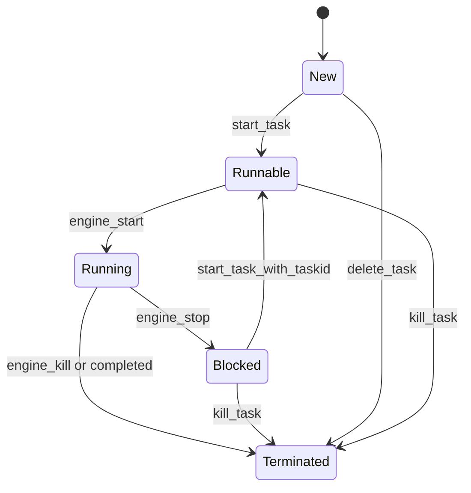

# 任务模型

<cite>
**本文档引用的文件**   
- [Task.py](file://src/backEnd/model/Task.py)
- [TaskStatus.py](file://src/backEnd/model/TaskStatus.py)
- [taskService.py](file://src/backEnd/service/taskService.py)
- [Database.py](file://src/backEnd/model/Database.py)
- [DataStore.py](file://src/backEnd/model/DataStore.py)
- [header_processor.py](file://src/backEnd/utils/header_processor.py)
- [PersistentHeaderRule.py](file://src/backEnd/model/PersistentHeaderRule.py)
- [SessionHeader.py](file://src/backEnd/model/SessionHeader.py)
- [headerRuleService.py](file://src/backEnd/service/headerRuleService.py)
</cite>

## 目录
1. [简介](#简介)
2. [任务模型字段定义](#任务模型字段定义)
3. [任务状态枚举](#任务状态枚举)
4. [任务生命周期管理](#任务生命周期管理)
5. [任务配置参数继承与默认值](#任务配置参数继承与默认值)
6. [任务状态机图](#任务状态机图)
7. [任务数据持久化与序列化](#任务数据持久化与序列化)
8. [任务并发控制与资源隔离](#任务并发控制与资源隔离)
9. [任务模型扩展指导](#任务模型扩展指导)
10. [附录](#附录)

## 简介

本文档全面描述了SQLMapWebUI系统中的任务模型，包括任务类的字段定义、状态枚举、生命周期管理、配置参数继承、数据持久化等核心概念。任务模型是系统的核心组件，负责管理SQL注入扫描任务的创建、执行、监控和清理全过程。通过本模型，系统实现了对扫描任务的精细化控制和状态管理。

**Section sources**
- [Task.py](file://src/backEnd/model/Task.py#L1-L206)
- [TaskStatus.py](file://src/backEnd/model/TaskStatus.py#L1-L8)

## 任务模型字段定义

任务模型（Task类）定义了扫描任务的核心属性，每个字段都有明确的数据类型和约束条件：

- **taskid**：任务唯一标识符，字符串类型，在任务创建时生成
- **status**：任务当前状态，类型为TaskStatus枚举，默认值为New
- **start_datetime**：任务启动时间，datetime类型，初始值为None
- **scanUrl**：目标扫描URL，字符串类型，记录需要进行SQL注入检测的地址
- **host**：目标主机域名，字符串类型，用于标识扫描目标
- **headers**：HTTP请求头列表，列表类型，包含扫描请求所需的所有头部信息
- **body**：HTTP请求体内容，字符串类型，包含POST请求的负载数据
- **remote_addr**：客户端IP地址，字符串类型，记录发起扫描请求的客户端地址
- **process**：子进程对象，Popen类型，指向正在执行的SQLMap扫描进程
- **output_directory**：输出目录路径，字符串类型，初始值为None
- **options**：扫描配置选项，AttribDict类型，存储所有SQLMap命令行参数
- **_original_options**：原始配置选项副本，AttribDict类型，用于重置配置
- **_header_rules_applied**：请求头规则应用标记，布尔类型，初始值为False

**Section sources**
- [Task.py](file://src/backEnd/model/Task.py#L18-L205)

## 任务状态枚举

TaskStatus枚举类定义了任务的五种状态及其转换逻辑：

- **New**：新建状态，任务刚创建但尚未准备执行
- **Runnable**：可运行状态，任务已准备好可以启动执行
- **Running**：运行中状态，任务正在执行扫描操作
- **Blocked**：阻塞状态，任务被暂停或停止
- **Terminated**：终止状态，任务已结束，无论成功或失败

状态转换遵循严格的业务逻辑：新建任务首先变为Runnable状态，启动后进入Running状态，暂停时转为Blocked状态，最终完成或被终止时进入Terminated状态。系统通过状态机确保任务状态转换的正确性和一致性。

**Section sources**
- [TaskStatus.py](file://src/backEnd/model/TaskStatus.py#L3-L8)

## 任务生命周期管理

任务生命周期管理机制涵盖了任务从创建到清理的完整流程：

### 任务创建
任务通过Task类的构造函数创建，初始化时设置默认状态为New，并调用initialize_options方法设置SQLMap的默认配置参数。同时，系统会立即应用请求头规则，确保扫描请求的头部信息符合预设规则。

### 任务启动
通过engine_start方法启动任务，该方法首先确保请求头规则已应用，然后创建临时配置文件，最后启动SQLMap子进程执行扫描。启动前会将任务状态设置为Runnable。

### 任务暂停
通过engine_stop方法暂停任务，该方法调用子进程的terminate方法请求优雅终止。暂停后任务状态变为Blocked，允许后续恢复执行。

### 任务停止
通过engine_kill方法强制停止任务，该方法调用子进程的kill方法强制终止。这通常用于紧急情况或长时间无响应的任务。

### 任务清理
任务终止后，系统会从内存中的任务池移除该任务，并释放相关资源。flush_task方法可批量清理所有任务，用于系统重启或维护。

**Section sources**
- [Task.py](file://src/backEnd/model/Task.py#L18-L205)
- [taskService.py](file://src/backEnd/service/taskService.py#L1-L531)

## 任务配置参数继承与默认值

任务配置参数采用继承和默认值策略，确保配置的一致性和灵活性：

### 配置初始化
initialize_options方法负责初始化任务配置，遍历optDict中的所有可用选项，根据类型设置默认值：
- 布尔类型默认为False
- 字符串类型默认为None
- 整数类型默认为None
- 浮点类型默认为None

### 系统级配置
所有任务继承统一的系统级配置：
- api模式启用，标识通过API调用
- taskid设置为当前任务ID
- database设置为IPC数据库路径
- batch模式启用，避免交互式提示
- 禁用颜色输出和ETA显示

### 配置管理
- set_option：设置单个配置项
- get_option：获取单个配置项
- get_options：获取所有配置项
- reset_options：重置为初始配置

这种设计允许在任务执行过程中动态调整扫描参数，同时保留恢复默认配置的能力。

**Section sources**
- [Task.py](file://src/backEnd/model/Task.py#L18-L205)

## 任务状态机图

**Diagram sources**
- [Task.py](file://src/backEnd/model/Task.py#L18-L205)
- [taskService.py](file://src/backEnd/service/taskService.py#L1-L531)

## 任务数据持久化与序列化

任务数据持久化通过多层机制实现：

### 内存存储
DataStore类使用OrderedDict在内存中存储所有活动任务，通过线程锁tasks_lock确保多线程环境下的数据一致性。

### 数据库持久化
Database类负责与SQLite数据库交互，存储任务的扫描结果：
- logs表：记录扫描日志
- data表：存储检测到的注入点
- errors表：记录扫描过程中的错误

### 序列化机制
- 任务配置通过saveConfig函数序列化到临时文件
- 使用tempfile.mkstemp创建临时配置文件
- 配置文件以文本模式保存，供SQLMap进程读取
- 扫描结果通过数据库连接异步写入

### 进程通信
通过文件路径传递配置，实现父进程与SQLMap子进程的通信。子进程读取配置文件后执行扫描，并将结果写入共享数据库。

**Section sources**
- [Task.py](file://src/backEnd/model/Task.py#L18-L205)
- [Database.py](file://src/backEnd/model/Database.py#L1-L98)
- [DataStore.py](file://src/backEnd/model/DataStore.py#L1-L33)

## 任务并发控制与资源隔离

系统通过多种机制实现任务并发控制和资源隔离：

### 并发控制
- 使用全局任务锁tasks_lock保护任务池的读写操作
- 限制最大并发任务数（max_tasks_count）
- 通过线程安全的OrderedDict管理任务集合

### 资源隔离
- 每个任务使用独立的临时配置文件
- 任务进程相互隔离，避免资源竞争
- 输出目录隔离，防止结果混淆

### 请求头规则应用
apply_header_rules方法确保请求头规则在扫描启动前应用：
- 检查是否已应用规则，避免重复处理
- 获取持久化规则和会话性请求头
- 处理请求头并更新到任务配置
- 标记规则已应用状态

### 会话管理
通过SessionHeaderManager管理会话性请求头，为不同客户端IP维护独立的请求头集合，实现多用户环境下的资源隔离。

**Section sources**
- [Task.py](file://src/backEnd/model/Task.py#L18-L205)
- [DataStore.py](file://src/backEnd/model/DataStore.py#L1-L33)
- [header_processor.py](file://src/backEnd/utils/header_processor.py#L1-L241)
- [headerRuleService.py](file://src/backEnd/service/headerRuleService.py#L1-L799)

## 任务模型扩展指导

为开发者提供以下任务模型扩展指导原则：

### 添加新的扫描选项
1. 确认新选项不在RESTAPI_UNSUPPORTED_OPTIONS列表中
2. 在optDict中定义选项的类型和默认值
3. 通过set_option方法支持运行时配置
4. 在initialize_options中设置合理的默认值

### 扩展状态类型
1. 谨慎添加新状态，优先使用现有状态组合
2. 如需添加，应在TaskStatus枚举中定义
3. 更新状态机图和相关转换逻辑
4. 修改所有状态检查的条件判断

### 增强请求头处理
1. 扩展ReplaceStrategy枚举以支持新替换策略
2. 在HeaderProcessor中实现新的处理逻辑
3. 更新PersistentHeaderRule模型以支持新特性
4. 在headerRuleService中提供相应的管理接口

### 性能优化建议
1. 避免在任务关键路径上执行耗时操作
2. 使用批量数据库操作减少I/O开销
3. 缓存频繁访问的配置数据
4. 异步处理非关键任务

**Section sources**
- [Task.py](file://src/backEnd/model/Task.py#L18-L205)
- [TaskStatus.py](file://src/backEnd/model/TaskStatus.py#L3-L8)
- [PersistentHeaderRule.py](file://src/backEnd/model/PersistentHeaderRule.py#L1-L68)
- [headerRuleService.py](file://src/backEnd/service/headerRuleService.py#L1-L799)

## 附录

### 任务服务API
- star_task：启动新任务
- delete_task：删除任务
- list_task：列出所有任务
- kill_task：强制终止任务
- stop_task：暂停任务
- start_task_with_taskid：恢复暂停的任务

### 错误处理
系统通过BaseResponseMsg统一返回格式，包含data、msg、success和code字段，确保API响应的一致性和可预测性。

**Section sources**
- [taskService.py](file://src/backEnd/service/taskService.py#L1-L531)
- [BaseResponseMsg.py](file://src/backEnd/model/BaseResponseMsg.py#L1-L10)